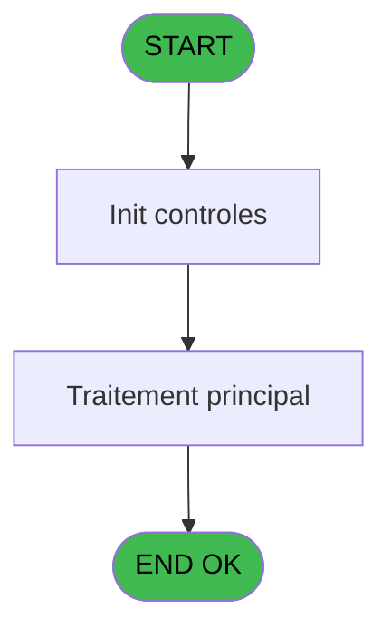
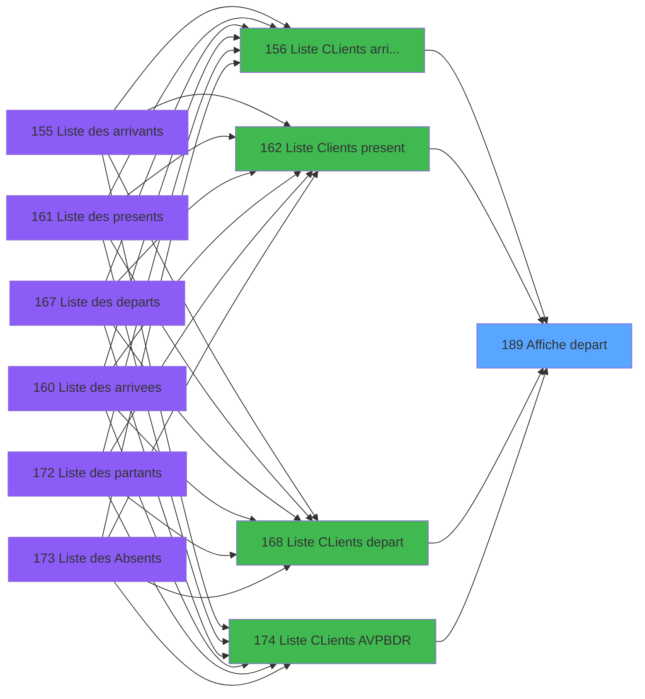
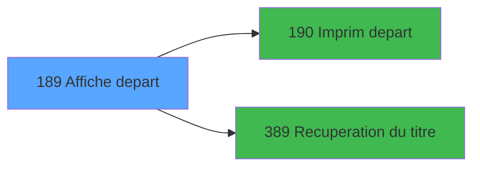

# PBP IDE 189 - Affiche depart

> **Analyse**: Phases 1-4 2026-02-03 15:43 -> 15:43 (15s) | Assemblage 15:43
> **Pipeline**: V7.2 Enrichi
> **Structure**: 4 onglets (Resume | Ecrans | Donnees | Connexions)

<!-- TAB:Resume -->

## 1. FICHE D'IDENTITE

| Attribut | Valeur |
|----------|--------|
| Projet | PBP |
| IDE Position | 189 |
| Nom Programme | Affiche depart |
| Fichier source | `Prg_189.xml` |
| Dossier IDE | Liste |
| Taches | 1 (1 ecrans visibles) |
| Tables modifiees | 0 |
| Programmes appeles | 2 |

## 2. DESCRIPTION FONCTIONNELLE

**Affiche depart** assure la gestion complete de ce processus, accessible depuis [  Liste CLients arrivant (IDE 156)](PBP-IDE-156.md), [  Liste Clients present (IDE 162)](PBP-IDE-162.md), [  Liste CLients depart (IDE 168)](PBP-IDE-168.md), [Liste CLients AVPBDR (IDE 174)](PBP-IDE-174.md).

Le flux de traitement s'organise en **1 blocs fonctionnels** :

- **Consultation** (1 tache) : ecrans de recherche, selection et consultation

**Logique metier** : 3 regles identifiees couvrant conditions metier.

## 3. BLOCS FONCTIONNELS

### 3.1 Consultation (1 tache)

Ecrans de recherche et consultation.

---

#### 189 - Affiche depart [[ECRAN]](#ecran-t1)

**Role** : Reinitialisation : Affiche depart.
**Ecran** : 1189 x 224 DLU (MDI) | [Voir mockup](#ecran-t1)

## 5. REGLES METIER

3 regles identifiees:

### Autres (3 regles)

#### [RM-001] Si v. titre [I]='F' alors 'Me' sinon 'M')

| Element | Detail |
|---------|--------|
| **Condition** | `v. titre [I]='F'` |
| **Si vrai** | 'Me' |
| **Si faux** | 'M') |
| **Variables** | I (v. titre) |
| **Expression source** | Expression 4 : `IF (v. titre [I]='F','Me','M')` |
| **Exemple** | Si v. titre [I]='F' → 'Me'. Sinon → 'M') |

#### [RM-002] Traitement si [M]='F','Me',IF([M] est renseigne

| Element | Detail |
|---------|--------|
| **Condition** | `[M]='F'` |
| **Si vrai** | 'Me' |
| **Si faux** | IF([M]<>'','M','')) |
| **Expression source** | Expression 5 : `IF ([M]='F','Me',IF([M]<>'','M',''))` |
| **Exemple** | Si [M]='F' → 'Me'. Sinon → IF([M]<>'','M','')) |

#### [RM-003] Si [AL]='T' alors 21 sinon 25)

| Element | Detail |
|---------|--------|
| **Condition** | `[AL]='T'` |
| **Si vrai** | 21 |
| **Si faux** | 25) |
| **Expression source** | Expression 14 : `IF([AL]='T',21,25)` |
| **Exemple** | Si [AL]='T' → 21. Sinon → 25) |

## 6. CONTEXTE

- **Appele par**: [  Liste CLients arrivant (IDE 156)](PBP-IDE-156.md), [  Liste Clients present (IDE 162)](PBP-IDE-162.md), [  Liste CLients depart (IDE 168)](PBP-IDE-168.md), [Liste CLients AVPBDR (IDE 174)](PBP-IDE-174.md)
- **Appelle**: 2 programmes | **Tables**: 1 (W:0 R:1 L:0) | **Taches**: 1 | **Expressions**: 16

<!-- TAB:Ecrans -->

## 8. ECRANS

### 8.1 Forms visibles (1 / 1)

| # | Position | Tache | Nom | Type | Largeur | Hauteur | Bloc |
|---|----------|-------|-----|------|---------|---------|------|
| 1 | 189 | 189 | Affiche depart | MDI | 1189 | 224 | Consultation |

### 8.2 Mockups Ecrans

---

#### 189 - Affiche depart
**Tache** : [189](#t1) | **Type** : MDI | **Dimensions** : 1189 x 224 DLU
**Bloc** : Consultation | **Titre IDE** : Affiche depart

<!-- FORM-DATA:
{
    "width":  1189,
    "vFactor":  8,
    "type":  "MDI",
    "hFactor":  8,
    "controls":  [
                     {
                         "x":  0,
                         "type":  "label",
                         "var":  "",
                         "y":  0,
                         "w":  1182,
                         "fmt":  "",
                         "name":  "",
                         "h":  19,
                         "color":  "",
                         "text":  "",
                         "parent":  null
                     },
                     {
                         "x":  16,
                         "type":  "table",
                         "var":  "",
                         "name":  "",
                         "titleH":  12,
                         "color":  "110",
                         "w":  967,
                         "y":  31,
                         "fmt":  "",
                         "parent":  null,
                         "text":  "",
                         "rowH":  12,
                         "h":  132,
                         "cols":  [
                                      {
                                          "title":  "Sx",
                                          "layer":  1,
                                          "w":  52
                                      },
                                      {
                                          "title":  "Nom",
                                          "layer":  2,
                                          "w":  188
                                      },
                                      {
                                          "title":  "Prénom",
                                          "layer":  3,
                                          "w":  168
                                      },
                                      {
                                          "title":  "S",
                                          "layer":  4,
                                          "w":  32
                                      },
                                      {
                                          "title":  "",
                                          "layer":  5,
                                          "w":  66
                                      },
                                      {
                                          "title":  "Sx",
                                          "layer":  6,
                                          "w":  39
                                      },
                                      {
                                          "title":  "Nom",
                                          "layer":  7,
                                          "w":  188
                                      },
                                      {
                                          "title":  "Prénom",
                                          "layer":  8,
                                          "w":  168
                                      },
                                      {
                                          "title":  "S",
                                          "layer":  9,
                                          "w":  32
                                      }
                                  ],
                         "rows":  9
                     },
                     {
                         "x":  994,
                         "type":  "label",
                         "var":  "",
                         "y":  27,
                         "w":  188,
                         "fmt":  "",
                         "name":  "",
                         "h":  164,
                         "color":  "",
                         "text":  "",
                         "parent":  null
                     },
                     {
                         "x":  16,
                         "type":  "label",
                         "var":  "",
                         "y":  164,
                         "w":  967,
                         "fmt":  "",
                         "name":  "",
                         "h":  27,
                         "color":  "",
                         "text":  "",
                         "parent":  null
                     },
                     {
                         "x":  117,
                         "type":  "label",
                         "var":  "",
                         "y":  172,
                         "w":  32,
                         "fmt":  "",
                         "name":  "",
                         "h":  8,
                         "color":  "",
                         "text":  "Vol",
                         "parent":  22
                     },
                     {
                         "x":  586,
                         "type":  "label",
                         "var":  "",
                         "y":  172,
                         "w":  38,
                         "fmt":  "",
                         "name":  "",
                         "h":  8,
                         "color":  "",
                         "text":  "Ville",
                         "parent":  22
                     },
                     {
                         "x":  0,
                         "type":  "label",
                         "var":  "",
                         "y":  198,
                         "w":  1182,
                         "fmt":  "",
                         "name":  "",
                         "h":  23,
                         "color":  "",
                         "text":  "",
                         "parent":  null
                     },
                     {
                         "x":  160,
                         "type":  "edit",
                         "var":  "",
                         "y":  172,
                         "w":  75,
                         "fmt":  "",
                         "name":  "",
                         "h":  8,
                         "color":  "142",
                         "text":  "",
                         "parent":  22
                     },
                     {
                         "x":  635,
                         "type":  "edit",
                         "var":  "",
                         "y":  172,
                         "w":  75,
                         "fmt":  "",
                         "name":  "",
                         "h":  8,
                         "color":  "142",
                         "text":  "",
                         "parent":  22
                     },
                     {
                         "x":  77,
                         "type":  "edit",
                         "var":  "",
                         "y":  47,
                         "w":  176,
                         "fmt":  "",
                         "name":  "TAFF NOM",
                         "h":  8,
                         "color":  "110",
                         "text":  "",
                         "parent":  6
                     },
                     {
                         "x":  262,
                         "type":  "edit",
                         "var":  "",
                         "y":  47,
                         "w":  160,
                         "fmt":  "",
                         "name":  "TAFF PRENOM",
                         "h":  8,
                         "color":  "110",
                         "text":  "",
                         "parent":  6
                     },
                     {
                         "x":  567,
                         "type":  "edit",
                         "var":  "",
                         "y":  47,
                         "w":  176,
                         "fmt":  "",
                         "name":  "TAFF NOM_001",
                         "h":  8,
                         "color":  "110",
                         "text":  "",
                         "parent":  6
                     },
                     {
                         "x":  756,
                         "type":  "edit",
                         "var":  "",
                         "y":  47,
                         "w":  160,
                         "fmt":  "",
                         "name":  "TAFF PRENOM_001",
                         "h":  8,
                         "color":  "110",
                         "text":  "",
                         "parent":  6
                     },
                     {
                         "x":  1013,
                         "type":  "button",
                         "var":  "",
                         "y":  140,
                         "w":  154,
                         "fmt":  "\u0026Impression",
                         "name":  "b_Imprimer",
                         "h":  18,
                         "color":  "",
                         "text":  "",
                         "parent":  7
                     },
                     {
                         "x":  6,
                         "type":  "edit",
                         "var":  "",
                         "y":  2,
                         "w":  267,
                         "fmt":  "20",
                         "name":  "",
                         "h":  8,
                         "color":  "",
                         "text":  "",
                         "parent":  1
                     },
                     {
                         "x":  895,
                         "type":  "edit",
                         "var":  "",
                         "y":  5,
                         "w":  270,
                         "fmt":  "WWW DD MMM YYYYZ",
                         "name":  "",
                         "h":  8,
                         "color":  "",
                         "text":  "",
                         "parent":  1
                     },
                     {
                         "x":  280,
                         "type":  "edit",
                         "var":  "",
                         "y":  6,
                         "w":  629,
                         "fmt":  "100",
                         "name":  "",
                         "h":  8,
                         "color":  "",
                         "text":  "",
                         "parent":  1
                     },
                     {
                         "x":  6,
                         "type":  "edit",
                         "var":  "",
                         "y":  10,
                         "w":  331,
                         "fmt":  "25",
                         "name":  "",
                         "h":  8,
                         "color":  "",
                         "text":  "",
                         "parent":  1
                     },
                     {
                         "x":  21,
                         "type":  "edit",
                         "var":  "",
                         "y":  47,
                         "w":  30,
                         "fmt":  "2",
                         "name":  "",
                         "h":  8,
                         "color":  "110",
                         "text":  "",
                         "parent":  6
                     },
                     {
                         "x":  463,
                         "type":  "edit",
                         "var":  "",
                         "y":  47,
                         "w":  53,
                         "fmt":  "4",
                         "name":  "",
                         "h":  8,
                         "color":  "110",
                         "text":  "",
                         "parent":  6
                     },
                     {
                         "x":  529,
                         "type":  "edit",
                         "var":  "",
                         "y":  47,
                         "w":  30,
                         "fmt":  "2",
                         "name":  "",
                         "h":  8,
                         "color":  "110",
                         "text":  "",
                         "parent":  6
                     },
                     {
                         "x":  1005,
                         "type":  "image",
                         "var":  "",
                         "y":  50,
                         "w":  165,
                         "fmt":  "",
                         "name":  "",
                         "h":  50,
                         "color":  "",
                         "text":  "",
                         "parent":  7
                     },
                     {
                         "x":  7,
                         "type":  "button",
                         "var":  "",
                         "y":  201,
                         "w":  154,
                         "fmt":  "\u0026Quitter",
                         "name":  "",
                         "h":  18,
                         "color":  "",
                         "text":  "",
                         "parent":  27
                     },
                     {
                         "x":  923,
                         "type":  "edit",
                         "var":  "",
                         "y":  47,
                         "w":  18,
                         "fmt":  "",
                         "name":  "taff_compte_solde",
                         "h":  8,
                         "color":  "110",
                         "text":  "",
                         "parent":  6
                     },
                     {
                         "x":  430,
                         "type":  "edit",
                         "var":  "",
                         "y":  47,
                         "w":  18,
                         "fmt":  "",
                         "name":  "taff_compte_solde_g_0001",
                         "h":  8,
                         "color":  "110",
                         "text":  "",
                         "parent":  6
                     }
                 ],
    "taskId":  "189",
    "height":  224
}
-->

<strong>Champs : 15 champs</strong>

| Pos (x,y) | Nom | Variable | Type |
|-----------|-----|----------|------|
| 160,172 | (sans nom) | - | edit |
| 635,172 | (sans nom) | - | edit |
| 77,47 | TAFF NOM | - | edit |
| 262,47 | TAFF PRENOM | - | edit |
| 567,47 | TAFF NOM_001 | - | edit |
| 756,47 | TAFF PRENOM_001 | - | edit |
| 6,2 | 20 | - | edit |
| 895,5 | WWW DD MMM YYYYZ | - | edit |
| 280,6 | 100 | - | edit |
| 6,10 | 25 | - | edit |
| 21,47 | 2 | - | edit |
| 463,47 | 4 | - | edit |
| 529,47 | 2 | - | edit |
| 923,47 | taff_compte_solde | - | edit |
| 430,47 | taff_compte_solde_g_0001 | - | edit |

<strong>Boutons : 2 boutons</strong>

| Bouton | Pos (x,y) | Action |
|--------|-----------|--------|
| Impression | 1013,140 | Bouton fonctionnel |
| Quitter | 7,201 | Quitte le programme |

## 9. NAVIGATION

Ecran unique: **Affiche depart**

### 9.3 Structure hierarchique (1 tache)

| Position | Tache | Type | Dimensions | Bloc |
|----------|-------|------|------------|------|
| **189.1** | [**Affiche depart** (189)](#t1) [mockup](#ecran-t1) | MDI | 1189x224 | Consultation |

### 9.4 Algorigramme

> **Legende**: Vert = START/END OK | Rouge = END KO | Bleu = Decisions
> *Algorigramme auto-genere. Utiliser `/algorigramme` pour une synthese metier detaillee.*

<!-- TAB:Donnees -->

## 10. TABLES

### Tables utilisees (1)

| ID | Nom | Description | Type | R | W | L | Usages |
|----|-----|-------------|------|---|---|---|--------|
| 604 | tempo_mecano_1__mec1 | Table temporaire ecran | TMP | R |   |   | 1 |

### Colonnes par table (1 / 1 tables avec colonnes identifiees)

Table 604 - tempo_mecano_1__mec1 (R) - 1 usages

| Lettre | Variable | Acces | Type |
|--------|----------|-------|------|
| A | >Date | R | Date |
| B | >Vol | R | Alpha |
| C | >Heure | R | Alpha |
| D | >Ville | R | Alpha |
| E | >Total | R | Numeric |
| F | >Select | R | Numeric |
| G | >Libellé Sélection du Solde* | R | Unicode |
| H | >Soldé,Non_soldé,Tous | R | Unicode |
| I | v. titre | R | Alpha |
| J | b_Imprimer | R | Alpha |

## 11. VARIABLES

### 11.1 Variables de session (1)

Variables persistantes pendant toute la session.

| Lettre | Nom | Type | Usage dans |
|--------|-----|------|-----------|
| I | v. titre | Alpha | 1x session |

### 11.2 Autres (9)

Variables diverses.

| Lettre | Nom | Type | Usage dans |
|--------|-----|------|-----------|
| A | >Date | Date | - |
| B | >Vol | Alpha | - |
| C | >Heure | Alpha | - |
| D | >Ville | Alpha | - |
| E | >Total | Numeric | 1x refs |
| F | >Select | Numeric | 1x refs |
| G | >Libellé Sélection du Solde* | Unicode | - |
| H | >Soldé,Non_soldé,Tous | Unicode | - |
| J | b_Imprimer | Alpha | - |

## 12. EXPRESSIONS

**16 / 16 expressions decodees (100%)**

### 12.1 Repartition par type

| Type | Expressions | Regles |
|------|-------------|--------|
| CONCATENATION | 1 | 0 |
| CONDITION | 6 | 3 |
| CONSTANTE | 3 | 0 |
| DATE | 1 | 0 |
| OTHER | 2 | 0 |
| REFERENCE_VG | 2 | 0 |
| STRING | 1 | 0 |

### 12.2 Expressions cles par type

#### CONCATENATION (1 expressions)

| Type | IDE | Expression | Regle |
|------|-----|------------|-------|
| CONCATENATION | 6 | `MlsTrans ('Selectionnes')&' '&Trim (Str (>Select [F],'4'))&' sur '&Trim (Str (>Total [E],'4'))&' - '&Trim([AM])` | - |

#### CONDITION (6 expressions)

| Type | IDE | Expression | Regle |
|------|-----|------------|-------|
| CONDITION | 14 | `IF([AL]='T',21,25)` | [RM-003](#rm-RM-003) |
| CONDITION | 5 | `IF ([M]='F','Me',IF([M]<>'','M',''))` | [RM-002](#rm-RM-002) |
| CONDITION | 4 | `IF (v. titre [I]='F','Me','M')` | [RM-001](#rm-RM-001) |
| CONDITION | 13 | `CndRange(Trim([AM])<>'' AND [AL]<>'T',IF([AL]='N','X',''))` | - |
| CONDITION | 16 | `[AL]='T'` | - |
| ... | | *+1 autres* | |

#### CONSTANTE (3 expressions)

| Type | IDE | Expression | Regle |
|------|-----|------------|-------|
| CONSTANTE | 12 | `'&Impression'` | - |
| CONSTANTE | 10 | `166` | - |
| CONSTANTE | 3 | `''` | - |

#### DATE (1 expressions)

| Type | IDE | Expression | Regle |
|------|-----|------------|-------|
| DATE | 9 | `Date ()` | - |

#### OTHER (2 expressions)

| Type | IDE | Expression | Regle |
|------|-----|------------|-------|
| OTHER | 8 | `GetParam ('VILLAGE')` | - |
| OTHER | 1 | `GetParam ('SOCIETE')` | - |

#### REFERENCE_VG (2 expressions)

| Type | IDE | Expression | Regle |
|------|-----|------------|-------|
| REFERENCE_VG | 7 | `VG2` | - |
| REFERENCE_VG | 2 | `VG1` | - |

#### STRING (1 expressions)

| Type | IDE | Expression | Regle |
|------|-----|------------|-------|
| STRING | 11 | `Trim ([Q])` | - |

<!-- TAB:Connexions -->

## 13. GRAPHE D'APPELS

### 13.1 Chaine depuis Main (Callers)

Main -> ... -> [  Liste CLients arrivant (IDE 156)](PBP-IDE-156.md) -> **Affiche depart (IDE 189)**

Main -> ... -> [  Liste Clients present (IDE 162)](PBP-IDE-162.md) -> **Affiche depart (IDE 189)**

Main -> ... -> [  Liste CLients depart (IDE 168)](PBP-IDE-168.md) -> **Affiche depart (IDE 189)**

Main -> ... -> [Liste CLients AVPBDR (IDE 174)](PBP-IDE-174.md) -> **Affiche depart (IDE 189)**

### 13.2 Callers

| IDE | Nom Programme | Nb Appels |
|-----|---------------|-----------|
| [156](PBP-IDE-156.md) |   Liste CLients arrivant | 1 |
| [162](PBP-IDE-162.md) |   Liste Clients present | 1 |
| [168](PBP-IDE-168.md) |   Liste CLients depart | 1 |
| [174](PBP-IDE-174.md) | Liste CLients AVPBDR | 1 |

### 13.3 Callees (programmes appeles)

### 13.4 Detail Callees avec contexte

| IDE | Nom Programme | Appels | Contexte |
|-----|---------------|--------|----------|
| [190](PBP-IDE-190.md) |   Imprim depart | 1 | Impression ticket/document |
| [389](PBP-IDE-389.md) | Recuperation du titre | 1 | Recuperation donnees |

## 14. RECOMMANDATIONS MIGRATION

### 14.1 Profil du programme

| Metrique | Valeur | Impact migration |
|----------|--------|-----------------|
| Lignes de logique | 32 | Programme compact |
| Expressions | 16 | Peu de logique |
| Tables WRITE | 0 | Impact faible |
| Sous-programmes | 2 | Peu de dependances |
| Ecrans visibles | 1 | Ecran unique ou traitement batch |
| Code desactive | 0% (0 / 32) | Code sain |
| Regles metier | 3 | Quelques regles a preserver |

### 14.2 Plan de migration par bloc

#### Consultation (1 tache: 1 ecran, 0 traitement)

- **Strategie** : Composants de recherche/selection en modales.
- 1 ecran : Affiche depart

### 14.3 Dependances critiques

| Dependance | Type | Appels | Impact |
|------------|------|--------|--------|
| [Recuperation du titre (IDE 389)](PBP-IDE-389.md) | Sous-programme | 1x | Normale - Recuperation donnees |
| [  Imprim depart (IDE 190)](PBP-IDE-190.md) | Sous-programme | 1x | Normale - Impression ticket/document |

---
*Spec DETAILED generee par Pipeline V7.2 - 2026-02-03 15:43*
