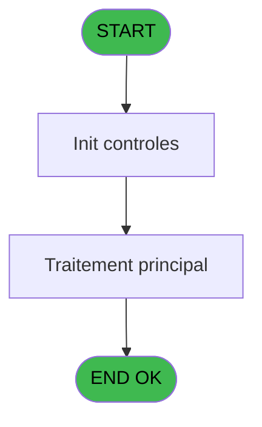
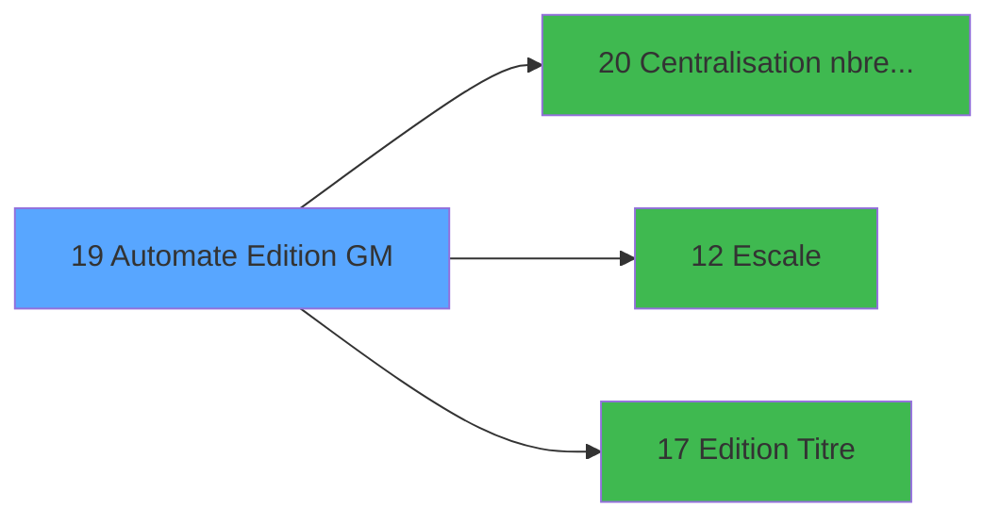

# PBP IDE 19 - Automate Edition GM

> **Analyse**: Phases 1-4 2026-02-03 01:06 -> 01:07 (40s) | Assemblage 01:07
> **Pipeline**: V7.2 Enrichi
> **Structure**: 4 onglets (Resume | Ecrans | Donnees | Connexions)

<!-- TAB:Resume -->

## 1. FICHE D'IDENTITE

| Attribut | Valeur |
|----------|--------|
| Projet | PBP |
| IDE Position | 19 |
| Nom Programme | Automate Edition GM |
| Fichier source | `Prg_19.xml` |
| Domaine metier | Impression |
| Taches | 1 (0 ecrans visibles) |
| Tables modifiees | 0 |
| Programmes appeles | 3 |

## 2. DESCRIPTION FONCTIONNELLE

**Automate Edition GM** assure la gestion complete de ce processus, accessible depuis [Demande Edition GM (IDE 18)](PBP-IDE-18.md).

Le flux de traitement s'organise en **1 blocs fonctionnels** :

- **Traitement** (1 tache) : traitements metier divers

## 3. BLOCS FONCTIONNELS

### 3.1 Traitement (1 tache)

Traitements internes.

---

#### 19 - Passeport Client [[ECRAN]](#ecran-t1)

**Role** : Traitement : Passeport Client.
**Ecran** : 1022 x 226 DLU (MDI) | [Voir mockup](#ecran-t1)
**Delegue a** : [Escale (IDE 12)](PBP-IDE-12.md)

## 5. REGLES METIER

*(Aucune regle metier identifiee)*

## 6. CONTEXTE

- **Appele par**: [Demande Edition GM (IDE 18)](PBP-IDE-18.md)
- **Appelle**: 3 programmes | **Tables**: 2 (W:0 R:1 L:1) | **Taches**: 1 | **Expressions**: 17

<!-- TAB:Ecrans -->

## 8. ECRANS

*(Programme sans ecran visible)*

## 9. NAVIGATION

### 9.3 Structure hierarchique (1 tache)

| Position | Tache | Type | Dimensions | Bloc |
|----------|-------|------|------------|------|
| **19.1** | [**Passeport Client** (19)](#t1) [mockup](#ecran-t1) | MDI | 1022x226 | Traitement |

### 9.4 Algorigramme

> **Legende**: Vert = START/END OK | Rouge = END KO | Bleu = Decisions
> *Algorigramme auto-genere. Utiliser `/algorigramme` pour une synthese metier detaillee.*

<!-- TAB:Donnees -->

## 10. TABLES

### Tables utilisees (2)

| ID | Nom | Description | Type | R | W | L | Usages |
|----|-----|-------------|------|---|---|---|--------|
| 13 | automate_autorite |  | DB |   |   | L | 1 |
| 289 | escale |  | DB | R |   |   | 1 |

### Colonnes par table (1 / 1 tables avec colonnes identifiees)

Table 289 - escale (R) - 1 usages

| Lettre | Variable | Acces | Type |
|--------|----------|-------|------|
| A | > Date | R | Date |
| B | > commandant | R | Alpha |
| C | > type edition | R | Alpha |

## 11. VARIABLES

### 11.1 Autres (3)

Variables diverses.

| Lettre | Nom | Type | Usage dans |
|--------|-----|------|-----------|
| A | > Date | Date | 1x refs |
| B | > commandant | Alpha | - |
| C | > type edition | Alpha | 1x refs |

## 12. EXPRESSIONS

**17 / 17 expressions decodees (100%)**

### 12.1 Repartition par type

| Type | Expressions | Regles |
|------|-------------|--------|
| CONSTANTE | 7 | 0 |
| CONDITION | 10 | 0 |

### 12.2 Expressions cles par type

#### CONSTANTE (7 expressions)

| Type | IDE | Expression | Regle |
|------|-----|------------|-------|
| CONSTANTE | 6 | `'P2'` | - |
| CONSTANTE | 7 | `'P3'` | - |
| CONSTANTE | 8 | `'P6'` | - |
| CONSTANTE | 5 | `'P1L'` | - |
| CONSTANTE | 2 | `'P1E'` | - |
| ... | | *+2 autres* | |

#### CONDITION (10 expressions)

| Type | IDE | Expression | Regle |
|------|-----|------------|-------|
| CONDITION | 14 | `[F]='P2'` | - |
| CONDITION | 13 | `[F]='P1L'` | - |
| CONDITION | 15 | `[F]='P3'` | - |
| CONDITION | 17 | `[F]='T'` | - |
| CONDITION | 16 | `[F]='P6'` | - |
| ... | | *+5 autres* | |

<!-- TAB:Connexions -->

## 13. GRAPHE D'APPELS

### 13.1 Chaine depuis Main (Callers)

Main -> ... -> [Demande Edition GM (IDE 18)](PBP-IDE-18.md) -> **Automate Edition GM (IDE 19)**

### 13.2 Callers

| IDE | Nom Programme | Nb Appels |
|-----|---------------|-----------|
| [18](PBP-IDE-18.md) | Demande Edition GM | 1 |

### 13.3 Callees (programmes appeles)

### 13.4 Detail Callees avec contexte

| IDE | Nom Programme | Appels | Contexte |
|-----|---------------|--------|----------|
| [20](PBP-IDE-20.md) | Centralisation nbre edition | 7 | Impression ticket/document |
| [12](PBP-IDE-12.md) | Escale | 1 | Sous-programme |
| [17](PBP-IDE-17.md) |   Edition Titre | 1 | Impression ticket/document |

## 14. RECOMMANDATIONS MIGRATION

### 14.1 Profil du programme

| Metrique | Valeur | Impact migration |
|----------|--------|-----------------|
| Lignes de logique | 31 | Programme compact |
| Expressions | 17 | Peu de logique |
| Tables WRITE | 0 | Impact faible |
| Sous-programmes | 3 | Peu de dependances |
| Ecrans visibles | 0 | Ecran unique ou traitement batch |
| Code desactive | 0% (0 / 31) | Code sain |
| Regles metier | 0 | Pas de regle identifiee |

### 14.2 Plan de migration par bloc

#### Traitement (1 tache: 1 ecran, 0 traitement)

- **Strategie** : 1 composant(s) UI (Razor/React) avec formulaires et validation.
- 3 sous-programme(s) a migrer ou a reutiliser depuis les services existants.
- Decomposer les taches en services unitaires testables.

### 14.3 Dependances critiques

| Dependance | Type | Appels | Impact |
|------------|------|--------|--------|
| [Centralisation nbre edition (IDE 20)](PBP-IDE-20.md) | Sous-programme | 7x | **CRITIQUE** - Impression ticket/document |
| [  Edition Titre (IDE 17)](PBP-IDE-17.md) | Sous-programme | 1x | Normale - Impression ticket/document |
| [Escale (IDE 12)](PBP-IDE-12.md) | Sous-programme | 1x | Normale - Sous-programme |

---
*Spec DETAILED generee par Pipeline V7.2 - 2026-02-03 01:07*
