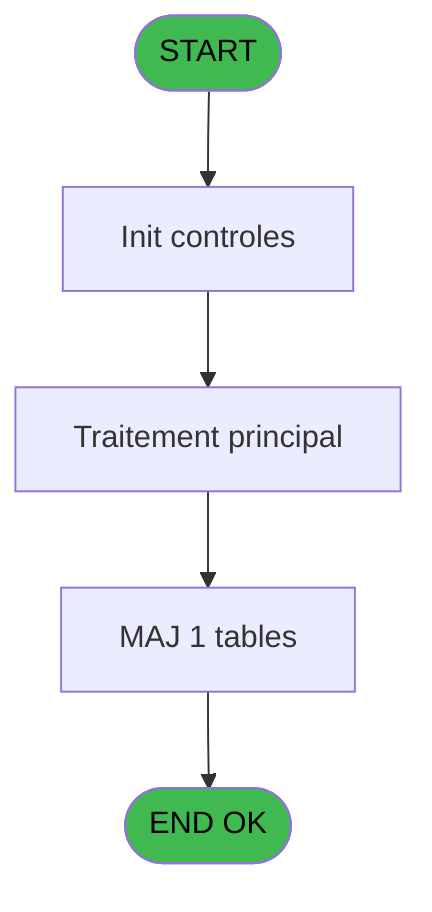
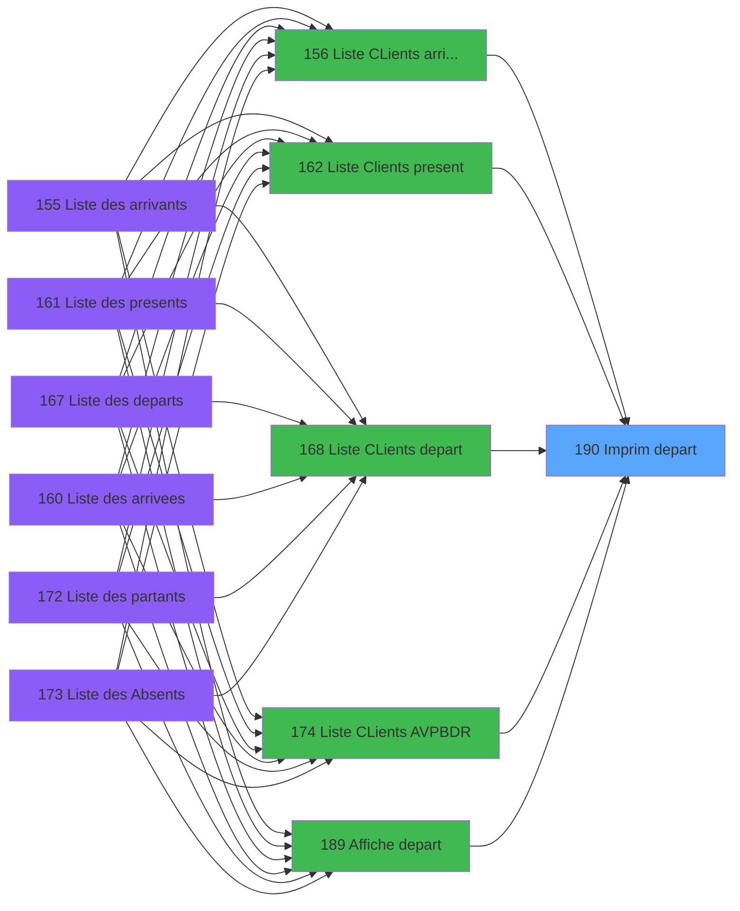

# PBP IDE 190 - Imprim depart

> **Analyse**: Phases 1-4 2026-02-03 15:43 -> 15:43 (14s) | Assemblage 15:43
> **Pipeline**: V7.2 Enrichi
> **Structure**: 4 onglets (Resume | Ecrans | Donnees | Connexions)

<!-- TAB:Resume -->

## 1. FICHE D'IDENTITE

| Attribut | Valeur |
|----------|--------|
| Projet | PBP |
| IDE Position | 190 |
| Nom Programme | Imprim depart |
| Fichier source | `Prg_190.xml` |
| Dossier IDE | Liste |
| Taches | 1 (1 ecrans visibles) |
| Tables modifiees | 1 |
| Programmes appeles | 0 |

## 2. DESCRIPTION FONCTIONNELLE

**Imprim depart** assure la gestion complete de ce processus, accessible depuis [  Liste CLients arrivant (IDE 156)](PBP-IDE-156.md), [  Liste Clients present (IDE 162)](PBP-IDE-162.md), [  Liste CLients depart (IDE 168)](PBP-IDE-168.md), [Liste CLients AVPBDR (IDE 174)](PBP-IDE-174.md), [  Affiche depart (IDE 189)](PBP-IDE-189.md).

Le flux de traitement s'organise en **1 blocs fonctionnels** :

- **Traitement** (1 tache) : traitements metier divers

**Donnees modifiees** : 1 tables en ecriture (tempo_mecano_1__mec1).

**Logique metier** : 2 regles identifiees couvrant conditions metier.

## 3. BLOCS FONCTIONNELS

### 3.1 Traitement (1 tache)

Traitements internes.

---

#### 190 - Veuillez patienter ... [[ECRAN]](#ecran-t1)

**Role** : Traitement : Veuillez patienter ....
**Ecran** : 427 x 58 DLU (MDI) | [Voir mockup](#ecran-t1)

## 5. REGLES METIER

2 regles identifiees:

### Autres (2 regles)

#### [RM-001] Si [J]='F' alors 'Me' sinon 'M')

| Element | Detail |
|---------|--------|
| **Condition** | `[J]='F'` |
| **Si vrai** | 'Me' |
| **Si faux** | 'M') |
| **Expression source** | Expression 14 : `IF ([J]='F','Me','M')` |
| **Exemple** | Si [J]='F' → 'Me'. Sinon → 'M') |

#### [RM-002] Traitement si [N]='F','Me',IF([N] est renseigne

| Element | Detail |
|---------|--------|
| **Condition** | `[N]='F'` |
| **Si vrai** | 'Me' |
| **Si faux** | IF([N]<>'','M','')) |
| **Expression source** | Expression 15 : `IF ([N]='F','Me',IF([N]<>'','M',''))` |
| **Exemple** | Si [N]='F' → 'Me'. Sinon → IF([N]<>'','M','')) |

## 6. CONTEXTE

- **Appele par**: [  Liste CLients arrivant (IDE 156)](PBP-IDE-156.md), [  Liste Clients present (IDE 162)](PBP-IDE-162.md), [  Liste CLients depart (IDE 168)](PBP-IDE-168.md), [Liste CLients AVPBDR (IDE 174)](PBP-IDE-174.md), [  Affiche depart (IDE 189)](PBP-IDE-189.md)
- **Appelle**: 0 programmes | **Tables**: 1 (W:1 R:0 L:0) | **Taches**: 1 | **Expressions**: 18

<!-- TAB:Ecrans -->

## 8. ECRANS

### 8.1 Forms visibles (1 / 1)

| # | Position | Tache | Nom | Type | Largeur | Hauteur | Bloc |
|---|----------|-------|-----|------|---------|---------|------|
| 1 | 190 | 190 | Veuillez patienter ... | MDI | 427 | 58 | Traitement |

### 8.2 Mockups Ecrans

---

#### 190 - Veuillez patienter ...
**Tache** : [190](#t1) | **Type** : MDI | **Dimensions** : 427 x 58 DLU
**Bloc** : Traitement | **Titre IDE** : Veuillez patienter ...

<!-- FORM-DATA:
{
    "width":  427,
    "vFactor":  8,
    "type":  "MDI",
    "hFactor":  8,
    "controls":  [
                     {
                         "x":  0,
                         "type":  "label",
                         "var":  "",
                         "y":  0,
                         "w":  423,
                         "fmt":  "",
                         "name":  "",
                         "h":  29,
                         "color":  "",
                         "text":  "",
                         "parent":  null
                     },
                     {
                         "x":  120,
                         "type":  "label",
                         "var":  "",
                         "y":  10,
                         "w":  221,
                         "fmt":  "",
                         "name":  "",
                         "h":  8,
                         "color":  "7",
                         "text":  "Traitement en cours ...",
                         "parent":  null
                     },
                     {
                         "x":  0,
                         "type":  "label",
                         "var":  "",
                         "y":  29,
                         "w":  423,
                         "fmt":  "",
                         "name":  "",
                         "h":  27,
                         "color":  "",
                         "text":  "",
                         "parent":  null
                     },
                     {
                         "x":  72,
                         "type":  "label",
                         "var":  "",
                         "y":  38,
                         "w":  267,
                         "fmt":  "",
                         "name":  "",
                         "h":  8,
                         "color":  "",
                         "text":  "Preparation table temporaire",
                         "parent":  null
                     },
                     {
                         "x":  4,
                         "type":  "image",
                         "var":  "",
                         "y":  2,
                         "w":  72,
                         "fmt":  "",
                         "name":  "",
                         "h":  25,
                         "color":  "",
                         "text":  "",
                         "parent":  null
                     }
                 ],
    "taskId":  "190",
    "height":  58
}
-->

## 9. NAVIGATION

Ecran unique: **Veuillez patienter ...**

### 9.3 Structure hierarchique (1 tache)

| Position | Tache | Type | Dimensions | Bloc |
|----------|-------|------|------------|------|
| **190.1** | [**Veuillez patienter ...** (190)](#t1) [mockup](#ecran-t1) | MDI | 427x58 | Traitement |

### 9.4 Algorigramme

> **Legende**: Vert = START/END OK | Rouge = END KO | Bleu = Decisions
> *Algorigramme auto-genere. Utiliser `/algorigramme` pour une synthese metier detaillee.*

<!-- TAB:Donnees -->

## 10. TABLES

### Tables utilisees (1)

| ID | Nom | Description | Type | R | W | L | Usages |
|----|-----|-------------|------|---|---|---|--------|
| 604 | tempo_mecano_1__mec1 | Table temporaire ecran | TMP |   | **W** |   | 1 |

### Colonnes par table (1 / 1 tables avec colonnes identifiees)

Table 604 - tempo_mecano_1__mec1 (**W**) - 1 usages

| Lettre | Variable | Acces | Type |
|--------|----------|-------|------|
| A | >Date | W | Date |
| B | >CodeVol | W | Alpha |
| C | >Heure | W | Alpha |
| D | >CodeVille | W | Alpha |
| E | >Total | W | Numeric |
| F | >NbSelect | W | Numeric |
| G | >Libellé Sélection du Solde* | W | Unicode |
| H | >Soldé,Non_soldé,Tous | W | Unicode |
| I | w0_Titre | W | Alpha |

## 11. VARIABLES

### 11.1 Autres (9)

Variables diverses.

| Lettre | Nom | Type | Usage dans |
|--------|-----|------|-----------|
| A | >Date | Date | 1x refs |
| B | >CodeVol | Alpha | - |
| C | >Heure | Alpha | 1x refs |
| D | >CodeVille | Alpha | - |
| E | >Total | Numeric | - |
| F | >NbSelect | Numeric | - |
| G | >Libellé Sélection du Solde* | Unicode | - |
| H | >Soldé,Non_soldé,Tous | Unicode | - |
| I | w0_Titre | Alpha | - |

## 12. EXPRESSIONS

**18 / 18 expressions decodees (100%)**

### 12.1 Repartition par type

| Type | Expressions | Regles |
|------|-------------|--------|
| CONCATENATION | 3 | 0 |
| CONDITION | 5 | 2 |
| OTHER | 9 | 0 |
| REFERENCE_VG | 1 | 0 |

### 12.2 Expressions cles par type

#### CONCATENATION (3 expressions)

| Type | IDE | Expression | Regle |
|------|-----|------------|-------|
| CONCATENATION | 13 | `MlsTrans ('Liste des departs')&' '&IF (>Heure [C]<>'',MlsTrans ('à')&' '&>Heure [C]&'h'&' ','')&MlsTrans ('le')&' '&DStr (>Date [A],'DD/MM/YYYY')` | - |
| CONCATENATION | 12 | `MlsTrans ('Edition du')&' '&DStr (Date (),'DD/MM/YYYY')&' '&MlsTrans ('à')&' '&TStr (Time (),'HH:MM:SS')` | - |
| CONCATENATION | 16 | `'- '&Str (Page (0,1),'3P0Z0')&' -'` | - |

#### CONDITION (5 expressions)

| Type | IDE | Expression | Regle |
|------|-----|------------|-------|
| CONDITION | 15 | `IF ([N]='F','Me',IF([N]<>'','M',''))` | [RM-002](#rm-RM-002) |
| CONDITION | 14 | `IF ([J]='F','Me','M')` | [RM-001](#rm-RM-001) |
| CONDITION | 17 | `CndRange(Trim([AI])<>'' AND [AJ]<>'T',IF([AJ]='N','X',''))` | - |
| CONDITION | 18 | `[AJ]='T'` | - |
| CONDITION | 8 | `INIGet ('[MAGIC_LOGICAL_NAMES]preview')='O'` | - |

#### OTHER (9 expressions)

| Type | IDE | Expression | Regle |
|------|-----|------------|-------|
| OTHER | 7 | `MlsTrans ('Reveil')` | - |
| OTHER | 6 | `MlsTrans ('Depot bagages')` | - |
| OTHER | 11 | `'Village '&GetParam ('VILLAGE')` | - |
| OTHER | 9 | `GetParam ('SOCIETE')` | - |
| OTHER | 5 | `MlsTrans ('Repas')` | - |
| ... | | *+4 autres* | |

#### REFERENCE_VG (1 expressions)

| Type | IDE | Expression | Regle |
|------|-----|------------|-------|
| REFERENCE_VG | 10 | `VG1` | - |

<!-- TAB:Connexions -->

## 13. GRAPHE D'APPELS

### 13.1 Chaine depuis Main (Callers)

Main -> ... -> [  Liste CLients arrivant (IDE 156)](PBP-IDE-156.md) -> **Imprim depart (IDE 190)**

Main -> ... -> [  Liste Clients present (IDE 162)](PBP-IDE-162.md) -> **Imprim depart (IDE 190)**

Main -> ... -> [  Liste CLients depart (IDE 168)](PBP-IDE-168.md) -> **Imprim depart (IDE 190)**

Main -> ... -> [Liste CLients AVPBDR (IDE 174)](PBP-IDE-174.md) -> **Imprim depart (IDE 190)**

Main -> ... -> [  Affiche depart (IDE 189)](PBP-IDE-189.md) -> **Imprim depart (IDE 190)**

### 13.2 Callers

| IDE | Nom Programme | Nb Appels |
|-----|---------------|-----------|
| [156](PBP-IDE-156.md) |   Liste CLients arrivant | 1 |
| [162](PBP-IDE-162.md) |   Liste Clients present | 1 |
| [168](PBP-IDE-168.md) |   Liste CLients depart | 1 |
| [174](PBP-IDE-174.md) | Liste CLients AVPBDR | 1 |
| [189](PBP-IDE-189.md) |   Affiche depart | 1 |

### 13.3 Callees (programmes appeles)

### 13.4 Detail Callees avec contexte

| IDE | Nom Programme | Appels | Contexte |
|-----|---------------|--------|----------|
| - | (aucun) | - | - |

## 14. RECOMMANDATIONS MIGRATION

### 14.1 Profil du programme

| Metrique | Valeur | Impact migration |
|----------|--------|-----------------|
| Lignes de logique | 31 | Programme compact |
| Expressions | 18 | Peu de logique |
| Tables WRITE | 1 | Impact faible |
| Sous-programmes | 0 | Peu de dependances |
| Ecrans visibles | 1 | Ecran unique ou traitement batch |
| Code desactive | 0% (0 / 31) | Code sain |
| Regles metier | 2 | Quelques regles a preserver |

### 14.2 Plan de migration par bloc

#### Traitement (1 tache: 1 ecran, 0 traitement)

- **Strategie** : 1 composant(s) UI (Razor/React) avec formulaires et validation.
- Decomposer les taches en services unitaires testables.

### 14.3 Dependances critiques

| Dependance | Type | Appels | Impact |
|------------|------|--------|--------|
| tempo_mecano_1__mec1 | Table WRITE (Temp) | 1x | Schema + repository |

---
*Spec DETAILED generee par Pipeline V7.2 - 2026-02-03 15:43*
