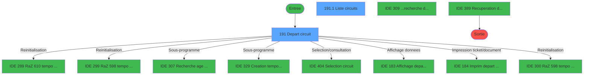
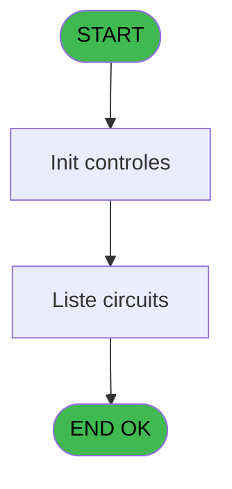
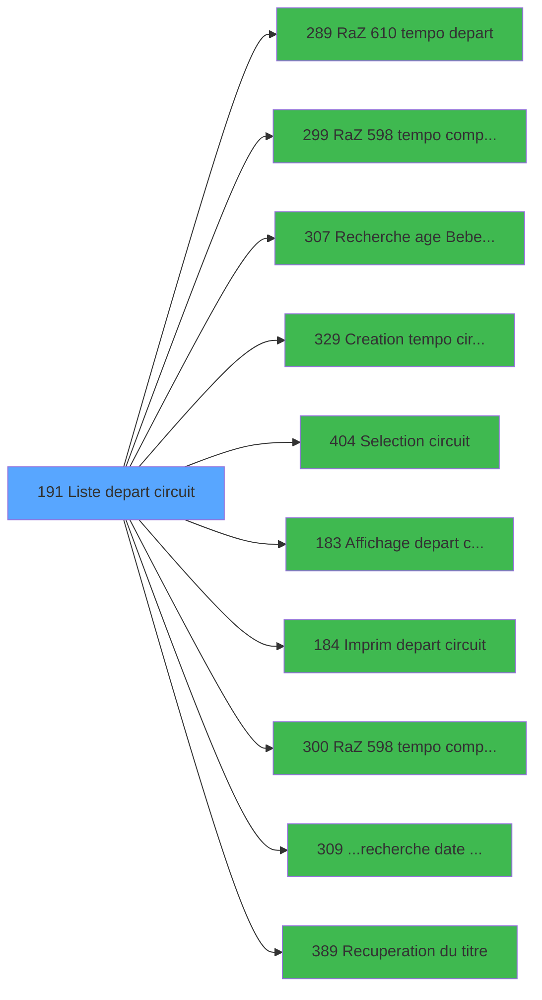

# PBP IDE 191 - Liste depart circuit

> **Analyse**: Phases 1-4 2026-02-03 15:43 -> 15:44 (11s) | Assemblage 15:44
> **Pipeline**: V7.2 Enrichi
> **Structure**: 4 onglets (Resume | Ecrans | Donnees | Connexions)

<!-- TAB:Resume -->

## 1. FICHE D'IDENTITE

| Attribut | Valeur |
|----------|--------|
| Projet | PBP |
| IDE Position | 191 |
| Nom Programme | Liste depart circuit |
| Fichier source | `Prg_191.xml` |
| Dossier IDE | Liste |
| Taches | 2 (2 ecrans visibles) |
| Tables modifiees | 0 |
| Programmes appeles | 10 |
| :warning: Statut | **ORPHELIN_POTENTIEL** |

## 2. DESCRIPTION FONCTIONNELLE

**Liste depart circuit** assure la gestion complete de ce processus.

Le flux de traitement s'organise en **1 blocs fonctionnels** :

- **Traitement** (2 taches) : traitements metier divers

## 3. BLOCS FONCTIONNELS

### 3.1 Traitement (2 taches)

Traitements internes.

---

#### 191 - Depart circuit [[ECRAN]](#ecran-t1)

**Role** : Traitement : Depart circuit.
**Ecran** : 920 x 199 DLU (MDI) | [Voir mockup](#ecran-t1)
**Variables liees** : G (w0_Circuit), H (w0_Heure depart village), I (b_Circuit)
**Delegue a** : [  Affichage depart circuit (IDE 183)](PBP-IDE-183.md), [  Imprim depart circuit (IDE 184)](PBP-IDE-184.md), [Recuperation du titre (IDE 389)](PBP-IDE-389.md)

---

#### 191.1 - Liste circuits [[ECRAN]](#ecran-t2)

**Role** : Traitement : Liste circuits.
**Ecran** : 388 x 142 DLU (Modal) | [Voir mockup](#ecran-t2)
**Variables liees** : C (W0 liste), D (b_Liste)
**Delegue a** : [Recuperation du titre (IDE 389)](PBP-IDE-389.md)

## 5. REGLES METIER

*(Aucune regle metier identifiee)*

## 6. CONTEXTE

- **Appele par**: (aucun)
- **Appelle**: 10 programmes | **Tables**: 2 (W:0 R:2 L:0) | **Taches**: 2 | **Expressions**: 19

<!-- TAB:Ecrans -->

## 8. ECRANS

### 8.1 Forms visibles (2 / 2)

| # | Position | Tache | Nom | Type | Largeur | Hauteur | Bloc |
|---|----------|-------|-----|------|---------|---------|------|
| 1 | 191 | 191 | Depart circuit | MDI | 920 | 199 | Traitement |
| 2 | 191.1 | 191.1 | Liste circuits | Modal | 388 | 142 | Traitement |

### 8.2 Mockups Ecrans

---

#### 191 - Depart circuit
**Tache** : [191](#t1) | **Type** : MDI | **Dimensions** : 920 x 199 DLU
**Bloc** : Traitement | **Titre IDE** : Depart circuit

<!-- FORM-DATA:
{
    "width":  920,
    "vFactor":  8,
    "type":  "MDI",
    "hFactor":  8,
    "controls":  [
                     {
                         "x":  1,
                         "type":  "label",
                         "var":  "",
                         "y":  0,
                         "w":  916,
                         "fmt":  "",
                         "name":  "",
                         "h":  20,
                         "color":  "1",
                         "text":  "",
                         "parent":  null
                     },
                     {
                         "x":  408,
                         "type":  "label",
                         "var":  "",
                         "y":  25,
                         "w":  306,
                         "fmt":  "",
                         "name":  "",
                         "h":  143,
                         "color":  "195",
                         "text":  "Paramètres",
                         "parent":  null
                     },
                     {
                         "x":  729,
                         "type":  "label",
                         "var":  "",
                         "y":  28,
                         "w":  186,
                         "fmt":  "",
                         "name":  "",
                         "h":  140,
                         "color":  "",
                         "text":  "",
                         "parent":  null
                     },
                     {
                         "x":  438,
                         "type":  "label",
                         "var":  "",
                         "y":  45,
                         "w":  212,
                         "fmt":  "",
                         "name":  "",
                         "h":  50,
                         "color":  "",
                         "text":  "",
                         "parent":  5
                     },
                     {
                         "x":  460,
                         "type":  "label",
                         "var":  "",
                         "y":  57,
                         "w":  46,
                         "fmt":  "",
                         "name":  "",
                         "h":  9,
                         "color":  "",
                         "text":  "Total",
                         "parent":  8
                     },
                     {
                         "x":  460,
                         "type":  "label",
                         "var":  "",
                         "y":  78,
                         "w":  78,
                         "fmt":  "",
                         "name":  "",
                         "h":  9,
                         "color":  "",
                         "text":  "Sélection",
                         "parent":  8
                     },
                     {
                         "x":  444,
                         "type":  "label",
                         "var":  "",
                         "y":  109,
                         "w":  45,
                         "fmt":  "",
                         "name":  "",
                         "h":  9,
                         "color":  "",
                         "text":  "Date",
                         "parent":  5
                     },
                     {
                         "x":  444,
                         "type":  "label",
                         "var":  "",
                         "y":  132,
                         "w":  54,
                         "fmt":  "",
                         "name":  "",
                         "h":  8,
                         "color":  "",
                         "text":  "Circuit",
                         "parent":  5
                     },
                     {
                         "x":  0,
                         "type":  "label",
                         "var":  "",
                         "y":  173,
                         "w":  916,
                         "fmt":  "",
                         "name":  "",
                         "h":  24,
                         "color":  "1",
                         "text":  "",
                         "parent":  null
                     },
                     {
                         "x":  444,
                         "type":  "label",
                         "var":  "",
                         "y":  151,
                         "w":  149,
                         "fmt":  "",
                         "name":  "",
                         "h":  12,
                         "color":  "",
                         "text":  "Départ du Village",
                         "parent":  5
                     },
                     {
                         "x":  520,
                         "type":  "edit",
                         "var":  "",
                         "y":  108,
                         "w":  126,
                         "fmt":  "",
                         "name":  "w0_Date",
                         "h":  10,
                         "color":  "110",
                         "text":  "",
                         "parent":  5
                     },
                     {
                         "x":  649,
                         "type":  "button",
                         "var":  "",
                         "y":  108,
                         "w":  30,
                         "fmt":  "...",
                         "name":  "b_Date",
                         "h":  10,
                         "color":  "",
                         "text":  "",
                         "parent":  5
                     },
                     {
                         "x":  550,
                         "type":  "edit",
                         "var":  "",
                         "y":  57,
                         "w":  56,
                         "fmt":  "",
                         "name":  "",
                         "h":  9,
                         "color":  "",
                         "text":  "",
                         "parent":  8
                     },
                     {
                         "x":  550,
                         "type":  "edit",
                         "var":  "",
                         "y":  78,
                         "w":  56,
                         "fmt":  "",
                         "name":  "",
                         "h":  9,
                         "color":  "",
                         "text":  "",
                         "parent":  8
                     },
                     {
                         "x":  520,
                         "type":  "edit",
                         "var":  "",
                         "y":  131,
                         "w":  82,
                         "fmt":  "",
                         "name":  "w0_Circuit",
                         "h":  10,
                         "color":  "110",
                         "text":  "",
                         "parent":  5
                     },
                     {
                         "x":  604,
                         "type":  "button",
                         "var":  "",
                         "y":  131,
                         "w":  30,
                         "fmt":  "...",
                         "name":  "b_Circuit",
                         "h":  10,
                         "color":  "",
                         "text":  "",
                         "parent":  5
                     },
                     {
                         "x":  745,
                         "type":  "button",
                         "var":  "",
                         "y":  109,
                         "w":  154,
                         "fmt":  "\u0026Ecran",
                         "name":  "b_Ecran",
                         "h":  18,
                         "color":  "",
                         "text":  "",
                         "parent":  6
                     },
                     {
                         "x":  745,
                         "type":  "button",
                         "var":  "",
                         "y":  135,
                         "w":  154,
                         "fmt":  "\u0026Impression",
                         "name":  "b_Edition",
                         "h":  18,
                         "color":  "",
                         "text":  "",
                         "parent":  6
                     },
                     {
                         "x":  6,
                         "type":  "edit",
                         "var":  "",
                         "y":  2,
                         "w":  267,
                         "fmt":  "20",
                         "name":  "",
                         "h":  8,
                         "color":  "",
                         "text":  "",
                         "parent":  1
                     },
                     {
                         "x":  600,
                         "type":  "edit",
                         "var":  "",
                         "y":  6,
                         "w":  299,
                         "fmt":  "WWW DD MMM YYYYT",
                         "name":  "",
                         "h":  8,
                         "color":  "",
                         "text":  "",
                         "parent":  1
                     },
                     {
                         "x":  6,
                         "type":  "edit",
                         "var":  "",
                         "y":  11,
                         "w":  263,
                         "fmt":  "30",
                         "name":  "",
                         "h":  8,
                         "color":  "",
                         "text":  "",
                         "parent":  1
                     },
                     {
                         "x":  736,
                         "type":  "image",
                         "var":  "",
                         "y":  37,
                         "w":  170,
                         "fmt":  "",
                         "name":  "",
                         "h":  59,
                         "color":  "",
                         "text":  "",
                         "parent":  6
                     },
                     {
                         "x":  8,
                         "type":  "button",
                         "var":  "",
                         "y":  176,
                         "w":  154,
                         "fmt":  "\u0026Quitter",
                         "name":  "",
                         "h":  18,
                         "color":  "",
                         "text":  "",
                         "parent":  17
                     },
                     {
                         "x":  0,
                         "type":  "subform",
                         "var":  "",
                         "y":  21,
                         "w":  403,
                         "fmt":  "",
                         "name":  "Liste circuits",
                         "h":  151,
                         "color":  "",
                         "text":  "",
                         "parent":  null
                     },
                     {
                         "x":  604,
                         "type":  "checkbox",
                         "var":  "",
                         "y":  151,
                         "w":  42,
                         "fmt":  "",
                         "name":  "w0_Heure depart village",
                         "h":  12,
                         "color":  "",
                         "text":  "",
                         "parent":  5
                     }
                 ],
    "taskId":  "191",
    "height":  199
}
-->

<strong>Champs : 8 champs</strong>

| Pos (x,y) | Nom | Variable | Type |
|-----------|-----|----------|------|
| 520,108 | w0_Date | - | edit |
| 550,57 | (sans nom) | - | edit |
| 550,78 | (sans nom) | - | edit |
| 520,131 | w0_Circuit | - | edit |
| 6,2 | 20 | - | edit |
| 600,6 | WWW DD MMM YYYYT | - | edit |
| 6,11 | 30 | - | edit |
| 604,151 | w0_Heure depart village | - | checkbox |

<strong>Boutons : 5 boutons</strong>

| Bouton | Pos (x,y) | Action |
|--------|-----------|--------|
| ... | 649,108 | Appel [...recherche date minimum (IDE 309)](PBP-IDE-309.md) |
| ... | 604,131 | Appel [...recherche date minimum (IDE 309)](PBP-IDE-309.md) |
| Ecran | 745,109 | Bouton fonctionnel |
| Impression | 745,135 | Bouton fonctionnel |
| Quitter | 8,176 | Quitte le programme |

---

#### 191.1 - Liste circuits
**Tache** : [191.1](#t2) | **Type** : Modal | **Dimensions** : 388 x 142 DLU
**Bloc** : Traitement | **Titre IDE** : Liste circuits

<!-- FORM-DATA:
{
    "width":  388,
    "vFactor":  8,
    "type":  "Modal",
    "hFactor":  8,
    "controls":  [
                     {
                         "x":  0,
                         "type":  "table",
                         "var":  "",
                         "name":  "",
                         "titleH":  12,
                         "color":  "110",
                         "w":  380,
                         "y":  0,
                         "fmt":  "",
                         "parent":  null,
                         "text":  "",
                         "rowH":  14,
                         "h":  140,
                         "cols":  [
                                      {
                                          "title":  "Code",
                                          "layer":  1,
                                          "w":  96
                                      },
                                      {
                                          "title":  "Libellé",
                                          "layer":  2,
                                          "w":  251
                                      }
                                  ],
                         "rows":  2
                     },
                     {
                         "x":  6,
                         "type":  "edit",
                         "var":  "",
                         "y":  14,
                         "w":  82,
                         "fmt":  "",
                         "name":  "",
                         "h":  10,
                         "color":  "110",
                         "text":  "",
                         "parent":  1
                     },
                     {
                         "x":  102,
                         "type":  "edit",
                         "var":  "",
                         "y":  14,
                         "w":  238,
                         "fmt":  "",
                         "name":  "",
                         "h":  10,
                         "color":  "110",
                         "text":  "",
                         "parent":  1
                     }
                 ],
    "taskId":  "191.1",
    "height":  142
}
-->

<strong>Champs : 2 champs</strong>

| Pos (x,y) | Nom | Variable | Type |
|-----------|-----|----------|------|
| 6,14 | (sans nom) | - | edit |
| 102,14 | (sans nom) | - | edit |

## 9. NAVIGATION

### 9.1 Enchainement des ecrans

**Detail par enchainement :**

| Depuis | Action | Vers | Retour |
|--------|--------|------|--------|
| Depart circuit | Reinitialisation | [RaZ 610 tempo depart (IDE 289)](PBP-IDE-289.md) | Retour ecran |
| Depart circuit | Reinitialisation | [RaZ 598 tempo comptage (IDE 299)](PBP-IDE-299.md) | Retour ecran |
| Depart circuit | Sous-programme | [Recherche age Bebe_Enfant (IDE 307)](PBP-IDE-307.md) | Retour ecran |
| Depart circuit | Sous-programme | [Creation tempo circuit (IDE 329)](PBP-IDE-329.md) | Retour ecran |
| Depart circuit | Selection/consultation | [Selection circuit (IDE 404)](PBP-IDE-404.md) | Retour ecran |
| Depart circuit | Affichage donnees | [  Affichage depart circuit (IDE 183)](PBP-IDE-183.md) | Retour ecran |
| Depart circuit | Impression ticket/document | [  Imprim depart circuit (IDE 184)](PBP-IDE-184.md) | Retour ecran |
| Depart circuit | Reinitialisation | [RaZ 598 tempo comptage eff (IDE 300)](PBP-IDE-300.md) | Retour ecran |
| Depart circuit | Sous-programme | [...recherche date minimum (IDE 309)](PBP-IDE-309.md) | Retour ecran |
| Depart circuit | Recuperation donnees | [Recuperation du titre (IDE 389)](PBP-IDE-389.md) | Retour ecran |

### 9.3 Structure hierarchique (2 taches)

| Position | Tache | Type | Dimensions | Bloc |
|----------|-------|------|------------|------|
| **191.1** | [**Depart circuit** (191)](#t1) [mockup](#ecran-t1) | MDI | 920x199 | Traitement |
| 191.1.1 | [Liste circuits (191.1)](#t2) [mockup](#ecran-t2) | Modal | 388x142 | |

### 9.4 Algorigramme

> **Legende**: Vert = START/END OK | Rouge = END KO | Bleu = Decisions
> *Algorigramme auto-genere. Utiliser `/algorigramme` pour une synthese metier detaillee.*

<!-- TAB:Donnees -->

## 10. TABLES

### Tables utilisees (2)

| ID | Nom | Description | Type | R | W | L | Usages |
|----|-----|-------------|------|---|---|---|--------|
| 120 | tables_qualites__qua |  | DB | R |   |   | 1 |
| 127 | code_circuit |  | DB | R |   |   | 1 |

### Colonnes par table (2 / 2 tables avec colonnes identifiees)

Table 120 - tables_qualites__qua (R) - 1 usages

| Lettre | Variable | Acces | Type |
|--------|----------|-------|------|
| A | w0_Date | R | Date |
| B | b_Date | R | Alpha |
| C | W0 liste | R | Alpha |
| D | b_Liste | R | Alpha |
| E | w0_Total | R | Numeric |
| F | w0_Selection | R | Numeric |
| G | w0_Circuit | R | Alpha |
| H | w0_Heure depart village | R | Logical |
| I | b_Circuit | R | Alpha |
| J | v. titre | R | Alpha |
| K | w0_DateMin | R | Date |
| L | w0_AgeBebe | R | Numeric |
| M | w0_AgeEnfant | R | Numeric |
| N | b_Ecran | R | Alpha |
| O | b_Edition | R | Alpha |

Table 127 - code_circuit (R) - 1 usages

| Lettre | Variable | Acces | Type |
|--------|----------|-------|------|
| G | w0_Circuit | R | Alpha |
| I | b_Circuit | R | Alpha |

## 11. VARIABLES

### 11.1 Variables de session (1)

Variables persistantes pendant toute la session.

| Lettre | Nom | Type | Usage dans |
|--------|-----|------|-----------|
| J | v. titre | Alpha | - |

### 11.2 Variables de travail (1)

Variables internes au programme.

| Lettre | Nom | Type | Usage dans |
|--------|-----|------|-----------|
| C | W0 liste | Alpha | - |

### 11.3 Autres (13)

Variables diverses.

| Lettre | Nom | Type | Usage dans |
|--------|-----|------|-----------|
| A | w0_Date | Date | 1x refs |
| B | b_Date | Alpha | - |
| D | b_Liste | Alpha | - |
| E | w0_Total | Numeric | - |
| F | w0_Selection | Numeric | 2x refs |
| G | w0_Circuit | Alpha | - |
| H | w0_Heure depart village | Logical | - |
| I | b_Circuit | Alpha | 1x refs |
| K | w0_DateMin | Date | - |
| L | w0_AgeBebe | Numeric | - |
| M | w0_AgeEnfant | Numeric | - |
| N | b_Ecran | Alpha | - |
| O | b_Edition | Alpha | - |

## 12. EXPRESSIONS

**19 / 19 expressions decodees (100%)**

### 12.1 Repartition par type

| Type | Expressions | Regles |
|------|-------------|--------|
| CONSTANTE | 7 | 0 |
| DATE | 1 | 0 |
| REFERENCE_VG | 1 | 0 |
| OTHER | 5 | 0 |
| CONDITION | 2 | 0 |
| CAST_LOGIQUE | 1 | 0 |
| NEGATION | 1 | 0 |
| STRING | 1 | 0 |

### 12.2 Expressions cles par type

#### CONSTANTE (7 expressions)

| Type | IDE | Expression | Regle |
|------|-----|------------|-------|
| CONSTANTE | 6 | `146` | - |
| CONSTANTE | 10 | `'Planning'` | - |
| CONSTANTE | 16 | `0` | - |
| CONSTANTE | 5 | `145` | - |
| CONSTANTE | 1 | `'VBEBE'` | - |
| ... | | *+2 autres* | |

#### DATE (1 expressions)

| Type | IDE | Expression | Regle |
|------|-----|------------|-------|
| DATE | 8 | `Date ()` | - |

#### REFERENCE_VG (1 expressions)

| Type | IDE | Expression | Regle |
|------|-----|------------|-------|
| REFERENCE_VG | 7 | `VG2` | - |

#### OTHER (5 expressions)

| Type | IDE | Expression | Regle |
|------|-----|------------|-------|
| OTHER | 13 | `SetCrsr (1)` | - |
| OTHER | 14 | `GetParam ('VILLAGE')` | - |
| OTHER | 12 | `SetCrsr (2)` | - |
| OTHER | 9 | `UDF ('hotfudge.calendar',WinHWND (0),w0_Date [A])` | - |
| OTHER | 11 | `GetParam ('SOCIETE')` | - |

#### CONDITION (2 expressions)

| Type | IDE | Expression | Regle |
|------|-----|------------|-------|
| CONDITION | 17 | `w0_Selection [F]=0` | - |
| CONDITION | 15 | `w0_Selection [F]>0` | - |

#### CAST_LOGIQUE (1 expressions)

| Type | IDE | Expression | Regle |
|------|-----|------------|-------|
| CAST_LOGIQUE | 18 | `'TRUE'LOG` | - |

#### NEGATION (1 expressions)

| Type | IDE | Expression | Regle |
|------|-----|------------|-------|
| NEGATION | 19 | `NOT [AC]` | - |

#### STRING (1 expressions)

| Type | IDE | Expression | Regle |
|------|-----|------------|-------|
| STRING | 4 | `Trim (b_Circuit [I])` | - |

<!-- TAB:Connexions -->

## 13. GRAPHE D'APPELS

### 13.1 Chaine depuis Main (Callers)

**Chemin**: (pas de callers directs)

### 13.2 Callers

| IDE | Nom Programme | Nb Appels |
|-----|---------------|-----------|
| - | (aucun) | - |

### 13.3 Callees (programmes appeles)

### 13.4 Detail Callees avec contexte

| IDE | Nom Programme | Appels | Contexte |
|-----|---------------|--------|----------|
| [289](PBP-IDE-289.md) | RaZ 610 tempo depart | 3 | Reinitialisation |
| [299](PBP-IDE-299.md) | RaZ 598 tempo comptage | 2 | Reinitialisation |
| [307](PBP-IDE-307.md) | Recherche age Bebe_Enfant | 2 | Sous-programme |
| [329](PBP-IDE-329.md) | Creation tempo circuit | 2 | Sous-programme |
| [404](PBP-IDE-404.md) | Selection circuit | 2 | Selection/consultation |
| [183](PBP-IDE-183.md) |   Affichage depart circuit | 1 | Affichage donnees |
| [184](PBP-IDE-184.md) |   Imprim depart circuit | 1 | Impression ticket/document |
| [300](PBP-IDE-300.md) | RaZ 598 tempo comptage eff | 1 | Reinitialisation |
| [309](PBP-IDE-309.md) | ...recherche date minimum | 1 | Sous-programme |
| [389](PBP-IDE-389.md) | Recuperation du titre | 1 | Recuperation donnees |

## 14. RECOMMANDATIONS MIGRATION

### 14.1 Profil du programme

| Metrique | Valeur | Impact migration |
|----------|--------|-----------------|
| Lignes de logique | 70 | Programme compact |
| Expressions | 19 | Peu de logique |
| Tables WRITE | 0 | Impact faible |
| Sous-programmes | 10 | Dependances moderees |
| Ecrans visibles | 2 | Quelques ecrans |
| Code desactive | 0% (0 / 70) | Code sain |
| Regles metier | 0 | Pas de regle identifiee |

### 14.2 Plan de migration par bloc

#### Traitement (2 taches: 2 ecrans, 0 traitement)

- **Strategie** : 2 composant(s) UI (Razor/React) avec formulaires et validation.
- 10 sous-programme(s) a migrer ou a reutiliser depuis les services existants.
- Decomposer les taches en services unitaires testables.

### 14.3 Dependances critiques

| Dependance | Type | Appels | Impact |
|------------|------|--------|--------|
| [RaZ 610 tempo depart (IDE 289)](PBP-IDE-289.md) | Sous-programme | 3x | **CRITIQUE** - Reinitialisation |
| [Creation tempo circuit (IDE 329)](PBP-IDE-329.md) | Sous-programme | 2x | Haute - Sous-programme |
| [Selection circuit (IDE 404)](PBP-IDE-404.md) | Sous-programme | 2x | Haute - Selection/consultation |
| [RaZ 598 tempo comptage (IDE 299)](PBP-IDE-299.md) | Sous-programme | 2x | Haute - Reinitialisation |
| [Recherche age Bebe_Enfant (IDE 307)](PBP-IDE-307.md) | Sous-programme | 2x | Haute - Sous-programme |
| [...recherche date minimum (IDE 309)](PBP-IDE-309.md) | Sous-programme | 1x | Normale - Sous-programme |
| [Recuperation du titre (IDE 389)](PBP-IDE-389.md) | Sous-programme | 1x | Normale - Recuperation donnees |
| [RaZ 598 tempo comptage eff (IDE 300)](PBP-IDE-300.md) | Sous-programme | 1x | Normale - Reinitialisation |
| [  Affichage depart circuit (IDE 183)](PBP-IDE-183.md) | Sous-programme | 1x | Normale - Affichage donnees |
| [  Imprim depart circuit (IDE 184)](PBP-IDE-184.md) | Sous-programme | 1x | Normale - Impression ticket/document |

---
*Spec DETAILED generee par Pipeline V7.2 - 2026-02-03 15:44*
