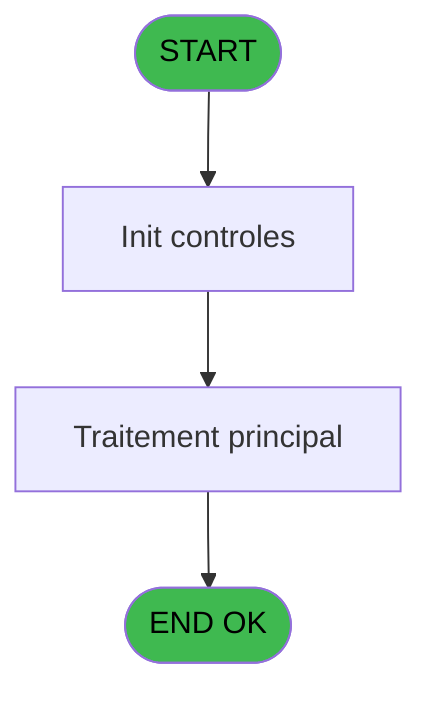
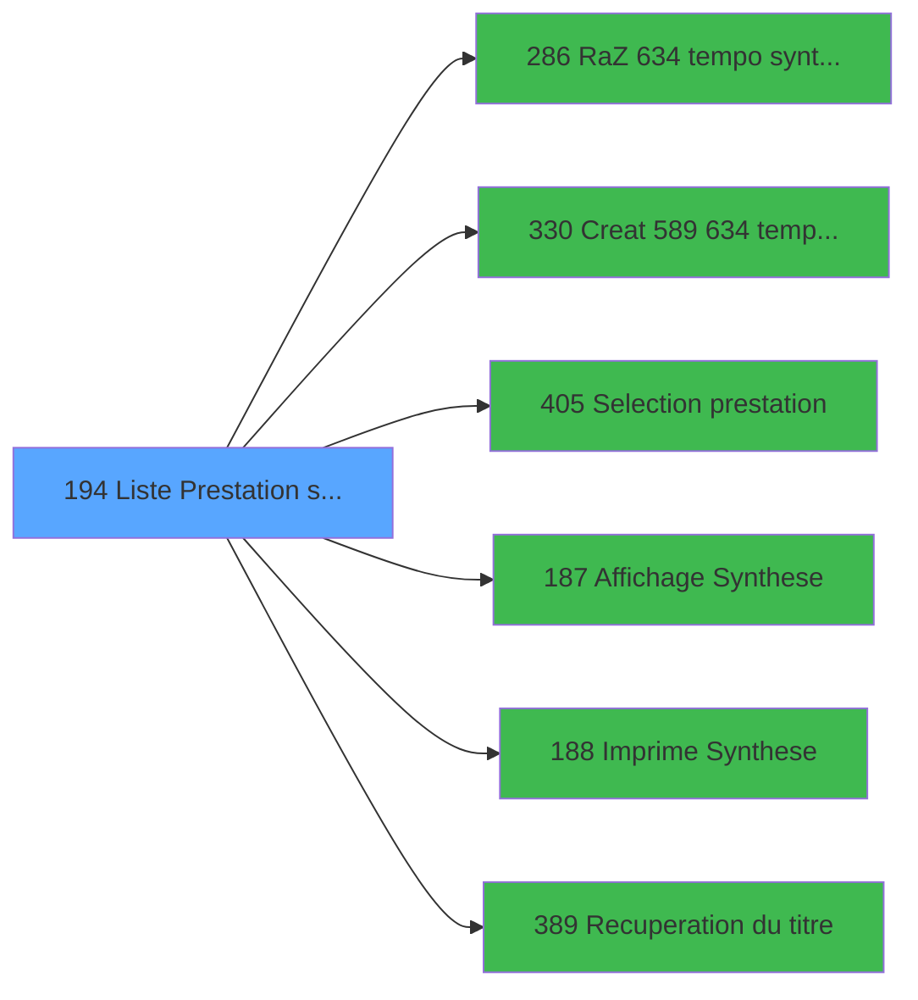

# PBP IDE 194 - Liste Prestation stock

> **Analyse**: Phases 1-4 2026-02-03 15:45 -> 15:45 (19s) | Assemblage 15:45
> **Pipeline**: V7.2 Enrichi
> **Structure**: 4 onglets (Resume | Ecrans | Donnees | Connexions)

<!-- TAB:Resume -->

## 1. FICHE D'IDENTITE

| Attribut | Valeur |
|----------|--------|
| Projet | PBP |
| IDE Position | 194 |
| Nom Programme | Liste Prestation stock |
| Fichier source | `Prg_194.xml` |
| Dossier IDE | Liste |
| Taches | 1 (1 ecrans visibles) |
| Tables modifiees | 0 |
| Programmes appeles | 6 |
| :warning: Statut | **ORPHELIN_POTENTIEL** |

## 2. DESCRIPTION FONCTIONNELLE

**Liste Prestation stock** assure la gestion complete de ce processus.

Le flux de traitement s'organise en **1 blocs fonctionnels** :

- **Calcul** (1 tache) : calculs de montants, stocks ou compteurs

**Logique metier** : 1 regles identifiees couvrant valeurs par defaut.

## 3. BLOCS FONCTIONNELS

### 3.1 Calcul (1 tache)

Calculs metier : montants, stocks, compteurs.

---

#### 194 - Liste Prestation stock [[ECRAN]](#ecran-t1)

**Role** : Calcul : Liste Prestation stock.
**Ecran** : 507 x 156 DLU (MDI) | [Voir mockup](#ecran-t1)
**Variables liees** : B (w0_CodePrestation), C (b_Prestation)

## 5. REGLES METIER

1 regles identifiees:

### Autres (1 regles)

#### [RM-001] Valeur par defaut si w0_CodePrestation [B] est vide

| Element | Detail |
|---------|--------|
| **Condition** | `w0_CodePrestation [B]=''` |
| **Si vrai** | 'Toutes Prestations' |
| **Si faux** | 'Prestation : '&w0_CodePrestation [B]) |
| **Variables** | B (w0_CodePrestation) |
| **Expression source** | Expression 13 : `IF (w0_CodePrestation [B]='','Toutes Prestations','Prestatio` |
| **Exemple** | Si w0_CodePrestation [B]='' → 'Toutes Prestations'. Sinon → 'Prestation : '&w0_CodePrestation [B]) |

## 6. CONTEXTE

- **Appele par**: (aucun)
- **Appelle**: 6 programmes | **Tables**: 0 (W:0 R:0 L:0) | **Taches**: 1 | **Expressions**: 17

<!-- TAB:Ecrans -->

## 8. ECRANS

### 8.1 Forms visibles (1 / 1)

| # | Position | Tache | Nom | Type | Largeur | Hauteur | Bloc |
|---|----------|-------|-----|------|---------|---------|------|
| 1 | 194 | 194 | Liste Prestation stock | MDI | 507 | 156 | Calcul |

### 8.2 Mockups Ecrans

---

#### 194 - Liste Prestation stock
**Tache** : [194](#t1) | **Type** : MDI | **Dimensions** : 507 x 156 DLU
**Bloc** : Calcul | **Titre IDE** : Liste Prestation stock

<!-- FORM-DATA:
{
    "width":  507,
    "vFactor":  8,
    "type":  "MDI",
    "hFactor":  8,
    "controls":  [
                     {
                         "x":  0,
                         "type":  "label",
                         "var":  "",
                         "y":  1,
                         "w":  500,
                         "fmt":  "",
                         "name":  "",
                         "h":  19,
                         "color":  "",
                         "text":  "",
                         "parent":  null
                     },
                     {
                         "x":  34,
                         "type":  "label",
                         "var":  "",
                         "y":  24,
                         "w":  242,
                         "fmt":  "",
                         "name":  "",
                         "h":  50,
                         "color":  "",
                         "text":  "",
                         "parent":  null
                     },
                     {
                         "x":  282,
                         "type":  "label",
                         "var":  "",
                         "y":  24,
                         "w":  186,
                         "fmt":  "",
                         "name":  "",
                         "h":  100,
                         "color":  "",
                         "text":  "",
                         "parent":  null
                     },
                     {
                         "x":  43,
                         "type":  "label",
                         "var":  "",
                         "y":  32,
                         "w":  83,
                         "fmt":  "",
                         "name":  "",
                         "h":  8,
                         "color":  "",
                         "text":  "Prestation",
                         "parent":  5
                     },
                     {
                         "x":  34,
                         "type":  "label",
                         "var":  "",
                         "y":  76,
                         "w":  242,
                         "fmt":  "",
                         "name":  "",
                         "h":  48,
                         "color":  "",
                         "text":  "",
                         "parent":  null
                     },
                     {
                         "x":  57,
                         "type":  "label",
                         "var":  "",
                         "y":  84,
                         "w":  30,
                         "fmt":  "",
                         "name":  "",
                         "h":  10,
                         "color":  "",
                         "text":  "Le",
                         "parent":  11
                     },
                     {
                         "x":  35,
                         "type":  "line",
                         "var":  "",
                         "y":  100,
                         "w":  239,
                         "fmt":  "",
                         "name":  "",
                         "h":  0,
                         "color":  "",
                         "text":  "",
                         "parent":  11
                     },
                     {
                         "x":  64,
                         "type":  "label",
                         "var":  "",
                         "y":  108,
                         "w":  86,
                         "fmt":  "",
                         "name":  "",
                         "h":  8,
                         "color":  "",
                         "text":  "Sélections",
                         "parent":  11
                     },
                     {
                         "x":  2,
                         "type":  "label",
                         "var":  "",
                         "y":  130,
                         "w":  500,
                         "fmt":  "",
                         "name":  "",
                         "h":  24,
                         "color":  "",
                         "text":  "",
                         "parent":  null
                     },
                     {
                         "x":  48,
                         "type":  "edit",
                         "var":  "",
                         "y":  44,
                         "w":  82,
                         "fmt":  "",
                         "name":  "w0_CodePrestation",
                         "h":  10,
                         "color":  "110",
                         "text":  "",
                         "parent":  5
                     },
                     {
                         "x":  136,
                         "type":  "button",
                         "var":  "",
                         "y":  44,
                         "w":  28,
                         "fmt":  "...",
                         "name":  "b_Prestation",
                         "h":  10,
                         "color":  "",
                         "text":  "",
                         "parent":  5
                     },
                     {
                         "x":  90,
                         "type":  "edit",
                         "var":  "",
                         "y":  84,
                         "w":  126,
                         "fmt":  "",
                         "name":  "w0_DateMini",
                         "h":  10,
                         "color":  "110",
                         "text":  "",
                         "parent":  11
                     },
                     {
                         "x":  220,
                         "type":  "button",
                         "var":  "",
                         "y":  84,
                         "w":  33,
                         "fmt":  "...",
                         "name":  "b_Date",
                         "h":  10,
                         "color":  "",
                         "text":  "",
                         "parent":  11
                     },
                     {
                         "x":  184,
                         "type":  "edit",
                         "var":  "",
                         "y":  108,
                         "w":  56,
                         "fmt":  "",
                         "name":  "w0_NbSelect",
                         "h":  9,
                         "color":  "",
                         "text":  "",
                         "parent":  11
                     },
                     {
                         "x":  299,
                         "type":  "button",
                         "var":  "",
                         "y":  80,
                         "w":  154,
                         "fmt":  "\u0026Ecran",
                         "name":  "b_Ecran",
                         "h":  18,
                         "color":  "",
                         "text":  "",
                         "parent":  6
                     },
                     {
                         "x":  299,
                         "type":  "button",
                         "var":  "",
                         "y":  101,
                         "w":  154,
                         "fmt":  "\u0026Impression",
                         "name":  "b_Imprimer",
                         "h":  18,
                         "color":  "",
                         "text":  "",
                         "parent":  6
                     },
                     {
                         "x":  7,
                         "type":  "edit",
                         "var":  "",
                         "y":  2,
                         "w":  267,
                         "fmt":  "20",
                         "name":  "",
                         "h":  8,
                         "color":  "",
                         "text":  "",
                         "parent":  1
                     },
                     {
                         "x":  291,
                         "type":  "edit",
                         "var":  "",
                         "y":  6,
                         "w":  203,
                         "fmt":  "WWW DD MMM YYYYT",
                         "name":  "",
                         "h":  8,
                         "color":  "",
                         "text":  "",
                         "parent":  1
                     },
                     {
                         "x":  7,
                         "type":  "edit",
                         "var":  "",
                         "y":  11,
                         "w":  237,
                         "fmt":  "30",
                         "name":  "",
                         "h":  8,
                         "color":  "",
                         "text":  "",
                         "parent":  1
                     },
                     {
                         "x":  294,
                         "type":  "image",
                         "var":  "",
                         "y":  29,
                         "w":  160,
                         "fmt":  "",
                         "name":  "",
                         "h":  46,
                         "color":  "",
                         "text":  "",
                         "parent":  6
                     },
                     {
                         "x":  48,
                         "type":  "edit",
                         "var":  "",
                         "y":  61,
                         "w":  213,
                         "fmt":  "18",
                         "name":  "",
                         "h":  9,
                         "color":  "142",
                         "text":  "",
                         "parent":  5
                     },
                     {
                         "x":  12,
                         "type":  "button",
                         "var":  "",
                         "y":  133,
                         "w":  154,
                         "fmt":  "\u0026Quitter",
                         "name":  "",
                         "h":  18,
                         "color":  "",
                         "text":  "",
                         "parent":  17
                     }
                 ],
    "taskId":  "194",
    "height":  156
}
-->

<strong>Champs : 7 champs</strong>

| Pos (x,y) | Nom | Variable | Type |
|-----------|-----|----------|------|
| 48,44 | w0_CodePrestation | - | edit |
| 90,84 | w0_DateMini | - | edit |
| 184,108 | w0_NbSelect | - | edit |
| 7,2 | 20 | - | edit |
| 291,6 | WWW DD MMM YYYYT | - | edit |
| 7,11 | 30 | - | edit |
| 48,61 | 18 | - | edit |

<strong>Boutons : 5 boutons</strong>

| Bouton | Pos (x,y) | Action |
|--------|-----------|--------|
| ... | 136,44 | Bouton fonctionnel |
| ... | 220,84 | Bouton fonctionnel |
| Ecran | 299,80 | Bouton fonctionnel |
| Impression | 299,101 | Bouton fonctionnel |
| Quitter | 12,133 | Quitte le programme |

## 9. NAVIGATION

Ecran unique: **Liste Prestation stock**

### 9.3 Structure hierarchique (1 tache)

| Position | Tache | Type | Dimensions | Bloc |
|----------|-------|------|------------|------|
| **194.1** | [**Liste Prestation stock** (194)](#t1) [mockup](#ecran-t1) | MDI | 507x156 | Calcul |

### 9.4 Algorigramme

> **Legende**: Vert = START/END OK | Rouge = END KO | Bleu = Decisions
> *Algorigramme auto-genere. Utiliser `/algorigramme` pour une synthese metier detaillee.*

<!-- TAB:Donnees -->

## 10. TABLES

### Tables utilisees (0)

| ID | Nom | Description | Type | R | W | L | Usages |
|----|-----|-------------|------|---|---|---|--------|

### Colonnes par table (0 / 0 tables avec colonnes identifiees)

## 11. VARIABLES

### 11.1 Autres (10)

Variables diverses.

| Lettre | Nom | Type | Usage dans |
|--------|-----|------|-----------|
| A | w0_TitreEcran | Alpha | 1x refs |
| B | w0_CodePrestation | Alpha | 1x refs |
| C | b_Prestation | Alpha | - |
| D | w0_DateMini | Date | 1x refs |
| E | b_Date | Alpha | - |
| F | w0_DateMaxi | Date | - |
| G | w0_Total | Numeric | - |
| H | w0_NbSelect | Numeric | 2x refs |
| I | b_Ecran | Alpha | - |
| J | b_Imprimer | Alpha | - |

## 12. EXPRESSIONS

**17 / 17 expressions decodees (100%)**

### 12.1 Repartition par type

| Type | Expressions | Regles |
|------|-------------|--------|
| CALCULATION | 1 | 0 |
| CONDITION | 3 | 5 |
| CONSTANTE | 7 | 0 |
| DATE | 1 | 0 |
| OTHER | 3 | 0 |
| REFERENCE_VG | 1 | 0 |
| STRING | 1 | 0 |

### 12.2 Expressions cles par type

#### CALCULATION (1 expressions)

| Type | IDE | Expression | Regle |
|------|-----|------------|-------|
| CALCULATION | 3 | `w0_DateMini [D]+14` | - |

#### CONDITION (3 expressions)

| Type | IDE | Expression | Regle |
|------|-----|------------|-------|
| CONDITION | 13 | `IF (w0_CodePrestation [B]='','Toutes Prestations','Prestation : '&w0_CodePrestation [B])` | [RM-001](#rm-RM-001) |
| CONDITION | 17 | `w0_NbSelect [H]=0` | - |
| CONDITION | 16 | `w0_NbSelect [H]>0` | - |

#### CONSTANTE (7 expressions)

| Type | IDE | Expression | Regle |
|------|-----|------------|-------|
| CONSTANTE | 9 | `'&Ecran'` | - |
| CONSTANTE | 10 | `'&Imprimer'` | - |
| CONSTANTE | 15 | `0` | - |
| CONSTANTE | 8 | `'...'` | - |
| CONSTANTE | 1 | `165` | - |
| ... | | *+2 autres* | |

#### DATE (1 expressions)

| Type | IDE | Expression | Regle |
|------|-----|------------|-------|
| DATE | 12 | `Date ()` | - |

#### OTHER (3 expressions)

| Type | IDE | Expression | Regle |
|------|-----|------------|-------|
| OTHER | 14 | `GetParam ('VILLAGE')` | - |
| OTHER | 7 | `SetCrsr (1)` | - |
| OTHER | 6 | `SetCrsr (2)` | - |

#### REFERENCE_VG (1 expressions)

| Type | IDE | Expression | Regle |
|------|-----|------------|-------|
| REFERENCE_VG | 11 | `VG2` | - |

#### STRING (1 expressions)

| Type | IDE | Expression | Regle |
|------|-----|------------|-------|
| STRING | 2 | `Trim (w0_TitreEcran [A])` | - |

<!-- TAB:Connexions -->

## 13. GRAPHE D'APPELS

### 13.1 Chaine depuis Main (Callers)

**Chemin**: (pas de callers directs)

### 13.2 Callers

| IDE | Nom Programme | Nb Appels |
|-----|---------------|-----------|
| - | (aucun) | - |

### 13.3 Callees (programmes appeles)

### 13.4 Detail Callees avec contexte

| IDE | Nom Programme | Appels | Contexte |
|-----|---------------|--------|----------|
| [286](PBP-IDE-286.md) | RaZ  634 tempo synthese | 2 | Reinitialisation |
| [330](PBP-IDE-330.md) | Creat 589 634 tempo prestation | 2 | Sous-programme |
| [405](PBP-IDE-405.md) | Selection prestation | 2 | Selection/consultation |
| [187](PBP-IDE-187.md) |   Affichage Synthese | 1 | Affichage donnees |
| [188](PBP-IDE-188.md) |   Imprime Synthese | 1 | Impression ticket/document |
| [389](PBP-IDE-389.md) | Recuperation du titre | 1 | Recuperation donnees |

## 14. RECOMMANDATIONS MIGRATION

### 14.1 Profil du programme

| Metrique | Valeur | Impact migration |
|----------|--------|-----------------|
| Lignes de logique | 45 | Programme compact |
| Expressions | 17 | Peu de logique |
| Tables WRITE | 0 | Impact faible |
| Sous-programmes | 6 | Dependances moderees |
| Ecrans visibles | 1 | Ecran unique ou traitement batch |
| Code desactive | 0% (0 / 45) | Code sain |
| Regles metier | 1 | Quelques regles a preserver |

### 14.2 Plan de migration par bloc

#### Calcul (1 tache: 1 ecran, 0 traitement)

- **Strategie** : Services de calcul purs (Domain Services).
- Migrer la logique de calcul (stock, compteurs, montants)

### 14.3 Dependances critiques

| Dependance | Type | Appels | Impact |
|------------|------|--------|--------|
| [Selection prestation (IDE 405)](PBP-IDE-405.md) | Sous-programme | 2x | Haute - Selection/consultation |
| [Creat 589 634 tempo prestation (IDE 330)](PBP-IDE-330.md) | Sous-programme | 2x | Haute - Sous-programme |
| [RaZ  634 tempo synthese (IDE 286)](PBP-IDE-286.md) | Sous-programme | 2x | Haute - Reinitialisation |
| [Recuperation du titre (IDE 389)](PBP-IDE-389.md) | Sous-programme | 1x | Normale - Recuperation donnees |
| [  Imprime Synthese (IDE 188)](PBP-IDE-188.md) | Sous-programme | 1x | Normale - Impression ticket/document |
| [  Affichage Synthese (IDE 187)](PBP-IDE-187.md) | Sous-programme | 1x | Normale - Affichage donnees |

---
*Spec DETAILED generee par Pipeline V7.2 - 2026-02-03 15:45*
