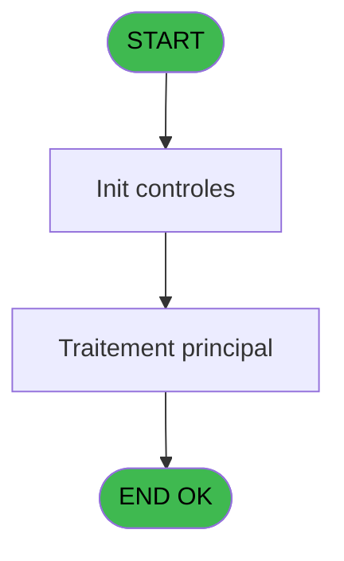
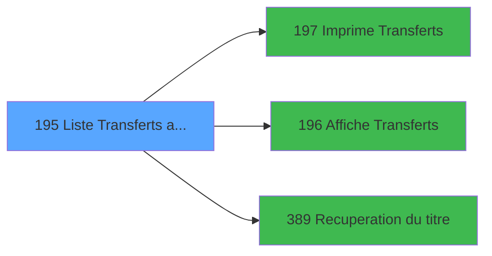

# PBP IDE 195 - Liste Transferts arrivants

> **Analyse**: Phases 1-4 2026-02-03 15:45 -> 15:45 (14s) | Assemblage 15:45
> **Pipeline**: V7.2 Enrichi
> **Structure**: 4 onglets (Resume | Ecrans | Donnees | Connexions)

<!-- TAB:Resume -->

## 1. FICHE D'IDENTITE

| Attribut | Valeur |
|----------|--------|
| Projet | PBP |
| IDE Position | 195 |
| Nom Programme | Liste Transferts arrivants |
| Fichier source | `Prg_195.xml` |
| Dossier IDE | Liste |
| Taches | 2 (1 ecrans visibles) |
| Tables modifiees | 0 |
| Programmes appeles | 3 |
| :warning: Statut | **ORPHELIN_POTENTIEL** |

## 2. DESCRIPTION FONCTIONNELLE

**Liste Transferts arrivants** assure la gestion complete de ce processus.

Le flux de traitement s'organise en **2 blocs fonctionnels** :

- **Traitement** (1 tache) : traitements metier divers
- **Transfert** (1 tache) : transferts de donnees entre modules ou deversements

Detail : phases du traitement

#### Phase 1 : Transfert (1 tache)

- **195** - Liste Transferts arrivants **[[ECRAN]](#ecran-t1)**

Delegue a : [  Affiche Transferts (IDE 196)](PBP-IDE-196.md)

#### Phase 2 : Traitement (1 tache)

- **195.1** - Count

Delegue a : [Recuperation du titre (IDE 389)](PBP-IDE-389.md)

## 3. BLOCS FONCTIONNELS

### 3.1 Transfert (1 tache)

Transfert de donnees entre modules.

---

#### 195 - Liste Transferts arrivants [[ECRAN]](#ecran-t1)

**Role** : Transfert de donnees : Liste Transferts arrivants.
**Ecran** : 558 x 175 DLU (MDI) | [Voir mockup](#ecran-t1)
**Delegue a** : [  Affiche Transferts (IDE 196)](PBP-IDE-196.md)

### 3.2 Traitement (1 tache)

Traitements internes.

---

#### 195.1 - Count

**Role** : Traitement : Count.
**Delegue a** : [Recuperation du titre (IDE 389)](PBP-IDE-389.md)

## 5. REGLES METIER

*(Aucune regle metier identifiee)*

## 6. CONTEXTE

- **Appele par**: (aucun)
- **Appelle**: 3 programmes | **Tables**: 1 (W:0 R:1 L:0) | **Taches**: 2 | **Expressions**: 20

<!-- TAB:Ecrans -->

## 8. ECRANS

### 8.1 Forms visibles (1 / 2)

| # | Position | Tache | Nom | Type | Largeur | Hauteur | Bloc |
|---|----------|-------|-----|------|---------|---------|------|
| 1 | 195 | 195 | Liste Transferts arrivants | MDI | 558 | 175 | Transfert |

### 8.2 Mockups Ecrans

---

#### 195 - Liste Transferts arrivants
**Tache** : [195](#t1) | **Type** : MDI | **Dimensions** : 558 x 175 DLU
**Bloc** : Transfert | **Titre IDE** : Liste Transferts arrivants

<!-- FORM-DATA:
{
    "width":  558,
    "vFactor":  8,
    "type":  "MDI",
    "hFactor":  8,
    "controls":  [
                     {
                         "x":  0,
                         "type":  "label",
                         "var":  "",
                         "y":  0,
                         "w":  556,
                         "fmt":  "",
                         "name":  "",
                         "h":  19,
                         "color":  "",
                         "text":  "",
                         "parent":  null
                     },
                     {
                         "x":  52,
                         "type":  "label",
                         "var":  "",
                         "y":  24,
                         "w":  268,
                         "fmt":  "",
                         "name":  "",
                         "h":  121,
                         "color":  "",
                         "text":  "",
                         "parent":  null
                     },
                     {
                         "x":  320,
                         "type":  "label",
                         "var":  "",
                         "y":  24,
                         "w":  186,
                         "fmt":  "",
                         "name":  "",
                         "h":  121,
                         "color":  "",
                         "text":  "",
                         "parent":  null
                     },
                     {
                         "x":  62,
                         "type":  "label",
                         "var":  "",
                         "y":  36,
                         "w":  46,
                         "fmt":  "",
                         "name":  "",
                         "h":  8,
                         "color":  "",
                         "text":  "Du",
                         "parent":  5
                     },
                     {
                         "x":  62,
                         "type":  "label",
                         "var":  "",
                         "y":  70,
                         "w":  45,
                         "fmt":  "",
                         "name":  "",
                         "h":  8,
                         "color":  "",
                         "text":  "Au",
                         "parent":  5
                     },
                     {
                         "x":  78,
                         "type":  "label",
                         "var":  "",
                         "y":  113,
                         "w":  86,
                         "fmt":  "",
                         "name":  "",
                         "h":  8,
                         "color":  "",
                         "text":  "Sélections",
                         "parent":  5
                     },
                     {
                         "x":  0,
                         "type":  "label",
                         "var":  "",
                         "y":  151,
                         "w":  556,
                         "fmt":  "",
                         "name":  "",
                         "h":  24,
                         "color":  "",
                         "text":  "",
                         "parent":  null
                     },
                     {
                         "x":  131,
                         "type":  "edit",
                         "var":  "",
                         "y":  36,
                         "w":  126,
                         "fmt":  "DD/MM/YYYY",
                         "name":  "w0_DateMin",
                         "h":  10,
                         "color":  "110",
                         "text":  "",
                         "parent":  5
                     },
                     {
                         "x":  267,
                         "type":  "button",
                         "var":  "",
                         "y":  36,
                         "w":  33,
                         "fmt":  "...",
                         "name":  "b_DateMin",
                         "h":  10,
                         "color":  "",
                         "text":  "",
                         "parent":  5
                     },
                     {
                         "x":  131,
                         "type":  "edit",
                         "var":  "",
                         "y":  70,
                         "w":  126,
                         "fmt":  "DD/MM/YYYY",
                         "name":  "w0_DateMax",
                         "h":  10,
                         "color":  "110",
                         "text":  "",
                         "parent":  5
                     },
                     {
                         "x":  267,
                         "type":  "button",
                         "var":  "",
                         "y":  70,
                         "w":  33,
                         "fmt":  "...",
                         "name":  "b_DateMax",
                         "h":  10,
                         "color":  "",
                         "text":  "",
                         "parent":  5
                     },
                     {
                         "x":  198,
                         "type":  "edit",
                         "var":  "",
                         "y":  113,
                         "w":  56,
                         "fmt":  "",
                         "name":  "w0_NbSelect",
                         "h":  9,
                         "color":  "",
                         "text":  "",
                         "parent":  5
                     },
                     {
                         "x":  338,
                         "type":  "button",
                         "var":  "",
                         "y":  86,
                         "w":  154,
                         "fmt":  "\u0026Ecran",
                         "name":  "b_Ecran",
                         "h":  18,
                         "color":  "",
                         "text":  "",
                         "parent":  6
                     },
                     {
                         "x":  338,
                         "type":  "button",
                         "var":  "",
                         "y":  105,
                         "w":  154,
                         "fmt":  "\u0026Impression",
                         "name":  "b_Imprimer",
                         "h":  18,
                         "color":  "",
                         "text":  "",
                         "parent":  6
                     },
                     {
                         "x":  8,
                         "type":  "edit",
                         "var":  "",
                         "y":  2,
                         "w":  267,
                         "fmt":  "20",
                         "name":  "",
                         "h":  8,
                         "color":  "",
                         "text":  "",
                         "parent":  1
                     },
                     {
                         "x":  340,
                         "type":  "edit",
                         "var":  "",
                         "y":  6,
                         "w":  203,
                         "fmt":  "WWW DD MMM YYYYT",
                         "name":  "",
                         "h":  8,
                         "color":  "",
                         "text":  "",
                         "parent":  1
                     },
                     {
                         "x":  8,
                         "type":  "edit",
                         "var":  "",
                         "y":  10,
                         "w":  331,
                         "fmt":  "25",
                         "name":  "",
                         "h":  8,
                         "color":  "",
                         "text":  "",
                         "parent":  1
                     },
                     {
                         "x":  357,
                         "type":  "image",
                         "var":  "",
                         "y":  29,
                         "w":  128,
                         "fmt":  "",
                         "name":  "",
                         "h":  56,
                         "color":  "",
                         "text":  "",
                         "parent":  6
                     },
                     {
                         "x":  9,
                         "type":  "button",
                         "var":  "",
                         "y":  154,
                         "w":  154,
                         "fmt":  "\u0026Quitter",
                         "name":  "",
                         "h":  18,
                         "color":  "",
                         "text":  "",
                         "parent":  14
                     },
                     {
                         "x":  338,
                         "type":  "button",
                         "var":  "",
                         "y":  124,
                         "w":  154,
                         "fmt":  "E\u0026xcel",
                         "name":  "b_Excel",
                         "h":  18,
                         "color":  "",
                         "text":  "",
                         "parent":  null
                     }
                 ],
    "taskId":  "195",
    "height":  175
}
-->

<strong>Champs : 6 champs</strong>

| Pos (x,y) | Nom | Variable | Type |
|-----------|-----|----------|------|
| 131,36 | w0_DateMin | - | edit |
| 131,70 | w0_DateMax | - | edit |
| 198,113 | w0_NbSelect | - | edit |
| 8,2 | 20 | - | edit |
| 340,6 | WWW DD MMM YYYYT | - | edit |
| 8,10 | 25 | - | edit |

<strong>Boutons : 6 boutons</strong>

| Bouton | Pos (x,y) | Action |
|--------|-----------|--------|
| ... | 267,36 | Bouton fonctionnel |
| ... | 267,70 | Bouton fonctionnel |
| Ecran | 338,86 | Bouton fonctionnel |
| Impression | 338,105 | Bouton fonctionnel |
| Quitter | 9,154 | Quitte le programme |
| Excel | 338,124 | Bouton fonctionnel |

## 9. NAVIGATION

Ecran unique: **Liste Transferts arrivants**

### 9.3 Structure hierarchique (2 taches)

| Position | Tache | Type | Dimensions | Bloc |
|----------|-------|------|------------|------|
| **195.1** | [**Liste Transferts arrivants** (195)](#t1) [mockup](#ecran-t1) | MDI | 558x175 | Transfert |
| **195.2** | [**Count** (195.1)](#t2) | MDI | - | Traitement |

### 9.4 Algorigramme

> **Legende**: Vert = START/END OK | Rouge = END KO | Bleu = Decisions
> *Algorigramme auto-genere. Utiliser `/algorigramme` pour une synthese metier detaillee.*

<!-- TAB:Donnees -->

## 10. TABLES

### Tables utilisees (1)

| ID | Nom | Description | Type | R | W | L | Usages |
|----|-----|-------------|------|---|---|---|--------|
| 473 | comptage_caisse | Sessions de caisse | TMP | R |   |   | 1 |

### Colonnes par table (0 / 1 tables avec colonnes identifiees)

Table 473 - comptage_caisse (R) - 1 usages

*Table utilisee uniquement en Link ou aucune colonne Real identifiee dans le DataView.*

## 11. VARIABLES

### 11.1 Variables de session (1)

Variables persistantes pendant toute la session.

| Lettre | Nom | Type | Usage dans |
|--------|-----|------|-----------|
| J | v.NomFichier | Alpha | - |

### 11.2 Autres (9)

Variables diverses.

| Lettre | Nom | Type | Usage dans |
|--------|-----|------|-----------|
| A | w0_TitreEcran | Alpha | 1x refs |
| B | w0_DateMin | Date | 2x refs |
| C | b_DateMin | Alpha | - |
| D | w0_DateMax | Date | 1x refs |
| E | b_DateMax | Alpha | - |
| F | w0_NbSelect | Numeric | 2x refs |
| G | b_Ecran | Alpha | - |
| H | b_Imprimer | Alpha | - |
| I | b_Excel | Alpha | - |

## 12. EXPRESSIONS

**20 / 20 expressions decodees (100%)**

### 12.1 Repartition par type

| Type | Expressions | Regles |
|------|-------------|--------|
| CONSTANTE | 7 | 0 |
| FORMAT | 1 | 0 |
| DATE | 1 | 0 |
| CAST_LOGIQUE | 1 | 0 |
| OTHER | 5 | 0 |
| REFERENCE_VG | 1 | 0 |
| CONDITION | 3 | 0 |
| STRING | 1 | 0 |

### 12.2 Expressions cles par type

#### CONSTANTE (7 expressions)

| Type | IDE | Expression | Regle |
|------|-----|------------|-------|
| CONSTANTE | 11 | `'&Imprimer'` | - |
| CONSTANTE | 12 | `'E&xcel'` | - |
| CONSTANTE | 18 | `0` | - |
| CONSTANTE | 10 | `'&Ecran'` | - |
| CONSTANTE | 3 | `172` | - |
| ... | | *+2 autres* | |

#### FORMAT (1 expressions)

| Type | IDE | Expression | Regle |
|------|-----|------------|-------|
| FORMAT | 2 | `Translate ('%club_exportdata%')&'TRANSFERT_ARRIVANT_'&DStr(Date(),'YYYYMMDD')&'_'&TStr(Time(),'HHMMSS')&'.csv'` | - |

#### DATE (1 expressions)

| Type | IDE | Expression | Regle |
|------|-----|------------|-------|
| DATE | 6 | `Date ()` | - |

#### CAST_LOGIQUE (1 expressions)

| Type | IDE | Expression | Regle |
|------|-----|------------|-------|
| CAST_LOGIQUE | 1 | `'TRUE'LOG` | - |

#### OTHER (5 expressions)

| Type | IDE | Expression | Regle |
|------|-----|------------|-------|
| OTHER | 15 | `GetParam ('VILLAGE')` | - |
| OTHER | 20 | `[T]` | - |
| OTHER | 14 | `w0_DateMin [B]` | - |
| OTHER | 7 | `SetCrsr (2)` | - |
| OTHER | 8 | `SetCrsr (1)` | - |

#### REFERENCE_VG (1 expressions)

| Type | IDE | Expression | Regle |
|------|-----|------------|-------|
| REFERENCE_VG | 13 | `VG2` | - |

#### CONDITION (3 expressions)

| Type | IDE | Expression | Regle |
|------|-----|------------|-------|
| CONDITION | 19 | `w0_DateMin [B]>w0_DateMax [D]` | - |
| CONDITION | 17 | `w0_NbSelect [F]=0` | - |
| CONDITION | 16 | `w0_NbSelect [F]>0` | - |

#### STRING (1 expressions)

| Type | IDE | Expression | Regle |
|------|-----|------------|-------|
| STRING | 5 | `Trim (w0_TitreEcran [A])` | - |

<!-- TAB:Connexions -->

## 13. GRAPHE D'APPELS

### 13.1 Chaine depuis Main (Callers)

**Chemin**: (pas de callers directs)

### 13.2 Callers

| IDE | Nom Programme | Nb Appels |
|-----|---------------|-----------|
| - | (aucun) | - |

### 13.3 Callees (programmes appeles)

### 13.4 Detail Callees avec contexte

| IDE | Nom Programme | Appels | Contexte |
|-----|---------------|--------|----------|
| [197](PBP-IDE-197.md) |   Imprime Transferts | 2 | Impression ticket/document |
| [196](PBP-IDE-196.md) |   Affiche Transferts | 1 | Transfert donnees |
| [389](PBP-IDE-389.md) | Recuperation du titre | 1 | Recuperation donnees |

## 14. RECOMMANDATIONS MIGRATION

### 14.1 Profil du programme

| Metrique | Valeur | Impact migration |
|----------|--------|-----------------|
| Lignes de logique | 50 | Programme compact |
| Expressions | 20 | Peu de logique |
| Tables WRITE | 0 | Impact faible |
| Sous-programmes | 3 | Peu de dependances |
| Ecrans visibles | 1 | Ecran unique ou traitement batch |
| Code desactive | 0% (0 / 50) | Code sain |
| Regles metier | 0 | Pas de regle identifiee |

### 14.2 Plan de migration par bloc

#### Transfert (1 tache: 1 ecran, 0 traitement)

- **Strategie** : Service `ITransfertService` avec logique de deversement.

#### Traitement (1 tache: 0 ecran, 1 traitement)

- **Strategie** : 1 service(s) backend injectable(s) (Domain Services).
- 3 sous-programme(s) a migrer ou a reutiliser depuis les services existants.
- Decomposer les taches en services unitaires testables.

### 14.3 Dependances critiques

| Dependance | Type | Appels | Impact |
|------------|------|--------|--------|
| [  Imprime Transferts (IDE 197)](PBP-IDE-197.md) | Sous-programme | 2x | Haute - Impression ticket/document |
| [Recuperation du titre (IDE 389)](PBP-IDE-389.md) | Sous-programme | 1x | Normale - Recuperation donnees |
| [  Affiche Transferts (IDE 196)](PBP-IDE-196.md) | Sous-programme | 1x | Normale - Transfert donnees |

---
*Spec DETAILED generee par Pipeline V7.2 - 2026-02-03 15:45*
