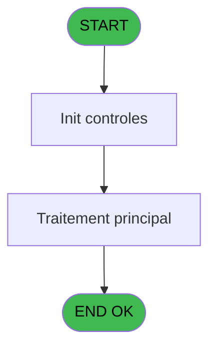
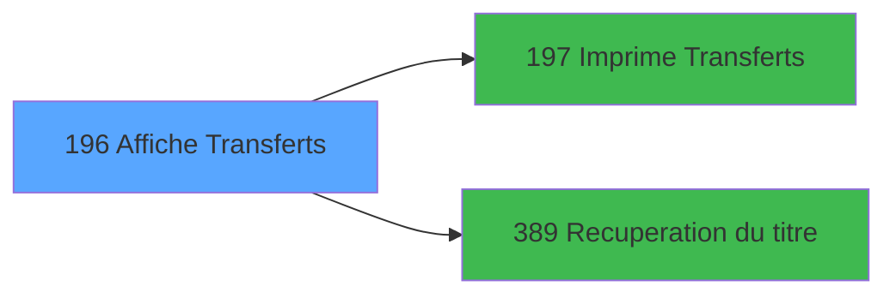

# PBP IDE 196 - Affiche Transferts

> **Analyse**: Phases 1-4 2026-02-03 15:45 -> 15:46 (13s) | Assemblage 15:46
> **Pipeline**: V7.2 Enrichi
> **Structure**: 4 onglets (Resume | Ecrans | Donnees | Connexions)

<!-- TAB:Resume -->

## 1. FICHE D'IDENTITE

| Attribut | Valeur |
|----------|--------|
| Projet | PBP |
| IDE Position | 196 |
| Nom Programme | Affiche Transferts |
| Fichier source | `Prg_196.xml` |
| Dossier IDE | Liste |
| Taches | 1 (1 ecrans visibles) |
| Tables modifiees | 0 |
| Programmes appeles | 2 |

## 2. DESCRIPTION FONCTIONNELLE

**Affiche Transferts** assure la gestion complete de ce processus, accessible depuis [Liste Transferts arrivants (IDE 195)](PBP-IDE-195.md).

Le flux de traitement s'organise en **1 blocs fonctionnels** :

- **Consultation** (1 tache) : ecrans de recherche, selection et consultation

## 3. BLOCS FONCTIONNELS

### 3.1 Consultation (1 tache)

Ecrans de recherche et consultation.

---

#### 196 - Affiche Prestation [[ECRAN]](#ecran-t1)

**Role** : Reinitialisation : Affiche Prestation.
**Ecran** : 1629 x 236 DLU (MDI) | [Voir mockup](#ecran-t1)

## 5. REGLES METIER

*(Aucune regle metier identifiee)*

## 6. CONTEXTE

- **Appele par**: [Liste Transferts arrivants (IDE 195)](PBP-IDE-195.md)
- **Appelle**: 2 programmes | **Tables**: 2 (W:0 R:1 L:1) | **Taches**: 1 | **Expressions**: 16

<!-- TAB:Ecrans -->

## 8. ECRANS

### 8.1 Forms visibles (1 / 1)

| # | Position | Tache | Nom | Type | Largeur | Hauteur | Bloc |
|---|----------|-------|-----|------|---------|---------|------|
| 1 | 196 | 196 | Affiche Prestation | MDI | 1629 | 236 | Consultation |

### 8.2 Mockups Ecrans

---

#### 196 - Affiche Prestation
**Tache** : [196](#t1) | **Type** : MDI | **Dimensions** : 1629 x 236 DLU
**Bloc** : Consultation | **Titre IDE** : Affiche Prestation

<!-- FORM-DATA:
{
    "width":  1629,
    "vFactor":  8,
    "type":  "MDI",
    "hFactor":  8,
    "controls":  [
                     {
                         "x":  0,
                         "type":  "label",
                         "var":  "",
                         "y":  0,
                         "w":  1623,
                         "fmt":  "",
                         "name":  "",
                         "h":  19,
                         "color":  "",
                         "text":  "",
                         "parent":  null
                     },
                     {
                         "x":  23,
                         "type":  "table",
                         "var":  "",
                         "name":  "",
                         "titleH":  12,
                         "color":  "110",
                         "w":  1589,
                         "y":  26,
                         "fmt":  "",
                         "parent":  null,
                         "text":  "",
                         "rowH":  15,
                         "h":  146,
                         "cols":  [
                                      {
                                          "title":  "Titre",
                                          "layer":  1,
                                          "w":  52
                                      },
                                      {
                                          "title":  "Nom",
                                          "layer":  2,
                                          "w":  188
                                      },
                                      {
                                          "title":  "Prénom",
                                          "layer":  3,
                                          "w":  130
                                      },
                                      {
                                          "title":  "Date",
                                          "layer":  4,
                                          "w":  116
                                      },
                                      {
                                          "title":  "Heure",
                                          "layer":  5,
                                          "w":  81
                                      },
                                      {
                                          "title":  "Code Lieu",
                                          "layer":  6,
                                          "w":  138
                                      },
                                      {
                                          "title":  "Type",
                                          "layer":  7,
                                          "w":  160
                                      },
                                      {
                                          "title":  "Compagnie",
                                          "layer":  8,
                                          "w":  113
                                      },
                                      {
                                          "title":  "Vol",
                                          "layer":  9,
                                          "w":  119
                                      },
                                      {
                                          "title":  "Commentaire",
                                          "layer":  10,
                                          "w":  362
                                      },
                                      {
                                          "title":  "Sens",
                                          "layer":  11,
                                          "w":  95
                                      }
                                  ],
                         "rows":  11
                     },
                     {
                         "x":  459,
                         "type":  "label",
                         "var":  "",
                         "y":  179,
                         "w":  711,
                         "fmt":  "",
                         "name":  "",
                         "h":  29,
                         "color":  "195",
                         "text":  "Vol Précédent",
                         "parent":  null
                     },
                     {
                         "x":  481,
                         "type":  "label",
                         "var":  "",
                         "y":  193,
                         "w":  94,
                         "fmt":  "",
                         "name":  "",
                         "h":  10,
                         "color":  "",
                         "text":  "Compagnie",
                         "parent":  29
                     },
                     {
                         "x":  887,
                         "type":  "label",
                         "var":  "",
                         "y":  193,
                         "w":  46,
                         "fmt":  "",
                         "name":  "",
                         "h":  10,
                         "color":  "",
                         "text":  "Vol",
                         "parent":  29
                     },
                     {
                         "x":  0,
                         "type":  "label",
                         "var":  "",
                         "y":  211,
                         "w":  1623,
                         "fmt":  "",
                         "name":  "",
                         "h":  23,
                         "color":  "",
                         "text":  "",
                         "parent":  null
                     },
                     {
                         "x":  398,
                         "type":  "edit",
                         "var":  "",
                         "y":  42,
                         "w":  109,
                         "fmt":  "",
                         "name":  "TRF Date",
                         "h":  10,
                         "color":  "110",
                         "text":  "",
                         "parent":  6
                     },
                     {
                         "x":  515,
                         "type":  "edit",
                         "var":  "",
                         "y":  42,
                         "w":  67,
                         "fmt":  "HH:MM",
                         "name":  "TRF Heure",
                         "h":  10,
                         "color":  "110",
                         "text":  "",
                         "parent":  6
                     },
                     {
                         "x":  597,
                         "type":  "edit",
                         "var":  "",
                         "y":  42,
                         "w":  104,
                         "fmt":  "",
                         "name":  "TRF Code AER",
                         "h":  10,
                         "color":  "110",
                         "text":  "",
                         "parent":  6
                     },
                     {
                         "x":  894,
                         "type":  "edit",
                         "var":  "",
                         "y":  42,
                         "w":  104,
                         "fmt":  "",
                         "name":  "TRF Compagnie",
                         "h":  10,
                         "color":  "110",
                         "text":  "",
                         "parent":  6
                     },
                     {
                         "x":  1006,
                         "type":  "edit",
                         "var":  "",
                         "y":  42,
                         "w":  104,
                         "fmt":  "",
                         "name":  "TRF Vol",
                         "h":  10,
                         "color":  "110",
                         "text":  "",
                         "parent":  6
                     },
                     {
                         "x":  1126,
                         "type":  "edit",
                         "var":  "",
                         "y":  42,
                         "w":  350,
                         "fmt":  "",
                         "name":  "TRF Commentaire",
                         "h":  10,
                         "color":  "110",
                         "text":  "",
                         "parent":  6
                     },
                     {
                         "x":  734,
                         "type":  "edit",
                         "var":  "",
                         "y":  42,
                         "w":  153,
                         "fmt":  "30",
                         "name":  "TRF Type",
                         "h":  10,
                         "color":  "110",
                         "text":  "",
                         "parent":  6
                     },
                     {
                         "x":  1488,
                         "type":  "edit",
                         "var":  "",
                         "y":  42,
                         "w":  26,
                         "fmt":  "",
                         "name":  "TRF Sens",
                         "h":  10,
                         "color":  "110",
                         "text":  "",
                         "parent":  6
                     },
                     {
                         "x":  590,
                         "type":  "edit",
                         "var":  "",
                         "y":  193,
                         "w":  115,
                         "fmt":  "",
                         "name":  "TRF Compagnie Prec",
                         "h":  10,
                         "color":  "",
                         "text":  "",
                         "parent":  29
                     },
                     {
                         "x":  947,
                         "type":  "edit",
                         "var":  "",
                         "y":  193,
                         "w":  126,
                         "fmt":  "",
                         "name":  "TRF Vol Prec",
                         "h":  10,
                         "color":  "",
                         "text":  "",
                         "parent":  29
                     },
                     {
                         "x":  27,
                         "type":  "edit",
                         "var":  "",
                         "y":  42,
                         "w":  30,
                         "fmt":  "",
                         "name":  "",
                         "h":  10,
                         "color":  "110",
                         "text":  "",
                         "parent":  6
                     },
                     {
                         "x":  85,
                         "type":  "edit",
                         "var":  "",
                         "y":  42,
                         "w":  176,
                         "fmt":  "",
                         "name":  "",
                         "h":  10,
                         "color":  "110",
                         "text":  "",
                         "parent":  6
                     },
                     {
                         "x":  269,
                         "type":  "edit",
                         "var":  "",
                         "y":  42,
                         "w":  120,
                         "fmt":  "",
                         "name":  "",
                         "h":  10,
                         "color":  "110",
                         "text":  "",
                         "parent":  6
                     },
                     {
                         "x":  172,
                         "type":  "button",
                         "var":  "",
                         "y":  214,
                         "w":  154,
                         "fmt":  "\u0026Impression",
                         "name":  "b_Imprimer",
                         "h":  18,
                         "color":  "",
                         "text":  "",
                         "parent":  34
                     },
                     {
                         "x":  6,
                         "type":  "edit",
                         "var":  "",
                         "y":  2,
                         "w":  267,
                         "fmt":  "30",
                         "name":  "",
                         "h":  8,
                         "color":  "",
                         "text":  "",
                         "parent":  1
                     },
                     {
                         "x":  642,
                         "type":  "edit",
                         "var":  "",
                         "y":  6,
                         "w":  344,
                         "fmt":  "30",
                         "name":  "",
                         "h":  8,
                         "color":  "",
                         "text":  "",
                         "parent":  1
                     },
                     {
                         "x":  1349,
                         "type":  "edit",
                         "var":  "",
                         "y":  6,
                         "w":  267,
                         "fmt":  "WWW DD MMM YYYYT",
                         "name":  "",
                         "h":  8,
                         "color":  "",
                         "text":  "",
                         "parent":  1
                     },
                     {
                         "x":  6,
                         "type":  "edit",
                         "var":  "",
                         "y":  10,
                         "w":  267,
                         "fmt":  "30",
                         "name":  "",
                         "h":  8,
                         "color":  "",
                         "text":  "",
                         "parent":  1
                     },
                     {
                         "x":  7,
                         "type":  "button",
                         "var":  "",
                         "y":  214,
                         "w":  154,
                         "fmt":  "\u0026Quitter",
                         "name":  "",
                         "h":  18,
                         "color":  "",
                         "text":  "",
                         "parent":  34
                     }
                 ],
    "taskId":  "196",
    "height":  236
}
-->

<strong>Champs : 17 champs</strong>

| Pos (x,y) | Nom | Variable | Type |
|-----------|-----|----------|------|
| 398,42 | TRF Date | - | edit |
| 515,42 | TRF Heure | - | edit |
| 597,42 | TRF Code AER | - | edit |
| 894,42 | TRF Compagnie | - | edit |
| 1006,42 | TRF Vol | - | edit |
| 1126,42 | TRF Commentaire | - | edit |
| 734,42 | TRF Type | - | edit |
| 1488,42 | TRF Sens | - | edit |
| 590,193 | TRF Compagnie Prec | - | edit |
| 947,193 | TRF Vol Prec | - | edit |
| 27,42 | (sans nom) | - | edit |
| 85,42 | (sans nom) | - | edit |
| 269,42 | (sans nom) | - | edit |
| 6,2 | 30 | - | edit |
| 642,6 | 30 | - | edit |
| 1349,6 | WWW DD MMM YYYYT | - | edit |
| 6,10 | 30 | - | edit |

<strong>Boutons : 2 boutons</strong>

| Bouton | Pos (x,y) | Action |
|--------|-----------|--------|
| Impression | 172,214 | Bouton fonctionnel |
| Quitter | 7,214 | Quitte le programme |

## 9. NAVIGATION

Ecran unique: **Affiche Prestation**

### 9.3 Structure hierarchique (1 tache)

| Position | Tache | Type | Dimensions | Bloc |
|----------|-------|------|------------|------|
| **196.1** | [**Affiche Prestation** (196)](#t1) [mockup](#ecran-t1) | MDI | 1629x236 | Consultation |

### 9.4 Algorigramme

> **Legende**: Vert = START/END OK | Rouge = END KO | Bleu = Decisions
> *Algorigramme auto-genere. Utiliser `/algorigramme` pour une synthese metier detaillee.*

<!-- TAB:Donnees -->

## 10. TABLES

### Tables utilisees (2)

| ID | Nom | Description | Type | R | W | L | Usages |
|----|-----|-------------|------|---|---|---|--------|
| 31 | gm-complet_______gmc |  | DB | R |   |   | 1 |
| 473 | comptage_caisse | Sessions de caisse | TMP |   |   | L | 1 |

### Colonnes par table (1 / 1 tables avec colonnes identifiees)

Table 31 - gm-complet_______gmc (R) - 1 usages

| Lettre | Variable | Acces | Type |
|--------|----------|-------|------|
| A | >DateMin | R | Date |
| B | >DateMax | R | Date |
| C | >NbSelect | R | Numeric |
| D | >CodeEcran | R | Numeric |
| E | w0_TitreEcran | R | Alpha |
| F | v.retour GM | R | Logical |
| G | b_Imprimer | R | Alpha |

## 11. VARIABLES

### 11.1 Variables de session (1)

Variables persistantes pendant toute la session.

| Lettre | Nom | Type | Usage dans |
|--------|-----|------|-----------|
| F | v.retour GM | Logical | 1x session |

### 11.2 Autres (6)

Variables diverses.

| Lettre | Nom | Type | Usage dans |
|--------|-----|------|-----------|
| A | >DateMin | Date | 1x refs |
| B | >DateMax | Date | 1x refs |
| C | >NbSelect | Numeric | 1x refs |
| D | >CodeEcran | Numeric | - |
| E | w0_TitreEcran | Alpha | 1x refs |
| G | b_Imprimer | Alpha | 1x refs |

## 12. EXPRESSIONS

**16 / 16 expressions decodees (100%)**

### 12.1 Repartition par type

| Type | Expressions | Regles |
|------|-------------|--------|
| CONDITION | 4 | 0 |
| CONSTANTE | 1 | 0 |
| DATE | 1 | 0 |
| OTHER | 7 | 0 |
| REFERENCE_VG | 1 | 0 |
| STRING | 1 | 0 |
| CONCATENATION | 1 | 0 |

### 12.2 Expressions cles par type

#### CONDITION (4 expressions)

| Type | IDE | Expression | Regle |
|------|-----|------------|-------|
| CONDITION | 2 | `>DateMax [B]` | - |
| CONDITION | 14 | `Trim ([R])<>''` | - |
| CONDITION | 16 | `CASE([O],'TR',MlsTrans('Gare'),'PL',MlsTrans('Aéroport'),'TE',MlsTrans('Terminal'),'AU',MlsTrans('Autre'),[O])` | - |
| CONDITION | 1 | `>DateMin [A]` | - |

#### CONSTANTE (1 expressions)

| Type | IDE | Expression | Regle |
|------|-----|------------|-------|
| CONSTANTE | 10 | `'&Imprimer'` | - |

#### DATE (1 expressions)

| Type | IDE | Expression | Regle |
|------|-----|------------|-------|
| DATE | 7 | `Date ()` | - |

#### OTHER (7 expressions)

| Type | IDE | Expression | Regle |
|------|-----|------------|-------|
| OTHER | 9 | `SetCrsr (1)` | - |
| OTHER | 12 | `GetParam ('VILLAGE')` | - |
| OTHER | 15 | `[S]` | - |
| OTHER | 8 | `SetCrsr (2)` | - |
| OTHER | 3 | `v.retour GM [F]` | - |
| ... | | *+2 autres* | |

#### REFERENCE_VG (1 expressions)

| Type | IDE | Expression | Regle |
|------|-----|------------|-------|
| REFERENCE_VG | 6 | `VG2` | - |

#### STRING (1 expressions)

| Type | IDE | Expression | Regle |
|------|-----|------------|-------|
| STRING | 11 | `Trim (w0_TitreEcran [E])` | - |

#### CONCATENATION (1 expressions)

| Type | IDE | Expression | Regle |
|------|-----|------------|-------|
| CONCATENATION | 13 | `Str (>NbSelect [C],'4')&' '&MlsTrans ('selectionnes')` | - |

<!-- TAB:Connexions -->

## 13. GRAPHE D'APPELS

### 13.1 Chaine depuis Main (Callers)

Main -> ... -> [Liste Transferts arrivants (IDE 195)](PBP-IDE-195.md) -> **Affiche Transferts (IDE 196)**

### 13.2 Callers

| IDE | Nom Programme | Nb Appels |
|-----|---------------|-----------|
| [195](PBP-IDE-195.md) | Liste Transferts arrivants | 1 |

### 13.3 Callees (programmes appeles)

### 13.4 Detail Callees avec contexte

| IDE | Nom Programme | Appels | Contexte |
|-----|---------------|--------|----------|
| [197](PBP-IDE-197.md) |   Imprime Transferts | 1 | Impression ticket/document |
| [389](PBP-IDE-389.md) | Recuperation du titre | 1 | Recuperation donnees |

## 14. RECOMMANDATIONS MIGRATION

### 14.1 Profil du programme

| Metrique | Valeur | Impact migration |
|----------|--------|-----------------|
| Lignes de logique | 37 | Programme compact |
| Expressions | 16 | Peu de logique |
| Tables WRITE | 0 | Impact faible |
| Sous-programmes | 2 | Peu de dependances |
| Ecrans visibles | 1 | Ecran unique ou traitement batch |
| Code desactive | 0% (0 / 37) | Code sain |
| Regles metier | 0 | Pas de regle identifiee |

### 14.2 Plan de migration par bloc

#### Consultation (1 tache: 1 ecran, 0 traitement)

- **Strategie** : Composants de recherche/selection en modales.
- 1 ecran : Affiche Prestation

### 14.3 Dependances critiques

| Dependance | Type | Appels | Impact |
|------------|------|--------|--------|
| [Recuperation du titre (IDE 389)](PBP-IDE-389.md) | Sous-programme | 1x | Normale - Recuperation donnees |
| [  Imprime Transferts (IDE 197)](PBP-IDE-197.md) | Sous-programme | 1x | Normale - Impression ticket/document |

---
*Spec DETAILED generee par Pipeline V7.2 - 2026-02-03 15:46*
