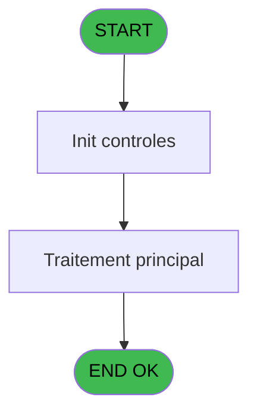
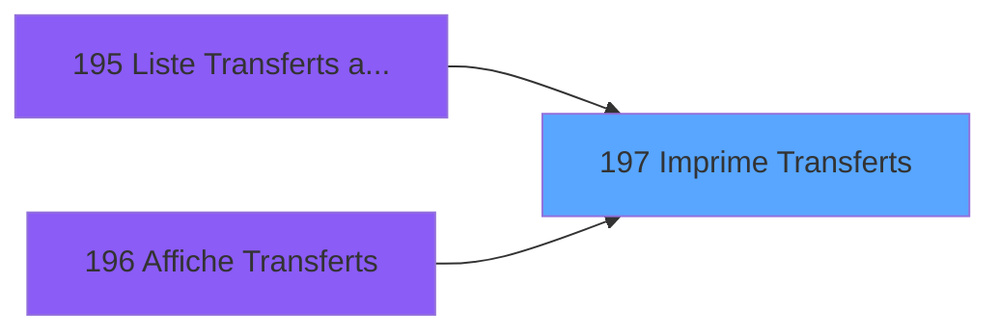

# PBP IDE 197 - Imprime Transferts

> **Analyse**: Phases 1-4 2026-02-03 15:46 -> 15:46 (13s) | Assemblage 15:46
> **Pipeline**: V7.2 Enrichi
> **Structure**: 4 onglets (Resume | Ecrans | Donnees | Connexions)

<!-- TAB:Resume -->

## 1. FICHE D'IDENTITE

| Attribut | Valeur |
|----------|--------|
| Projet | PBP |
| IDE Position | 197 |
| Nom Programme | Imprime Transferts |
| Fichier source | `Prg_197.xml` |
| Dossier IDE | Liste |
| Taches | 1 (1 ecrans visibles) |
| Tables modifiees | 0 |
| Programmes appeles | 0 |

## 2. DESCRIPTION FONCTIONNELLE

**Imprime Transferts** assure la gestion complete de ce processus, accessible depuis [Liste Transferts arrivants (IDE 195)](PBP-IDE-195.md), [  Affiche Transferts (IDE 196)](PBP-IDE-196.md).

Le flux de traitement s'organise en **1 blocs fonctionnels** :

- **Traitement** (1 tache) : traitements metier divers

**Logique metier** : 2 regles identifiees couvrant conditions metier.

## 3. BLOCS FONCTIONNELS

### 3.1 Traitement (1 tache)

Traitements internes.

---

#### 197 - Veuillez patienter ... [[ECRAN]](#ecran-t1)

**Role** : Traitement : Veuillez patienter ....
**Ecran** : 427 x 58 DLU (MDI) | [Voir mockup](#ecran-t1)

## 5. REGLES METIER

2 regles identifiees:

### Autres (2 regles)

#### [RM-001] Traitement si VG36 est renseigne

| Element | Detail |
|---------|--------|
| **Condition** | `VG36<>''` |
| **Si vrai** | VG36 |
| **Si faux** | ';') |
| **Expression source** | Expression 4 : `IF(VG36<>'',VG36,';')` |
| **Exemple** | Si VG36<>'' → VG36. Sinon → ';') |

#### [RM-002] Si Len (Trim ([K]))>20 alors 98 sinon 1)

| Element | Detail |
|---------|--------|
| **Condition** | `Len (Trim ([K]))>20` |
| **Si vrai** | 98 |
| **Si faux** | 1) |
| **Expression source** | Expression 20 : `IF (Len (Trim ([K]))>20,98,1)` |
| **Exemple** | Si Len (Trim ([K]))>20 → 98. Sinon → 1) |

## 6. CONTEXTE

- **Appele par**: [Liste Transferts arrivants (IDE 195)](PBP-IDE-195.md), [  Affiche Transferts (IDE 196)](PBP-IDE-196.md)
- **Appelle**: 0 programmes | **Tables**: 2 (W:0 R:1 L:1) | **Taches**: 1 | **Expressions**: 22

<!-- TAB:Ecrans -->

## 8. ECRANS

### 8.1 Forms visibles (1 / 1)

| # | Position | Tache | Nom | Type | Largeur | Hauteur | Bloc |
|---|----------|-------|-----|------|---------|---------|------|
| 1 | 197 | 197 | Veuillez patienter ... | MDI | 427 | 58 | Traitement |

### 8.2 Mockups Ecrans

---

#### 197 - Veuillez patienter ...
**Tache** : [197](#t1) | **Type** : MDI | **Dimensions** : 427 x 58 DLU
**Bloc** : Traitement | **Titre IDE** : Veuillez patienter ...

<!-- FORM-DATA:
{
    "width":  427,
    "vFactor":  8,
    "type":  "MDI",
    "hFactor":  8,
    "controls":  [
                     {
                         "x":  0,
                         "type":  "label",
                         "var":  "",
                         "y":  0,
                         "w":  423,
                         "fmt":  "",
                         "name":  "",
                         "h":  29,
                         "color":  "",
                         "text":  "",
                         "parent":  null
                     },
                     {
                         "x":  120,
                         "type":  "label",
                         "var":  "",
                         "y":  10,
                         "w":  221,
                         "fmt":  "",
                         "name":  "",
                         "h":  8,
                         "color":  "7",
                         "text":  "Impression en cours ...",
                         "parent":  null
                     },
                     {
                         "x":  0,
                         "type":  "label",
                         "var":  "",
                         "y":  29,
                         "w":  423,
                         "fmt":  "",
                         "name":  "",
                         "h":  27,
                         "color":  "",
                         "text":  "",
                         "parent":  null
                     },
                     {
                         "x":  79,
                         "type":  "label",
                         "var":  "",
                         "y":  38,
                         "w":  266,
                         "fmt":  "",
                         "name":  "",
                         "h":  8,
                         "color":  "",
                         "text":  "Liste prestations",
                         "parent":  null
                     },
                     {
                         "x":  4,
                         "type":  "image",
                         "var":  "",
                         "y":  2,
                         "w":  72,
                         "fmt":  "",
                         "name":  "",
                         "h":  25,
                         "color":  "",
                         "text":  "",
                         "parent":  null
                     }
                 ],
    "taskId":  "197",
    "height":  58
}
-->

## 9. NAVIGATION

Ecran unique: **Veuillez patienter ...**

### 9.3 Structure hierarchique (1 tache)

| Position | Tache | Type | Dimensions | Bloc |
|----------|-------|------|------------|------|
| **197.1** | [**Veuillez patienter ...** (197)](#t1) [mockup](#ecran-t1) | MDI | 427x58 | Traitement |

### 9.4 Algorigramme

> **Legende**: Vert = START/END OK | Rouge = END KO | Bleu = Decisions
> *Algorigramme auto-genere. Utiliser `/algorigramme` pour une synthese metier detaillee.*

<!-- TAB:Donnees -->

## 10. TABLES

### Tables utilisees (2)

| ID | Nom | Description | Type | R | W | L | Usages |
|----|-----|-------------|------|---|---|---|--------|
| 31 | gm-complet_______gmc |  | DB | R |   |   | 1 |
| 473 | comptage_caisse | Sessions de caisse | TMP |   |   | L | 1 |

### Colonnes par table (1 / 1 tables avec colonnes identifiees)

Table 31 - gm-complet_______gmc (R) - 1 usages

| Lettre | Variable | Acces | Type |
|--------|----------|-------|------|
| A | >DateMin | R | Date |
| B | >DateMax | R | Date |
| C | >NbSelect | R | Numeric |
| D | p_Excel | R | Logical |
| E | p_NomFichierExcel | R | Alpha |
| F | S | R | Alpha |
| G | v.LigneExcel | R | Alpha |
| H | v.retour GM | R | Logical |
| I | v nb personne | R | Numeric |

## 11. VARIABLES

### 11.1 Variables de session (3)

Variables persistantes pendant toute la session.

| Lettre | Nom | Type | Usage dans |
|--------|-----|------|-----------|
| G | v.LigneExcel | Alpha | 1x session |
| H | v.retour GM | Logical | 1x session |
| I | v nb personne | Numeric | 1x session |

### 11.2 Autres (6)

Variables diverses.

| Lettre | Nom | Type | Usage dans |
|--------|-----|------|-----------|
| A | >DateMin | Date | 1x refs |
| B | >DateMax | Date | 1x refs |
| C | >NbSelect | Numeric | - |
| D | p_Excel | Logical | 1x refs |
| E | p_NomFichierExcel | Alpha | 1x refs |
| F | S | Alpha | 8x refs |

## 12. EXPRESSIONS

**22 / 22 expressions decodees (100%)**

### 12.1 Repartition par type

| Type | Expressions | Regles |
|------|-------------|--------|
| CONCATENATION | 4 | 0 |
| CALCULATION | 1 | 0 |
| CONDITION | 6 | 2 |
| FORMAT | 1 | 0 |
| CONSTANTE | 1 | 0 |
| OTHER | 7 | 0 |
| NEGATION | 1 | 0 |
| STRING | 1 | 0 |

### 12.2 Expressions cles par type

#### CONCATENATION (4 expressions)

| Type | IDE | Expression | Regle |
|------|-----|------------|-------|
| CONCATENATION | 19 | `MlsTrans ('Transferts :')&' '&IF ([M]='A',MlsTrans ('Arrivees le'),MlsTrans ('Departs le'))&' '&DStr (v.LigneExcel [G],'DD/MM/YYYY')` | - |
| CONCATENATION | 5 | `'Titre'&[AZ]&'Nom'&[AZ]&'Prénom'&[AZ]&'Heure'&[AZ]&'Lieu'&[AZ]&'Compagnie'&[AZ]&'Vol'&[AZ]&'Comp.Prec.'&[AZ]&'Vol Prec.'&[AZ]&'Type'&[AZ]&'Commentaire'` | - |
| CONCATENATION | 15 | `'- '&Str (Page (0,1),'3P0Z0')&' -'` | - |
| CONCATENATION | 14 | `MlsTrans ('Edition du')&' '&DStr (Date (),'DD/MM/YYYY')&' '&MlsTrans ('à')&' '&TStr (Time (),'HH:MM:SS')` | - |

#### CALCULATION (1 expressions)

| Type | IDE | Expression | Regle |
|------|-----|------------|-------|
| CALCULATION | 18 | `[X]+1` | - |

#### CONDITION (6 expressions)

| Type | IDE | Expression | Regle |
|------|-----|------------|-------|
| CONDITION | 20 | `IF (Len (Trim ([K]))>20,98,1)` | [RM-002](#rm-RM-002) |
| CONDITION | 4 | `IF(VG36<>'',VG36,';')` | [RM-001](#rm-RM-001) |
| CONDITION | 9 | `>DateMax [B]` | - |
| CONDITION | 16 | `INIGet ('[MAGIC_LOGICAL_NAMES]preview')='O'` | - |
| CONDITION | 22 | `CASE([L],'TR',MlsTrans('Gare'),'PL',MlsTrans('Aéroport'),'TE',MlsTrans('Terminal'),'AU',MlsTrans('Autre'),[L])` | - |
| ... | | *+1 autres* | |

#### FORMAT (1 expressions)

| Type | IDE | Expression | Regle |
|------|-----|------------|-------|
| FORMAT | 6 | `[U]&[AZ]&[V]&[AZ]&[W]&[AZ]&TStr(v.retour GM [H],'HH:MM')&[AZ]&Trim(v nb personne [I])&[AZ]&[N]&[AZ]&[J]&[AZ]&[O]&[AZ]&[P]&[AZ]&CASE([L],'TR',MlsTrans('Gare'),'PL',MlsTrans('Aéroport'),'TE',MlsTrans('Terminal'),'AU',MlsTrans('Autre'),[L])&[AZ]&Trim([K])` | - |

#### CONSTANTE (1 expressions)

| Type | IDE | Expression | Regle |
|------|-----|------------|-------|
| CONSTANTE | 17 | `0` | - |

#### OTHER (7 expressions)

| Type | IDE | Expression | Regle |
|------|-----|------------|-------|
| OTHER | 12 | `S [F]` | - |
| OTHER | 13 | `'Village '&GetParam ('VILLAGE')` | - |
| OTHER | 21 | `[Q]` | - |
| OTHER | 11 | `p_NomFichierExcel [E]` | - |
| OTHER | 1 | `[AW]` | - |
| ... | | *+2 autres* | |

#### NEGATION (1 expressions)

| Type | IDE | Expression | Regle |
|------|-----|------------|-------|
| NEGATION | 2 | `NOT ([AW])` | - |

#### STRING (1 expressions)

| Type | IDE | Expression | Regle |
|------|-----|------------|-------|
| STRING | 3 | `Trim([AX])` | - |

### 12.3 Toutes les expressions (22)

Voir les 22 expressions

#### CONCATENATION (4)

| IDE | Expression Decodee |
|-----|-------------------|
| 15 | `'- '&Str (Page (0,1),'3P0Z0')&' -'` |
| 14 | `MlsTrans ('Edition du')&' '&DStr (Date (),'DD/MM/YYYY')&' '&MlsTrans ('à')&' '&TStr (Time (),'HH:MM:SS')` |
| 19 | `MlsTrans ('Transferts :')&' '&IF ([M]='A',MlsTrans ('Arrivees le'),MlsTrans ('Departs le'))&' '&DStr (v.LigneExcel [G],'DD/MM/YYYY')` |
| 5 | `'Titre'&[AZ]&'Nom'&[AZ]&'Prénom'&[AZ]&'Heure'&[AZ]&'Lieu'&[AZ]&'Compagnie'&[AZ]&'Vol'&[AZ]&'Comp.Prec.'&[AZ]&'Vol Prec.'&[AZ]&'Type'&[AZ]&'Commentaire'` |

#### CALCULATION (1)

| IDE | Expression Decodee |
|-----|-------------------|
| 18 | `[X]+1` |

#### CONDITION (6)

| IDE | Expression Decodee |
|-----|-------------------|
| 4 | `IF(VG36<>'',VG36,';')` |
| 20 | `IF (Len (Trim ([K]))>20,98,1)` |
| 22 | `CASE([L],'TR',MlsTrans('Gare'),'PL',MlsTrans('Aéroport'),'TE',MlsTrans('Terminal'),'AU',MlsTrans('Autre'),[L])` |
| 8 | `>DateMin [A]` |
| 9 | `>DateMax [B]` |
| 16 | `INIGet ('[MAGIC_LOGICAL_NAMES]preview')='O'` |

#### FORMAT (1)

| IDE | Expression Decodee |
|-----|-------------------|
| 6 | `[U]&[AZ]&[V]&[AZ]&[W]&[AZ]&TStr(v.retour GM [H],'HH:MM')&[AZ]&Trim(v nb personne [I])&[AZ]&[N]&[AZ]&[J]&[AZ]&[O]&[AZ]&[P]&[AZ]&CASE([L],'TR',MlsTrans('Gare'),'PL',MlsTrans('Aéroport'),'TE',MlsTrans('Terminal'),'AU',MlsTrans('Autre'),[L])&[AZ]&Trim([K])` |

#### CONSTANTE (1)

| IDE | Expression Decodee |
|-----|-------------------|
| 17 | `0` |

#### OTHER (7)

| IDE | Expression Decodee |
|-----|-------------------|
| 1 | `[AW]` |
| 7 | `IsFirstRecordCycle (0)` |
| 10 | `p_Excel [D]` |
| 11 | `p_NomFichierExcel [E]` |
| 12 | `S [F]` |
| 13 | `'Village '&GetParam ('VILLAGE')` |
| 21 | `[Q]` |

#### NEGATION (1)

| IDE | Expression Decodee |
|-----|-------------------|
| 2 | `NOT ([AW])` |

#### STRING (1)

| IDE | Expression Decodee |
|-----|-------------------|
| 3 | `Trim([AX])` |

<!-- TAB:Connexions -->

## 13. GRAPHE D'APPELS

### 13.1 Chaine depuis Main (Callers)

Main -> ... -> [Liste Transferts arrivants (IDE 195)](PBP-IDE-195.md) -> **Imprime Transferts (IDE 197)**

Main -> ... -> [  Affiche Transferts (IDE 196)](PBP-IDE-196.md) -> **Imprime Transferts (IDE 197)**

### 13.2 Callers

| IDE | Nom Programme | Nb Appels |
|-----|---------------|-----------|
| [195](PBP-IDE-195.md) | Liste Transferts arrivants | 2 |
| [196](PBP-IDE-196.md) |   Affiche Transferts | 1 |

### 13.3 Callees (programmes appeles)

### 13.4 Detail Callees avec contexte

| IDE | Nom Programme | Appels | Contexte |
|-----|---------------|--------|----------|
| - | (aucun) | - | - |

## 14. RECOMMANDATIONS MIGRATION

### 14.1 Profil du programme

| Metrique | Valeur | Impact migration |
|----------|--------|-----------------|
| Lignes de logique | 48 | Programme compact |
| Expressions | 22 | Peu de logique |
| Tables WRITE | 0 | Impact faible |
| Sous-programmes | 0 | Peu de dependances |
| Ecrans visibles | 1 | Ecran unique ou traitement batch |
| Code desactive | 0% (0 / 48) | Code sain |
| Regles metier | 2 | Quelques regles a preserver |

### 14.2 Plan de migration par bloc

#### Traitement (1 tache: 1 ecran, 0 traitement)

- **Strategie** : 1 composant(s) UI (Razor/React) avec formulaires et validation.
- Decomposer les taches en services unitaires testables.

### 14.3 Dependances critiques

| Dependance | Type | Appels | Impact |
|------------|------|--------|--------|

---
*Spec DETAILED generee par Pipeline V7.2 - 2026-02-03 15:46*
