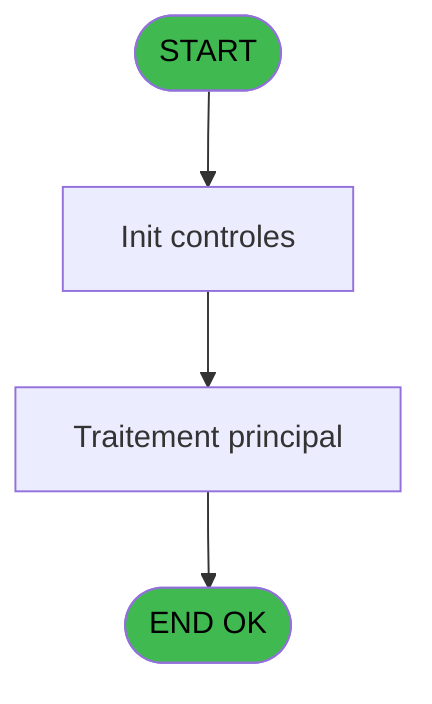
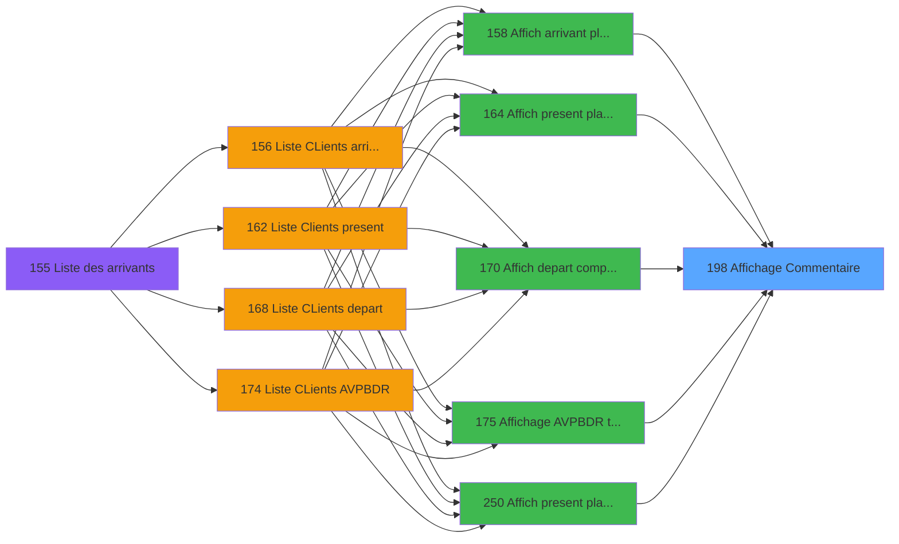

# PBP IDE 198 - Affichage Commentaire

> **Analyse**: Phases 1-4 2026-02-03 15:46 -> 15:46 (12s) | Assemblage 15:46
> **Pipeline**: V7.2 Enrichi
> **Structure**: 4 onglets (Resume | Ecrans | Donnees | Connexions)

<!-- TAB:Resume -->

## 1. FICHE D'IDENTITE

| Attribut | Valeur |
|----------|--------|
| Projet | PBP |
| IDE Position | 198 |
| Nom Programme | Affichage Commentaire |
| Fichier source | `Prg_198.xml` |
| Dossier IDE | Liste |
| Taches | 1 (1 ecrans visibles) |
| Tables modifiees | 0 |
| Programmes appeles | 1 |

## 2. DESCRIPTION FONCTIONNELLE

**Affichage Commentaire** assure la gestion complete de ce processus, accessible depuis [  Affich arrivant planning GM (IDE 158)](PBP-IDE-158.md), [  Affich present planning GM (IDE 164)](PBP-IDE-164.md), [  Affich depart comptage GM (IDE 170)](PBP-IDE-170.md), [  Affichage AVPBDR toutes GM (IDE 175)](PBP-IDE-175.md), [Affich present planning GM CL (IDE 250)](PBP-IDE-250.md).

Le flux de traitement s'organise en **1 blocs fonctionnels** :

- **Consultation** (1 tache) : ecrans de recherche, selection et consultation

**Logique metier** : 1 regles identifiees couvrant conditions metier.

## 3. BLOCS FONCTIONNELS

### 3.1 Consultation (1 tache)

Ecrans de recherche et consultation.

---

#### 198 - Affichage Commentaire [[ECRAN]](#ecran-t1)

**Role** : Reinitialisation : Affichage Commentaire.
**Ecran** : 888 x 136 DLU (MDI) | [Voir mockup](#ecran-t1)

## 5. REGLES METIER

1 regles identifiees:

### Autres (1 regles)

#### [RM-001] Traitement conditionnel si [G] est a zero

| Element | Detail |
|---------|--------|
| **Condition** | `[G]=0` |
| **Si vrai** | [I]&' '&Left ([H] |
| **Si faux** | 60)&' '&[J]&' '&[K]&' '&DStr ([L],'DD/MM/YY'),[H]) |
| **Expression source** | Expression 4 : `IF ([G]=0,[I]&' '&Left ([H],60)&' '&[J]&' '&[K]&' '&DStr ([L` |
| **Exemple** | Si [G]=0 → [I]&' '&Left ([H]. Sinon → 60)&' '&[J]&' '&[K]&' '&DStr ([L],'DD/MM/YY'),[H]) |

## 6. CONTEXTE

- **Appele par**: [  Affich arrivant planning GM (IDE 158)](PBP-IDE-158.md), [  Affich present planning GM (IDE 164)](PBP-IDE-164.md), [  Affich depart comptage GM (IDE 170)](PBP-IDE-170.md), [  Affichage AVPBDR toutes GM (IDE 175)](PBP-IDE-175.md), [Affich present planning GM CL (IDE 250)](PBP-IDE-250.md)
- **Appelle**: 1 programmes | **Tables**: 1 (W:0 R:1 L:0) | **Taches**: 1 | **Expressions**: 7

<!-- TAB:Ecrans -->

## 8. ECRANS

### 8.1 Forms visibles (1 / 1)

| # | Position | Tache | Nom | Type | Largeur | Hauteur | Bloc |
|---|----------|-------|-----|------|---------|---------|------|
| 1 | 198 | 198 | Affichage Commentaire | MDI | 888 | 136 | Consultation |

### 8.2 Mockups Ecrans

---

#### 198 - Affichage Commentaire
**Tache** : [198](#t1) | **Type** : MDI | **Dimensions** : 888 x 136 DLU
**Bloc** : Consultation | **Titre IDE** : Affichage Commentaire

<!-- FORM-DATA:
{
    "width":  888,
    "vFactor":  8,
    "type":  "MDI",
    "hFactor":  8,
    "controls":  [
                     {
                         "x":  3,
                         "type":  "table",
                         "var":  "",
                         "name":  "",
                         "titleH":  14,
                         "color":  "110",
                         "w":  880,
                         "y":  5,
                         "fmt":  "",
                         "parent":  null,
                         "text":  "",
                         "rowH":  14,
                         "h":  101,
                         "cols":  [
                                      {
                                          "title":  "Commentaire",
                                          "layer":  1,
                                          "w":  874
                                      }
                                  ],
                         "rows":  1
                     },
                     {
                         "x":  0,
                         "type":  "label",
                         "var":  "",
                         "y":  111,
                         "w":  886,
                         "fmt":  "",
                         "name":  "",
                         "h":  24,
                         "color":  "1",
                         "text":  "",
                         "parent":  null
                     },
                     {
                         "x":  846,
                         "type":  "edit",
                         "var":  "",
                         "y":  21,
                         "w":  26,
                         "fmt":  "",
                         "name":  "",
                         "h":  10,
                         "color":  "110",
                         "text":  "",
                         "parent":  1
                     },
                     {
                         "x":  6,
                         "type":  "edit",
                         "var":  "",
                         "y":  21,
                         "w":  826,
                         "fmt":  "100",
                         "name":  "",
                         "h":  10,
                         "color":  "110",
                         "text":  "",
                         "parent":  1
                     },
                     {
                         "x":  8,
                         "type":  "button",
                         "var":  "",
                         "y":  114,
                         "w":  154,
                         "fmt":  "\u0026Quitter",
                         "name":  "",
                         "h":  18,
                         "color":  "",
                         "text":  "",
                         "parent":  6
                     }
                 ],
    "taskId":  "198",
    "height":  136
}
-->

<strong>Champs : 2 champs</strong>

| Pos (x,y) | Nom | Variable | Type |
|-----------|-----|----------|------|
| 846,21 | (sans nom) | - | edit |
| 6,21 | 100 | - | edit |

<strong>Boutons : 1 boutons</strong>

| Bouton | Pos (x,y) | Action |
|--------|-----------|--------|
| Quitter | 8,114 | Quitte le programme |

## 9. NAVIGATION

Ecran unique: **Affichage Commentaire**

### 9.3 Structure hierarchique (1 tache)

| Position | Tache | Type | Dimensions | Bloc |
|----------|-------|------|------------|------|
| **198.1** | [**Affichage Commentaire** (198)](#t1) [mockup](#ecran-t1) | MDI | 888x136 | Consultation |

### 9.4 Algorigramme

> **Legende**: Vert = START/END OK | Rouge = END KO | Bleu = Decisions
> *Algorigramme auto-genere. Utiliser `/algorigramme` pour une synthese metier detaillee.*

<!-- TAB:Donnees -->

## 10. TABLES

### Tables utilisees (1)

| ID | Nom | Description | Type | R | W | L | Usages |
|----|-----|-------------|------|---|---|---|--------|
| 171 | commentaire______com |  | DB | R |   |   | 1 |

### Colonnes par table (1 / 1 tables avec colonnes identifiees)

Table 171 - commentaire______com (R) - 1 usages

| Lettre | Variable | Acces | Type |
|--------|----------|-------|------|
| A | >Compte | R | Numeric |
| B | >Filiation | R | Numeric |
| C | w0_Curseur | R | Alpha |
| D | v. titre | R | Alpha |

## 11. VARIABLES

### 11.1 Variables de session (1)

Variables persistantes pendant toute la session.

| Lettre | Nom | Type | Usage dans |
|--------|-----|------|-----------|
| D | v. titre | Alpha | - |

### 11.2 Autres (3)

Variables diverses.

| Lettre | Nom | Type | Usage dans |
|--------|-----|------|-----------|
| A | >Compte | Numeric | 1x refs |
| B | >Filiation | Numeric | 1x refs |
| C | w0_Curseur | Alpha | - |

## 12. EXPRESSIONS

**7 / 7 expressions decodees (100%)**

### 12.1 Repartition par type

| Type | Expressions | Regles |
|------|-------------|--------|
| CONCATENATION | 1 | 5 |
| CONSTANTE | 1 | 0 |
| OTHER | 1 | 0 |
| CONDITION | 3 | 0 |
| STRING | 1 | 0 |

### 12.2 Expressions cles par type

#### CONCATENATION (1 expressions)

| Type | IDE | Expression | Regle |
|------|-----|------------|-------|
| CONCATENATION | 4 | `IF ([G]=0,[I]&' '&Left ([H],60)&' '&[J]&' '&[K]&' '&DStr ([L],'DD/MM/YY'),[H])` | [RM-001](#rm-RM-001) |

#### CONSTANTE (1 expressions)

| Type | IDE | Expression | Regle |
|------|-----|------------|-------|
| CONSTANTE | 7 | `170` | - |

#### OTHER (1 expressions)

| Type | IDE | Expression | Regle |
|------|-----|------------|-------|
| OTHER | 1 | `GetParam ('SOCIETE')` | - |

#### CONDITION (3 expressions)

| Type | IDE | Expression | Regle |
|------|-----|------------|-------|
| CONDITION | 5 | `'Commentaire '&IF ([G]=0,'Liste Blanche',IF ([G]=2,'Voyage',IF ([G]=3,'Sejour',IF ([G]=4,'Prestation',IF ([G]=5,'Circuit',IF ([G]=6,'Activite',IF ([G]=7,'Trafic','')))))))` | - |
| CONDITION | 3 | `>Filiation [B]` | - |
| CONDITION | 2 | `>Compte [A]` | - |

#### STRING (1 expressions)

| Type | IDE | Expression | Regle |
|------|-----|------------|-------|
| STRING | 6 | `Trim ([M])` | - |

<!-- TAB:Connexions -->

## 13. GRAPHE D'APPELS

### 13.1 Chaine depuis Main (Callers)

Main -> ... -> [  Affich arrivant planning GM (IDE 158)](PBP-IDE-158.md) -> **Affichage Commentaire (IDE 198)**

Main -> ... -> [  Affich present planning GM (IDE 164)](PBP-IDE-164.md) -> **Affichage Commentaire (IDE 198)**

Main -> ... -> [  Affich depart comptage GM (IDE 170)](PBP-IDE-170.md) -> **Affichage Commentaire (IDE 198)**

Main -> ... -> [  Affichage AVPBDR toutes GM (IDE 175)](PBP-IDE-175.md) -> **Affichage Commentaire (IDE 198)**

Main -> ... -> [Affich present planning GM CL (IDE 250)](PBP-IDE-250.md) -> **Affichage Commentaire (IDE 198)**

### 13.2 Callers

| IDE | Nom Programme | Nb Appels |
|-----|---------------|-----------|
| [158](PBP-IDE-158.md) |   Affich arrivant planning GM | 1 |
| [164](PBP-IDE-164.md) |   Affich present planning GM | 1 |
| [170](PBP-IDE-170.md) |   Affich depart comptage GM | 1 |
| [175](PBP-IDE-175.md) |   Affichage AVPBDR toutes GM | 1 |
| [250](PBP-IDE-250.md) | Affich present planning GM CL | 1 |

### 13.3 Callees (programmes appeles)

### 13.4 Detail Callees avec contexte

| IDE | Nom Programme | Appels | Contexte |
|-----|---------------|--------|----------|
| [389](PBP-IDE-389.md) | Recuperation du titre | 1 | Recuperation donnees |

## 14. RECOMMANDATIONS MIGRATION

### 14.1 Profil du programme

| Metrique | Valeur | Impact migration |
|----------|--------|-----------------|
| Lignes de logique | 18 | Programme compact |
| Expressions | 7 | Peu de logique |
| Tables WRITE | 0 | Impact faible |
| Sous-programmes | 1 | Peu de dependances |
| Ecrans visibles | 1 | Ecran unique ou traitement batch |
| Code desactive | 0% (0 / 18) | Code sain |
| Regles metier | 1 | Quelques regles a preserver |

### 14.2 Plan de migration par bloc

#### Consultation (1 tache: 1 ecran, 0 traitement)

- **Strategie** : Composants de recherche/selection en modales.
- 1 ecran : Affichage Commentaire

### 14.3 Dependances critiques

| Dependance | Type | Appels | Impact |
|------------|------|--------|--------|
| [Recuperation du titre (IDE 389)](PBP-IDE-389.md) | Sous-programme | 1x | Normale - Recuperation donnees |

---
*Spec DETAILED generee par Pipeline V7.2 - 2026-02-03 15:46*
