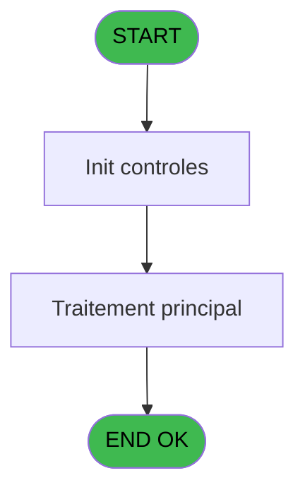

# PBP IDE 199 - Liste Upgrade Fidelisation

> **Analyse**: Phases 1-4 2026-02-03 15:46 -> 15:46 (11s) | Assemblage 15:46
> **Pipeline**: V7.2 Enrichi
> **Structure**: 4 onglets (Resume | Ecrans | Donnees | Connexions)

<!-- TAB:Resume -->

## 1. FICHE D'IDENTITE

| Attribut | Valeur |
|----------|--------|
| Projet | PBP |
| IDE Position | 199 |
| Nom Programme | Liste Upgrade Fidelisation |
| Fichier source | `Prg_199.xml` |
| Dossier IDE | Liste |
| Taches | 3 (1 ecrans visibles) |
| Tables modifiees | 0 |
| Programmes appeles | 0 |
| :warning: Statut | **ORPHELIN_POTENTIEL** |

## 2. DESCRIPTION FONCTIONNELLE

**Liste Upgrade Fidelisation** assure la gestion complete de ce processus.

Le flux de traitement s'organise en **2 blocs fonctionnels** :

- **Traitement** (2 taches) : traitements metier divers
- **Impression** (1 tache) : generation de tickets et documents

Detail : phases du traitement

#### Phase 1 : Traitement (2 taches)

- **199** - Liste BV Gold **[[ECRAN]](#ecran-t1)**
- **199.1** - Check

#### Phase 2 : Impression (1 tache)

- **199.2** - Edition

## 3. BLOCS FONCTIONNELS

### 3.1 Traitement (2 taches)

Traitements internes.

---

#### 199 - Liste BV Gold [[ECRAN]](#ecran-t1)

**Role** : Traitement : Liste BV Gold.
**Ecran** : 598 x 175 DLU (MDI) | [Voir mockup](#ecran-t1)

---

#### 199.1 - Check

**Role** : Traitement : Check.

### 3.2 Impression (1 tache)

Generation des documents et tickets.

---

#### 199.2 - Edition

**Role** : Generation du document : Edition.

## 5. REGLES METIER

*(Aucune regle metier identifiee)*

## 6. CONTEXTE

- **Appele par**: (aucun)
- **Appelle**: 0 programmes | **Tables**: 4 (W:0 R:1 L:3) | **Taches**: 3 | **Expressions**: 17

<!-- TAB:Ecrans -->

## 8. ECRANS

### 8.1 Forms visibles (1 / 3)

| # | Position | Tache | Nom | Type | Largeur | Hauteur | Bloc |
|---|----------|-------|-----|------|---------|---------|------|
| 1 | 199 | 199 | Liste BV Gold | MDI | 598 | 175 | Traitement |

### 8.2 Mockups Ecrans

---

#### 199 - Liste BV Gold
**Tache** : [199](#t1) | **Type** : MDI | **Dimensions** : 598 x 175 DLU
**Bloc** : Traitement | **Titre IDE** : Liste BV Gold

<!-- FORM-DATA:
{
    "width":  598,
    "vFactor":  8,
    "type":  "MDI",
    "hFactor":  8,
    "controls":  [
                     {
                         "x":  0,
                         "type":  "label",
                         "var":  "",
                         "y":  0,
                         "w":  593,
                         "fmt":  "",
                         "name":  "",
                         "h":  19,
                         "color":  "",
                         "text":  "",
                         "parent":  null
                     },
                     {
                         "x":  365,
                         "type":  "label",
                         "var":  "",
                         "y":  22,
                         "w":  186,
                         "fmt":  "",
                         "name":  "",
                         "h":  122,
                         "color":  "",
                         "text":  "",
                         "parent":  null
                     },
                     {
                         "x":  43,
                         "type":  "label",
                         "var":  "",
                         "y":  49,
                         "w":  314,
                         "fmt":  "",
                         "name":  "",
                         "h":  51,
                         "color":  "",
                         "text":  "",
                         "parent":  null
                     },
                     {
                         "x":  86,
                         "type":  "label",
                         "var":  "",
                         "y":  58,
                         "w":  30,
                         "fmt":  "",
                         "name":  "",
                         "h":  10,
                         "color":  "",
                         "text":  "Le",
                         "parent":  7
                     },
                     {
                         "x":  45,
                         "type":  "line",
                         "var":  "",
                         "y":  75,
                         "w":  310,
                         "fmt":  "",
                         "name":  "",
                         "h":  0,
                         "color":  "",
                         "text":  "",
                         "parent":  7
                     },
                     {
                         "x":  78,
                         "type":  "label",
                         "var":  "",
                         "y":  82,
                         "w":  86,
                         "fmt":  "",
                         "name":  "",
                         "h":  9,
                         "color":  "",
                         "text":  "Sélections",
                         "parent":  7
                     },
                     {
                         "x":  2,
                         "type":  "label",
                         "var":  "",
                         "y":  148,
                         "w":  593,
                         "fmt":  "",
                         "name":  "",
                         "h":  24,
                         "color":  "",
                         "text":  "",
                         "parent":  null
                     },
                     {
                         "x":  123,
                         "type":  "edit",
                         "var":  "",
                         "y":  58,
                         "w":  126,
                         "fmt":  "DD/MM/YYYY",
                         "name":  "w0_Date",
                         "h":  10,
                         "color":  "110",
                         "text":  "",
                         "parent":  7
                     },
                     {
                         "x":  251,
                         "type":  "button",
                         "var":  "",
                         "y":  58,
                         "w":  27,
                         "fmt":  "...",
                         "name":  "b_Date",
                         "h":  10,
                         "color":  "",
                         "text":  "",
                         "parent":  7
                     },
                     {
                         "x":  185,
                         "type":  "edit",
                         "var":  "",
                         "y":  83,
                         "w":  56,
                         "fmt":  "",
                         "name":  "w0_NbSelect",
                         "h":  9,
                         "color":  "",
                         "text":  "",
                         "parent":  7
                     },
                     {
                         "x":  381,
                         "type":  "button",
                         "var":  "",
                         "y":  83,
                         "w":  154,
                         "fmt":  "\u0026Ecran",
                         "name":  "b_Ecran",
                         "h":  18,
                         "color":  "",
                         "text":  "",
                         "parent":  5
                     },
                     {
                         "x":  381,
                         "type":  "button",
                         "var":  "",
                         "y":  103,
                         "w":  154,
                         "fmt":  "\u0026Impression",
                         "name":  "b_Imprimer",
                         "h":  18,
                         "color":  "",
                         "text":  "",
                         "parent":  5
                     },
                     {
                         "x":  6,
                         "type":  "edit",
                         "var":  "",
                         "y":  2,
                         "w":  267,
                         "fmt":  "30",
                         "name":  "",
                         "h":  8,
                         "color":  "",
                         "text":  "",
                         "parent":  1
                     },
                     {
                         "x":  383,
                         "type":  "edit",
                         "var":  "",
                         "y":  6,
                         "w":  203,
                         "fmt":  "WWW DD MMM YYYYT",
                         "name":  "",
                         "h":  8,
                         "color":  "",
                         "text":  "",
                         "parent":  1
                     },
                     {
                         "x":  6,
                         "type":  "edit",
                         "var":  "",
                         "y":  10,
                         "w":  267,
                         "fmt":  "30",
                         "name":  "",
                         "h":  8,
                         "color":  "",
                         "text":  "",
                         "parent":  1
                     },
                     {
                         "x":  389,
                         "type":  "image",
                         "var":  "",
                         "y":  27,
                         "w":  136,
                         "fmt":  "",
                         "name":  "",
                         "h":  54,
                         "color":  "",
                         "text":  "",
                         "parent":  5
                     },
                     {
                         "x":  10,
                         "type":  "button",
                         "var":  "",
                         "y":  151,
                         "w":  154,
                         "fmt":  "\u0026Quitter",
                         "name":  "",
                         "h":  18,
                         "color":  "",
                         "text":  "",
                         "parent":  13
                     },
                     {
                         "x":  381,
                         "type":  "button",
                         "var":  "",
                         "y":  123,
                         "w":  154,
                         "fmt":  "E\u0026xcel",
                         "name":  "b_Excel",
                         "h":  18,
                         "color":  "",
                         "text":  "",
                         "parent":  null
                     }
                 ],
    "taskId":  "199",
    "height":  175
}
-->

<strong>Champs : 5 champs</strong>

| Pos (x,y) | Nom | Variable | Type |
|-----------|-----|----------|------|
| 123,58 | w0_Date | - | edit |
| 185,83 | w0_NbSelect | - | edit |
| 6,2 | 30 | - | edit |
| 383,6 | WWW DD MMM YYYYT | - | edit |
| 6,10 | 30 | - | edit |

<strong>Boutons : 5 boutons</strong>

| Bouton | Pos (x,y) | Action |
|--------|-----------|--------|
| ... | 251,58 | Bouton fonctionnel |
| Ecran | 381,83 | Bouton fonctionnel |
| Impression | 381,103 | Bouton fonctionnel |
| Quitter | 10,151 | Quitte le programme |
| Excel | 381,123 | Bouton fonctionnel |

## 9. NAVIGATION

Ecran unique: **Liste BV Gold**

### 9.3 Structure hierarchique (3 taches)

| Position | Tache | Type | Dimensions | Bloc |
|----------|-------|------|------------|------|
| **199.1** | [**Liste BV Gold** (199)](#t1) [mockup](#ecran-t1) | MDI | 598x175 | Traitement |
| 199.1.1 | [Check (199.1)](#t2) | MDI | - | |
| **199.2** | [**Edition** (199.2)](#t3) | MDI | - | Impression |

### 9.4 Algorigramme

> **Legende**: Vert = START/END OK | Rouge = END KO | Bleu = Decisions
> *Algorigramme auto-genere. Utiliser `/algorigramme` pour une synthese metier detaillee.*

<!-- TAB:Donnees -->

## 10. TABLES

### Tables utilisees (4)

| ID | Nom | Description | Type | R | W | L | Usages |
|----|-----|-------------|------|---|---|---|--------|
| 31 | gm-complet_______gmc |  | DB | R |   |   | 2 |
| 314 | fid_cumul |  | DB |   |   | L | 2 |
| 738 | pv_selling_unit |  | DB |   |   | L | 1 |
| 845 | stat_vendeur_date |  | TMP |   |   | L | 1 |

### Colonnes par table (2 / 1 tables avec colonnes identifiees)

Table 31 - gm-complet_______gmc (R) - 2 usages

| Lettre | Variable | Acces | Type |
|--------|----------|-------|------|
| A | v.retour GM | R | Logical |
| B | p.Excel | R | Logical |
| C | p.NomFichierExcel | R | Alpha |
| D | S | R | Alpha |
| E | v.LigneExcel | R | Alpha |

## 11. VARIABLES

### 11.1 Variables de session (1)

Variables persistantes pendant toute la session.

| Lettre | Nom | Type | Usage dans |
|--------|-----|------|-----------|
| G | v.NomFichierExcel | Alpha | - |

### 11.2 Autres (6)

Variables diverses.

| Lettre | Nom | Type | Usage dans |
|--------|-----|------|-----------|
| A | w0_Date | Date | 1x refs |
| B | b_Date | Alpha | - |
| C | w0_NbSelect | Numeric | - |
| D | b_Ecran | Alpha | 2x refs |
| E | b_Imprimer | Alpha | - |
| F | b_Excel | Alpha | - |

## 12. EXPRESSIONS

**17 / 17 expressions decodees (100%)**

### 12.1 Repartition par type

| Type | Expressions | Regles |
|------|-------------|--------|
| CONSTANTE | 5 | 0 |
| FORMAT | 1 | 0 |
| DATE | 1 | 0 |
| REFERENCE_VG | 1 | 0 |
| OTHER | 6 | 0 |
| CONDITION | 2 | 0 |
| CAST_LOGIQUE | 1 | 0 |

### 12.2 Expressions cles par type

#### CONSTANTE (5 expressions)

| Type | IDE | Expression | Regle |
|------|-----|------------|-------|
| CONSTANTE | 5 | `'E&xcel'` | - |
| CONSTANTE | 15 | `'BV Gold List'` | - |
| CONSTANTE | 4 | `'&Imprimer'` | - |
| CONSTANTE | 2 | `'...'` | - |
| CONSTANTE | 3 | `'&Ecran'` | - |

#### FORMAT (1 expressions)

| Type | IDE | Expression | Regle |
|------|-----|------------|-------|
| FORMAT | 1 | `Translate ('%club_exportdata%')&'LISTE_UPGRADE_FIDELISATION_'&DStr(Date(),'YYYYMMDD')&'_'&TStr(Time(),'HHMMSS')&'.csv'` | - |

#### DATE (1 expressions)

| Type | IDE | Expression | Regle |
|------|-----|------------|-------|
| DATE | 7 | `Date ()+1` | - |

#### REFERENCE_VG (1 expressions)

| Type | IDE | Expression | Regle |
|------|-----|------------|-------|
| REFERENCE_VG | 6 | `VG2` | - |

#### OTHER (6 expressions)

| Type | IDE | Expression | Regle |
|------|-----|------------|-------|
| OTHER | 14 | `[R]` | - |
| OTHER | 16 | `{1,2}` | - |
| OTHER | 17 | `w0_Date [A]` | - |
| OTHER | 8 | `SetCrsr (2)` | - |
| OTHER | 9 | `SetCrsr (1)` | - |
| ... | | *+1 autres* | |

#### CONDITION (2 expressions)

| Type | IDE | Expression | Regle |
|------|-----|------------|-------|
| CONDITION | 12 | `b_Ecran [D]>0` | - |
| CONDITION | 11 | `b_Ecran [D]=0` | - |

#### CAST_LOGIQUE (1 expressions)

| Type | IDE | Expression | Regle |
|------|-----|------------|-------|
| CAST_LOGIQUE | 13 | `'TRUE'LOG` | - |

<!-- TAB:Connexions -->

## 13. GRAPHE D'APPELS

### 13.1 Chaine depuis Main (Callers)

**Chemin**: (pas de callers directs)

### 13.2 Callers

| IDE | Nom Programme | Nb Appels |
|-----|---------------|-----------|
| - | (aucun) | - |

### 13.3 Callees (programmes appeles)

### 13.4 Detail Callees avec contexte

| IDE | Nom Programme | Appels | Contexte |
|-----|---------------|--------|----------|
| - | (aucun) | - | - |

## 14. RECOMMANDATIONS MIGRATION

### 14.1 Profil du programme

| Metrique | Valeur | Impact migration |
|----------|--------|-----------------|
| Lignes de logique | 95 | Programme compact |
| Expressions | 17 | Peu de logique |
| Tables WRITE | 0 | Impact faible |
| Sous-programmes | 0 | Peu de dependances |
| Ecrans visibles | 1 | Ecran unique ou traitement batch |
| Code desactive | 0% (0 / 95) | Code sain |
| Regles metier | 0 | Pas de regle identifiee |

### 14.2 Plan de migration par bloc

#### Traitement (2 taches: 1 ecran, 1 traitement)

- **Strategie** : Orchestrateur avec 1 ecrans (Razor/React) et 1 traitements backend (services).
- Les ecrans deviennent des composants UI, les traitements invisibles deviennent des services injectables.
- Decomposer les taches en services unitaires testables.

#### Impression (1 tache: 0 ecran, 1 traitement)

- **Strategie** : Templates HTML -> PDF via wkhtmltopdf ou Puppeteer.
- `PrintService` injectable avec choix imprimante

### 14.3 Dependances critiques

| Dependance | Type | Appels | Impact |
|------------|------|--------|--------|

---
*Spec DETAILED generee par Pipeline V7.2 - 2026-02-03 15:46*
