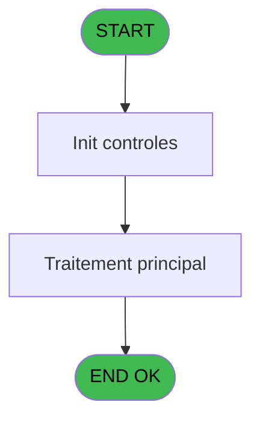
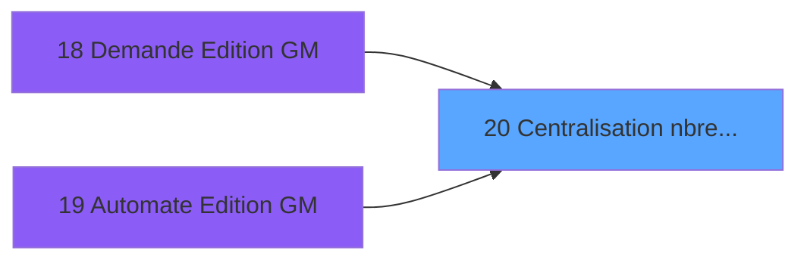
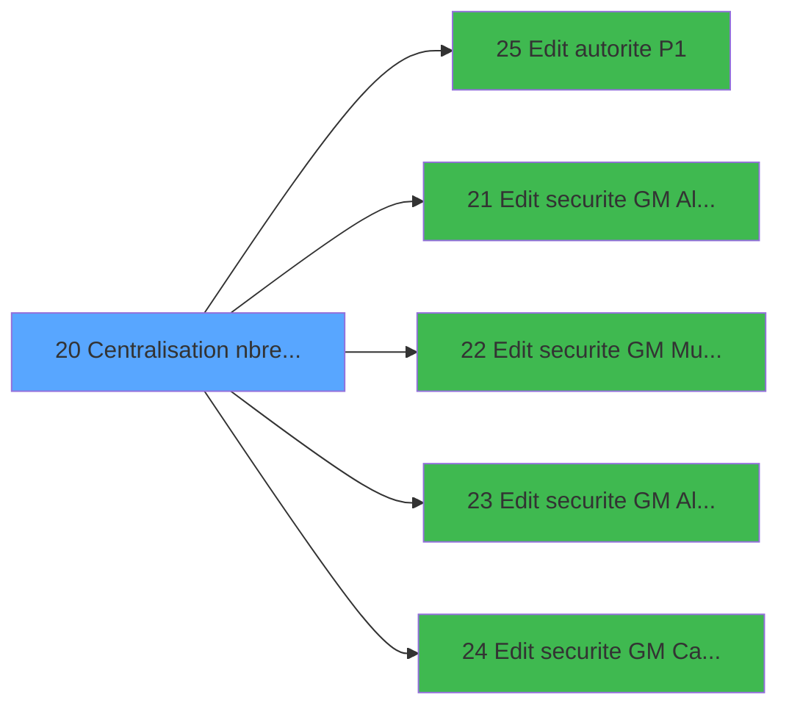

# PBP IDE 20 - Centralisation nbre edition

> **Analyse**: Phases 1-4 2026-02-03 01:07 -> 01:08 (40s) | Assemblage 01:08
> **Pipeline**: V7.2 Enrichi
> **Structure**: 4 onglets (Resume | Ecrans | Donnees | Connexions)

<!-- TAB:Resume -->

## 1. FICHE D'IDENTITE

| Attribut | Valeur |
|----------|--------|
| Projet | PBP |
| IDE Position | 20 |
| Nom Programme | Centralisation nbre edition |
| Fichier source | `Prg_20.xml` |
| Domaine metier | Impression |
| Taches | 1 (0 ecrans visibles) |
| Tables modifiees | 0 |
| Programmes appeles | 5 |

## 2. DESCRIPTION FONCTIONNELLE

**Centralisation nbre edition** assure la gestion complete de ce processus, accessible depuis [Demande Edition GM (IDE 18)](PBP-IDE-18.md), [   Automate Edition GM (IDE 19)](PBP-IDE-19.md).

Le flux de traitement s'organise en **1 blocs fonctionnels** :

- **Impression** (1 tache) : generation de tickets et documents

## 3. BLOCS FONCTIONNELS

### 3.1 Impression (1 tache)

Generation des documents et tickets.

---

#### 20 - Centralisation nbre edition

**Role** : Generation du document : Centralisation nbre edition.
**Variables liees** : A (> type edition), B (> nbre edition)

## 5. REGLES METIER

*(Aucune regle metier identifiee)*

## 6. CONTEXTE

- **Appele par**: [Demande Edition GM (IDE 18)](PBP-IDE-18.md), [   Automate Edition GM (IDE 19)](PBP-IDE-19.md)
- **Appelle**: 5 programmes | **Tables**: 0 (W:0 R:0 L:0) | **Taches**: 1 | **Expressions**: 16

<!-- TAB:Ecrans -->

## 8. ECRANS

*(Programme sans ecran visible)*

## 9. NAVIGATION

### 9.3 Structure hierarchique (1 tache)

| Position | Tache | Type | Dimensions | Bloc |
|----------|-------|------|------------|------|
| **20.1** | [**Centralisation nbre edition** (20)](#t1) | MDI | - | Impression |

### 9.4 Algorigramme

> **Legende**: Vert = START/END OK | Rouge = END KO | Bleu = Decisions
> *Algorigramme auto-genere. Utiliser `/algorigramme` pour une synthese metier detaillee.*

<!-- TAB:Donnees -->

## 10. TABLES

### Tables utilisees (0)

| ID | Nom | Description | Type | R | W | L | Usages |
|----|-----|-------------|------|---|---|---|--------|

### Colonnes par table (0 / 0 tables avec colonnes identifiees)

## 11. VARIABLES

### 11.1 Autres (6)

Variables diverses.

| Lettre | Nom | Type | Usage dans |
|--------|-----|------|-----------|
| A | > type edition | Alpha | [20](#t1) |
| B | > nbre edition | Numeric | [20](#t1) |
| C | > date traitement | Date | 1x refs |
| D | > Commandant | Alpha | - |
| E | > Cruize | Numeric | - |
| F | > Imprimante | Alpha | - |

## 12. EXPRESSIONS

**16 / 16 expressions decodees (100%)**

### 12.1 Repartition par type

| Type | Expressions | Regles |
|------|-------------|--------|
| CONSTANTE | 5 | 0 |
| CONDITION | 11 | 0 |

### 12.2 Expressions cles par type

#### CONSTANTE (5 expressions)

| Type | IDE | Expression | Regle |
|------|-----|------------|-------|
| CONSTANTE | 14 | `'Z'` | - |
| CONSTANTE | 15 | `'P'` | - |
| CONSTANTE | 13 | `'D'` | - |
| CONSTANTE | 11 | `'T'` | - |
| CONSTANTE | 12 | `'A'` | - |

#### CONDITION (11 expressions)

| Type | IDE | Expression | Regle |
|------|-----|------------|-------|
| CONDITION | 8 | `> type edition [A]='P3'` | - |
| CONDITION | 7 | `> type edition [A]='P2'` | - |
| CONDITION | 9 | `> type edition [A]='P6'` | - |
| CONDITION | 16 | `> nbre edition [B]>0` | - |
| CONDITION | 10 | `Counter (0)>=> nbre edition [B] OR > nbre edition [B]=0` | - |
| ... | | *+6 autres* | |

<!-- TAB:Connexions -->

## 13. GRAPHE D'APPELS

### 13.1 Chaine depuis Main (Callers)

Main -> ... -> [Demande Edition GM (IDE 18)](PBP-IDE-18.md) -> **Centralisation nbre edition (IDE 20)**

Main -> ... -> [   Automate Edition GM (IDE 19)](PBP-IDE-19.md) -> **Centralisation nbre edition (IDE 20)**

### 13.2 Callers

| IDE | Nom Programme | Nb Appels |
|-----|---------------|-----------|
| [18](PBP-IDE-18.md) | Demande Edition GM | 8 |
| [19](PBP-IDE-19.md) |    Automate Edition GM | 7 |

### 13.3 Callees (programmes appeles)

### 13.4 Detail Callees avec contexte

| IDE | Nom Programme | Appels | Contexte |
|-----|---------------|--------|----------|
| [25](PBP-IDE-25.md) | Edit autorite P1 | 5 | Sous-programme |
| [21](PBP-IDE-21.md) | Edit securite GM Alpha P2 | 1 | Sous-programme |
| [22](PBP-IDE-22.md) | Edit securite GM Muster P2 | 1 | Sous-programme |
| [23](PBP-IDE-23.md) | Edit securite GM Alpha P3 | 1 | Sous-programme |
| [24](PBP-IDE-24.md) | Edit securite GM Cabin P6 | 1 | Sous-programme |

## 14. RECOMMANDATIONS MIGRATION

### 14.1 Profil du programme

| Metrique | Valeur | Impact migration |
|----------|--------|-----------------|
| Lignes de logique | 22 | Programme compact |
| Expressions | 16 | Peu de logique |
| Tables WRITE | 0 | Impact faible |
| Sous-programmes | 5 | Peu de dependances |
| Ecrans visibles | 0 | Ecran unique ou traitement batch |
| Code desactive | 0% (0 / 22) | Code sain |
| Regles metier | 0 | Pas de regle identifiee |

### 14.2 Plan de migration par bloc

#### Impression (1 tache: 0 ecran, 1 traitement)

- **Strategie** : Templates HTML -> PDF via wkhtmltopdf ou Puppeteer.
- `PrintService` injectable avec choix imprimante

### 14.3 Dependances critiques

| Dependance | Type | Appels | Impact |
|------------|------|--------|--------|
| [Edit autorite P1 (IDE 25)](PBP-IDE-25.md) | Sous-programme | 5x | **CRITIQUE** - Sous-programme |
| [Edit securite GM Alpha P3 (IDE 23)](PBP-IDE-23.md) | Sous-programme | 1x | Normale - Sous-programme |
| [Edit securite GM Cabin P6 (IDE 24)](PBP-IDE-24.md) | Sous-programme | 1x | Normale - Sous-programme |
| [Edit securite GM Alpha P2 (IDE 21)](PBP-IDE-21.md) | Sous-programme | 1x | Normale - Sous-programme |
| [Edit securite GM Muster P2 (IDE 22)](PBP-IDE-22.md) | Sous-programme | 1x | Normale - Sous-programme |

---
*Spec DETAILED generee par Pipeline V7.2 - 2026-02-03 01:08*
