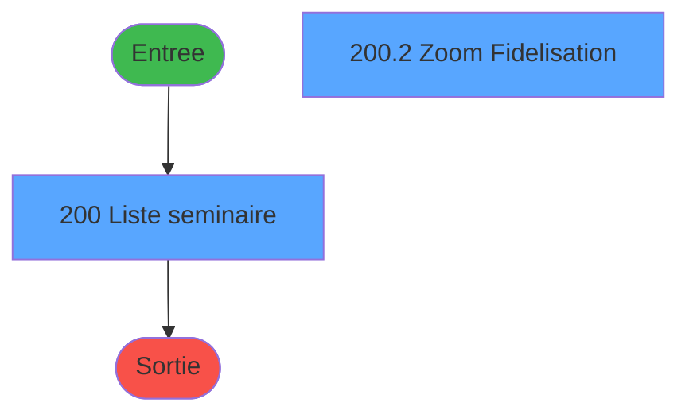
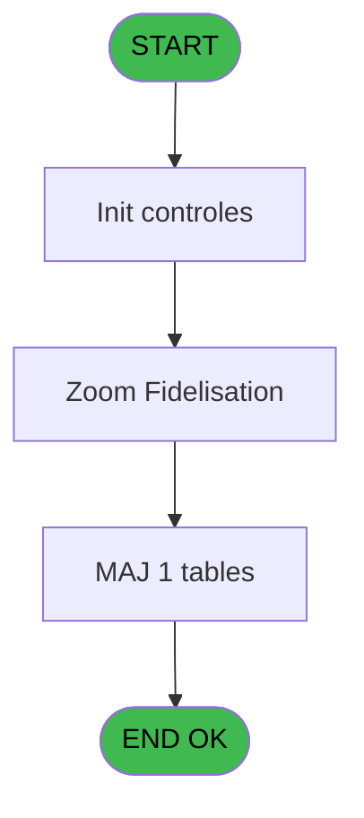

# PBP IDE 200 - Liste Fidelisation

> **Analyse**: Phases 1-4 2026-02-03 15:46 -> 15:47 (12s) | Assemblage 15:47
> **Pipeline**: V7.2 Enrichi
> **Structure**: 4 onglets (Resume | Ecrans | Donnees | Connexions)

<!-- TAB:Resume -->

## 1. FICHE D'IDENTITE

| Attribut | Valeur |
|----------|--------|
| Projet | PBP |
| IDE Position | 200 |
| Nom Programme | Liste Fidelisation |
| Fichier source | `Prg_200.xml` |
| Dossier IDE | Liste |
| Taches | 8 (2 ecrans visibles) |
| Tables modifiees | 1 |
| Programmes appeles | 0 |
| :warning: Statut | **ORPHELIN_POTENTIEL** |

## 2. DESCRIPTION FONCTIONNELLE

**Liste Fidelisation** assure la gestion complete de ce processus.

Le flux de traitement s'organise en **4 blocs fonctionnels** :

- **Consultation** (2 taches) : ecrans de recherche, selection et consultation
- **Impression** (2 taches) : generation de tickets et documents
- **Traitement** (2 taches) : traitements metier divers
- **Initialisation** (2 taches) : reinitialisation d'etats et de variables de travail

**Donnees modifiees** : 1 tables en ecriture (tempo_liste_service).

**Logique metier** : 3 regles identifiees couvrant conditions metier.

Detail : phases du traitement

#### Phase 1 : Traitement (2 taches)

- **200** - Liste seminaire **[[ECRAN]](#ecran-t1)**
- **200.2.2** - Check Nb Fid

#### Phase 2 : Initialisation (2 taches)

- **200.1** - Init Temp
- **200.4** - Init Temp

#### Phase 3 : Consultation (2 taches)

- **200.2** - Zoom Fidelisation **[[ECRAN]](#ecran-t3)**
- **200.2.1** - Select/Deselect All

#### Phase 4 : Impression (2 taches)

- **200.3** - Edition
- **200.5** - Edition With Dates

#### Tables impactees

| Table | Operations | Role metier |
|-------|-----------|-------------|
| tempo_liste_service | **W**/L (7 usages) | Table temporaire ecran |

## 3. BLOCS FONCTIONNELS

### 3.1 Traitement (2 taches)

Traitements internes.

---

#### 200 - Liste seminaire [[ECRAN]](#ecran-t1)

**Role** : Traitement : Liste seminaire.
**Ecran** : 598 x 165 DLU (MDI) | [Voir mockup](#ecran-t1)

---

#### 200.2.2 - Check Nb Fid

**Role** : Traitement : Check Nb Fid.

### 3.2 Initialisation (2 taches)

Reinitialisation d'etats et variables de travail.

---

#### 200.1 - Init Temp

**Role** : Reinitialisation : Init Temp.

---

#### 200.4 - Init Temp

**Role** : Reinitialisation : Init Temp.

### 3.3 Consultation (2 taches)

Ecrans de recherche et consultation.

---

#### 200.2 - Zoom Fidelisation [[ECRAN]](#ecran-t3)

**Role** : Selection par l'operateur : Zoom Fidelisation.
**Ecran** : 408 x 247 DLU (MDI) | [Voir mockup](#ecran-t3)
**Variables liees** : H (b_fidelisation)

---

#### 200.2.1 - Select/Deselect All

**Role** : Traitement : Select/Deselect All.

### 3.4 Impression (2 taches)

Generation des documents et tickets.

---

#### 200.3 - Edition

**Role** : Generation du document : Edition.

---

#### 200.5 - Edition With Dates

**Role** : Generation du document : Edition With Dates.
**Variables liees** : Y (AfficherDates ?)

## 5. REGLES METIER

3 regles identifiees:

### Consultation (1 regles)

#### [RM-001] Si FlagRegulier4Range [X] AND AfficherDates ? [Y] AND v.Compteur Extraction [Z] alors '' sinon IF(FlagRegulier4Range [X],'N', IF(AfficherDates ? [Y],'V',IF(v.Compteur Extraction [Z],'T','X'))))

| Element | Detail |
|---------|--------|
| **Condition** | `FlagRegulier4Range [X] AND AfficherDates ? [Y] AND v.Compteur Extraction [Z]` |
| **Si vrai** | '' |
| **Si faux** | IF(FlagRegulier4Range [X],'N', IF(AfficherDates ? [Y],'V',IF(v.Compteur Extraction [Z],'T','X')))) |
| **Variables** | Z (v.Compteur Extraction), W (FlagRegulier), X (FlagRegulier4Range), Y (AfficherDates ?) |
| **Expression source** | Expression 14 : `IF(FlagRegulier4Range [X] AND AfficherDates ? [Y] AND v.Comp` |
| **Exemple** | Si FlagRegulier4Range [X] AND AfficherDates ? [Y] AND v.Compteur Extraction [Z] → '' |
| **Impact** | Bloc Consultation |

### Autres (2 regles)

#### [RM-002] Si VG42 alors 'b_Date [C]'FORM sinon 'w0_Date [B]'FORM)

| Element | Detail |
|---------|--------|
| **Condition** | `VG42` |
| **Si vrai** | 'b_Date [C]'FORM |
| **Si faux** | 'w0_Date [B]'FORM) |
| **Variables** | B (w0_Date), C (b_Date) |
| **Expression source** | Expression 24 : `IF(VG42,'b_Date [C]'FORM,'w0_Date [B]'FORM)` |
| **Exemple** | Si VG42 → 'b_Date [C]'FORM. Sinon → 'w0_Date [B]'FORM) |

#### [RM-003] Si [AD] ='O' alors 'R' sinon IF([AD] = 'N', '','T'))

| Element | Detail |
|---------|--------|
| **Condition** | `[AD] ='O'` |
| **Si vrai** | 'R' |
| **Si faux** | IF([AD] = 'N', '','T')) |
| **Expression source** | Expression 27 : `IF([AD] ='O', 'R', IF([AD] = 'N', '','T'))` |
| **Exemple** | Si [AD] ='O' → 'R'. Sinon → IF([AD] = 'N', '','T')) |

## 6. CONTEXTE

- **Appele par**: (aucun)
- **Appelle**: 0 programmes | **Tables**: 16 (W:1 R:3 L:13) | **Taches**: 8 | **Expressions**: 33

<!-- TAB:Ecrans -->

## 8. ECRANS

### 8.1 Forms visibles (2 / 8)

| # | Position | Tache | Nom | Type | Largeur | Hauteur | Bloc |
|---|----------|-------|-----|------|---------|---------|------|
| 1 | 200 | 200 | Liste seminaire | MDI | 598 | 165 | Traitement |
| 2 | 200.3 | 200.2 | Zoom Fidelisation | MDI | 408 | 247 | Consultation |

### 8.2 Mockups Ecrans

---

#### 200 - Liste seminaire
**Tache** : [200](#t1) | **Type** : MDI | **Dimensions** : 598 x 165 DLU
**Bloc** : Traitement | **Titre IDE** : Liste seminaire

<!-- FORM-DATA:
{
    "width":  598,
    "vFactor":  8,
    "type":  "MDI",
    "hFactor":  8,
    "controls":  [
                     {
                         "x":  0,
                         "type":  "label",
                         "var":  "",
                         "y":  0,
                         "w":  593,
                         "fmt":  "",
                         "name":  "",
                         "h":  19,
                         "color":  "",
                         "text":  "",
                         "parent":  null
                     },
                     {
                         "x":  40,
                         "type":  "label",
                         "var":  "",
                         "y":  24,
                         "w":  330,
                         "fmt":  "",
                         "name":  "",
                         "h":  111,
                         "color":  "",
                         "text":  "",
                         "parent":  null
                     },
                     {
                         "x":  378,
                         "type":  "label",
                         "var":  "",
                         "y":  24,
                         "w":  186,
                         "fmt":  "",
                         "name":  "",
                         "h":  111,
                         "color":  "",
                         "text":  "",
                         "parent":  null
                     },
                     {
                         "x":  57,
                         "type":  "label",
                         "var":  "",
                         "y":  33,
                         "w":  30,
                         "fmt":  "",
                         "name":  "",
                         "h":  10,
                         "color":  "",
                         "text":  "Le",
                         "parent":  5
                     },
                     {
                         "x":  45,
                         "type":  "line",
                         "var":  "",
                         "y":  50,
                         "w":  323,
                         "fmt":  "",
                         "name":  "",
                         "h":  0,
                         "color":  "",
                         "text":  "",
                         "parent":  5
                     },
                     {
                         "x":  45,
                         "type":  "line",
                         "var":  "",
                         "y":  85,
                         "w":  323,
                         "fmt":  "",
                         "name":  "",
                         "h":  0,
                         "color":  "",
                         "text":  "",
                         "parent":  5
                     },
                     {
                         "x":  45,
                         "type":  "line",
                         "var":  "",
                         "y":  112,
                         "w":  323,
                         "fmt":  "",
                         "name":  "",
                         "h":  0,
                         "color":  "",
                         "text":  "",
                         "parent":  5
                     },
                     {
                         "x":  99,
                         "type":  "label",
                         "var":  "",
                         "y":  119,
                         "w":  116,
                         "fmt":  "",
                         "name":  "",
                         "h":  9,
                         "color":  "",
                         "text":  "Sélections",
                         "parent":  5
                     },
                     {
                         "x":  2,
                         "type":  "label",
                         "var":  "",
                         "y":  140,
                         "w":  593,
                         "fmt":  "",
                         "name":  "",
                         "h":  24,
                         "color":  "",
                         "text":  "",
                         "parent":  null
                     },
                     {
                         "x":  261,
                         "type":  "label",
                         "var":  "",
                         "y":  33,
                         "w":  54,
                         "fmt":  "",
                         "name":  "",
                         "h":  10,
                         "color":  "",
                         "text":  "Heure",
                         "parent":  5
                     },
                     {
                         "x":  94,
                         "type":  "edit",
                         "var":  "",
                         "y":  33,
                         "w":  126,
                         "fmt":  "DD/MM/YYYY",
                         "name":  "w0_Date",
                         "h":  10,
                         "color":  "110",
                         "text":  "",
                         "parent":  5
                     },
                     {
                         "x":  222,
                         "type":  "button",
                         "var":  "",
                         "y":  33,
                         "w":  27,
                         "fmt":  "...",
                         "name":  "b_Date",
                         "h":  10,
                         "color":  "",
                         "text":  "",
                         "parent":  5
                     },
                     {
                         "x":  69,
                         "type":  "radio",
                         "var":  "",
                         "y":  53,
                         "w":  291,
                         "fmt":  "",
                         "name":  "w0_choix",
                         "h":  26,
                         "color":  "",
                         "text":  "A,P,V",
                         "parent":  5
                     },
                     {
                         "x":  235,
                         "type":  "edit",
                         "var":  "",
                         "y":  119,
                         "w":  56,
                         "fmt":  "",
                         "name":  "",
                         "h":  9,
                         "color":  "",
                         "text":  "",
                         "parent":  5
                     },
                     {
                         "x":  99,
                         "type":  "button",
                         "var":  "",
                         "y":  92,
                         "w":  192,
                         "fmt":  "",
                         "name":  "b_fidelisation",
                         "h":  14,
                         "color":  "",
                         "text":  "",
                         "parent":  5
                     },
                     {
                         "x":  394,
                         "type":  "button",
                         "var":  "",
                         "y":  88,
                         "w":  154,
                         "fmt":  "\u0026Ecran",
                         "name":  "b_Ecran",
                         "h":  18,
                         "color":  "",
                         "text":  "",
                         "parent":  6
                     },
                     {
                         "x":  394,
                         "type":  "button",
                         "var":  "",
                         "y":  108,
                         "w":  154,
                         "fmt":  "\u0026Impression",
                         "name":  "b_Imprimer",
                         "h":  18,
                         "color":  "",
                         "text":  "",
                         "parent":  6
                     },
                     {
                         "x":  6,
                         "type":  "edit",
                         "var":  "",
                         "y":  2,
                         "w":  267,
                         "fmt":  "30",
                         "name":  "",
                         "h":  8,
                         "color":  "",
                         "text":  "",
                         "parent":  1
                     },
                     {
                         "x":  383,
                         "type":  "edit",
                         "var":  "",
                         "y":  6,
                         "w":  203,
                         "fmt":  "WWW DD MMM YYYYT",
                         "name":  "",
                         "h":  8,
                         "color":  "",
                         "text":  "",
                         "parent":  1
                     },
                     {
                         "x":  6,
                         "type":  "edit",
                         "var":  "",
                         "y":  10,
                         "w":  267,
                         "fmt":  "30",
                         "name":  "",
                         "h":  8,
                         "color":  "",
                         "text":  "",
                         "parent":  1
                     },
                     {
                         "x":  402,
                         "type":  "image",
                         "var":  "",
                         "y":  29,
                         "w":  136,
                         "fmt":  "",
                         "name":  "",
                         "h":  54,
                         "color":  "",
                         "text":  "",
                         "parent":  6
                     },
                     {
                         "x":  10,
                         "type":  "button",
                         "var":  "",
                         "y":  143,
                         "w":  154,
                         "fmt":  "\u0026Quitter",
                         "name":  "",
                         "h":  18,
                         "color":  "",
                         "text":  "",
                         "parent":  15
                     },
                     {
                         "x":  314,
                         "type":  "edit",
                         "var":  "",
                         "y":  33,
                         "w":  34,
                         "fmt":  "2P0Z",
                         "name":  "w0_Heure",
                         "h":  10,
                         "color":  "110",
                         "text":  "",
                         "parent":  5
                     }
                 ],
    "taskId":  "200",
    "height":  165
}
-->

<strong>Champs : 6 champs</strong>

| Pos (x,y) | Nom | Variable | Type |
|-----------|-----|----------|------|
| 94,33 | w0_Date | - | edit |
| 235,119 | (sans nom) | - | edit |
| 6,2 | 30 | - | edit |
| 383,6 | WWW DD MMM YYYYT | - | edit |
| 6,10 | 30 | - | edit |
| 314,33 | w0_Heure | - | edit |

<strong>Boutons : 5 boutons</strong>

| Bouton | Pos (x,y) | Action |
|--------|-----------|--------|
| ... | 222,33 | Bouton fonctionnel |
| b_fidelisation | 99,92 | Bouton fonctionnel |
| Ecran | 394,88 | Bouton fonctionnel |
| Impression | 394,108 | Bouton fonctionnel |
| Quitter | 10,143 | Quitte le programme |

---

#### 200.3 - Zoom Fidelisation
**Tache** : [200.2](#t3) | **Type** : MDI | **Dimensions** : 408 x 247 DLU
**Bloc** : Consultation | **Titre IDE** : Zoom Fidelisation

<!-- FORM-DATA:
{
    "width":  408,
    "vFactor":  8,
    "type":  "MDI",
    "hFactor":  8,
    "controls":  [
                     {
                         "x":  14,
                         "type":  "table",
                         "var":  "",
                         "name":  "",
                         "titleH":  12,
                         "color":  "196",
                         "w":  386,
                         "y":  1,
                         "fmt":  "",
                         "parent":  null,
                         "text":  "",
                         "rowH":  13,
                         "h":  217,
                         "cols":  [
                                      {
                                          "title":  "Libellé",
                                          "layer":  1,
                                          "w":  353
                                      }
                                  ],
                         "rows":  1
                     },
                     {
                         "x":  3,
                         "type":  "label",
                         "var":  "",
                         "y":  224,
                         "w":  398,
                         "fmt":  "",
                         "name":  "",
                         "h":  20,
                         "color":  "",
                         "text":  "",
                         "parent":  null
                     },
                     {
                         "x":  18,
                         "type":  "edit",
                         "var":  "",
                         "y":  16,
                         "w":  288,
                         "fmt":  "",
                         "name":  "",
                         "h":  8,
                         "color":  "196",
                         "text":  "",
                         "parent":  1
                     },
                     {
                         "x":  333,
                         "type":  "checkbox",
                         "var":  "",
                         "y":  16,
                         "w":  21,
                         "fmt":  "",
                         "name":  "",
                         "h":  10,
                         "color":  "196",
                         "text":  "",
                         "parent":  1
                     },
                     {
                         "x":  132,
                         "type":  "button",
                         "var":  "",
                         "y":  227,
                         "w":  144,
                         "fmt":  "\u0026Quitter",
                         "name":  "",
                         "h":  14,
                         "color":  "",
                         "text":  "",
                         "parent":  4
                     },
                     {
                         "x":  338,
                         "type":  "button",
                         "var":  "",
                         "y":  1,
                         "w":  29,
                         "fmt":  "þ",
                         "name":  "",
                         "h":  13,
                         "color":  "",
                         "text":  "",
                         "parent":  null
                     }
                 ],
    "taskId":  "200.3",
    "height":  247
}
-->

<strong>Champs : 2 champs</strong>

| Pos (x,y) | Nom | Variable | Type |
|-----------|-----|----------|------|
| 18,16 | (sans nom) | - | edit |
| 333,16 | (sans nom) | - | checkbox |

<strong>Boutons : 2 boutons</strong>

| Bouton | Pos (x,y) | Action |
|--------|-----------|--------|
| Quitter | 132,227 | Quitte le programme |
| þ | 338,1 | Bouton fonctionnel |

## 9. NAVIGATION

### 9.1 Enchainement des ecrans

**Detail par enchainement :**

| Depuis | Action | Vers | Retour |
|--------|--------|------|--------|

### 9.3 Structure hierarchique (8 taches)

| Position | Tache | Type | Dimensions | Bloc |
|----------|-------|------|------------|------|
| **200.1** | [**Liste seminaire** (200)](#t1) [mockup](#ecran-t1) | MDI | 598x165 | Traitement |
| 200.1.1 | [Check Nb Fid (200.2.2)](#t5) | MDI | - | |
| **200.2** | [**Init Temp** (200.1)](#t2) | MDI | - | Initialisation |
| 200.2.1 | [Init Temp (200.4)](#t9) | MDI | - | |
| **200.3** | [**Zoom Fidelisation** (200.2)](#t3) [mockup](#ecran-t3) | MDI | 408x247 | Consultation |
| 200.3.1 | [Select/Deselect All (200.2.1)](#t4) | MDI | - | |
| **200.4** | [**Edition** (200.3)](#t6) | MDI | - | Impression |
| 200.4.1 | [Edition With Dates (200.5)](#t16) | MDI | - | |

### 9.4 Algorigramme

> **Legende**: Vert = START/END OK | Rouge = END KO | Bleu = Decisions
> *Algorigramme auto-genere. Utiliser `/algorigramme` pour une synthese metier detaillee.*

<!-- TAB:Donnees -->

## 10. TABLES

### Tables utilisees (16)

| ID | Nom | Description | Type | R | W | L | Usages |
|----|-----|-------------|------|---|---|---|--------|
| 30 | gm-recherche_____gmr | Index de recherche | DB | R |   |   | 2 |
| 31 | gm-complet_______gmc |  | DB |   |   | L | 2 |
| 34 | hebergement______heb | Hebergement (chambres) | DB |   |   | L | 2 |
| 37 | commentaire_gm_________acc |  | DB |   |   | L | 1 |
| 39 | depot_garantie___dga | Depots et garanties | DB |   |   | L | 2 |
| 131 | fichier_validation |  | DB |   |   | L | 2 |
| 167 | troncon__________tro |  | DB |   |   | L | 2 |
| 171 | commentaire______com |  | DB |   |   | L | 1 |
| 285 | email |  | DB |   |   | L | 2 |
| 358 | import_mod |  | DB |   |   | L | 2 |
| 364 | pms_footer_comment |  | DB |   |   | L | 2 |
| 473 | comptage_caisse | Sessions de caisse | TMP |   |   | L | 1 |
| 602 | tempo_liste_service | Table temporaire ecran | TMP |   | **W** | L | 7 |
| 738 | pv_selling_unit |  | DB | R |   |   | 1 |
| 806 | sale_channel |  | DB |   |   | L | 2 |
| 845 | stat_vendeur_date |  | TMP | R |   |   | 1 |

### Colonnes par table (5 / 4 tables avec colonnes identifiees)

Table 30 - gm-recherche_____gmr (R) - 2 usages

| Lettre | Variable | Acces | Type |
|--------|----------|-------|------|
| A | p.preview | R | Logical |
| B | p.Excel | R | Logical |
| C | v.retour validation? | R | Logical |
| D | v.RetourTroncon? | R | Logical |
| E | v.DureeTransfert | R | Numeric |
| F | v.HeureArriveVlg | R | Time |
| G | V.Libelle statut | R | Alpha |
| H | v.StatutExcel | R | Alpha |
| I | V.LigneExcel | R | Alpha |
| J | V. A | R | Logical |
| K | V. P | R | Logical |
| L | V.V | R | Logical |
| M | V. Selection | R | Logical |
| N | v.libelle dates | R | Alpha |
| O | v.type GM | R | Alpha |
| P | V.LigneExcel | R | Alpha |
| Q | V.A | R | Logical |
| R | V.P | R | Logical |
| S | V.V | R | Logical |
| T | V. Selection | R | Logical |

Table 602 - tempo_liste_service (**W**/L) - 7 usages

| Lettre | Variable | Acces | Type |
|--------|----------|-------|------|
| E | ListesDatesArrivees | W | Unicode |

Table 738 - pv_selling_unit (R) - 1 usages

*Table utilisee uniquement en Link ou aucune colonne Real identifiee dans le DataView.*

Table 845 - stat_vendeur_date (R) - 1 usages

| Lettre | Variable | Acces | Type |
|--------|----------|-------|------|
| B | w0_Date | R | Date |
| C | b_Date | R | Alpha |
| E | ListesDatesArrivees | R | Unicode |
| G | V.Libelle statut | R | Alpha |
| H | v.StatutExcel | R | Alpha |
| L | V.Libelle statut | R | Alpha |
| M | v.StatutExcel | R | Alpha |
| N | v.libelle dates | R | Alpha |
| Y | AfficherDates ? | R | Logical |

## 11. VARIABLES

### 11.1 Variables de session (12)

Variables persistantes pendant toute la session.

| Lettre | Nom | Type | Usage dans |
|--------|-----|------|-----------|
| K | v.Nouveaux GM | Alpha | - |
| L | V.Actionnaire | Alpha | - |
| M | V.Donateur | Alpha | - |
| N | V.vipNON | Logical | - |
| O | V.vipVIP | Logical | - |
| P | V.vipTOP | Logical | - |
| Q | V.Vip | Alpha | - |
| R | V.Ambassadeur | Alpha | - |
| S | V.Report | Alpha | - |
| T | v.Chemin | Alpha | - |
| U | v.NomFichierCsv | Alpha | - |
| Z | v.Compteur Extraction | Numeric | 1x session |

### 11.2 Autres (14)

Variables diverses.

| Lettre | Nom | Type | Usage dans |
|--------|-----|------|-----------|
| A | w0_TitreEcran | Alpha | 1x refs |
| B | w0_Date | Date | 1x refs |
| C | b_Date | Alpha | 1x refs |
| D | w0_Heure | Numeric | - |
| E | w0_choix | Alpha | 2x refs |
| F | w0_NbSelect | Numeric | 3x refs |
| G | w0_NbFid | Numeric | - |
| H | b_fidelisation | Alpha | - |
| I | b_Ecran | Alpha | - |
| J | b_Imprimer | Alpha | - |
| V | b_Excel | Alpha | - |
| W | FlagRegulier | Alpha | 1x refs |
| X | FlagRegulier4Range | Alpha | 1x refs |
| Y | AfficherDates ? | Logical | 1x refs |

Toutes les 26 variables (liste complete)

| Cat | Lettre | Nom Variable | Type |
|-----|--------|--------------|------|
| V. | **K** | v.Nouveaux GM | Alpha |
| V. | **L** | V.Actionnaire | Alpha |
| V. | **M** | V.Donateur | Alpha |
| V. | **N** | V.vipNON | Logical |
| V. | **O** | V.vipVIP | Logical |
| V. | **P** | V.vipTOP | Logical |
| V. | **Q** | V.Vip | Alpha |
| V. | **R** | V.Ambassadeur | Alpha |
| V. | **S** | V.Report | Alpha |
| V. | **T** | v.Chemin | Alpha |
| V. | **U** | v.NomFichierCsv | Alpha |
| V. | **Z** | v.Compteur Extraction | Numeric |
| Autre | **A** | w0_TitreEcran | Alpha |
| Autre | **B** | w0_Date | Date |
| Autre | **C** | b_Date | Alpha |
| Autre | **D** | w0_Heure | Numeric |
| Autre | **E** | w0_choix | Alpha |
| Autre | **F** | w0_NbSelect | Numeric |
| Autre | **G** | w0_NbFid | Numeric |
| Autre | **H** | b_fidelisation | Alpha |
| Autre | **I** | b_Ecran | Alpha |
| Autre | **J** | b_Imprimer | Alpha |
| Autre | **V** | b_Excel | Alpha |
| Autre | **W** | FlagRegulier | Alpha |
| Autre | **X** | FlagRegulier4Range | Alpha |
| Autre | **Y** | AfficherDates ? | Logical |

## 12. EXPRESSIONS

**33 / 33 expressions decodees (100%)**

### 12.1 Repartition par type

| Type | Expressions | Regles |
|------|-------------|--------|
| CALCULATION | 1 | 0 |
| CONDITION | 7 | 3 |
| CONSTANTE | 8 | 0 |
| DATE | 1 | 0 |
| FORMAT | 1 | 0 |
| REFERENCE_VG | 3 | 0 |
| OTHER | 6 | 0 |
| CAST_LOGIQUE | 2 | 0 |
| NEGATION | 1 | 0 |
| STRING | 1 | 0 |
| CONCATENATION | 2 | 0 |

### 12.2 Expressions cles par type

#### CALCULATION (1 expressions)

| Type | IDE | Expression | Regle |
|------|-----|------------|-------|
| CALCULATION | 32 | `[AH]+1` | - |

#### CONDITION (7 expressions)

| Type | IDE | Expression | Regle |
|------|-----|------------|-------|
| CONDITION | 27 | `IF([AD] ='O', 'R', IF([AD] = 'N', '','T'))` | [RM-003](#rm-RM-003) |
| CONDITION | 24 | `IF(VG42,'b_Date [C]'FORM,'w0_Date [B]'FORM)` | [RM-002](#rm-RM-002) |
| CONDITION | 14 | `IF(FlagRegulier4Range [X] AND AfficherDates ? [Y] AND v.Compteur Extraction [Z],'',IF(FlagRegulier4Range [X],'N', IF(AfficherDates ? [Y],'V',IF(v.Compteur Extraction [Z],'T','X'))))` | [RM-001](#rm-RM-001) |
| CONDITION | 17 | `w0_NbSelect [F]>0 OR [AD]='O'` | - |
| CONDITION | 18 | `w0_NbSelect [F]>0` | - |
| ... | | *+2 autres* | |

#### CONSTANTE (8 expressions)

| Type | IDE | Expression | Regle |
|------|-----|------------|-------|
| CONSTANTE | 20 | `'A'` | - |
| CONSTANTE | 13 | `0` | - |
| CONSTANTE | 26 | `'T'` | - |
| CONSTANTE | 23 | `'T'` | - |
| CONSTANTE | 3 | `'&Ecran'` | - |
| ... | | *+3 autres* | |

#### DATE (1 expressions)

| Type | IDE | Expression | Regle |
|------|-----|------------|-------|
| DATE | 7 | `Date()` | - |

#### FORMAT (1 expressions)

| Type | IDE | Expression | Regle |
|------|-----|------------|-------|
| FORMAT | 31 | `'LISTE_FIDELISATIONS_'& Trim(User(0)) &'_'&
DStr(Date(),'YYYYMMDD')&'_'&TStr(Time(),'HHMMSS')&
Trim(Str([AH],'3'))&'.csv'` | - |

#### REFERENCE_VG (3 expressions)

| Type | IDE | Expression | Regle |
|------|-----|------------|-------|
| REFERENCE_VG | 33 | `VG125` | - |
| REFERENCE_VG | 22 | `VG42` | - |
| REFERENCE_VG | 5 | `VG2` | - |

#### OTHER (6 expressions)

| Type | IDE | Expression | Regle |
|------|-----|------------|-------|
| OTHER | 16 | `DbDel ('{602,2}'DSOURCE,'')` | - |
| OTHER | 28 | `NOT([AE])` | - |
| OTHER | 29 | `[AE]` | - |
| OTHER | 8 | `SetCrsr (2)` | - |
| OTHER | 9 | `SetCrsr (1)` | - |
| ... | | *+1 autres* | |

#### CAST_LOGIQUE (2 expressions)

| Type | IDE | Expression | Regle |
|------|-----|------------|-------|
| CAST_LOGIQUE | 25 | `'FALSE'LOG` | - |
| CAST_LOGIQUE | 15 | `'TRUE'LOG` | - |

#### NEGATION (1 expressions)

| Type | IDE | Expression | Regle |
|------|-----|------------|-------|
| NEGATION | 21 | `NOT VG42` | - |

#### STRING (1 expressions)

| Type | IDE | Expression | Regle |
|------|-----|------------|-------|
| STRING | 1 | `Trim (w0_TitreEcran [A])` | - |

#### CONCATENATION (2 expressions)

| Type | IDE | Expression | Regle |
|------|-----|------------|-------|
| CONCATENATION | 30 | `Translate (Trim([AA]))&Trim([AB])` | - |
| CONCATENATION | 19 | `MlsTrans ('Fidelisation')&' ('&Trim (Str (w0_NbSelect [F],'3'))&')'` | - |

### 12.3 Toutes les expressions (33)

Voir les 33 expressions

#### CALCULATION (1)

| IDE | Expression Decodee |
|-----|-------------------|
| 32 | `[AH]+1` |

#### CONDITION (7)

| IDE | Expression Decodee |
|-----|-------------------|
| 14 | `IF(FlagRegulier4Range [X] AND AfficherDates ? [Y] AND v.Compteur Extraction [Z],'',IF(FlagRegulier4Range [X],'N', IF(AfficherDates ? [Y],'V',IF(v.Compteur Extraction [Z],'T','X'))))` |
| 24 | `IF(VG42,'b_Date [C]'FORM,'w0_Date [B]'FORM)` |
| 27 | `IF([AD] ='O', 'R', IF([AD] = 'N', '','T'))` |
| 11 | `w0_choix [E]=0` |
| 12 | `w0_choix [E]>0` |
| 17 | `w0_NbSelect [F]>0 OR [AD]='O'` |
| 18 | `w0_NbSelect [F]>0` |

#### CONSTANTE (8)

| IDE | Expression Decodee |
|-----|-------------------|
| 2 | `'...'` |
| 3 | `'&Ecran'` |
| 4 | `'&Imprimer'` |
| 6 | `'%club_exportdata%'` |
| 13 | `0` |
| 20 | `'A'` |
| 23 | `'T'` |
| 26 | `'T'` |

#### DATE (1)

| IDE | Expression Decodee |
|-----|-------------------|
| 7 | `Date()` |

#### FORMAT (1)

| IDE | Expression Decodee |
|-----|-------------------|
| 31 | `'LISTE_FIDELISATIONS_'& Trim(User(0)) &'_'&
DStr(Date(),'YYYYMMDD')&'_'&TStr(Time(),'HHMMSS')&
Trim(Str([AH],'3'))&'.csv'` |

#### REFERENCE_VG (3)

| IDE | Expression Decodee |
|-----|-------------------|
| 5 | `VG2` |
| 22 | `VG42` |
| 33 | `VG125` |

#### OTHER (6)

| IDE | Expression Decodee |
|-----|-------------------|
| 8 | `SetCrsr (2)` |
| 9 | `SetCrsr (1)` |
| 10 | `GetParam ('VILLAGE')` |
| 16 | `DbDel ('{602,2}'DSOURCE,'')` |
| 28 | `NOT([AE])` |
| 29 | `[AE]` |

#### CAST_LOGIQUE (2)

| IDE | Expression Decodee |
|-----|-------------------|
| 15 | `'TRUE'LOG` |
| 25 | `'FALSE'LOG` |

#### NEGATION (1)

| IDE | Expression Decodee |
|-----|-------------------|
| 21 | `NOT VG42` |

#### STRING (1)

| IDE | Expression Decodee |
|-----|-------------------|
| 1 | `Trim (w0_TitreEcran [A])` |

#### CONCATENATION (2)

| IDE | Expression Decodee |
|-----|-------------------|
| 19 | `MlsTrans ('Fidelisation')&' ('&Trim (Str (w0_NbSelect [F],'3'))&')'` |
| 30 | `Translate (Trim([AA]))&Trim([AB])` |

<!-- TAB:Connexions -->

## 13. GRAPHE D'APPELS

### 13.1 Chaine depuis Main (Callers)

**Chemin**: (pas de callers directs)

### 13.2 Callers

| IDE | Nom Programme | Nb Appels |
|-----|---------------|-----------|
| - | (aucun) | - |

### 13.3 Callees (programmes appeles)

### 13.4 Detail Callees avec contexte

| IDE | Nom Programme | Appels | Contexte |
|-----|---------------|--------|----------|
| - | (aucun) | - | - |

## 14. RECOMMANDATIONS MIGRATION

### 14.1 Profil du programme

| Metrique | Valeur | Impact migration |
|----------|--------|-----------------|
| Lignes de logique | 425 | Taille moyenne |
| Expressions | 33 | Peu de logique |
| Tables WRITE | 1 | Impact faible |
| Sous-programmes | 0 | Peu de dependances |
| Ecrans visibles | 2 | Quelques ecrans |
| Code desactive | 0% (0 / 425) | Code sain |
| Regles metier | 3 | Quelques regles a preserver |

### 14.2 Plan de migration par bloc

#### Traitement (2 taches: 1 ecran, 1 traitement)

- **Strategie** : Orchestrateur avec 1 ecrans (Razor/React) et 1 traitements backend (services).
- Les ecrans deviennent des composants UI, les traitements invisibles deviennent des services injectables.
- Decomposer les taches en services unitaires testables.

#### Initialisation (2 taches: 0 ecran, 2 traitements)

- **Strategie** : Constructeur/methode `InitAsync()` dans l'orchestrateur.

#### Consultation (2 taches: 1 ecran, 1 traitement)

- **Strategie** : Composants de recherche/selection en modales.
- 1 ecran : Zoom Fidelisation

#### Impression (2 taches: 0 ecran, 2 traitements)

- **Strategie** : Templates HTML -> PDF via wkhtmltopdf ou Puppeteer.
- `PrintService` injectable avec choix imprimante

### 14.3 Dependances critiques

| Dependance | Type | Appels | Impact |
|------------|------|--------|--------|
| tempo_liste_service | Table WRITE (Temp) | 3x | Schema + repository |

---
*Spec DETAILED generee par Pipeline V7.2 - 2026-02-03 15:47*
