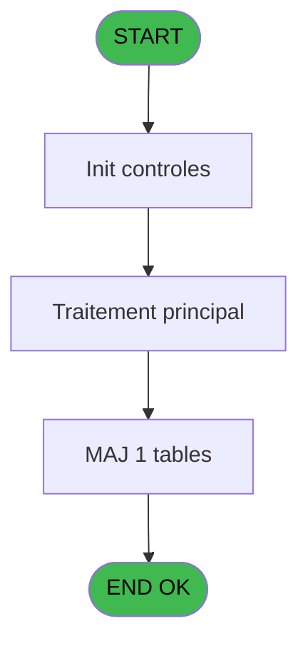
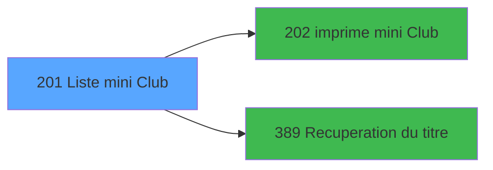

# PBP IDE 201 - Liste mini Club

> **Analyse**: Phases 1-4 2026-02-03 15:47 -> 15:47 (12s) | Assemblage 15:47
> **Pipeline**: V7.2 Enrichi
> **Structure**: 4 onglets (Resume | Ecrans | Donnees | Connexions)

<!-- TAB:Resume -->

## 1. FICHE D'IDENTITE

| Attribut | Valeur |
|----------|--------|
| Projet | PBP |
| IDE Position | 201 |
| Nom Programme | Liste mini Club |
| Fichier source | `Prg_201.xml` |
| Dossier IDE | Liste |
| Taches | 3 (1 ecrans visibles) |
| Tables modifiees | 1 |
| Programmes appeles | 2 |
| :warning: Statut | **ORPHELIN_POTENTIEL** |

## 2. DESCRIPTION FONCTIONNELLE

**Liste mini Club** assure la gestion complete de ce processus.

Le flux de traitement s'organise en **2 blocs fonctionnels** :

- **Initialisation** (2 taches) : reinitialisation d'etats et de variables de travail
- **Traitement** (1 tache) : traitements metier divers

**Donnees modifiees** : 1 tables en ecriture (choix_listes).

Detail : phases du traitement

#### Phase 1 : Traitement (1 tache)

- **201** - Liste mini Club **[[ECRAN]](#ecran-t1)**

Delegue a : [Recuperation du titre (IDE 389)](PBP-IDE-389.md)

#### Phase 2 : Initialisation (2 taches)

- **201.1** - Init Temp
- **201.2** - Init Temp

#### Tables impactees

| Table | Operations | Role metier |
|-------|-----------|-------------|
| choix_listes | R/**W** (2 usages) |  |

## 3. BLOCS FONCTIONNELS

### 3.1 Traitement (1 tache)

Traitements internes.

---

#### 201 - Liste mini Club [[ECRAN]](#ecran-t1)

**Role** : Traitement : Liste mini Club.
**Ecran** : 595 x 180 DLU (MDI) | [Voir mockup](#ecran-t1)
**Delegue a** : [Recuperation du titre (IDE 389)](PBP-IDE-389.md)

### 3.2 Initialisation (2 taches)

Reinitialisation d'etats et variables de travail.

---

#### 201.1 - Init Temp

**Role** : Reinitialisation : Init Temp.

---

#### 201.2 - Init Temp

**Role** : Reinitialisation : Init Temp.

## 5. REGLES METIER

*(Aucune regle metier identifiee)*

## 6. CONTEXTE

- **Appele par**: (aucun)
- **Appelle**: 2 programmes | **Tables**: 1 (W:1 R:1 L:0) | **Taches**: 3 | **Expressions**: 18

<!-- TAB:Ecrans -->

## 8. ECRANS

### 8.1 Forms visibles (1 / 3)

| # | Position | Tache | Nom | Type | Largeur | Hauteur | Bloc |
|---|----------|-------|-----|------|---------|---------|------|
| 1 | 201 | 201 | Liste mini Club | MDI | 595 | 180 | Traitement |

### 8.2 Mockups Ecrans

---

#### 201 - Liste mini Club
**Tache** : [201](#t1) | **Type** : MDI | **Dimensions** : 595 x 180 DLU
**Bloc** : Traitement | **Titre IDE** : Liste mini Club

<!-- FORM-DATA:
{
    "width":  595,
    "vFactor":  8,
    "type":  "MDI",
    "hFactor":  8,
    "controls":  [
                     {
                         "x":  0,
                         "type":  "label",
                         "var":  "",
                         "y":  0,
                         "w":  593,
                         "fmt":  "",
                         "name":  "",
                         "h":  19,
                         "color":  "",
                         "text":  "",
                         "parent":  null
                     },
                     {
                         "x":  29,
                         "type":  "label",
                         "var":  "",
                         "y":  35,
                         "w":  312,
                         "fmt":  "",
                         "name":  "",
                         "h":  116,
                         "color":  "",
                         "text":  "",
                         "parent":  null
                     },
                     {
                         "x":  366,
                         "type":  "label",
                         "var":  "",
                         "y":  37,
                         "w":  213,
                         "fmt":  "",
                         "name":  "",
                         "h":  115,
                         "color":  "",
                         "text":  "",
                         "parent":  null
                     },
                     {
                         "x":  68,
                         "type":  "label",
                         "var":  "",
                         "y":  42,
                         "w":  30,
                         "fmt":  "",
                         "name":  "",
                         "h":  10,
                         "color":  "",
                         "text":  "Le",
                         "parent":  null
                     },
                     {
                         "x":  27,
                         "type":  "line",
                         "var":  "",
                         "y":  58,
                         "w":  310,
                         "fmt":  "",
                         "name":  "",
                         "h":  0,
                         "color":  "",
                         "text":  "",
                         "parent":  null
                     },
                     {
                         "x":  27,
                         "type":  "line",
                         "var":  "",
                         "y":  76,
                         "w":  311,
                         "fmt":  "",
                         "name":  "",
                         "h":  0,
                         "color":  "",
                         "text":  "",
                         "parent":  null
                     },
                     {
                         "x":  52,
                         "type":  "label",
                         "var":  "",
                         "y":  82,
                         "w":  98,
                         "fmt":  "",
                         "name":  "",
                         "h":  10,
                         "color":  "",
                         "text":  "Tranche 1 :",
                         "parent":  null
                     },
                     {
                         "x":  220,
                         "type":  "line",
                         "var":  "",
                         "y":  86,
                         "w":  26,
                         "fmt":  "",
                         "name":  "",
                         "h":  0,
                         "color":  "",
                         "text":  "",
                         "parent":  null
                     },
                     {
                         "x":  52,
                         "type":  "label",
                         "var":  "",
                         "y":  94,
                         "w":  98,
                         "fmt":  "",
                         "name":  "",
                         "h":  10,
                         "color":  "",
                         "text":  "Tranche 2 :",
                         "parent":  null
                     },
                     {
                         "x":  220,
                         "type":  "line",
                         "var":  "",
                         "y":  98,
                         "w":  26,
                         "fmt":  "",
                         "name":  "",
                         "h":  0,
                         "color":  "",
                         "text":  "",
                         "parent":  null
                     },
                     {
                         "x":  396,
                         "type":  "label",
                         "var":  "",
                         "y":  100,
                         "w":  106,
                         "fmt":  "",
                         "name":  "",
                         "h":  9,
                         "color":  "",
                         "text":  "Sortie",
                         "parent":  7
                     },
                     {
                         "x":  52,
                         "type":  "label",
                         "var":  "",
                         "y":  107,
                         "w":  98,
                         "fmt":  "",
                         "name":  "",
                         "h":  10,
                         "color":  "",
                         "text":  "Tranche 3 :",
                         "parent":  null
                     },
                     {
                         "x":  220,
                         "type":  "line",
                         "var":  "",
                         "y":  111,
                         "w":  28,
                         "fmt":  "",
                         "name":  "",
                         "h":  0,
                         "color":  "",
                         "text":  "",
                         "parent":  null
                     },
                     {
                         "x":  52,
                         "type":  "label",
                         "var":  "",
                         "y":  119,
                         "w":  98,
                         "fmt":  "",
                         "name":  "",
                         "h":  10,
                         "color":  "",
                         "text":  "Tranche 4 :",
                         "parent":  null
                     },
                     {
                         "x":  220,
                         "type":  "line",
                         "var":  "",
                         "y":  123,
                         "w":  26,
                         "fmt":  "",
                         "name":  "",
                         "h":  0,
                         "color":  "",
                         "text":  "",
                         "parent":  null
                     },
                     {
                         "x":  396,
                         "type":  "label",
                         "var":  "",
                         "y":  125,
                         "w":  106,
                         "fmt":  "",
                         "name":  "",
                         "h":  9,
                         "color":  "",
                         "text":  "Tri",
                         "parent":  7
                     },
                     {
                         "x":  27,
                         "type":  "line",
                         "var":  "",
                         "y":  132,
                         "w":  316,
                         "fmt":  "",
                         "name":  "",
                         "h":  0,
                         "color":  "",
                         "text":  "",
                         "parent":  null
                     },
                     {
                         "x":  52,
                         "type":  "label",
                         "var":  "",
                         "y":  136,
                         "w":  194,
                         "fmt":  "",
                         "name":  "",
                         "h":  10,
                         "color":  "",
                         "text":  "Lignes supplémentaires :",
                         "parent":  null
                     },
                     {
                         "x":  105,
                         "type":  "edit",
                         "var":  "",
                         "y":  42,
                         "w":  126,
                         "fmt":  "DD/MM/YYYY",
                         "name":  "V_Date",
                         "h":  10,
                         "color":  "110",
                         "text":  "",
                         "parent":  null
                     },
                     {
                         "x":  233,
                         "type":  "button",
                         "var":  "",
                         "y":  42,
                         "w":  27,
                         "fmt":  "...",
                         "name":  "V_DateAppel",
                         "h":  10,
                         "color":  "",
                         "text":  "",
                         "parent":  null
                     },
                     {
                         "x":  38,
                         "type":  "radio",
                         "var":  "",
                         "y":  60,
                         "w":  291,
                         "fmt":  "",
                         "name":  "V_Choix A ou P",
                         "h":  13,
                         "color":  "",
                         "text":  "Arrivants,Présents",
                         "parent":  null
                     },
                     {
                         "x":  162,
                         "type":  "edit",
                         "var":  "",
                         "y":  82,
                         "w":  53,
                         "fmt":  "#2",
                         "name":  "V_Tranche_1_Debut",
                         "h":  10,
                         "color":  "110",
                         "text":  "",
                         "parent":  null
                     },
                     {
                         "x":  258,
                         "type":  "edit",
                         "var":  "",
                         "y":  82,
                         "w":  53,
                         "fmt":  "#2",
                         "name":  "V_Tranche_1_Fin",
                         "h":  10,
                         "color":  "110",
                         "text":  "",
                         "parent":  null
                     },
                     {
                         "x":  162,
                         "type":  "edit",
                         "var":  "",
                         "y":  94,
                         "w":  53,
                         "fmt":  "#2",
                         "name":  "V_Tranche_2_Debut",
                         "h":  10,
                         "color":  "110",
                         "text":  "",
                         "parent":  null
                     },
                     {
                         "x":  258,
                         "type":  "edit",
                         "var":  "",
                         "y":  94,
                         "w":  53,
                         "fmt":  "#2",
                         "name":  "V_Tranche_2_Fin",
                         "h":  10,
                         "color":  "110",
                         "text":  "",
                         "parent":  null
                     },
                     {
                         "x":  162,
                         "type":  "edit",
                         "var":  "",
                         "y":  107,
                         "w":  53,
                         "fmt":  "#2",
                         "name":  "V_Tranche_3_Debut",
                         "h":  10,
                         "color":  "110",
                         "text":  "",
                         "parent":  null
                     },
                     {
                         "x":  258,
                         "type":  "edit",
                         "var":  "",
                         "y":  107,
                         "w":  53,
                         "fmt":  "#2",
                         "name":  "V_Tranche_3_Fin",
                         "h":  10,
                         "color":  "110",
                         "text":  "",
                         "parent":  null
                     },
                     {
                         "x":  162,
                         "type":  "edit",
                         "var":  "",
                         "y":  119,
                         "w":  53,
                         "fmt":  "#2",
                         "name":  "V_Tranche_4_Debut",
                         "h":  10,
                         "color":  "110",
                         "text":  "",
                         "parent":  null
                     },
                     {
                         "x":  258,
                         "type":  "edit",
                         "var":  "",
                         "y":  119,
                         "w":  53,
                         "fmt":  "#2",
                         "name":  "V_Tranche_4_Fin",
                         "h":  10,
                         "color":  "110",
                         "text":  "",
                         "parent":  null
                     },
                     {
                         "x":  258,
                         "type":  "edit",
                         "var":  "",
                         "y":  136,
                         "w":  53,
                         "fmt":  "",
                         "name":  "V_Lignes supplementaires",
                         "h":  10,
                         "color":  "110",
                         "text":  "",
                         "parent":  null
                     },
                     {
                         "x":  380,
                         "type":  "combobox",
                         "var":  "",
                         "y":  109,
                         "w":  188,
                         "fmt":  "",
                         "name":  "V_Media_Edition ou HTML",
                         "h":  12,
                         "color":  "",
                         "text":  "",
                         "parent":  7
                     },
                     {
                         "x":  380,
                         "type":  "combobox",
                         "var":  "",
                         "y":  135,
                         "w":  188,
                         "fmt":  "",
                         "name":  "V_Tri",
                         "h":  12,
                         "color":  "",
                         "text":  "",
                         "parent":  7
                     },
                     {
                         "x":  192,
                         "type":  "button",
                         "var":  "",
                         "y":  156,
                         "w":  149,
                         "fmt":  "\u0026Validation",
                         "name":  "B_Validation",
                         "h":  18,
                         "color":  "",
                         "text":  "",
                         "parent":  null
                     },
                     {
                         "x":  6,
                         "type":  "edit",
                         "var":  "",
                         "y":  2,
                         "w":  267,
                         "fmt":  "30",
                         "name":  "",
                         "h":  8,
                         "color":  "",
                         "text":  "",
                         "parent":  1
                     },
                     {
                         "x":  383,
                         "type":  "edit",
                         "var":  "",
                         "y":  6,
                         "w":  203,
                         "fmt":  "WWW DD MMM YYYYT",
                         "name":  "",
                         "h":  8,
                         "color":  "",
                         "text":  "",
                         "parent":  1
                     },
                     {
                         "x":  6,
                         "type":  "edit",
                         "var":  "",
                         "y":  10,
                         "w":  267,
                         "fmt":  "30",
                         "name":  "",
                         "h":  8,
                         "color":  "",
                         "text":  "",
                         "parent":  1
                     },
                     {
                         "x":  33,
                         "type":  "edit",
                         "var":  "",
                         "y":  22,
                         "w":  370,
                         "fmt":  "40",
                         "name":  "",
                         "h":  10,
                         "color":  "",
                         "text":  "",
                         "parent":  null
                     },
                     {
                         "x":  390,
                         "type":  "image",
                         "var":  "",
                         "y":  41,
                         "w":  152,
                         "fmt":  "",
                         "name":  "",
                         "h":  54,
                         "color":  "",
                         "text":  "",
                         "parent":  7
                     },
                     {
                         "x":  21,
                         "type":  "button",
                         "var":  "",
                         "y":  157,
                         "w":  154,
                         "fmt":  "\u0026Quitter",
                         "name":  "",
                         "h":  18,
                         "color":  "",
                         "text":  "",
                         "parent":  null
                     }
                 ],
    "taskId":  "201",
    "height":  180
}
-->

<strong>Champs : 16 champs</strong>

| Pos (x,y) | Nom | Variable | Type |
|-----------|-----|----------|------|
| 105,42 | V_Date | - | edit |
| 162,82 | V_Tranche_1_Debut | - | edit |
| 258,82 | V_Tranche_1_Fin | - | edit |
| 162,94 | V_Tranche_2_Debut | - | edit |
| 258,94 | V_Tranche_2_Fin | - | edit |
| 162,107 | V_Tranche_3_Debut | - | edit |
| 258,107 | V_Tranche_3_Fin | - | edit |
| 162,119 | V_Tranche_4_Debut | - | edit |
| 258,119 | V_Tranche_4_Fin | - | edit |
| 258,136 | V_Lignes supplementaires | - | edit |
| 380,109 | V_Media_Edition ou HTML | - | combobox |
| 380,135 | V_Tri | - | combobox |
| 6,2 | 30 | - | edit |
| 383,6 | WWW DD MMM YYYYT | - | edit |
| 6,10 | 30 | - | edit |
| 33,22 | 40 | - | edit |

<strong>Boutons : 3 boutons</strong>

| Bouton | Pos (x,y) | Action |
|--------|-----------|--------|
| ... | 233,42 | Bouton fonctionnel |
| Validation | 192,156 | Valide la saisie et enregistre |
| Quitter | 21,157 | Quitte le programme |

## 9. NAVIGATION

Ecran unique: **Liste mini Club**

### 9.3 Structure hierarchique (3 taches)

| Position | Tache | Type | Dimensions | Bloc |
|----------|-------|------|------------|------|
| **201.1** | [**Liste mini Club** (201)](#t1) [mockup](#ecran-t1) | MDI | 595x180 | Traitement |
| **201.2** | [**Init Temp** (201.1)](#t2) | MDI | - | Initialisation |
| 201.2.1 | [Init Temp (201.2)](#t3) | MDI | - | |

### 9.4 Algorigramme

> **Legende**: Vert = START/END OK | Rouge = END KO | Bleu = Decisions
> *Algorigramme auto-genere. Utiliser `/algorigramme` pour une synthese metier detaillee.*

<!-- TAB:Donnees -->

## 10. TABLES

### Tables utilisees (1)

| ID | Nom | Description | Type | R | W | L | Usages |
|----|-----|-------------|------|---|---|---|--------|
| 275 | choix_listes |  | DB | R | **W** |   | 2 |

### Colonnes par table (1 / 1 tables avec colonnes identifiees)

Table 275 - choix_listes (R/**W**) - 2 usages

| Lettre | Variable | Acces | Type |
|--------|----------|-------|------|
| D | V_Choix A ou P | W | Alpha |

## 11. VARIABLES

### 11.1 Autres (19)

Variables diverses.

| Lettre | Nom | Type | Usage dans |
|--------|-----|------|-----------|
| A | V_TitreEcran | Alpha | 1x refs |
| B | V_Date | Date | - |
| C | V_DateAppel | Alpha | - |
| D | V_Choix A ou P | Alpha | - |
| E | V_Tranche_1_Debut | Numeric | 3x refs |
| F | V_Tranche_1_Fin | Numeric | 3x refs |
| G | V_Tranche_2_Debut | Numeric | 3x refs |
| H | V_Tranche_2_Fin | Numeric | 3x refs |
| I | V_Tranche_3_Debut | Numeric | 3x refs |
| J | V_Tranche_3_Fin | Numeric | 3x refs |
| K | V_Tranche_4_Debut | Numeric | 3x refs |
| L | V_Tranche_4_Fin | Numeric | 3x refs |
| M | V_Lignes supplementaires | Numeric | - |
| N | V_Media_Edition ou HTML | Alpha | - |
| O | V_Tri_Ordre alphabetique ou Age | Alpha | - |
| P | V_Dernière_Date | Date | 2x refs |
| Q | V_Dernière_Heure | Time | 1x refs |
| R | V_NbSelections | Numeric | - |
| S | BP_Validation | Alpha | - |

Toutes les 19 variables (liste complete)

| Cat | Lettre | Nom Variable | Type |
|-----|--------|--------------|------|
| Autre | **A** | V_TitreEcran | Alpha |
| Autre | **B** | V_Date | Date |
| Autre | **C** | V_DateAppel | Alpha |
| Autre | **D** | V_Choix A ou P | Alpha |
| Autre | **E** | V_Tranche_1_Debut | Numeric |
| Autre | **F** | V_Tranche_1_Fin | Numeric |
| Autre | **G** | V_Tranche_2_Debut | Numeric |
| Autre | **H** | V_Tranche_2_Fin | Numeric |
| Autre | **I** | V_Tranche_3_Debut | Numeric |
| Autre | **J** | V_Tranche_3_Fin | Numeric |
| Autre | **K** | V_Tranche_4_Debut | Numeric |
| Autre | **L** | V_Tranche_4_Fin | Numeric |
| Autre | **M** | V_Lignes supplementaires | Numeric |
| Autre | **N** | V_Media_Edition ou HTML | Alpha |
| Autre | **O** | V_Tri_Ordre alphabetique ou Age | Alpha |
| Autre | **P** | V_Dernière_Date | Date |
| Autre | **Q** | V_Dernière_Heure | Time |
| Autre | **R** | V_NbSelections | Numeric |
| Autre | **S** | BP_Validation | Alpha |

## 12. EXPRESSIONS

**18 / 18 expressions decodees (100%)**

### 12.1 Repartition par type

| Type | Expressions | Regles |
|------|-------------|--------|
| CONDITION | 6 | 0 |
| NEGATION | 1 | 0 |
| CONSTANTE | 3 | 0 |
| DATE | 1 | 0 |
| CONCATENATION | 1 | 0 |
| OTHER | 4 | 0 |
| REFERENCE_VG | 1 | 0 |
| STRING | 1 | 0 |

### 12.2 Expressions cles par type

#### CONDITION (6 expressions)

| Type | IDE | Expression | Regle |
|------|-----|------------|-------|
| CONDITION | 13 | `V_Tranche_4_Debut [K]+V_Tranche_4_Fin [L]<>0` | - |
| CONDITION | 14 | `V_Tranche_1_Debut [E]+V_Tranche_1_Fin [F]+V_Tranche_2_Debut [G]+V_Tranche_2_Fin [H]+V_Tranche_3_Debut [I]+V_Tranche_3_Fin [J]+V_Tranche_4_Debut [K]+V_Tranche_4_Fin [L]=0` | - |
| CONDITION | 17 | `V_Dernière_Date [P]<>0` | - |
| CONDITION | 10 | `V_Tranche_1_Debut [E]+V_Tranche_1_Fin [F]<>0` | - |
| CONDITION | 11 | `V_Tranche_2_Debut [G]+V_Tranche_2_Fin [H]<>0` | - |
| ... | | *+1 autres* | |

#### NEGATION (1 expressions)

| Type | IDE | Expression | Regle |
|------|-----|------------|-------|
| NEGATION | 15 | `NOT (V_Tranche_1_Debut [E]+V_Tranche_1_Fin [F]+V_Tranche_2_Debut [G]+V_Tranche_2_Fin [H]+V_Tranche_3_Debut [I]+V_Tranche_3_Fin [J]+V_Tranche_4_Debut [K]+V_Tranche_4_Fin [L]=0)` | - |

#### CONSTANTE (3 expressions)

| Type | IDE | Expression | Regle |
|------|-----|------------|-------|
| CONSTANTE | 18 | `'171 : Mini Club list'` | - |
| CONSTANTE | 3 | `'...'` | - |
| CONSTANTE | 1 | `171` | - |

#### DATE (1 expressions)

| Type | IDE | Expression | Regle |
|------|-----|------------|-------|
| DATE | 6 | `Date ()` | - |

#### CONCATENATION (1 expressions)

| Type | IDE | Expression | Regle |
|------|-----|------------|-------|
| CONCATENATION | 16 | `MlsTrans ('Dernière demande le')&' '&DStr (V_Dernière_Date [P],'DD/MM/YYYY')&' '&MlsTrans ('à')&' '&TStr (V_Dernière_Heure [Q],'HH:MM')` | - |

#### OTHER (4 expressions)

| Type | IDE | Expression | Regle |
|------|-----|------------|-------|
| OTHER | 8 | `SetCrsr (1)` | - |
| OTHER | 9 | `GetParam ('VILLAGE')` | - |
| OTHER | 4 | `MlsTrans ('&Validation')` | - |
| OTHER | 7 | `SetCrsr (2)` | - |

#### REFERENCE_VG (1 expressions)

| Type | IDE | Expression | Regle |
|------|-----|------------|-------|
| REFERENCE_VG | 5 | `VG2` | - |

#### STRING (1 expressions)

| Type | IDE | Expression | Regle |
|------|-----|------------|-------|
| STRING | 2 | `Trim (V_TitreEcran [A])` | - |

<!-- TAB:Connexions -->

## 13. GRAPHE D'APPELS

### 13.1 Chaine depuis Main (Callers)

**Chemin**: (pas de callers directs)

### 13.2 Callers

| IDE | Nom Programme | Nb Appels |
|-----|---------------|-----------|
| - | (aucun) | - |

### 13.3 Callees (programmes appeles)

### 13.4 Detail Callees avec contexte

| IDE | Nom Programme | Appels | Contexte |
|-----|---------------|--------|----------|
| [202](PBP-IDE-202.md) |   imprime mini Club | 4 | Impression ticket/document |
| [389](PBP-IDE-389.md) | Recuperation du titre | 1 | Recuperation donnees |

## 14. RECOMMANDATIONS MIGRATION

### 14.1 Profil du programme

| Metrique | Valeur | Impact migration |
|----------|--------|-----------------|
| Lignes de logique | 83 | Programme compact |
| Expressions | 18 | Peu de logique |
| Tables WRITE | 1 | Impact faible |
| Sous-programmes | 2 | Peu de dependances |
| Ecrans visibles | 1 | Ecran unique ou traitement batch |
| Code desactive | 0% (0 / 83) | Code sain |
| Regles metier | 0 | Pas de regle identifiee |

### 14.2 Plan de migration par bloc

#### Traitement (1 tache: 1 ecran, 0 traitement)

- **Strategie** : 1 composant(s) UI (Razor/React) avec formulaires et validation.
- 2 sous-programme(s) a migrer ou a reutiliser depuis les services existants.
- Decomposer les taches en services unitaires testables.

#### Initialisation (2 taches: 0 ecran, 2 traitements)

- **Strategie** : Constructeur/methode `InitAsync()` dans l'orchestrateur.

### 14.3 Dependances critiques

| Dependance | Type | Appels | Impact |
|------------|------|--------|--------|
| choix_listes | Table WRITE (Database) | 1x | Schema + repository |
| [  imprime mini Club (IDE 202)](PBP-IDE-202.md) | Sous-programme | 4x | **CRITIQUE** - Impression ticket/document |
| [Recuperation du titre (IDE 389)](PBP-IDE-389.md) | Sous-programme | 1x | Normale - Recuperation donnees |

---
*Spec DETAILED generee par Pipeline V7.2 - 2026-02-03 15:47*
