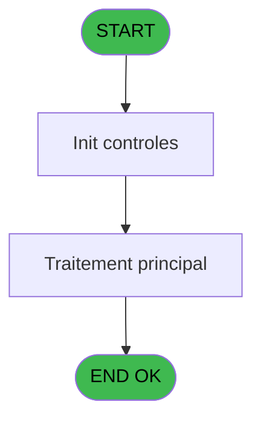

# PBP IDE 202 - imprime mini Club

> **Analyse**: Phases 1-4 2026-02-03 15:47 -> 15:47 (12s) | Assemblage 15:47
> **Pipeline**: V7.2 Enrichi
> **Structure**: 4 onglets (Resume | Ecrans | Donnees | Connexions)

<!-- TAB:Resume -->

## 1. FICHE D'IDENTITE

| Attribut | Valeur |
|----------|--------|
| Projet | PBP |
| IDE Position | 202 |
| Nom Programme | imprime mini Club |
| Fichier source | `Prg_202.xml` |
| Dossier IDE | Liste |
| Taches | 2 (1 ecrans visibles) |
| Tables modifiees | 0 |
| Programmes appeles | 0 |

## 2. DESCRIPTION FONCTIONNELLE

**imprime mini Club** assure la gestion complete de ce processus, accessible depuis [Liste mini Club (IDE 201)](PBP-IDE-201.md).

Le flux de traitement s'organise en **1 blocs fonctionnels** :

- **Traitement** (2 taches) : traitements metier divers

**Logique metier** : 5 regles identifiees couvrant conditions metier.

## 3. BLOCS FONCTIONNELS

### 3.1 Traitement (2 taches)

Traitements internes.

---

#### 202 - Veuillez patienter ... [[ECRAN]](#ecran-t1)

**Role** : Traitement : Veuillez patienter ....
**Ecran** : 426 x 58 DLU (MDI) | [Voir mockup](#ecran-t1)

---

#### 202.1 - Lignes supplementaires

**Role** : Traitement : Lignes supplementaires.
**Variables liees** : E (P. Lignes supplementaires)

## 5. REGLES METIER

5 regles identifiees:

### Autres (5 regles)

#### [RM-001] Si P. A(rrivants)/P(resents) [B]='P' alors 'O' sinon 'N')

| Element | Detail |
|---------|--------|
| **Condition** | `P. A(rrivants)/P(resents) [B]='P'` |
| **Si vrai** | 'O' |
| **Si faux** | 'N') |
| **Variables** | B (P. A(rrivants)/P(resents)) |
| **Expression source** | Expression 4 : `IF (P. A(rrivants)/P(resents) [B]='P','O','N')` |
| **Exemple** | Si P. A(rrivants)/P(resents) [B]='P' → 'O'. Sinon → 'N') |

#### [RM-002] Si P. A(rrivants)/P(resents) [B]='A' alors P. DateSelection [A] sinon '00/00/0000'DATE)

| Element | Detail |
|---------|--------|
| **Condition** | `P. A(rrivants)/P(resents) [B]='A'` |
| **Si vrai** | P. DateSelection [A] |
| **Si faux** | '00/00/0000'DATE) |
| **Variables** | A (P. DateSelection), B (P. A(rrivants)/P(resents)) |
| **Expression source** | Expression 5 : `IF (P. A(rrivants)/P(resents) [B]='A',P. DateSelection [A],'` |
| **Exemple** | Si P. A(rrivants)/P(resents) [B]='A' → P. DateSelection [A]. Sinon → '00/00/0000'DATE) |

#### [RM-003] Traitement conditionnel si [U],[Y],IF ([Z],IF ([BW]>0,[BW],0),IF ([T] est a zero

| Element | Detail |
|---------|--------|
| **Condition** | `[U]` |
| **Si vrai** | [Y] |
| **Si faux** | IF ([Z],IF ([BW]>0,[BW],0),IF ([T]=0,0,Year (P. DateSelection [A])-Year ([T])-IF (Month (P. DateSelection [A])>Month ([T]),1,0)))) |
| **Variables** | A (P. DateSelection) |
| **Expression source** | Expression 13 : `IF ([U],[Y],IF ([Z],IF ([BW]>0,[BW],0),IF ([T]=0,0,Year (P. ` |
| **Exemple** | Si [U] → [Y] |

#### [RM-004] Si P. O(rdre alpha)/A(ge) [G]='O' alors V_Prenom [L]&[S] sinon Str ([AI],'3P0')&V_Prenom [L]&[S])

| Element | Detail |
|---------|--------|
| **Condition** | `P. O(rdre alpha)/A(ge) [G]='O'` |
| **Si vrai** | V_Prenom [L]&[S] |
| **Si faux** | Str ([AI],'3P0')&V_Prenom [L]&[S]) |
| **Variables** | G (P. O(rdre alpha)/A(ge)), L (V_Prenom) |
| **Expression source** | Expression 14 : `IF (P. O(rdre alpha)/A(ge) [G]='O',V_Prenom [L]&[S],Str ([AI` |
| **Exemple** | Si P. O(rdre alpha)/A(ge) [G]='O' → V_Prenom [L]&[S]. Sinon → Str ([AI],'3P0')&V_Prenom [L]&[S]) |

#### [RM-005] Si [AK] alors '#3Z' sinon '#3')

| Element | Detail |
|---------|--------|
| **Condition** | `[AK]` |
| **Si vrai** | '#3Z' |
| **Si faux** | '#3') |
| **Expression source** | Expression 27 : `IF ([AK],'#3Z','#3')` |
| **Exemple** | Si [AK] → '#3Z'. Sinon → '#3') |

## 6. CONTEXTE

- **Appele par**: [Liste mini Club (IDE 201)](PBP-IDE-201.md)
- **Appelle**: 0 programmes | **Tables**: 4 (W:0 R:1 L:3) | **Taches**: 2 | **Expressions**: 28

<!-- TAB:Ecrans -->

## 8. ECRANS

### 8.1 Forms visibles (1 / 2)

| # | Position | Tache | Nom | Type | Largeur | Hauteur | Bloc |
|---|----------|-------|-----|------|---------|---------|------|
| 1 | 202 | 202 | Veuillez patienter ... | MDI | 426 | 58 | Traitement |

### 8.2 Mockups Ecrans

---

#### 202 - Veuillez patienter ...
**Tache** : [202](#t1) | **Type** : MDI | **Dimensions** : 426 x 58 DLU
**Bloc** : Traitement | **Titre IDE** : Veuillez patienter ...

<!-- FORM-DATA:
{
    "width":  426,
    "vFactor":  8,
    "type":  "MDI",
    "hFactor":  8,
    "controls":  [
                     {
                         "x":  0,
                         "type":  "label",
                         "var":  "",
                         "y":  0,
                         "w":  423,
                         "fmt":  "",
                         "name":  "",
                         "h":  29,
                         "color":  "",
                         "text":  "",
                         "parent":  null
                     },
                     {
                         "x":  120,
                         "type":  "label",
                         "var":  "",
                         "y":  10,
                         "w":  221,
                         "fmt":  "",
                         "name":  "",
                         "h":  8,
                         "color":  "7",
                         "text":  "Traitement en cours ...",
                         "parent":  null
                     },
                     {
                         "x":  0,
                         "type":  "label",
                         "var":  "",
                         "y":  29,
                         "w":  423,
                         "fmt":  "",
                         "name":  "",
                         "h":  27,
                         "color":  "",
                         "text":  "",
                         "parent":  null
                     },
                     {
                         "x":  72,
                         "type":  "label",
                         "var":  "",
                         "y":  38,
                         "w":  267,
                         "fmt":  "",
                         "name":  "",
                         "h":  8,
                         "color":  "",
                         "text":  "Impression en cours",
                         "parent":  null
                     },
                     {
                         "x":  4,
                         "type":  "image",
                         "var":  "",
                         "y":  2,
                         "w":  72,
                         "fmt":  "",
                         "name":  "",
                         "h":  25,
                         "color":  "",
                         "text":  "",
                         "parent":  null
                     }
                 ],
    "taskId":  "202",
    "height":  58
}
-->

## 9. NAVIGATION

Ecran unique: **Veuillez patienter ...**

### 9.3 Structure hierarchique (2 taches)

| Position | Tache | Type | Dimensions | Bloc |
|----------|-------|------|------------|------|
| **202.1** | [**Veuillez patienter ...** (202)](#t1) [mockup](#ecran-t1) | MDI | 426x58 | Traitement |
| 202.1.1 | [Lignes supplementaires (202.1)](#t2) | MDI | - | |

### 9.4 Algorigramme

> **Legende**: Vert = START/END OK | Rouge = END KO | Bleu = Decisions
> *Algorigramme auto-genere. Utiliser `/algorigramme` pour une synthese metier detaillee.*

<!-- TAB:Donnees -->

## 10. TABLES

### Tables utilisees (4)

| ID | Nom | Description | Type | R | W | L | Usages |
|----|-----|-------------|------|---|---|---|--------|
| 30 | gm-recherche_____gmr | Index de recherche | DB | R |   |   | 1 |
| 31 | gm-complet_______gmc |  | DB |   |   | L | 1 |
| 34 | hebergement______heb | Hebergement (chambres) | DB |   |   | L | 1 |
| 36 | client_gm |  | DB |   |   | L | 1 |

### Colonnes par table (3 / 1 tables avec colonnes identifiees)

Table 30 - gm-recherche_____gmr (R) - 1 usages

| Lettre | Variable | Acces | Type |
|--------|----------|-------|------|
| A | P. DateSelection | R | Date |
| B | P. A(rrivants)/P(resents) | R | Alpha |
| C | P. Tranche mini | R | Numeric |
| D | P. Tranche Maxi | R | Numeric |
| E | P. Lignes supplementaires | R | Numeric |
| F | P. E(dition)/H(tml) | R | Alpha |
| G | P. O(rdre alpha)/A(ge) | R | Alpha |
| H | V_TitreEdition | R | Alpha |
| I | T Client | R | Logical |
| J | T Hebergement | R | Logical |
| K | V_Nom | R | Alpha |
| L | V_Prenom | R | Alpha |
| M | V_Age | R | Numeric |
| N | V_Tri | R | Alpha |
| O | V_Non Edition 0 | R | Logical |

## 11. VARIABLES

### 11.1 Parametres entrants (7)

Variables recues du programme appelant ([Liste mini Club (IDE 201)](PBP-IDE-201.md)).

| Lettre | Nom | Type | Usage dans |
|--------|-----|------|-----------|
| A | P. DateSelection | Date | 5x parametre entrant |
| B | P. A(rrivants)/P(resents) | Alpha | 5x parametre entrant |
| C | P. Tranche mini | Numeric | 4x parametre entrant |
| D | P. Tranche Maxi | Numeric | 4x parametre entrant |
| E | P. Lignes supplementaires | Numeric | [202.1](#t2) |
| F | P. E(dition)/H(tml) | Alpha | 5x parametre entrant |
| G | P. O(rdre alpha)/A(ge) | Alpha | 1x parametre entrant |

### 11.2 Autres (8)

Variables diverses.

| Lettre | Nom | Type | Usage dans |
|--------|-----|------|-----------|
| H | V_TitreEdition | Alpha | - |
| I | T Client | Logical | 1x refs |
| J | T Hebergement | Logical | 1x refs |
| K | V_Nom | Alpha | 1x refs |
| L | V_Prenom | Alpha | 2x refs |
| M | V_Age | Numeric | - |
| N | V_Tri | Alpha | - |
| O | V_Non Edition 0 | Logical | - |

## 12. EXPRESSIONS

**28 / 28 expressions decodees (100%)**

### 12.1 Repartition par type

| Type | Expressions | Regles |
|------|-------------|--------|
| CONCATENATION | 6 | 5 |
| CONDITION | 8 | 4 |
| CONSTANTE | 4 | 0 |
| DATE | 1 | 0 |
| OTHER | 9 | 0 |

### 12.2 Expressions cles par type

#### CONCATENATION (6 expressions)

| Type | IDE | Expression | Regle |
|------|-----|------------|-------|
| CONCATENATION | 14 | `IF (P. O(rdre alpha)/A(ge) [G]='O',V_Prenom [L]&[S],Str ([AI],'3P0')&V_Prenom [L]&[S])` | [RM-004](#rm-RM-004) |
| CONCATENATION | 19 | `MlsTrans ('Liste mini Club'&' '&IF (P. A(rrivants)/P(resents) [B]='A','ARRIVANTS','PRESENTS')&' (age '&Trim (Str (P. Tranche mini [C],'2'))&' to '&Trim (Str (P. Tranche Maxi [D],'2'))&') '&MlsTrans ('le')&' '&DStr (P. DateSelection [A],'DD/MM/YYYY'))` | - |
| CONCATENATION | 25 | `MlsTrans (IF (P. A(rrivants)/P(resents) [B]='A','ARRIVANTS','PRESENTS'))&' (AGE '&Str (P. Tranche mini [C],'2')&' TO '&Str (P. Tranche Maxi [D],'2')&')'` | - |
| CONCATENATION | 17 | `MlsTrans ('Edition du')&' '&DStr (Date (),'DD/MM/YYYY')&' '&MlsTrans ('à')&' '&TStr (Time (),'HH:MM:SS')` | - |
| CONCATENATION | 18 | `'- '&Str (Page (0,1),'3P0Z0')&' -'` | - |
| ... | | *+1 autres* | |

#### CONDITION (8 expressions)

| Type | IDE | Expression | Regle |
|------|-----|------------|-------|
| CONDITION | 13 | `IF ([U],[Y],IF ([Z],IF ([BW]>0,[BW],0),IF ([T]=0,0,Year (P. DateSelection [A])-Year ([T])-IF (Month (P. DateSelection [A])>Month ([T]),1,0))))` | [RM-003](#rm-RM-003) |
| CONDITION | 27 | `IF ([AK],'#3Z','#3')` | [RM-005](#rm-RM-005) |
| CONDITION | 4 | `IF (P. A(rrivants)/P(resents) [B]='P','O','N')` | [RM-001](#rm-RM-001) |
| CONDITION | 5 | `IF (P. A(rrivants)/P(resents) [B]='A',P. DateSelection [A],'00/00/0000'DATE)` | [RM-002](#rm-RM-002) |
| CONDITION | 23 | `P. E(dition)/H(tml) [F]='H'` | - |
| ... | | *+3 autres* | |

#### CONSTANTE (4 expressions)

| Type | IDE | Expression | Regle |
|------|-----|------------|-------|
| CONSTANTE | 15 | `''` | - |
| CONSTANTE | 26 | `''` | - |
| CONSTANTE | 9 | `'H'` | - |
| CONSTANTE | 10 | `1` | - |

#### DATE (1 expressions)

| Type | IDE | Expression | Regle |
|------|-----|------------|-------|
| DATE | 24 | `Date ()` | - |

#### OTHER (9 expressions)

| Type | IDE | Expression | Regle |
|------|-----|------------|-------|
| OTHER | 12 | `[S]` | - |
| OTHER | 11 | `V_Prenom [L]` | - |
| OTHER | 21 | `Range ([AI],P. Tranche mini [C],P. Tranche Maxi [D])` | - |
| OTHER | 16 | `GetParam ('VILLAGE')` | - |
| OTHER | 8 | `V_Nom [K]` | - |
| ... | | *+4 autres* | |

### 12.3 Toutes les expressions (28)

Voir les 28 expressions

#### CONCATENATION (6)

| IDE | Expression Decodee |
|-----|-------------------|
| 18 | `'- '&Str (Page (0,1),'3P0Z0')&' -'` |
| 14 | `IF (P. O(rdre alpha)/A(ge) [G]='O',V_Prenom [L]&[S],Str ([AI],'3P0')&V_Prenom [L]&[S])` |
| 1 | `Trim (INIGet ('[MAGIC_LOGICAL_NAMES]club_exportdata')&'ListeminiClub'&P. A(rrivants)/P(resents) [B]&IF (P. E(dition)/H(tml) [F]='H','_'&Trim (Str (P. Tranche mini [C],'2'))&'to'&Trim (Str (P. Tranche Maxi [D],'2'))&'_'&DStr (P. DateSelection [A],'YYYYMMDD'),'')&'.htm')` |
| 17 | `MlsTrans ('Edition du')&' '&DStr (Date (),'DD/MM/YYYY')&' '&MlsTrans ('à')&' '&TStr (Time (),'HH:MM:SS')` |
| 19 | `MlsTrans ('Liste mini Club'&' '&IF (P. A(rrivants)/P(resents) [B]='A','ARRIVANTS','PRESENTS')&' (age '&Trim (Str (P. Tranche mini [C],'2'))&' to '&Trim (Str (P. Tranche Maxi [D],'2'))&') '&MlsTrans ('le')&' '&DStr (P. DateSelection [A],'DD/MM/YYYY'))` |
| 25 | `MlsTrans (IF (P. A(rrivants)/P(resents) [B]='A','ARRIVANTS','PRESENTS'))&' (AGE '&Str (P. Tranche mini [C],'2')&' TO '&Str (P. Tranche Maxi [D],'2')&')'` |

#### CONDITION (8)

| IDE | Expression Decodee |
|-----|-------------------|
| 4 | `IF (P. A(rrivants)/P(resents) [B]='P','O','N')` |
| 5 | `IF (P. A(rrivants)/P(resents) [B]='A',P. DateSelection [A],'00/00/0000'DATE)` |
| 13 | `IF ([U],[Y],IF ([Z],IF ([BW]>0,[BW],0),IF ([T]=0,0,Year (P. DateSelection [A])-Year ([T])-IF (Month (P. DateSelection [A])>Month ([T]),1,0))))` |
| 27 | `IF ([AK],'#3Z','#3')` |
| 20 | `INIGet ('[MAGIC_LOGICAL_NAMES]preview')='O' AND P. E(dition)/H(tml) [F]='E'` |
| 22 | `P. E(dition)/H(tml) [F]='E'` |
| 23 | `P. E(dition)/H(tml) [F]='H'` |
| 28 | `P. Lignes supplementaires [E]<>0 AND P. E(dition)/H(tml) [F]='E'` |

#### CONSTANTE (4)

| IDE | Expression Decodee |
|-----|-------------------|
| 9 | `'H'` |
| 10 | `1` |
| 15 | `''` |
| 26 | `''` |

#### DATE (1)

| IDE | Expression Decodee |
|-----|-------------------|
| 24 | `Date ()` |

#### OTHER (9)

| IDE | Expression Decodee |
|-----|-------------------|
| 2 | `GetParam('SOCIETE')` |
| 3 | `T Client [I]` |
| 6 | `P. DateSelection [A]` |
| 7 | `T Hebergement [J]` |
| 8 | `V_Nom [K]` |
| 11 | `V_Prenom [L]` |
| 12 | `[S]` |
| 16 | `GetParam ('VILLAGE')` |
| 21 | `Range ([AI],P. Tranche mini [C],P. Tranche Maxi [D])` |

<!-- TAB:Connexions -->

## 13. GRAPHE D'APPELS

### 13.1 Chaine depuis Main (Callers)

Main -> ... -> [Liste mini Club (IDE 201)](PBP-IDE-201.md) -> **imprime mini Club (IDE 202)**

### 13.2 Callers

| IDE | Nom Programme | Nb Appels |
|-----|---------------|-----------|
| [201](PBP-IDE-201.md) | Liste mini Club | 4 |

### 13.3 Callees (programmes appeles)

### 13.4 Detail Callees avec contexte

| IDE | Nom Programme | Appels | Contexte |
|-----|---------------|--------|----------|
| - | (aucun) | - | - |

## 14. RECOMMANDATIONS MIGRATION

### 14.1 Profil du programme

| Metrique | Valeur | Impact migration |
|----------|--------|-----------------|
| Lignes de logique | 65 | Programme compact |
| Expressions | 28 | Peu de logique |
| Tables WRITE | 0 | Impact faible |
| Sous-programmes | 0 | Peu de dependances |
| Ecrans visibles | 1 | Ecran unique ou traitement batch |
| Code desactive | 0% (0 / 65) | Code sain |
| Regles metier | 5 | Quelques regles a preserver |

### 14.2 Plan de migration par bloc

#### Traitement (2 taches: 1 ecran, 1 traitement)

- **Strategie** : Orchestrateur avec 1 ecrans (Razor/React) et 1 traitements backend (services).
- Les ecrans deviennent des composants UI, les traitements invisibles deviennent des services injectables.
- Decomposer les taches en services unitaires testables.

### 14.3 Dependances critiques

| Dependance | Type | Appels | Impact |
|------------|------|--------|--------|

---
*Spec DETAILED generee par Pipeline V7.2 - 2026-02-03 15:47*
