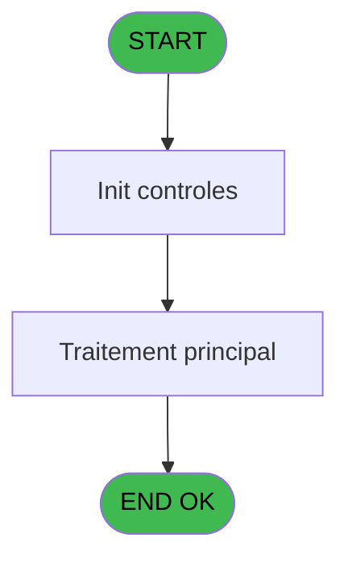

# PBP IDE 203 - Extraction Arr / Dep

> **Analyse**: Phases 1-4 2026-02-03 15:47 -> 15:48 (13s) | Assemblage 15:48
> **Pipeline**: V7.2 Enrichi
> **Structure**: 4 onglets (Resume | Ecrans | Donnees | Connexions)

<!-- TAB:Resume -->

## 1. FICHE D'IDENTITE

| Attribut | Valeur |
|----------|--------|
| Projet | PBP |
| IDE Position | 203 |
| Nom Programme | Extraction Arr / Dep |
| Fichier source | `Prg_203.xml` |
| Dossier IDE | Liste |
| Taches | 2 (1 ecrans visibles) |
| Tables modifiees | 0 |
| Programmes appeles | 0 |
| :warning: Statut | **ORPHELIN_POTENTIEL** |

## 2. DESCRIPTION FONCTIONNELLE

**Extraction Arr / Dep** assure la gestion complete de ce processus.

Le flux de traitement s'organise en **1 blocs fonctionnels** :

- **Traitement** (2 taches) : traitements metier divers

## 3. BLOCS FONCTIONNELS

### 3.1 Traitement (2 taches)

Traitements internes.

---

#### 203 - Extraction Arrivées / Départs [[ECRAN]](#ecran-t1)

**Role** : Traitement : Extraction Arrivées / Départs.
**Ecran** : 558 x 160 DLU (MDI) | [Voir mockup](#ecran-t1)

---

#### 203.1 - Count

**Role** : Traitement : Count.

## 5. REGLES METIER

*(Aucune regle metier identifiee)*

## 6. CONTEXTE

- **Appele par**: (aucun)
- **Appelle**: 0 programmes | **Tables**: 10 (W:0 R:1 L:9) | **Taches**: 2 | **Expressions**: 14

<!-- TAB:Ecrans -->

## 8. ECRANS

### 8.1 Forms visibles (1 / 2)

| # | Position | Tache | Nom | Type | Largeur | Hauteur | Bloc |
|---|----------|-------|-----|------|---------|---------|------|
| 1 | 203 | 203 | Extraction Arrivées / Départs | MDI | 558 | 160 | Traitement |

### 8.2 Mockups Ecrans

---

#### 203 - Extraction Arrivées / Départs
**Tache** : [203](#t1) | **Type** : MDI | **Dimensions** : 558 x 160 DLU
**Bloc** : Traitement | **Titre IDE** : Extraction Arrivées / Départs

<!-- FORM-DATA:
{
    "width":  558,
    "vFactor":  8,
    "type":  "MDI",
    "hFactor":  8,
    "controls":  [
                     {
                         "x":  0,
                         "type":  "label",
                         "var":  "",
                         "y":  0,
                         "w":  556,
                         "fmt":  "",
                         "name":  "",
                         "h":  24,
                         "color":  "",
                         "text":  "",
                         "parent":  null
                     },
                     {
                         "x":  52,
                         "type":  "label",
                         "var":  "",
                         "y":  24,
                         "w":  268,
                         "fmt":  "",
                         "name":  "",
                         "h":  103,
                         "color":  "",
                         "text":  "",
                         "parent":  null
                     },
                     {
                         "x":  320,
                         "type":  "label",
                         "var":  "",
                         "y":  24,
                         "w":  186,
                         "fmt":  "",
                         "name":  "",
                         "h":  103,
                         "color":  "",
                         "text":  "",
                         "parent":  null
                     },
                     {
                         "x":  62,
                         "type":  "label",
                         "var":  "",
                         "y":  30,
                         "w":  46,
                         "fmt":  "",
                         "name":  "",
                         "h":  8,
                         "color":  "",
                         "text":  "Du",
                         "parent":  5
                     },
                     {
                         "x":  62,
                         "type":  "label",
                         "var":  "",
                         "y":  49,
                         "w":  45,
                         "fmt":  "",
                         "name":  "",
                         "h":  8,
                         "color":  "",
                         "text":  "Au",
                         "parent":  5
                     },
                     {
                         "x":  78,
                         "type":  "label",
                         "var":  "",
                         "y":  113,
                         "w":  86,
                         "fmt":  "",
                         "name":  "",
                         "h":  8,
                         "color":  "",
                         "text":  "Sélections",
                         "parent":  5
                     },
                     {
                         "x":  0,
                         "type":  "label",
                         "var":  "",
                         "y":  134,
                         "w":  556,
                         "fmt":  "",
                         "name":  "",
                         "h":  24,
                         "color":  "",
                         "text":  "",
                         "parent":  null
                     },
                     {
                         "x":  131,
                         "type":  "edit",
                         "var":  "",
                         "y":  30,
                         "w":  126,
                         "fmt":  "DD/MM/YYYY",
                         "name":  "w0_DateMin",
                         "h":  10,
                         "color":  "110",
                         "text":  "",
                         "parent":  5
                     },
                     {
                         "x":  267,
                         "type":  "button",
                         "var":  "",
                         "y":  30,
                         "w":  33,
                         "fmt":  "...",
                         "name":  "b_DateMin",
                         "h":  10,
                         "color":  "",
                         "text":  "",
                         "parent":  5
                     },
                     {
                         "x":  131,
                         "type":  "edit",
                         "var":  "",
                         "y":  49,
                         "w":  126,
                         "fmt":  "DD/MM/YYYY",
                         "name":  "w0_DateMax",
                         "h":  10,
                         "color":  "110",
                         "text":  "",
                         "parent":  5
                     },
                     {
                         "x":  267,
                         "type":  "button",
                         "var":  "",
                         "y":  49,
                         "w":  33,
                         "fmt":  "...",
                         "name":  "b_DateMax",
                         "h":  10,
                         "color":  "",
                         "text":  "",
                         "parent":  5
                     },
                     {
                         "x":  70,
                         "type":  "radio",
                         "var":  "",
                         "y":  75,
                         "w":  234,
                         "fmt":  "",
                         "name":  "w0_Sens",
                         "h":  17,
                         "color":  "",
                         "text":  "",
                         "parent":  5
                     },
                     {
                         "x":  198,
                         "type":  "edit",
                         "var":  "",
                         "y":  113,
                         "w":  56,
                         "fmt":  "",
                         "name":  "w0_NbSelect",
                         "h":  9,
                         "color":  "",
                         "text":  "",
                         "parent":  5
                     },
                     {
                         "x":  338,
                         "type":  "button",
                         "var":  "",
                         "y":  105,
                         "w":  154,
                         "fmt":  "\u0026Extraction",
                         "name":  "b_Extraire",
                         "h":  18,
                         "color":  "",
                         "text":  "",
                         "parent":  6
                     },
                     {
                         "x":  8,
                         "type":  "edit",
                         "var":  "",
                         "y":  2,
                         "w":  267,
                         "fmt":  "20",
                         "name":  "",
                         "h":  8,
                         "color":  "",
                         "text":  "",
                         "parent":  1
                     },
                     {
                         "x":  340,
                         "type":  "edit",
                         "var":  "",
                         "y":  8,
                         "w":  203,
                         "fmt":  "WWW DD MMM YYYYT",
                         "name":  "",
                         "h":  8,
                         "color":  "",
                         "text":  "",
                         "parent":  1
                     },
                     {
                         "x":  8,
                         "type":  "edit",
                         "var":  "",
                         "y":  12,
                         "w":  331,
                         "fmt":  "25",
                         "name":  "",
                         "h":  8,
                         "color":  "",
                         "text":  "",
                         "parent":  1
                     },
                     {
                         "x":  357,
                         "type":  "image",
                         "var":  "",
                         "y":  29,
                         "w":  128,
                         "fmt":  "",
                         "name":  "",
                         "h":  56,
                         "color":  "",
                         "text":  "",
                         "parent":  6
                     },
                     {
                         "x":  9,
                         "type":  "button",
                         "var":  "",
                         "y":  137,
                         "w":  154,
                         "fmt":  "\u0026Quitter",
                         "name":  "",
                         "h":  18,
                         "color":  "",
                         "text":  "",
                         "parent":  14
                     }
                 ],
    "taskId":  "203",
    "height":  160
}
-->

<strong>Champs : 6 champs</strong>

| Pos (x,y) | Nom | Variable | Type |
|-----------|-----|----------|------|
| 131,30 | w0_DateMin | - | edit |
| 131,49 | w0_DateMax | - | edit |
| 198,113 | w0_NbSelect | - | edit |
| 8,2 | 20 | - | edit |
| 340,8 | WWW DD MMM YYYYT | - | edit |
| 8,12 | 25 | - | edit |

<strong>Boutons : 4 boutons</strong>

| Bouton | Pos (x,y) | Action |
|--------|-----------|--------|
| ... | 267,30 | Bouton fonctionnel |
| ... | 267,49 | Bouton fonctionnel |
| Extraction | 338,105 | Bouton fonctionnel |
| Quitter | 9,137 | Quitte le programme |

## 9. NAVIGATION

Ecran unique: **Extraction Arrivées / Départs**

### 9.3 Structure hierarchique (2 taches)

| Position | Tache | Type | Dimensions | Bloc |
|----------|-------|------|------------|------|
| **203.1** | [**Extraction Arrivées / Départs** (203)](#t1) [mockup](#ecran-t1) | MDI | 558x160 | Traitement |
| 203.1.1 | [Count (203.1)](#t2) | MDI | - | |

### 9.4 Algorigramme

> **Legende**: Vert = START/END OK | Rouge = END KO | Bleu = Decisions
> *Algorigramme auto-genere. Utiliser `/algorigramme` pour une synthese metier detaillee.*

<!-- TAB:Donnees -->

## 10. TABLES

### Tables utilisees (10)

| ID | Nom | Description | Type | R | W | L | Usages |
|----|-----|-------------|------|---|---|---|--------|
| 29 | voyages__________voy |  | DB | R |   |   | 1 |
| 31 | gm-complet_______gmc |  | DB |   |   | L | 1 |
| 34 | hebergement______heb | Hebergement (chambres) | DB |   |   | L | 1 |
| 132 | code_vol_________vot |  | DB |   |   | L | 1 |
| 167 | troncon__________tro |  | DB |   |   | L | 1 |
| 285 | email |  | DB |   |   | L | 1 |
| 358 | import_mod |  | DB |   |   | L | 1 |
| 473 | comptage_caisse | Sessions de caisse | TMP |   |   | L | 1 |
| 738 | pv_selling_unit |  | DB |   |   | L | 1 |
| 845 | stat_vendeur_date |  | TMP |   |   | L | 1 |

### Colonnes par table (2 / 1 tables avec colonnes identifiees)

Table 29 - voyages__________voy (R) - 1 usages

| Lettre | Variable | Acces | Type |
|--------|----------|-------|------|
| A | v.Retour Transfert | R | Logical |
| B | v.Retour Package | R | Logical |
| C | v.retour millesia | R | Logical |
| D | V.Libelle fidelisation | R | Alpha |
| E | Ligne Export | R | Alpha |

## 11. VARIABLES

### 11.1 Autres (7)

Variables diverses.

| Lettre | Nom | Type | Usage dans |
|--------|-----|------|-----------|
| A | w0_DateMin | Date | - |
| B | b_DateMin | Alpha | 3x refs |
| C | w0_DateMax | Date | - |
| D | b_DateMax | Alpha | 2x refs |
| E | w0_NbSelect | Numeric | - |
| F | w0_Sens | Alpha | 2x refs |
| G | b_Extraire | Alpha | - |

## 12. EXPRESSIONS

**14 / 14 expressions decodees (100%)**

### 12.1 Repartition par type

| Type | Expressions | Regles |
|------|-------------|--------|
| CONSTANTE | 4 | 0 |
| DATE | 1 | 0 |
| FORMAT | 1 | 0 |
| OTHER | 4 | 0 |
| REFERENCE_VG | 1 | 0 |
| CONDITION | 3 | 0 |

### 12.2 Expressions cles par type

#### CONSTANTE (4 expressions)

| Type | IDE | Expression | Regle |
|------|-----|------------|-------|
| CONSTANTE | 6 | `'&Imprimer'` | - |
| CONSTANTE | 12 | `0` | - |
| CONSTANTE | 2 | `'A'` | - |
| CONSTANTE | 5 | `'...'` | - |

#### DATE (1 expressions)

| Type | IDE | Expression | Regle |
|------|-----|------------|-------|
| DATE | 1 | `Date ()` | - |

#### FORMAT (1 expressions)

| Type | IDE | Expression | Regle |
|------|-----|------------|-------|
| FORMAT | 14 | `Translate('%club_exportdata%')&IF([Q]='A','Arr_','Dep_')&DStr(b_DateMin [B],'YYYYMMDD')&'_'&DStr(b_DateMax [D],'YYYYMMDD')&'.csv'` | - |

#### OTHER (4 expressions)

| Type | IDE | Expression | Regle |
|------|-----|------------|-------|
| OTHER | 8 | `b_DateMin [B]` | - |
| OTHER | 9 | `GetParam ('VILLAGE')` | - |
| OTHER | 3 | `SetCrsr (2)` | - |
| OTHER | 4 | `SetCrsr (1)` | - |

#### REFERENCE_VG (1 expressions)

| Type | IDE | Expression | Regle |
|------|-----|------------|-------|
| REFERENCE_VG | 7 | `VG2` | - |

#### CONDITION (3 expressions)

| Type | IDE | Expression | Regle |
|------|-----|------------|-------|
| CONDITION | 13 | `b_DateMin [B]>b_DateMax [D]` | - |
| CONDITION | 11 | `w0_Sens [F]>0` | - |
| CONDITION | 10 | `w0_Sens [F]=0` | - |

<!-- TAB:Connexions -->

## 13. GRAPHE D'APPELS

### 13.1 Chaine depuis Main (Callers)

**Chemin**: (pas de callers directs)

### 13.2 Callers

| IDE | Nom Programme | Nb Appels |
|-----|---------------|-----------|
| - | (aucun) | - |

### 13.3 Callees (programmes appeles)

### 13.4 Detail Callees avec contexte

| IDE | Nom Programme | Appels | Contexte |
|-----|---------------|--------|----------|
| - | (aucun) | - | - |

## 14. RECOMMANDATIONS MIGRATION

### 14.1 Profil du programme

| Metrique | Valeur | Impact migration |
|----------|--------|-----------------|
| Lignes de logique | 169 | Programme compact |
| Expressions | 14 | Peu de logique |
| Tables WRITE | 0 | Impact faible |
| Sous-programmes | 0 | Peu de dependances |
| Ecrans visibles | 1 | Ecran unique ou traitement batch |
| Code desactive | 0% (0 / 169) | Code sain |
| Regles metier | 0 | Pas de regle identifiee |

### 14.2 Plan de migration par bloc

#### Traitement (2 taches: 1 ecran, 1 traitement)

- **Strategie** : Orchestrateur avec 1 ecrans (Razor/React) et 1 traitements backend (services).
- Les ecrans deviennent des composants UI, les traitements invisibles deviennent des services injectables.
- Decomposer les taches en services unitaires testables.

### 14.3 Dependances critiques

| Dependance | Type | Appels | Impact |
|------------|------|--------|--------|

---
*Spec DETAILED generee par Pipeline V7.2 - 2026-02-03 15:48*
