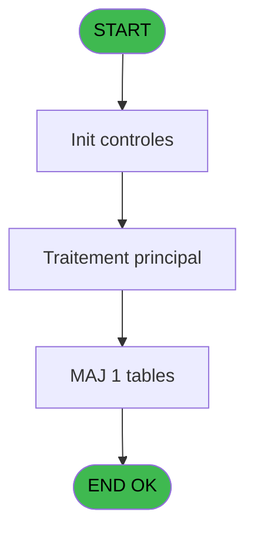
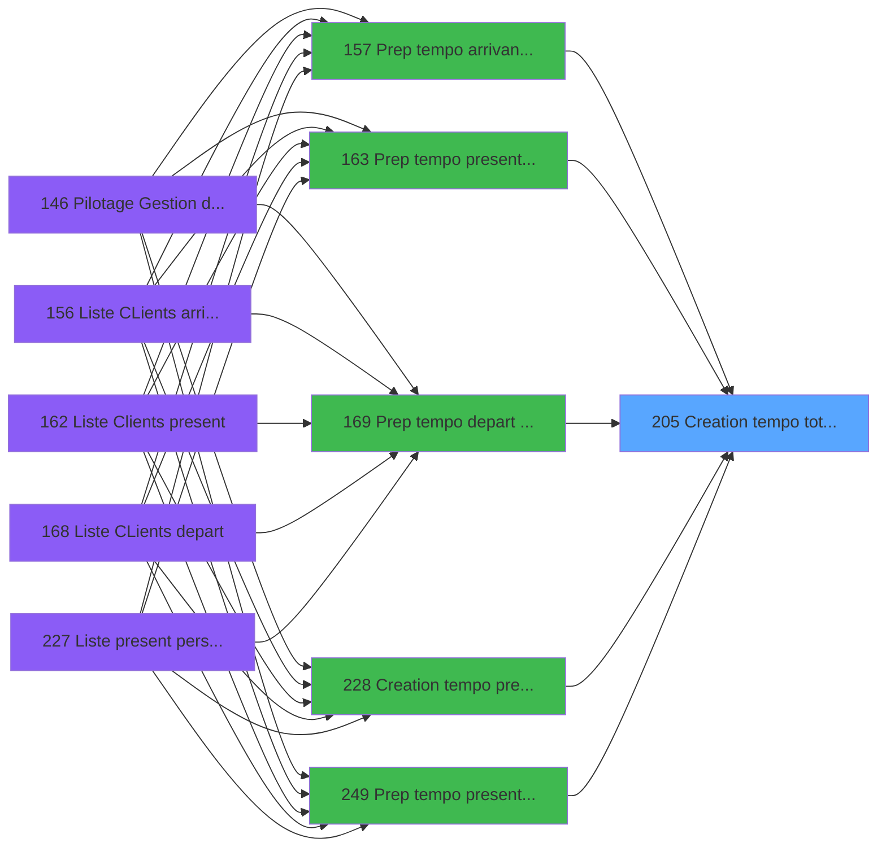

# PBP IDE 205 - Creation tempo total qualite

> **Analyse**: Phases 1-4 2026-02-03 15:48 -> 15:48 (12s) | Assemblage 15:48
> **Pipeline**: V7.2 Enrichi
> **Structure**: 4 onglets (Resume | Ecrans | Donnees | Connexions)

<!-- TAB:Resume -->

## 1. FICHE D'IDENTITE

| Attribut | Valeur |
|----------|--------|
| Projet | PBP |
| IDE Position | 205 |
| Nom Programme | Creation tempo total qualite |
| Fichier source | `Prg_205.xml` |
| Dossier IDE | Liste |
| Taches | 2 (0 ecrans visibles) |
| Tables modifiees | 1 |
| Programmes appeles | 0 |

## 2. DESCRIPTION FONCTIONNELLE

**Creation tempo total qualite** assure la gestion complete de ce processus, accessible depuis [  Prep tempo arrivant planning (IDE 157)](PBP-IDE-157.md), [  Prep tempo present planning (IDE 163)](PBP-IDE-163.md), [  Prep tempo depart comptage (IDE 169)](PBP-IDE-169.md), [  Creation tempo pres plan GO (IDE 228)](PBP-IDE-228.md), [Prep tempo present planning CL (IDE 249)](PBP-IDE-249.md), [Prepa tempo toutes GM CP SQL (IDE 327)](PBP-IDE-327.md).

Le flux de traitement s'organise en **2 blocs fonctionnels** :

- **Calcul** (1 tache) : calculs de montants, stocks ou compteurs
- **Creation** (1 tache) : insertion d'enregistrements en base (mouvements, prestations)

**Donnees modifiees** : 1 tables en ecriture (tempo_ecr_previsions).

Detail : phases du traitement

#### Phase 1 : Creation (1 tache)

- **205** - Creation tempo total qualite

#### Phase 2 : Calcul (1 tache)

- **205.1** - Compte qualité

#### Tables impactees

| Table | Operations | Role metier |
|-------|-----------|-------------|
| tempo_ecr_previsions | **W** (1 usages) | Table temporaire ecran |

## 3. BLOCS FONCTIONNELS

### 3.1 Creation (1 tache)

Insertion de nouveaux enregistrements en base.

---

#### 205 - Creation tempo total qualite

**Role** : Creation d'enregistrement : Creation tempo total qualite.

### 3.2 Calcul (1 tache)

Calculs metier : montants, stocks, compteurs.

---

#### 205.1 - Compte qualité

**Role** : Traitement : Compte qualité.

## 5. REGLES METIER

*(Aucune regle metier identifiee)*

## 6. CONTEXTE

- **Appele par**: [  Prep tempo arrivant planning (IDE 157)](PBP-IDE-157.md), [  Prep tempo present planning (IDE 163)](PBP-IDE-163.md), [  Prep tempo depart comptage (IDE 169)](PBP-IDE-169.md), [  Creation tempo pres plan GO (IDE 228)](PBP-IDE-228.md), [Prep tempo present planning CL (IDE 249)](PBP-IDE-249.md), [Prepa tempo toutes GM CP SQL (IDE 327)](PBP-IDE-327.md)
- **Appelle**: 0 programmes | **Tables**: 2 (W:1 R:1 L:0) | **Taches**: 2 | **Expressions**: 5

<!-- TAB:Ecrans -->

## 8. ECRANS

*(Programme sans ecran visible)*

## 9. NAVIGATION

### 9.3 Structure hierarchique (2 taches)

| Position | Tache | Type | Dimensions | Bloc |
|----------|-------|------|------------|------|
| **205.1** | [**Creation tempo total qualite** (205)](#t1) | - | - | Creation |
| **205.2** | [**Compte qualité** (205.1)](#t2) | - | - | Calcul |

### 9.4 Algorigramme

> **Legende**: Vert = START/END OK | Rouge = END KO | Bleu = Decisions
> *Algorigramme auto-genere. Utiliser `/algorigramme` pour une synthese metier detaillee.*

<!-- TAB:Donnees -->

## 10. TABLES

### Tables utilisees (2)

| ID | Nom | Description | Type | R | W | L | Usages |
|----|-----|-------------|------|---|---|---|--------|
| 598 | tempo_ecr_previsions | Table temporaire ecran | TMP |   | **W** |   | 1 |
| 619 | tempo_userlist | Table temporaire ecran | TMP | R |   |   | 1 |

### Colonnes par table (0 / 2 tables avec colonnes identifiees)

Table 598 - tempo_ecr_previsions (**W**) - 1 usages

*Table utilisee uniquement en Link ou aucune colonne Real identifiee dans le DataView.*

Table 619 - tempo_userlist (R) - 1 usages

*Table utilisee uniquement en Link ou aucune colonne Real identifiee dans le DataView.*

## 11. VARIABLES

*(Programme sans variables locales mappees)*

## 12. EXPRESSIONS

**5 / 5 expressions decodees (100%)**

### 12.1 Repartition par type

| Type | Expressions | Regles |
|------|-------------|--------|
| CALCULATION | 2 | 0 |
| OTHER | 1 | 0 |
| REFERENCE_VG | 1 | 0 |
| CONDITION | 1 | 0 |

### 12.2 Expressions cles par type

#### CALCULATION (2 expressions)

| Type | IDE | Expression | Regle |
|------|-----|------------|-------|
| CALCULATION | 4 | `{1,5}+1` | - |
| CALCULATION | 3 | `Trim(MID({1,2},4,Len(Trim({1,2}))-3))` | - |

#### OTHER (1 expressions)

| Type | IDE | Expression | Regle |
|------|-----|------------|-------|
| OTHER | 1 | `GetParam('SOCIETE')` | - |

#### REFERENCE_VG (1 expressions)

| Type | IDE | Expression | Regle |
|------|-----|------------|-------|
| REFERENCE_VG | 2 | `VG1` | - |

#### CONDITION (1 expressions)

| Type | IDE | Expression | Regle |
|------|-----|------------|-------|
| CONDITION | 5 | `[F]<>'Abs'` | - |

<!-- TAB:Connexions -->

## 13. GRAPHE D'APPELS

### 13.1 Chaine depuis Main (Callers)

Main -> ... -> [  Prep tempo arrivant planning (IDE 157)](PBP-IDE-157.md) -> **Creation tempo total qualite (IDE 205)**

Main -> ... -> [  Prep tempo present planning (IDE 163)](PBP-IDE-163.md) -> **Creation tempo total qualite (IDE 205)**

Main -> ... -> [  Prep tempo depart comptage (IDE 169)](PBP-IDE-169.md) -> **Creation tempo total qualite (IDE 205)**

Main -> ... -> [  Creation tempo pres plan GO (IDE 228)](PBP-IDE-228.md) -> **Creation tempo total qualite (IDE 205)**

Main -> ... -> [Prep tempo present planning CL (IDE 249)](PBP-IDE-249.md) -> **Creation tempo total qualite (IDE 205)**

Main -> ... -> [Prepa tempo toutes GM CP SQL (IDE 327)](PBP-IDE-327.md) -> **Creation tempo total qualite (IDE 205)**

### 13.2 Callers

| IDE | Nom Programme | Nb Appels |
|-----|---------------|-----------|
| [157](PBP-IDE-157.md) |   Prep tempo arrivant planning | 1 |
| [163](PBP-IDE-163.md) |   Prep tempo present planning | 1 |
| [169](PBP-IDE-169.md) |   Prep tempo depart comptage | 1 |
| [228](PBP-IDE-228.md) |   Creation tempo pres plan GO | 1 |
| [249](PBP-IDE-249.md) | Prep tempo present planning CL | 1 |
| [327](PBP-IDE-327.md) | Prepa tempo toutes GM CP SQL | 1 |

### 13.3 Callees (programmes appeles)

### 13.4 Detail Callees avec contexte

| IDE | Nom Programme | Appels | Contexte |
|-----|---------------|--------|----------|
| - | (aucun) | - | - |

## 14. RECOMMANDATIONS MIGRATION

### 14.1 Profil du programme

| Metrique | Valeur | Impact migration |
|----------|--------|-----------------|
| Lignes de logique | 12 | Programme compact |
| Expressions | 5 | Peu de logique |
| Tables WRITE | 1 | Impact faible |
| Sous-programmes | 0 | Peu de dependances |
| Ecrans visibles | 0 | Ecran unique ou traitement batch |
| Code desactive | 0% (0 / 12) | Code sain |
| Regles metier | 0 | Pas de regle identifiee |

### 14.2 Plan de migration par bloc

#### Creation (1 tache: 0 ecran, 1 traitement)

- **Strategie** : Repository pattern avec Entity Framework Core.
- Insertion via `IRepository<T>.CreateAsync()`

#### Calcul (1 tache: 0 ecran, 1 traitement)

- **Strategie** : Services de calcul purs (Domain Services).
- Migrer la logique de calcul (stock, compteurs, montants)

### 14.3 Dependances critiques

| Dependance | Type | Appels | Impact |
|------------|------|--------|--------|
| tempo_ecr_previsions | Table WRITE (Temp) | 1x | Schema + repository |

---
*Spec DETAILED generee par Pipeline V7.2 - 2026-02-03 15:48*
