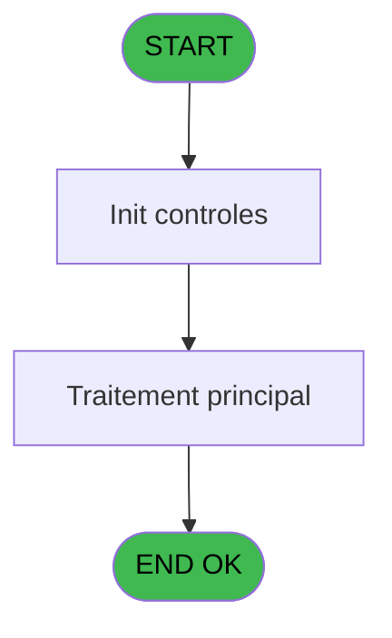

# PBP IDE 207 - Liste des Easy Chek-Out

> **Analyse**: Phases 1-4 2026-02-03 15:49 -> 15:49 (12s) | Assemblage 15:49
> **Pipeline**: V7.2 Enrichi
> **Structure**: 4 onglets (Resume | Ecrans | Donnees | Connexions)

<!-- TAB:Resume -->

## 1. FICHE D'IDENTITE

| Attribut | Valeur |
|----------|--------|
| Projet | PBP |
| IDE Position | 207 |
| Nom Programme | Liste des Easy Chek-Out |
| Fichier source | `Prg_207.xml` |
| Dossier IDE | Liste |
| Taches | 3 (1 ecrans visibles) |
| Tables modifiees | 0 |
| Programmes appeles | 0 |
| :warning: Statut | **ORPHELIN_POTENTIEL** |

## 2. DESCRIPTION FONCTIONNELLE

**Liste des Easy Chek-Out** assure la gestion complete de ce processus.

Le flux de traitement s'organise en **2 blocs fonctionnels** :

- **Impression** (2 taches) : generation de tickets et documents
- **Traitement** (1 tache) : traitements metier divers

Detail : phases du traitement

#### Phase 1 : Traitement (1 tache)

- **207** - Liste des Easy Check-Out **[[ECRAN]](#ecran-t1)**

#### Phase 2 : Impression (2 taches)

- **207.1** - Edition
- **207.2** - Edition

## 3. BLOCS FONCTIONNELS

### 3.1 Traitement (1 tache)

Traitements internes.

---

#### 207 - Liste des Easy Check-Out [[ECRAN]](#ecran-t1)

**Role** : Traitement : Liste des Easy Check-Out.
**Ecran** : 605 x 183 DLU (MDI) | [Voir mockup](#ecran-t1)

### 3.2 Impression (2 taches)

Generation des documents et tickets.

---

#### 207.1 - Edition

**Role** : Generation du document : Edition.

---

#### 207.2 - Edition

**Role** : Generation du document : Edition.

## 5. REGLES METIER

*(Aucune regle metier identifiee)*

## 6. CONTEXTE

- **Appele par**: (aucun)
- **Appelle**: 0 programmes | **Tables**: 0 (W:0 R:0 L:0) | **Taches**: 3 | **Expressions**: 26

<!-- TAB:Ecrans -->

## 8. ECRANS

### 8.1 Forms visibles (1 / 3)

| # | Position | Tache | Nom | Type | Largeur | Hauteur | Bloc |
|---|----------|-------|-----|------|---------|---------|------|
| 1 | 207 | 207 | Liste des Easy Check-Out | MDI | 605 | 183 | Traitement |

### 8.2 Mockups Ecrans

---

#### 207 - Liste des Easy Check-Out
**Tache** : [207](#t1) | **Type** : MDI | **Dimensions** : 605 x 183 DLU
**Bloc** : Traitement | **Titre IDE** : Liste des Easy Check-Out

<!-- FORM-DATA:
{
    "width":  605,
    "vFactor":  8,
    "type":  "MDI",
    "hFactor":  8,
    "controls":  [
                     {
                         "x":  0,
                         "type":  "label",
                         "var":  "",
                         "y":  0,
                         "w":  593,
                         "fmt":  "",
                         "name":  "",
                         "h":  19,
                         "color":  "",
                         "text":  "",
                         "parent":  null
                     },
                     {
                         "x":  4,
                         "type":  "label",
                         "var":  "",
                         "y":  156,
                         "w":  593,
                         "fmt":  "",
                         "name":  "",
                         "h":  24,
                         "color":  "",
                         "text":  "",
                         "parent":  null
                     },
                     {
                         "x":  40,
                         "type":  "label",
                         "var":  "",
                         "y":  24,
                         "w":  330,
                         "fmt":  "",
                         "name":  "",
                         "h":  127,
                         "color":  "",
                         "text":  "",
                         "parent":  null
                     },
                     {
                         "x":  104,
                         "type":  "label",
                         "var":  "",
                         "y":  40,
                         "w":  30,
                         "fmt":  "",
                         "name":  "",
                         "h":  10,
                         "color":  "",
                         "text":  "Le",
                         "parent":  6
                     },
                     {
                         "x":  45,
                         "type":  "line",
                         "var":  "",
                         "y":  62,
                         "w":  323,
                         "fmt":  "",
                         "name":  "",
                         "h":  0,
                         "color":  "",
                         "text":  "",
                         "parent":  6
                     },
                     {
                         "x":  47,
                         "type":  "line",
                         "var":  "",
                         "y":  121,
                         "w":  323,
                         "fmt":  "",
                         "name":  "",
                         "h":  0,
                         "color":  "",
                         "text":  "",
                         "parent":  6
                     },
                     {
                         "x":  105,
                         "type":  "label",
                         "var":  "",
                         "y":  133,
                         "w":  116,
                         "fmt":  "",
                         "name":  "",
                         "h":  9,
                         "color":  "",
                         "text":  "Sélections",
                         "parent":  6
                     },
                     {
                         "x":  378,
                         "type":  "label",
                         "var":  "",
                         "y":  24,
                         "w":  186,
                         "fmt":  "",
                         "name":  "",
                         "h":  127,
                         "color":  "",
                         "text":  "",
                         "parent":  null
                     },
                     {
                         "x":  141,
                         "type":  "edit",
                         "var":  "",
                         "y":  40,
                         "w":  126,
                         "fmt":  "DD/MM/YYYY",
                         "name":  "w0_Date",
                         "h":  10,
                         "color":  "110",
                         "text":  "",
                         "parent":  6
                     },
                     {
                         "x":  269,
                         "type":  "button",
                         "var":  "",
                         "y":  40,
                         "w":  27,
                         "fmt":  "...",
                         "name":  "b_Date",
                         "h":  10,
                         "color":  "",
                         "text":  "",
                         "parent":  6
                     },
                     {
                         "x":  66,
                         "type":  "radio",
                         "var":  "",
                         "y":  67,
                         "w":  291,
                         "fmt":  "",
                         "name":  "w0_choix",
                         "h":  50,
                         "color":  "",
                         "text":  "A,B,C",
                         "parent":  6
                     },
                     {
                         "x":  241,
                         "type":  "edit",
                         "var":  "",
                         "y":  133,
                         "w":  56,
                         "fmt":  "",
                         "name":  "",
                         "h":  9,
                         "color":  "",
                         "text":  "",
                         "parent":  6
                     },
                     {
                         "x":  394,
                         "type":  "button",
                         "var":  "",
                         "y":  88,
                         "w":  154,
                         "fmt":  "\u0026Ecran",
                         "name":  "b_Ecran",
                         "h":  18,
                         "color":  "",
                         "text":  "",
                         "parent":  17
                     },
                     {
                         "x":  394,
                         "type":  "button",
                         "var":  "",
                         "y":  108,
                         "w":  154,
                         "fmt":  "\u0026Impression",
                         "name":  "b_Imprimer",
                         "h":  18,
                         "color":  "",
                         "text":  "",
                         "parent":  17
                     },
                     {
                         "x":  6,
                         "type":  "edit",
                         "var":  "",
                         "y":  2,
                         "w":  267,
                         "fmt":  "30",
                         "name":  "",
                         "h":  8,
                         "color":  "",
                         "text":  "",
                         "parent":  1
                     },
                     {
                         "x":  383,
                         "type":  "edit",
                         "var":  "",
                         "y":  6,
                         "w":  203,
                         "fmt":  "WWW DD MMM YYYYT",
                         "name":  "",
                         "h":  8,
                         "color":  "",
                         "text":  "",
                         "parent":  1
                     },
                     {
                         "x":  6,
                         "type":  "edit",
                         "var":  "",
                         "y":  10,
                         "w":  360,
                         "fmt":  "30",
                         "name":  "",
                         "h":  8,
                         "color":  "",
                         "text":  "",
                         "parent":  1
                     },
                     {
                         "x":  407,
                         "type":  "image",
                         "var":  "",
                         "y":  29,
                         "w":  136,
                         "fmt":  "",
                         "name":  "",
                         "h":  54,
                         "color":  "",
                         "text":  "",
                         "parent":  17
                     },
                     {
                         "x":  12,
                         "type":  "button",
                         "var":  "",
                         "y":  159,
                         "w":  154,
                         "fmt":  "\u0026Quitter",
                         "name":  "",
                         "h":  18,
                         "color":  "",
                         "text":  "",
                         "parent":  5
                     },
                     {
                         "x":  394,
                         "type":  "button",
                         "var":  "",
                         "y":  128,
                         "w":  154,
                         "fmt":  "\u0026Excel",
                         "name":  "b_Excel",
                         "h":  18,
                         "color":  "",
                         "text":  "",
                         "parent":  null
                     }
                 ],
    "taskId":  "207",
    "height":  183
}
-->

<strong>Champs : 5 champs</strong>

| Pos (x,y) | Nom | Variable | Type |
|-----------|-----|----------|------|
| 141,40 | w0_Date | - | edit |
| 241,133 | (sans nom) | - | edit |
| 6,2 | 30 | - | edit |
| 383,6 | WWW DD MMM YYYYT | - | edit |
| 6,10 | 30 | - | edit |

<strong>Boutons : 5 boutons</strong>

| Bouton | Pos (x,y) | Action |
|--------|-----------|--------|
| ... | 269,40 | Bouton fonctionnel |
| Ecran | 394,88 | Bouton fonctionnel |
| Impression | 394,108 | Bouton fonctionnel |
| Quitter | 12,159 | Quitte le programme |
| Excel | 394,128 | Bouton fonctionnel |

## 9. NAVIGATION

Ecran unique: **Liste des Easy Check-Out**

### 9.3 Structure hierarchique (3 taches)

| Position | Tache | Type | Dimensions | Bloc |
|----------|-------|------|------------|------|
| **207.1** | [**Liste des Easy Check-Out** (207)](#t1) [mockup](#ecran-t1) | MDI | 605x183 | Traitement |
| **207.2** | [**Edition** (207.1)](#t3) | MDI | - | Impression |
| 207.2.1 | [Edition (207.2)](#t9) | MDI | - | |

### 9.4 Algorigramme

> **Legende**: Vert = START/END OK | Rouge = END KO | Bleu = Decisions
> *Algorigramme auto-genere. Utiliser `/algorigramme` pour une synthese metier detaillee.*

<!-- TAB:Donnees -->

## 10. TABLES

### Tables utilisees (0)

| ID | Nom | Description | Type | R | W | L | Usages |
|----|-----|-------------|------|---|---|---|--------|

### Colonnes par table (0 / 0 tables avec colonnes identifiees)

## 11. VARIABLES

### 11.1 Variables de session (14)

Variables persistantes pendant toute la session.

| Lettre | Nom | Type | Usage dans |
|--------|-----|------|-----------|
| I | v.Where | Alpha | - |
| J | v.Chemin | Alpha | - |
| K | v.Fichier | Alpha | - |
| L | v.age | Alpha | - |
| M | v.Acces | Alpha | - |
| N | v.mil_Code_GM | Numeric | 1x session |
| O | v.Fidélisation | Alpha | - |
| P | v.heb_Code_GM | Numeric | - |
| Q | v.Nom_Logement | Alpha | - |
| R | v.Code_package | Alpha | - |
| S | v.Cgm_Solde | Numeric | - |
| U | v.ligne | Alpha | 1x session |
| V | v.Chemin | Alpha | - |
| W | v.Fichier | Alpha | - |

### 11.2 Autres (9)

Variables diverses.

| Lettre | Nom | Type | Usage dans |
|--------|-----|------|-----------|
| A | w0_TitreEcran | Alpha | - |
| B | w0_Date | Date | 3x refs |
| C | b_Date | Alpha | - |
| D | w0_choix | Alpha | 4x refs |
| E | w0_NbSelect | Numeric | 2x refs |
| F | b_Ecran | Alpha | - |
| G | b_Imprimer | Alpha | - |
| H | b_Excel | Alpha | - |
| T | S | Alpha | 12x refs |

Toutes les 23 variables (liste complete)

| Cat | Lettre | Nom Variable | Type |
|-----|--------|--------------|------|
| V. | **I** | v.Where | Alpha |
| V. | **J** | v.Chemin | Alpha |
| V. | **K** | v.Fichier | Alpha |
| V. | **L** | v.age | Alpha |
| V. | **M** | v.Acces | Alpha |
| V. | **N** | v.mil_Code_GM | Numeric |
| V. | **O** | v.Fidélisation | Alpha |
| V. | **P** | v.heb_Code_GM | Numeric |
| V. | **Q** | v.Nom_Logement | Alpha |
| V. | **R** | v.Code_package | Alpha |
| V. | **S** | v.Cgm_Solde | Numeric |
| V. | **U** | v.ligne | Alpha |
| V. | **V** | v.Chemin | Alpha |
| V. | **W** | v.Fichier | Alpha |
| Autre | **A** | w0_TitreEcran | Alpha |
| Autre | **B** | w0_Date | Date |
| Autre | **C** | b_Date | Alpha |
| Autre | **D** | w0_choix | Alpha |
| Autre | **E** | w0_NbSelect | Numeric |
| Autre | **F** | b_Ecran | Alpha |
| Autre | **G** | b_Imprimer | Alpha |
| Autre | **H** | b_Excel | Alpha |
| Autre | **T** | S | Alpha |

## 12. EXPRESSIONS

**26 / 26 expressions decodees (100%)**

### 12.1 Repartition par type

| Type | Expressions | Regles |
|------|-------------|--------|
| CONCATENATION | 2 | 0 |
| CONSTANTE | 6 | 0 |
| FORMAT | 4 | 0 |
| DATE | 1 | 0 |
| CAST_LOGIQUE | 2 | 0 |
| REFERENCE_VG | 1 | 0 |
| OTHER | 5 | 0 |
| CONDITION | 5 | 0 |

### 12.2 Expressions cles par type

#### CONCATENATION (2 expressions)

| Type | IDE | Expression | Regle |
|------|-----|------------|-------|
| CONCATENATION | 3 | `FileDelete (Trim(v.ligne [U])&Trim(S [T]))` | - |
| CONCATENATION | 8 | `w0_choix [D]&' - '&Trim (v.mil_Code_GM [N])` | - |

#### CONSTANTE (6 expressions)

| Type | IDE | Expression | Regle |
|------|-----|------------|-------|
| CONSTANTE | 6 | `'&Excel'` | - |
| CONSTANTE | 17 | `0` | - |
| CONSTANTE | 20 | `'A'` | - |
| CONSTANTE | 2 | `'...'` | - |
| CONSTANTE | 4 | `'&Ecran'` | - |
| ... | | *+1 autres* | |

#### FORMAT (4 expressions)

| Type | IDE | Expression | Regle |
|------|-----|------------|-------|
| FORMAT | 22 | `' and [gmr_acces]=''O'' and [gmr_debut_sejour]<='&''''&DStr(w0_Date [B],'YYYYMMDD')&''''&' and [gmr_fin_sejour]>='&''''&DStr(w0_Date [B],'YYYYMMDD')&''''` | - |
| FORMAT | 23 | `' and [gmr_acces]=''O'' and [gmr_fin_sejour]='&''''&DStr(w0_Date [B],'YYYYMMDD')&''''` | - |
| FORMAT | 11 | `'EASY_CHECK-OUT_'&DStr(Date(),'YYMMDD')&'_'&TStr(Time(),'HHMMSS')&'.pdf'` | - |
| FORMAT | 21 | `' and [gmr_debut_sejour]='&''''&DStr(w0_Date [B],'YYYYMMDD')&''''` | - |

#### DATE (1 expressions)

| Type | IDE | Expression | Regle |
|------|-----|------------|-------|
| DATE | 12 | `Date()` | - |

#### CAST_LOGIQUE (2 expressions)

| Type | IDE | Expression | Regle |
|------|-----|------------|-------|
| CAST_LOGIQUE | 18 | `'TRUE'LOG` | - |
| CAST_LOGIQUE | 1 | `'FALSE'LOG` | - |

#### REFERENCE_VG (1 expressions)

| Type | IDE | Expression | Regle |
|------|-----|------------|-------|
| REFERENCE_VG | 7 | `VG2` | - |

#### OTHER (5 expressions)

| Type | IDE | Expression | Regle |
|------|-----|------------|-------|
| OTHER | 14 | `SetCrsr (1)` | - |
| OTHER | 15 | `GetParam ('VILLAGE')` | - |
| OTHER | 13 | `SetCrsr (2)` | - |
| OTHER | 9 | `Translate('%TempDir%')&'Easy_CheckOut.csv'` | - |
| OTHER | 10 | `Translate('%TempDir%')` | - |

#### CONDITION (5 expressions)

| Type | IDE | Expression | Regle |
|------|-----|------------|-------|
| CONDITION | 25 | `w0_choix [D]='B'` | - |
| CONDITION | 26 | `w0_choix [D]='C'` | - |
| CONDITION | 24 | `w0_choix [D]='A'` | - |
| CONDITION | 16 | `w0_NbSelect [E]=0` | - |
| CONDITION | 19 | `w0_NbSelect [E]>0` | - |

### 12.3 Toutes les expressions (26)

Voir les 26 expressions

#### CONCATENATION (2)

| IDE | Expression Decodee |
|-----|-------------------|
| 8 | `w0_choix [D]&' - '&Trim (v.mil_Code_GM [N])` |
| 3 | `FileDelete (Trim(v.ligne [U])&Trim(S [T]))` |

#### CONSTANTE (6)

| IDE | Expression Decodee |
|-----|-------------------|
| 2 | `'...'` |
| 4 | `'&Ecran'` |
| 5 | `'&Imprimer'` |
| 6 | `'&Excel'` |
| 17 | `0` |
| 20 | `'A'` |

#### FORMAT (4)

| IDE | Expression Decodee |
|-----|-------------------|
| 11 | `'EASY_CHECK-OUT_'&DStr(Date(),'YYMMDD')&'_'&TStr(Time(),'HHMMSS')&'.pdf'` |
| 21 | `' and [gmr_debut_sejour]='&''''&DStr(w0_Date [B],'YYYYMMDD')&''''` |
| 22 | `' and [gmr_acces]=''O'' and [gmr_debut_sejour]<='&''''&DStr(w0_Date [B],'YYYYMMDD')&''''&' and [gmr_fin_sejour]>='&''''&DStr(w0_Date [B],'YYYYMMDD')&''''` |
| 23 | `' and [gmr_acces]=''O'' and [gmr_fin_sejour]='&''''&DStr(w0_Date [B],'YYYYMMDD')&''''` |

#### DATE (1)

| IDE | Expression Decodee |
|-----|-------------------|
| 12 | `Date()` |

#### CAST_LOGIQUE (2)

| IDE | Expression Decodee |
|-----|-------------------|
| 1 | `'FALSE'LOG` |
| 18 | `'TRUE'LOG` |

#### REFERENCE_VG (1)

| IDE | Expression Decodee |
|-----|-------------------|
| 7 | `VG2` |

#### OTHER (5)

| IDE | Expression Decodee |
|-----|-------------------|
| 9 | `Translate('%TempDir%')&'Easy_CheckOut.csv'` |
| 10 | `Translate('%TempDir%')` |
| 13 | `SetCrsr (2)` |
| 14 | `SetCrsr (1)` |
| 15 | `GetParam ('VILLAGE')` |

#### CONDITION (5)

| IDE | Expression Decodee |
|-----|-------------------|
| 16 | `w0_NbSelect [E]=0` |
| 19 | `w0_NbSelect [E]>0` |
| 24 | `w0_choix [D]='A'` |
| 25 | `w0_choix [D]='B'` |
| 26 | `w0_choix [D]='C'` |

<!-- TAB:Connexions -->

## 13. GRAPHE D'APPELS

### 13.1 Chaine depuis Main (Callers)

**Chemin**: (pas de callers directs)

### 13.2 Callers

| IDE | Nom Programme | Nb Appels |
|-----|---------------|-----------|
| - | (aucun) | - |

### 13.3 Callees (programmes appeles)

### 13.4 Detail Callees avec contexte

| IDE | Nom Programme | Appels | Contexte |
|-----|---------------|--------|----------|
| - | (aucun) | - | - |

## 14. RECOMMANDATIONS MIGRATION

### 14.1 Profil du programme

| Metrique | Valeur | Impact migration |
|----------|--------|-----------------|
| Lignes de logique | 111 | Programme compact |
| Expressions | 26 | Peu de logique |
| Tables WRITE | 0 | Impact faible |
| Sous-programmes | 0 | Peu de dependances |
| Ecrans visibles | 1 | Ecran unique ou traitement batch |
| Code desactive | 0.9% (1 / 111) | Code sain |
| Regles metier | 0 | Pas de regle identifiee |

### 14.2 Plan de migration par bloc

#### Traitement (1 tache: 1 ecran, 0 traitement)

- **Strategie** : 1 composant(s) UI (Razor/React) avec formulaires et validation.
- Decomposer les taches en services unitaires testables.

#### Impression (2 taches: 0 ecran, 2 traitements)

- **Strategie** : Templates HTML -> PDF via wkhtmltopdf ou Puppeteer.
- `PrintService` injectable avec choix imprimante

### 14.3 Dependances critiques

| Dependance | Type | Appels | Impact |
|------------|------|--------|--------|

---
*Spec DETAILED generee par Pipeline V7.2 - 2026-02-03 15:49*
