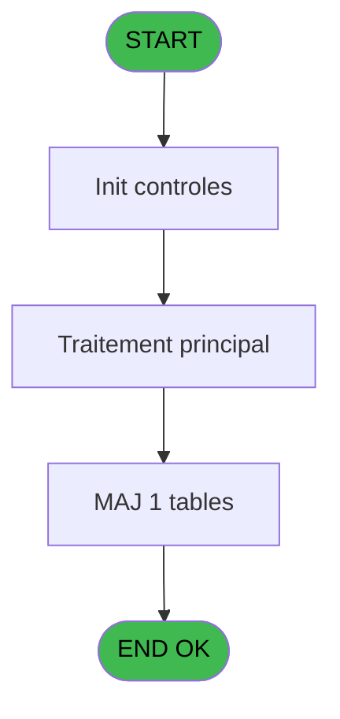
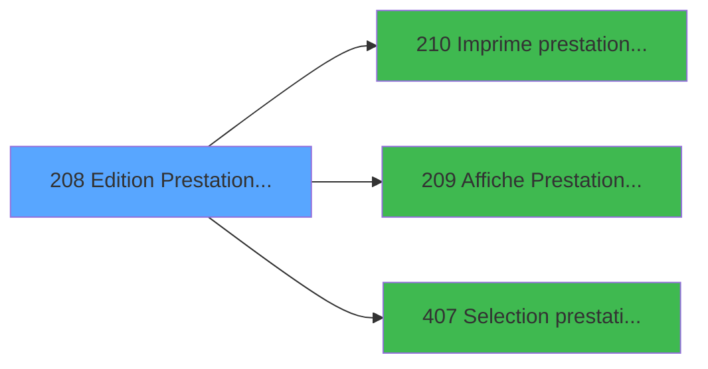

# PBP IDE 208 - Edition Prestation ==V2

> **Analyse**: Phases 1-4 2026-02-03 15:49 -> 15:49 (14s) | Assemblage 15:49
> **Pipeline**: V7.2 Enrichi
> **Structure**: 4 onglets (Resume | Ecrans | Donnees | Connexions)

<!-- TAB:Resume -->

## 1. FICHE D'IDENTITE

| Attribut | Valeur |
|----------|--------|
| Projet | PBP |
| IDE Position | 208 |
| Nom Programme | Edition Prestation ==V2 |
| Fichier source | `Prg_208.xml` |
| Dossier IDE | Liste |
| Taches | 3 (1 ecrans visibles) |
| Tables modifiees | 1 |
| Programmes appeles | 3 |
| :warning: Statut | **ORPHELIN_POTENTIEL** |

## 2. DESCRIPTION FONCTIONNELLE

**Edition Prestation ==V2** assure la gestion complete de ce processus.

Le flux de traitement s'organise en **2 blocs fonctionnels** :

- **Consultation** (2 taches) : ecrans de recherche, selection et consultation
- **Impression** (1 tache) : generation de tickets et documents

**Donnees modifiees** : 1 tables en ecriture (libelle_prestation).

**Logique metier** : 3 regles identifiees couvrant conditions metier.

Detail : phases du traitement

#### Phase 1 : Impression (1 tache)

- **208** - Edition Prestations **[[ECRAN]](#ecran-t1)**

Delegue a : [   Imprime prestation ==V2 (IDE 210)](PBP-IDE-210.md)

#### Phase 2 : Consultation (2 taches)

- **208.1** - Générer Liste Selection
- **208.2** - Affiche Prestation **[[ECRAN]](#ecran-t8)**

Delegue a : [   Affiche Prestation ==V2 (IDE 209)](PBP-IDE-209.md), [Selection prestation Multiple (IDE 407)](PBP-IDE-407.md)

#### Tables impactees

| Table | Operations | Role metier |
|-------|-----------|-------------|
| libelle_prestation | **W** (1 usages) | Prestations/services vendus |

## 3. BLOCS FONCTIONNELS

### 3.1 Impression (1 tache)

Generation des documents et tickets.

---

#### 208 - Edition Prestations [[ECRAN]](#ecran-t1)

**Role** : Generation du document : Edition Prestations.
**Ecran** : 569 x 248 DLU (MDI) | [Voir mockup](#ecran-t1)
**Variables liees** : C (w0.NbrePrestations)
**Delegue a** : [   Imprime prestation ==V2 (IDE 210)](PBP-IDE-210.md)

### 3.2 Consultation (2 taches)

Ecrans de recherche et consultation.

---

#### 208.1 - Générer Liste Selection

**Role** : Selection par l'operateur : Générer Liste Selection.
**Variables liees** : J (v.Selection_date_création), W (v.Selection), D (v_ListePrestation), Z (CHG_REASON_v.Selection), BA (CHG_PRV_v.Selection)
**Delegue a** : [   Affiche Prestation ==V2 (IDE 209)](PBP-IDE-209.md), [Selection prestation Multiple (IDE 407)](PBP-IDE-407.md)

---

#### 208.2 - Affiche Prestation [[ECRAN]](#ecran-t8)

**Role** : Reinitialisation : Affiche Prestation.
**Ecran** : 546 x 201 DLU (MDI) | [Voir mockup](#ecran-t8)
**Variables liees** : A (w0.Prestation_A_P_V), C (w0.NbrePrestations), D (v_ListePrestation), E (b_Prestation), X (CHG_REASON_w0.Prestation_A_P)
**Delegue a** : [   Affiche Prestation ==V2 (IDE 209)](PBP-IDE-209.md), [Selection prestation Multiple (IDE 407)](PBP-IDE-407.md)

## 5. REGLES METIER

3 regles identifiees:

### Consultation (1 regles)

#### [RM-001] Si v.Selection [W] vaut 'A' alors 'Du', sinon 'Le'

| Element | Detail |
|---------|--------|
| **Condition** | `v.Selection [W]='A'` |
| **Si vrai** | 'Du' |
| **Si faux** | 'Le') |
| **Variables** | W (v.Selection) |
| **Expression source** | Expression 8 : `IF(v.Selection [W]='A','Du','Le')` |
| **Exemple** | Si v.Selection [W]='A' → 'Du'. Sinon → 'Le') |
| **Impact** | Bloc Consultation |

### Autres (2 regles)

#### [RM-002] Si [AZ] alors [AC] sinon '00/00/0000'DATE)

| Element | Detail |
|---------|--------|
| **Condition** | `[AZ]` |
| **Si vrai** | [AC] |
| **Si faux** | '00/00/0000'DATE) |
| **Expression source** | Expression 30 : `IF([AZ],[AC],'00/00/0000'DATE)` |
| **Exemple** | Si [AZ] → [AC]. Sinon → '00/00/0000'DATE) |

#### [RM-003] Si VG108 alors 14.875 sinon 14.875+3)

| Element | Detail |
|---------|--------|
| **Condition** | `VG108` |
| **Si vrai** | 14.875 |
| **Si faux** | 14.875+3) |
| **Expression source** | Expression 36 : `IF(VG108,14.875,14.875+3)` |
| **Exemple** | Si VG108 → 14.875. Sinon → 14.875+3) |

## 6. CONTEXTE

- **Appele par**: (aucun)
- **Appelle**: 3 programmes | **Tables**: 2 (W:1 R:0 L:1) | **Taches**: 3 | **Expressions**: 38

<!-- TAB:Ecrans -->

## 8. ECRANS

### 8.1 Forms visibles (1 / 3)

| # | Position | Tache | Nom | Type | Largeur | Hauteur | Bloc |
|---|----------|-------|-----|------|---------|---------|------|
| 1 | 208 | 208 | Edition Prestations | MDI | 569 | 248 | Impression |

### 8.2 Mockups Ecrans

---

#### 208 - Edition Prestations
**Tache** : [208](#t1) | **Type** : MDI | **Dimensions** : 569 x 248 DLU
**Bloc** : Impression | **Titre IDE** : Edition Prestations

<!-- FORM-DATA:
{
    "width":  569,
    "vFactor":  8,
    "type":  "MDI",
    "hFactor":  8,
    "controls":  [
                     {
                         "x":  0,
                         "type":  "label",
                         "var":  "",
                         "y":  0,
                         "w":  567,
                         "fmt":  "",
                         "name":  "",
                         "h":  19,
                         "color":  "",
                         "text":  "",
                         "parent":  null
                     },
                     {
                         "x":  26,
                         "type":  "label",
                         "var":  "",
                         "y":  74,
                         "w":  268,
                         "fmt":  "",
                         "name":  "",
                         "h":  49,
                         "color":  "",
                         "text":  "",
                         "parent":  null
                     },
                     {
                         "x":  315,
                         "type":  "label",
                         "var":  "",
                         "y":  79,
                         "w":  225,
                         "fmt":  "",
                         "name":  "",
                         "h":  140,
                         "color":  "",
                         "text":  "",
                         "parent":  null
                     },
                     {
                         "x":  40,
                         "type":  "label",
                         "var":  "",
                         "y":  82,
                         "w":  246,
                         "fmt":  "",
                         "name":  "",
                         "h":  9,
                         "color":  "42",
                         "text":  "Prestations séléctionnées",
                         "parent":  5
                     },
                     {
                         "x":  26,
                         "type":  "label",
                         "var":  "",
                         "y":  125,
                         "w":  268,
                         "fmt":  "",
                         "name":  "",
                         "h":  39,
                         "color":  "",
                         "text":  "DATE DEBUT",
                         "parent":  null
                     },
                     {
                         "x":  53,
                         "type":  "label",
                         "var":  "",
                         "y":  137,
                         "w":  43,
                         "fmt":  "",
                         "name":  "",
                         "h":  10,
                         "color":  "",
                         "text":  "Du",
                         "parent":  11
                     },
                     {
                         "x":  53,
                         "type":  "label",
                         "var":  "",
                         "y":  149,
                         "w":  29,
                         "fmt":  "",
                         "name":  "",
                         "h":  10,
                         "color":  "",
                         "text":  "Au",
                         "parent":  11
                     },
                     {
                         "x":  0,
                         "type":  "label",
                         "var":  "",
                         "y":  222,
                         "w":  567,
                         "fmt":  "",
                         "name":  "",
                         "h":  24,
                         "color":  "",
                         "text":  "",
                         "parent":  null
                     },
                     {
                         "x":  40,
                         "type":  "label",
                         "var":  "",
                         "y":  91,
                         "w":  246,
                         "fmt":  "",
                         "name":  "",
                         "h":  8,
                         "color":  "42",
                         "text":  "à choisir dans la Liste",
                         "parent":  5
                     },
                     {
                         "x":  26,
                         "type":  "label",
                         "var":  "",
                         "y":  23,
                         "w":  268,
                         "fmt":  "",
                         "name":  "",
                         "h":  51,
                         "color":  "",
                         "text":  "",
                         "parent":  null
                     },
                     {
                         "x":  125,
                         "type":  "label",
                         "var":  "",
                         "y":  227,
                         "w":  8,
                         "fmt":  "",
                         "name":  "",
                         "h":  9,
                         "color":  "",
                         "text":  "v_ListePrestation",
                         "parent":  null
                     },
                     {
                         "x":  26,
                         "type":  "label",
                         "var":  "",
                         "y":  166,
                         "w":  268,
                         "fmt":  "",
                         "name":  "",
                         "h":  39,
                         "color":  "",
                         "text":  "DATE CREATION",
                         "parent":  null
                     },
                     {
                         "x":  53,
                         "type":  "label",
                         "var":  "",
                         "y":  178,
                         "w":  43,
                         "fmt":  "",
                         "name":  "",
                         "h":  10,
                         "color":  "",
                         "text":  "Du",
                         "parent":  55
                     },
                     {
                         "x":  53,
                         "type":  "label",
                         "var":  "",
                         "y":  190,
                         "w":  29,
                         "fmt":  "",
                         "name":  "",
                         "h":  10,
                         "color":  "",
                         "text":  "Au",
                         "parent":  55
                     },
                     {
                         "x":  26,
                         "type":  "label",
                         "var":  "",
                         "y":  209,
                         "w":  198,
                         "fmt":  "",
                         "name":  "",
                         "h":  10,
                         "color":  "",
                         "text":  "Nombre de prestations :",
                         "parent":  null
                     },
                     {
                         "x":  315,
                         "type":  "label",
                         "var":  "",
                         "y":  23,
                         "w":  225,
                         "fmt":  "",
                         "name":  "",
                         "h":  56,
                         "color":  "",
                         "text":  "Trie par",
                         "parent":  null
                     },
                     {
                         "x":  48,
                         "type":  "radio",
                         "var":  "",
                         "y":  28,
                         "w":  214,
                         "fmt":  "",
                         "name":  "w0.Prestation_A_P",
                         "h":  40,
                         "color":  "",
                         "text":  "A,P,V",
                         "parent":  52
                     },
                     {
                         "x":  336,
                         "type":  "radio",
                         "var":  "",
                         "y":  34,
                         "w":  193,
                         "fmt":  "",
                         "name":  "v.trie Libellé, Nom, Code_0001",
                         "h":  41,
                         "color":  "",
                         "text":  "L,N,P",
                         "parent":  65
                     },
                     {
                         "x":  40,
                         "type":  "edit",
                         "var":  "",
                         "y":  104,
                         "w":  58,
                         "fmt":  "",
                         "name":  "w0_CodePrestation",
                         "h":  10,
                         "color":  "",
                         "text":  "",
                         "parent":  5
                     },
                     {
                         "x":  117,
                         "type":  "button",
                         "var":  "",
                         "y":  101,
                         "w":  131,
                         "fmt":  "Liste",
                         "name":  "b_Prestation",
                         "h":  17,
                         "color":  "",
                         "text":  "",
                         "parent":  5
                     },
                     {
                         "x":  106,
                         "type":  "edit",
                         "var":  "",
                         "y":  137,
                         "w":  126,
                         "fmt":  "DD/MM/YYYY",
                         "name":  "w0_DateMin",
                         "h":  10,
                         "color":  "110",
                         "text":  "",
                         "parent":  11
                     },
                     {
                         "x":  242,
                         "type":  "button",
                         "var":  "",
                         "y":  137,
                         "w":  33,
                         "fmt":  "...",
                         "name":  "b_DateMin",
                         "h":  10,
                         "color":  "",
                         "text":  "",
                         "parent":  11
                     },
                     {
                         "x":  106,
                         "type":  "edit",
                         "var":  "",
                         "y":  149,
                         "w":  126,
                         "fmt":  "DD/MM/YYYY",
                         "name":  "w0_DateMax",
                         "h":  10,
                         "color":  "110",
                         "text":  "",
                         "parent":  11
                     },
                     {
                         "x":  242,
                         "type":  "button",
                         "var":  "",
                         "y":  149,
                         "w":  33,
                         "fmt":  "...",
                         "name":  "b_DateMax",
                         "h":  10,
                         "color":  "",
                         "text":  "",
                         "parent":  11
                     },
                     {
                         "x":  181,
                         "type":  "checkbox",
                         "var":  "",
                         "y":  164,
                         "w":  24,
                         "fmt":  "",
                         "name":  "v.Selection_date_création",
                         "h":  12,
                         "color":  "",
                         "text":  "",
                         "parent":  null
                     },
                     {
                         "x":  109,
                         "type":  "edit",
                         "var":  "",
                         "y":  178,
                         "w":  126,
                         "fmt":  "DD/MM/YYYY",
                         "name":  "w0_DateMin_Creation",
                         "h":  10,
                         "color":  "110",
                         "text":  "",
                         "parent":  55
                     },
                     {
                         "x":  245,
                         "type":  "button",
                         "var":  "",
                         "y":  178,
                         "w":  33,
                         "fmt":  "...",
                         "name":  "b_DateMin_Creation",
                         "h":  10,
                         "color":  "",
                         "text":  "",
                         "parent":  55
                     },
                     {
                         "x":  109,
                         "type":  "edit",
                         "var":  "",
                         "y":  190,
                         "w":  126,
                         "fmt":  "DD/MM/YYYY",
                         "name":  "w0_DateMax_Creation",
                         "h":  10,
                         "color":  "110",
                         "text":  "",
                         "parent":  55
                     },
                     {
                         "x":  245,
                         "type":  "button",
                         "var":  "",
                         "y":  190,
                         "w":  33,
                         "fmt":  "...",
                         "name":  "b_DateMax_Creation",
                         "h":  10,
                         "color":  "",
                         "text":  "",
                         "parent":  55
                     },
                     {
                         "x":  238,
                         "type":  "edit",
                         "var":  "",
                         "y":  209,
                         "w":  56,
                         "fmt":  "",
                         "name":  "w0_NbSelect",
                         "h":  10,
                         "color":  "",
                         "text":  "",
                         "parent":  null
                     },
                     {
                         "x":  349,
                         "type":  "button",
                         "var":  "",
                         "y":  148,
                         "w":  154,
                         "fmt":  "E\u0026xcel",
                         "name":  "b_Excel",
                         "h":  18,
                         "color":  "",
                         "text":  "",
                         "parent":  6
                     },
                     {
                         "x":  349,
                         "type":  "button",
                         "var":  "",
                         "y":  170,
                         "w":  154,
                         "fmt":  "\u0026Ecran",
                         "name":  "b_Ecran",
                         "h":  18,
                         "color":  "",
                         "text":  "",
                         "parent":  6
                     },
                     {
                         "x":  8,
                         "type":  "edit",
                         "var":  "",
                         "y":  2,
                         "w":  267,
                         "fmt":  "20",
                         "name":  "",
                         "h":  8,
                         "color":  "",
                         "text":  "",
                         "parent":  1
                     },
                     {
                         "x":  349,
                         "type":  "button",
                         "var":  "",
                         "y":  192,
                         "w":  154,
                         "fmt":  "\u0026Impression",
                         "name":  "b_Imprimer",
                         "h":  18,
                         "color":  "",
                         "text":  "",
                         "parent":  6
                     },
                     {
                         "x":  340,
                         "type":  "edit",
                         "var":  "",
                         "y":  6,
                         "w":  203,
                         "fmt":  "WWW DD MMM YYYYT",
                         "name":  "",
                         "h":  8,
                         "color":  "",
                         "text":  "",
                         "parent":  1
                     },
                     {
                         "x":  8,
                         "type":  "edit",
                         "var":  "",
                         "y":  10,
                         "w":  331,
                         "fmt":  "25",
                         "name":  "",
                         "h":  8,
                         "color":  "",
                         "text":  "",
                         "parent":  1
                     },
                     {
                         "x":  359,
                         "type":  "image",
                         "var":  "",
                         "y":  87,
                         "w":  137,
                         "fmt":  "",
                         "name":  "",
                         "h":  56,
                         "color":  "",
                         "text":  "",
                         "parent":  6
                     },
                     {
                         "x":  9,
                         "type":  "button",
                         "var":  "",
                         "y":  225,
                         "w":  154,
                         "fmt":  "\u0026Quitter",
                         "name":  "",
                         "h":  18,
                         "color":  "",
                         "text":  "",
                         "parent":  18
                     }
                 ],
    "taskId":  "208",
    "height":  248
}
-->

<strong>Champs : 10 champs</strong>

| Pos (x,y) | Nom | Variable | Type |
|-----------|-----|----------|------|
| 40,104 | w0_CodePrestation | - | edit |
| 106,137 | w0_DateMin | - | edit |
| 106,149 | w0_DateMax | - | edit |
| 181,164 | v.Selection_date_création | - | checkbox |
| 109,178 | w0_DateMin_Creation | - | edit |
| 109,190 | w0_DateMax_Creation | - | edit |
| 238,209 | w0_NbSelect | - | edit |
| 8,2 | 20 | - | edit |
| 340,6 | WWW DD MMM YYYYT | - | edit |
| 8,10 | 25 | - | edit |

<strong>Boutons : 9 boutons</strong>

| Bouton | Pos (x,y) | Action |
|--------|-----------|--------|
| Liste | 117,101 | Bouton fonctionnel |
| ... | 242,137 | Bouton fonctionnel |
| ... | 242,149 | Bouton fonctionnel |
| ... | 245,178 | Bouton fonctionnel |
| ... | 245,190 | Bouton fonctionnel |
| Excel | 349,148 | Bouton fonctionnel |
| Ecran | 349,170 | Bouton fonctionnel |
| Impression | 349,192 | Bouton fonctionnel |
| Quitter | 9,225 | Quitte le programme |

## 9. NAVIGATION

Ecran unique: **Edition Prestations**

### 9.3 Structure hierarchique (3 taches)

| Position | Tache | Type | Dimensions | Bloc |
|----------|-------|------|------------|------|
| **208.1** | [**Edition Prestations** (208)](#t1) [mockup](#ecran-t1) | MDI | 569x248 | Impression |
| **208.2** | [**Générer Liste Selection** (208.1)](#t3) | - | - | Consultation |
| 208.2.1 | [Affiche Prestation (208.2)](#t8) [mockup](#ecran-t8) | MDI | 546x201 | |

### 9.4 Algorigramme

> **Legende**: Vert = START/END OK | Rouge = END KO | Bleu = Decisions
> *Algorigramme auto-genere. Utiliser `/algorigramme` pour une synthese metier detaillee.*

<!-- TAB:Donnees -->

## 10. TABLES

### Tables utilisees (2)

| ID | Nom | Description | Type | R | W | L | Usages |
|----|-----|-------------|------|---|---|---|--------|
| 135 | libelle_prestation | Prestations/services vendus | DB |   | **W** |   | 1 |
| 948 | Table_948 |  | MEM |   |   | L | 1 |

### Colonnes par table (1 / 1 tables avec colonnes identifiees)

Table 135 - libelle_prestation (**W**) - 1 usages

| Lettre | Variable | Acces | Type |
|--------|----------|-------|------|
| A | w0.Prestation_A_P_V | W | Unicode |
| C | w0.NbrePrestations | W | Numeric |
| D | v_ListePrestation | W | Alpha |
| E | b_Prestation | W | Alpha |
| X | CHG_REASON_w0.Prestation_A_P | W | Numeric |
| Y | CHG_PRV_w0.Prestation_A_P | W | Unicode |

## 11. VARIABLES

### 11.1 Variables de session (6)

Variables persistantes pendant toute la session.

| Lettre | Nom | Type | Usage dans |
|--------|-----|------|-----------|
| J | v.Selection_date_création | Logical | - |
| P | v.trie Libellé, Nom, Code prest | Unicode | - |
| Q | v.Order by | Unicode | - |
| U | v.NomFichierExcel | Alpha | - |
| V | v.Where | Alpha | - |
| W | v.Selection | Alpha | 7x session |

### 11.2 Variables de travail (2)

Variables internes au programme.

| Lettre | Nom | Type | Usage dans |
|--------|-----|------|-----------|
| A | w0.Prestation_A_P_V | Unicode | - |
| C | w0.NbrePrestations | Numeric | - |

### 11.3 Autres (29)

Variables diverses.

| Lettre | Nom | Type | Usage dans |
|--------|-----|------|-----------|
| B | w0_TitreEcran | Alpha | 2x refs |
| D | v_ListePrestation | Alpha | 4x refs |
| E | b_Prestation | Alpha | - |
| F | w0_DateMin | Date | 3x refs |
| G | b_DateMin | Alpha | - |
| H | w0_DateMax | Date | - |
| I | b_DateMax | Alpha | 2x refs |
| K | w0_DateMin_Creation | Date | - |
| L | b_DateMin_Creation | Alpha | - |
| M | w0_DateMax_Creation | Date | - |
| N | b_DateMax_Creation | Alpha | - |
| O | w0_NbSelect | Numeric | - |
| R | b_Ecran | Alpha | - |
| S | b_Imprimer | Alpha | - |
| T | b_Excel | Alpha | - |
| X | CHG_REASON_w0.Prestation_A_P | Numeric | - |
| Y | CHG_PRV_w0.Prestation_A_P | Unicode | 1x refs |
| Z | CHG_REASON_v.Selection | Numeric | 1x refs |
| BA | CHG_PRV_v.Selection | Alpha | - |
| BB | CHG_REASON_w0_DateMin | Numeric | - |
| BC | CHG_PRV_w0_DateMin | Date | 1x refs |
| BD | CHG_REASON_w0_DateMax | Numeric | - |
| BE | CHG_PRV_w0_DateMax | Date | - |
| BF | CHG_REASON_v.Selection_date_cr | Numeric | - |
| BG | CHG_PRV_v.Selection_date_créat | Logical | - |
| BH | CHG_REASON_w0_DateMin_Creation | Numeric | - |
| BI | CHG_PRV_w0_DateMin_Creation | Date | - |
| BJ | CHG_REASON_w0_DateMax_Creation | Numeric | - |
| BK | CHG_PRV_w0_DateMax_Creation | Date | - |

Toutes les 37 variables (liste complete)

| Cat | Lettre | Nom Variable | Type |
|-----|--------|--------------|------|
| W0 | **A** | w0.Prestation_A_P_V | Unicode |
| W0 | **C** | w0.NbrePrestations | Numeric |
| V. | **J** | v.Selection_date_création | Logical |
| V. | **P** | v.trie Libellé, Nom, Code prest | Unicode |
| V. | **Q** | v.Order by | Unicode |
| V. | **U** | v.NomFichierExcel | Alpha |
| V. | **V** | v.Where | Alpha |
| V. | **W** | v.Selection | Alpha |
| Autre | **B** | w0_TitreEcran | Alpha |
| Autre | **D** | v_ListePrestation | Alpha |
| Autre | **E** | b_Prestation | Alpha |
| Autre | **F** | w0_DateMin | Date |
| Autre | **G** | b_DateMin | Alpha |
| Autre | **H** | w0_DateMax | Date |
| Autre | **I** | b_DateMax | Alpha |
| Autre | **K** | w0_DateMin_Creation | Date |
| Autre | **L** | b_DateMin_Creation | Alpha |
| Autre | **M** | w0_DateMax_Creation | Date |
| Autre | **N** | b_DateMax_Creation | Alpha |
| Autre | **O** | w0_NbSelect | Numeric |
| Autre | **R** | b_Ecran | Alpha |
| Autre | **S** | b_Imprimer | Alpha |
| Autre | **T** | b_Excel | Alpha |
| Autre | **X** | CHG_REASON_w0.Prestation_A_P | Numeric |
| Autre | **Y** | CHG_PRV_w0.Prestation_A_P | Unicode |
| Autre | **Z** | CHG_REASON_v.Selection | Numeric |
| Autre | **BA** | CHG_PRV_v.Selection | Alpha |
| Autre | **BB** | CHG_REASON_w0_DateMin | Numeric |
| Autre | **BC** | CHG_PRV_w0_DateMin | Date |
| Autre | **BD** | CHG_REASON_w0_DateMax | Numeric |
| Autre | **BE** | CHG_PRV_w0_DateMax | Date |
| Autre | **BF** | CHG_REASON_v.Selection_date_cr | Numeric |
| Autre | **BG** | CHG_PRV_v.Selection_date_créat | Logical |
| Autre | **BH** | CHG_REASON_w0_DateMin_Creation | Numeric |
| Autre | **BI** | CHG_PRV_w0_DateMin_Creation | Date |
| Autre | **BJ** | CHG_REASON_w0_DateMax_Creation | Numeric |
| Autre | **BK** | CHG_PRV_w0_DateMax_Creation | Date |

## 12. EXPRESSIONS

**38 / 38 expressions decodees (100%)**

### 12.1 Repartition par type

| Type | Expressions | Regles |
|------|-------------|--------|
| FORMAT | 5 | 0 |
| CONDITION | 13 | 3 |
| CONSTANTE | 7 | 0 |
| DATE | 2 | 0 |
| CAST_LOGIQUE | 2 | 0 |
| OTHER | 5 | 0 |
| REFERENCE_VG | 2 | 0 |
| CONCATENATION | 1 | 0 |
| STRING | 1 | 0 |

### 12.2 Expressions cles par type

#### FORMAT (5 expressions)

| Type | IDE | Expression | Regle |
|------|-----|------------|-------|
| FORMAT | 26 | `Trim([AA])&' AND pre_date_import BETWEEN '''&DStr([AC],'YYYYMMDD')&''' AND '''&DStr([AE],'YYYYMMDD')&''''` | - |
| FORMAT | 38 | `Trim([AA])&' AND '''&DStr(v_ListePrestation [D],'YYYYMMDD')&''' BETWEEN pre_date_debut AND pre_date_fin'` | - |
| FORMAT | 25 | `Trim([AA])&' AND gmr_acces<>''O'' AND pre_date_debut BETWEEN '''&DStr(v_ListePrestation [D],'YYYYMMDD')&''' AND '''&DStr(w0_DateMin [F],'YYYYMMDD')&''''` | - |
| FORMAT | 3 | `Translate ('%club_exportdata%')&'PRESTATION_'&
CASE(v.Selection [W],'A',
'ARRIVANT_',
'P',
'PRESENT_',
'V',
'PREVISION_',
''
)&
DStr(Date(),'YYYYMMDD')&'_'&TStr(Time(),'HHMMSS')&'.csv'` | - |
| FORMAT | 23 | `Trim([AA])&' AND gmr_acces=''O'' AND '''&DStr(v_ListePrestation [D],'YYYYMMDD')&''' BETWEEN pre_date_debut AND pre_date_fin'` | - |

#### CONDITION (13 expressions)

| Type | IDE | Expression | Regle |
|------|-----|------------|-------|
| CONDITION | 36 | `IF(VG108,14.875,14.875+3)` | [RM-003](#rm-RM-003) |
| CONDITION | 30 | `IF([AZ],[AC],'00/00/0000'DATE)` | [RM-002](#rm-RM-002) |
| CONDITION | 8 | `IF(v.Selection [W]='A','Du','Le')` | [RM-001](#rm-RM-001) |
| CONDITION | 20 | `b_DateMax [I]<>0` | - |
| CONDITION | 21 | `v_ListePrestation [D]>w0_DateMin [F] AND v.Selection [W]='A'` | - |
| ... | | *+8 autres* | |

#### CONSTANTE (7 expressions)

| Type | IDE | Expression | Regle |
|------|-----|------------|-------|
| CONSTANTE | 15 | `'&Imprimer'` | - |
| CONSTANTE | 16 | `'E&xcel'` | - |
| CONSTANTE | 33 | `'L'` | - |
| CONSTANTE | 14 | `'&Ecran'` | - |
| CONSTANTE | 6 | `'A'` | - |
| ... | | *+2 autres* | |

#### DATE (2 expressions)

| Type | IDE | Expression | Regle |
|------|-----|------------|-------|
| DATE | 11 | `Date ()-1` | - |
| DATE | 10 | `Date ()` | - |

#### CAST_LOGIQUE (2 expressions)

| Type | IDE | Expression | Regle |
|------|-----|------------|-------|
| CAST_LOGIQUE | 32 | `'FALSE'LOG` | - |
| CAST_LOGIQUE | 2 | `'TRUE'LOG` | - |

#### OTHER (5 expressions)

| Type | IDE | Expression | Regle |
|------|-----|------------|-------|
| OTHER | 28 | `IsFirstRecordCycle(0)` | - |
| OTHER | 29 | `[AZ]` | - |
| OTHER | 27 | `[AA]` | - |
| OTHER | 5 | `CHG_PRV_w0.Prestation_A_P [Y]` | - |
| OTHER | 18 | `GetParam ('VILLAGE')` | - |

#### REFERENCE_VG (2 expressions)

| Type | IDE | Expression | Regle |
|------|-----|------------|-------|
| REFERENCE_VG | 35 | `VG108` | - |
| REFERENCE_VG | 17 | `VG2` | - |

#### CONCATENATION (1 expressions)

| Type | IDE | Expression | Regle |
|------|-----|------------|-------|
| CONCATENATION | 1 | `'pre_code_circuit in ('&IF(Trim(w0_TitreEcran [B])<>'',Trim(w0_TitreEcran [B]),'''''')&')'` | - |

#### STRING (1 expressions)

| Type | IDE | Expression | Regle |
|------|-----|------------|-------|
| STRING | 4 | `RepStr (w0_TitreEcran [B],'''','')` | - |

### 12.3 Toutes les expressions (38)

Voir les 38 expressions

#### FORMAT (5)

| IDE | Expression Decodee |
|-----|-------------------|
| 3 | `Translate ('%club_exportdata%')&'PRESTATION_'&
CASE(v.Selection [W],'A',
'ARRIVANT_',
'P',
'PRESENT_',
'V',
'PREVISION_',
''
)&
DStr(Date(),'YYYYMMDD')&'_'&TStr(Time(),'HHMMSS')&'.csv'` |
| 23 | `Trim([AA])&' AND gmr_acces=''O'' AND '''&DStr(v_ListePrestation [D],'YYYYMMDD')&''' BETWEEN pre_date_debut AND pre_date_fin'` |
| 25 | `Trim([AA])&' AND gmr_acces<>''O'' AND pre_date_debut BETWEEN '''&DStr(v_ListePrestation [D],'YYYYMMDD')&''' AND '''&DStr(w0_DateMin [F],'YYYYMMDD')&''''` |
| 26 | `Trim([AA])&' AND pre_date_import BETWEEN '''&DStr([AC],'YYYYMMDD')&''' AND '''&DStr([AE],'YYYYMMDD')&''''` |
| 38 | `Trim([AA])&' AND '''&DStr(v_ListePrestation [D],'YYYYMMDD')&''' BETWEEN pre_date_debut AND pre_date_fin'` |

#### CONDITION (13)

| IDE | Expression Decodee |
|-----|-------------------|
| 8 | `IF(v.Selection [W]='A','Du','Le')` |
| 30 | `IF([AZ],[AC],'00/00/0000'DATE)` |
| 31 | `IF([AZ],[AE],'00/00/0000'DATE)` |
| 34 | `CASE(CHG_PRV_w0_DateMin [BC],
'L','libelle,pre_date_debut',
'N','gmr_nom__30_,pre_date_debut',
'P','pre_date_debut,pre_code_circuit','')` |
| 36 | `IF(VG108,14.875,14.875+3)` |
| 7 | `v.Selection [W]='A'` |
| 9 | `CHG_REASON_v.Selection [Z]>0` |
| 19 | `b_DateMax [I]=0` |
| 20 | `b_DateMax [I]<>0` |
| 21 | `v_ListePrestation [D]>w0_DateMin [F] AND v.Selection [W]='A'` |
| 22 | `[AC]>[AE] AND [AZ]` |
| 24 | `v.Selection [W]='P'` |
| 37 | `v.Selection [W]='V'` |

#### CONSTANTE (7)

| IDE | Expression Decodee |
|-----|-------------------|
| 6 | `'A'` |
| 12 | `'...'` |
| 13 | `'Liste'` |
| 14 | `'&Ecran'` |
| 15 | `'&Imprimer'` |
| 16 | `'E&xcel'` |
| 33 | `'L'` |

#### DATE (2)

| IDE | Expression Decodee |
|-----|-------------------|
| 10 | `Date ()` |
| 11 | `Date ()-1` |

#### CAST_LOGIQUE (2)

| IDE | Expression Decodee |
|-----|-------------------|
| 2 | `'TRUE'LOG` |
| 32 | `'FALSE'LOG` |

#### OTHER (5)

| IDE | Expression Decodee |
|-----|-------------------|
| 5 | `CHG_PRV_w0.Prestation_A_P [Y]` |
| 18 | `GetParam ('VILLAGE')` |
| 27 | `[AA]` |
| 28 | `IsFirstRecordCycle(0)` |
| 29 | `[AZ]` |

#### REFERENCE_VG (2)

| IDE | Expression Decodee |
|-----|-------------------|
| 17 | `VG2` |
| 35 | `VG108` |

#### CONCATENATION (1)

| IDE | Expression Decodee |
|-----|-------------------|
| 1 | `'pre_code_circuit in ('&IF(Trim(w0_TitreEcran [B])<>'',Trim(w0_TitreEcran [B]),'''''')&')'` |

#### STRING (1)

| IDE | Expression Decodee |
|-----|-------------------|
| 4 | `RepStr (w0_TitreEcran [B],'''','')` |

<!-- TAB:Connexions -->

## 13. GRAPHE D'APPELS

### 13.1 Chaine depuis Main (Callers)

**Chemin**: (pas de callers directs)

### 13.2 Callers

| IDE | Nom Programme | Nb Appels |
|-----|---------------|-----------|
| - | (aucun) | - |

### 13.3 Callees (programmes appeles)

### 13.4 Detail Callees avec contexte

| IDE | Nom Programme | Appels | Contexte |
|-----|---------------|--------|----------|
| [210](PBP-IDE-210.md) |    Imprime prestation ==V2 | 2 | Impression ticket/document |
| [209](PBP-IDE-209.md) |    Affiche Prestation ==V2 | 1 | Affichage donnees |
| [407](PBP-IDE-407.md) | Selection prestation Multiple | 1 | Selection/consultation |

## 14. RECOMMANDATIONS MIGRATION

### 14.1 Profil du programme

| Metrique | Valeur | Impact migration |
|----------|--------|-----------------|
| Lignes de logique | 118 | Programme compact |
| Expressions | 38 | Peu de logique |
| Tables WRITE | 1 | Impact faible |
| Sous-programmes | 3 | Peu de dependances |
| Ecrans visibles | 1 | Ecran unique ou traitement batch |
| Code desactive | 0.8% (1 / 118) | Code sain |
| Regles metier | 3 | Quelques regles a preserver |

### 14.2 Plan de migration par bloc

#### Impression (1 tache: 1 ecran, 0 traitement)

- **Strategie** : Templates HTML -> PDF via wkhtmltopdf ou Puppeteer.
- `PrintService` injectable avec choix imprimante

#### Consultation (2 taches: 1 ecran, 1 traitement)

- **Strategie** : Composants de recherche/selection en modales.
- 1 ecran : Affiche Prestation

### 14.3 Dependances critiques

| Dependance | Type | Appels | Impact |
|------------|------|--------|--------|
| libelle_prestation | Table WRITE (Database) | 1x | Schema + repository |
| [   Imprime prestation ==V2 (IDE 210)](PBP-IDE-210.md) | Sous-programme | 2x | Haute - Impression ticket/document |
| [Selection prestation Multiple (IDE 407)](PBP-IDE-407.md) | Sous-programme | 1x | Normale - Selection/consultation |
| [   Affiche Prestation ==V2 (IDE 209)](PBP-IDE-209.md) | Sous-programme | 1x | Normale - Affichage donnees |

---
*Spec DETAILED generee par Pipeline V7.2 - 2026-02-03 15:49*
