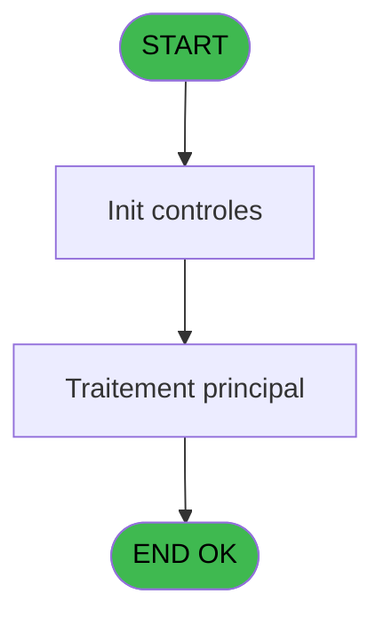
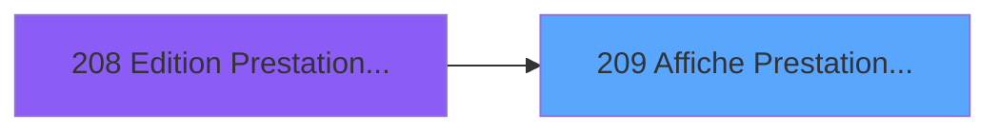
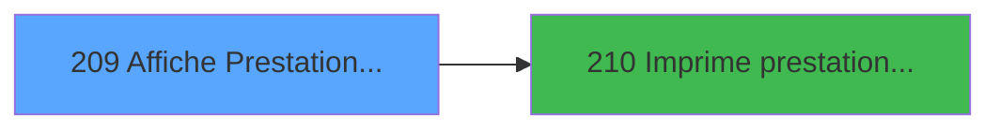

# PBP IDE 209 - Affiche Prestation ==V2

> **Analyse**: Phases 1-4 2026-02-03 15:49 -> 15:49 (16s) | Assemblage 15:49
> **Pipeline**: V7.2 Enrichi
> **Structure**: 4 onglets (Resume | Ecrans | Donnees | Connexions)

<!-- TAB:Resume -->

## 1. FICHE D'IDENTITE

| Attribut | Valeur |
|----------|--------|
| Projet | PBP |
| IDE Position | 209 |
| Nom Programme | Affiche Prestation ==V2 |
| Fichier source | `Prg_209.xml` |
| Dossier IDE | Liste |
| Taches | 1 (1 ecrans visibles) |
| Tables modifiees | 0 |
| Programmes appeles | 1 |

## 2. DESCRIPTION FONCTIONNELLE

**Affiche Prestation ==V2** assure la gestion complete de ce processus, accessible depuis [Edition Prestation ==V2 (IDE 208)](PBP-IDE-208.md).

Le flux de traitement s'organise en **1 blocs fonctionnels** :

- **Consultation** (1 tache) : ecrans de recherche, selection et consultation

**Logique metier** : 1 regles identifiees couvrant conditions metier.

## 3. BLOCS FONCTIONNELS

### 3.1 Consultation (1 tache)

Ecrans de recherche et consultation.

---

#### 209 - Affiche Prestation [[ECRAN]](#ecran-t1)

**Role** : Reinitialisation : Affiche Prestation.
**Ecran** : 1349 x 201 DLU (MDI) | [Voir mockup](#ecran-t1)
**Variables liees** : A (P.i.TypePrestation), D (P.i.Selection Prestation), K (v.Debut Prestation), L (v.Fin Prestation), O (v.Code Prestation)

## 5. REGLES METIER

1 regles identifiees:

### Autres (1 regles)

#### [RM-001] Si b_Imprimer [S] vaut 'H' alors 'Mr', sinon 'Me'

| Element | Detail |
|---------|--------|
| **Condition** | `b_Imprimer [S]='H'` |
| **Si vrai** | 'Mr' |
| **Si faux** | 'Me') |
| **Variables** | S (b_Imprimer) |
| **Expression source** | Expression 9 : `IF(b_Imprimer [S]='H','Mr','Me')` |
| **Exemple** | Si b_Imprimer [S]='H' → 'Mr'. Sinon → 'Me') |

## 6. CONTEXTE

- **Appele par**: [Edition Prestation ==V2 (IDE 208)](PBP-IDE-208.md)
- **Appelle**: 1 programmes | **Tables**: 0 (W:0 R:0 L:0) | **Taches**: 1 | **Expressions**: 10

<!-- TAB:Ecrans -->

## 8. ECRANS

### 8.1 Forms visibles (1 / 1)

| # | Position | Tache | Nom | Type | Largeur | Hauteur | Bloc |
|---|----------|-------|-----|------|---------|---------|------|
| 1 | 209 | 209 | Affiche Prestation | MDI | 1349 | 201 | Consultation |

### 8.2 Mockups Ecrans

---

#### 209 - Affiche Prestation
**Tache** : [209](#t1) | **Type** : MDI | **Dimensions** : 1349 x 201 DLU
**Bloc** : Consultation | **Titre IDE** : Affiche Prestation

<!-- FORM-DATA:
{
    "width":  1349,
    "vFactor":  8,
    "type":  "MDI",
    "hFactor":  8,
    "controls":  [
                     {
                         "x":  0,
                         "type":  "label",
                         "var":  "",
                         "y":  0,
                         "w":  1338,
                         "fmt":  "",
                         "name":  "",
                         "h":  19,
                         "color":  "",
                         "text":  "",
                         "parent":  null
                     },
                     {
                         "x":  3,
                         "type":  "table",
                         "var":  "",
                         "name":  "",
                         "titleH":  12,
                         "color":  "110",
                         "w":  1136,
                         "y":  29,
                         "fmt":  "",
                         "parent":  null,
                         "text":  "",
                         "rowH":  15,
                         "h":  143,
                         "cols":  [
                                      {
                                          "title":  "Titre",
                                          "layer":  1,
                                          "w":  52
                                      },
                                      {
                                          "title":  "Nom",
                                          "layer":  2,
                                          "w":  188
                                      },
                                      {
                                          "title":  "Prénom",
                                          "layer":  3,
                                          "w":  130
                                      },
                                      {
                                          "title":  "Prest. Début",
                                          "layer":  4,
                                          "w":  116
                                      },
                                      {
                                          "title":  "Prest. Fin",
                                          "layer":  5,
                                          "w":  119
                                      },
                                      {
                                          "title":  "Séjour début",
                                          "layer":  6,
                                          "w":  138
                                      },
                                      {
                                          "title":  "Séjour fin",
                                          "layer":  7,
                                          "w":  124
                                      },
                                      {
                                          "title":  "Chambre",
                                          "layer":  8,
                                          "w":  94
                                      },
                                      {
                                          "title":  "Code Prestation",
                                          "layer":  9,
                                          "w":  141
                                      }
                                  ],
                         "rows":  9
                     },
                     {
                         "x":  1152,
                         "type":  "label",
                         "var":  "",
                         "y":  27,
                         "w":  188,
                         "fmt":  "",
                         "name":  "",
                         "h":  142,
                         "color":  "",
                         "text":  "",
                         "parent":  null
                     },
                     {
                         "x":  0,
                         "type":  "label",
                         "var":  "",
                         "y":  176,
                         "w":  1338,
                         "fmt":  "",
                         "name":  "",
                         "h":  23,
                         "color":  "",
                         "text":  "",
                         "parent":  null
                     },
                     {
                         "x":  876,
                         "type":  "edit",
                         "var":  "",
                         "y":  44,
                         "w":  82,
                         "fmt":  "",
                         "name":  "Chambre",
                         "h":  10,
                         "color":  "110",
                         "text":  "",
                         "parent":  6
                     },
                     {
                         "x":  64,
                         "type":  "edit",
                         "var":  "",
                         "y":  44,
                         "w":  176,
                         "fmt":  "",
                         "name":  "INP nom",
                         "h":  10,
                         "color":  "110",
                         "text":  "",
                         "parent":  6
                     },
                     {
                         "x":  250,
                         "type":  "edit",
                         "var":  "",
                         "y":  44,
                         "w":  120,
                         "fmt":  "",
                         "name":  "INP prenom",
                         "h":  10,
                         "color":  "110",
                         "text":  "",
                         "parent":  6
                     },
                     {
                         "x":  8,
                         "type":  "edit",
                         "var":  "",
                         "y":  44,
                         "w":  30,
                         "fmt":  "2",
                         "name":  "INP titre",
                         "h":  10,
                         "color":  "110",
                         "text":  "",
                         "parent":  6
                     },
                     {
                         "x":  379,
                         "type":  "edit",
                         "var":  "",
                         "y":  44,
                         "w":  106,
                         "fmt":  "10",
                         "name":  "INP date prest. debu",
                         "h":  10,
                         "color":  "110",
                         "text":  "",
                         "parent":  6
                     },
                     {
                         "x":  496,
                         "type":  "edit",
                         "var":  "",
                         "y":  44,
                         "w":  109,
                         "fmt":  "10",
                         "name":  "INP date prest. fin",
                         "h":  10,
                         "color":  "110",
                         "text":  "",
                         "parent":  6
                     },
                     {
                         "x":  614,
                         "type":  "edit",
                         "var":  "",
                         "y":  44,
                         "w":  128,
                         "fmt":  "10",
                         "name":  "INP date sejour debu",
                         "h":  10,
                         "color":  "110",
                         "text":  "",
                         "parent":  6
                     },
                     {
                         "x":  752,
                         "type":  "edit",
                         "var":  "",
                         "y":  44,
                         "w":  109,
                         "fmt":  "10",
                         "name":  "INP date sejour fin",
                         "h":  10,
                         "color":  "110",
                         "text":  "",
                         "parent":  6
                     },
                     {
                         "x":  970,
                         "type":  "edit",
                         "var":  "",
                         "y":  44,
                         "w":  127,
                         "fmt":  "",
                         "name":  "INP Logement",
                         "h":  10,
                         "color":  "110",
                         "text":  "",
                         "parent":  6
                     },
                     {
                         "x":  1169,
                         "type":  "button",
                         "var":  "",
                         "y":  140,
                         "w":  154,
                         "fmt":  "\u0026Impression",
                         "name":  "b_Imprimer",
                         "h":  18,
                         "color":  "",
                         "text":  "",
                         "parent":  7
                     },
                     {
                         "x":  6,
                         "type":  "edit",
                         "var":  "",
                         "y":  2,
                         "w":  267,
                         "fmt":  "30",
                         "name":  "",
                         "h":  8,
                         "color":  "",
                         "text":  "",
                         "parent":  1
                     },
                     {
                         "x":  1056,
                         "type":  "edit",
                         "var":  "",
                         "y":  6,
                         "w":  267,
                         "fmt":  "WWW DD MMM YYYYT",
                         "name":  "",
                         "h":  8,
                         "color":  "",
                         "text":  "",
                         "parent":  1
                     },
                     {
                         "x":  6,
                         "type":  "edit",
                         "var":  "",
                         "y":  10,
                         "w":  267,
                         "fmt":  "30",
                         "name":  "",
                         "h":  8,
                         "color":  "",
                         "text":  "",
                         "parent":  1
                     },
                     {
                         "x":  1164,
                         "type":  "image",
                         "var":  "",
                         "y":  50,
                         "w":  165,
                         "fmt":  "",
                         "name":  "",
                         "h":  50,
                         "color":  "",
                         "text":  "",
                         "parent":  7
                     },
                     {
                         "x":  7,
                         "type":  "button",
                         "var":  "",
                         "y":  179,
                         "w":  154,
                         "fmt":  "\u0026Quitter",
                         "name":  "",
                         "h":  18,
                         "color":  "",
                         "text":  "",
                         "parent":  27
                     }
                 ],
    "taskId":  "209",
    "height":  201
}
-->

<strong>Champs : 12 champs</strong>

| Pos (x,y) | Nom | Variable | Type |
|-----------|-----|----------|------|
| 876,44 | Chambre | - | edit |
| 64,44 | INP nom | - | edit |
| 250,44 | INP prenom | - | edit |
| 8,44 | INP titre | - | edit |
| 379,44 | INP date prest. debu | - | edit |
| 496,44 | INP date prest. fin | - | edit |
| 614,44 | INP date sejour debu | - | edit |
| 752,44 | INP date sejour fin | - | edit |
| 970,44 | INP Logement | - | edit |
| 6,2 | 30 | - | edit |
| 1056,6 | WWW DD MMM YYYYT | - | edit |
| 6,10 | 30 | - | edit |

<strong>Boutons : 2 boutons</strong>

| Bouton | Pos (x,y) | Action |
|--------|-----------|--------|
| Impression | 1169,140 | Bouton fonctionnel |
| Quitter | 7,179 | Quitte le programme |

## 9. NAVIGATION

Ecran unique: **Affiche Prestation**

### 9.3 Structure hierarchique (1 tache)

| Position | Tache | Type | Dimensions | Bloc |
|----------|-------|------|------------|------|
| **209.1** | [**Affiche Prestation** (209)](#t1) [mockup](#ecran-t1) | MDI | 1349x201 | Consultation |

### 9.4 Algorigramme

> **Legende**: Vert = START/END OK | Rouge = END KO | Bleu = Decisions
> *Algorigramme auto-genere. Utiliser `/algorigramme` pour une synthese metier detaillee.*

<!-- TAB:Donnees -->

## 10. TABLES

### Tables utilisees (0)

| ID | Nom | Description | Type | R | W | L | Usages |
|----|-----|-------------|------|---|---|---|--------|

### Colonnes par table (0 / 0 tables avec colonnes identifiees)

## 11. VARIABLES

### 11.1 Parametres entrants (8)

Variables recues du programme appelant ([Edition Prestation ==V2 (IDE 208)](PBP-IDE-208.md)).

| Lettre | Nom | Type | Usage dans |
|--------|-----|------|-----------|
| A | P.i.TypePrestation | Alpha | - |
| B | P.i.Where | Alpha | 1x parametre entrant |
| C | P.i.Order by | Alpha | - |
| D | P.i.Selection Prestation | Alpha | - |
| E | P.i.DateMin | Date | - |
| F | P.i.DateMax | Date | - |
| G | P.i.DateMin_Creation | Date | - |
| H | P.i.DateMax_Creation | Date | - |

### 11.2 Variables de session (11)

Variables persistantes pendant toute la session.

| Lettre | Nom | Type | Usage dans |
|--------|-----|------|-----------|
| I | v.Nom | Unicode | - |
| J | v.Prenom | Unicode | - |
| K | v.Debut Prestation | Unicode | - |
| L | v.Fin Prestation | Unicode | - |
| M | v.Debut Sejour | Unicode | - |
| N | v.Fin Sejour | Unicode | - |
| O | v.Code Prestation | Unicode | - |
| P | v.Libelle Prestation | Unicode | - |
| Q | v.Chambre | Unicode | - |
| R | v.Sexe | Unicode | - |
| T | v.requete SQL | Unicode | - |

### 11.3 Autres (1)

Variables diverses.

| Lettre | Nom | Type | Usage dans |
|--------|-----|------|-----------|
| S | b_Imprimer | Alpha | 1x refs |

Toutes les 20 variables (liste complete)

| Cat | Lettre | Nom Variable | Type |
|-----|--------|--------------|------|
| P0 | **A** | P.i.TypePrestation | Alpha |
| P0 | **B** | P.i.Where | Alpha |
| P0 | **C** | P.i.Order by | Alpha |
| P0 | **D** | P.i.Selection Prestation | Alpha |
| P0 | **E** | P.i.DateMin | Date |
| P0 | **F** | P.i.DateMax | Date |
| P0 | **G** | P.i.DateMin_Creation | Date |
| P0 | **H** | P.i.DateMax_Creation | Date |
| V. | **I** | v.Nom | Unicode |
| V. | **J** | v.Prenom | Unicode |
| V. | **K** | v.Debut Prestation | Unicode |
| V. | **L** | v.Fin Prestation | Unicode |
| V. | **M** | v.Debut Sejour | Unicode |
| V. | **N** | v.Fin Sejour | Unicode |
| V. | **O** | v.Code Prestation | Unicode |
| V. | **P** | v.Libelle Prestation | Unicode |
| V. | **Q** | v.Chambre | Unicode |
| V. | **R** | v.Sexe | Unicode |
| V. | **T** | v.requete SQL | Unicode |
| Autre | **S** | b_Imprimer | Alpha |

## 12. EXPRESSIONS

**10 / 10 expressions decodees (100%)**

### 12.1 Repartition par type

| Type | Expressions | Regles |
|------|-------------|--------|
| CONDITION | 2 | 5 |
| CONSTANTE | 1 | 0 |
| DATE | 1 | 0 |
| REFERENCE_VG | 1 | 0 |
| OTHER | 3 | 0 |
| STRING | 2 | 0 |

### 12.2 Expressions cles par type

#### CONDITION (2 expressions)

| Type | IDE | Expression | Regle |
|------|-----|------------|-------|
| CONDITION | 9 | `IF(b_Imprimer [S]='H','Mr','Me')` | [RM-001](#rm-RM-001) |
| CONDITION | 10 | `StrBuild(
'SELECT gmr_nom__30_,gmr_prenom__8_,
convert(varchar(10),convert(datetime,pre_date_debut,112),103),
convert(varchar(10),convert(datetime,pre_date_fin,112),103),
convert(varchar(10),convert(datetime,gmr_debut_sejour,112),103),
convert(varchar(10),convert(datetime,gmr_fin_sejour,112),103),
pre_code_circuit, libelle, SEJ.heb_nom_logement,gmr_sexe 
FROM cafil011_dat
LEFT OUTER JOIN cafil008_dat 
      ON pre_num_compte=gmr_code_gm 
      AND pre_filiation=gmr_filiation_villag
LEFT OUTER JOIN cafil113_dat 
      ON pre_code_circuit=code_circuit
LEFT OUTER JOIN cafil012_dat SEJ 
      ON SEJ.heb_num_compte=pre_num_compte 
      AND SEJ.heb_filiation = pre_filiation 
      AND SEJ.heb_code_package=''H''
AND (1=(CASE 
WHEN SEJ.heb_statut_sejour=''N'' 
      AND SEJ.heb_date_debut=gmr_debut_sejour THEN 1
WHEN SEJ.heb_statut_sejour=''P'' 
      AND pre_date_debut 
      BETWEEN SEJ.heb_date_debut 
      AND SEJ.heb_date_fin THEN 1
ELSE 0 END))
WHERE @1@ 
ORDER BY @2@',ExpCalc('13'EXP),ExpCalc('15'EXP))` | - |

#### CONSTANTE (1 expressions)

| Type | IDE | Expression | Regle |
|------|-----|------------|-------|
| CONSTANTE | 5 | `'&Imprimer'` | - |

#### DATE (1 expressions)

| Type | IDE | Expression | Regle |
|------|-----|------------|-------|
| DATE | 2 | `Date ()` | - |

#### REFERENCE_VG (1 expressions)

| Type | IDE | Expression | Regle |
|------|-----|------------|-------|
| REFERENCE_VG | 1 | `VG2` | - |

#### OTHER (3 expressions)

| Type | IDE | Expression | Regle |
|------|-----|------------|-------|
| OTHER | 6 | `GetParam ('VILLAGE')` | - |
| OTHER | 4 | `SetCrsr (1)` | - |
| OTHER | 3 | `SetCrsr (2)` | - |

#### STRING (2 expressions)

| Type | IDE | Expression | Regle |
|------|-----|------------|-------|
| STRING | 8 | `Trim([AT])` | - |
| STRING | 7 | `Trim(P.i.Where [B])` | - |

<!-- TAB:Connexions -->

## 13. GRAPHE D'APPELS

### 13.1 Chaine depuis Main (Callers)

Main -> ... -> [Edition Prestation ==V2 (IDE 208)](PBP-IDE-208.md) -> **Affiche Prestation ==V2 (IDE 209)**

### 13.2 Callers

| IDE | Nom Programme | Nb Appels |
|-----|---------------|-----------|
| [208](PBP-IDE-208.md) | Edition Prestation ==V2 | 1 |

### 13.3 Callees (programmes appeles)

### 13.4 Detail Callees avec contexte

| IDE | Nom Programme | Appels | Contexte |
|-----|---------------|--------|----------|
| [210](PBP-IDE-210.md) |    Imprime prestation ==V2 | 1 | Impression ticket/document |

## 14. RECOMMANDATIONS MIGRATION

### 14.1 Profil du programme

| Metrique | Valeur | Impact migration |
|----------|--------|-----------------|
| Lignes de logique | 31 | Programme compact |
| Expressions | 10 | Peu de logique |
| Tables WRITE | 0 | Impact faible |
| Sous-programmes | 1 | Peu de dependances |
| Ecrans visibles | 1 | Ecran unique ou traitement batch |
| Code desactive | 0% (0 / 31) | Code sain |
| Regles metier | 1 | Quelques regles a preserver |

### 14.2 Plan de migration par bloc

#### Consultation (1 tache: 1 ecran, 0 traitement)

- **Strategie** : Composants de recherche/selection en modales.
- 1 ecran : Affiche Prestation

### 14.3 Dependances critiques

| Dependance | Type | Appels | Impact |
|------------|------|--------|--------|
| [   Imprime prestation ==V2 (IDE 210)](PBP-IDE-210.md) | Sous-programme | 1x | Normale - Impression ticket/document |

---
*Spec DETAILED generee par Pipeline V7.2 - 2026-02-03 15:50*
