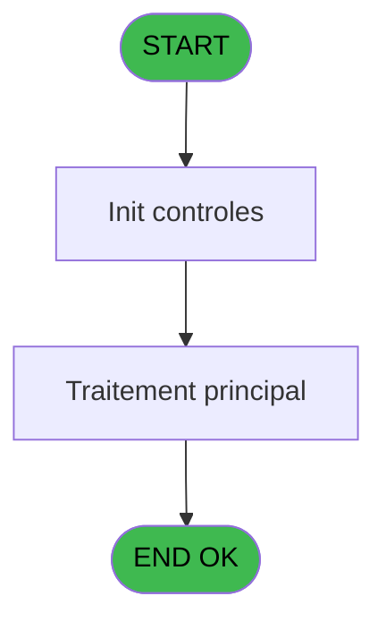
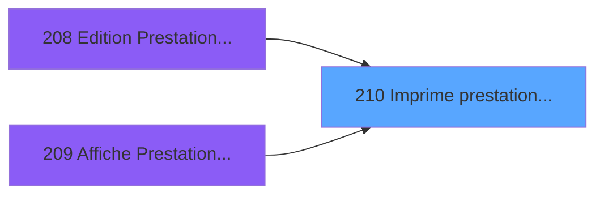

# PBP IDE 210 - Imprime prestation ==V2

> **Analyse**: Phases 1-4 2026-02-03 15:50 -> 15:50 (16s) | Assemblage 15:50
> **Pipeline**: V7.2 Enrichi
> **Structure**: 4 onglets (Resume | Ecrans | Donnees | Connexions)

<!-- TAB:Resume -->

## 1. FICHE D'IDENTITE

| Attribut | Valeur |
|----------|--------|
| Projet | PBP |
| IDE Position | 210 |
| Nom Programme | Imprime prestation ==V2 |
| Fichier source | `Prg_210.xml` |
| Dossier IDE | Liste |
| Taches | 1 (1 ecrans visibles) |
| Tables modifiees | 0 |
| Programmes appeles | 0 |

## 2. DESCRIPTION FONCTIONNELLE

**Imprime prestation ==V2** assure la gestion complete de ce processus, accessible depuis [Edition Prestation ==V2 (IDE 208)](PBP-IDE-208.md), [   Affiche Prestation ==V2 (IDE 209)](PBP-IDE-209.md).

Le flux de traitement s'organise en **1 blocs fonctionnels** :

- **Traitement** (1 tache) : traitements metier divers

**Logique metier** : 3 regles identifiees couvrant conditions metier.

## 3. BLOCS FONCTIONNELS

### 3.1 Traitement (1 tache)

Traitements internes.

---

#### 210 - Veuillez patienter ... [[ECRAN]](#ecran-t1)

**Role** : Traitement : Veuillez patienter ....
**Ecran** : 429 x 59 DLU (MDI) | [Voir mockup](#ecran-t1)

## 5. REGLES METIER

3 regles identifiees:

### Autres (3 regles)

#### [RM-001] Traitement si Trim(VG36) est renseigne

| Element | Detail |
|---------|--------|
| **Condition** | `Trim(VG36)<>''` |
| **Si vrai** | VG36 |
| **Si faux** | ';') |
| **Expression source** | Expression 4 : `IF(Trim(VG36)<>'',VG36,';')` |
| **Exemple** | Si Trim(VG36)<>'' → VG36. Sinon → ';') |

#### [RM-002] Si P.i.TypePrestation [A]='P' alors 17 sinon 20.45)

| Element | Detail |
|---------|--------|
| **Condition** | `P.i.TypePrestation [A]='P'` |
| **Si vrai** | 17 |
| **Si faux** | 20.45) |
| **Variables** | A (P.i.TypePrestation) |
| **Expression source** | Expression 19 : `IF (P.i.TypePrestation [A]='P',17,20.45)` |
| **Exemple** | Si P.i.TypePrestation [A]='P' → 17. Sinon → 20.45) |

#### [RM-003] Si v.Prenom [Q] vaut 'H' alors 'Mr', sinon 'Me'

| Element | Detail |
|---------|--------|
| **Condition** | `v.Prenom [Q]='H'` |
| **Si vrai** | 'Mr' |
| **Si faux** | 'Me') |
| **Variables** | Q (v.Prenom) |
| **Expression source** | Expression 22 : `IF(v.Prenom [Q]='H','Mr','Me')` |
| **Exemple** | Si v.Prenom [Q]='H' → 'Mr'. Sinon → 'Me') |

## 6. CONTEXTE

- **Appele par**: [Edition Prestation ==V2 (IDE 208)](PBP-IDE-208.md), [   Affiche Prestation ==V2 (IDE 209)](PBP-IDE-209.md)
- **Appelle**: 0 programmes | **Tables**: 0 (W:0 R:0 L:0) | **Taches**: 1 | **Expressions**: 26

<!-- TAB:Ecrans -->

## 8. ECRANS

### 8.1 Forms visibles (1 / 1)

| # | Position | Tache | Nom | Type | Largeur | Hauteur | Bloc |
|---|----------|-------|-----|------|---------|---------|------|
| 1 | 210 | 210 | Veuillez patienter ... | MDI | 429 | 59 | Traitement |

### 8.2 Mockups Ecrans

---

#### 210 - Veuillez patienter ...
**Tache** : [210](#t1) | **Type** : MDI | **Dimensions** : 429 x 59 DLU
**Bloc** : Traitement | **Titre IDE** : Veuillez patienter ...

<!-- FORM-DATA:
{
    "width":  429,
    "vFactor":  8,
    "type":  "MDI",
    "hFactor":  8,
    "controls":  [
                     {
                         "x":  0,
                         "type":  "label",
                         "var":  "",
                         "y":  0,
                         "w":  423,
                         "fmt":  "",
                         "name":  "",
                         "h":  29,
                         "color":  "",
                         "text":  "",
                         "parent":  null
                     },
                     {
                         "x":  120,
                         "type":  "label",
                         "var":  "",
                         "y":  10,
                         "w":  221,
                         "fmt":  "",
                         "name":  "",
                         "h":  8,
                         "color":  "7",
                         "text":  "Impression en cours ...",
                         "parent":  null
                     },
                     {
                         "x":  0,
                         "type":  "label",
                         "var":  "",
                         "y":  29,
                         "w":  423,
                         "fmt":  "",
                         "name":  "",
                         "h":  27,
                         "color":  "",
                         "text":  "",
                         "parent":  null
                     },
                     {
                         "x":  79,
                         "type":  "label",
                         "var":  "",
                         "y":  38,
                         "w":  266,
                         "fmt":  "",
                         "name":  "",
                         "h":  8,
                         "color":  "",
                         "text":  "Liste prestations",
                         "parent":  null
                     },
                     {
                         "x":  4,
                         "type":  "image",
                         "var":  "",
                         "y":  2,
                         "w":  72,
                         "fmt":  "",
                         "name":  "",
                         "h":  25,
                         "color":  "",
                         "text":  "",
                         "parent":  null
                     }
                 ],
    "taskId":  "210",
    "height":  59
}
-->

## 9. NAVIGATION

Ecran unique: **Veuillez patienter ...**

### 9.3 Structure hierarchique (1 tache)

| Position | Tache | Type | Dimensions | Bloc |
|----------|-------|------|------------|------|
| **210.1** | [**Veuillez patienter ...** (210)](#t1) [mockup](#ecran-t1) | MDI | 429x59 | Traitement |

### 9.4 Algorigramme

> **Legende**: Vert = START/END OK | Rouge = END KO | Bleu = Decisions
> *Algorigramme auto-genere. Utiliser `/algorigramme` pour une synthese metier detaillee.*

<!-- TAB:Donnees -->

## 10. TABLES

### Tables utilisees (0)

| ID | Nom | Description | Type | R | W | L | Usages |
|----|-----|-------------|------|---|---|---|--------|

### Colonnes par table (0 / 0 tables avec colonnes identifiees)

## 11. VARIABLES

### 11.1 Parametres entrants (10)

Variables recues du programme appelant ([Edition Prestation ==V2 (IDE 208)](PBP-IDE-208.md)).

| Lettre | Nom | Type | Usage dans |
|--------|-----|------|-----------|
| A | P.i.TypePrestation | Alpha | 4x parametre entrant |
| B | P.i.Clause Where | Alpha | - |
| C | P.i.Order by | Alpha | 3x parametre entrant |
| D | P.i.Selections | Alpha | 2x parametre entrant |
| E | P.i.DateMin | Date | - |
| F | P.i.DateMax | Date | 1x parametre entrant |
| G | P.i.DateMin_Creation | Date | - |
| H | P.i.DateMax_Creation | Date | 1x parametre entrant |
| I | P.i.Excel | Logical | 1x parametre entrant |
| J | P.i.FichierExcel | Alpha | 1x parametre entrant |

### 11.2 Variables de session (15)

Variables persistantes pendant toute la session.

| Lettre | Nom | Type | Usage dans |
|--------|-----|------|-----------|
| K | v.TitreEdition | Alpha | 1x session |
| L | v.TitreEdition_Creation | Alpha | 1x session |
| M | v.Separateur | Alpha | 1x session |
| N | v.LigneExcel | Alpha | 1x session |
| O | v.Compteur Prestation | Numeric | 1x session |
| P | v.Nom | Unicode | 1x session |
| Q | v.Prenom | Unicode | 1x session |
| R | v.Debut Prestation | Unicode | - |
| S | v.Fin Prestation | Unicode | - |
| T | v.Debut Sejour | Unicode | - |
| U | v.Fin Sejour | Unicode | - |
| V | v.Code Prestation | Unicode | - |
| W | v.Libelle Prestation | Unicode | - |
| X | v.Chambre | Unicode | - |
| Y | v.Sexe | Unicode | - |

Toutes les 25 variables (liste complete)

| Cat | Lettre | Nom Variable | Type |
|-----|--------|--------------|------|
| P0 | **A** | P.i.TypePrestation | Alpha |
| P0 | **B** | P.i.Clause Where | Alpha |
| P0 | **C** | P.i.Order by | Alpha |
| P0 | **D** | P.i.Selections | Alpha |
| P0 | **E** | P.i.DateMin | Date |
| P0 | **F** | P.i.DateMax | Date |
| P0 | **G** | P.i.DateMin_Creation | Date |
| P0 | **H** | P.i.DateMax_Creation | Date |
| P0 | **I** | P.i.Excel | Logical |
| P0 | **J** | P.i.FichierExcel | Alpha |
| V. | **K** | v.TitreEdition | Alpha |
| V. | **L** | v.TitreEdition_Creation | Alpha |
| V. | **M** | v.Separateur | Alpha |
| V. | **N** | v.LigneExcel | Alpha |
| V. | **O** | v.Compteur Prestation | Numeric |
| V. | **P** | v.Nom | Unicode |
| V. | **Q** | v.Prenom | Unicode |
| V. | **R** | v.Debut Prestation | Unicode |
| V. | **S** | v.Fin Prestation | Unicode |
| V. | **T** | v.Debut Sejour | Unicode |
| V. | **U** | v.Fin Sejour | Unicode |
| V. | **V** | v.Code Prestation | Unicode |
| V. | **W** | v.Libelle Prestation | Unicode |
| V. | **X** | v.Chambre | Unicode |
| V. | **Y** | v.Sexe | Unicode |

## 12. EXPRESSIONS

**26 / 26 expressions decodees (100%)**

### 12.1 Repartition par type

| Type | Expressions | Regles |
|------|-------------|--------|
| CONCATENATION | 8 | 0 |
| CALCULATION | 1 | 0 |
| CONDITION | 9 | 3 |
| CONSTANTE | 1 | 0 |
| OTHER | 3 | 0 |
| NEGATION | 1 | 0 |
| STRING | 3 | 0 |

### 12.2 Expressions cles par type

#### CONCATENATION (8 expressions)

| Type | IDE | Expression | Regle |
|------|-----|------------|-------|
| CONCATENATION | 16 | `MlsTrans ('Date de création')&' '&MlsTrans('du')&' '&DStr ([AU],'DD/MM/YYYY')&' '&MlsTrans ('au')&' '&DStr ([AV],'DD/MM/YYYY')` | - |
| CONCATENATION | 15 | `MlsTrans ('Prévisionnels prestation(s)')&' '&MlsTrans('du')&' '&DStr (P.i.Order by [C],'DD/MM/YYYY')&' '&MlsTrans ('au')&' '&DStr (P.i.Selections [D],'DD/MM/YYYY')` | - |
| CONCATENATION | 7 | `ExpCalc('27'EXP)&[AQ]&Trim(P.i.DateMax_Creation [H])&[AQ]&Trim(P.i.Excel [I])&[AQ]&Trim(P.i.FichierExcel [J])&[AQ]&Trim(v.TitreEdition [K])&[AQ]&Trim(v.TitreEdition_Creation [L])&[AQ]&Trim(v.Separateur [M])&[AQ]&Trim(v.LigneExcel [N])&[AQ]&Trim(v.Compteur Prestation [O])&[AQ]&Trim(v.Nom [P])` | - |
| CONCATENATION | 6 | `'Titre'&[AQ]&'Nom'&[AQ]&'Prenom'&[AQ]&'Prestation Du'&[AQ]&'Prestation Au'&[AQ]&'Séjour Du'&[AQ]&'Séjour Au'&[AQ]&'Code Presta'&[AQ]&'Libelle Presta'&[AQ]&'Chambre'` | - |
| CONCATENATION | 9 | `MlsTrans ('Edition du')&' '&DStr (Date (),'DD/MM/YYYY')&' '&MlsTrans ('à')&' '&TStr (Time (),'HH:MM:SS')` | - |
| ... | | *+3 autres* | |

#### CALCULATION (1 expressions)

| Type | IDE | Expression | Regle |
|------|-----|------------|-------|
| CALCULATION | 20 | `[AT]+1` | - |

#### CONDITION (9 expressions)

| Type | IDE | Expression | Regle |
|------|-----|------------|-------|
| CONDITION | 22 | `IF(v.Prenom [Q]='H','Mr','Me')` | [RM-003](#rm-RM-003) |
| CONDITION | 4 | `IF(Trim(VG36)<>'',VG36,';')` | [RM-001](#rm-RM-001) |
| CONDITION | 19 | `IF (P.i.TypePrestation [A]='P',17,20.45)` | [RM-002](#rm-RM-002) |
| CONDITION | 17 | `Counter (0)>1 AND NOT [AP]` | - |
| CONDITION | 18 | `INIGet ('[MAGIC_LOGICAL_NAMES]preview')='O'` | - |
| ... | | *+4 autres* | |

#### CONSTANTE (1 expressions)

| Type | IDE | Expression | Regle |
|------|-----|------------|-------|
| CONSTANTE | 21 | `0` | - |

#### OTHER (3 expressions)

| Type | IDE | Expression | Regle |
|------|-----|------------|-------|
| OTHER | 8 | `'Village '&GetParam ('VILLAGE')` | - |
| OTHER | 2 | `IsFirstRecordCycle (0)` | - |
| OTHER | 1 | `[AP]` | - |

#### NEGATION (1 expressions)

| Type | IDE | Expression | Regle |
|------|-----|------------|-------|
| NEGATION | 3 | `NOT [AP]` | - |

#### STRING (3 expressions)

| Type | IDE | Expression | Regle |
|------|-----|------------|-------|
| STRING | 24 | `Trim([AX])` | - |
| STRING | 23 | `Trim([AS])` | - |
| STRING | 5 | `Trim([AO])` | - |

### 12.3 Toutes les expressions (26)

Voir les 26 expressions

#### CONCATENATION (8)

| IDE | Expression Decodee |
|-----|-------------------|
| 12 | `'- '&Str (Page (0,1),'3P0Z0')&' -'` |
| 9 | `MlsTrans ('Edition du')&' '&DStr (Date (),'DD/MM/YYYY')&' '&MlsTrans ('à')&' '&TStr (Time (),'HH:MM:SS')` |
| 13 | `MlsTrans ('Presents Prestation(s)')&' '&MlsTrans ('du')&' '&DStr (P.i.Order by [C],'DD/MM/YYYY')` |
| 14 | `MlsTrans ('Arrivants prestation(s)')&' '&MlsTrans('du')&' '&DStr (P.i.Order by [C],'DD/MM/YYYY')&' '&MlsTrans ('au')&' '&DStr (P.i.Selections [D],'DD/MM/YYYY')` |
| 15 | `MlsTrans ('Prévisionnels prestation(s)')&' '&MlsTrans('du')&' '&DStr (P.i.Order by [C],'DD/MM/YYYY')&' '&MlsTrans ('au')&' '&DStr (P.i.Selections [D],'DD/MM/YYYY')` |
| 16 | `MlsTrans ('Date de création')&' '&MlsTrans('du')&' '&DStr ([AU],'DD/MM/YYYY')&' '&MlsTrans ('au')&' '&DStr ([AV],'DD/MM/YYYY')` |
| 6 | `'Titre'&[AQ]&'Nom'&[AQ]&'Prenom'&[AQ]&'Prestation Du'&[AQ]&'Prestation Au'&[AQ]&'Séjour Du'&[AQ]&'Séjour Au'&[AQ]&'Code Presta'&[AQ]&'Libelle Presta'&[AQ]&'Chambre'` |
| 7 | `ExpCalc('27'EXP)&[AQ]&Trim(P.i.DateMax_Creation [H])&[AQ]&Trim(P.i.Excel [I])&[AQ]&Trim(P.i.FichierExcel [J])&[AQ]&Trim(v.TitreEdition [K])&[AQ]&Trim(v.TitreEdition_Creation [L])&[AQ]&Trim(v.Separateur [M])&[AQ]&Trim(v.LigneExcel [N])&[AQ]&Trim(v.Compteur Prestation [O])&[AQ]&Trim(v.Nom [P])` |

#### CALCULATION (1)

| IDE | Expression Decodee |
|-----|-------------------|
| 20 | `[AT]+1` |

#### CONDITION (9)

| IDE | Expression Decodee |
|-----|-------------------|
| 25 | `[AU]<>'00/00/0000'DATE AND [AV]<>'00/00/0000'DATE` |
| 4 | `IF(Trim(VG36)<>'',VG36,';')` |
| 19 | `IF (P.i.TypePrestation [A]='P',17,20.45)` |
| 22 | `IF(v.Prenom [Q]='H','Mr','Me')` |
| 10 | `P.i.TypePrestation [A]='P'` |
| 11 | `P.i.TypePrestation [A]='A'` |
| 17 | `Counter (0)>1 AND NOT [AP]` |
| 18 | `INIGet ('[MAGIC_LOGICAL_NAMES]preview')='O'` |
| 26 | `P.i.TypePrestation [A]='V'` |

#### CONSTANTE (1)

| IDE | Expression Decodee |
|-----|-------------------|
| 21 | `0` |

#### OTHER (3)

| IDE | Expression Decodee |
|-----|-------------------|
| 1 | `[AP]` |
| 2 | `IsFirstRecordCycle (0)` |
| 8 | `'Village '&GetParam ('VILLAGE')` |

#### NEGATION (1)

| IDE | Expression Decodee |
|-----|-------------------|
| 3 | `NOT [AP]` |

#### STRING (3)

| IDE | Expression Decodee |
|-----|-------------------|
| 5 | `Trim([AO])` |
| 23 | `Trim([AS])` |
| 24 | `Trim([AX])` |

<!-- TAB:Connexions -->

## 13. GRAPHE D'APPELS

### 13.1 Chaine depuis Main (Callers)

Main -> ... -> [Edition Prestation ==V2 (IDE 208)](PBP-IDE-208.md) -> **Imprime prestation ==V2 (IDE 210)**

Main -> ... -> [   Affiche Prestation ==V2 (IDE 209)](PBP-IDE-209.md) -> **Imprime prestation ==V2 (IDE 210)**

### 13.2 Callers

| IDE | Nom Programme | Nb Appels |
|-----|---------------|-----------|
| [208](PBP-IDE-208.md) | Edition Prestation ==V2 | 2 |
| [209](PBP-IDE-209.md) |    Affiche Prestation ==V2 | 1 |

### 13.3 Callees (programmes appeles)

### 13.4 Detail Callees avec contexte

| IDE | Nom Programme | Appels | Contexte |
|-----|---------------|--------|----------|
| - | (aucun) | - | - |

## 14. RECOMMANDATIONS MIGRATION

### 14.1 Profil du programme

| Metrique | Valeur | Impact migration |
|----------|--------|-----------------|
| Lignes de logique | 58 | Programme compact |
| Expressions | 26 | Peu de logique |
| Tables WRITE | 0 | Impact faible |
| Sous-programmes | 0 | Peu de dependances |
| Ecrans visibles | 1 | Ecran unique ou traitement batch |
| Code desactive | 0% (0 / 58) | Code sain |
| Regles metier | 3 | Quelques regles a preserver |

### 14.2 Plan de migration par bloc

#### Traitement (1 tache: 1 ecran, 0 traitement)

- **Strategie** : 1 composant(s) UI (Razor/React) avec formulaires et validation.
- Decomposer les taches en services unitaires testables.

### 14.3 Dependances critiques

| Dependance | Type | Appels | Impact |
|------------|------|--------|--------|

---
*Spec DETAILED generee par Pipeline V7.2 - 2026-02-03 15:50*
