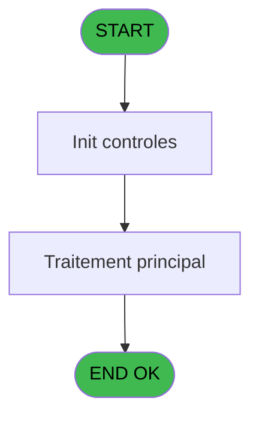
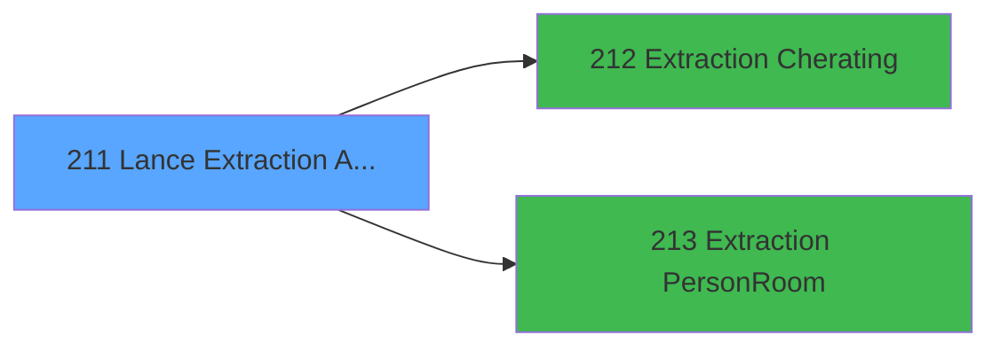

# PBP IDE 211 - Lance Extraction Asie/Bresil

> **Analyse**: Phases 1-4 2026-02-03 15:50 -> 15:50 (15s) | Assemblage 15:50
> **Pipeline**: V7.2 Enrichi
> **Structure**: 4 onglets (Resume | Ecrans | Donnees | Connexions)

<!-- TAB:Resume -->

## 1. FICHE D'IDENTITE

| Attribut | Valeur |
|----------|--------|
| Projet | PBP |
| IDE Position | 211 |
| Nom Programme | Lance Extraction Asie/Bresil |
| Fichier source | `Prg_211.xml` |
| Dossier IDE | Liste |
| Taches | 1 (1 ecrans visibles) |
| Tables modifiees | 0 |
| Programmes appeles | 2 |
| :warning: Statut | **ORPHELIN_POTENTIEL** |

## 2. DESCRIPTION FONCTIONNELLE

**Lance Extraction Asie/Bresil** assure la gestion complete de ce processus.

Le flux de traitement s'organise en **1 blocs fonctionnels** :

- **Traitement** (1 tache) : traitements metier divers

**Logique metier** : 1 regles identifiees couvrant conditions metier.

## 3. BLOCS FONCTIONNELS

### 3.1 Traitement (1 tache)

Traitements internes.

---

#### 211 - Extraction GM [[ECRAN]](#ecran-t1)

**Role** : Traitement : Extraction GM.
**Ecran** : 605 x 172 DLU (MDI) | [Voir mockup](#ecran-t1)
**Delegue a** : [Extraction Cherating (IDE 212)](PBP-IDE-212.md), [Extraction Person/Room (IDE 213)](PBP-IDE-213.md)

## 5. REGLES METIER

1 regles identifiees:

### Autres (1 regles)

#### [RM-001] Si VG69 alors BOM(Date()) sinon Date())

| Element | Detail |
|---------|--------|
| **Condition** | `VG69` |
| **Si vrai** | BOM(Date()) |
| **Si faux** | Date()) |
| **Expression source** | Expression 4 : `IF(VG69,BOM(Date()),Date())` |
| **Exemple** | Si VG69 → BOM(Date()). Sinon → Date()) |

## 6. CONTEXTE

- **Appele par**: (aucun)
- **Appelle**: 2 programmes | **Tables**: 0 (W:0 R:0 L:0) | **Taches**: 1 | **Expressions**: 16

<!-- TAB:Ecrans -->

## 8. ECRANS

### 8.1 Forms visibles (1 / 1)

| # | Position | Tache | Nom | Type | Largeur | Hauteur | Bloc |
|---|----------|-------|-----|------|---------|---------|------|
| 1 | 211 | 211 | Extraction GM | MDI | 605 | 172 | Traitement |

### 8.2 Mockups Ecrans

---

#### 211 - Extraction GM
**Tache** : [211](#t1) | **Type** : MDI | **Dimensions** : 605 x 172 DLU
**Bloc** : Traitement | **Titre IDE** : Extraction GM

<!-- FORM-DATA:
{
    "width":  605,
    "vFactor":  8,
    "type":  "MDI",
    "hFactor":  8,
    "controls":  [
                     {
                         "x":  0,
                         "type":  "label",
                         "var":  "",
                         "y":  0,
                         "w":  593,
                         "fmt":  "",
                         "name":  "",
                         "h":  19,
                         "color":  "",
                         "text":  "",
                         "parent":  null
                     },
                     {
                         "x":  40,
                         "type":  "label",
                         "var":  "",
                         "y":  24,
                         "w":  330,
                         "fmt":  "",
                         "name":  "",
                         "h":  111,
                         "color":  "",
                         "text":  "",
                         "parent":  null
                     },
                     {
                         "x":  378,
                         "type":  "label",
                         "var":  "",
                         "y":  24,
                         "w":  186,
                         "fmt":  "",
                         "name":  "",
                         "h":  111,
                         "color":  "",
                         "text":  "",
                         "parent":  null
                     },
                     {
                         "x":  83,
                         "type":  "label",
                         "var":  "",
                         "y":  33,
                         "w":  46,
                         "fmt":  "",
                         "name":  "",
                         "h":  10,
                         "color":  "",
                         "text":  "Du",
                         "parent":  5
                     },
                     {
                         "x":  45,
                         "type":  "line",
                         "var":  "",
                         "y":  72,
                         "w":  323,
                         "fmt":  "",
                         "name":  "",
                         "h":  0,
                         "color":  "",
                         "text":  "",
                         "parent":  5
                     },
                     {
                         "x":  45,
                         "type":  "line",
                         "var":  "",
                         "y":  99,
                         "w":  323,
                         "fmt":  "",
                         "name":  "",
                         "h":  0,
                         "color":  "",
                         "text":  "",
                         "parent":  5
                     },
                     {
                         "x":  99,
                         "type":  "label",
                         "var":  "",
                         "y":  113,
                         "w":  116,
                         "fmt":  "",
                         "name":  "",
                         "h":  9,
                         "color":  "",
                         "text":  "Sélections",
                         "parent":  5
                     },
                     {
                         "x":  2,
                         "type":  "label",
                         "var":  "",
                         "y":  143,
                         "w":  593,
                         "fmt":  "",
                         "name":  "",
                         "h":  24,
                         "color":  "",
                         "text":  "",
                         "parent":  null
                     },
                     {
                         "x":  83,
                         "type":  "label",
                         "var":  "",
                         "y":  51,
                         "w":  46,
                         "fmt":  "",
                         "name":  "",
                         "h":  10,
                         "color":  "",
                         "text":  "Au",
                         "parent":  5
                     },
                     {
                         "x":  136,
                         "type":  "edit",
                         "var":  "",
                         "y":  33,
                         "w":  126,
                         "fmt":  "DD/MM/YYYY",
                         "name":  "w0_Date",
                         "h":  10,
                         "color":  "110",
                         "text":  "",
                         "parent":  5
                     },
                     {
                         "x":  264,
                         "type":  "button",
                         "var":  "",
                         "y":  33,
                         "w":  27,
                         "fmt":  "...",
                         "name":  "b_Date",
                         "h":  10,
                         "color":  "",
                         "text":  "",
                         "parent":  5
                     },
                     {
                         "x":  235,
                         "type":  "edit",
                         "var":  "",
                         "y":  113,
                         "w":  56,
                         "fmt":  "",
                         "name":  "",
                         "h":  9,
                         "color":  "",
                         "text":  "",
                         "parent":  5
                     },
                     {
                         "x":  394,
                         "type":  "button",
                         "var":  "",
                         "y":  108,
                         "w":  154,
                         "fmt":  "\u0026Extraction",
                         "name":  "b_Imprimer",
                         "h":  18,
                         "color":  "",
                         "text":  "",
                         "parent":  6
                     },
                     {
                         "x":  6,
                         "type":  "edit",
                         "var":  "",
                         "y":  2,
                         "w":  267,
                         "fmt":  "30",
                         "name":  "",
                         "h":  8,
                         "color":  "",
                         "text":  "",
                         "parent":  1
                     },
                     {
                         "x":  383,
                         "type":  "edit",
                         "var":  "",
                         "y":  6,
                         "w":  203,
                         "fmt":  "WWW DD MMM YYYYT",
                         "name":  "",
                         "h":  8,
                         "color":  "",
                         "text":  "",
                         "parent":  1
                     },
                     {
                         "x":  6,
                         "type":  "edit",
                         "var":  "",
                         "y":  10,
                         "w":  267,
                         "fmt":  "30",
                         "name":  "",
                         "h":  8,
                         "color":  "",
                         "text":  "",
                         "parent":  1
                     },
                     {
                         "x":  402,
                         "type":  "image",
                         "var":  "",
                         "y":  29,
                         "w":  136,
                         "fmt":  "",
                         "name":  "",
                         "h":  54,
                         "color":  "",
                         "text":  "",
                         "parent":  6
                     },
                     {
                         "x":  10,
                         "type":  "button",
                         "var":  "",
                         "y":  146,
                         "w":  154,
                         "fmt":  "\u0026Quitter",
                         "name":  "",
                         "h":  18,
                         "color":  "",
                         "text":  "",
                         "parent":  15
                     },
                     {
                         "x":  136,
                         "type":  "edit",
                         "var":  "",
                         "y":  51,
                         "w":  126,
                         "fmt":  "DD/MM/YYYY",
                         "name":  "w0_Date Fin_0001",
                         "h":  10,
                         "color":  "110",
                         "text":  "",
                         "parent":  5
                     },
                     {
                         "x":  264,
                         "type":  "button",
                         "var":  "",
                         "y":  51,
                         "w":  27,
                         "fmt":  "...",
                         "name":  "b_Date Fin",
                         "h":  10,
                         "color":  "",
                         "text":  "",
                         "parent":  5
                     },
                     {
                         "x":  78,
                         "type":  "combobox",
                         "var":  "",
                         "y":  80,
                         "w":  245,
                         "fmt":  "",
                         "name":  "w0_choix",
                         "h":  12,
                         "color":  "",
                         "text":  "G,R",
                         "parent":  5
                     }
                 ],
    "taskId":  "211",
    "height":  172
}
-->

<strong>Champs : 7 champs</strong>

| Pos (x,y) | Nom | Variable | Type |
|-----------|-----|----------|------|
| 136,33 | w0_Date | - | edit |
| 235,113 | (sans nom) | - | edit |
| 6,2 | 30 | - | edit |
| 383,6 | WWW DD MMM YYYYT | - | edit |
| 6,10 | 30 | - | edit |
| 136,51 | w0_Date Fin_0001 | - | edit |
| 78,80 | w0_choix | - | combobox |

<strong>Boutons : 4 boutons</strong>

| Bouton | Pos (x,y) | Action |
|--------|-----------|--------|
| ... | 264,33 | Bouton fonctionnel |
| Extraction | 394,108 | Appel [Extraction Cherating (IDE 212)](PBP-IDE-212.md) |
| Quitter | 10,146 | Quitte le programme |
| ... | 264,51 | Bouton fonctionnel |

## 9. NAVIGATION

Ecran unique: **Extraction GM**

### 9.3 Structure hierarchique (1 tache)

| Position | Tache | Type | Dimensions | Bloc |
|----------|-------|------|------------|------|
| **211.1** | [**Extraction GM** (211)](#t1) [mockup](#ecran-t1) | MDI | 605x172 | Traitement |

### 9.4 Algorigramme

> **Legende**: Vert = START/END OK | Rouge = END KO | Bleu = Decisions
> *Algorigramme auto-genere. Utiliser `/algorigramme` pour une synthese metier detaillee.*

<!-- TAB:Donnees -->

## 10. TABLES

### Tables utilisees (0)

| ID | Nom | Description | Type | R | W | L | Usages |
|----|-----|-------------|------|---|---|---|--------|

### Colonnes par table (0 / 0 tables avec colonnes identifiees)

## 11. VARIABLES

### 11.1 Autres (7)

Variables diverses.

| Lettre | Nom | Type | Usage dans |
|--------|-----|------|-----------|
| A | w0_Date Debut | Date | - |
| B | b_Date Debut | Alpha | 1x refs |
| C | w0_Date Fin | Date | - |
| D | b_Date Fin | Alpha | - |
| E | w0_choix | Alpha | 1x refs |
| F | w0_NbSelect | Numeric | - |
| G | b_Imprimer | Alpha | - |

## 12. EXPRESSIONS

**16 / 16 expressions decodees (100%)**

### 12.1 Repartition par type

| Type | Expressions | Regles |
|------|-------------|--------|
| CONDITION | 5 | 5 |
| CONSTANTE | 3 | 0 |
| DATE | 1 | 0 |
| FORMAT | 1 | 0 |
| REFERENCE_VG | 3 | 0 |
| OTHER | 3 | 0 |

### 12.2 Expressions cles par type

#### CONDITION (5 expressions)

| Type | IDE | Expression | Regle |
|------|-----|------------|-------|
| CONDITION | 4 | `IF(VG69,BOM(Date()),Date())` | [RM-001](#rm-RM-001) |
| CONDITION | 16 | `IF(VG69,'Number of nights per GM,Number of nights per Room','All,Validated (Presents),Not Validated (Arrivals)')` | - |
| CONDITION | 9 | `w0_choix [E]=0` | - |
| CONDITION | 11 | `IF(VG69,'R','A')` | - |
| CONDITION | 15 | `IF(VG69,'G,R','A,V,N')` | - |

#### CONSTANTE (3 expressions)

| Type | IDE | Expression | Regle |
|------|-----|------------|-------|
| CONSTANTE | 10 | `0` | - |
| CONSTANTE | 2 | `'&Imprimer'` | - |
| CONSTANTE | 1 | `'...'` | - |

#### DATE (1 expressions)

| Type | IDE | Expression | Regle |
|------|-----|------------|-------|
| DATE | 5 | `EOM(Date())` | - |

#### FORMAT (1 expressions)

| Type | IDE | Expression | Regle |
|------|-----|------------|-------|
| FORMAT | 12 | `Translate('%club_exportdata%')&'GM_'&DStr(b_Date Debut [B],'YYYYMMDD')&'_'&DStr([X],'YYYYMMDD')&'.CSV'` | - |

#### REFERENCE_VG (3 expressions)

| Type | IDE | Expression | Regle |
|------|-----|------------|-------|
| REFERENCE_VG | 14 | `VG72` | - |
| REFERENCE_VG | 13 | `VG69` | - |
| REFERENCE_VG | 3 | `VG2` | - |

#### OTHER (3 expressions)

| Type | IDE | Expression | Regle |
|------|-----|------------|-------|
| OTHER | 8 | `GetParam ('VILLAGE')` | - |
| OTHER | 7 | `SetCrsr (1)` | - |
| OTHER | 6 | `SetCrsr (2)` | - |

<!-- TAB:Connexions -->

## 13. GRAPHE D'APPELS

### 13.1 Chaine depuis Main (Callers)

**Chemin**: (pas de callers directs)

### 13.2 Callers

| IDE | Nom Programme | Nb Appels |
|-----|---------------|-----------|
| - | (aucun) | - |

### 13.3 Callees (programmes appeles)

### 13.4 Detail Callees avec contexte

| IDE | Nom Programme | Appels | Contexte |
|-----|---------------|--------|----------|
| [212](PBP-IDE-212.md) | Extraction Cherating | 1 | Sous-programme |
| [213](PBP-IDE-213.md) | Extraction Person/Room | 1 | Sous-programme |

## 14. RECOMMANDATIONS MIGRATION

### 14.1 Profil du programme

| Metrique | Valeur | Impact migration |
|----------|--------|-----------------|
| Lignes de logique | 29 | Programme compact |
| Expressions | 16 | Peu de logique |
| Tables WRITE | 0 | Impact faible |
| Sous-programmes | 2 | Peu de dependances |
| Ecrans visibles | 1 | Ecran unique ou traitement batch |
| Code desactive | 0% (0 / 29) | Code sain |
| Regles metier | 1 | Quelques regles a preserver |

### 14.2 Plan de migration par bloc

#### Traitement (1 tache: 1 ecran, 0 traitement)

- **Strategie** : 1 composant(s) UI (Razor/React) avec formulaires et validation.
- 2 sous-programme(s) a migrer ou a reutiliser depuis les services existants.
- Decomposer les taches en services unitaires testables.

### 14.3 Dependances critiques

| Dependance | Type | Appels | Impact |
|------------|------|--------|--------|
| [Extraction Person/Room (IDE 213)](PBP-IDE-213.md) | Sous-programme | 1x | Normale - Sous-programme |
| [Extraction Cherating (IDE 212)](PBP-IDE-212.md) | Sous-programme | 1x | Normale - Sous-programme |

---
*Spec DETAILED generee par Pipeline V7.2 - 2026-02-03 15:50*
