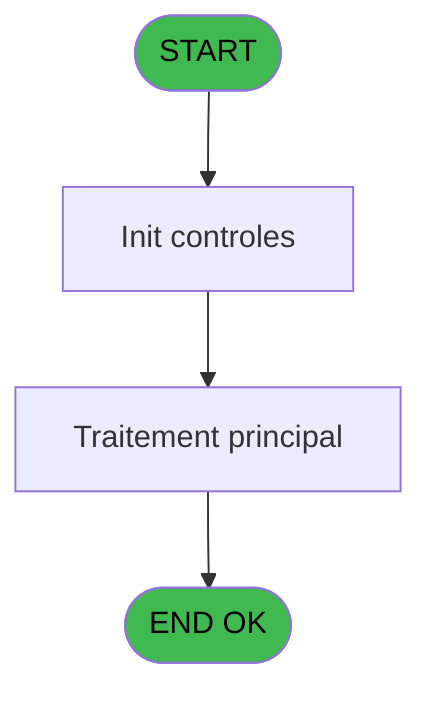

# PBP IDE 212 - Extraction Cherating

> **Analyse**: Phases 1-4 2026-02-03 15:50 -> 15:51 (14s) | Assemblage 15:51
> **Pipeline**: V7.2 Enrichi
> **Structure**: 4 onglets (Resume | Ecrans | Donnees | Connexions)

<!-- TAB:Resume -->

## 1. FICHE D'IDENTITE

| Attribut | Valeur |
|----------|--------|
| Projet | PBP |
| IDE Position | 212 |
| Nom Programme | Extraction Cherating |
| Fichier source | `Prg_212.xml` |
| Dossier IDE | Liste |
| Taches | 1 (0 ecrans visibles) |
| Tables modifiees | 0 |
| Programmes appeles | 0 |

## 2. DESCRIPTION FONCTIONNELLE

**Extraction Cherating** assure la gestion complete de ce processus, accessible depuis [Lance Extraction Asie/Bresil (IDE 211)](PBP-IDE-211.md).

Le flux de traitement s'organise en **1 blocs fonctionnels** :

- **Traitement** (1 tache) : traitements metier divers

**Logique metier** : 3 regles identifiees couvrant conditions metier.

## 3. BLOCS FONCTIONNELS

### 3.1 Traitement (1 tache)

Traitements internes.

---

#### 212 - Extraction Cherating

**Role** : Traitement : Extraction Cherating.

## 5. REGLES METIER

3 regles identifiees:

### Autres (3 regles)

#### [RM-001] Traitement si Trim([S]) est renseigne

| Element | Detail |
|---------|--------|
| **Condition** | `Trim([S])<>''` |
| **Si vrai** | Trim([S]) |
| **Si faux** | Trim([AF])) |
| **Expression source** | Expression 11 : `IF(Trim([S])<>'',Trim([S]),Trim([AF]))` |
| **Exemple** | Si Trim([S])<>'' → Trim([S]). Sinon → Trim([AF])) |

#### [RM-002] Traitement si Trim([Q]) est renseigne

| Element | Detail |
|---------|--------|
| **Condition** | `Trim([Q])<>''` |
| **Si vrai** | Trim([Q]) |
| **Si faux** | Trim([AA])) |
| **Expression source** | Expression 13 : `IF(Trim([Q])<>'',Trim([Q]),Trim([AA]))` |
| **Exemple** | Si Trim([Q])<>'' → Trim([Q]). Sinon → Trim([AA])) |

#### [RM-003] Traitement si Trim([R]) est renseigne

| Element | Detail |
|---------|--------|
| **Condition** | `Trim([R])<>''` |
| **Si vrai** | Trim([R]) |
| **Si faux** | Trim([AG])) |
| **Expression source** | Expression 14 : `IF(Trim([R])<>'',Trim([R]),Trim([AG]))` |
| **Exemple** | Si Trim([R])<>'' → Trim([R]). Sinon → Trim([AG])) |

## 6. CONTEXTE

- **Appele par**: [Lance Extraction Asie/Bresil (IDE 211)](PBP-IDE-211.md)
- **Appelle**: 0 programmes | **Tables**: 5 (W:0 R:1 L:4) | **Taches**: 1 | **Expressions**: 21

<!-- TAB:Ecrans -->

## 8. ECRANS

*(Programme sans ecran visible)*

## 9. NAVIGATION

### 9.3 Structure hierarchique (1 tache)

| Position | Tache | Type | Dimensions | Bloc |
|----------|-------|------|------------|------|
| **212.1** | [**Extraction Cherating** (212)](#t1) | - | - | Traitement |

### 9.4 Algorigramme

> **Legende**: Vert = START/END OK | Rouge = END KO | Bleu = Decisions
> *Algorigramme auto-genere. Utiliser `/algorigramme` pour une synthese metier detaillee.*

<!-- TAB:Donnees -->

## 10. TABLES

### Tables utilisees (5)

| ID | Nom | Description | Type | R | W | L | Usages |
|----|-----|-------------|------|---|---|---|--------|
| 31 | gm-complet_______gmc |  | DB | R |   |   | 1 |
| 34 | hebergement______heb | Hebergement (chambres) | DB |   |   | L | 1 |
| 108 | code_logement____clo |  | DB |   |   | L | 1 |
| 364 | pms_footer_comment |  | DB |   |   | L | 1 |
| 834 | tpe_par_terminal |  | DB |   |   | L | 1 |

### Colonnes par table (1 / 1 tables avec colonnes identifiees)

Table 31 - gm-complet_______gmc (R) - 1 usages

| Lettre | Variable | Acces | Type |
|--------|----------|-------|------|
| A | p.Date Debut | R | Date |
| B | p Date Fin | R | Date |
| C | p.Choix | R | Alpha |
| D | p.Nb Select | R | Numeric |
| E | Num Chambre | R | Unicode |
| F | Passeport | R | Unicode |
| G | Ligne Export | R | Alpha |
| H | Date Pivot | R | Date |
| I | Nb Nuits | R | Numeric |
| J | Num Chambre Prev | R | Unicode |
| K | Affiche nuits | R | Logical |

## 11. VARIABLES

### 11.1 Parametres entrants (4)

Variables recues du programme appelant ([Lance Extraction Asie/Bresil (IDE 211)](PBP-IDE-211.md)).

| Lettre | Nom | Type | Usage dans |
|--------|-----|------|-----------|
| A | p.Date Debut | Date | 3x parametre entrant |
| B | p Date Fin | Date | 2x parametre entrant |
| C | p.Choix | Alpha | - |
| D | p.Nb Select | Numeric | 1x parametre entrant |

### 11.2 Autres (7)

Variables diverses.

| Lettre | Nom | Type | Usage dans |
|--------|-----|------|-----------|
| E | Num Chambre | Unicode | 2x refs |
| F | Passeport | Unicode | 1x refs |
| G | Ligne Export | Alpha | - |
| H | Date Pivot | Date | - |
| I | Nb Nuits | Numeric | - |
| J | Num Chambre Prev | Unicode | 1x refs |
| K | Affiche nuits | Logical | 1x refs |

## 12. EXPRESSIONS

**21 / 21 expressions decodees (100%)**

### 12.1 Repartition par type

| Type | Expressions | Regles |
|------|-------------|--------|
| CALCULATION | 2 | 0 |
| CONDITION | 4 | 3 |
| CONSTANTE | 5 | 0 |
| FORMAT | 2 | 0 |
| OTHER | 8 | 0 |

### 12.2 Expressions cles par type

#### CALCULATION (2 expressions)

| Type | IDE | Expression | Regle |
|------|-----|------------|-------|
| CALCULATION | 21 | `[AW]+1` | - |
| CALCULATION | 18 | `MIN([O],EOM(p.Date Debut [A])+1)-MAX([N],BOM(p.Date Debut [A]))` | - |

#### CONDITION (4 expressions)

| Type | IDE | Expression | Regle |
|------|-----|------------|-------|
| CONDITION | 14 | `IF(Trim([R])<>'',Trim([R]),Trim([AG]))` | [RM-003](#rm-RM-003) |
| CONDITION | 13 | `IF(Trim([Q])<>'',Trim([Q]),Trim([AA]))` | [RM-002](#rm-RM-002) |
| CONDITION | 11 | `IF(Trim([S])<>'',Trim([S]),Trim([AF]))` | [RM-001](#rm-RM-001) |
| CONDITION | 20 | `[AV]='G' OR (Trim([AJ])<>Trim([AZ])) OR Trim([AJ])=''` | - |

#### CONSTANTE (5 expressions)

| Type | IDE | Expression | Regle |
|------|-----|------------|-------|
| CONSTANTE | 10 | `'F'` | - |
| CONSTANTE | 16 | `'First Name,Family Name,Passport no,Nationality,Date of birth,Check in Date,Check out Date,Room Type,Room Number,No of nights'` | - |
| CONSTANTE | 9 | `'H'` | - |
| CONSTANTE | 1 | `'GM'` | - |
| CONSTANTE | 4 | `'O'` | - |

#### FORMAT (2 expressions)

| Type | IDE | Expression | Regle |
|------|-----|------------|-------|
| FORMAT | 17 | `Trim(Affiche nuits [K])&','&Trim(Num Chambre Prev [J])&','&Trim([AT])&','&Trim([AL])&','&Trim(DStr([M],'DD/MM/YYYY'))&','&Trim(DStr([N],'DD/MM/YYYY'))&','&Trim(DStr([O],'DD/MM/YYYY'))&','&Trim([AS])&','&Trim([AJ])&','&IF([BA],Trim(Str([AY],'4')),'')` | - |
| FORMAT | 15 | `Translate('%club_exportdata%')&'GM_'&DStr(p.Date Debut [A],'YYYYMMDD')&'_'&DStr(p Date Fin [B],'YYYYMMDD')&'.CSV'` | - |

#### OTHER (8 expressions)

| Type | IDE | Expression | Regle |
|------|-----|------------|-------|
| OTHER | 8 | `[N]` | - |
| OTHER | 7 | `Passeport [F]` | - |
| OTHER | 19 | `[AJ]` | - |
| OTHER | 12 | `[P]` | - |
| OTHER | 3 | `p.Date Debut [A]` | - |
| ... | | *+3 autres* | |

### 12.3 Toutes les expressions (21)

Voir les 21 expressions

#### CALCULATION (2)

| IDE | Expression Decodee |
|-----|-------------------|
| 18 | `MIN([O],EOM(p.Date Debut [A])+1)-MAX([N],BOM(p.Date Debut [A]))` |
| 21 | `[AW]+1` |

#### CONDITION (4)

| IDE | Expression Decodee |
|-----|-------------------|
| 11 | `IF(Trim([S])<>'',Trim([S]),Trim([AF]))` |
| 13 | `IF(Trim([Q])<>'',Trim([Q]),Trim([AA]))` |
| 14 | `IF(Trim([R])<>'',Trim([R]),Trim([AG]))` |
| 20 | `[AV]='G' OR (Trim([AJ])<>Trim([AZ])) OR Trim([AJ])=''` |

#### CONSTANTE (5)

| IDE | Expression Decodee |
|-----|-------------------|
| 1 | `'GM'` |
| 4 | `'O'` |
| 9 | `'H'` |
| 10 | `'F'` |
| 16 | `'First Name,Family Name,Passport no,Nationality,Date of birth,Check in Date,Check out Date,Room Type,Room Number,No of nights'` |

#### FORMAT (2)

| IDE | Expression Decodee |
|-----|-------------------|
| 15 | `Translate('%club_exportdata%')&'GM_'&DStr(p.Date Debut [A],'YYYYMMDD')&'_'&DStr(p Date Fin [B],'YYYYMMDD')&'.CSV'` |
| 17 | `Trim(Affiche nuits [K])&','&Trim(Num Chambre Prev [J])&','&Trim([AT])&','&Trim([AL])&','&Trim(DStr([M],'DD/MM/YYYY'))&','&Trim(DStr([N],'DD/MM/YYYY'))&','&Trim(DStr([O],'DD/MM/YYYY'))&','&Trim([AS])&','&Trim([AJ])&','&IF([BA],Trim(Str([AY],'4')),'')` |

#### OTHER (8)

| IDE | Expression Decodee |
|-----|-------------------|
| 2 | `p Date Fin [B]` |
| 3 | `p.Date Debut [A]` |
| 5 | `p.Nb Select [D]` |
| 6 | `Num Chambre [E]` |
| 7 | `Passeport [F]` |
| 8 | `[N]` |
| 12 | `[P]` |
| 19 | `[AJ]` |

<!-- TAB:Connexions -->

## 13. GRAPHE D'APPELS

### 13.1 Chaine depuis Main (Callers)

Main -> ... -> [Lance Extraction Asie/Bresil (IDE 211)](PBP-IDE-211.md) -> **Extraction Cherating (IDE 212)**

### 13.2 Callers

| IDE | Nom Programme | Nb Appels |
|-----|---------------|-----------|
| [211](PBP-IDE-211.md) | Lance Extraction Asie/Bresil | 1 |

### 13.3 Callees (programmes appeles)

### 13.4 Detail Callees avec contexte

| IDE | Nom Programme | Appels | Contexte |
|-----|---------------|--------|----------|
| - | (aucun) | - | - |

## 14. RECOMMANDATIONS MIGRATION

### 14.1 Profil du programme

| Metrique | Valeur | Impact migration |
|----------|--------|-----------------|
| Lignes de logique | 70 | Programme compact |
| Expressions | 21 | Peu de logique |
| Tables WRITE | 0 | Impact faible |
| Sous-programmes | 0 | Peu de dependances |
| Ecrans visibles | 0 | Ecran unique ou traitement batch |
| Code desactive | 0% (0 / 70) | Code sain |
| Regles metier | 3 | Quelques regles a preserver |

### 14.2 Plan de migration par bloc

#### Traitement (1 tache: 0 ecran, 1 traitement)

- **Strategie** : 1 service(s) backend injectable(s) (Domain Services).
- Decomposer les taches en services unitaires testables.

### 14.3 Dependances critiques

| Dependance | Type | Appels | Impact |
|------------|------|--------|--------|

---
*Spec DETAILED generee par Pipeline V7.2 - 2026-02-03 15:51*
