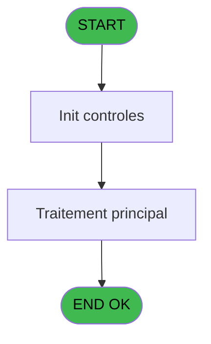

# PBP IDE 213 - Extraction Person/Room

> **Analyse**: Phases 1-4 2026-02-03 15:51 -> 15:51 (15s) | Assemblage 15:51
> **Pipeline**: V7.2 Enrichi
> **Structure**: 4 onglets (Resume | Ecrans | Donnees | Connexions)

<!-- TAB:Resume -->

## 1. FICHE D'IDENTITE

| Attribut | Valeur |
|----------|--------|
| Projet | PBP |
| IDE Position | 213 |
| Nom Programme | Extraction Person/Room |
| Fichier source | `Prg_213.xml` |
| Dossier IDE | Liste |
| Taches | 1 (0 ecrans visibles) |
| Tables modifiees | 0 |
| Programmes appeles | 0 |

## 2. DESCRIPTION FONCTIONNELLE

**Extraction Person/Room** assure la gestion complete de ce processus, accessible depuis [Lance Extraction Asie/Bresil (IDE 211)](PBP-IDE-211.md).

Le flux de traitement s'organise en **1 blocs fonctionnels** :

- **Traitement** (1 tache) : traitements metier divers

## 3. BLOCS FONCTIONNELS

### 3.1 Traitement (1 tache)

Traitements internes.

---

#### 213 - Extraction Person/Room

**Role** : Traitement : Extraction Person/Room.

## 5. REGLES METIER

*(Aucune regle metier identifiee)*

## 6. CONTEXTE

- **Appele par**: [Lance Extraction Asie/Bresil (IDE 211)](PBP-IDE-211.md)
- **Appelle**: 0 programmes | **Tables**: 0 (W:0 R:0 L:0) | **Taches**: 1 | **Expressions**: 8

<!-- TAB:Ecrans -->

## 8. ECRANS

*(Programme sans ecran visible)*

## 9. NAVIGATION

### 9.3 Structure hierarchique (1 tache)

| Position | Tache | Type | Dimensions | Bloc |
|----------|-------|------|------------|------|
| **213.1** | [**Extraction Person/Room** (213)](#t1) | - | - | Traitement |

### 9.4 Algorigramme

> **Legende**: Vert = START/END OK | Rouge = END KO | Bleu = Decisions
> *Algorigramme auto-genere. Utiliser `/algorigramme` pour une synthese metier detaillee.*

<!-- TAB:Donnees -->

## 10. TABLES

### Tables utilisees (0)

| ID | Nom | Description | Type | R | W | L | Usages |
|----|-----|-------------|------|---|---|---|--------|

### Colonnes par table (0 / 0 tables avec colonnes identifiees)

## 11. VARIABLES

### 11.1 Parametres entrants (4)

Variables recues du programme appelant ([Lance Extraction Asie/Bresil (IDE 211)](PBP-IDE-211.md)).

| Lettre | Nom | Type | Usage dans |
|--------|-----|------|-----------|
| A | P.Date Debut | Date | 1x parametre entrant |
| B | P.Date Fin | Date | 1x parametre entrant |
| C | P.Choix | Alpha | 1x parametre entrant |
| D | P.Nb Select | Numeric | 1x parametre entrant |

### 11.2 Variables de session (1)

Variables persistantes pendant toute la session.

| Lettre | Nom | Type | Usage dans |
|--------|-----|------|-----------|
| J | v.ligne export | Alpha | - |

### 11.3 Autres (5)

Variables diverses.

| Lettre | Nom | Type | Usage dans |
|--------|-----|------|-----------|
| E | nb_personne | Numeric | 1x refs |
| F | NB_Chambres | Numeric | 2x refs |
| G | heb_date_debut | Alpha | 2x refs |
| H | heb_date_fin | Alpha | 1x refs |
| I | TypeStay | Alpha | - |

## 12. EXPRESSIONS

**8 / 8 expressions decodees (100%)**

### 12.1 Repartition par type

| Type | Expressions | Regles |
|------|-------------|--------|
| CONDITION | 2 | 0 |
| CONSTANTE | 1 | 0 |
| FORMAT | 4 | 0 |
| OTHER | 1 | 0 |

### 12.2 Expressions cles par type

#### CONDITION (2 expressions)

| Type | IDE | Expression | Regle |
|------|-----|------------|-------|
| CONDITION | 6 | `Counter(0)=1` | - |
| CONDITION | 3 | `CASE(heb_date_fin [H],'V',' AND H1.heb_statut_sejour=''P''','N',' AND H1.heb_statut_sejour<>''P''','')` | - |

#### CONSTANTE (1 expressions)

| Type | IDE | Expression | Regle |
|------|-----|------------|-------|
| CONSTANTE | 5 | `'Village,Persons,Rooms,Beginning Date, Ending Date, Type'` | - |

#### FORMAT (4 expressions)

| Type | IDE | Expression | Regle |
|------|-----|------------|-------|
| FORMAT | 4 | `Translate('%club_exportdata%')&'GM_'&DStr(NB_Chambres [F],'YYYYMMDD')&'_'&DStr(heb_date_debut [G],'YYYYMMDD')&'.CSV'` | - |
| FORMAT | 7 | `Trim(VG37)&','&Trim(Str(P.Date Debut [A],'10'))&','&Trim(Str(P.Date Fin [B],'10'))&','&DStr(DVal(P.Choix [C],'YYYYMMDD'),'DD/MM/YYYY')&','&DStr(DVal(P.Nb Select [D],'YYYYMMDD'),'DD/MM/YYYY')&','&Trim(nb_personne [E])` | - |
| FORMAT | 1 | `DStr(NB_Chambres [F],'YYYYMMDD')` | - |
| FORMAT | 2 | `DStr(heb_date_debut [G],'YYYYMMDD')` | - |

#### OTHER (1 expressions)

| Type | IDE | Expression | Regle |
|------|-----|------------|-------|
| OTHER | 8 | `Counter(0)` | - |

<!-- TAB:Connexions -->

## 13. GRAPHE D'APPELS

### 13.1 Chaine depuis Main (Callers)

Main -> ... -> [Lance Extraction Asie/Bresil (IDE 211)](PBP-IDE-211.md) -> **Extraction Person/Room (IDE 213)**

### 13.2 Callers

| IDE | Nom Programme | Nb Appels |
|-----|---------------|-----------|
| [211](PBP-IDE-211.md) | Lance Extraction Asie/Bresil | 1 |

### 13.3 Callees (programmes appeles)

### 13.4 Detail Callees avec contexte

| IDE | Nom Programme | Appels | Contexte |
|-----|---------------|--------|----------|
| - | (aucun) | - | - |

## 14. RECOMMANDATIONS MIGRATION

### 14.1 Profil du programme

| Metrique | Valeur | Impact migration |
|----------|--------|-----------------|
| Lignes de logique | 18 | Programme compact |
| Expressions | 8 | Peu de logique |
| Tables WRITE | 0 | Impact faible |
| Sous-programmes | 0 | Peu de dependances |
| Ecrans visibles | 0 | Ecran unique ou traitement batch |
| Code desactive | 0% (0 / 18) | Code sain |
| Regles metier | 0 | Pas de regle identifiee |

### 14.2 Plan de migration par bloc

#### Traitement (1 tache: 0 ecran, 1 traitement)

- **Strategie** : 1 service(s) backend injectable(s) (Domain Services).
- Decomposer les taches en services unitaires testables.

### 14.3 Dependances critiques

| Dependance | Type | Appels | Impact |
|------------|------|--------|--------|

---
*Spec DETAILED generee par Pipeline V7.2 - 2026-02-03 15:51*
