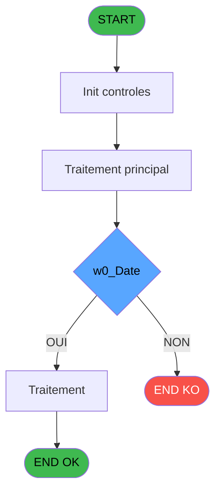

# PBP IDE 214 - Liste des GM Upgradés

> **Analyse**: Phases 1-4 2026-02-03 15:51 -> 15:51 (14s) | Assemblage 15:51
> **Pipeline**: V7.2 Enrichi
> **Structure**: 4 onglets (Resume | Ecrans | Donnees | Connexions)

<!-- TAB:Resume -->

## 1. FICHE D'IDENTITE

| Attribut | Valeur |
|----------|--------|
| Projet | PBP |
| IDE Position | 214 |
| Nom Programme | Liste des GM Upgradés |
| Fichier source | `Prg_214.xml` |
| Dossier IDE | Liste |
| Taches | 3 (1 ecrans visibles) |
| Tables modifiees | 0 |
| Programmes appeles | 0 |
| :warning: Statut | **ORPHELIN_POTENTIEL** |

## 2. DESCRIPTION FONCTIONNELLE

**Liste des GM Upgradés** assure la gestion complete de ce processus.

Le flux de traitement s'organise en **2 blocs fonctionnels** :

- **Impression** (2 taches) : generation de tickets et documents
- **Traitement** (1 tache) : traitements metier divers

Detail : phases du traitement

#### Phase 1 : Traitement (1 tache)

- **214** - Liste des GM Upgradés **[[ECRAN]](#ecran-t1)**

#### Phase 2 : Impression (2 taches)

- **214.1** - Edition
- **214.1.1** - Edition

## 3. BLOCS FONCTIONNELS

### 3.1 Traitement (1 tache)

Traitements internes.

---

#### 214 - Liste des GM Upgradés [[ECRAN]](#ecran-t1)

**Role** : Traitement : Liste des GM Upgradés.
**Ecran** : 605 x 183 DLU (MDI) | [Voir mockup](#ecran-t1)

### 3.2 Impression (2 taches)

Generation des documents et tickets.

---

#### 214.1 - Edition

**Role** : Generation du document : Edition.

---

#### 214.1.1 - Edition

**Role** : Generation du document : Edition.

## 5. REGLES METIER

*(Aucune regle metier identifiee)*

## 6. CONTEXTE

- **Appele par**: (aucun)
- **Appelle**: 0 programmes | **Tables**: 0 (W:0 R:0 L:0) | **Taches**: 3 | **Expressions**: 23

<!-- TAB:Ecrans -->

## 8. ECRANS

### 8.1 Forms visibles (1 / 3)

| # | Position | Tache | Nom | Type | Largeur | Hauteur | Bloc |
|---|----------|-------|-----|------|---------|---------|------|
| 1 | 214 | 214 | Liste des GM Upgradés | MDI | 605 | 183 | Traitement |

### 8.2 Mockups Ecrans

---

#### 214 - Liste des GM Upgradés
**Tache** : [214](#t1) | **Type** : MDI | **Dimensions** : 605 x 183 DLU
**Bloc** : Traitement | **Titre IDE** : Liste des GM Upgradés

<!-- FORM-DATA:
{
    "width":  605,
    "vFactor":  8,
    "type":  "MDI",
    "hFactor":  8,
    "controls":  [
                     {
                         "x":  0,
                         "type":  "label",
                         "var":  "",
                         "y":  0,
                         "w":  593,
                         "fmt":  "",
                         "name":  "",
                         "h":  19,
                         "color":  "",
                         "text":  "",
                         "parent":  null
                     },
                     {
                         "x":  4,
                         "type":  "label",
                         "var":  "",
                         "y":  156,
                         "w":  593,
                         "fmt":  "",
                         "name":  "",
                         "h":  24,
                         "color":  "",
                         "text":  "",
                         "parent":  null
                     },
                     {
                         "x":  40,
                         "type":  "label",
                         "var":  "",
                         "y":  24,
                         "w":  330,
                         "fmt":  "",
                         "name":  "",
                         "h":  127,
                         "color":  "",
                         "text":  "",
                         "parent":  null
                     },
                     {
                         "x":  99,
                         "type":  "label",
                         "var":  "",
                         "y":  33,
                         "w":  30,
                         "fmt":  "",
                         "name":  "",
                         "h":  10,
                         "color":  "",
                         "text":  "Le",
                         "parent":  6
                     },
                     {
                         "x":  45,
                         "type":  "line",
                         "var":  "",
                         "y":  50,
                         "w":  323,
                         "fmt":  "",
                         "name":  "",
                         "h":  0,
                         "color":  "",
                         "text":  "",
                         "parent":  6
                     },
                     {
                         "x":  45,
                         "type":  "line",
                         "var":  "",
                         "y":  127,
                         "w":  323,
                         "fmt":  "",
                         "name":  "",
                         "h":  0,
                         "color":  "",
                         "text":  "",
                         "parent":  6
                     },
                     {
                         "x":  99,
                         "type":  "label",
                         "var":  "",
                         "y":  136,
                         "w":  116,
                         "fmt":  "",
                         "name":  "",
                         "h":  9,
                         "color":  "",
                         "text":  "Sélections",
                         "parent":  6
                     },
                     {
                         "x":  378,
                         "type":  "label",
                         "var":  "",
                         "y":  24,
                         "w":  186,
                         "fmt":  "",
                         "name":  "",
                         "h":  127,
                         "color":  "",
                         "text":  "",
                         "parent":  null
                     },
                     {
                         "x":  136,
                         "type":  "edit",
                         "var":  "",
                         "y":  33,
                         "w":  126,
                         "fmt":  "DD/MM/YYYY",
                         "name":  "w0_Date",
                         "h":  10,
                         "color":  "110",
                         "text":  "",
                         "parent":  6
                     },
                     {
                         "x":  264,
                         "type":  "button",
                         "var":  "",
                         "y":  33,
                         "w":  27,
                         "fmt":  "...",
                         "name":  "b_Date",
                         "h":  10,
                         "color":  "",
                         "text":  "",
                         "parent":  6
                     },
                     {
                         "x":  107,
                         "type":  "radio",
                         "var":  "",
                         "y":  60,
                         "w":  199,
                         "fmt":  "",
                         "name":  "w0_choix",
                         "h":  40,
                         "color":  "",
                         "text":  "A,B",
                         "parent":  6
                     },
                     {
                         "x":  235,
                         "type":  "edit",
                         "var":  "",
                         "y":  136,
                         "w":  56,
                         "fmt":  "",
                         "name":  "",
                         "h":  9,
                         "color":  "",
                         "text":  "",
                         "parent":  6
                     },
                     {
                         "x":  394,
                         "type":  "button",
                         "var":  "",
                         "y":  88,
                         "w":  154,
                         "fmt":  "\u0026Ecran",
                         "name":  "b_Ecran",
                         "h":  18,
                         "color":  "",
                         "text":  "",
                         "parent":  17
                     },
                     {
                         "x":  394,
                         "type":  "button",
                         "var":  "",
                         "y":  108,
                         "w":  154,
                         "fmt":  "\u0026Impression",
                         "name":  "b_Imprimer",
                         "h":  18,
                         "color":  "",
                         "text":  "",
                         "parent":  17
                     },
                     {
                         "x":  6,
                         "type":  "edit",
                         "var":  "",
                         "y":  2,
                         "w":  267,
                         "fmt":  "30",
                         "name":  "",
                         "h":  8,
                         "color":  "",
                         "text":  "",
                         "parent":  1
                     },
                     {
                         "x":  383,
                         "type":  "edit",
                         "var":  "",
                         "y":  6,
                         "w":  203,
                         "fmt":  "WWW DD MMM YYYYT",
                         "name":  "",
                         "h":  8,
                         "color":  "",
                         "text":  "",
                         "parent":  1
                     },
                     {
                         "x":  6,
                         "type":  "edit",
                         "var":  "",
                         "y":  10,
                         "w":  358,
                         "fmt":  "50",
                         "name":  "",
                         "h":  8,
                         "color":  "",
                         "text":  "",
                         "parent":  1
                     },
                     {
                         "x":  402,
                         "type":  "image",
                         "var":  "",
                         "y":  29,
                         "w":  136,
                         "fmt":  "",
                         "name":  "",
                         "h":  54,
                         "color":  "",
                         "text":  "",
                         "parent":  17
                     },
                     {
                         "x":  12,
                         "type":  "button",
                         "var":  "",
                         "y":  159,
                         "w":  154,
                         "fmt":  "\u0026Quitter",
                         "name":  "",
                         "h":  18,
                         "color":  "",
                         "text":  "",
                         "parent":  5
                     },
                     {
                         "x":  394,
                         "type":  "button",
                         "var":  "",
                         "y":  128,
                         "w":  154,
                         "fmt":  "\u0026Excel",
                         "name":  "b_Excel",
                         "h":  18,
                         "color":  "",
                         "text":  "",
                         "parent":  null
                     },
                     {
                         "x":  156,
                         "type":  "checkbox",
                         "var":  "",
                         "y":  99,
                         "w":  183,
                         "fmt":  "",
                         "name":  "w0_Afficher_filiation",
                         "h":  21,
                         "color":  "",
                         "text":  "Afficher toutes les filiations",
                         "parent":  6
                     }
                 ],
    "taskId":  "214",
    "height":  183
}
-->

<strong>Champs : 6 champs</strong>

| Pos (x,y) | Nom | Variable | Type |
|-----------|-----|----------|------|
| 136,33 | w0_Date | - | edit |
| 235,136 | (sans nom) | - | edit |
| 6,2 | 30 | - | edit |
| 383,6 | WWW DD MMM YYYYT | - | edit |
| 6,10 | 50 | - | edit |
| 156,99 | w0_Afficher_filiation | - | checkbox |

<strong>Boutons : 5 boutons</strong>

| Bouton | Pos (x,y) | Action |
|--------|-----------|--------|
| ... | 264,33 | Bouton fonctionnel |
| Ecran | 394,88 | Bouton fonctionnel |
| Impression | 394,108 | Bouton fonctionnel |
| Quitter | 12,159 | Quitte le programme |
| Excel | 394,128 | Bouton fonctionnel |

## 9. NAVIGATION

Ecran unique: **Liste des GM Upgradés**

### 9.3 Structure hierarchique (3 taches)

| Position | Tache | Type | Dimensions | Bloc |
|----------|-------|------|------------|------|
| **214.1** | [**Liste des GM Upgradés** (214)](#t1) [mockup](#ecran-t1) | MDI | 605x183 | Traitement |
| **214.2** | [**Edition** (214.1)](#t24) | MDI | - | Impression |
| 214.2.1 | [Edition (214.1.1)](#t26) | MDI | - | |

### 9.4 Algorigramme

> **Legende**: Vert = START/END OK | Rouge = END KO | Bleu = Decisions
> *Algorigramme auto-genere. Utiliser `/algorigramme` pour une synthese metier detaillee.*

<!-- TAB:Donnees -->

## 10. TABLES

### Tables utilisees (0)

| ID | Nom | Description | Type | R | W | L | Usages |
|----|-----|-------------|------|---|---|---|--------|

### Colonnes par table (0 / 0 tables avec colonnes identifiees)

## 11. VARIABLES

### 11.1 Variables de session (3)

Variables persistantes pendant toute la session.

| Lettre | Nom | Type | Usage dans |
|--------|-----|------|-----------|
| M | v.Where_Filiation | Alpha | - |
| N | v.Chemin | Alpha | 1x session |
| O | v.Fichier | Alpha | 1x session |

### 11.2 Autres (12)

Variables diverses.

| Lettre | Nom | Type | Usage dans |
|--------|-----|------|-----------|
| A | w0_TitreEcran | Alpha | - |
| B | w0_Date | Date | 1x refs |
| C | b_Date | Alpha | - |
| D | w0_choix | Alpha | 2x refs |
| E | w0_NbSelect | Numeric | 2x refs |
| F | w0_NbFid | Numeric | - |
| G | w0_Afficher_filiation | Logical | - |
| H | b.Filiations | Logical | - |
| I | b_Ecran | Alpha | - |
| J | b_Imprimer | Alpha | - |
| K | b_Excel | Alpha | - |
| L | v_Where_Sejour | Alpha | - |

## 12. EXPRESSIONS

**23 / 23 expressions decodees (100%)**

### 12.1 Repartition par type

| Type | Expressions | Regles |
|------|-------------|--------|
| CONDITION | 4 | 0 |
| CONSTANTE | 6 | 0 |
| FORMAT | 1 | 0 |
| DATE | 1 | 0 |
| CAST_LOGIQUE | 4 | 0 |
| REFERENCE_VG | 1 | 0 |
| OTHER | 5 | 0 |
| CONCATENATION | 1 | 0 |

### 12.2 Expressions cles par type

#### CONDITION (4 expressions)

| Type | IDE | Expression | Regle |
|------|-----|------------|-------|
| CONDITION | 18 | `w0_NbSelect [E]>0` | - |
| CONDITION | 23 | `w0_choix [D]<>''` | - |
| CONDITION | 22 | `IF(w0_choix [D]='A','and [gmr_debut_sejour]='&''''&DStr(w0_Date [B],'YYYYMMDD')&''''&' and  [heb_statut_sejour]='&''''&'N'&'''' ,
IF(w0_choix [D]='B','and [gmr_debut_sejour]<='&''''&DStr(w0_Date [B],'YYYYMMDD')&''''&' and [gmr_fin_sejour]>='&''''&DStr(w0_Date [B],'YYYYMMDD')&''''&' and  [heb_statut_sejour]='&''''&'P'&'''',''))` | - |
| CONDITION | 16 | `w0_NbSelect [E]=0` | - |

#### CONSTANTE (6 expressions)

| Type | IDE | Expression | Regle |
|------|-----|------------|-------|
| CONSTANTE | 6 | `'&Excel'` | - |
| CONSTANTE | 17 | `0` | - |
| CONSTANTE | 19 | `'A'` | - |
| CONSTANTE | 3 | `'...'` | - |
| CONSTANTE | 4 | `'&Ecran'` | - |
| ... | | *+1 autres* | |

#### FORMAT (1 expressions)

| Type | IDE | Expression | Regle |
|------|-----|------------|-------|
| FORMAT | 11 | `'GM_UPGRADES_'&DStr(Date(),'YYMMDD')&TStr(Time(),'HHMMSS')&'.pdf'` | - |

#### DATE (1 expressions)

| Type | IDE | Expression | Regle |
|------|-----|------------|-------|
| DATE | 12 | `Date()` | - |

#### CAST_LOGIQUE (4 expressions)

| Type | IDE | Expression | Regle |
|------|-----|------------|-------|
| CAST_LOGIQUE | 20 | `'FALSE'LOG` | - |
| CAST_LOGIQUE | 21 | `'TRUE'LOG` | - |
| CAST_LOGIQUE | 1 | `'TRUE'LOG` | - |
| CAST_LOGIQUE | 2 | `'FALSE'LOG` | - |

#### REFERENCE_VG (1 expressions)

| Type | IDE | Expression | Regle |
|------|-----|------------|-------|
| REFERENCE_VG | 7 | `VG2` | - |

#### OTHER (5 expressions)

| Type | IDE | Expression | Regle |
|------|-----|------------|-------|
| OTHER | 14 | `SetCrsr (1)` | - |
| OTHER | 15 | `GetParam ('VILLAGE')` | - |
| OTHER | 13 | `SetCrsr (2)` | - |
| OTHER | 9 | `Translate('%TempDir%')&'GM_Upgrades.csv'` | - |
| OTHER | 10 | `Translate('%TempDir%')` | - |

#### CONCATENATION (1 expressions)

| Type | IDE | Expression | Regle |
|------|-----|------------|-------|
| CONCATENATION | 8 | `Trim(v.Chemin [N])&Trim(v.Fichier [O])` | - |

### 12.3 Toutes les expressions (23)

Voir les 23 expressions

#### CONDITION (4)

| IDE | Expression Decodee |
|-----|-------------------|
| 22 | `IF(w0_choix [D]='A','and [gmr_debut_sejour]='&''''&DStr(w0_Date [B],'YYYYMMDD')&''''&' and  [heb_statut_sejour]='&''''&'N'&'''' ,
IF(w0_choix [D]='B','and [gmr_debut_sejour]<='&''''&DStr(w0_Date [B],'YYYYMMDD')&''''&' and [gmr_fin_sejour]>='&''''&DStr(w0_Date [B],'YYYYMMDD')&''''&' and  [heb_statut_sejour]='&''''&'P'&'''',''))` |
| 16 | `w0_NbSelect [E]=0` |
| 18 | `w0_NbSelect [E]>0` |
| 23 | `w0_choix [D]<>''` |

#### CONSTANTE (6)

| IDE | Expression Decodee |
|-----|-------------------|
| 3 | `'...'` |
| 4 | `'&Ecran'` |
| 5 | `'&Imprimer'` |
| 6 | `'&Excel'` |
| 17 | `0` |
| 19 | `'A'` |

#### FORMAT (1)

| IDE | Expression Decodee |
|-----|-------------------|
| 11 | `'GM_UPGRADES_'&DStr(Date(),'YYMMDD')&TStr(Time(),'HHMMSS')&'.pdf'` |

#### DATE (1)

| IDE | Expression Decodee |
|-----|-------------------|
| 12 | `Date()` |

#### CAST_LOGIQUE (4)

| IDE | Expression Decodee |
|-----|-------------------|
| 1 | `'TRUE'LOG` |
| 2 | `'FALSE'LOG` |
| 20 | `'FALSE'LOG` |
| 21 | `'TRUE'LOG` |

#### REFERENCE_VG (1)

| IDE | Expression Decodee |
|-----|-------------------|
| 7 | `VG2` |

#### OTHER (5)

| IDE | Expression Decodee |
|-----|-------------------|
| 9 | `Translate('%TempDir%')&'GM_Upgrades.csv'` |
| 10 | `Translate('%TempDir%')` |
| 13 | `SetCrsr (2)` |
| 14 | `SetCrsr (1)` |
| 15 | `GetParam ('VILLAGE')` |

#### CONCATENATION (1)

| IDE | Expression Decodee |
|-----|-------------------|
| 8 | `Trim(v.Chemin [N])&Trim(v.Fichier [O])` |

<!-- TAB:Connexions -->

## 13. GRAPHE D'APPELS

### 13.1 Chaine depuis Main (Callers)

**Chemin**: (pas de callers directs)

### 13.2 Callers

| IDE | Nom Programme | Nb Appels |
|-----|---------------|-----------|
| - | (aucun) | - |

### 13.3 Callees (programmes appeles)

### 13.4 Detail Callees avec contexte

| IDE | Nom Programme | Appels | Contexte |
|-----|---------------|--------|----------|
| - | (aucun) | - | - |

## 14. RECOMMANDATIONS MIGRATION

### 14.1 Profil du programme

| Metrique | Valeur | Impact migration |
|----------|--------|-----------------|
| Lignes de logique | 110 | Programme compact |
| Expressions | 23 | Peu de logique |
| Tables WRITE | 0 | Impact faible |
| Sous-programmes | 0 | Peu de dependances |
| Ecrans visibles | 1 | Ecran unique ou traitement batch |
| Code desactive | 3.6% (4 / 110) | Code sain |
| Regles metier | 0 | Pas de regle identifiee |

### 14.2 Plan de migration par bloc

#### Traitement (1 tache: 1 ecran, 0 traitement)

- **Strategie** : 1 composant(s) UI (Razor/React) avec formulaires et validation.
- Decomposer les taches en services unitaires testables.

#### Impression (2 taches: 0 ecran, 2 traitements)

- **Strategie** : Templates HTML -> PDF via wkhtmltopdf ou Puppeteer.
- `PrintService` injectable avec choix imprimante

### 14.3 Dependances critiques

| Dependance | Type | Appels | Impact |
|------------|------|--------|--------|

---
*Spec DETAILED generee par Pipeline V7.2 - 2026-02-03 15:51*
