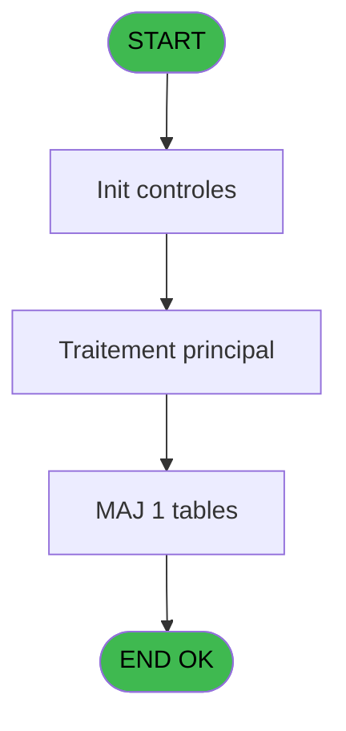

# PBP IDE 215 - Liste 3 Generations

> **Analyse**: Phases 1-4 2026-02-03 15:51 -> 15:52 (13s) | Assemblage 15:52
> **Pipeline**: V7.2 Enrichi
> **Structure**: 4 onglets (Resume | Ecrans | Donnees | Connexions)

<!-- TAB:Resume -->

## 1. FICHE D'IDENTITE

| Attribut | Valeur |
|----------|--------|
| Projet | PBP |
| IDE Position | 215 |
| Nom Programme | Liste 3 Generations |
| Fichier source | `Prg_215.xml` |
| Dossier IDE | Liste |
| Taches | 4 (1 ecrans visibles) |
| Tables modifiees | 1 |
| Programmes appeles | 1 |
| :warning: Statut | **ORPHELIN_POTENTIEL** |

## 2. DESCRIPTION FONCTIONNELLE

**Liste 3 Generations** assure la gestion complete de ce processus.

Le flux de traitement s'organise en **3 blocs fonctionnels** :

- **Traitement** (2 taches) : traitements metier divers
- **Impression** (1 tache) : generation de tickets et documents
- **Consultation** (1 tache) : ecrans de recherche, selection et consultation

**Donnees modifiees** : 1 tables en ecriture (inter_prestation_inp).

**Logique metier** : 1 regles identifiees couvrant conditions metier.

Detail : phases du traitement

#### Phase 1 : Traitement (2 taches)

- **215** - Liste 3 générations **[[ECRAN]](#ecran-t1)**
- **215.2.1** - Recup Nb GM

Delegue a : [3 Gen Affecte dossier (IDE 216)](PBP-IDE-216.md)

#### Phase 2 : Consultation (1 tache)

- **215.1** - Selection données

#### Phase 3 : Impression (1 tache)

- **215.2** - Edition

#### Tables impactees

| Table | Operations | Role metier |
|-------|-----------|-------------|
| inter_prestation_inp | R/**W** (3 usages) | Prestations/services vendus |

## 3. BLOCS FONCTIONNELS

### 3.1 Traitement (2 taches)

Traitements internes.

---

#### 215 - Liste 3 générations [[ECRAN]](#ecran-t1)

**Role** : Traitement : Liste 3 générations.
**Ecran** : 605 x 187 DLU (MDI) | [Voir mockup](#ecran-t1)
**Delegue a** : [3 Gen Affecte dossier (IDE 216)](PBP-IDE-216.md)

---

#### 215.2.1 - Recup Nb GM

**Role** : Consultation/chargement : Recup Nb GM.
**Delegue a** : [3 Gen Affecte dossier (IDE 216)](PBP-IDE-216.md)

### 3.2 Consultation (1 tache)

Ecrans de recherche et consultation.

---

#### 215.1 - Selection données

**Role** : Selection par l'operateur : Selection données.

### 3.3 Impression (1 tache)

Generation des documents et tickets.

---

#### 215.2 - Edition

**Role** : Generation du document : Edition.

## 5. REGLES METIER

1 regles identifiees:

### Autres (1 regles)

#### [RM-001] Si {1 alors 4}='A' sinon 'and gmr_debut_sejour='&''''&DStr({1,2},'YYYYMMDD')&'''', 'and gmr_debut_sejour<='&''''&DStr({1,2},'YYYYMMDD')&''''&' and gmr_fin_sejour>='&''''&DStr({1,2},'YYYYMMDD')&''''&' and gmr_acces='&''''&'O'&'''')

| Element | Detail |
|---------|--------|
| **Condition** | `{1` |
| **Si vrai** | 4}='A' |
| **Si faux** | 'and gmr_debut_sejour='&''''&DStr({1,2},'YYYYMMDD')&'''', 'and gmr_debut_sejour<='&''''&DStr({1,2},'YYYYMMDD')&''''&' and gmr_fin_sejour>='&''''&DStr({1,2},'YYYYMMDD')&''''&' and gmr_acces='&''''&'O'&'''') |
| **Expression source** | Expression 24 : `IF({1,4}='A','and gmr_debut_sejour='&''''&DStr({1,2},'YYYYMM` |
| **Exemple** | Si {1 → 4}='A' |

## 6. CONTEXTE

- **Appele par**: (aucun)
- **Appelle**: 1 programmes | **Tables**: 1 (W:1 R:1 L:0) | **Taches**: 4 | **Expressions**: 25

<!-- TAB:Ecrans -->

## 8. ECRANS

### 8.1 Forms visibles (1 / 4)

| # | Position | Tache | Nom | Type | Largeur | Hauteur | Bloc |
|---|----------|-------|-----|------|---------|---------|------|
| 1 | 215 | 215 | Liste 3 générations | MDI | 605 | 187 | Traitement |

### 8.2 Mockups Ecrans

---

#### 215 - Liste 3 générations
**Tache** : [215](#t1) | **Type** : MDI | **Dimensions** : 605 x 187 DLU
**Bloc** : Traitement | **Titre IDE** : Liste 3 générations

<!-- FORM-DATA:
{
    "width":  605,
    "vFactor":  8,
    "type":  "MDI",
    "hFactor":  8,
    "controls":  [
                     {
                         "x":  0,
                         "type":  "label",
                         "var":  "",
                         "y":  0,
                         "w":  593,
                         "fmt":  "",
                         "name":  "",
                         "h":  19,
                         "color":  "",
                         "text":  "",
                         "parent":  null
                     },
                     {
                         "x":  40,
                         "type":  "label",
                         "var":  "",
                         "y":  24,
                         "w":  330,
                         "fmt":  "",
                         "name":  "",
                         "h":  135,
                         "color":  "",
                         "text":  "",
                         "parent":  null
                     },
                     {
                         "x":  378,
                         "type":  "label",
                         "var":  "",
                         "y":  24,
                         "w":  186,
                         "fmt":  "",
                         "name":  "",
                         "h":  135,
                         "color":  "",
                         "text":  "",
                         "parent":  null
                     },
                     {
                         "x":  107,
                         "type":  "label",
                         "var":  "",
                         "y":  40,
                         "w":  30,
                         "fmt":  "",
                         "name":  "",
                         "h":  10,
                         "color":  "",
                         "text":  "Le",
                         "parent":  5
                     },
                     {
                         "x":  45,
                         "type":  "line",
                         "var":  "",
                         "y":  63,
                         "w":  323,
                         "fmt":  "",
                         "name":  "",
                         "h":  0,
                         "color":  "",
                         "text":  "",
                         "parent":  5
                     },
                     {
                         "x":  45,
                         "type":  "line",
                         "var":  "",
                         "y":  117,
                         "w":  323,
                         "fmt":  "",
                         "name":  "",
                         "h":  0,
                         "color":  "",
                         "text":  "",
                         "parent":  5
                     },
                     {
                         "x":  99,
                         "type":  "label",
                         "var":  "",
                         "y":  133,
                         "w":  116,
                         "fmt":  "",
                         "name":  "",
                         "h":  9,
                         "color":  "",
                         "text":  "Sélections",
                         "parent":  5
                     },
                     {
                         "x":  2,
                         "type":  "label",
                         "var":  "",
                         "y":  161,
                         "w":  593,
                         "fmt":  "",
                         "name":  "",
                         "h":  24,
                         "color":  "",
                         "text":  "",
                         "parent":  null
                     },
                     {
                         "x":  144,
                         "type":  "edit",
                         "var":  "",
                         "y":  40,
                         "w":  126,
                         "fmt":  "DD/MM/YYYY",
                         "name":  "w0_Date",
                         "h":  10,
                         "color":  "110",
                         "text":  "",
                         "parent":  5
                     },
                     {
                         "x":  272,
                         "type":  "button",
                         "var":  "",
                         "y":  40,
                         "w":  27,
                         "fmt":  "...",
                         "name":  "b_Date",
                         "h":  10,
                         "color":  "",
                         "text":  "",
                         "parent":  5
                     },
                     {
                         "x":  61,
                         "type":  "radio",
                         "var":  "",
                         "y":  82,
                         "w":  291,
                         "fmt":  "",
                         "name":  "w0_choix",
                         "h":  18,
                         "color":  "",
                         "text":  "Arrivants,Présents",
                         "parent":  5
                     },
                     {
                         "x":  235,
                         "type":  "edit",
                         "var":  "",
                         "y":  133,
                         "w":  56,
                         "fmt":  "",
                         "name":  "",
                         "h":  9,
                         "color":  "",
                         "text":  "",
                         "parent":  5
                     },
                     {
                         "x":  394,
                         "type":  "button",
                         "var":  "",
                         "y":  88,
                         "w":  154,
                         "fmt":  "\u0026Ecran",
                         "name":  "b_Ecran",
                         "h":  18,
                         "color":  "",
                         "text":  "",
                         "parent":  6
                     },
                     {
                         "x":  394,
                         "type":  "button",
                         "var":  "",
                         "y":  112,
                         "w":  154,
                         "fmt":  "\u0026Impression",
                         "name":  "b_Imprimer",
                         "h":  18,
                         "color":  "",
                         "text":  "",
                         "parent":  6
                     },
                     {
                         "x":  6,
                         "type":  "edit",
                         "var":  "",
                         "y":  2,
                         "w":  267,
                         "fmt":  "30",
                         "name":  "",
                         "h":  8,
                         "color":  "",
                         "text":  "",
                         "parent":  1
                     },
                     {
                         "x":  383,
                         "type":  "edit",
                         "var":  "",
                         "y":  6,
                         "w":  203,
                         "fmt":  "WWW DD MMM YYYYT",
                         "name":  "",
                         "h":  8,
                         "color":  "",
                         "text":  "",
                         "parent":  1
                     },
                     {
                         "x":  6,
                         "type":  "edit",
                         "var":  "",
                         "y":  10,
                         "w":  267,
                         "fmt":  "30",
                         "name":  "",
                         "h":  8,
                         "color":  "",
                         "text":  "",
                         "parent":  1
                     },
                     {
                         "x":  402,
                         "type":  "image",
                         "var":  "",
                         "y":  29,
                         "w":  136,
                         "fmt":  "",
                         "name":  "",
                         "h":  54,
                         "color":  "",
                         "text":  "",
                         "parent":  6
                     },
                     {
                         "x":  10,
                         "type":  "button",
                         "var":  "",
                         "y":  164,
                         "w":  154,
                         "fmt":  "\u0026Quitter",
                         "name":  "",
                         "h":  18,
                         "color":  "",
                         "text":  "",
                         "parent":  15
                     },
                     {
                         "x":  394,
                         "type":  "button",
                         "var":  "",
                         "y":  136,
                         "w":  154,
                         "fmt":  "E\u0026xcel",
                         "name":  "b_Excel",
                         "h":  18,
                         "color":  "",
                         "text":  "",
                         "parent":  6
                     }
                 ],
    "taskId":  "215",
    "height":  187
}
-->

<strong>Champs : 5 champs</strong>

| Pos (x,y) | Nom | Variable | Type |
|-----------|-----|----------|------|
| 144,40 | w0_Date | - | edit |
| 235,133 | (sans nom) | - | edit |
| 6,2 | 30 | - | edit |
| 383,6 | WWW DD MMM YYYYT | - | edit |
| 6,10 | 30 | - | edit |

<strong>Boutons : 5 boutons</strong>

| Bouton | Pos (x,y) | Action |
|--------|-----------|--------|
| ... | 272,40 | Bouton fonctionnel |
| Ecran | 394,88 | Bouton fonctionnel |
| Impression | 394,112 | Bouton fonctionnel |
| Quitter | 10,164 | Quitte le programme |
| Excel | 394,136 | Bouton fonctionnel |

## 9. NAVIGATION

Ecran unique: **Liste 3 générations**

### 9.3 Structure hierarchique (4 taches)

| Position | Tache | Type | Dimensions | Bloc |
|----------|-------|------|------------|------|
| **215.1** | [**Liste 3 générations** (215)](#t1) [mockup](#ecran-t1) | MDI | 605x187 | Traitement |
| 215.1.1 | [Recup Nb GM (215.2.1)](#t20) | - | - | |
| **215.2** | [**Selection données** (215.1)](#t17) | - | - | Consultation |
| **215.3** | [**Edition** (215.2)](#t19) | - | - | Impression |

### 9.4 Algorigramme

> **Legende**: Vert = START/END OK | Rouge = END KO | Bleu = Decisions
> *Algorigramme auto-genere. Utiliser `/algorigramme` pour une synthese metier detaillee.*

<!-- TAB:Donnees -->

## 10. TABLES

### Tables utilisees (1)

| ID | Nom | Description | Type | R | W | L | Usages |
|----|-----|-------------|------|---|---|---|--------|
| 631 | inter_prestation_inp | Prestations/services vendus | DB | R | **W** |   | 3 |

### Colonnes par table (1 / 1 tables avec colonnes identifiees)

Table 631 - inter_prestation_inp (R/**W**) - 3 usages

| Lettre | Variable | Acces | Type |
|--------|----------|-------|------|
| A | gmr_code_gm | W | Numeric |
| B | gmr_filiation_villag | W | Numeric |
| C | gmr_nom__30_ | W | Unicode |
| D | gmr_prenom__8_ | W | Unicode |
| E | gmr_debut_sejour | W | Alpha |
| F | gmr_fin_sejour | W | Alpha |
| G | gmr_age_num | W | Numeric |
| H | gmr_acces | W | Unicode |
| I | fidelisation | W | Unicode |
| J | heb_nom_logement | W | Unicode |
| K | heb_type_hebergement | W | Unicode |
| L | heb_complement_type | W | Unicode |
| M | prestation | W | Unicode |
| N | numero dossier | W | Numeric |
| O | nombre dossiers 3G | W | Numeric |
| P | code retour tempo | W | Logical |

## 11. VARIABLES

### 11.1 Variables de session (2)

Variables persistantes pendant toute la session.

| Lettre | Nom | Type | Usage dans |
|--------|-----|------|-----------|
| H | v.Chemin | Alpha | - |
| I | v.NomFichierCsv | Alpha | - |

### 11.2 Autres (14)

Variables diverses.

| Lettre | Nom | Type | Usage dans |
|--------|-----|------|-----------|
| A | w0_TitreEcran | Alpha | - |
| B | w0_Date | Date | 1x refs |
| C | b_Date | Alpha | - |
| D | w0_choix | Alpha | - |
| E | w0_NbSelect | Numeric | 2x refs |
| F | b_Ecran | Alpha | - |
| G | b_Imprimer | Alpha | - |
| J | b_Excel | Alpha | - |
| K | heb_type_hebergement | Unicode | - |
| L | heb_complement_type | Unicode | - |
| M | prestation | Unicode | - |
| N | numero dossier | Numeric | - |
| O | nombre dossiers 3G | Numeric | - |
| P | code retour tempo | Logical | - |

Toutes les 16 variables (liste complete)

| Cat | Lettre | Nom Variable | Type |
|-----|--------|--------------|------|
| V. | **H** | v.Chemin | Alpha |
| V. | **I** | v.NomFichierCsv | Alpha |
| Autre | **A** | w0_TitreEcran | Alpha |
| Autre | **B** | w0_Date | Date |
| Autre | **C** | b_Date | Alpha |
| Autre | **D** | w0_choix | Alpha |
| Autre | **E** | w0_NbSelect | Numeric |
| Autre | **F** | b_Ecran | Alpha |
| Autre | **G** | b_Imprimer | Alpha |
| Autre | **J** | b_Excel | Alpha |
| Autre | **K** | heb_type_hebergement | Unicode |
| Autre | **L** | heb_complement_type | Unicode |
| Autre | **M** | prestation | Unicode |
| Autre | **N** | numero dossier | Numeric |
| Autre | **O** | nombre dossiers 3G | Numeric |
| Autre | **P** | code retour tempo | Logical |

## 12. EXPRESSIONS

**25 / 25 expressions decodees (100%)**

### 12.1 Repartition par type

| Type | Expressions | Regles |
|------|-------------|--------|
| CONDITION | 3 | 5 |
| CONSTANTE | 10 | 0 |
| FORMAT | 1 | 0 |
| DATE | 1 | 0 |
| REFERENCE_VG | 1 | 0 |
| OTHER | 6 | 0 |
| CAST_LOGIQUE | 2 | 0 |
| CONCATENATION | 1 | 0 |

### 12.2 Expressions cles par type

#### CONDITION (3 expressions)

| Type | IDE | Expression | Regle |
|------|-----|------------|-------|
| CONDITION | 24 | `IF({1,4}='A','and gmr_debut_sejour='&''''&DStr({1,2},'YYYYMMDD')&'''', 'and gmr_debut_sejour<='&''''&DStr({1,2},'YYYYMMDD')&''''&' and gmr_fin_sejour>='&''''&DStr({1,2},'YYYYMMDD')&''''&' and gmr_acces='&''''&'O'&'''')` | [RM-001](#rm-RM-001) |
| CONDITION | 13 | `w0_NbSelect [E]>0` | - |
| CONDITION | 12 | `w0_NbSelect [E]=0` | - |

#### CONSTANTE (10 expressions)

| Type | IDE | Expression | Regle |
|------|-----|------------|-------|
| CONSTANTE | 20 | `'P'` | - |
| CONSTANTE | 19 | `'E'` | - |
| CONSTANTE | 21 | `'X'` | - |
| CONSTANTE | 25 | `''` | - |
| CONSTANTE | 22 | `0` | - |
| ... | | *+5 autres* | |

#### FORMAT (1 expressions)

| Type | IDE | Expression | Regle |
|------|-----|------------|-------|
| FORMAT | 6 | `'LISTE_3GENERATIONS_'&DStr(w0_Date [B],'YYYYMMDD')&'.csv'` | - |

#### DATE (1 expressions)

| Type | IDE | Expression | Regle |
|------|-----|------------|-------|
| DATE | 8 | `Date()` | - |

#### REFERENCE_VG (1 expressions)

| Type | IDE | Expression | Regle |
|------|-----|------------|-------|
| REFERENCE_VG | 4 | `VG2` | - |

#### OTHER (6 expressions)

| Type | IDE | Expression | Regle |
|------|-----|------------|-------|
| OTHER | 11 | `GetParam ('VILLAGE')` | - |
| OTHER | 16 | `DbDel ('{631,2}'DSOURCE,'')` | - |
| OTHER | 23 | `DbDel('{631,2}'DSOURCE,'')` | - |
| OTHER | 5 | `Translate('%club_exportdata%')` | - |
| OTHER | 9 | `SetCrsr (2)` | - |
| ... | | *+1 autres* | |

#### CAST_LOGIQUE (2 expressions)

| Type | IDE | Expression | Regle |
|------|-----|------------|-------|
| CAST_LOGIQUE | 18 | `'FALSE'LOG` | - |
| CAST_LOGIQUE | 15 | `'TRUE'LOG` | - |

#### CONCATENATION (1 expressions)

| Type | IDE | Expression | Regle |
|------|-----|------------|-------|
| CONCATENATION | 7 | `Translate (Trim([AA]))&Trim([AB])` | - |

### 12.3 Toutes les expressions (25)

Voir les 25 expressions

#### CONDITION (3)

| IDE | Expression Decodee |
|-----|-------------------|
| 24 | `IF({1,4}='A','and gmr_debut_sejour='&''''&DStr({1,2},'YYYYMMDD')&'''', 'and gmr_debut_sejour<='&''''&DStr({1,2},'YYYYMMDD')&''''&' and gmr_fin_sejour>='&''''&DStr({1,2},'YYYYMMDD')&''''&' and gmr_acces='&''''&'O'&'''')` |
| 12 | `w0_NbSelect [E]=0` |
| 13 | `w0_NbSelect [E]>0` |

#### CONSTANTE (10)

| IDE | Expression Decodee |
|-----|-------------------|
| 1 | `'...'` |
| 2 | `'&Ecran'` |
| 3 | `'&Imprimer'` |
| 14 | `0` |
| 17 | `'A'` |
| 19 | `'E'` |
| 20 | `'P'` |
| 21 | `'X'` |
| 22 | `0` |
| 25 | `''` |

#### FORMAT (1)

| IDE | Expression Decodee |
|-----|-------------------|
| 6 | `'LISTE_3GENERATIONS_'&DStr(w0_Date [B],'YYYYMMDD')&'.csv'` |

#### DATE (1)

| IDE | Expression Decodee |
|-----|-------------------|
| 8 | `Date()` |

#### REFERENCE_VG (1)

| IDE | Expression Decodee |
|-----|-------------------|
| 4 | `VG2` |

#### OTHER (6)

| IDE | Expression Decodee |
|-----|-------------------|
| 5 | `Translate('%club_exportdata%')` |
| 9 | `SetCrsr (2)` |
| 10 | `SetCrsr (1)` |
| 11 | `GetParam ('VILLAGE')` |
| 16 | `DbDel ('{631,2}'DSOURCE,'')` |
| 23 | `DbDel('{631,2}'DSOURCE,'')` |

#### CAST_LOGIQUE (2)

| IDE | Expression Decodee |
|-----|-------------------|
| 15 | `'TRUE'LOG` |
| 18 | `'FALSE'LOG` |

#### CONCATENATION (1)

| IDE | Expression Decodee |
|-----|-------------------|
| 7 | `Translate (Trim([AA]))&Trim([AB])` |

<!-- TAB:Connexions -->

## 13. GRAPHE D'APPELS

### 13.1 Chaine depuis Main (Callers)

**Chemin**: (pas de callers directs)

### 13.2 Callers

| IDE | Nom Programme | Nb Appels |
|-----|---------------|-----------|
| - | (aucun) | - |

### 13.3 Callees (programmes appeles)

### 13.4 Detail Callees avec contexte

| IDE | Nom Programme | Appels | Contexte |
|-----|---------------|--------|----------|
| [216](PBP-IDE-216.md) | 3 Gen Affecte dossier | 1 | Sous-programme |

## 14. RECOMMANDATIONS MIGRATION

### 14.1 Profil du programme

| Metrique | Valeur | Impact migration |
|----------|--------|-----------------|
| Lignes de logique | 116 | Programme compact |
| Expressions | 25 | Peu de logique |
| Tables WRITE | 1 | Impact faible |
| Sous-programmes | 1 | Peu de dependances |
| Ecrans visibles | 1 | Ecran unique ou traitement batch |
| Code desactive | 0% (0 / 116) | Code sain |
| Regles metier | 1 | Quelques regles a preserver |

### 14.2 Plan de migration par bloc

#### Traitement (2 taches: 1 ecran, 1 traitement)

- **Strategie** : Orchestrateur avec 1 ecrans (Razor/React) et 1 traitements backend (services).
- Les ecrans deviennent des composants UI, les traitements invisibles deviennent des services injectables.
- 1 sous-programme(s) a migrer ou a reutiliser depuis les services existants.
- Decomposer les taches en services unitaires testables.

#### Consultation (1 tache: 0 ecran, 1 traitement)

- **Strategie** : Composants de recherche/selection en modales.

#### Impression (1 tache: 0 ecran, 1 traitement)

- **Strategie** : Templates HTML -> PDF via wkhtmltopdf ou Puppeteer.
- `PrintService` injectable avec choix imprimante

### 14.3 Dependances critiques

| Dependance | Type | Appels | Impact |
|------------|------|--------|--------|
| inter_prestation_inp | Table WRITE (Database) | 2x | Schema + repository |
| [3 Gen Affecte dossier (IDE 216)](PBP-IDE-216.md) | Sous-programme | 1x | Normale - Sous-programme |

---
*Spec DETAILED generee par Pipeline V7.2 - 2026-02-03 15:52*
