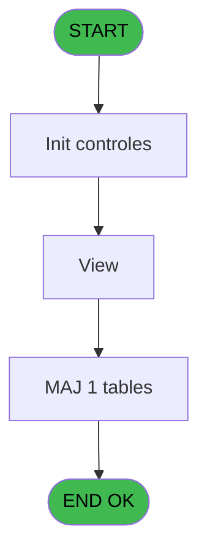

# PBP IDE 216 - 3 Gen Affecte dossier

> **Analyse**: Phases 1-4 2026-02-03 15:52 -> 15:52 (13s) | Assemblage 15:52
> **Pipeline**: V7.2 Enrichi
> **Structure**: 4 onglets (Resume | Ecrans | Donnees | Connexions)

<!-- TAB:Resume -->

## 1. FICHE D'IDENTITE

| Attribut | Valeur |
|----------|--------|
| Projet | PBP |
| IDE Position | 216 |
| Nom Programme | 3 Gen Affecte dossier |
| Fichier source | `Prg_216.xml` |
| Dossier IDE | Liste |
| Taches | 4 (1 ecrans visibles) |
| Tables modifiees | 1 |
| Programmes appeles | 1 |

## 2. DESCRIPTION FONCTIONNELLE

**3 Gen Affecte dossier** assure la gestion complete de ce processus, accessible depuis [Liste 3 Generations (IDE 215)](PBP-IDE-215.md), [3 Gen Affecte dossier (IDE 216)](PBP-IDE-216.md).

Le flux de traitement s'organise en **2 blocs fonctionnels** :

- **Traitement** (3 taches) : traitements metier divers
- **Validation** (1 tache) : controles et verifications de coherence

**Donnees modifiees** : 1 tables en ecriture (inter_prestation_inp).

Detail : phases du traitement

#### Phase 1 : Traitement (3 taches)

- **216** - 3 Gen Affecte dossier
- **216.2** - View **[[ECRAN]](#ecran-t15)**
- **216.3** - 3 Gen Affecte dossier

Delegue a : [3 Gen Affecte dossier (IDE 216)](PBP-IDE-216.md)

#### Phase 2 : Validation (1 tache)

- **216.1** - Verif Dossier

#### Tables impactees

| Table | Operations | Role metier |
|-------|-----------|-------------|
| inter_prestation_inp | R/**W** (3 usages) | Prestations/services vendus |

## 3. BLOCS FONCTIONNELS

### 3.1 Traitement (3 taches)

Traitements internes.

---

#### 216 - 3 Gen Affecte dossier

**Role** : Traitement : 3 Gen Affecte dossier.
**Variables liees** : A (p.Num Dossier), O (dossier_client), P (dossier_accompagnant)
**Delegue a** : [3 Gen Affecte dossier (IDE 216)](PBP-IDE-216.md)

---

#### 216.2 - View [[ECRAN]](#ecran-t15)

**Role** : Traitement : View.
**Ecran** : 837 x 0 DLU | [Voir mockup](#ecran-t15)
**Delegue a** : [3 Gen Affecte dossier (IDE 216)](PBP-IDE-216.md)

---

#### 216.3 - 3 Gen Affecte dossier

**Role** : Traitement : 3 Gen Affecte dossier.
**Variables liees** : A (p.Num Dossier), O (dossier_client), P (dossier_accompagnant)
**Delegue a** : [3 Gen Affecte dossier (IDE 216)](PBP-IDE-216.md)

### 3.2 Validation (1 tache)

Controles de coherence : 1 tache verifie les donnees et conditions.

---

#### 216.1 - Verif Dossier

**Role** : Verification : Verif Dossier.
**Variables liees** : A (p.Num Dossier), O (dossier_client), P (dossier_accompagnant)

## 5. REGLES METIER

*(Aucune regle metier identifiee)*

## 6. CONTEXTE

- **Appele par**: [Liste 3 Generations (IDE 215)](PBP-IDE-215.md), [3 Gen Affecte dossier (IDE 216)](PBP-IDE-216.md)
- **Appelle**: 1 programmes | **Tables**: 1 (W:1 R:1 L:0) | **Taches**: 4 | **Expressions**: 4

<!-- TAB:Ecrans -->

## 8. ECRANS

### 8.1 Forms visibles (1 / 4)

| # | Position | Tache | Nom | Type | Largeur | Hauteur | Bloc |
|---|----------|-------|-----|------|---------|---------|------|
| 1 | 216.1.3 | 216.2 | View | Type0 | 837 | 0 | Traitement |

### 8.2 Mockups Ecrans

---

#### 216.1.3 - View
**Tache** : [216.2](#t15) | **Type** : Type0 | **Dimensions** : 837 x 0 DLU
**Bloc** : Traitement | **Titre IDE** : View

<!-- FORM-DATA:
{
    "width":  837,
    "vFactor":  8,
    "type":  "Type0",
    "hFactor":  4,
    "controls":  [
                     {
                         "x":  4,
                         "type":  "table",
                         "var":  "",
                         "name":  "",
                         "titleH":  12,
                         "color":  "",
                         "w":  824,
                         "y":  8,
                         "fmt":  "",
                         "parent":  null,
                         "text":  "",
                         "rowH":  13,
                         "h":  184,
                         "cols":  [
                                      {
                                          "title":  "trec_nom_adherent",
                                          "layer":  1,
                                          "w":  178
                                      },
                                      {
                                          "title":  "trec_prenom_adherent",
                                          "layer":  2,
                                          "w":  122
                                      },
                                      {
                                          "title":  "trec_numero_adherent",
                                          "layer":  3,
                                          "w":  89
                                      },
                                      {
                                          "title":  "trec_fil__adherent",
                                          "layer":  4,
                                          "w":  71
                                      },
                                      {
                                          "title":  "trec_dossier",
                                          "layer":  5,
                                          "w":  58
                                      }
                                  ],
                         "rows":  5
                     },
                     {
                         "x":  8,
                         "type":  "edit",
                         "var":  "",
                         "y":  23,
                         "w":  171,
                         "fmt":  "",
                         "name":  "trec_nom_adherent",
                         "h":  10,
                         "color":  "",
                         "text":  "",
                         "parent":  1
                     },
                     {
                         "x":  186,
                         "type":  "edit",
                         "var":  "",
                         "y":  23,
                         "w":  115,
                         "fmt":  "",
                         "name":  "trec_prenom_adherent",
                         "h":  10,
                         "color":  "",
                         "text":  "",
                         "parent":  1
                     },
                     {
                         "x":  308,
                         "type":  "edit",
                         "var":  "",
                         "y":  23,
                         "w":  51,
                         "fmt":  "",
                         "name":  "trec_numero_adherent",
                         "h":  10,
                         "color":  "",
                         "text":  "",
                         "parent":  1
                     },
                     {
                         "x":  397,
                         "type":  "edit",
                         "var":  "",
                         "y":  23,
                         "w":  18,
                         "fmt":  "",
                         "name":  "trec_fil__adherent",
                         "h":  10,
                         "color":  "",
                         "text":  "",
                         "parent":  1
                     },
                     {
                         "x":  468,
                         "type":  "edit",
                         "var":  "",
                         "y":  23,
                         "w":  51,
                         "fmt":  "",
                         "name":  "trec_dossier",
                         "h":  10,
                         "color":  "",
                         "text":  "",
                         "parent":  1
                     }
                 ],
    "taskId":  "216.1.3",
    "height":  0
}
-->

<strong>Champs : 5 champs</strong>

| Pos (x,y) | Nom | Variable | Type |
|-----------|-----|----------|------|
| 8,23 | trec_nom_adherent | - | edit |
| 186,23 | trec_prenom_adherent | - | edit |
| 308,23 | trec_numero_adherent | - | edit |
| 397,23 | trec_fil__adherent | - | edit |
| 468,23 | trec_dossier | - | edit |

## 9. NAVIGATION

Ecran unique: **View**

### 9.3 Structure hierarchique (4 taches)

| Position | Tache | Type | Dimensions | Bloc |
|----------|-------|------|------------|------|
| **216.1** | [**3 Gen Affecte dossier** (216)](#t13) | - | - | Traitement |
| 216.1.1 | [View (216.2)](#t15) [mockup](#ecran-t15) | - | 837x0 | |
| 216.1.2 | [3 Gen Affecte dossier (216.3)](#t18) | - | - | |
| **216.2** | [**Verif Dossier** (216.1)](#t14) | - | - | Validation |

### 9.4 Algorigramme

> **Legende**: Vert = START/END OK | Rouge = END KO | Bleu = Decisions
> *Algorigramme auto-genere. Utiliser `/algorigramme` pour une synthese metier detaillee.*

<!-- TAB:Donnees -->

## 10. TABLES

### Tables utilisees (1)

| ID | Nom | Description | Type | R | W | L | Usages |
|----|-----|-------------|------|---|---|---|--------|
| 631 | inter_prestation_inp | Prestations/services vendus | DB | R | **W** |   | 3 |

### Colonnes par table (1 / 1 tables avec colonnes identifiees)

Table 631 - inter_prestation_inp (R/**W**) - 3 usages

| Lettre | Variable | Acces | Type |
|--------|----------|-------|------|
| N | prestation | W | Unicode |

## 11. VARIABLES

### 11.1 Parametres entrants (2)

Variables recues du programme appelant ([Liste 3 Generations (IDE 215)](PBP-IDE-215.md)).

| Lettre | Nom | Type | Usage dans |
|--------|-----|------|-----------|
| A | p.Num Dossier | Numeric | - |
| B | p.Num Tribue | Numeric | - |

### 11.2 Autres (18)

Variables diverses.

| Lettre | Nom | Type | Usage dans |
|--------|-----|------|-----------|
| C | code_adherent | Numeric | - |
| D | filiation_adh | Numeric | - |
| E | nom | Unicode | 1x refs |
| F | prenom | Unicode | - |
| G | debut_sejour | Alpha | - |
| H | fin_sejour | Alpha | - |
| I | age_num | Numeric | - |
| J | fidelisation | Unicode | - |
| K | heb_nom_logement | Unicode | - |
| L | heb_type_hebergement | Unicode | - |
| M | heb_complement_type | Unicode | - |
| N | prestation | Unicode | - |
| O | dossier_client | Numeric | - |
| P | dossier_accompagnant | Numeric | - |
| Q | heb_code_logement | Unicode | - |
| R | titre | Unicode | - |
| S | nationalite | Unicode | - |
| T | heb_u_p_nb_occup | Unicode | - |

Toutes les 20 variables (liste complete)

| Cat | Lettre | Nom Variable | Type |
|-----|--------|--------------|------|
| P0 | **A** | p.Num Dossier | Numeric |
| P0 | **B** | p.Num Tribue | Numeric |
| Autre | **C** | code_adherent | Numeric |
| Autre | **D** | filiation_adh | Numeric |
| Autre | **E** | nom | Unicode |
| Autre | **F** | prenom | Unicode |
| Autre | **G** | debut_sejour | Alpha |
| Autre | **H** | fin_sejour | Alpha |
| Autre | **I** | age_num | Numeric |
| Autre | **J** | fidelisation | Unicode |
| Autre | **K** | heb_nom_logement | Unicode |
| Autre | **L** | heb_type_hebergement | Unicode |
| Autre | **M** | heb_complement_type | Unicode |
| Autre | **N** | prestation | Unicode |
| Autre | **O** | dossier_client | Numeric |
| Autre | **P** | dossier_accompagnant | Numeric |
| Autre | **Q** | heb_code_logement | Unicode |
| Autre | **R** | titre | Unicode |
| Autre | **S** | nationalite | Unicode |
| Autre | **T** | heb_u_p_nb_occup | Unicode |

## 12. EXPRESSIONS

**4 / 4 expressions decodees (100%)**

### 12.1 Repartition par type

| Type | Expressions | Regles |
|------|-------------|--------|
| CONSTANTE | 1 | 0 |
| CONDITION | 1 | 0 |
| OTHER | 2 | 0 |

### 12.2 Expressions cles par type

#### CONSTANTE (1 expressions)

| Type | IDE | Expression | Regle |
|------|-----|------------|-------|
| CONSTANTE | 2 | `''` | - |

#### CONDITION (1 expressions)

| Type | IDE | Expression | Regle |
|------|-----|------------|-------|
| CONDITION | 1 | `[AE]<>0 AND [AE]<>[AB]` | - |

#### OTHER (2 expressions)

| Type | IDE | Expression | Regle |
|------|-----|------------|-------|
| OTHER | 4 | `NOT(nom [E])` | - |
| OTHER | 3 | `{1,31}` | - |

<!-- TAB:Connexions -->

## 13. GRAPHE D'APPELS

### 13.1 Chaine depuis Main (Callers)

Main -> ... -> [Liste 3 Generations (IDE 215)](PBP-IDE-215.md) -> **3 Gen Affecte dossier (IDE 216)**

Main -> ... -> [3 Gen Affecte dossier (IDE 216)](PBP-IDE-216.md) -> **3 Gen Affecte dossier (IDE 216)**

### 13.2 Callers

| IDE | Nom Programme | Nb Appels |
|-----|---------------|-----------|
| [215](PBP-IDE-215.md) | Liste 3 Generations | 1 |
| [216](PBP-IDE-216.md) | 3 Gen Affecte dossier | 1 |

### 13.3 Callees (programmes appeles)

### 13.4 Detail Callees avec contexte

| IDE | Nom Programme | Appels | Contexte |
|-----|---------------|--------|----------|
| [216](PBP-IDE-216.md) | 3 Gen Affecte dossier | 1 | Sous-programme |

## 14. RECOMMANDATIONS MIGRATION

### 14.1 Profil du programme

| Metrique | Valeur | Impact migration |
|----------|--------|-----------------|
| Lignes de logique | 59 | Programme compact |
| Expressions | 4 | Peu de logique |
| Tables WRITE | 1 | Impact faible |
| Sous-programmes | 1 | Peu de dependances |
| Ecrans visibles | 1 | Ecran unique ou traitement batch |
| Code desactive | 1.7% (1 / 59) | Code sain |
| Regles metier | 0 | Pas de regle identifiee |

### 14.2 Plan de migration par bloc

#### Traitement (3 taches: 1 ecran, 2 traitements)

- **Strategie** : Orchestrateur avec 1 ecrans (Razor/React) et 2 traitements backend (services).
- Les ecrans deviennent des composants UI, les traitements invisibles deviennent des services injectables.
- 1 sous-programme(s) a migrer ou a reutiliser depuis les services existants.
- Decomposer les taches en services unitaires testables.

#### Validation (1 tache: 0 ecran, 1 traitement)

- **Strategie** : FluentValidation avec validators specifiques.
- Chaque tache de validation -> un validator injectable

### 14.3 Dependances critiques

| Dependance | Type | Appels | Impact |
|------------|------|--------|--------|
| inter_prestation_inp | Table WRITE (Database) | 2x | Schema + repository |
| [3 Gen Affecte dossier (IDE 216)](PBP-IDE-216.md) | Sous-programme | 1x | Normale - Sous-programme |

---
*Spec DETAILED generee par Pipeline V7.2 - 2026-02-03 15:52*
