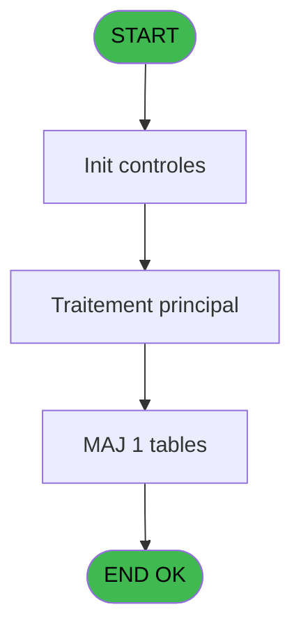
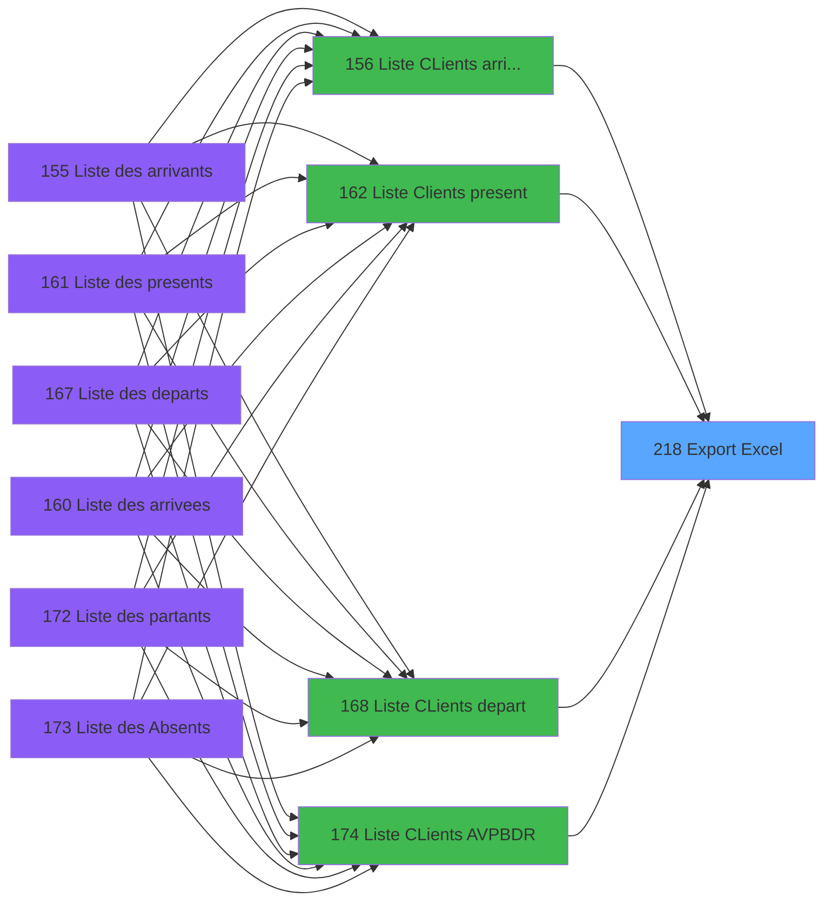

# PBP IDE 218 - Export Excel

> **Analyse**: Phases 1-4 2026-02-03 15:52 -> 15:53 (16s) | Assemblage 15:53
> **Pipeline**: V7.2 Enrichi
> **Structure**: 4 onglets (Resume | Ecrans | Donnees | Connexions)

<!-- TAB:Resume -->

## 1. FICHE D'IDENTITE

| Attribut | Valeur |
|----------|--------|
| Projet | PBP |
| IDE Position | 218 |
| Nom Programme | Export Excel |
| Fichier source | `Prg_218.xml` |
| Dossier IDE | Liste |
| Taches | 6 (1 ecrans visibles) |
| Tables modifiees | 1 |
| Programmes appeles | 0 |

## 2. DESCRIPTION FONCTIONNELLE

**Export Excel** assure la gestion complete de ce processus, accessible depuis [  Liste CLients arrivant (IDE 156)](PBP-IDE-156.md), [  Liste Clients present (IDE 162)](PBP-IDE-162.md), [  Liste CLients depart (IDE 168)](PBP-IDE-168.md), [Liste CLients AVPBDR (IDE 174)](PBP-IDE-174.md).

Le flux de traitement s'organise en **1 blocs fonctionnels** :

- **Traitement** (6 taches) : traitements metier divers

**Donnees modifiees** : 1 tables en ecriture (temp_ventes).

**Logique metier** : 1 regles identifiees couvrant conditions metier.

Detail : phases du traitement

#### Phase 1 : Traitement (6 taches)

- **218** - Export Excel **[[ECRAN]](#ecran-t1)**
- **218.1** - Generation Tempo Excel **[[ECRAN]](#ecran-t2)**
- **218.1.1** - Commentaires
- **218.1.2** - Prestations
- **218.2** - Elimine separator excel **[[ECRAN]](#ecran-t6)**
- **218.3** - Export - TEMPO Liste Ecran **[[ECRAN]](#ecran-t8)**

#### Tables impactees

| Table | Operations | Role metier |
|-------|-----------|-------------|
| temp_ventes | **W**/L (3 usages) | Donnees de ventes |

## 3. BLOCS FONCTIONNELS

### 3.1 Traitement (6 taches)

Traitements internes.

---

#### 218 - Export Excel [[ECRAN]](#ecran-t1)

**Role** : Tache d'orchestration : point d'entree du programme (6 sous-taches). Coordonne l'enchainement des traitements.
**Ecran** : 204 x 89 DLU (MDI) | [Voir mockup](#ecran-t1)

5 sous-taches directes

| Tache | Nom | Bloc |
|-------|-----|------|
| [218.1](#t2) | Generation Tempo Excel **[[ECRAN]](#ecran-t2)** | Traitement |
| [218.1.1](#t3) | Commentaires | Traitement |
| [218.1.2](#t4) | Prestations | Traitement |
| [218.2](#t6) | Elimine separator excel **[[ECRAN]](#ecran-t6)** | Traitement |
| [218.3](#t8) | Export - TEMPO Liste Ecran **[[ECRAN]](#ecran-t8)** | Traitement |

**Variables liees** : B (P.i Nom Fichier Excel), D (P.i Type Export), H (v.separator_excel), I (v.NomFichier Excel)

---

#### 218.1 - Generation Tempo Excel [[ECRAN]](#ecran-t2)

**Role** : Traitement : Generation Tempo Excel.
**Ecran** : 100 x 15 DLU (MDI) | [Voir mockup](#ecran-t2)
**Variables liees** : B (P.i Nom Fichier Excel), H (v.separator_excel), I (v.NomFichier Excel)

---

#### 218.1.1 - Commentaires

**Role** : Traitement : Commentaires.

---

#### 218.1.2 - Prestations

**Role** : Traitement : Prestations.

---

#### 218.2 - Elimine separator excel [[ECRAN]](#ecran-t6)

**Role** : Traitement : Elimine separator excel.
**Ecran** : 106 x 15 DLU (MDI) | [Voir mockup](#ecran-t6)
**Variables liees** : B (P.i Nom Fichier Excel), H (v.separator_excel), I (v.NomFichier Excel)

---

#### 218.3 - Export - TEMPO Liste Ecran [[ECRAN]](#ecran-t8)

**Role** : Traitement : Export - TEMPO Liste Ecran.
**Ecran** : 667 x 127 DLU (MDI) | [Voir mockup](#ecran-t8)
**Variables liees** : D (P.i Type Export)

## 5. REGLES METIER

1 regles identifiees:

### Autres (1 regles)

#### [RM-001] Traitement si Trim(P.I Heure Depart village [E]) est renseigne

| Element | Detail |
|---------|--------|
| **Condition** | `Trim(P.I Heure Depart village [E])<>''` |
| **Si vrai** | Trim(P.I Heure Depart village [E]) |
| **Si faux** | 'C:\temp\PRO1.csv') |
| **Variables** | E (P.I Heure Depart village) |
| **Expression source** | Expression 3 : `IF(Trim(P.I Heure Depart village [E])<>'',Trim(P.I Heure Dep` |
| **Exemple** | Si Trim(P.I Heure Depart village [E])<>'' → Trim(P.I Heure Depart village [E]). Sinon → 'C:\temp\PRO1.csv') |

## 6. CONTEXTE

- **Appele par**: [  Liste CLients arrivant (IDE 156)](PBP-IDE-156.md), [  Liste Clients present (IDE 162)](PBP-IDE-162.md), [  Liste CLients depart (IDE 168)](PBP-IDE-168.md), [Liste CLients AVPBDR (IDE 174)](PBP-IDE-174.md)
- **Appelle**: 0 programmes | **Tables**: 14 (W:1 R:4 L:11) | **Taches**: 6 | **Expressions**: 3

<!-- TAB:Ecrans -->

## 8. ECRANS

### 8.1 Forms visibles (1 / 6)

| # | Position | Tache | Nom | Type | Largeur | Hauteur | Bloc |
|---|----------|-------|-----|------|---------|---------|------|
| 1 | 218 | 218 | Export Excel | MDI | 204 | 89 | Traitement |

### 8.2 Mockups Ecrans

---

#### 218 - Export Excel
**Tache** : [218](#t1) | **Type** : MDI | **Dimensions** : 204 x 89 DLU
**Bloc** : Traitement | **Titre IDE** : Export Excel

<!-- FORM-DATA:
{
    "width":  204,
    "vFactor":  8,
    "type":  "MDI",
    "hFactor":  4,
    "controls":  [
                     {
                         "x":  44,
                         "type":  "label",
                         "var":  "",
                         "y":  56,
                         "w":  116,
                         "fmt":  "",
                         "name":  "",
                         "h":  8,
                         "color":  "7",
                         "text":  "Traitement en cours ...",
                         "parent":  5
                     },
                     {
                         "x":  4,
                         "type":  "label",
                         "var":  "",
                         "y":  6,
                         "w":  197,
                         "fmt":  "",
                         "name":  "",
                         "h":  72,
                         "color":  "",
                         "text":  "",
                         "parent":  null
                     },
                     {
                         "x":  82,
                         "type":  "image",
                         "var":  "",
                         "y":  24,
                         "w":  40,
                         "fmt":  "",
                         "name":  "",
                         "h":  25,
                         "color":  "",
                         "text":  "",
                         "parent":  5
                     }
                 ],
    "taskId":  "218",
    "height":  89
}
-->

## 9. NAVIGATION

Ecran unique: **Export Excel**

### 9.3 Structure hierarchique (6 taches)

| Position | Tache | Type | Dimensions | Bloc |
|----------|-------|------|------------|------|
| **218.1** | [**Export Excel** (218)](#t1) [mockup](#ecran-t1) | MDI | 204x89 | Traitement |
| 218.1.1 | [Generation Tempo Excel (218.1)](#t2) [mockup](#ecran-t2) | MDI | 100x15 | |
| 218.1.2 | [Commentaires (218.1.1)](#t3) | MDI | - | |
| 218.1.3 | [Prestations (218.1.2)](#t4) | MDI | - | |
| 218.1.4 | [Elimine separator excel (218.2)](#t6) [mockup](#ecran-t6) | MDI | 106x15 | |
| 218.1.5 | [Export - TEMPO Liste Ecran (218.3)](#t8) [mockup](#ecran-t8) | MDI | 667x127 | |

### 9.4 Algorigramme

> **Legende**: Vert = START/END OK | Rouge = END KO | Bleu = Decisions
> *Algorigramme auto-genere. Utiliser `/algorigramme` pour une synthese metier detaillee.*

<!-- TAB:Donnees -->

## 10. TABLES

### Tables utilisees (14)

| ID | Nom | Description | Type | R | W | L | Usages |
|----|-----|-------------|------|---|---|---|--------|
| 31 | gm-complet_______gmc |  | DB | R |   |   | 1 |
| 33 | prestations______pre | Prestations/services vendus | DB | R |   |   | 1 |
| 34 | hebergement______heb | Hebergement (chambres) | DB | R |   | L | 2 |
| 36 | client_gm |  | DB |   |   | L | 1 |
| 135 | libelle_prestation | Prestations/services vendus | DB |   |   | L | 1 |
| 171 | commentaire______com |  | DB | R |   |   | 1 |
| 285 | email |  | DB |   |   | L | 1 |
| 358 | import_mod |  | DB |   |   | L | 1 |
| 364 | pms_footer_comment |  | DB |   |   | L | 1 |
| 619 | tempo_userlist | Table temporaire ecran | TMP |   |   | L | 1 |
| 630 | temp_ventes | Donnees de ventes | DB |   | **W** | L | 3 |
| 804 | valeur_credit_bar_defaut |  | DB |   |   | L | 1 |
| 845 | stat_vendeur_date |  | TMP |   |   | L | 1 |
| 880 | evenement |  | DB |   |   | L | 1 |

### Colonnes par table (3 / 5 tables avec colonnes identifiees)

Table 31 - gm-complet_______gmc (R) - 1 usages

*Table utilisee uniquement en Link ou aucune colonne Real identifiee dans le DataView.*

Table 33 - prestations______pre (R) - 1 usages

*Table utilisee uniquement en Link ou aucune colonne Real identifiee dans le DataView.*

Table 34 - hebergement______heb (R/L) - 2 usages

| Lettre | Variable | Acces | Type |
|--------|----------|-------|------|
| A | v.Lien ECI (quest.60 Loc.) | R | Logical |
| B | v.Lien ECI (quest.61 Cours) | R | Logical |
| C | v.Lien ECI (quest.62 Enfant) | R | Logical |
| D | v.Libellé Affichage EA | R | Alpha |
| E | v.Ordre Tri | R | Alpha |
| F | v.Ligne Export | R | Alpha |
| G | v.Spécifique Arrivants/Présents | R | Alpha |

Table 171 - commentaire______com (R) - 1 usages

*Table utilisee uniquement en Link ou aucune colonne Real identifiee dans le DataView.*

Table 630 - temp_ventes (**W**/L) - 3 usages

| Lettre | Variable | Acces | Type |
|--------|----------|-------|------|
| A | v.Retour Easy Arr (Question.60) | W | Logical |
| B | BUFFERin | W | Alpha |
| C | BUFFERout | W | Alpha |

## 11. VARIABLES

### 11.1 Parametres entrants (5)

Variables recues du programme appelant ([  Liste CLients arrivant (IDE 156)](PBP-IDE-156.md)).

| Lettre | Nom | Type | Usage dans |
|--------|-----|------|-----------|
| A | P.i Date Demandee | Date | - |
| B | P.i Nom Fichier Excel | Alpha | - |
| C | P.i Tri Nom / Filiation | Logical | - |
| D | P.i Type Export | Alpha | - |
| E | P.I Heure Depart village | Logical | 1x parametre entrant |

### 11.2 Variables de session (2)

Variables persistantes pendant toute la session.

| Lettre | Nom | Type | Usage dans |
|--------|-----|------|-----------|
| H | v.separator_excel | Alpha | - |
| I | v.NomFichier Excel | Alpha | - |

### 11.3 Autres (2)

Variables diverses.

| Lettre | Nom | Type | Usage dans |
|--------|-----|------|-----------|
| F | >Libellé Sélection du Solde* | Unicode | - |
| G | >Soldé,Non_soldé,Tous | Unicode | - |

## 12. EXPRESSIONS

**3 / 3 expressions decodees (100%)**

### 12.1 Repartition par type

| Type | Expressions | Regles |
|------|-------------|--------|
| CONDITION | 1 | 5 |
| OTHER | 1 | 0 |
| STRING | 1 | 0 |

### 12.2 Expressions cles par type

#### CONDITION (1 expressions)

| Type | IDE | Expression | Regle |
|------|-----|------------|-------|
| CONDITION | 3 | `IF(Trim(P.I Heure Depart village [E])<>'',Trim(P.I Heure Depart village [E]),'C:\temp\PRO1.csv')` | [RM-001](#rm-RM-001) |

#### OTHER (1 expressions)

| Type | IDE | Expression | Regle |
|------|-----|------------|-------|
| OTHER | 1 | `DbDel ('{630,2}'DSOURCE,'')` | - |

#### STRING (1 expressions)

| Type | IDE | Expression | Regle |
|------|-----|------------|-------|
| STRING | 2 | `Trim (INIGet ('[MAGIC_LOGICAL_NAMES]club_excel_separator'))` | - |

<!-- TAB:Connexions -->

## 13. GRAPHE D'APPELS

### 13.1 Chaine depuis Main (Callers)

Main -> ... -> [  Liste CLients arrivant (IDE 156)](PBP-IDE-156.md) -> **Export Excel (IDE 218)**

Main -> ... -> [  Liste Clients present (IDE 162)](PBP-IDE-162.md) -> **Export Excel (IDE 218)**

Main -> ... -> [  Liste CLients depart (IDE 168)](PBP-IDE-168.md) -> **Export Excel (IDE 218)**

Main -> ... -> [Liste CLients AVPBDR (IDE 174)](PBP-IDE-174.md) -> **Export Excel (IDE 218)**

### 13.2 Callers

| IDE | Nom Programme | Nb Appels |
|-----|---------------|-----------|
| [156](PBP-IDE-156.md) |   Liste CLients arrivant | 1 |
| [162](PBP-IDE-162.md) |   Liste Clients present | 1 |
| [168](PBP-IDE-168.md) |   Liste CLients depart | 1 |
| [174](PBP-IDE-174.md) | Liste CLients AVPBDR | 1 |

### 13.3 Callees (programmes appeles)

### 13.4 Detail Callees avec contexte

| IDE | Nom Programme | Appels | Contexte |
|-----|---------------|--------|----------|
| - | (aucun) | - | - |

## 14. RECOMMANDATIONS MIGRATION

### 14.1 Profil du programme

| Metrique | Valeur | Impact migration |
|----------|--------|-----------------|
| Lignes de logique | 430 | Taille moyenne |
| Expressions | 3 | Peu de logique |
| Tables WRITE | 1 | Impact faible |
| Sous-programmes | 0 | Peu de dependances |
| Ecrans visibles | 1 | Ecran unique ou traitement batch |
| Code desactive | 0% (0 / 430) | Code sain |
| Regles metier | 1 | Quelques regles a preserver |

### 14.2 Plan de migration par bloc

#### Traitement (6 taches: 4 ecrans, 2 traitements)

- **Strategie** : Orchestrateur avec 4 ecrans (Razor/React) et 2 traitements backend (services).
- Les ecrans deviennent des composants UI, les traitements invisibles deviennent des services injectables.
- Decomposer les taches en services unitaires testables.

### 14.3 Dependances critiques

| Dependance | Type | Appels | Impact |
|------------|------|--------|--------|
| temp_ventes | Table WRITE (Database) | 1x | Schema + repository |

---
*Spec DETAILED generee par Pipeline V7.2 - 2026-02-03 15:53*
