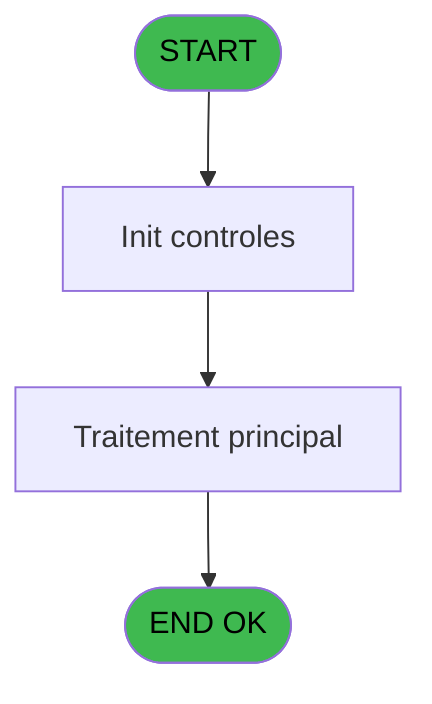

# PBP IDE 223 - batch edition allergènes

> **Analyse**: Phases 1-4 2026-02-03 15:54 -> 15:54 (11s) | Assemblage 15:54
> **Pipeline**: V7.2 Enrichi
> **Structure**: 4 onglets (Resume | Ecrans | Donnees | Connexions)

<!-- TAB:Resume -->

## 1. FICHE D'IDENTITE

| Attribut | Valeur |
|----------|--------|
| Projet | PBP |
| IDE Position | 223 |
| Nom Programme | batch edition allergènes |
| Fichier source | `Prg_223.xml` |
| Dossier IDE | Liste |
| Taches | 1 (0 ecrans visibles) |
| Tables modifiees | 0 |
| Programmes appeles | 0 |

## 2. DESCRIPTION FONCTIONNELLE

**batch edition allergènes** assure la gestion complete de ce processus, accessible depuis [Allergenes adultes (IDE 222)](PBP-IDE-222.md).

Le flux de traitement s'organise en **1 blocs fonctionnels** :

- **Impression** (1 tache) : generation de tickets et documents

## 3. BLOCS FONCTIONNELS

### 3.1 Impression (1 tache)

Generation des documents et tickets.

---

#### 223 - batch edition allergènes

**Role** : Generation du document : batch edition allergènes.

## 5. REGLES METIER

*(Aucune regle metier identifiee)*

## 6. CONTEXTE

- **Appele par**: [Allergenes adultes (IDE 222)](PBP-IDE-222.md)
- **Appelle**: 0 programmes | **Tables**: 0 (W:0 R:0 L:0) | **Taches**: 1 | **Expressions**: 6

<!-- TAB:Ecrans -->

## 8. ECRANS

*(Programme sans ecran visible)*

## 9. NAVIGATION

### 9.3 Structure hierarchique (1 tache)

| Position | Tache | Type | Dimensions | Bloc |
|----------|-------|------|------------|------|
| **223.1** | [**batch edition allergènes** (223)](#t1) | - | - | Impression |

### 9.4 Algorigramme

> **Legende**: Vert = START/END OK | Rouge = END KO | Bleu = Decisions
> *Algorigramme auto-genere. Utiliser `/algorigramme` pour une synthese metier detaillee.*

<!-- TAB:Donnees -->

## 10. TABLES

### Tables utilisees (0)

| ID | Nom | Description | Type | R | W | L | Usages |
|----|-----|-------------|------|---|---|---|--------|

### Colonnes par table (0 / 0 tables avec colonnes identifiees)

## 11. VARIABLES

### 11.1 Parametres entrants (2)

Variables recues du programme appelant ([Allergenes adultes (IDE 222)](PBP-IDE-222.md)).

| Lettre | Nom | Type | Usage dans |
|--------|-----|------|-----------|
| A | p. Date debut | Date | 2x parametre entrant |
| B | p. Date fin | Date | 2x parametre entrant |

### 11.2 Variables de session (13)

Variables persistantes pendant toute la session.

| Lettre | Nom | Type | Usage dans |
|--------|-----|------|-----------|
| C | v. Nom | Unicode | - |
| D | v. Prenom | Unicode | - |
| E | v. debut séjour | Unicode | - |
| F | v. fin séjour | Unicode | 1x session |
| G | v. Lieu séjour | Unicode | 1x session |
| H | v. type logement | Unicode | 1x session |
| I | v. Chambre | Unicode | 1x session |
| J | v. Pays | Unicode | 1x session |
| K | v. Sexe | Unicode | 1x session |
| L | v. Fidelite | Unicode | 1x session |
| M | v. liste allergenes | Unicode | 1x session |
| N | v. séparateur | Unicode | 1x session |
| O | v. ligne export | Unicode | 1x session |

## 12. EXPRESSIONS

**6 / 6 expressions decodees (100%)**

### 12.1 Repartition par type

| Type | Expressions | Regles |
|------|-------------|--------|
| FORMAT | 4 | 0 |
| REFERENCE_VG | 1 | 0 |
| CONCATENATION | 1 | 0 |

### 12.2 Expressions cles par type

#### FORMAT (4 expressions)

| Type | IDE | Expression | Regle |
|------|-----|------------|-------|
| FORMAT | 3 | `Trim(v. fin séjour [F])&[S]&Trim(v. Lieu séjour [G])&[S]&Trim(DStr(DVal(v. type logement [H],'YYYYMMDD'),'DD/MM/YYYY'))&[S]&Trim(DStr(DVal(v. Chambre [I],'YYYYMMDD'),'DD/MM/YYYY'))&[S]&Trim(v. Pays [J])&[S]&Trim(v. liste allergenes [M])&[S]&Trim(v. Sexe [K])&[S]&Trim(v. Fidelite [L])&[S]&Trim(v. séparateur [N])&[S]&Trim(v. ligne export [O])&[S]&Trim([P])` | - |
| FORMAT | 5 | `Translate('%club_exportdata%')&'Liste_allergenes_'&DStr(p. Date debut [A],'YYYYMMDD')&'_'&DStr(p. Date fin [B],'YYYYMMDD')&'.csv'` | - |
| FORMAT | 1 | `DStr(p. Date debut [A],'YYYYMMDD')` | - |
| FORMAT | 2 | `DStr(p. Date fin [B],'YYYYMMDD')` | - |

#### REFERENCE_VG (1 expressions)

| Type | IDE | Expression | Regle |
|------|-----|------------|-------|
| REFERENCE_VG | 6 | `VG36` | - |

#### CONCATENATION (1 expressions)

| Type | IDE | Expression | Regle |
|------|-----|------------|-------|
| CONCATENATION | 4 | `Trim('Nom')&[S]&Trim('Prénom')&[S]&Trim('Début séjour')&[S]&Trim('Fin séjour')&[S]&Trim('Lieu séjour')&[S]&Trim('Type logement')&[S]&Trim('Chambre')&[S]&Trim('Pays')&[S]&Trim('Sexe')&[S]&Trim('Fidelite')&[S]&Trim('Liste allergènes')` | - |

<!-- TAB:Connexions -->

## 13. GRAPHE D'APPELS

### 13.1 Chaine depuis Main (Callers)

Main -> ... -> [Allergenes adultes (IDE 222)](PBP-IDE-222.md) -> **batch edition allergènes (IDE 223)**

### 13.2 Callers

| IDE | Nom Programme | Nb Appels |
|-----|---------------|-----------|
| [222](PBP-IDE-222.md) | Allergenes adultes | 1 |

### 13.3 Callees (programmes appeles)

### 13.4 Detail Callees avec contexte

| IDE | Nom Programme | Appels | Contexte |
|-----|---------------|--------|----------|
| - | (aucun) | - | - |

## 14. RECOMMANDATIONS MIGRATION

### 14.1 Profil du programme

| Metrique | Valeur | Impact migration |
|----------|--------|-----------------|
| Lignes de logique | 22 | Programme compact |
| Expressions | 6 | Peu de logique |
| Tables WRITE | 0 | Impact faible |
| Sous-programmes | 0 | Peu de dependances |
| Ecrans visibles | 0 | Ecran unique ou traitement batch |
| Code desactive | 0% (0 / 22) | Code sain |
| Regles metier | 0 | Pas de regle identifiee |

### 14.2 Plan de migration par bloc

#### Impression (1 tache: 0 ecran, 1 traitement)

- **Strategie** : Templates HTML -> PDF via wkhtmltopdf ou Puppeteer.
- `PrintService` injectable avec choix imprimante

### 14.3 Dependances critiques

| Dependance | Type | Appels | Impact |
|------------|------|--------|--------|

---
*Spec DETAILED generee par Pipeline V7.2 - 2026-02-03 15:54*
