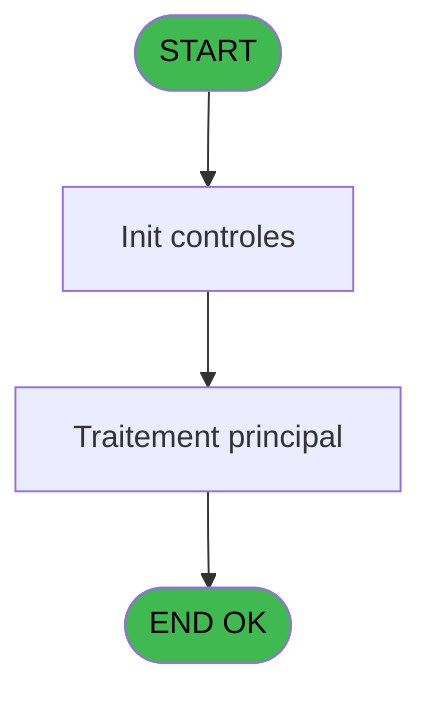
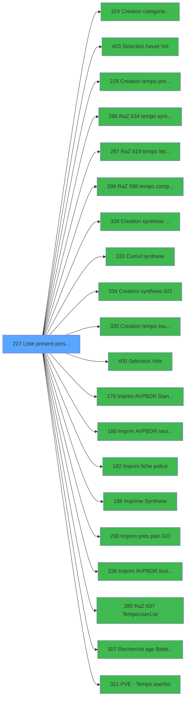

# PBP IDE 227 - Liste present personnel plan

> **Analyse**: Phases 1-4 2026-02-03 15:55 -> 15:55 (11s) | Assemblage 15:55
> **Pipeline**: V7.2 Enrichi
> **Structure**: 4 onglets (Resume | Ecrans | Donnees | Connexions)

<!-- TAB:Resume -->

## 1. FICHE D'IDENTITE

| Attribut | Valeur |
|----------|--------|
| Projet | PBP |
| IDE Position | 227 |
| Nom Programme | Liste present personnel plan |
| Fichier source | `Prg_227.xml` |
| Dossier IDE | Liste |
| Taches | 1 (1 ecrans visibles) |
| Tables modifiees | 0 |
| Programmes appeles | 20 |

## 2. DESCRIPTION FONCTIONNELLE

**Liste present personnel plan** assure la gestion complete de ce processus, accessible depuis [Liste des presents personnel (IDE 226)](PBP-IDE-226.md).

Le flux de traitement s'organise en **1 blocs fonctionnels** :

- **Traitement** (1 tache) : traitements metier divers

**Logique metier** : 5 regles identifiees couvrant conditions metier.

## 3. BLOCS FONCTIONNELS

### 3.1 Traitement (1 tache)

Traitements internes.

---

#### 227 - Liste CLients ABPBDR [[ECRAN]](#ecran-t1)

**Role** : Traitement : Liste CLients ABPBDR.
**Ecran** : 1562 x 200 DLU (MDI) | [Voir mockup](#ecran-t1)
**Variables liees** : B (>CodeListe), F (>TypeListe), P (w0_TopListe), R (w0_Liste), S (b_Liste)
**Delegue a** : [Cumul synthese (IDE 333)](PBP-IDE-333.md), [PVE -> Tempo userlist (IDE 321)](PBP-IDE-321.md)

## 5. REGLES METIER

5 regles identifiees:

### Autres (5 regles)

#### [RM-001] Si >CodeListe [B]='D' OR >CodeListe [B]='R' alors 'R' sinon 'A')

| Element | Detail |
|---------|--------|
| **Condition** | `>CodeListe [B]='D' OR >CodeListe [B]='R'` |
| **Si vrai** | 'R' |
| **Si faux** | 'A') |
| **Variables** | B (>CodeListe) |
| **Expression source** | Expression 6 : `IF (>CodeListe [B]='D' OR >CodeListe [B]='R','R','A')` |
| **Exemple** | Si >CodeListe [B]='D' OR >CodeListe [B]='R' → 'R'. Sinon → 'A') |
| **Impact** | [227 - Liste CLients ABPBDR](#t1) |

#### [RM-002] Si >CodeListe [B]='D' alors 'R' sinon 'A')

| Element | Detail |
|---------|--------|
| **Condition** | `>CodeListe [B]='D'` |
| **Si vrai** | 'R' |
| **Si faux** | 'A') |
| **Variables** | B (>CodeListe) |
| **Expression source** | Expression 61 : `IF (>CodeListe [B]='D','R','A')` |
| **Exemple** | Si >CodeListe [B]='D' → 'R'. Sinon → 'A') |
| **Impact** | [227 - Liste CLients ABPBDR](#t1) |

#### [RM-003] Si [AS]='VV1' alors 0 sinon IF ([AS]='VV2',13,20))

| Element | Detail |
|---------|--------|
| **Condition** | `[AS]='VV1'` |
| **Si vrai** | 0 |
| **Si faux** | IF ([AS]='VV2',13,20)) |
| **Expression source** | Expression 69 : `IF ([AS]='VV1',0,IF ([AS]='VV2',13,20))` |
| **Exemple** | Si [AS]='VV1' → 0. Sinon → IF ([AS]='VV2',13,20)) |

#### [RM-004] Si InStr ('RDP' alors >CodeListe [B])>0 sinon 0,w0_OkVol [K])

| Element | Detail |
|---------|--------|
| **Condition** | `InStr ('RDP'` |
| **Si vrai** | >CodeListe [B])>0 |
| **Si faux** | 0,w0_OkVol [K]) |
| **Variables** | B (>CodeListe), K (w0_OkVol) |
| **Expression source** | Expression 72 : `IF (InStr ('RDP',>CodeListe [B])>0,0,w0_OkVol [K])` |
| **Exemple** | Si InStr ('RDP' → >CodeListe [B])>0. Sinon → 0,w0_OkVol [K]) |
| **Impact** | [227 - Liste CLients ABPBDR](#t1) |

#### [RM-005] Si InStr ('RD' alors >CodeListe [B])>0 sinon 0,w0_OkVol [K])

| Element | Detail |
|---------|--------|
| **Condition** | `InStr ('RD'` |
| **Si vrai** | >CodeListe [B])>0 |
| **Si faux** | 0,w0_OkVol [K]) |
| **Variables** | B (>CodeListe), K (w0_OkVol) |
| **Expression source** | Expression 73 : `IF (InStr ('RD',>CodeListe [B])>0,0,w0_OkVol [K])` |
| **Exemple** | Si InStr ('RD' → >CodeListe [B])>0. Sinon → 0,w0_OkVol [K]) |
| **Impact** | [227 - Liste CLients ABPBDR](#t1) |

## 6. CONTEXTE

- **Appele par**: [Liste des presents personnel (IDE 226)](PBP-IDE-226.md)
- **Appelle**: 20 programmes | **Tables**: 4 (W:0 R:1 L:3) | **Taches**: 1 | **Expressions**: 132

<!-- TAB:Ecrans -->

## 8. ECRANS

### 8.1 Forms visibles (1 / 1)

| # | Position | Tache | Nom | Type | Largeur | Hauteur | Bloc |
|---|----------|-------|-----|------|---------|---------|------|
| 1 | 227 | 227 | Liste CLients ABPBDR | MDI | 1562 | 200 | Traitement |

### 8.2 Mockups Ecrans

---

#### 227 - Liste CLients ABPBDR
**Tache** : [227](#t1) | **Type** : MDI | **Dimensions** : 1562 x 200 DLU
**Bloc** : Traitement | **Titre IDE** : Liste CLients ABPBDR

<!-- FORM-DATA:
{
    "width":  1562,
    "vFactor":  8,
    "type":  "MDI",
    "hFactor":  8,
    "controls":  [
                     {
                         "x":  1,
                         "type":  "label",
                         "var":  "",
                         "y":  0,
                         "w":  1550,
                         "fmt":  "",
                         "name":  "",
                         "h":  20,
                         "color":  "1",
                         "text":  "",
                         "parent":  null
                     },
                     {
                         "x":  381,
                         "type":  "label",
                         "var":  "",
                         "y":  27,
                         "w":  331,
                         "fmt":  "",
                         "name":  "",
                         "h":  143,
                         "color":  "195",
                         "text":  "Paramètres",
                         "parent":  null
                     },
                     {
                         "x":  2,
                         "type":  "table",
                         "var":  "",
                         "name":  "",
                         "titleH":  12,
                         "color":  "110",
                         "w":  373,
                         "y":  26,
                         "fmt":  "",
                         "parent":  null,
                         "text":  "",
                         "rowH":  11,
                         "h":  143,
                         "cols":  [
                                      {
                                          "title":  "",
                                          "layer":  1,
                                          "w":  336
                                      }
                                  ],
                         "rows":  1
                     },
                     {
                         "x":  1100,
                         "type":  "label",
                         "var":  "",
                         "y":  27,
                         "w":  258,
                         "fmt":  "",
                         "name":  "",
                         "h":  143,
                         "color":  "",
                         "text":  "",
                         "parent":  null
                     },
                     {
                         "x":  1100,
                         "type":  "label",
                         "var":  "",
                         "y":  27,
                         "w":  258,
                         "fmt":  "",
                         "name":  "",
                         "h":  49,
                         "color":  "",
                         "text":  "",
                         "parent":  null
                     },
                     {
                         "x":  1100,
                         "type":  "label",
                         "var":  "",
                         "y":  27,
                         "w":  258,
                         "fmt":  "",
                         "name":  "",
                         "h":  49,
                         "color":  "",
                         "text":  "",
                         "parent":  null
                     },
                     {
                         "x":  1362,
                         "type":  "label",
                         "var":  "",
                         "y":  27,
                         "w":  186,
                         "fmt":  "",
                         "name":  "",
                         "h":  143,
                         "color":  "",
                         "text":  "",
                         "parent":  null
                     },
                     {
                         "x":  1110,
                         "type":  "label",
                         "var":  "",
                         "y":  32,
                         "w":  96,
                         "fmt":  "",
                         "name":  "",
                         "h":  8,
                         "color":  "",
                         "text":  "Port Arrivee",
                         "parent":  7
                     },
                     {
                         "x":  1109,
                         "type":  "label",
                         "var":  "",
                         "y":  33,
                         "w":  82,
                         "fmt":  "",
                         "name":  "",
                         "h":  8,
                         "color":  "",
                         "text":  "Séminaire",
                         "parent":  9
                     },
                     {
                         "x":  463,
                         "type":  "label",
                         "var":  "",
                         "y":  38,
                         "w":  182,
                         "fmt":  "",
                         "name":  "",
                         "h":  36,
                         "color":  "",
                         "text":  "",
                         "parent":  null
                     },
                     {
                         "x":  1137,
                         "type":  "label",
                         "var":  "",
                         "y":  39,
                         "w":  109,
                         "fmt":  "",
                         "name":  "",
                         "h":  8,
                         "color":  "",
                         "text":  "Age Minimum",
                         "parent":  8
                     },
                     {
                         "x":  507,
                         "type":  "label",
                         "var":  "",
                         "y":  44,
                         "w":  46,
                         "fmt":  "",
                         "name":  "",
                         "h":  9,
                         "color":  "",
                         "text":  "Total",
                         "parent":  14
                     },
                     {
                         "x":  1137,
                         "type":  "label",
                         "var":  "",
                         "y":  55,
                         "w":  114,
                         "fmt":  "",
                         "name":  "",
                         "h":  8,
                         "color":  "",
                         "text":  "Age Maximum",
                         "parent":  8
                     },
                     {
                         "x":  475,
                         "type":  "label",
                         "var":  "",
                         "y":  58,
                         "w":  78,
                         "fmt":  "",
                         "name":  "",
                         "h":  9,
                         "color":  "",
                         "text":  "Sélection",
                         "parent":  14
                     },
                     {
                         "x":  1109,
                         "type":  "label",
                         "var":  "",
                         "y":  59,
                         "w":  30,
                         "fmt":  "",
                         "name":  "",
                         "h":  8,
                         "color":  "",
                         "text":  "Du",
                         "parent":  9
                     },
                     {
                         "x":  1110,
                         "type":  "label",
                         "var":  "",
                         "y":  60,
                         "w":  45,
                         "fmt":  "",
                         "name":  "",
                         "h":  8,
                         "color":  "",
                         "text":  "Date",
                         "parent":  7
                     },
                     {
                         "x":  1105,
                         "type":  "line",
                         "var":  "",
                         "y":  75,
                         "w":  249,
                         "fmt":  "",
                         "name":  "",
                         "h":  0,
                         "color":  "",
                         "text":  "",
                         "parent":  7
                     },
                     {
                         "x":  1110,
                         "type":  "label",
                         "var":  "",
                         "y":  80,
                         "w":  98,
                         "fmt":  "",
                         "name":  "",
                         "h":  8,
                         "color":  "",
                         "text":  "Dernier Port",
                         "parent":  7
                     },
                     {
                         "x":  394,
                         "type":  "label",
                         "var":  "",
                         "y":  79,
                         "w":  45,
                         "fmt":  "",
                         "name":  "",
                         "h":  9,
                         "color":  "",
                         "text":  "Date",
                         "parent":  5
                     },
                     {
                         "x":  394,
                         "type":  "label",
                         "var":  "",
                         "y":  91,
                         "w":  54,
                         "fmt":  "",
                         "name":  "",
                         "h":  8,
                         "color":  "",
                         "text":  "Heure",
                         "parent":  5
                     },
                     {
                         "x":  1112,
                         "type":  "label",
                         "var":  "",
                         "y":  107,
                         "w":  45,
                         "fmt":  "",
                         "name":  "",
                         "h":  8,
                         "color":  "",
                         "text":  "Date",
                         "parent":  7
                     },
                     {
                         "x":  394,
                         "type":  "label",
                         "var":  "",
                         "y":  105,
                         "w":  43,
                         "fmt":  "",
                         "name":  "",
                         "h":  9,
                         "color":  "",
                         "text":  "Liste",
                         "parent":  5
                     },
                     {
                         "x":  1105,
                         "type":  "line",
                         "var":  "",
                         "y":  121,
                         "w":  249,
                         "fmt":  "",
                         "name":  "",
                         "h":  0,
                         "color":  "",
                         "text":  "",
                         "parent":  7
                     },
                     {
                         "x":  394,
                         "type":  "label",
                         "var":  "",
                         "y":  119,
                         "w":  90,
                         "fmt":  "",
                         "name":  "",
                         "h":  9,
                         "color":  "",
                         "text":  "Lieu séjour",
                         "parent":  5
                     },
                     {
                         "x":  1110,
                         "type":  "label",
                         "var":  "",
                         "y":  127,
                         "w":  110,
                         "fmt":  "",
                         "name":  "",
                         "h":  8,
                         "color":  "",
                         "text":  "Prochain Port",
                         "parent":  7
                     },
                     {
                         "x":  1110,
                         "type":  "label",
                         "var":  "",
                         "y":  154,
                         "w":  45,
                         "fmt":  "",
                         "name":  "",
                         "h":  8,
                         "color":  "",
                         "text":  "Date",
                         "parent":  7
                     },
                     {
                         "x":  2,
                         "type":  "label",
                         "var":  "",
                         "y":  174,
                         "w":  1550,
                         "fmt":  "",
                         "name":  "",
                         "h":  24,
                         "color":  "1",
                         "text":  "",
                         "parent":  null
                     },
                     {
                         "x":  394,
                         "type":  "label",
                         "var":  "",
                         "y":  132,
                         "w":  162,
                         "fmt":  "",
                         "name":  "",
                         "h":  9,
                         "color":  "",
                         "text":  "Enlever les absents",
                         "parent":  5
                     },
                     {
                         "x":  486,
                         "type":  "edit",
                         "var":  "",
                         "y":  79,
                         "w":  126,
                         "fmt":  "",
                         "name":  "w0_Date",
                         "h":  10,
                         "color":  "6",
                         "text":  "",
                         "parent":  5
                     },
                     {
                         "x":  616,
                         "type":  "button",
                         "var":  "",
                         "y":  79,
                         "w":  25,
                         "fmt":  "...",
                         "name":  "b_Date",
                         "h":  10,
                         "color":  "",
                         "text":  "",
                         "parent":  5
                     },
                     {
                         "x":  486,
                         "type":  "edit",
                         "var":  "",
                         "y":  91,
                         "w":  37,
                         "fmt":  "2P0Z0",
                         "name":  "w0_HeureNum",
                         "h":  10,
                         "color":  "6",
                         "text":  "",
                         "parent":  5
                     },
                     {
                         "x":  486,
                         "type":  "edit",
                         "var":  "",
                         "y":  105,
                         "w":  182,
                         "fmt":  "",
                         "name":  "w0_Liste",
                         "h":  10,
                         "color":  "6",
                         "text":  "",
                         "parent":  5
                     },
                     {
                         "x":  672,
                         "type":  "button",
                         "var":  "",
                         "y":  105,
                         "w":  25,
                         "fmt":  "...",
                         "name":  "b_Liste",
                         "h":  10,
                         "color":  "",
                         "text":  "",
                         "parent":  5
                     },
                     {
                         "x":  562,
                         "type":  "edit",
                         "var":  "",
                         "y":  119,
                         "w":  26,
                         "fmt":  "",
                         "name":  "w0_LieuSejour",
                         "h":  10,
                         "color":  "6",
                         "text":  "",
                         "parent":  5
                     },
                     {
                         "x":  595,
                         "type":  "button",
                         "var":  "",
                         "y":  119,
                         "w":  25,
                         "fmt":  "...",
                         "name":  "b_LieuSejour",
                         "h":  10,
                         "color":  "",
                         "text":  "",
                         "parent":  5
                     },
                     {
                         "x":  562,
                         "type":  "checkbox",
                         "var":  "",
                         "y":  131,
                         "w":  26,
                         "fmt":  "",
                         "name":  "w0_Enlever les absents",
                         "h":  12,
                         "color":  "",
                         "text":  "",
                         "parent":  5
                     },
                     {
                         "x":  1109,
                         "type":  "edit",
                         "var":  "",
                         "y":  44,
                         "w":  238,
                         "fmt":  "",
                         "name":  "w0_NomSeminaire",
                         "h":  10,
                         "color":  "6",
                         "text":  "",
                         "parent":  9
                     },
                     {
                         "x":  1141,
                         "type":  "edit",
                         "var":  "",
                         "y":  59,
                         "w":  126,
                         "fmt":  "DD/MM/YYYY",
                         "name":  "w0_DateSeminaire",
                         "h":  10,
                         "color":  "6",
                         "text":  "",
                         "parent":  9
                     },
                     {
                         "x":  1280,
                         "type":  "button",
                         "var":  "",
                         "y":  59,
                         "w":  25,
                         "fmt":  "...",
                         "name":  "b_DateSeminaire",
                         "h":  10,
                         "color":  "",
                         "text":  "",
                         "parent":  9
                     },
                     {
                         "x":  1110,
                         "type":  "edit",
                         "var":  "",
                         "y":  45,
                         "w":  238,
                         "fmt":  "",
                         "name":  "w0_PortArrive",
                         "h":  10,
                         "color":  "6",
                         "text":  "",
                         "parent":  7
                     },
                     {
                         "x":  1155,
                         "type":  "edit",
                         "var":  "",
                         "y":  60,
                         "w":  126,
                         "fmt":  "DD/MM/YYYY",
                         "name":  "w0_DateArr",
                         "h":  10,
                         "color":  "6",
                         "text":  "",
                         "parent":  7
                     },
                     {
                         "x":  1291,
                         "type":  "button",
                         "var":  "",
                         "y":  60,
                         "w":  25,
                         "fmt":  "...",
                         "name":  "b_DateArr",
                         "h":  10,
                         "color":  "",
                         "text":  "",
                         "parent":  7
                     },
                     {
                         "x":  1110,
                         "type":  "edit",
                         "var":  "",
                         "y":  93,
                         "w":  238,
                         "fmt":  "",
                         "name":  "w0_DernierPort",
                         "h":  10,
                         "color":  "6",
                         "text":  "",
                         "parent":  7
                     },
                     {
                         "x":  1160,
                         "type":  "edit",
                         "var":  "",
                         "y":  107,
                         "w":  126,
                         "fmt":  "DD/MM/YYYY",
                         "name":  "w0_DateDernier",
                         "h":  10,
                         "color":  "6",
                         "text":  "",
                         "parent":  7
                     },
                     {
                         "x":  1288,
                         "type":  "button",
                         "var":  "",
                         "y":  107,
                         "w":  25,
                         "fmt":  "...",
                         "name":  "b_DateDern",
                         "h":  10,
                         "color":  "",
                         "text":  "",
                         "parent":  7
                     },
                     {
                         "x":  1110,
                         "type":  "edit",
                         "var":  "",
                         "y":  140,
                         "w":  238,
                         "fmt":  "",
                         "name":  "w0_ProchainPort",
                         "h":  10,
                         "color":  "6",
                         "text":  "",
                         "parent":  7
                     },
                     {
                         "x":  1155,
                         "type":  "edit",
                         "var":  "",
                         "y":  154,
                         "w":  126,
                         "fmt":  "DD/MM/YYYY",
                         "name":  "w0_DateProchain",
                         "h":  10,
                         "color":  "6",
                         "text":  "",
                         "parent":  7
                     },
                     {
                         "x":  1281,
                         "type":  "button",
                         "var":  "",
                         "y":  154,
                         "w":  25,
                         "fmt":  "...",
                         "name":  "b_DateProchain",
                         "h":  10,
                         "color":  "",
                         "text":  "",
                         "parent":  7
                     },
                     {
                         "x":  1280,
                         "type":  "edit",
                         "var":  "",
                         "y":  39,
                         "w":  37,
                         "fmt":  "",
                         "name":  "w0_AgeMini",
                         "h":  10,
                         "color":  "6",
                         "text":  "",
                         "parent":  8
                     },
                     {
                         "x":  1280,
                         "type":  "edit",
                         "var":  "",
                         "y":  55,
                         "w":  37,
                         "fmt":  "",
                         "name":  "w0_AgeMaxi",
                         "h":  10,
                         "color":  "6",
                         "text":  "",
                         "parent":  8
                     },
                     {
                         "x":  394,
                         "type":  "edit",
                         "var":  "",
                         "y":  160,
                         "w":  304,
                         "fmt":  "15",
                         "name":  "",
                         "h":  8,
                         "color":  "142",
                         "text":  "",
                         "parent":  5
                     },
                     {
                         "x":  44,
                         "type":  "edit",
                         "var":  "",
                         "y":  28,
                         "w":  277,
                         "fmt":  "",
                         "name":  "QUA Libelle",
                         "h":  8,
                         "color":  "110",
                         "text":  "",
                         "parent":  6
                     },
                     {
                         "x":  8,
                         "type":  "checkbox",
                         "var":  "",
                         "y":  28,
                         "w":  30,
                         "fmt":  "",
                         "name":  "TUL MARQUEUR",
                         "h":  9,
                         "color":  "110",
                         "text":  "",
                         "parent":  6
                     },
                     {
                         "x":  575,
                         "type":  "edit",
                         "var":  "",
                         "y":  44,
                         "w":  56,
                         "fmt":  "",
                         "name":  "w0_Total",
                         "h":  9,
                         "color":  "",
                         "text":  "",
                         "parent":  14
                     },
                     {
                         "x":  575,
                         "type":  "edit",
                         "var":  "",
                         "y":  58,
                         "w":  56,
                         "fmt":  "",
                         "name":  "w0_Selection",
                         "h":  9,
                         "color":  "",
                         "text":  "",
                         "parent":  14
                     },
                     {
                         "x":  1374,
                         "type":  "button",
                         "var":  "",
                         "y":  98,
                         "w":  154,
                         "fmt":  "\u0026Ecran",
                         "name":  "b_Ecran",
                         "h":  18,
                         "color":  "",
                         "text":  "",
                         "parent":  10
                     },
                     {
                         "x":  1376,
                         "type":  "button",
                         "var":  "",
                         "y":  122,
                         "w":  154,
                         "fmt":  "\u0026Impression",
                         "name":  "b_Edition",
                         "h":  18,
                         "color":  "",
                         "text":  "",
                         "parent":  10
                     },
                     {
                         "x":  5,
                         "type":  "edit",
                         "var":  "",
                         "y":  2,
                         "w":  267,
                         "fmt":  "20",
                         "name":  "",
                         "h":  8,
                         "color":  "",
                         "text":  "",
                         "parent":  1
                     },
                     {
                         "x":  1188,
                         "type":  "edit",
                         "var":  "",
                         "y":  6,
                         "w":  349,
                         "fmt":  "WWW DD MMM YYYYT",
                         "name":  "",
                         "h":  8,
                         "color":  "",
                         "text":  "",
                         "parent":  1
                     },
                     {
                         "x":  5,
                         "type":  "edit",
                         "var":  "",
                         "y":  11,
                         "w":  331,
                         "fmt":  "25",
                         "name":  "",
                         "h":  8,
                         "color":  "",
                         "text":  "",
                         "parent":  null
                     },
                     {
                         "x":  1368,
                         "type":  "image",
                         "var":  "",
                         "y":  43,
                         "w":  170,
                         "fmt":  "",
                         "name":  "",
                         "h":  59,
                         "color":  "",
                         "text":  "",
                         "parent":  10
                     },
                     {
                         "x":  10,
                         "type":  "button",
                         "var":  "",
                         "y":  177,
                         "w":  154,
                         "fmt":  "\u0026Quitter",
                         "name":  "",
                         "h":  18,
                         "color":  "",
                         "text":  "",
                         "parent":  49
                     },
                     {
                         "x":  714,
                         "type":  "subform",
                         "var":  "",
                         "y":  28,
                         "w":  376,
                         "fmt":  "",
                         "name":  "Sel Code Logements",
                         "h":  144,
                         "color":  "",
                         "text":  "",
                         "parent":  null
                     },
                     {
                         "x":  1376,
                         "type":  "button",
                         "var":  "",
                         "y":  146,
                         "w":  154,
                         "fmt":  "E\u0026xcel",
                         "name":  "b_Excel",
                         "h":  18,
                         "color":  "",
                         "text":  "",
                         "parent":  null
                     }
                 ],
    "taskId":  "227",
    "height":  200
}
-->

<strong>Champs : 23 champs</strong>

| Pos (x,y) | Nom | Variable | Type |
|-----------|-----|----------|------|
| 486,79 | w0_Date | - | edit |
| 486,91 | w0_HeureNum | - | edit |
| 486,105 | w0_Liste | - | edit |
| 562,119 | w0_LieuSejour | - | edit |
| 562,131 | w0_Enlever les absents | - | checkbox |
| 1109,44 | w0_NomSeminaire | - | edit |
| 1141,59 | w0_DateSeminaire | - | edit |
| 1110,45 | w0_PortArrive | - | edit |
| 1155,60 | w0_DateArr | - | edit |
| 1110,93 | w0_DernierPort | - | edit |
| 1160,107 | w0_DateDernier | - | edit |
| 1110,140 | w0_ProchainPort | - | edit |
| 1155,154 | w0_DateProchain | - | edit |
| 1280,39 | w0_AgeMini | - | edit |
| 1280,55 | w0_AgeMaxi | - | edit |
| 394,160 | 15 | - | edit |
| 44,28 | QUA Libelle | - | edit |
| 8,28 | TUL MARQUEUR | - | checkbox |
| 575,44 | w0_Total | - | edit |
| 575,58 | w0_Selection | - | edit |
| 5,2 | 20 | - | edit |
| 1188,6 | WWW DD MMM YYYYT | - | edit |
| 5,11 | 25 | - | edit |

<strong>Boutons : 11 boutons</strong>

| Bouton | Pos (x,y) | Action |
|--------|-----------|--------|
| ... | 616,79 | Bouton fonctionnel |
| ... | 672,105 | Bouton fonctionnel |
| ... | 595,119 | Bouton fonctionnel |
| ... | 1280,59 | Bouton fonctionnel |
| ... | 1291,60 | Bouton fonctionnel |
| ... | 1288,107 | Bouton fonctionnel |
| ... | 1281,154 | Bouton fonctionnel |
| Ecran | 1374,98 | Appel [RaZ 619 tempo liste ecran (IDE 287)](PBP-IDE-287.md) |
| Impression | 1376,122 | Bouton fonctionnel |
| Quitter | 10,177 | Quitte le programme |
| Excel | 1376,146 | Bouton fonctionnel |

## 9. NAVIGATION

Ecran unique: **Liste CLients ABPBDR**

### 9.3 Structure hierarchique (1 tache)

| Position | Tache | Type | Dimensions | Bloc |
|----------|-------|------|------------|------|
| **227.1** | [**Liste CLients ABPBDR** (227)](#t1) [mockup](#ecran-t1) | MDI | 1562x200 | Traitement |

### 9.4 Algorigramme

> **Legende**: Vert = START/END OK | Rouge = END KO | Bleu = Decisions
> *Algorigramme auto-genere. Utiliser `/algorigramme` pour une synthese metier detaillee.*

<!-- TAB:Donnees -->

## 10. TABLES

### Tables utilisees (4)

| ID | Nom | Description | Type | R | W | L | Usages |
|----|-----|-------------|------|---|---|---|--------|
| 81 | societe__________soc |  | DB | R |   |   | 1 |
| 118 | tables_imports |  | DB |   |   | L | 1 |
| 120 | tables_qualites__qua |  | DB |   |   | L | 1 |
| 637 | tempo_zone_secteur | Table temporaire ecran | DB |   |   | L | 1 |

### Colonnes par table (1 / 1 tables avec colonnes identifiees)

Table 81 - societe__________soc (R) - 1 usages

| Lettre | Variable | Acces | Type |
|--------|----------|-------|------|
| A | >CodeEcran | R | Numeric |
| B | >CodeListe | R | Alpha |
| C | >CodeSelect | R | Alpha |
| D | >Categorie | R | Alpha |
| E | >NomTable | R | Alpha |
| F | >TypeListe | R | Alpha |
| G | >NomFichierExcel | R | Alpha |
| H | w0_CodeEcranFille | R | Numeric |
| I | w0_IndexGene | R | Numeric |
| J | w0_TypeVol | R | Alpha |
| K | w0_OkVol | R | Logical |
| L | w0_Date | R | Date |
| M | b_Date | R | Alpha |
| N | w0_HeureNum | R | Numeric |
| O | w0_Heure | R | Alpha |
| P | w0_TopListe | R | Alpha |
| Q | w0_NbSelect | R | Numeric |
| R | w0_Liste | R | Alpha |
| S | b_Liste | R | Alpha |
| T | w0_Enlever les absents | R | Logical |
| U | w0_LieuSejour | R | Alpha |
| V | w0_CategorieVol | R | Alpha |
| W | w0_Compagnie | R | Alpha |
| X | w0_DateVillageAV | R | Date |
| Y | b_DateVillageAV | R | Alpha |
| Z | w0_HeureVillageAV | R | Alpha |
| BA | w0_DateVillageDR | R | Date |
| BB | b_DateVillageDR | R | Alpha |
| BC | w0_HeureVillageDR | R | Alpha |
| BD | w0_Logement | R | Alpha |
| BE | w0_HeurePresent | R | Alpha |
| BF | w0_NomSeminaire | R | Alpha |
| BG | w0_DateSeminaire | R | Date |
| BH | b_DateSeminaire | R | Alpha |
| BI | w0_PortArrive | R | Alpha |
| BJ | w0_DateArr | R | Date |
| BK | b_DateArr | R | Alpha |
| BL | w0_DernierPort | R | Alpha |
| BM | w0_DateDernier | R | Date |
| BN | b_DateDern | R | Alpha |
| BO | w0_ProchainPort | R | Alpha |
| BP | w0_DateProchain | R | Date |
| BQ | b_DateProchain | R | Alpha |
| BR | w0_AgeMini | R | Numeric |
| BS | w0_AgeMaxi | R | Numeric |
| BT | w0_CodeVol | R | Alpha |
| BU | w0_CodeVille | R | Alpha |
| BV | w0_CodeVV | R | Alpha |
| BW | w0_HeureMin | R | Numeric |
| BX | w0_HeureMax | R | Numeric |
| BY | w0_DateDebMin | R | Date |
| BZ | w0_DateDebMax | R | Date |
| CA | w0_DateFinMin | R | Date |
| CB | w0_DateFinMax | R | Date |
| CC | b_LieuSejour | R | Alpha |
| CD | bouton sejour | R | Alpha |
| CE | w0_Total | R | Numeric |
| CF | w0_Selection | R | Numeric |
| CG | v. titre | R | Alpha |
| CH | W0 nom societe | R | Alpha |
| CI | v.lien Lieu de sejour | R | Logical |
| CJ | W0 date minimum | R | Date |
| CK | b_DateMini | R | Alpha |
| CL | w0_SejourMulti | R | Logical |
| CM | w0_AgeBebe | R | Numeric |
| CN | w0_AgeEnfant | R | Numeric |
| CO | b_Ecran | R | Alpha |
| CP | b_Edition | R | Alpha |
| CQ | b_Excel | R | Alpha |

## 11. VARIABLES

### 11.1 Variables de session (2)

Variables persistantes pendant toute la session.

| Lettre | Nom | Type | Usage dans |
|--------|-----|------|-----------|
| CG | v. titre | Alpha | - |
| CI | v.lien Lieu de sejour | Logical | - |

### 11.2 Variables de travail (2)

Variables internes au programme.

| Lettre | Nom | Type | Usage dans |
|--------|-----|------|-----------|
| CH | W0 nom societe | Alpha | - |
| CJ | W0 date minimum | Date | - |

### 11.3 Autres (65)

Variables diverses.

| Lettre | Nom | Type | Usage dans |
|--------|-----|------|-----------|
| A | >CodeEcran | Numeric | - |
| B | >CodeListe | Alpha | 14x refs |
| C | >CodeSelect | Alpha | - |
| D | >Categorie | Alpha | 1x refs |
| E | >NomTable | Alpha | 1x refs |
| F | >TypeListe | Alpha | - |
| G | >NomFichierExcel | Alpha | - |
| H | w0_CodeEcranFille | Numeric | - |
| I | w0_IndexGene | Numeric | - |
| J | w0_TypeVol | Alpha | - |
| K | w0_OkVol | Logical | 6x refs |
| L | w0_Date | Date | 2x refs |
| M | b_Date | Alpha | 2x refs |
| N | w0_HeureNum | Numeric | - |
| O | w0_Heure | Alpha | 35x refs |
| P | w0_TopListe | Alpha | - |
| Q | w0_NbSelect | Numeric | 1x refs |
| R | w0_Liste | Alpha | - |
| S | b_Liste | Alpha | 2x refs |
| T | w0_Enlever les absents | Logical | - |
| U | w0_LieuSejour | Alpha | 1x refs |
| V | w0_CategorieVol | Alpha | - |
| W | w0_Compagnie | Alpha | - |
| X | w0_DateVillageAV | Date | 1x refs |
| Y | b_DateVillageAV | Alpha | - |
| Z | w0_HeureVillageAV | Alpha | - |
| BA | w0_DateVillageDR | Date | - |
| BB | b_DateVillageDR | Alpha | - |
| BC | w0_HeureVillageDR | Alpha | - |
| BD | w0_Logement | Alpha | - |
| BE | w0_HeurePresent | Alpha | - |
| BF | w0_NomSeminaire | Alpha | 1x refs |
| BG | w0_DateSeminaire | Date | 1x refs |
| BH | b_DateSeminaire | Alpha | - |
| BI | w0_PortArrive | Alpha | - |
| BJ | w0_DateArr | Date | - |
| BK | b_DateArr | Alpha | - |
| BL | w0_DernierPort | Alpha | - |
| BM | w0_DateDernier | Date | - |
| BN | b_DateDern | Alpha | - |
| BO | w0_ProchainPort | Alpha | - |
| BP | w0_DateProchain | Date | - |
| BQ | b_DateProchain | Alpha | - |
| BR | w0_AgeMini | Numeric | - |
| BS | w0_AgeMaxi | Numeric | 2x refs |
| BT | w0_CodeVol | Alpha | 1x refs |
| BU | w0_CodeVille | Alpha | - |
| BV | w0_CodeVV | Alpha | - |
| BW | w0_HeureMin | Numeric | 1x refs |
| BX | w0_HeureMax | Numeric | 1x refs |
| BY | w0_DateDebMin | Date | - |
| BZ | w0_DateDebMax | Date | - |
| CA | w0_DateFinMin | Date | - |
| CB | w0_DateFinMax | Date | - |
| CC | b_LieuSejour | Alpha | - |
| CD | bouton sejour | Alpha | - |
| CE | w0_Total | Numeric | - |
| CF | w0_Selection | Numeric | - |
| CK | b_DateMini | Alpha | - |
| CL | w0_SejourMulti | Logical | - |
| CM | w0_AgeBebe | Numeric | - |
| CN | w0_AgeEnfant | Numeric | - |
| CO | b_Ecran | Alpha | - |
| CP | b_Edition | Alpha | - |
| CQ | b_Excel | Alpha | - |

Toutes les 69 variables (liste complete)

| Cat | Lettre | Nom Variable | Type |
|-----|--------|--------------|------|
| W0 | **CH** | W0 nom societe | Alpha |
| W0 | **CJ** | W0 date minimum | Date |
| V. | **CG** | v. titre | Alpha |
| V. | **CI** | v.lien Lieu de sejour | Logical |
| Autre | **A** | >CodeEcran | Numeric |
| Autre | **B** | >CodeListe | Alpha |
| Autre | **C** | >CodeSelect | Alpha |
| Autre | **D** | >Categorie | Alpha |
| Autre | **E** | >NomTable | Alpha |
| Autre | **F** | >TypeListe | Alpha |
| Autre | **G** | >NomFichierExcel | Alpha |
| Autre | **H** | w0_CodeEcranFille | Numeric |
| Autre | **I** | w0_IndexGene | Numeric |
| Autre | **J** | w0_TypeVol | Alpha |
| Autre | **K** | w0_OkVol | Logical |
| Autre | **L** | w0_Date | Date |
| Autre | **M** | b_Date | Alpha |
| Autre | **N** | w0_HeureNum | Numeric |
| Autre | **O** | w0_Heure | Alpha |
| Autre | **P** | w0_TopListe | Alpha |
| Autre | **Q** | w0_NbSelect | Numeric |
| Autre | **R** | w0_Liste | Alpha |
| Autre | **S** | b_Liste | Alpha |
| Autre | **T** | w0_Enlever les absents | Logical |
| Autre | **U** | w0_LieuSejour | Alpha |
| Autre | **V** | w0_CategorieVol | Alpha |
| Autre | **W** | w0_Compagnie | Alpha |
| Autre | **X** | w0_DateVillageAV | Date |
| Autre | **Y** | b_DateVillageAV | Alpha |
| Autre | **Z** | w0_HeureVillageAV | Alpha |
| Autre | **BA** | w0_DateVillageDR | Date |
| Autre | **BB** | b_DateVillageDR | Alpha |
| Autre | **BC** | w0_HeureVillageDR | Alpha |
| Autre | **BD** | w0_Logement | Alpha |
| Autre | **BE** | w0_HeurePresent | Alpha |
| Autre | **BF** | w0_NomSeminaire | Alpha |
| Autre | **BG** | w0_DateSeminaire | Date |
| Autre | **BH** | b_DateSeminaire | Alpha |
| Autre | **BI** | w0_PortArrive | Alpha |
| Autre | **BJ** | w0_DateArr | Date |
| Autre | **BK** | b_DateArr | Alpha |
| Autre | **BL** | w0_DernierPort | Alpha |
| Autre | **BM** | w0_DateDernier | Date |
| Autre | **BN** | b_DateDern | Alpha |
| Autre | **BO** | w0_ProchainPort | Alpha |
| Autre | **BP** | w0_DateProchain | Date |
| Autre | **BQ** | b_DateProchain | Alpha |
| Autre | **BR** | w0_AgeMini | Numeric |
| Autre | **BS** | w0_AgeMaxi | Numeric |
| Autre | **BT** | w0_CodeVol | Alpha |
| Autre | **BU** | w0_CodeVille | Alpha |
| Autre | **BV** | w0_CodeVV | Alpha |
| Autre | **BW** | w0_HeureMin | Numeric |
| Autre | **BX** | w0_HeureMax | Numeric |
| Autre | **BY** | w0_DateDebMin | Date |
| Autre | **BZ** | w0_DateDebMax | Date |
| Autre | **CA** | w0_DateFinMin | Date |
| Autre | **CB** | w0_DateFinMax | Date |
| Autre | **CC** | b_LieuSejour | Alpha |
| Autre | **CD** | bouton sejour | Alpha |
| Autre | **CE** | w0_Total | Numeric |
| Autre | **CF** | w0_Selection | Numeric |
| Autre | **CK** | b_DateMini | Alpha |
| Autre | **CL** | w0_SejourMulti | Logical |
| Autre | **CM** | w0_AgeBebe | Numeric |
| Autre | **CN** | w0_AgeEnfant | Numeric |
| Autre | **CO** | b_Ecran | Alpha |
| Autre | **CP** | b_Edition | Alpha |
| Autre | **CQ** | b_Excel | Alpha |

## 12. EXPRESSIONS

**132 / 132 expressions decodees (100%)**

### 12.1 Repartition par type

| Type | Expressions | Regles |
|------|-------------|--------|
| CONDITION | 58 | 5 |
| CONSTANTE | 46 | 0 |
| FORMAT | 7 | 0 |
| DATE | 1 | 0 |
| CAST_LOGIQUE | 2 | 0 |
| OTHER | 11 | 0 |
| CONCATENATION | 2 | 0 |
| REFERENCE_VG | 2 | 0 |
| STRING | 3 | 0 |

### 12.2 Expressions cles par type

#### CONDITION (58 expressions)

| Type | IDE | Expression | Regle |
|------|-----|------------|-------|
| CONDITION | 69 | `IF ([AS]='VV1',0,IF ([AS]='VV2',13,20))` | [RM-003](#rm-RM-003) |
| CONDITION | 72 | `IF (InStr ('RDP',>CodeListe [B])>0,0,w0_OkVol [K])` | [RM-004](#rm-RM-004) |
| CONDITION | 73 | `IF (InStr ('RD',>CodeListe [B])>0,0,w0_OkVol [K])` | [RM-005](#rm-RM-005) |
| CONDITION | 6 | `IF (>CodeListe [B]='D' OR >CodeListe [B]='R','R','A')` | [RM-001](#rm-RM-001) |
| CONDITION | 61 | `IF (>CodeListe [B]='D','R','A')` | [RM-002](#rm-RM-002) |
| ... | | *+53 autres* | |

#### CONSTANTE (46 expressions)

| Type | IDE | Expression | Regle |
|------|-----|------------|-------|
| CONSTANTE | 98 | `90` | - |
| CONSTANTE | 97 | `89` | - |
| CONSTANTE | 99 | `91` | - |
| CONSTANTE | 101 | `93` | - |
| CONSTANTE | 100 | `92` | - |
| ... | | *+41 autres* | |

#### FORMAT (7 expressions)

| Type | IDE | Expression | Regle |
|------|-----|------------|-------|
| FORMAT | 14 | `Translate ('%club_exportdata%')&Trim([FN])&'_BATEAU_POLICE_'&DStr(Date(),'YYYYMMDD')&'_'&TStr(Time(),'HHMMSS')&'.CSV'` | - |
| FORMAT | 128 | `Str([AT],'2')` | - |
| FORMAT | 129 | `Str([AU],'2')` | - |
| FORMAT | 13 | `Translate ('%club_exportdata%')&Trim([FN])&'_SECRETAIRE_'&DStr(Date(),'YYYYMMDD')&'_'&TStr(Time(),'HHMMSS')&'.CSV'` | - |
| FORMAT | 10 | `Translate ('%club_exportdata%')&Trim([FN])&'_TOUS_GO_'&DStr(Date(),'YYYYMMDD')&'_'&TStr(Time(),'HHMMSS')&'.CSV'` | - |
| ... | | *+2 autres* | |

#### DATE (1 expressions)

| Type | IDE | Expression | Regle |
|------|-----|------------|-------|
| DATE | 22 | `Date ()` | - |

#### CAST_LOGIQUE (2 expressions)

| Type | IDE | Expression | Regle |
|------|-----|------------|-------|
| CAST_LOGIQUE | 56 | `'FALSE'LOG` | - |
| CAST_LOGIQUE | 1 | `'TRUE'LOG` | - |

#### OTHER (11 expressions)

| Type | IDE | Expression | Regle |
|------|-----|------------|-------|
| OTHER | 79 | `SetCrsr (1)` | - |
| OTHER | 78 | `SetCrsr (2)` | - |
| OTHER | 122 | `GetParam ('VILLAGE')` | - |
| OTHER | 131 | `[FN]` | - |
| OTHER | 130 | `b_Liste [S]` | - |
| ... | | *+6 autres* | |

#### CONCATENATION (2 expressions)

| Type | IDE | Expression | Regle |
|------|-----|------------|-------|
| CONCATENATION | 16 | `'P'&>CodeListe [B]&'C99'` | - |
| CONCATENATION | 15 | `'P'&>CodeListe [B]&'60'` | - |

#### REFERENCE_VG (2 expressions)

| Type | IDE | Expression | Regle |
|------|-----|------------|-------|
| REFERENCE_VG | 26 | `VG1` | - |
| REFERENCE_VG | 21 | `VG2` | - |

#### STRING (3 expressions)

| Type | IDE | Expression | Regle |
|------|-----|------------|-------|
| STRING | 126 | `Str (b_Date [M],'2P0Z0')` | - |
| STRING | 20 | `Trim (w0_CodeVol [BT])` | - |
| STRING | 2 | `Trim([FN])` | - |

### 12.3 Toutes les expressions (132)

Voir les 132 expressions

#### CONDITION (58)

| IDE | Expression Decodee |
|-----|-------------------|
| 6 | `IF (>CodeListe [B]='D' OR >CodeListe [B]='R','R','A')` |
| 7 | `IF (>CodeListe [B]='D' OR >CodeListe [B]='R',6,IF (InStr ('AVB',>CodeListe [B])>0,5,2))` |
| 61 | `IF (>CodeListe [B]='D','R','A')` |
| 69 | `IF ([AS]='VV1',0,IF ([AS]='VV2',13,20))` |
| 70 | `IF ([AS]='VV1',13,IF ([AS]='VV2',20,23))` |
| 72 | `IF (InStr ('RDP',>CodeListe [B])>0,0,w0_OkVol [K])` |
| 73 | `IF (InStr ('RD',>CodeListe [B])>0,0,w0_OkVol [K])` |
| 74 | `IF (InStr ('RDP',>CodeListe [B])>0,w0_OkVol [K],0)` |
| 75 | `IF (InStr ('RD',>CodeListe [B])>0,w0_OkVol [K],0)` |
| 3 | `VG44>1` |
| 27 | `>Categorie [D]` |
| 28 | `>NomTable [E]` |
| 31 | `w0_Heure [O]='PL'` |
| 32 | `w0_Heure [O]='GR'` |
| 33 | `w0_Heure [O]='RE'` |
| 34 | `w0_Heure [O]='CA'` |
| 35 | `w0_Heure [O]='MI'` |
| 36 | `w0_Heure [O]='BB'` |
| 37 | `w0_Heure [O]='SI'` |
| 38 | `w0_Heure [O]='NS'` |
| 39 | `w0_Heure [O]='PY'` |
| 40 | `w0_Heure [O]='HM'` |
| 41 | `w0_Heure [O]='VV'` |
| 42 | `w0_Heure [O]='NV'` |
| 43 | `w0_Heure [O]='AG'` |
| 44 | `w0_Heure [O]='CO'` |
| 45 | `w0_Heure [O]='PO'` |
| 46 | `w0_Heure [O]='BA'` |
| 47 | `w0_Heure [O]='SM'` |
| 48 | `w0_Heure [O]='ST'` |
| 49 | `w0_Heure [O]='SE'` |
| 50 | `w0_Heure [O]='AF'` |
| 51 | `w0_Heure [O]='CP'` |
| 53 | `w0_Heure [O]='AG' OR w0_Heure [O]='SA'` |
| 57 | `w0_Heure [O]='RE' AND (>CodeListe [B]='A' OR >CodeListe [B]='V')` |
| 58 | `w0_Heure [O]='RE' AND (>CodeListe [B]='D' OR >CodeListe [B]='R')` |
| 77 | `>CodeListe [B]='P'` |
| 80 | `w0_Heure [O]='SY' OR w0_Heure [O]='SA'` |
| 81 | `w0_Heure [O]='SY' AND >CodeListe [B]<>'P'` |
| 82 | `w0_Heure [O]='SA' OR >CodeListe [B]='P'` |
| 83 | `w0_Heure [O]='SY' OR w0_Heure [O]='SA'` |
| 84 | `w0_Heure [O]<>'SY' AND w0_Heure [O]<>'SA'` |
| 85 | `w0_Heure [O]<>'SM' AND w0_Heure [O]<>'PL'` |
| 86 | `w0_Heure [O]<>'ST' AND w0_Heure [O]<>'SE' AND w0_Heure [O]<>'PO' AND w0_Heure [O]<>'BA' AND w0_Heure [O]<>'PL'` |
| 87 | `w0_Heure [O]='BA' OR w0_Heure [O]='PO'` |
| 112 | `w0_OkVol [K]=0` |
| 113 | `w0_LieuSejour [U]=0` |
| 114 | `w0_DateVillageAV [X]=0` |
| 115 | `[AD]=0` |
| 116 | `[AG]=0` |
| 117 | `[AJ]=0` |
| 118 | `[AM]=0` |
| 119 | `w0_Heure [O]=''` |
| 120 | `w0_NbSelect [Q]=''` |
| 121 | `b_Date [M]=0` |
| 123 | `w0_AgeMaxi [BS]=0` |
| 124 | `w0_AgeMaxi [BS]>0` |
| 127 | `w0_HeureMax [BX]>w0_OkVol [K]` |

#### CONSTANTE (46)

| IDE | Expression Decodee |
|-----|-------------------|
| 4 | `'VBEBE'` |
| 5 | `'VENFA'` |
| 8 | `'PL'` |
| 17 | `'Se&jour'` |
| 19 | `'...'` |
| 23 | `'Planning'` |
| 25 | `'P'` |
| 54 | `'M'` |
| 55 | `'TNATI'` |
| 59 | `'A'` |
| 60 | `'R'` |
| 62 | `'VV1'` |
| 63 | `'VV2'` |
| 64 | `'VV3'` |
| 65 | `10` |
| 66 | `18` |
| 67 | `23` |
| 68 | `'23'` |
| 71 | `0` |
| 76 | `'GO'` |
| 88 | `80` |
| 89 | `81` |
| 90 | `82` |
| 91 | `83` |
| 92 | `84` |
| 93 | `85` |
| 94 | `86` |
| 95 | `87` |
| 96 | `88` |
| 97 | `89` |
| 98 | `90` |
| 99 | `91` |
| 100 | `92` |
| 101 | `93` |
| 102 | `94` |
| 103 | `95` |
| 104 | `96` |
| 105 | `97` |
| 106 | `98` |
| 107 | `99` |
| 108 | `100` |
| 109 | `'&Ecran'` |
| 110 | `'&Imprimer'` |
| 111 | `'E&xcel'` |
| 125 | `23` |
| 132 | `'PEP'` |

#### FORMAT (7)

| IDE | Expression Decodee |
|-----|-------------------|
| 10 | `Translate ('%club_exportdata%')&Trim([FN])&'_TOUS_GO_'&DStr(Date(),'YYYYMMDD')&'_'&TStr(Time(),'HHMMSS')&'.CSV'` |
| 11 | `Translate ('%club_exportdata%')&Trim([FN])&'_PL_'&DStr(Date(),'YYYYMMDD')&'_'&TStr(Time(),'HHMMSS')&'.CSV'` |
| 12 | `Translate ('%club_exportdata%')&Trim([FN])&'_STANDARD_'&DStr(Date(),'YYYYMMDD')&'_'&TStr(Time(),'HHMMSS')&'.CSV'` |
| 13 | `Translate ('%club_exportdata%')&Trim([FN])&'_SECRETAIRE_'&DStr(Date(),'YYYYMMDD')&'_'&TStr(Time(),'HHMMSS')&'.CSV'` |
| 14 | `Translate ('%club_exportdata%')&Trim([FN])&'_BATEAU_POLICE_'&DStr(Date(),'YYYYMMDD')&'_'&TStr(Time(),'HHMMSS')&'.CSV'` |
| 128 | `Str([AT],'2')` |
| 129 | `Str([AU],'2')` |

#### DATE (1)

| IDE | Expression Decodee |
|-----|-------------------|
| 22 | `Date ()` |

#### CAST_LOGIQUE (2)

| IDE | Expression Decodee |
|-----|-------------------|
| 1 | `'TRUE'LOG` |
| 56 | `'FALSE'LOG` |

#### OTHER (11)

| IDE | Expression Decodee |
|-----|-------------------|
| 9 | `w0_HeureMin [BW]` |
| 18 | `b_Liste [S]` |
| 24 | `GetParam ('SOCIETE')` |
| 29 | `w0_NomSeminaire [BF]` |
| 30 | `w0_DateSeminaire [BG]` |
| 52 | `[AO]` |
| 78 | `SetCrsr (2)` |
| 79 | `SetCrsr (1)` |
| 122 | `GetParam ('VILLAGE')` |
| 130 | `b_Liste [S]` |
| 131 | `[FN]` |

#### CONCATENATION (2)

| IDE | Expression Decodee |
|-----|-------------------|
| 15 | `'P'&>CodeListe [B]&'60'` |
| 16 | `'P'&>CodeListe [B]&'C99'` |

#### REFERENCE_VG (2)

| IDE | Expression Decodee |
|-----|-------------------|
| 21 | `VG2` |
| 26 | `VG1` |

#### STRING (3)

| IDE | Expression Decodee |
|-----|-------------------|
| 2 | `Trim([FN])` |
| 20 | `Trim (w0_CodeVol [BT])` |
| 126 | `Str (b_Date [M],'2P0Z0')` |

<!-- TAB:Connexions -->

## 13. GRAPHE D'APPELS

### 13.1 Chaine depuis Main (Callers)

Main -> ... -> [Liste des presents personnel (IDE 226)](PBP-IDE-226.md) -> **Liste present personnel plan (IDE 227)**

### 13.2 Callers

| IDE | Nom Programme | Nb Appels |
|-----|---------------|-----------|
| [226](PBP-IDE-226.md) | Liste des presents personnel | 1 |

### 13.3 Callees (programmes appeles)

### 13.4 Detail Callees avec contexte

| IDE | Nom Programme | Appels | Contexte |
|-----|---------------|--------|----------|
| [324](PBP-IDE-324.md) | Creation categorie comptage | 6 | Sous-programme |
| [403](PBP-IDE-403.md) | Selection heure / Vol | 6 | Selection/consultation |
| [228](PBP-IDE-228.md) |   Creation tempo pres plan GO | 3 | Sous-programme |
| [286](PBP-IDE-286.md) | RaZ  634 tempo synthese | 3 | Reinitialisation |
| [287](PBP-IDE-287.md) | RaZ 619 tempo liste ecran | 3 | Reinitialisation |
| [299](PBP-IDE-299.md) | RaZ 598 tempo comptage | 3 | Reinitialisation |
| [326](PBP-IDE-326.md) | Creation synthese present reel | 3 | Sous-programme |
| [333](PBP-IDE-333.md) | Cumul synthese | 3 | Sous-programme |
| [334](PBP-IDE-334.md) | Creation synthese GO | 3 | Sous-programme |
| [335](PBP-IDE-335.md) | Creation tempo toutes GO | 3 | Sous-programme |
| [400](PBP-IDE-400.md) | Selection Vols | 3 | Selection/consultation |
| [178](PBP-IDE-178.md) |   Imprim AVPBDR Standard | 2 | Impression ticket/document |
| [180](PBP-IDE-180.md) |   Imprim AVPBDR secretaire | 2 | Impression ticket/document |
| [182](PBP-IDE-182.md) |   Imprim  fiche police | 2 | Impression ticket/document |
| [188](PBP-IDE-188.md) |   Imprime Synthese | 2 | Impression ticket/document |
| [230](PBP-IDE-230.md) |   Imprim pres plan GO | 2 | Impression ticket/document |
| [236](PBP-IDE-236.md) |   Imprim AVPBDR toutes GO | 2 | Impression ticket/document |
| [280](PBP-IDE-280.md) | RaZ 637 TempoUserList | 2 | Reinitialisation |
| [307](PBP-IDE-307.md) | Recherche age Bebe_Enfant | 2 | Sous-programme |
| [321](PBP-IDE-321.md) | PVE -> Tempo userlist | 2 | Configuration impression |

## 14. RECOMMANDATIONS MIGRATION

### 14.1 Profil du programme

| Metrique | Valeur | Impact migration |
|----------|--------|-----------------|
| Lignes de logique | 363 | Taille moyenne |
| Expressions | 132 | Logique moderee |
| Tables WRITE | 0 | Impact faible |
| Sous-programmes | 20 | Forte dependance |
| Ecrans visibles | 1 | Ecran unique ou traitement batch |
| Code desactive | 0.6% (2 / 363) | Code sain |
| Regles metier | 5 | Quelques regles a preserver |

### 14.2 Plan de migration par bloc

#### Traitement (1 tache: 1 ecran, 0 traitement)

- **Strategie** : 1 composant(s) UI (Razor/React) avec formulaires et validation.
- 20 sous-programme(s) a migrer ou a reutiliser depuis les services existants.
- Decomposer les taches en services unitaires testables.

### 14.3 Dependances critiques

| Dependance | Type | Appels | Impact |
|------------|------|--------|--------|
| [Selection heure / Vol (IDE 403)](PBP-IDE-403.md) | Sous-programme | 6x | **CRITIQUE** - Selection/consultation |
| [Creation categorie comptage (IDE 324)](PBP-IDE-324.md) | Sous-programme | 6x | **CRITIQUE** - Sous-programme |
| [Creation synthese GO (IDE 334)](PBP-IDE-334.md) | Sous-programme | 3x | **CRITIQUE** - Sous-programme |
| [Cumul synthese (IDE 333)](PBP-IDE-333.md) | Sous-programme | 3x | **CRITIQUE** - Sous-programme |
| [Selection Vols (IDE 400)](PBP-IDE-400.md) | Sous-programme | 3x | **CRITIQUE** - Selection/consultation |
| [Creation tempo toutes GO (IDE 335)](PBP-IDE-335.md) | Sous-programme | 3x | **CRITIQUE** - Sous-programme |
| [Creation synthese present reel (IDE 326)](PBP-IDE-326.md) | Sous-programme | 3x | **CRITIQUE** - Sous-programme |
| [RaZ  634 tempo synthese (IDE 286)](PBP-IDE-286.md) | Sous-programme | 3x | **CRITIQUE** - Reinitialisation |
| [  Creation tempo pres plan GO (IDE 228)](PBP-IDE-228.md) | Sous-programme | 3x | **CRITIQUE** - Sous-programme |
| [RaZ 598 tempo comptage (IDE 299)](PBP-IDE-299.md) | Sous-programme | 3x | **CRITIQUE** - Reinitialisation |

---
*Spec DETAILED generee par Pipeline V7.2 - 2026-02-03 15:55*
