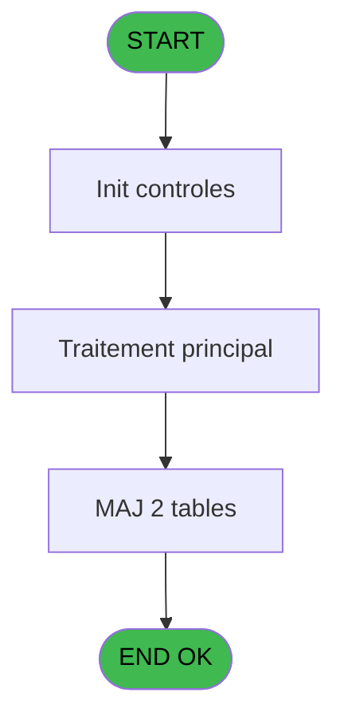
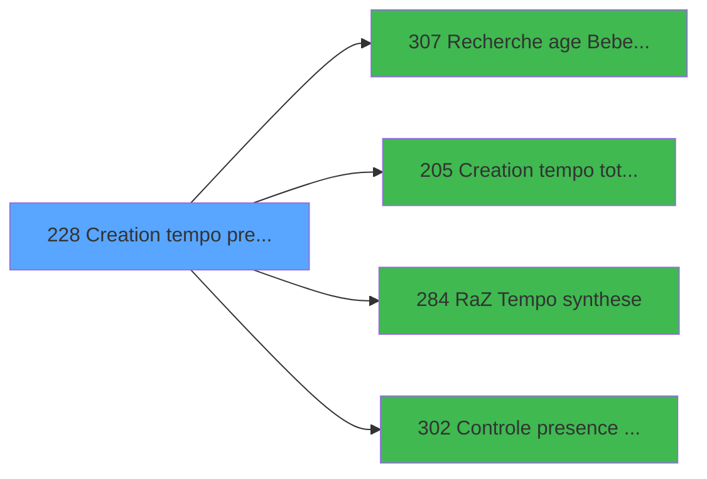

# PBP IDE 228 - Creation tempo pres plan GO

> **Analyse**: Phases 1-4 2026-02-03 15:55 -> 15:55 (12s) | Assemblage 15:55
> **Pipeline**: V7.2 Enrichi
> **Structure**: 4 onglets (Resume | Ecrans | Donnees | Connexions)

<!-- TAB:Resume -->

## 1. FICHE D'IDENTITE

| Attribut | Valeur |
|----------|--------|
| Projet | PBP |
| IDE Position | 228 |
| Nom Programme | Creation tempo pres plan GO |
| Fichier source | `Prg_228.xml` |
| Dossier IDE | Liste |
| Taches | 4 (1 ecrans visibles) |
| Tables modifiees | 2 |
| Programmes appeles | 4 |

## 2. DESCRIPTION FONCTIONNELLE

**Creation tempo pres plan GO** assure la gestion complete de ce processus, accessible depuis [  Liste present personnel plan (IDE 227)](PBP-IDE-227.md).

Le flux de traitement s'organise en **2 blocs fonctionnels** :

- **Creation** (2 taches) : insertion d'enregistrements en base (mouvements, prestations)
- **Traitement** (2 taches) : traitements metier divers

**Donnees modifiees** : 2 tables en ecriture (tempo_ecr_previsions, tempo_mecano_dossier_grou).

**Logique metier** : 8 regles identifiees couvrant conditions metier.

Detail : phases du traitement

#### Phase 1 : Traitement (2 taches)

- **228** - Veuillez patienter ... **[[ECRAN]](#ecran-t1)**
- **228.3** - Get Last Id

#### Phase 2 : Creation (2 taches)

- **228.1** - Creation Tempo gene
- **228.2** - Creation tempo bateaux police

Delegue a : [Creation tempo total qualite (IDE 205)](PBP-IDE-205.md)

#### Tables impactees

| Table | Operations | Role metier |
|-------|-----------|-------------|
| tempo_ecr_previsions | **W** (2 usages) | Table temporaire ecran |
| tempo_mecano_dossier_grou | **W**/L (2 usages) | Table temporaire ecran |

## 3. BLOCS FONCTIONNELS

### 3.1 Traitement (2 taches)

Traitements internes.

---

#### 228 - Veuillez patienter ... [[ECRAN]](#ecran-t1)

**Role** : Traitement : Veuillez patienter ....
**Ecran** : 426 x 57 DLU (MDI) | [Voir mockup](#ecran-t1)

---

#### 228.3 - Get Last Id

**Role** : Consultation/chargement : Get Last Id.

### 3.2 Creation (2 taches)

Insertion de nouveaux enregistrements en base.

---

#### 228.1 - Creation Tempo gene

**Role** : Creation d'enregistrement : Creation Tempo gene.
**Delegue a** : [Creation tempo total qualite (IDE 205)](PBP-IDE-205.md)

---

#### 228.2 - Creation tempo bateaux police

**Role** : Creation d'enregistrement : Creation tempo bateaux police.
**Delegue a** : [Creation tempo total qualite (IDE 205)](PBP-IDE-205.md)

## 5. REGLES METIER

8 regles identifiees:

### Autres (8 regles)

#### [RM-001] Si >CodeListe [J]='P' alors >DateCalcul [B] sinon P.I.Enlever absents [X])

| Element | Detail |
|---------|--------|
| **Condition** | `>CodeListe [J]='P'` |
| **Si vrai** | >DateCalcul [B] |
| **Si faux** | P.I.Enlever absents [X]) |
| **Variables** | X (P.I.Enlever absents), B (>DateCalcul), J (>CodeListe) |
| **Expression source** | Expression 19 : `IF (>CodeListe [J]='P',>DateCalcul [B],P.I.Enlever absents [` |
| **Exemple** | Si >CodeListe [J]='P' → >DateCalcul [B]. Sinon → P.I.Enlever absents [X]) |

#### [RM-002] Si >Index [A]=5 alors >DateMaxDebut [E]+14 sinon >DateMaxDebut [E])

| Element | Detail |
|---------|--------|
| **Condition** | `>Index [A]=5` |
| **Si vrai** | >DateMaxDebut [E]+14 |
| **Si faux** | >DateMaxDebut [E]) |
| **Variables** | A (>Index), E (>DateMaxDebut) |
| **Expression source** | Expression 31 : `IF (>Index [A]=5,>DateMaxDebut [E]+14,>DateMaxDebut [E])` |
| **Exemple** | Si >Index [A]=5 → >DateMaxDebut [E]+14. Sinon → >DateMaxDebut [E]) |

#### [RM-003] Si >Index [A]=6 alors >DateMaxFin [G]+14 sinon >DateMaxFin [G])

| Element | Detail |
|---------|--------|
| **Condition** | `>Index [A]=6` |
| **Si vrai** | >DateMaxFin [G]+14 |
| **Si faux** | >DateMaxFin [G]) |
| **Variables** | A (>Index), G (>DateMaxFin) |
| **Expression source** | Expression 32 : `IF (>Index [A]=6,>DateMaxFin [G]+14,>DateMaxFin [G])` |
| **Exemple** | Si >Index [A]=6 → >DateMaxFin [G]+14. Sinon → >DateMaxFin [G]) |

#### [RM-004] Si [PA]>0 alors [PA] sinon 0)

| Element | Detail |
|---------|--------|
| **Condition** | `[PA]>0` |
| **Si vrai** | [PA] |
| **Si faux** | 0) |
| **Expression source** | Expression 43 : `IF ([PA]>0,[PA],0)` |
| **Exemple** | Si [PA]>0 → [PA]. Sinon → 0) |

#### [RM-005] Si >CodeListe [J]<>'P' alors w0_TypeEcran [BY]=>TypeHebergement [L] AND Trim(MID (w0_FaxVille [BX] sinon 2,2))='1',[EJ]=>TypeHebergement [L] AND Trim(MID ([EO],2,2))='1')

| Element | Detail |
|---------|--------|
| **Condition** | `>CodeListe [J]<>'P'` |
| **Si vrai** | w0_TypeEcran [BY]=>TypeHebergement [L] AND Trim(MID (w0_FaxVille [BX] |
| **Si faux** | 2,2))='1',[EJ]=>TypeHebergement [L] AND Trim(MID ([EO],2,2))='1') |
| **Variables** | J (>CodeListe), L (>TypeHebergement), BN (w0_Type), BX (w0_FaxVille), BY (w0_TypeEcran) |
| **Expression source** | Expression 76 : `IF (>CodeListe [J]<>'P',w0_TypeEcran [BY]=>TypeHebergement [` |
| **Exemple** | Si >CodeListe [J]<>'P' → w0_TypeEcran [BY]=>TypeHebergement [L] AND Trim(MID (w0_FaxVille [BX] |

#### [RM-006] Si VG88 alors CodeVolAller(w0_Age----------------... [Z] sinon [AA]), [PK])

| Element | Detail |
|---------|--------|
| **Condition** | `VG88` |
| **Si vrai** | CodeVolAller(w0_Age----------------... [Z] |
| **Si faux** | [AA]), [PK]) |
| **Variables** | CA (w0_Age) |
| **Expression source** | Expression 126 : `IF(VG88, CodeVolAller(w0_Age----------------... [Z], [AA]), ` |
| **Exemple** | Si VG88 → CodeVolAller(w0_Age----------------... [Z]. Sinon → [AA]), [PK]) |

#### [RM-007] Traitement conditionnel si >DateMaxFin [G] est a zero

| Element | Detail |
|---------|--------|
| **Condition** | `>DateMaxFin [G]=0` |
| **Si vrai** | >DateMinFin [F] |
| **Si faux** | MAX(>DateMinFin [F],>DateMaxFin [G])) |
| **Variables** | F (>DateMinFin), G (>DateMaxFin) |
| **Expression source** | Expression 128 : `IF(>DateMaxFin [G]=0,>DateMinFin [F], MAX(>DateMinFin [F],>D` |
| **Exemple** | Si >DateMaxFin [G]=0 → >DateMinFin [F]. Sinon → MAX(>DateMinFin [F],>DateMaxFin [G])) |

#### [RM-008] Traitement conditionnel si >DateMinDebut [D] est a zero

| Element | Detail |
|---------|--------|
| **Condition** | `>DateMinDebut [D]=0` |
| **Si vrai** | >DateMaxDebut [E] |
| **Si faux** | MIN(>DateMinDebut [D],>DateMaxDebut [E])) |
| **Variables** | D (>DateMinDebut), E (>DateMaxDebut) |
| **Expression source** | Expression 129 : `IF(>DateMinDebut [D]=0,>DateMaxDebut [E], MIN(>DateMinDebut ` |
| **Exemple** | Si >DateMinDebut [D]=0 → >DateMaxDebut [E]. Sinon → MIN(>DateMinDebut [D],>DateMaxDebut [E])) |

## 6. CONTEXTE

- **Appele par**: [  Liste present personnel plan (IDE 227)](PBP-IDE-227.md)
- **Appelle**: 4 programmes | **Tables**: 12 (W:2 R:1 L:10) | **Taches**: 4 | **Expressions**: 136

<!-- TAB:Ecrans -->

## 8. ECRANS

### 8.1 Forms visibles (1 / 4)

| # | Position | Tache | Nom | Type | Largeur | Hauteur | Bloc |
|---|----------|-------|-----|------|---------|---------|------|
| 1 | 228 | 228 | Veuillez patienter ... | MDI | 426 | 57 | Traitement |

### 8.2 Mockups Ecrans

---

#### 228 - Veuillez patienter ...
**Tache** : [228](#t1) | **Type** : MDI | **Dimensions** : 426 x 57 DLU
**Bloc** : Traitement | **Titre IDE** : Veuillez patienter ...

<!-- FORM-DATA:
{
    "width":  426,
    "vFactor":  8,
    "type":  "MDI",
    "hFactor":  8,
    "controls":  [
                     {
                         "x":  0,
                         "type":  "label",
                         "var":  "",
                         "y":  0,
                         "w":  423,
                         "fmt":  "",
                         "name":  "",
                         "h":  29,
                         "color":  "",
                         "text":  "",
                         "parent":  null
                     },
                     {
                         "x":  120,
                         "type":  "label",
                         "var":  "",
                         "y":  10,
                         "w":  221,
                         "fmt":  "",
                         "name":  "",
                         "h":  8,
                         "color":  "7",
                         "text":  "Traitement en cours ...",
                         "parent":  null
                     },
                     {
                         "x":  0,
                         "type":  "label",
                         "var":  "",
                         "y":  29,
                         "w":  423,
                         "fmt":  "",
                         "name":  "",
                         "h":  27,
                         "color":  "",
                         "text":  "",
                         "parent":  null
                     },
                     {
                         "x":  103,
                         "type":  "label",
                         "var":  "",
                         "y":  33,
                         "w":  114,
                         "fmt":  "",
                         "name":  "",
                         "h":  8,
                         "color":  "",
                         "text":  "Analyses :",
                         "parent":  4
                     },
                     {
                         "x":  103,
                         "type":  "label",
                         "var":  "",
                         "y":  44,
                         "w":  150,
                         "fmt":  "",
                         "name":  "",
                         "h":  8,
                         "color":  "",
                         "text":  "Selectionnes :",
                         "parent":  4
                     },
                     {
                         "x":  4,
                         "type":  "image",
                         "var":  "",
                         "y":  2,
                         "w":  72,
                         "fmt":  "",
                         "name":  "",
                         "h":  25,
                         "color":  "",
                         "text":  "",
                         "parent":  null
                     },
                     {
                         "x":  265,
                         "type":  "edit",
                         "var":  "",
                         "y":  31,
                         "w":  56,
                         "fmt":  "",
                         "name":  "",
                         "h":  9,
                         "color":  "",
                         "text":  "",
                         "parent":  4
                     },
                     {
                         "x":  265,
                         "type":  "edit",
                         "var":  "",
                         "y":  43,
                         "w":  53,
                         "fmt":  "",
                         "name":  "",
                         "h":  8,
                         "color":  "",
                         "text":  "",
                         "parent":  4
                     }
                 ],
    "taskId":  "228",
    "height":  57
}
-->

<strong>Champs : 2 champs</strong>

| Pos (x,y) | Nom | Variable | Type |
|-----------|-----|----------|------|
| 265,31 | (sans nom) | - | edit |
| 265,43 | (sans nom) | - | edit |

## 9. NAVIGATION

Ecran unique: **Veuillez patienter ...**

### 9.3 Structure hierarchique (4 taches)

| Position | Tache | Type | Dimensions | Bloc |
|----------|-------|------|------------|------|
| **228.1** | [**Veuillez patienter ...** (228)](#t1) [mockup](#ecran-t1) | MDI | 426x57 | Traitement |
| 228.1.1 | [Get Last Id (228.3)](#t4) | MDI | - | |
| **228.2** | [**Creation Tempo gene** (228.1)](#t2) | MDI | - | Creation |
| 228.2.1 | [Creation tempo bateaux police (228.2)](#t3) | MDI | - | |

### 9.4 Algorigramme

> **Legende**: Vert = START/END OK | Rouge = END KO | Bleu = Decisions
> *Algorigramme auto-genere. Utiliser `/algorigramme` pour une synthese metier detaillee.*

<!-- TAB:Donnees -->

## 10. TABLES

### Tables utilisees (12)

| ID | Nom | Description | Type | R | W | L | Usages |
|----|-----|-------------|------|---|---|---|--------|
| 31 | gm-complet_______gmc |  | DB | R |   |   | 1 |
| 34 | hebergement______heb | Hebergement (chambres) | DB |   |   | L | 1 |
| 35 | personnel_go______go |  | DB |   |   | L | 1 |
| 47 | compte_gm________cgm | Comptes GM (generaux) | DB |   |   | L | 1 |
| 104 | fichier_menage |  | DB |   |   | L | 1 |
| 119 | tables_pays_tel_ |  | DB |   |   | L | 1 |
| 171 | commentaire______com |  | DB |   |   | L | 1 |
| 366 | pms_print_param |  | DB |   |   | L | 1 |
| 598 | tempo_ecr_previsions | Table temporaire ecran | TMP |   | **W** |   | 2 |
| 609 | tempo_mecano_dossier_grou | Table temporaire ecran | TMP |   | **W** | L | 2 |
| 619 | tempo_userlist | Table temporaire ecran | TMP |   |   | L | 2 |
| 637 | tempo_zone_secteur | Table temporaire ecran | DB |   |   | L | 1 |

### Colonnes par table (3 / 3 tables avec colonnes identifiees)

Table 31 - gm-complet_______gmc (R) - 1 usages

| Lettre | Variable | Acces | Type |
|--------|----------|-------|------|
| A | >Index | R | Numeric |
| B | >DateCalcul | R | Date |
| C | >HeureCalcul | R | Alpha |
| D | >DateMinDebut | R | Date |
| E | >DateMaxDebut | R | Date |
| F | >DateMinFin | R | Date |
| G | >DateMaxFin | R | Date |
| H | >w0_HeureMin | R | Alpha |
| I | >w0_HeureMax | R | Alpha |
| J | >CodeListe | R | Alpha |
| K | >Logement | R | Alpha |
| L | >TypeHebergement | R | Alpha |
| M | >TopListe | R | Alpha |
| N | >CodeVol | R | Alpha |
| O | >DateVillage | R | Date |
| P | >HeureVillage | R | Alpha |
| Q | >AgeMini | R | Numeric |
| R | >AgeMaxi | R | Numeric |
| S | <Total | R | Numeric |
| T | <NbSelect | R | Numeric |
| U | >TULCategorie | R | Alpha |
| V | >TULNomTable | R | Alpha |
| W | >Lieu de sejour | R | Alpha |
| X | P.I.Enlever absents | R | Logical |
| Y | w0_RetCommentaire | R | Logical |
| Z | w0_Age------------------------- | R | Alpha |
| BA | w0_Arrivee--------------------- | R | Alpha |
| BB | v.Code vole aller A | R | Unicode |
| BC | w0_Depart---------------------- | R | Alpha |
| BD | v.Code vol retour Z | R | Unicode |
| BE | w0_RetSelect | R | Logical |
| BF | w0_Circuit--------------------- | R | Logical |
| BG | W0_PresenceAv------------------ | R | Logical |
| BH | w0_NationSelect | R | Alpha |
| BI | w0_RetHebPreced---------------- | R | Logical |
| BJ | w0_RetHebSuiv------------------ | R | Logical |
| BK | w0_RetAbs---------------------- | R | Logical |
| BL | v.Date début | R | Date |
| BM | v.Date fin | R | Date |
| BN | w0_Type | R | Alpha |
| BO | w0_DateMaxDebut | R | Date |
| BP | w0_DateMaxFin | R | Date |
| BQ | w0_Total | R | Numeric |
| BR | w0_NbSelect | R | Numeric |
| BS | w0_AgeBebe | R | Numeric |
| BT | w0_AgeEnfant | R | Numeric |
| BU | w0_RetCtlHeb | R | Logical |
| BV | w0_TelInt | R | Numeric |
| BW | w0_TelExt_Commune | R | Alpha |
| BX | w0_FaxVille | R | Alpha |
| BY | w0_TypeEcran | R | Alpha |
| BZ | w0_NumAdherent | R | Alpha |
| CA | w0_Age | R | Numeric |
| CB | w0_Cabine | R | Alpha |
| CC | w0_CondArrivant | R | Logical |
| CD | w0_CondArrive | R | Logical |
| CE | W0_CondPresent | R | Logical |
| CF | w0_CondDepart | R | Logical |
| CG | w0_CondAbsent | R | Logical |
| CH | w0_CondPartant | R | Logical |
| CI | w0_Id Abs | R | Alpha |
| CJ | v.Heure abs départ | R | Numeric |
| CK | v.Heure abs retour | R | Numeric |
| CL | v.Date/heure min | R | Numeric |
| CM | v.Date heure max | R | Numeric |
| CN | v.Date/heure abs départ | R | Numeric |
| CO | v.Date/heure abs retour | R | Numeric |

Table 598 - tempo_ecr_previsions (**W**) - 2 usages

*Table utilisee uniquement en Link ou aucune colonne Real identifiee dans le DataView.*

Table 609 - tempo_mecano_dossier_grou (**W**/L) - 2 usages

*Table utilisee uniquement en Link ou aucune colonne Real identifiee dans le DataView.*

## 11. VARIABLES

### 11.1 Parametres entrants (1)

Variables recues du programme appelant ([  Liste present personnel plan (IDE 227)](PBP-IDE-227.md)).

| Lettre | Nom | Type | Usage dans |
|--------|-----|------|-----------|
| X | P.I.Enlever absents | Logical | 5x parametre entrant |

### 11.2 Variables de session (10)

Variables persistantes pendant toute la session.

| Lettre | Nom | Type | Usage dans |
|--------|-----|------|-----------|
| BB | v.Code vole aller A | Unicode | - |
| BD | v.Code vol retour Z | Unicode | - |
| BL | v.Date début | Date | - |
| BM | v.Date fin | Date | - |
| CJ | v.Heure abs départ | Numeric | - |
| CK | v.Heure abs retour | Numeric | - |
| CL | v.Date/heure min | Numeric | - |
| CM | v.Date heure max | Numeric | - |
| CN | v.Date/heure abs départ | Numeric | - |
| CO | v.Date/heure abs retour | Numeric | - |

### 11.3 Autres (56)

Variables diverses.

| Lettre | Nom | Type | Usage dans |
|--------|-----|------|-----------|
| A | >Index | Numeric | 3x refs |
| B | >DateCalcul | Date | 3x refs |
| C | >HeureCalcul | Alpha | - |
| D | >DateMinDebut | Date | 2x refs |
| E | >DateMaxDebut | Date | 3x refs |
| F | >DateMinFin | Date | 2x refs |
| G | >DateMaxFin | Date | 3x refs |
| H | >w0_HeureMin | Alpha | 9x refs |
| I | >w0_HeureMax | Alpha | 9x refs |
| J | >CodeListe | Alpha | 31x refs |
| K | >Logement | Alpha | 1x refs |
| L | >TypeHebergement | Alpha | 17x refs |
| M | >TopListe | Alpha | 21x refs |
| N | >CodeVol | Alpha | 14x refs |
| O | >DateVillage | Date | 1x refs |
| P | >HeureVillage | Alpha | 1x refs |
| Q | >AgeMini | Numeric | 1x refs |
| R | >AgeMaxi | Numeric | 1x refs |
| S | <Total | Numeric | 1x refs |
| T | <NbSelect | Numeric | - |
| U | >TULCategorie | Alpha | 1x refs |
| V | >TULNomTable | Alpha | 1x refs |
| W | >Lieu de sejour | Alpha | 1x refs |
| Y | w0_RetCommentaire | Logical | - |
| Z | w0_Age------------------------- | Alpha | - |
| BA | w0_Arrivee--------------------- | Alpha | - |
| BC | w0_Depart---------------------- | Alpha | - |
| BE | w0_RetSelect | Logical | - |
| BF | w0_Circuit--------------------- | Logical | - |
| BG | W0_PresenceAv------------------ | Logical | - |
| BH | w0_NationSelect | Alpha | - |
| BI | w0_RetHebPreced---------------- | Logical | - |
| BJ | w0_RetHebSuiv------------------ | Logical | - |
| BK | w0_RetAbs---------------------- | Logical | - |
| BN | w0_Type | Alpha | 22x refs |
| BO | w0_DateMaxDebut | Date | - |
| BP | w0_DateMaxFin | Date | - |
| BQ | w0_Total | Numeric | - |
| BR | w0_NbSelect | Numeric | 6x refs |
| BS | w0_AgeBebe | Numeric | - |
| BT | w0_AgeEnfant | Numeric | 5x refs |
| BU | w0_RetCtlHeb | Logical | 5x refs |
| BV | w0_TelInt | Numeric | 4x refs |
| BW | w0_TelExt_Commune | Alpha | 4x refs |
| BX | w0_FaxVille | Alpha | 2x refs |
| BY | w0_TypeEcran | Alpha | 22x refs |
| BZ | w0_NumAdherent | Alpha | 5x refs |
| CA | w0_Age | Numeric | 8x refs |
| CB | w0_Cabine | Alpha | 1x refs |
| CC | w0_CondArrivant | Logical | 1x refs |
| CD | w0_CondArrive | Logical | 2x refs |
| CE | W0_CondPresent | Logical | - |
| CF | w0_CondDepart | Logical | - |
| CG | w0_CondAbsent | Logical | - |
| CH | w0_CondPartant | Logical | - |
| CI | w0_Id Abs | Alpha | - |

Toutes les 67 variables (liste complete)

| Cat | Lettre | Nom Variable | Type |
|-----|--------|--------------|------|
| P0 | **X** | P.I.Enlever absents | Logical |
| V. | **BB** | v.Code vole aller A | Unicode |
| V. | **BD** | v.Code vol retour Z | Unicode |
| V. | **BL** | v.Date début | Date |
| V. | **BM** | v.Date fin | Date |
| V. | **CJ** | v.Heure abs départ | Numeric |
| V. | **CK** | v.Heure abs retour | Numeric |
| V. | **CL** | v.Date/heure min | Numeric |
| V. | **CM** | v.Date heure max | Numeric |
| V. | **CN** | v.Date/heure abs départ | Numeric |
| V. | **CO** | v.Date/heure abs retour | Numeric |
| Autre | **A** | >Index | Numeric |
| Autre | **B** | >DateCalcul | Date |
| Autre | **C** | >HeureCalcul | Alpha |
| Autre | **D** | >DateMinDebut | Date |
| Autre | **E** | >DateMaxDebut | Date |
| Autre | **F** | >DateMinFin | Date |
| Autre | **G** | >DateMaxFin | Date |
| Autre | **H** | >w0_HeureMin | Alpha |
| Autre | **I** | >w0_HeureMax | Alpha |
| Autre | **J** | >CodeListe | Alpha |
| Autre | **K** | >Logement | Alpha |
| Autre | **L** | >TypeHebergement | Alpha |
| Autre | **M** | >TopListe | Alpha |
| Autre | **N** | >CodeVol | Alpha |
| Autre | **O** | >DateVillage | Date |
| Autre | **P** | >HeureVillage | Alpha |
| Autre | **Q** | >AgeMini | Numeric |
| Autre | **R** | >AgeMaxi | Numeric |
| Autre | **S** | <Total | Numeric |
| Autre | **T** | <NbSelect | Numeric |
| Autre | **U** | >TULCategorie | Alpha |
| Autre | **V** | >TULNomTable | Alpha |
| Autre | **W** | >Lieu de sejour | Alpha |
| Autre | **Y** | w0_RetCommentaire | Logical |
| Autre | **Z** | w0_Age------------------------- | Alpha |
| Autre | **BA** | w0_Arrivee--------------------- | Alpha |
| Autre | **BC** | w0_Depart---------------------- | Alpha |
| Autre | **BE** | w0_RetSelect | Logical |
| Autre | **BF** | w0_Circuit--------------------- | Logical |
| Autre | **BG** | W0_PresenceAv------------------ | Logical |
| Autre | **BH** | w0_NationSelect | Alpha |
| Autre | **BI** | w0_RetHebPreced---------------- | Logical |
| Autre | **BJ** | w0_RetHebSuiv------------------ | Logical |
| Autre | **BK** | w0_RetAbs---------------------- | Logical |
| Autre | **BN** | w0_Type | Alpha |
| Autre | **BO** | w0_DateMaxDebut | Date |
| Autre | **BP** | w0_DateMaxFin | Date |
| Autre | **BQ** | w0_Total | Numeric |
| Autre | **BR** | w0_NbSelect | Numeric |
| Autre | **BS** | w0_AgeBebe | Numeric |
| Autre | **BT** | w0_AgeEnfant | Numeric |
| Autre | **BU** | w0_RetCtlHeb | Logical |
| Autre | **BV** | w0_TelInt | Numeric |
| Autre | **BW** | w0_TelExt_Commune | Alpha |
| Autre | **BX** | w0_FaxVille | Alpha |
| Autre | **BY** | w0_TypeEcran | Alpha |
| Autre | **BZ** | w0_NumAdherent | Alpha |
| Autre | **CA** | w0_Age | Numeric |
| Autre | **CB** | w0_Cabine | Alpha |
| Autre | **CC** | w0_CondArrivant | Logical |
| Autre | **CD** | w0_CondArrive | Logical |
| Autre | **CE** | W0_CondPresent | Logical |
| Autre | **CF** | w0_CondDepart | Logical |
| Autre | **CG** | w0_CondAbsent | Logical |
| Autre | **CH** | w0_CondPartant | Logical |
| Autre | **CI** | w0_Id Abs | Alpha |

## 12. EXPRESSIONS

**136 / 136 expressions decodees (100%)**

### 12.1 Repartition par type

| Type | Expressions | Regles |
|------|-------------|--------|
| CONDITION | 87 | 8 |
| CALCULATION | 2 | 0 |
| CONSTANTE | 13 | 0 |
| OTHER | 25 | 0 |
| REFERENCE_VG | 1 | 0 |
| CAST_LOGIQUE | 1 | 0 |
| NEGATION | 1 | 0 |
| CONCATENATION | 6 | 0 |

### 12.2 Expressions cles par type

#### CONDITION (87 expressions)

| Type | IDE | Expression | Regle |
|------|-----|------------|-------|
| CONDITION | 43 | `IF ([PA]>0,[PA],0)` | [RM-004](#rm-RM-004) |
| CONDITION | 128 | `IF(>DateMaxFin [G]=0,>DateMinFin [F], MAX(>DateMinFin [F],>DateMaxFin [G]))` | [RM-007](#rm-RM-007) |
| CONDITION | 76 | `IF (>CodeListe [J]<>'P',w0_TypeEcran [BY]=>TypeHebergement [L] AND Trim(MID (w0_FaxVille [BX],2,2))='1',[EJ]=>TypeHebergement [L] AND Trim(MID ([EO],2,2))='1')` | [RM-005](#rm-RM-005) |
| CONDITION | 129 | `IF(>DateMinDebut [D]=0,>DateMaxDebut [E], MIN(>DateMinDebut [D],>DateMaxDebut [E]))` | [RM-008](#rm-RM-008) |
| CONDITION | 126 | `IF(VG88, CodeVolAller(w0_Age----------------... [Z], [AA]), [PK])` | [RM-006](#rm-RM-006) |
| ... | | *+82 autres* | |

#### CALCULATION (2 expressions)

| Type | IDE | Expression | Regle |
|------|-----|------------|-------|
| CALCULATION | 135 | `([GC]*86400)+([PX]*3600)` | - |
| CALCULATION | 134 | `([GB]*86400)+([PW]*3600)` | - |

#### CONSTANTE (13 expressions)

| Type | IDE | Expression | Regle |
|------|-----|------------|-------|
| CONSTANTE | 88 | `0` | - |
| CONSTANTE | 37 | `'P'` | - |
| CONSTANTE | 36 | `'C'` | - |
| CONSTANTE | 123 | `'TCLME'` | - |
| CONSTANTE | 122 | `'D'` | - |
| ... | | *+8 autres* | |

#### OTHER (25 expressions)

| Type | IDE | Expression | Regle |
|------|-----|------------|-------|
| OTHER | 86 | `[FV]` | - |
| OTHER | 87 | `[FW]` | - |
| OTHER | 89 | `[AX]` | - |
| OTHER | 42 | `[AN]` | - |
| OTHER | 67 | `[GS] OR [GT] OR [GU] OR [GV] OR [GW] OR [GX]` | - |
| ... | | *+20 autres* | |

#### REFERENCE_VG (1 expressions)

| Type | IDE | Expression | Regle |
|------|-----|------------|-------|
| REFERENCE_VG | 23 | `VG1` | - |

#### CAST_LOGIQUE (1 expressions)

| Type | IDE | Expression | Regle |
|------|-----|------------|-------|
| CAST_LOGIQUE | 30 | `'TRUE'LOG` | - |

#### NEGATION (1 expressions)

| Type | IDE | Expression | Regle |
|------|-----|------------|-------|
| NEGATION | 136 | `NOT [PT] OR NOT [FX] OR 
([PY]<[QA] AND [PZ]<[QA]) OR 
([PY]>[QB] AND [PZ]>[QB])` | - |

#### CONCATENATION (6 expressions)

| Type | IDE | Expression | Regle |
|------|-----|------------|-------|
| CONCATENATION | 105 | `[GT] OR >CodeListe [J]='A' AND Trim (w0_TypeEcran [BY])&w0_NumAdherent [BZ]<>Trim ([FF])&[FG] AND [EW] OR >CodeListe [J]='A' AND NOT ([EW]) AND w0_TelExt_Commune [BW]='P'` | - |
| CONCATENATION | 106 | `[GV] OR >CodeListe [J]='D' AND Trim (w0_TypeEcran [BY])&w0_NumAdherent [BZ]<>Trim ([FQ])&[FR] AND [FH] OR >CodeListe [J]='D' AND NOT ([FH]) AND w0_TelExt_Commune [BW]='P'` | - |
| CONCATENATION | 107 | `[GX] OR >CodeListe [J]='R' AND Trim (w0_TypeEcran [BY])&w0_NumAdherent [BZ]<>Trim ([FQ])&[FR] AND [FH] OR >CodeListe [J]='R' AND NOT ([FH])` | - |
| CONCATENATION | 39 | `[AJ]&Str ([AK],'10P0Z0')&[AL]&Str ([AM],'3L')` | - |
| CONCATENATION | 40 | `[AJ]&Str ([AK],'10P0Z0')&' '&Str ([AM],'3L')` | - |
| ... | | *+1 autres* | |

### 12.3 Toutes les expressions (136)

Voir les 136 expressions

#### CONDITION (87)

| IDE | Expression Decodee |
|-----|-------------------|
| 38 | `<Total [S]+1` |
| 132 | `[PU]*86400+(Val(>w0_HeureMin [H],'2')*3600)` |
| 133 | `[PV]*86400+(Val( IF( Val(>w0_HeureMax [I],'2')=0,'24',>w0_HeureMax [I]) ,'2')*3600)` |
| 19 | `IF (>CodeListe [J]='P',>DateCalcul [B],P.I.Enlever absents [X])` |
| 31 | `IF (>Index [A]=5,>DateMaxDebut [E]+14,>DateMaxDebut [E])` |
| 32 | `IF (>Index [A]=6,>DateMaxFin [G]+14,>DateMaxFin [G])` |
| 43 | `IF ([PA]>0,[PA],0)` |
| 76 | `IF (>CodeListe [J]<>'P',w0_TypeEcran [BY]=>TypeHebergement [L] AND Trim(MID (w0_FaxVille [BX],2,2))='1',[EJ]=>TypeHebergement [L] AND Trim(MID ([EO],2,2))='1')` |
| 77 | `IF (>CodeListe [J]<>'P',w0_TypeEcran [BY]=>TypeHebergement [L] AND Trim(MID (w0_FaxVille [BX],2,2))<>'1',[EJ]=>TypeHebergement [L] AND Trim(MID ([EO],2,2))<>'1')` |
| 126 | `IF(VG88, CodeVolAller(w0_Age----------------... [Z], [AA]), [PK])` |
| 127 | `IF(VG88, CodeVolRetour(w0_Age----------------... [Z], [AA]), [PJ])` |
| 128 | `IF(>DateMaxFin [G]=0,>DateMinFin [F], MAX(>DateMinFin [F],>DateMaxFin [G]))` |
| 129 | `IF(>DateMinDebut [D]=0,>DateMaxDebut [E], MIN(>DateMinDebut [D],>DateMaxDebut [E]))` |
| 130 | `CASE([PQ],1,12,3,18,0)` |
| 131 | `CASE([PR],1,14,3,23,6)` |
| 1 | `>Index [A]` |
| 6 | `>Lieu de sejour [W]` |
| 7 | `CndRange (>DateMinDebut [D]>0,>DateMinDebut [D])` |
| 8 | `CndRange (>DateMaxDebut [E]>0,>DateMaxDebut [E])` |
| 9 | `CndRange (>DateMinFin [F]>0,>DateMinFin [F])` |
| 10 | `CndRange (>DateMaxFin [G]>0,>DateMaxFin [G])` |
| 18 | `CndRange (>CodeListe [J]='P',P.I.Enlever absents [X])` |
| 24 | `>TULCategorie [U]` |
| 25 | `>TULNomTable [V]` |
| 44 | `[DK] AND ([PI] OR w0_CondArrive [CD]='')` |
| 45 | `>CodeListe [J]='P'` |
| 46 | `>Logement [K]=w0_CondArrivant [CC] OR >Logement [K]=''` |
| 47 | `>TopListe [M]='PL'` |
| 48 | `>TopListe [M]='GR'` |
| 49 | `>TopListe [M]='RE'` |
| 50 | `>TopListe [M]='CA'` |
| 51 | `>TopListe [M]='MI'` |
| 52 | `>TopListe [M]='BB'` |
| 53 | `>TopListe [M]='EN'` |
| 54 | `>TopListe [M]='SI'` |
| 55 | `>TopListe [M]='NS'` |
| 56 | `>TopListe [M]='PY'` |
| 57 | `>TopListe [M]='HM'` |
| 58 | `>TopListe [M]='VV'` |
| 59 | `>TopListe [M]='NV'` |
| 60 | `>TopListe [M]='ST'` |
| 61 | `>TopListe [M]='SE'` |
| 62 | `>TopListe [M]='AG'` |
| 63 | `>TopListe [M]='CO'` |
| 64 | `>TopListe [M]='PO'` |
| 65 | `>TopListe [M]='BA'` |
| 66 | `>TopListe [M]='CP'` |
| 68 | `>TypeHebergement [L]=IF (>CodeListe [J]='P',[EJ],w0_TypeEcran [BY])` |
| 69 | `>TypeHebergement [L]=IF (>CodeListe [J]='P',[EJ],w0_TypeEcran [BY]) AND [AA]=0` |
| 70 | `>TypeHebergement [L]=IF (>CodeListe [J]='P',[EJ],w0_TypeEcran [BY]) AND [AM]=0 AND [AW]='O'` |
| 72 | `(w0_NbSelect [BR]=>DateCalcul [B] AND w0_NbSelect [BR]=>DateVillage [O] AND w0_AgeEnfant [BT]=>HeureVillage [P] OR w0_NbSelect [BR]=0 AND w0_AgeEnfant [BT]='') AND >TypeHebergement [L]=IF (>CodeListe [J]<>'P',[EJ],w0_TypeEcran [BY])` |
| 73 | `>TypeHebergement [L]=IF (>CodeListe [J]='P',[EJ],w0_TypeEcran [BY]) AND [AG]='M'` |
| 74 | `>TypeHebergement [L]=IF (>CodeListe [J]='P',[EJ],w0_TypeEcran [BY]) AND [AF]<=[GI] AND ([OY]>0 OR [OZ]>0)` |
| 75 | `>TypeHebergement [L]=IF (>CodeListe [J]='P',[EJ],w0_TypeEcran [BY]) AND ([AF]<=[GJ] AND [AF]>[GI])` |
| 78 | `>TypeHebergement [L]=IF (>CodeListe [J]='P',[EJ],w0_TypeEcran [BY]) AND [EV]` |
| 81 | `w0_TypeEcran [BY]=>TypeHebergement [L] AND [DZ] AND [GK] AND >CodeListe [J]='P' AND [EF]='P'` |
| 82 | `w0_TypeEcran [BY]=>TypeHebergement [L] AND [DZ] AND [GK]` |
| 83 | `>AgeMini [Q]>0 AND [PA]<=>AgeMaxi [R] AND [PA]>=>AgeMini [Q] OR >AgeMini [Q]=0 AND [PA]<=>AgeMaxi [R] AND ([PA]>0 OR [PB]>0) AND >TypeHebergement [L]=IF (>CodeListe [J]='P',[EJ],w0_TypeEcran [BY])` |
| 84 | `w0_TypeEcran [BY]=>TypeHebergement [L]` |
| 94 | `>CodeListe [J]='A'` |
| 95 | `>CodeListe [J]='V' AND w0_TelExt_Commune [BW]='P'` |
| 96 | `>CodeListe [J]='P' AND [EF]='P' AND [DZ]` |
| 97 | `>CodeListe [J]='D' AND w0_TelExt_Commune [BW]='P'` |
| 98 | `>CodeListe [J]='B' AND [EF]<>'P'` |
| 99 | `>CodeListe [J]='R'` |
| 101 | `>CodeListe [J]='P' AND [EF]='P'` |
| 120 | `CndRange([PC]<>'',[PC])` |
| 121 | `>TopListe [M]='CO'` |
| 124 | `CndRange([PC]<>'',[PC])` |
| 16 | `CndRange (InStr ('PDR',>CodeListe [J])=0,P.I.Enlever absents [X])` |
| 17 | `CndRange (InStr ('PAVB',>CodeListe [J])>0,IF (>CodeListe [J]='P',>DateCalcul [B],P.I.Enlever absents [X]))` |
| 71 | `Trim(>CodeVol [N])='' OR Trim(>CodeVol [N])=IF (>CodeListe [J]='D' OR >CodeListe [J]='R',Trim([DJ]),Trim([DB])) AND >TypeHebergement [L]=IF (>CodeListe [J]='P',[EJ],w0_TypeEcran [BY])` |
| 79 | `>TypeHebergement [L]=IF (>CodeListe [J]='P',[EJ],w0_TypeEcran [BY]) AND InStr ('VV',IF (>CodeListe [J]='D' OR >CodeListe [J]='R',Left ([DJ],2),Left ([DB],2)))>0` |
| 80 | `>TypeHebergement [L]=IF (>CodeListe [J]='P',[EJ],w0_TypeEcran [BY]) AND InStr ('VV',IF (>CodeListe [J]='D' OR >CodeListe [J]='R',Left ([DJ],2),Left ([DB],2)))=0` |
| 103 | `Trim(>CodeVol [N])=''` |
| 108 | `[GS] OR Trim(>CodeVol [N])<>'' AND [EW] AND >w0_HeureMin [H]<w0_AgeEnfant [BT] AND >w0_HeureMax [I]>=w0_AgeEnfant [BT]` |
| 109 | `[GS] OR Trim(>CodeVol [N])<>'' AND NOT ([EW]) AND w0_NbSelect [BR]<>[CY] AND Trim([DB])=Trim(>CodeVol [N])` |
| 110 | `[GS] OR Trim(>CodeVol [N])<>'' AND NOT ([EW]) AND w0_NbSelect [BR]<>[CY] AND >w0_HeureMin [H]<w0_AgeEnfant [BT] AND >w0_HeureMax [I]>=w0_AgeEnfant [BT]` |
| 111 | `[GT] OR Trim(>CodeVol [N])<>'' AND [EW] AND >w0_HeureMin [H]<w0_AgeEnfant [BT] AND >w0_HeureMax [I]>=w0_AgeEnfant [BT]` |
| 112 | `[GT] OR Trim(>CodeVol [N])<>'' AND NOT ([EW]) AND w0_NbSelect [BR]<>[CY] AND Trim([DB])=Trim(>CodeVol [N])` |
| 113 | `[GT] OR Trim(>CodeVol [N])<>'' AND NOT ([EW]) AND w0_NbSelect [BR]<>[CY] AND >w0_HeureMin [H]<w0_AgeEnfant [BT] AND >w0_HeureMax [I]>=w0_AgeEnfant [BT]` |
| 114 | `[GV] OR Trim(>CodeVol [N])<>'' AND [FH] AND >w0_HeureMin [H]<w0_TelInt [BV] AND >w0_HeureMax [I]>=w0_TelInt [BV]` |
| 115 | `[GV] OR Trim(>CodeVol [N])<>'' AND NOT ([FH]) AND w0_RetCtlHeb [BU]<>[DG] AND Trim([DJ])=Trim(>CodeVol [N])` |
| 116 | `[GV] OR Trim(>CodeVol [N])<>'' AND NOT ([FH]) AND w0_RetCtlHeb [BU]<>[DG] AND >w0_HeureMin [H]<w0_TelInt [BV] AND >w0_HeureMax [I]>=w0_TelInt [BV]` |
| 117 | `[GX] OR Trim(>CodeVol [N])<>'' AND [FH] AND >w0_HeureMin [H]<w0_TelInt [BV] AND >w0_HeureMax [I]>=w0_TelInt [BV]` |
| 118 | `[GX] OR Trim(>CodeVol [N])<>'' AND NOT ([FH]) AND w0_RetCtlHeb [BU]<>[DG] AND Trim([DJ])=Trim(>CodeVol [N])` |
| 119 | `[GX] OR Trim(>CodeVol [N])<>'' AND NOT ([FH]) AND w0_RetCtlHeb [BU]<>[DG] AND >w0_HeureMin [H]<w0_TelInt [BV] AND >w0_HeureMax [I]>=w0_TelInt [BV]` |

#### CALCULATION (2)

| IDE | Expression Decodee |
|-----|-------------------|
| 134 | `([GB]*86400)+([PW]*3600)` |
| 135 | `([GC]*86400)+([PX]*3600)` |

#### CONSTANTE (13)

| IDE | Expression Decodee |
|-----|-------------------|
| 2 | `'VBEBE'` |
| 3 | `'VENFA'` |
| 22 | `'H'` |
| 26 | `'M'` |
| 27 | `'TNATI'` |
| 33 | `'A'` |
| 34 | `'Z'` |
| 36 | `'C'` |
| 37 | `'P'` |
| 88 | `0` |
| 92 | `''` |
| 122 | `'D'` |
| 123 | `'TCLME'` |

#### OTHER (25)

| IDE | Expression Decodee |
|-----|-------------------|
| 4 | `[AR]` |
| 5 | `GetParam('SOCIETE')` |
| 11 | `w0_Age----------------... [Z]` |
| 12 | `[AA]` |
| 13 | `GetParam ('LANGUE')` |
| 14 | `[AR]` |
| 15 | `[AK]` |
| 20 | `w0_NbSelect [BR]` |
| 21 | `w0_RetCtlHeb [BU]` |
| 28 | `Left (w0_TypeEcran [BY],3)` |
| 29 | `w0_NumAdherent [BZ]` |
| 35 | `P.I.Enlever absents [X]` |
| 41 | `[AF]` |
| 42 | `[AN]` |
| 67 | `[GS] OR [GT] OR [GU] OR [GV] OR [GW] OR [GX]` |
| 85 | `[FU]` |
| 86 | `[FV]` |
| 87 | `[FW]` |
| 89 | `[AX]` |
| 90 | `[AY]` |
| 91 | `[AZ]` |
| 93 | `w0_Cabine [CB]` |
| 100 | `[GU] AND [GK]` |
| 102 | `W0_PresenceAv---------... [BG]` |
| 125 | `w0_CondArrive [CD]` |

#### REFERENCE_VG (1)

| IDE | Expression Decodee |
|-----|-------------------|
| 23 | `VG1` |

#### CAST_LOGIQUE (1)

| IDE | Expression Decodee |
|-----|-------------------|
| 30 | `'TRUE'LOG` |

#### NEGATION (1)

| IDE | Expression Decodee |
|-----|-------------------|
| 136 | `NOT [PT] OR NOT [FX] OR 
([PY]<[QA] AND [PZ]<[QA]) OR 
([PY]>[QB] AND [PZ]>[QB])` |

#### CONCATENATION (6)

| IDE | Expression Decodee |
|-----|-------------------|
| 39 | `[AJ]&Str ([AK],'10P0Z0')&[AL]&Str ([AM],'3L')` |
| 40 | `[AJ]&Str ([AK],'10P0Z0')&' '&Str ([AM],'3L')` |
| 104 | `[GS] OR >CodeListe [J]='V' AND Trim (w0_TypeEcran [BY])&w0_NumAdherent [BZ]<>Trim ([FF])&[FG] AND [EW] OR >CodeListe [J]='V' AND NOT ([EW])` |
| 105 | `[GT] OR >CodeListe [J]='A' AND Trim (w0_TypeEcran [BY])&w0_NumAdherent [BZ]<>Trim ([FF])&[FG] AND [EW] OR >CodeListe [J]='A' AND NOT ([EW]) AND w0_TelExt_Commune [BW]='P'` |
| 106 | `[GV] OR >CodeListe [J]='D' AND Trim (w0_TypeEcran [BY])&w0_NumAdherent [BZ]<>Trim ([FQ])&[FR] AND [FH] OR >CodeListe [J]='D' AND NOT ([FH]) AND w0_TelExt_Commune [BW]='P'` |
| 107 | `[GX] OR >CodeListe [J]='R' AND Trim (w0_TypeEcran [BY])&w0_NumAdherent [BZ]<>Trim ([FQ])&[FR] AND [FH] OR >CodeListe [J]='R' AND NOT ([FH])` |

<!-- TAB:Connexions -->

## 13. GRAPHE D'APPELS

### 13.1 Chaine depuis Main (Callers)

Main -> ... -> [  Liste present personnel plan (IDE 227)](PBP-IDE-227.md) -> **Creation tempo pres plan GO (IDE 228)**

### 13.2 Callers

| IDE | Nom Programme | Nb Appels |
|-----|---------------|-----------|
| [227](PBP-IDE-227.md) |   Liste present personnel plan | 3 |

### 13.3 Callees (programmes appeles)

### 13.4 Detail Callees avec contexte

| IDE | Nom Programme | Appels | Contexte |
|-----|---------------|--------|----------|
| [307](PBP-IDE-307.md) | Recherche age Bebe_Enfant | 2 | Sous-programme |
| [205](PBP-IDE-205.md) | Creation tempo total qualite | 1 | Sous-programme |
| [284](PBP-IDE-284.md) | RaZ Tempo synthese | 1 | Reinitialisation |
| [302](PBP-IDE-302.md) | Controle presence heberg | 1 | Controle/validation |

## 14. RECOMMANDATIONS MIGRATION

### 14.1 Profil du programme

| Metrique | Valeur | Impact migration |
|----------|--------|-----------------|
| Lignes de logique | 587 | Programme volumineux |
| Expressions | 136 | Logique moderee |
| Tables WRITE | 2 | Impact faible |
| Sous-programmes | 4 | Peu de dependances |
| Ecrans visibles | 1 | Ecran unique ou traitement batch |
| Code desactive | 0% (0 / 587) | Code sain |
| Regles metier | 8 | Quelques regles a preserver |

### 14.2 Plan de migration par bloc

#### Traitement (2 taches: 1 ecran, 1 traitement)

- **Strategie** : Orchestrateur avec 1 ecrans (Razor/React) et 1 traitements backend (services).
- Les ecrans deviennent des composants UI, les traitements invisibles deviennent des services injectables.
- 4 sous-programme(s) a migrer ou a reutiliser depuis les services existants.
- Decomposer les taches en services unitaires testables.

#### Creation (2 taches: 0 ecran, 2 traitements)

- **Strategie** : Repository pattern avec Entity Framework Core.
- Insertion via `IRepository<T>.CreateAsync()`

### 14.3 Dependances critiques

| Dependance | Type | Appels | Impact |
|------------|------|--------|--------|
| tempo_ecr_previsions | Table WRITE (Temp) | 2x | Schema + repository |
| tempo_mecano_dossier_grou | Table WRITE (Temp) | 1x | Schema + repository |
| [Recherche age Bebe_Enfant (IDE 307)](PBP-IDE-307.md) | Sous-programme | 2x | Haute - Sous-programme |
| [Controle presence heberg (IDE 302)](PBP-IDE-302.md) | Sous-programme | 1x | Normale - Controle/validation |
| [RaZ Tempo synthese (IDE 284)](PBP-IDE-284.md) | Sous-programme | 1x | Normale - Reinitialisation |
| [Creation tempo total qualite (IDE 205)](PBP-IDE-205.md) | Sous-programme | 1x | Normale - Sous-programme |

---
*Spec DETAILED generee par Pipeline V7.2 - 2026-02-03 15:55*
