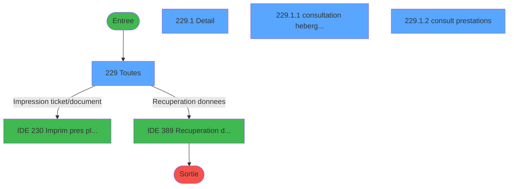
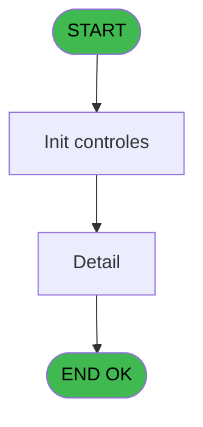
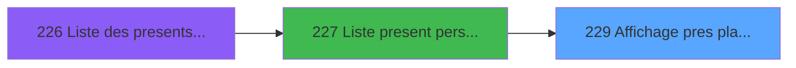
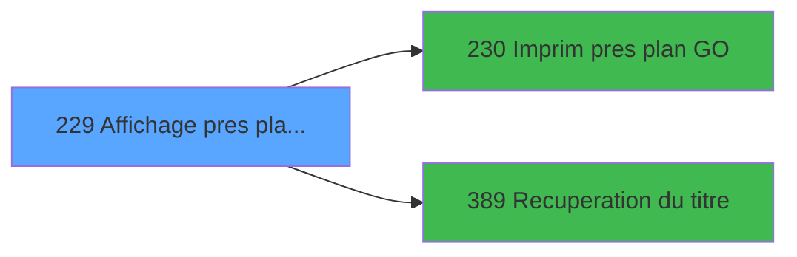

# PBP IDE 229 - Affichage pres plans GO

> **Analyse**: Phases 1-4 2026-02-03 15:56 -> 15:56 (13s) | Assemblage 15:56
> **Pipeline**: V7.2 Enrichi
> **Structure**: 4 onglets (Resume | Ecrans | Donnees | Connexions)

<!-- TAB:Resume -->

## 1. FICHE D'IDENTITE

| Attribut | Valeur |
|----------|--------|
| Projet | PBP |
| IDE Position | 229 |
| Nom Programme | Affichage pres plans GO |
| Fichier source | `Prg_229.xml` |
| Dossier IDE | Liste |
| Taches | 4 (4 ecrans visibles) |
| Tables modifiees | 0 |
| Programmes appeles | 2 |

## 2. DESCRIPTION FONCTIONNELLE

**Affichage pres plans GO** assure la gestion complete de ce processus, accessible depuis [  Liste present personnel plan (IDE 227)](PBP-IDE-227.md).

Le flux de traitement s'organise en **1 blocs fonctionnels** :

- **Traitement** (4 taches) : traitements metier divers

Detail : phases du traitement

#### Phase 1 : Traitement (4 taches)

- **229** - Toutes **[[ECRAN]](#ecran-t1)**
- **229.1** - Detail **[[ECRAN]](#ecran-t2)**
- **229.1.1** - consultation hebergement **[[ECRAN]](#ecran-t3)**
- **229.1.2** - consult prestations **[[ECRAN]](#ecran-t4)**

Delegue a : [Recuperation du titre (IDE 389)](PBP-IDE-389.md)

## 3. BLOCS FONCTIONNELS

### 3.1 Traitement (4 taches)

Traitements internes.

---

#### 229 - Toutes [[ECRAN]](#ecran-t1)

**Role** : Traitement : Toutes.
**Ecran** : 1083 x 238 DLU (MDI) | [Voir mockup](#ecran-t1)

3 sous-taches directes

| Tache | Nom | Bloc |
|-------|-----|------|
| [229.1](#t2) | Detail **[[ECRAN]](#ecran-t2)** | Traitement |
| [229.1.1](#t3) | consultation hebergement **[[ECRAN]](#ecran-t3)** | Traitement |
| [229.1.2](#t4) | consult prestations **[[ECRAN]](#ecran-t4)** | Traitement |

**Delegue a** : [Recuperation du titre (IDE 389)](PBP-IDE-389.md)

---

#### 229.1 - Detail [[ECRAN]](#ecran-t2)

**Role** : Traitement : Detail.
**Ecran** : 792 x 268 DLU (MDI) | [Voir mockup](#ecran-t2)
**Delegue a** : [Recuperation du titre (IDE 389)](PBP-IDE-389.md)

---

#### 229.1.1 - consultation hebergement [[ECRAN]](#ecran-t3)

**Role** : Consultation/chargement : consultation hebergement.
**Ecran** : 789 x 78 DLU (Modal) | [Voir mockup](#ecran-t3)
**Delegue a** : [Recuperation du titre (IDE 389)](PBP-IDE-389.md)

---

#### 229.1.2 - consult prestations [[ECRAN]](#ecran-t4)

**Role** : Traitement : consult prestations.
**Ecran** : 778 x 44 DLU (Modal) | [Voir mockup](#ecran-t4)
**Delegue a** : [Recuperation du titre (IDE 389)](PBP-IDE-389.md)

## 5. REGLES METIER

*(Aucune regle metier identifiee)*

## 6. CONTEXTE

- **Appele par**: [  Liste present personnel plan (IDE 227)](PBP-IDE-227.md)
- **Appelle**: 2 programmes | **Tables**: 7 (W:0 R:4 L:3) | **Taches**: 4 | **Expressions**: 22

<!-- TAB:Ecrans -->

## 8. ECRANS

### 8.1 Forms visibles (4 / 4)

| # | Position | Tache | Nom | Type | Largeur | Hauteur | Bloc |
|---|----------|-------|-----|------|---------|---------|------|
| 1 | 229 | 229 | Toutes | MDI | 1083 | 238 | Traitement |
| 2 | 229.1 | 229.1 | Detail | MDI | 792 | 268 | Traitement |
| 3 | 229.1.1 | 229.1.1 | consultation hebergement | Modal | 789 | 78 | Traitement |
| 4 | 229.1.2 | 229.1.2 | consult prestations | Modal | 778 | 44 | Traitement |

### 8.2 Mockups Ecrans

---

#### 229 - Toutes
**Tache** : [229](#t1) | **Type** : MDI | **Dimensions** : 1083 x 238 DLU
**Bloc** : Traitement | **Titre IDE** : Toutes

<!-- FORM-DATA:
{
    "width":  1083,
    "vFactor":  8,
    "type":  "MDI",
    "hFactor":  8,
    "controls":  [
                     {
                         "x":  0,
                         "type":  "label",
                         "var":  "",
                         "y":  0,
                         "w":  1079,
                         "fmt":  "",
                         "name":  "",
                         "h":  19,
                         "color":  "",
                         "text":  "",
                         "parent":  null
                     },
                     {
                         "x":  0,
                         "type":  "table",
                         "var":  "",
                         "name":  "",
                         "titleH":  12,
                         "color":  "110",
                         "w":  891,
                         "y":  44,
                         "fmt":  "",
                         "parent":  null,
                         "text":  "",
                         "rowH":  15,
                         "h":  115,
                         "cols":  [
                                      {
                                          "title":  "Nom",
                                          "layer":  1,
                                          "w":  188
                                      },
                                      {
                                          "title":  "Prénom",
                                          "layer":  2,
                                          "w":  130
                                      },
                                      {
                                          "title":  "Sexe",
                                          "layer":  3,
                                          "w":  47
                                      },
                                      {
                                          "title":  "Logement",
                                          "layer":  4,
                                          "w":  181
                                      },
                                      {
                                          "title":  "Pays",
                                          "layer":  5,
                                          "w":  72
                                      },
                                      {
                                          "title":  "Fonction",
                                          "layer":  6,
                                          "w":  240
                                      }
                                  ],
                         "rows":  6
                     },
                     {
                         "x":  895,
                         "type":  "label",
                         "var":  "",
                         "y":  43,
                         "w":  181,
                         "fmt":  "",
                         "name":  "",
                         "h":  167,
                         "color":  "",
                         "text":  "",
                         "parent":  null
                     },
                     {
                         "x":  13,
                         "type":  "label",
                         "var":  "",
                         "y":  157,
                         "w":  876,
                         "fmt":  "",
                         "name":  "",
                         "h":  53,
                         "color":  "",
                         "text":  "",
                         "parent":  null
                     },
                     {
                         "x":  26,
                         "type":  "label",
                         "var":  "",
                         "y":  163,
                         "w":  213,
                         "fmt":  "",
                         "name":  "",
                         "h":  42,
                         "color":  "195",
                         "text":  "Arrivée",
                         "parent":  null
                     },
                     {
                         "x":  249,
                         "type":  "label",
                         "var":  "",
                         "y":  163,
                         "w":  216,
                         "fmt":  "",
                         "name":  "",
                         "h":  42,
                         "color":  "195",
                         "text":  "Départ",
                         "parent":  null
                     },
                     {
                         "x":  477,
                         "type":  "label",
                         "var":  "",
                         "y":  163,
                         "w":  400,
                         "fmt":  "",
                         "name":  "",
                         "h":  42,
                         "color":  "",
                         "text":  "",
                         "parent":  21
                     },
                     {
                         "x":  34,
                         "type":  "label",
                         "var":  "",
                         "y":  173,
                         "w":  45,
                         "fmt":  "",
                         "name":  "",
                         "h":  8,
                         "color":  "",
                         "text":  "Date",
                         "parent":  22
                     },
                     {
                         "x":  158,
                         "type":  "label",
                         "var":  "",
                         "y":  173,
                         "w":  54,
                         "fmt":  "",
                         "name":  "",
                         "h":  8,
                         "color":  "",
                         "text":  "Heure",
                         "parent":  22
                     },
                     {
                         "x":  256,
                         "type":  "label",
                         "var":  "",
                         "y":  173,
                         "w":  45,
                         "fmt":  "",
                         "name":  "",
                         "h":  8,
                         "color":  "",
                         "text":  "Date",
                         "parent":  23
                     },
                     {
                         "x":  382,
                         "type":  "label",
                         "var":  "",
                         "y":  174,
                         "w":  54,
                         "fmt":  "",
                         "name":  "",
                         "h":  8,
                         "color":  "",
                         "text":  "Heure",
                         "parent":  23
                     },
                     {
                         "x":  0,
                         "type":  "label",
                         "var":  "",
                         "y":  212,
                         "w":  1079,
                         "fmt":  "",
                         "name":  "",
                         "h":  24,
                         "color":  "",
                         "text":  "",
                         "parent":  null
                     },
                     {
                         "x":  0,
                         "type":  "label",
                         "var":  "",
                         "y":  20,
                         "w":  1079,
                         "fmt":  "",
                         "name":  "",
                         "h":  19,
                         "color":  "",
                         "text":  "",
                         "parent":  null
                     },
                     {
                         "x":  3,
                         "type":  "label",
                         "var":  "",
                         "y":  25,
                         "w":  131,
                         "fmt":  "",
                         "name":  "",
                         "h":  9,
                         "color":  "",
                         "text":  "Lieu de séjour",
                         "parent":  null
                     },
                     {
                         "x":  10,
                         "type":  "edit",
                         "var":  "",
                         "y":  59,
                         "w":  176,
                         "fmt":  "",
                         "name":  "TLE Nom",
                         "h":  10,
                         "color":  "110",
                         "text":  "",
                         "parent":  6
                     },
                     {
                         "x":  194,
                         "type":  "edit",
                         "var":  "",
                         "y":  59,
                         "w":  120,
                         "fmt":  "",
                         "name":  "TLE Prenom",
                         "h":  10,
                         "color":  "110",
                         "text":  "",
                         "parent":  6
                     },
                     {
                         "x":  326,
                         "type":  "edit",
                         "var":  "",
                         "y":  59,
                         "w":  37,
                         "fmt":  "",
                         "name":  "TLE Sexe",
                         "h":  10,
                         "color":  "110",
                         "text":  "",
                         "parent":  6
                     },
                     {
                         "x":  370,
                         "type":  "edit",
                         "var":  "",
                         "y":  59,
                         "w":  171,
                         "fmt":  "",
                         "name":  "TLE Logement",
                         "h":  10,
                         "color":  "110",
                         "text":  "",
                         "parent":  6
                     },
                     {
                         "x":  560,
                         "type":  "edit",
                         "var":  "",
                         "y":  59,
                         "w":  37,
                         "fmt":  "",
                         "name":  "TLE Pays",
                         "h":  10,
                         "color":  "110",
                         "text":  "",
                         "parent":  6
                     },
                     {
                         "x":  30,
                         "type":  "edit",
                         "var":  "",
                         "y":  187,
                         "w":  123,
                         "fmt":  "",
                         "name":  "",
                         "h":  9,
                         "color":  "",
                         "text":  "",
                         "parent":  22
                     },
                     {
                         "x":  157,
                         "type":  "edit",
                         "var":  "",
                         "y":  187,
                         "w":  78,
                         "fmt":  "",
                         "name":  "",
                         "h":  9,
                         "color":  "",
                         "text":  "",
                         "parent":  22
                     },
                     {
                         "x":  254,
                         "type":  "edit",
                         "var":  "",
                         "y":  187,
                         "w":  123,
                         "fmt":  "",
                         "name":  "",
                         "h":  9,
                         "color":  "",
                         "text":  "",
                         "parent":  23
                     },
                     {
                         "x":  381,
                         "type":  "edit",
                         "var":  "",
                         "y":  187,
                         "w":  78,
                         "fmt":  "",
                         "name":  "",
                         "h":  9,
                         "color":  "",
                         "text":  "",
                         "parent":  23
                     },
                     {
                         "x":  816,
                         "type":  "edit",
                         "var":  "",
                         "y":  187,
                         "w":  53,
                         "fmt":  "",
                         "name":  "",
                         "h":  8,
                         "color":  "",
                         "text":  "",
                         "parent":  24
                     },
                     {
                         "x":  624,
                         "type":  "edit",
                         "var":  "",
                         "y":  59,
                         "w":  232,
                         "fmt":  "",
                         "name":  "",
                         "h":  10,
                         "color":  "110",
                         "text":  "",
                         "parent":  6
                     },
                     {
                         "x":  911,
                         "type":  "button",
                         "var":  "",
                         "y":  156,
                         "w":  154,
                         "fmt":  "\u0026Ecran",
                         "name":  "b_Ecran",
                         "h":  18,
                         "color":  "",
                         "text":  "",
                         "parent":  null
                     },
                     {
                         "x":  911,
                         "type":  "button",
                         "var":  "",
                         "y":  183,
                         "w":  154,
                         "fmt":  "\u0026Impression",
                         "name":  "b_Imprim",
                         "h":  18,
                         "color":  "",
                         "text":  "",
                         "parent":  null
                     },
                     {
                         "x":  3,
                         "type":  "edit",
                         "var":  "",
                         "y":  2,
                         "w":  331,
                         "fmt":  "25",
                         "name":  "",
                         "h":  8,
                         "color":  "",
                         "text":  "",
                         "parent":  1
                     },
                     {
                         "x":  389,
                         "type":  "edit",
                         "var":  "",
                         "y":  6,
                         "w":  344,
                         "fmt":  "30",
                         "name":  "",
                         "h":  8,
                         "color":  "",
                         "text":  "",
                         "parent":  1
                     },
                     {
                         "x":  806,
                         "type":  "edit",
                         "var":  "",
                         "y":  6,
                         "w":  265,
                         "fmt":  "WWW DD MMM YYYYT",
                         "name":  "",
                         "h":  8,
                         "color":  "",
                         "text":  "",
                         "parent":  1
                     },
                     {
                         "x":  3,
                         "type":  "edit",
                         "var":  "",
                         "y":  10,
                         "w":  331,
                         "fmt":  "25",
                         "name":  "",
                         "h":  8,
                         "color":  "",
                         "text":  "",
                         "parent":  null
                     },
                     {
                         "x":  902,
                         "type":  "image",
                         "var":  "",
                         "y":  64,
                         "w":  165,
                         "fmt":  "",
                         "name":  "",
                         "h":  50,
                         "color":  "",
                         "text":  "",
                         "parent":  13
                     },
                     {
                         "x":  494,
                         "type":  "edit",
                         "var":  "",
                         "y":  173,
                         "w":  53,
                         "fmt":  "4",
                         "name":  "",
                         "h":  8,
                         "color":  "",
                         "text":  "",
                         "parent":  24
                     },
                     {
                         "x":  704,
                         "type":  "edit",
                         "var":  "",
                         "y":  173,
                         "w":  165,
                         "fmt":  "14",
                         "name":  "",
                         "h":  8,
                         "color":  "",
                         "text":  "",
                         "parent":  24
                     },
                     {
                         "x":  494,
                         "type":  "edit",
                         "var":  "",
                         "y":  186,
                         "w":  98,
                         "fmt":  "8",
                         "name":  "",
                         "h":  8,
                         "color":  "",
                         "text":  "",
                         "parent":  24
                     },
                     {
                         "x":  653,
                         "type":  "edit",
                         "var":  "",
                         "y":  187,
                         "w":  154,
                         "fmt":  "13",
                         "name":  "",
                         "h":  8,
                         "color":  "",
                         "text":  "",
                         "parent":  24
                     },
                     {
                         "x":  10,
                         "type":  "button",
                         "var":  "",
                         "y":  215,
                         "w":  154,
                         "fmt":  "\u0026Quitter",
                         "name":  "",
                         "h":  18,
                         "color":  "",
                         "text":  "",
                         "parent":  38
                     },
                     {
                         "x":  194,
                         "type":  "edit",
                         "var":  "",
                         "y":  25,
                         "w":  224,
                         "fmt":  "",
                         "name":  "nom_import",
                         "h":  8,
                         "color":  "",
                         "text":  "",
                         "parent":  null
                     }
                 ],
    "taskId":  "229",
    "height":  238
}
-->

<strong>Champs : 20 champs</strong>

| Pos (x,y) | Nom | Variable | Type |
|-----------|-----|----------|------|
| 10,59 | TLE Nom | - | edit |
| 194,59 | TLE Prenom | - | edit |
| 326,59 | TLE Sexe | - | edit |
| 370,59 | TLE Logement | - | edit |
| 560,59 | TLE Pays | - | edit |
| 30,187 | (sans nom) | - | edit |
| 157,187 | (sans nom) | - | edit |
| 254,187 | (sans nom) | - | edit |
| 381,187 | (sans nom) | - | edit |
| 816,187 | (sans nom) | - | edit |
| 624,59 | (sans nom) | - | edit |
| 3,2 | 25 | - | edit |
| 389,6 | 30 | - | edit |
| 806,6 | WWW DD MMM YYYYT | - | edit |
| 3,10 | 25 | - | edit |
| 494,173 | 4 | - | edit |
| 704,173 | 14 | - | edit |
| 494,186 | 8 | - | edit |
| 653,187 | 13 | - | edit |
| 194,25 | nom_import | - | edit |

<strong>Boutons : 3 boutons</strong>

| Bouton | Pos (x,y) | Action |
|--------|-----------|--------|
| Ecran | 911,156 | Bouton fonctionnel |
| Impression | 911,183 | Bouton fonctionnel |
| Quitter | 10,215 | Quitte le programme |

---

#### 229.1 - Detail
**Tache** : [229.1](#t2) | **Type** : MDI | **Dimensions** : 792 x 268 DLU
**Bloc** : Traitement | **Titre IDE** : Detail

<!-- FORM-DATA:
{
    "width":  792,
    "vFactor":  8,
    "type":  "MDI",
    "hFactor":  8,
    "controls":  [
                     {
                         "x":  16,
                         "type":  "label",
                         "var":  "",
                         "y":  20,
                         "w":  757,
                         "fmt":  "",
                         "name":  "",
                         "h":  95,
                         "color":  "",
                         "text":  "",
                         "parent":  null
                     },
                     {
                         "x":  29,
                         "type":  "label",
                         "var":  "",
                         "y":  26,
                         "w":  94,
                         "fmt":  "",
                         "name":  "",
                         "h":  8,
                         "color":  "",
                         "text":  "N° adherent",
                         "parent":  3
                     },
                     {
                         "x":  18,
                         "type":  "line",
                         "var":  "",
                         "y":  39,
                         "w":  752,
                         "fmt":  "",
                         "name":  "",
                         "h":  0,
                         "color":  "",
                         "text":  "",
                         "parent":  3
                     },
                     {
                         "x":  29,
                         "type":  "label",
                         "var":  "",
                         "y":  42,
                         "w":  88,
                         "fmt":  "",
                         "name":  "",
                         "h":  8,
                         "color":  "",
                         "text":  "Naissance",
                         "parent":  3
                     },
                     {
                         "x":  29,
                         "type":  "label",
                         "var":  "",
                         "y":  60,
                         "w":  64,
                         "fmt":  "",
                         "name":  "",
                         "h":  8,
                         "color":  "",
                         "text":  "Identite",
                         "parent":  3
                     },
                     {
                         "x":  18,
                         "type":  "line",
                         "var":  "",
                         "y":  72,
                         "w":  752,
                         "fmt":  "",
                         "name":  "",
                         "h":  0,
                         "color":  "",
                         "text":  "",
                         "parent":  3
                     },
                     {
                         "x":  29,
                         "type":  "label",
                         "var":  "",
                         "y":  78,
                         "w":  69,
                         "fmt":  "",
                         "name":  "",
                         "h":  9,
                         "color":  "",
                         "text":  "Adresse",
                         "parent":  3
                     },
                     {
                         "x":  307,
                         "type":  "line",
                         "var":  "",
                         "y":  196,
                         "w":  154,
                         "fmt":  "",
                         "name":  "",
                         "h":  0,
                         "color":  "",
                         "text":  "",
                         "parent":  null
                     },
                     {
                         "x":  2,
                         "type":  "label",
                         "var":  "",
                         "y":  242,
                         "w":  785,
                         "fmt":  "",
                         "name":  "",
                         "h":  24,
                         "color":  "",
                         "text":  "",
                         "parent":  null
                     },
                     {
                         "x":  80,
                         "type":  "edit",
                         "var":  "",
                         "y":  7,
                         "w":  37,
                         "fmt":  "",
                         "name":  "",
                         "h":  10,
                         "color":  "",
                         "text":  "",
                         "parent":  null
                     },
                     {
                         "x":  123,
                         "type":  "edit",
                         "var":  "",
                         "y":  25,
                         "w":  26,
                         "fmt":  "",
                         "name":  "",
                         "h":  10,
                         "color":  "",
                         "text":  "",
                         "parent":  3
                     },
                     {
                         "x":  173,
                         "type":  "edit",
                         "var":  "",
                         "y":  26,
                         "w":  123,
                         "fmt":  "",
                         "name":  "",
                         "h":  9,
                         "color":  "",
                         "text":  "",
                         "parent":  3
                     },
                     {
                         "x":  304,
                         "type":  "edit",
                         "var":  "",
                         "y":  25,
                         "w":  26,
                         "fmt":  "",
                         "name":  "",
                         "h":  10,
                         "color":  "",
                         "text":  "",
                         "parent":  3
                     },
                     {
                         "x":  339,
                         "type":  "edit",
                         "var":  "",
                         "y":  25,
                         "w":  48,
                         "fmt":  "",
                         "name":  "",
                         "h":  10,
                         "color":  "",
                         "text":  "",
                         "parent":  3
                     },
                     {
                         "x":  123,
                         "type":  "edit",
                         "var":  "",
                         "y":  42,
                         "w":  132,
                         "fmt":  "DD/MM/YYYYZ",
                         "name":  "",
                         "h":  9,
                         "color":  "",
                         "text":  "",
                         "parent":  3
                     },
                     {
                         "x":  262,
                         "type":  "edit",
                         "var":  "",
                         "y":  42,
                         "w":  440,
                         "fmt":  "",
                         "name":  "",
                         "h":  9,
                         "color":  "",
                         "text":  "",
                         "parent":  3
                     },
                     {
                         "x":  709,
                         "type":  "edit",
                         "var":  "",
                         "y":  42,
                         "w":  45,
                         "fmt":  "",
                         "name":  "",
                         "h":  9,
                         "color":  "",
                         "text":  "",
                         "parent":  3
                     },
                     {
                         "x":  475,
                         "type":  "edit",
                         "var":  "",
                         "y":  60,
                         "w":  22,
                         "fmt":  "",
                         "name":  "",
                         "h":  9,
                         "color":  "",
                         "text":  "",
                         "parent":  3
                     },
                     {
                         "x":  123,
                         "type":  "edit",
                         "var":  "",
                         "y":  60,
                         "w":  347,
                         "fmt":  "",
                         "name":  "",
                         "h":  9,
                         "color":  "",
                         "text":  "",
                         "parent":  3
                     },
                     {
                         "x":  502,
                         "type":  "edit",
                         "var":  "",
                         "y":  60,
                         "w":  123,
                         "fmt":  "DD/MM/YYYYZ",
                         "name":  "",
                         "h":  9,
                         "color":  "",
                         "text":  "",
                         "parent":  3
                     },
                     {
                         "x":  630,
                         "type":  "edit",
                         "var":  "",
                         "y":  60,
                         "w":  120,
                         "fmt":  "DD/MM/YYYYZ",
                         "name":  "",
                         "h":  8,
                         "color":  "",
                         "text":  "",
                         "parent":  3
                     },
                     {
                         "x":  123,
                         "type":  "edit",
                         "var":  "",
                         "y":  89,
                         "w":  403,
                         "fmt":  "",
                         "name":  "",
                         "h":  9,
                         "color":  "",
                         "text":  "",
                         "parent":  3
                     },
                     {
                         "x":  123,
                         "type":  "edit",
                         "var":  "",
                         "y":  100,
                         "w":  123,
                         "fmt":  "",
                         "name":  "",
                         "h":  9,
                         "color":  "",
                         "text":  "",
                         "parent":  3
                     },
                     {
                         "x":  254,
                         "type":  "edit",
                         "var":  "",
                         "y":  100,
                         "w":  347,
                         "fmt":  "",
                         "name":  "",
                         "h":  9,
                         "color":  "",
                         "text":  "",
                         "parent":  3
                     },
                     {
                         "x":  123,
                         "type":  "edit",
                         "var":  "",
                         "y":  78,
                         "w":  123,
                         "fmt":  "",
                         "name":  "",
                         "h":  9,
                         "color":  "",
                         "text":  "",
                         "parent":  3
                     },
                     {
                         "x":  254,
                         "type":  "edit",
                         "var":  "",
                         "y":  78,
                         "w":  347,
                         "fmt":  "",
                         "name":  "",
                         "h":  9,
                         "color":  "",
                         "text":  "",
                         "parent":  3
                     },
                     {
                         "x":  10,
                         "type":  "button",
                         "var":  "",
                         "y":  245,
                         "w":  154,
                         "fmt":  "\u0026Quitter",
                         "name":  "",
                         "h":  18,
                         "color":  "",
                         "text":  "",
                         "parent":  27
                     },
                     {
                         "x":  117,
                         "type":  "edit",
                         "var":  "",
                         "y":  7,
                         "w":  597,
                         "fmt":  "55",
                         "name":  "",
                         "h":  10,
                         "color":  "7",
                         "text":  "",
                         "parent":  null
                     },
                     {
                         "x":  0,
                         "type":  "subform",
                         "var":  "",
                         "y":  116,
                         "w":  789,
                         "fmt":  "",
                         "name":  "consultation hebergement",
                         "h":  78,
                         "color":  "",
                         "text":  "",
                         "parent":  null
                     },
                     {
                         "x":  0,
                         "type":  "subform",
                         "var":  "",
                         "y":  199,
                         "w":  792,
                         "fmt":  "",
                         "name":  "consult prestations",
                         "h":  41,
                         "color":  "",
                         "text":  "",
                         "parent":  null
                     }
                 ],
    "taskId":  "229.1",
    "height":  268
}
-->

<strong>Champs : 18 champs</strong>

| Pos (x,y) | Nom | Variable | Type |
|-----------|-----|----------|------|
| 80,7 | (sans nom) | - | edit |
| 123,25 | (sans nom) | - | edit |
| 173,26 | (sans nom) | - | edit |
| 304,25 | (sans nom) | - | edit |
| 339,25 | (sans nom) | - | edit |
| 123,42 | DD/MM/YYYYZ | - | edit |
| 262,42 | (sans nom) | - | edit |
| 709,42 | (sans nom) | - | edit |
| 475,60 | (sans nom) | - | edit |
| 123,60 | (sans nom) | - | edit |
| 502,60 | DD/MM/YYYYZ | - | edit |
| 630,60 | DD/MM/YYYYZ | - | edit |
| 123,89 | (sans nom) | - | edit |
| 123,100 | (sans nom) | - | edit |
| 254,100 | (sans nom) | - | edit |
| 123,78 | (sans nom) | - | edit |
| 254,78 | (sans nom) | - | edit |
| 117,7 | 55 | - | edit |

<strong>Boutons : 1 boutons</strong>

| Bouton | Pos (x,y) | Action |
|--------|-----------|--------|
| Quitter | 10,245 | Quitte le programme |

---

#### 229.1.1 - consultation hebergement
**Tache** : [229.1.1](#t3) | **Type** : Modal | **Dimensions** : 789 x 78 DLU
**Bloc** : Traitement | **Titre IDE** : consultation hebergement

<!-- FORM-DATA:
{
    "width":  789,
    "vFactor":  8,
    "type":  "Modal",
    "hFactor":  8,
    "controls":  [
                     {
                         "x":  16,
                         "type":  "table",
                         "var":  "",
                         "name":  "",
                         "titleH":  12,
                         "color":  "110",
                         "w":  762,
                         "y":  0,
                         "fmt":  "",
                         "parent":  null,
                         "text":  "",
                         "rowH":  12,
                         "h":  75,
                         "cols":  [
                                      {
                                          "title":  "Type",
                                          "layer":  1,
                                          "w":  158
                                      },
                                      {
                                          "title":  "Début",
                                          "layer":  2,
                                          "w":  165
                                      },
                                      {
                                          "title":  "Fin",
                                          "layer":  3,
                                          "w":  163
                                      },
                                      {
                                          "title":  "Détail",
                                          "layer":  4,
                                          "w":  244
                                      }
                                  ],
                         "rows":  4
                     },
                     {
                         "x":  181,
                         "type":  "edit",
                         "var":  "",
                         "y":  14,
                         "w":  120,
                         "fmt":  "DD/MM/YYYYZ",
                         "name":  "",
                         "h":  8,
                         "color":  "110",
                         "text":  "",
                         "parent":  1
                     },
                     {
                         "x":  307,
                         "type":  "edit",
                         "var":  "",
                         "y":  14,
                         "w":  30,
                         "fmt":  "",
                         "name":  "",
                         "h":  8,
                         "color":  "110",
                         "text":  "",
                         "parent":  1
                     },
                     {
                         "x":  346,
                         "type":  "edit",
                         "var":  "",
                         "y":  14,
                         "w":  120,
                         "fmt":  "DD/MM/YYYYZ",
                         "name":  "",
                         "h":  8,
                         "color":  "110",
                         "text":  "",
                         "parent":  1
                     },
                     {
                         "x":  469,
                         "type":  "edit",
                         "var":  "",
                         "y":  14,
                         "w":  30,
                         "fmt":  "",
                         "name":  "",
                         "h":  8,
                         "color":  "110",
                         "text":  "",
                         "parent":  1
                     },
                     {
                         "x":  509,
                         "type":  "edit",
                         "var":  "",
                         "y":  14,
                         "w":  232,
                         "fmt":  "20",
                         "name":  "",
                         "h":  8,
                         "color":  "110",
                         "text":  "",
                         "parent":  1
                     },
                     {
                         "x":  22,
                         "type":  "edit",
                         "var":  "",
                         "y":  14,
                         "w":  142,
                         "fmt":  "12",
                         "name":  "",
                         "h":  8,
                         "color":  "110",
                         "text":  "",
                         "parent":  1
                     }
                 ],
    "taskId":  "229.1.1",
    "height":  78
}
-->

<strong>Champs : 6 champs</strong>

| Pos (x,y) | Nom | Variable | Type |
|-----------|-----|----------|------|
| 181,14 | DD/MM/YYYYZ | - | edit |
| 307,14 | (sans nom) | - | edit |
| 346,14 | DD/MM/YYYYZ | - | edit |
| 469,14 | (sans nom) | - | edit |
| 509,14 | 20 | - | edit |
| 22,14 | 12 | - | edit |

---

#### 229.1.2 - consult prestations
**Tache** : [229.1.2](#t4) | **Type** : Modal | **Dimensions** : 778 x 44 DLU
**Bloc** : Traitement | **Titre IDE** : consult prestations

<!-- FORM-DATA:
{
    "width":  778,
    "vFactor":  8,
    "type":  "Modal",
    "hFactor":  8,
    "controls":  [
                     {
                         "x":  175,
                         "type":  "table",
                         "var":  "",
                         "name":  "",
                         "titleH":  12,
                         "color":  "110",
                         "w":  434,
                         "y":  1,
                         "fmt":  "",
                         "parent":  null,
                         "text":  "",
                         "rowH":  11,
                         "h":  35,
                         "cols":  [
                                      {
                                          "title":  "Code circuit",
                                          "layer":  1,
                                          "w":  111
                                      },
                                      {
                                          "title":  "Libellé",
                                          "layer":  2,
                                          "w":  288
                                      }
                                  ],
                         "rows":  2
                     },
                     {
                         "x":  181,
                         "type":  "edit",
                         "var":  "",
                         "y":  15,
                         "w":  75,
                         "fmt":  "",
                         "name":  "",
                         "h":  8,
                         "color":  "110",
                         "text":  "",
                         "parent":  1
                     },
                     {
                         "x":  292,
                         "type":  "edit",
                         "var":  "",
                         "y":  15,
                         "w":  232,
                         "fmt":  "",
                         "name":  "",
                         "h":  8,
                         "color":  "110",
                         "text":  "",
                         "parent":  1
                     }
                 ],
    "taskId":  "229.1.2",
    "height":  44
}
-->

<strong>Champs : 2 champs</strong>

| Pos (x,y) | Nom | Variable | Type |
|-----------|-----|----------|------|
| 181,15 | (sans nom) | - | edit |
| 292,15 | (sans nom) | - | edit |

## 9. NAVIGATION

### 9.1 Enchainement des ecrans

**Detail par enchainement :**

| Depuis | Action | Vers | Retour |
|--------|--------|------|--------|
| Toutes | Impression ticket/document | [  Imprim pres plan GO (IDE 230)](PBP-IDE-230.md) | Retour ecran |
| Toutes | Recuperation donnees | [Recuperation du titre (IDE 389)](PBP-IDE-389.md) | Retour ecran |

### 9.3 Structure hierarchique (4 taches)

| Position | Tache | Type | Dimensions | Bloc |
|----------|-------|------|------------|------|
| **229.1** | [**Toutes** (229)](#t1) [mockup](#ecran-t1) | MDI | 1083x238 | Traitement |
| 229.1.1 | [Detail (229.1)](#t2) [mockup](#ecran-t2) | MDI | 792x268 | |
| 229.1.2 | [consultation hebergement (229.1.1)](#t3) [mockup](#ecran-t3) | Modal | 789x78 | |
| 229.1.3 | [consult prestations (229.1.2)](#t4) [mockup](#ecran-t4) | Modal | 778x44 | |

### 9.4 Algorigramme

> **Legende**: Vert = START/END OK | Rouge = END KO | Bleu = Decisions
> *Algorigramme auto-genere. Utiliser `/algorigramme` pour une synthese metier detaillee.*

<!-- TAB:Donnees -->

## 10. TABLES

### Tables utilisees (7)

| ID | Nom | Description | Type | R | W | L | Usages |
|----|-----|-------------|------|---|---|---|--------|
| 31 | gm-complet_______gmc |  | DB | R |   |   | 1 |
| 33 | prestations______pre | Prestations/services vendus | DB | R |   |   | 1 |
| 34 | hebergement______heb | Hebergement (chambres) | DB | R |   |   | 1 |
| 118 | tables_imports |  | DB | R |   |   | 1 |
| 135 | libelle_prestation | Prestations/services vendus | DB |   |   | L | 1 |
| 171 | commentaire______com |  | DB |   |   | L | 1 |
| 619 | tempo_userlist | Table temporaire ecran | TMP |   |   | L | 1 |

### Colonnes par table (4 / 4 tables avec colonnes identifiees)

Table 31 - gm-complet_______gmc (R) - 1 usages

*Table utilisee uniquement en Link ou aucune colonne Real identifiee dans le DataView.*

Table 33 - prestations______pre (R) - 1 usages

| Lettre | Variable | Acces | Type |
|--------|----------|-------|------|
| A | P.Num compte | R | Numeric |
| B | P.Filiation | R | Numeric |

Table 34 - hebergement______heb (R) - 1 usages

| Lettre | Variable | Acces | Type |
|--------|----------|-------|------|
| A | P.Num compte | R | Numeric |
| B | P.Filiation | R | Numeric |

Table 118 - tables_imports (R) - 1 usages

| Lettre | Variable | Acces | Type |
|--------|----------|-------|------|
| A | >CodeEcran | R | Numeric |
| B | >Date | R | Date |
| C | >Heure | R | Alpha |
| D | >CodeListe | R | Alpha |
| E | >TopListe | R | Alpha |
| F | >Logement | R | Alpha |
| G | >TitreMaman | R | Alpha |
| H | >Total | R | Numeric |
| I | >NbSelect | R | Numeric |
| J | w0_TitreEcran | R | Alpha |
| K | w0_RetCommentaire | R | Logical |
| L | b_Commentaire | R | Alpha |
| M | b_Ecran | R | Alpha |
| N | b_Imprim | R | Alpha |

## 11. VARIABLES

### 11.1 Autres (14)

Variables diverses.

| Lettre | Nom | Type | Usage dans |
|--------|-----|------|-----------|
| A | >CodeEcran | Numeric | - |
| B | >Date | Date | - |
| C | >Heure | Alpha | - |
| D | >CodeListe | Alpha | - |
| E | >TopListe | Alpha | - |
| F | >Logement | Alpha | - |
| G | >TitreMaman | Alpha | 1x refs |
| H | >Total | Numeric | 1x refs |
| I | >NbSelect | Numeric | 1x refs |
| J | w0_TitreEcran | Alpha | 1x refs |
| K | w0_RetCommentaire | Logical | - |
| L | b_Commentaire | Alpha | - |
| M | b_Ecran | Alpha | - |
| N | b_Imprim | Alpha | - |

## 12. EXPRESSIONS

**22 / 22 expressions decodees (100%)**

### 12.1 Repartition par type

| Type | Expressions | Regles |
|------|-------------|--------|
| CONSTANTE | 3 | 0 |
| DATE | 1 | 0 |
| OTHER | 9 | 0 |
| REFERENCE_VG | 2 | 0 |
| CONDITION | 5 | 0 |
| CONCATENATION | 2 | 0 |

### 12.2 Expressions cles par type

#### CONSTANTE (3 expressions)

| Type | IDE | Expression | Regle |
|------|-----|------------|-------|
| CONSTANTE | 18 | `'&Commentaire'` | - |
| CONSTANTE | 17 | `'&Imprimante'` | - |
| CONSTANTE | 16 | `'&Ecran'` | - |

#### DATE (1 expressions)

| Type | IDE | Expression | Regle |
|------|-----|------------|-------|
| DATE | 7 | `Date ()` | - |

#### OTHER (9 expressions)

| Type | IDE | Expression | Regle |
|------|-----|------------|-------|
| OTHER | 14 | `MlsTrans ('Liste Blanche')` | - |
| OTHER | 12 | `MlsTrans ('Millesia')` | - |
| OTHER | 21 | `[CO]` | - |
| OTHER | 19 | `GetParam ('VILLAGE')` | - |
| OTHER | 10 | `MlsTrans ('Retour Circuit')` | - |
| ... | | *+4 autres* | |

#### REFERENCE_VG (2 expressions)

| Type | IDE | Expression | Regle |
|------|-----|------------|-------|
| REFERENCE_VG | 6 | `VG2` | - |
| REFERENCE_VG | 2 | `VG1` | - |

#### CONDITION (5 expressions)

| Type | IDE | Expression | Regle |
|------|-----|------------|-------|
| CONDITION | 15 | `[AB]<>''` | - |
| CONDITION | 22 | `VG44>1` | - |
| CONDITION | 13 | `[AA]='M'` | - |
| CONDITION | 9 | `[Z]='B'` | - |
| CONDITION | 11 | `[AC]='R'` | - |

#### CONCATENATION (2 expressions)

| Type | IDE | Expression | Regle |
|------|-----|------------|-------|
| CONCATENATION | 20 | `Str (>NbSelect [I],'4')&' '&MlsTrans ('selectionnes sur')&' '&Str (>Total [H],'4')` | - |
| CONCATENATION | 3 | `Trim (w0_TitreEcran [J])&' '&Trim (>TitreMaman [G])` | - |

### 12.3 Toutes les expressions (22)

Voir les 22 expressions

#### CONSTANTE (3)

| IDE | Expression Decodee |
|-----|-------------------|
| 16 | `'&Ecran'` |
| 17 | `'&Imprimante'` |
| 18 | `'&Commentaire'` |

#### DATE (1)

| IDE | Expression Decodee |
|-----|-------------------|
| 7 | `Date ()` |

#### OTHER (9)

| IDE | Expression Decodee |
|-----|-------------------|
| 1 | `GetParam ('SOCIETE')` |
| 4 | `[AD]` |
| 5 | `[AE]` |
| 8 | `MlsTrans ('Bebe')` |
| 10 | `MlsTrans ('Retour Circuit')` |
| 12 | `MlsTrans ('Millesia')` |
| 14 | `MlsTrans ('Liste Blanche')` |
| 19 | `GetParam ('VILLAGE')` |
| 21 | `[CO]` |

#### REFERENCE_VG (2)

| IDE | Expression Decodee |
|-----|-------------------|
| 2 | `VG1` |
| 6 | `VG2` |

#### CONDITION (5)

| IDE | Expression Decodee |
|-----|-------------------|
| 9 | `[Z]='B'` |
| 11 | `[AC]='R'` |
| 13 | `[AA]='M'` |
| 15 | `[AB]<>''` |
| 22 | `VG44>1` |

#### CONCATENATION (2)

| IDE | Expression Decodee |
|-----|-------------------|
| 3 | `Trim (w0_TitreEcran [J])&' '&Trim (>TitreMaman [G])` |
| 20 | `Str (>NbSelect [I],'4')&' '&MlsTrans ('selectionnes sur')&' '&Str (>Total [H],'4')` |

<!-- TAB:Connexions -->

## 13. GRAPHE D'APPELS

### 13.1 Chaine depuis Main (Callers)

Main -> ... -> [  Liste present personnel plan (IDE 227)](PBP-IDE-227.md) -> **Affichage pres plans GO (IDE 229)**

### 13.2 Callers

| IDE | Nom Programme | Nb Appels |
|-----|---------------|-----------|
| [227](PBP-IDE-227.md) |   Liste present personnel plan | 1 |

### 13.3 Callees (programmes appeles)

### 13.4 Detail Callees avec contexte

| IDE | Nom Programme | Appels | Contexte |
|-----|---------------|--------|----------|
| [230](PBP-IDE-230.md) |   Imprim pres plan GO | 1 | Impression ticket/document |
| [389](PBP-IDE-389.md) | Recuperation du titre | 1 | Recuperation donnees |

## 14. RECOMMANDATIONS MIGRATION

### 14.1 Profil du programme

| Metrique | Valeur | Impact migration |
|----------|--------|-----------------|
| Lignes de logique | 141 | Programme compact |
| Expressions | 22 | Peu de logique |
| Tables WRITE | 0 | Impact faible |
| Sous-programmes | 2 | Peu de dependances |
| Ecrans visibles | 4 | Quelques ecrans |
| Code desactive | 0% (0 / 141) | Code sain |
| Regles metier | 0 | Pas de regle identifiee |

### 14.2 Plan de migration par bloc

#### Traitement (4 taches: 4 ecrans, 0 traitement)

- **Strategie** : 4 composant(s) UI (Razor/React) avec formulaires et validation.
- 2 sous-programme(s) a migrer ou a reutiliser depuis les services existants.
- Decomposer les taches en services unitaires testables.

### 14.3 Dependances critiques

| Dependance | Type | Appels | Impact |
|------------|------|--------|--------|
| [Recuperation du titre (IDE 389)](PBP-IDE-389.md) | Sous-programme | 1x | Normale - Recuperation donnees |
| [  Imprim pres plan GO (IDE 230)](PBP-IDE-230.md) | Sous-programme | 1x | Normale - Impression ticket/document |

---
*Spec DETAILED generee par Pipeline V7.2 - 2026-02-03 15:56*
