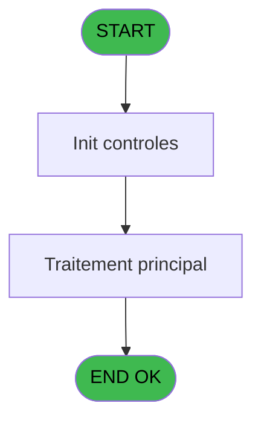
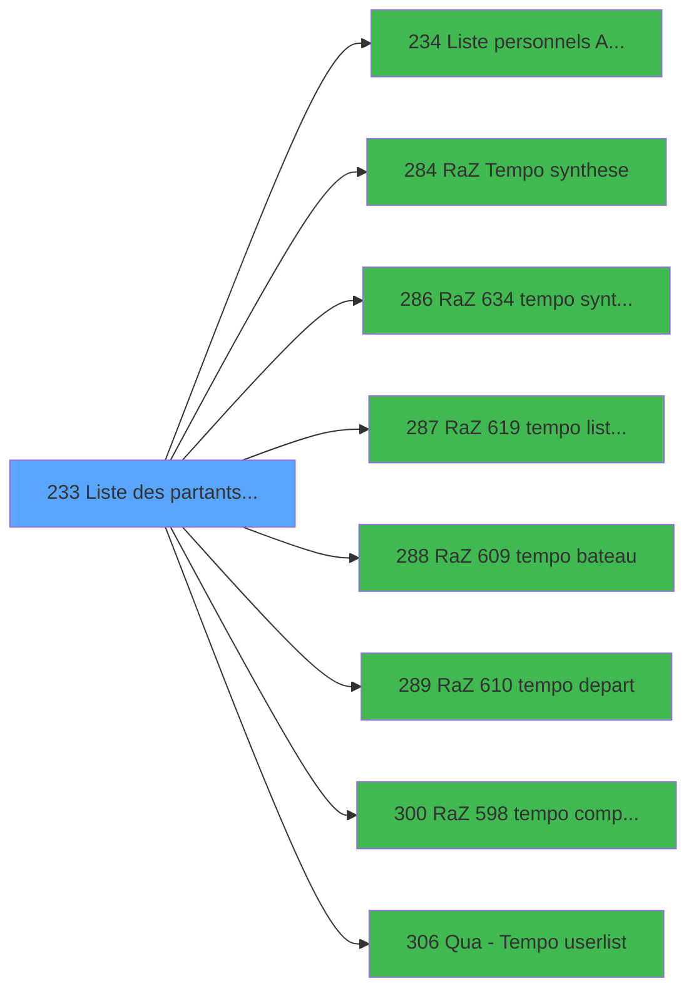

# PBP IDE 233 - Liste des partants personnel

> **Analyse**: Phases 1-4 2026-02-03 15:57 -> 15:57 (13s) | Assemblage 15:57
> **Pipeline**: V7.2 Enrichi
> **Structure**: 4 onglets (Resume | Ecrans | Donnees | Connexions)

<!-- TAB:Resume -->

## 1. FICHE D'IDENTITE

| Attribut | Valeur |
|----------|--------|
| Projet | PBP |
| IDE Position | 233 |
| Nom Programme | Liste des partants personnel |
| Fichier source | `Prg_233.xml` |
| Dossier IDE | Liste |
| Taches | 1 (0 ecrans visibles) |
| Tables modifiees | 0 |
| Programmes appeles | 8 |
| :warning: Statut | **ORPHELIN_POTENTIEL** |

## 2. DESCRIPTION FONCTIONNELLE

**Liste des partants personnel** assure la gestion complete de ce processus.

Le flux de traitement s'organise en **1 blocs fonctionnels** :

- **Traitement** (1 tache) : traitements metier divers

## 3. BLOCS FONCTIONNELS

### 3.1 Traitement (1 tache)

Traitements internes.

---

#### 233 - Liste des partants personnel

**Role** : Traitement : Liste des partants personnel.
**Variables liees** : B (CodeListe), C (TypeListe)
**Delegue a** : [  Liste personnels AVPBDR (IDE 234)](PBP-IDE-234.md), [Qua -> Tempo userlist (IDE 306)](PBP-IDE-306.md)

## 5. REGLES METIER

*(Aucune regle metier identifiee)*

## 6. CONTEXTE

- **Appele par**: (aucun)
- **Appelle**: 8 programmes | **Tables**: 0 (W:0 R:0 L:0) | **Taches**: 1 | **Expressions**: 9

<!-- TAB:Ecrans -->

## 8. ECRANS

*(Programme sans ecran visible)*

## 9. NAVIGATION

### 9.3 Structure hierarchique (1 tache)

| Position | Tache | Type | Dimensions | Bloc |
|----------|-------|------|------------|------|
| **233.1** | [**Liste des partants personnel** (233)](#t1) | MDI | - | Traitement |

### 9.4 Algorigramme

> **Legende**: Vert = START/END OK | Rouge = END KO | Bleu = Decisions
> *Algorigramme auto-genere. Utiliser `/algorigramme` pour une synthese metier detaillee.*

<!-- TAB:Donnees -->

## 10. TABLES

### Tables utilisees (0)

| ID | Nom | Description | Type | R | W | L | Usages |
|----|-----|-------------|------|---|---|---|--------|

### Colonnes par table (0 / 0 tables avec colonnes identifiees)

## 11. VARIABLES

### 11.1 Variables de session (1)

Variables persistantes pendant toute la session.

| Lettre | Nom | Type | Usage dans |
|--------|-----|------|-----------|
| G | v.NomFichierExcel | Alpha | - |

### 11.2 Autres (6)

Variables diverses.

| Lettre | Nom | Type | Usage dans |
|--------|-----|------|-----------|
| A | CodeEcran | Numeric | - |
| B | CodeListe | Alpha | - |
| C | TypeListe | Alpha | - |
| D | CodeSelect | Alpha | - |
| E | Categorie | Alpha | - |
| F | NomTable | Alpha | - |

## 12. EXPRESSIONS

**9 / 9 expressions decodees (100%)**

### 12.1 Repartition par type

| Type | Expressions | Regles |
|------|-------------|--------|
| CONSTANTE | 6 | 0 |
| OTHER | 3 | 0 |

### 12.2 Expressions cles par type

#### CONSTANTE (6 expressions)

| Type | IDE | Expression | Regle |
|------|-----|------------|-------|
| CONSTANTE | 5 | `'P'` | - |
| CONSTANTE | 6 | `''` | - |
| CONSTANTE | 7 | `'TQUGO'` | - |
| CONSTANTE | 1 | `64` | - |
| CONSTANTE | 2 | `'R'` | - |
| ... | | *+1 autres* | |

#### OTHER (3 expressions)

| Type | IDE | Expression | Regle |
|------|-----|------------|-------|
| OTHER | 9 | `SetCrsr (1)` | - |
| OTHER | 8 | `SetCrsr (2)` | - |
| OTHER | 3 | `MlsTrans ('PARTANTS')` | - |

<!-- TAB:Connexions -->

## 13. GRAPHE D'APPELS

### 13.1 Chaine depuis Main (Callers)

**Chemin**: (pas de callers directs)

### 13.2 Callers

| IDE | Nom Programme | Nb Appels |
|-----|---------------|-----------|
| - | (aucun) | - |

### 13.3 Callees (programmes appeles)

### 13.4 Detail Callees avec contexte

| IDE | Nom Programme | Appels | Contexte |
|-----|---------------|--------|----------|
| [234](PBP-IDE-234.md) |   Liste personnels AVPBDR | 1 | Configuration impression |
| [284](PBP-IDE-284.md) | RaZ Tempo synthese | 1 | Reinitialisation |
| [286](PBP-IDE-286.md) | RaZ  634 tempo synthese | 1 | Reinitialisation |
| [287](PBP-IDE-287.md) | RaZ 619 tempo liste ecran | 1 | Reinitialisation |
| [288](PBP-IDE-288.md) | RaZ 609 tempo bateau | 1 | Reinitialisation |
| [289](PBP-IDE-289.md) | RaZ 610 tempo depart | 1 | Reinitialisation |
| [300](PBP-IDE-300.md) | RaZ 598 tempo comptage eff | 1 | Reinitialisation |
| [306](PBP-IDE-306.md) | Qua -> Tempo userlist | 1 | Configuration impression |

## 14. RECOMMANDATIONS MIGRATION

### 14.1 Profil du programme

| Metrique | Valeur | Impact migration |
|----------|--------|-----------------|
| Lignes de logique | 27 | Programme compact |
| Expressions | 9 | Peu de logique |
| Tables WRITE | 0 | Impact faible |
| Sous-programmes | 8 | Dependances moderees |
| Ecrans visibles | 0 | Ecran unique ou traitement batch |
| Code desactive | 0% (0 / 27) | Code sain |
| Regles metier | 0 | Pas de regle identifiee |

### 14.2 Plan de migration par bloc

#### Traitement (1 tache: 0 ecran, 1 traitement)

- **Strategie** : 1 service(s) backend injectable(s) (Domain Services).
- 8 sous-programme(s) a migrer ou a reutiliser depuis les services existants.
- Decomposer les taches en services unitaires testables.

### 14.3 Dependances critiques

| Dependance | Type | Appels | Impact |
|------------|------|--------|--------|
| [RaZ 610 tempo depart (IDE 289)](PBP-IDE-289.md) | Sous-programme | 1x | Normale - Reinitialisation |
| [RaZ 609 tempo bateau (IDE 288)](PBP-IDE-288.md) | Sous-programme | 1x | Normale - Reinitialisation |
| [Qua -> Tempo userlist (IDE 306)](PBP-IDE-306.md) | Sous-programme | 1x | Normale - Configuration impression |
| [RaZ 598 tempo comptage eff (IDE 300)](PBP-IDE-300.md) | Sous-programme | 1x | Normale - Reinitialisation |
| [RaZ Tempo synthese (IDE 284)](PBP-IDE-284.md) | Sous-programme | 1x | Normale - Reinitialisation |
| [  Liste personnels AVPBDR (IDE 234)](PBP-IDE-234.md) | Sous-programme | 1x | Normale - Configuration impression |
| [RaZ 619 tempo liste ecran (IDE 287)](PBP-IDE-287.md) | Sous-programme | 1x | Normale - Reinitialisation |
| [RaZ  634 tempo synthese (IDE 286)](PBP-IDE-286.md) | Sous-programme | 1x | Normale - Reinitialisation |

---
*Spec DETAILED generee par Pipeline V7.2 - 2026-02-03 15:57*
