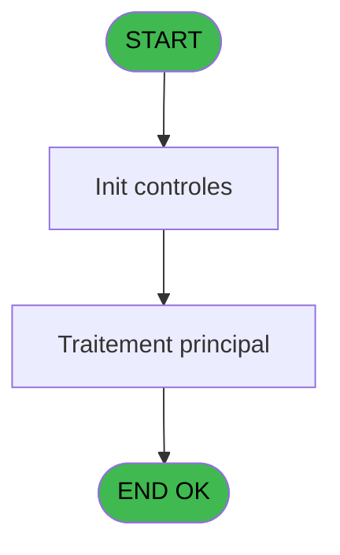
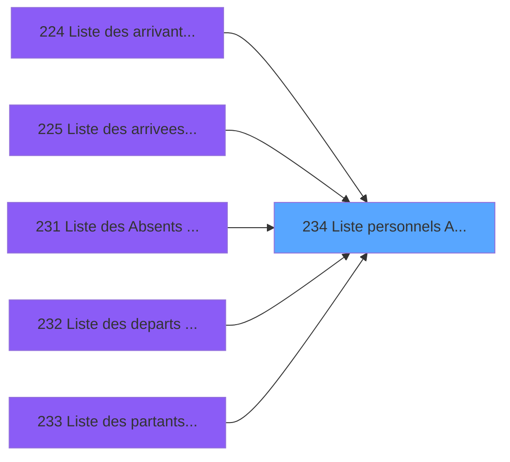
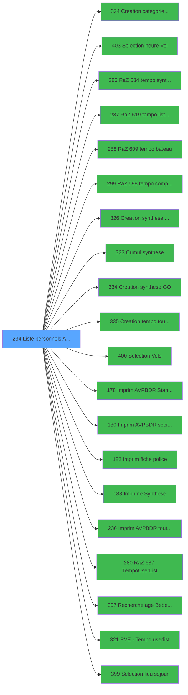

# PBP IDE 234 - Liste personnels AVPBDR

> **Analyse**: Phases 1-4 2026-02-03 15:57 -> 15:58 (14s) | Assemblage 15:58
> **Pipeline**: V7.2 Enrichi
> **Structure**: 4 onglets (Resume | Ecrans | Donnees | Connexions)

<!-- TAB:Resume -->

## 1. FICHE D'IDENTITE

| Attribut | Valeur |
|----------|--------|
| Projet | PBP |
| IDE Position | 234 |
| Nom Programme | Liste personnels AVPBDR |
| Fichier source | `Prg_234.xml` |
| Dossier IDE | Liste |
| Taches | 1 (1 ecrans visibles) |
| Tables modifiees | 0 |
| Programmes appeles | 20 |

## 2. DESCRIPTION FONCTIONNELLE

**Liste personnels AVPBDR** assure la gestion complete de ce processus, accessible depuis [Liste des arrivants personnel (IDE 224)](PBP-IDE-224.md), [Liste des arrivees personnel (IDE 225)](PBP-IDE-225.md), [Liste des Absents personnel (IDE 231)](PBP-IDE-231.md), [Liste des departs personnel (IDE 232)](PBP-IDE-232.md), [Liste des partants personnel (IDE 233)](PBP-IDE-233.md).

Le flux de traitement s'organise en **1 blocs fonctionnels** :

- **Traitement** (1 tache) : traitements metier divers

**Logique metier** : 6 regles identifiees couvrant conditions metier, valeurs par defaut.

## 3. BLOCS FONCTIONNELS

### 3.1 Traitement (1 tache)

Traitements internes.

---

#### 234 - Liste CLients ABPBDR [[ECRAN]](#ecran-t1)

**Role** : Traitement : Liste CLients ABPBDR.
**Ecran** : 1569 x 201 DLU (MDI) | [Voir mockup](#ecran-t1)
**Variables liees** : B (>CodeListe), F (>TypeListe), Q (w0_TopListe), S (w0_Liste), T (b_Liste)
**Delegue a** : [Cumul synthese (IDE 333)](PBP-IDE-333.md), [PVE -> Tempo userlist (IDE 321)](PBP-IDE-321.md)

## 5. REGLES METIER

6 regles identifiees:

### Autres (6 regles)

#### [RM-001] Si >CodeListe [B]='D' OR >CodeListe [B]='R' alors 'R' sinon 'A')

| Element | Detail |
|---------|--------|
| **Condition** | `>CodeListe [B]='D' OR >CodeListe [B]='R'` |
| **Si vrai** | 'R' |
| **Si faux** | 'A') |
| **Variables** | B (>CodeListe) |
| **Expression source** | Expression 10 : `IF (>CodeListe [B]='D' OR >CodeListe [B]='R','R','A')` |
| **Exemple** | Si >CodeListe [B]='D' OR >CodeListe [B]='R' → 'R'. Sinon → 'A') |
| **Impact** | [234 - Liste CLients ABPBDR](#t1) |

#### [RM-002] Si >CodeListe [B]='D' alors 'R' sinon 'A')

| Element | Detail |
|---------|--------|
| **Condition** | `>CodeListe [B]='D'` |
| **Si vrai** | 'R' |
| **Si faux** | 'A') |
| **Variables** | B (>CodeListe) |
| **Expression source** | Expression 60 : `IF (>CodeListe [B]='D','R','A')` |
| **Exemple** | Si >CodeListe [B]='D' → 'R'. Sinon → 'A') |
| **Impact** | [234 - Liste CLients ABPBDR](#t1) |

#### [RM-003] Si [AS]='VV1' alors 0 sinon IF ([AS]='VV2',13,20))

| Element | Detail |
|---------|--------|
| **Condition** | `[AS]='VV1'` |
| **Si vrai** | 0 |
| **Si faux** | IF ([AS]='VV2',13,20)) |
| **Expression source** | Expression 68 : `IF ([AS]='VV1',0,IF ([AS]='VV2',13,20))` |
| **Exemple** | Si [AS]='VV1' → 0. Sinon → IF ([AS]='VV2',13,20)) |

#### [RM-004] Si InStr ('RDP' alors >CodeListe [B])>0 sinon 0,w0_TypeVol [K])

| Element | Detail |
|---------|--------|
| **Condition** | `InStr ('RDP'` |
| **Si vrai** | >CodeListe [B])>0 |
| **Si faux** | 0,w0_TypeVol [K]) |
| **Variables** | B (>CodeListe), K (w0_TypeVol) |
| **Expression source** | Expression 71 : `IF (InStr ('RDP',>CodeListe [B])>0,0,w0_TypeVol [K])` |
| **Exemple** | Si InStr ('RDP' → >CodeListe [B])>0. Sinon → 0,w0_TypeVol [K]) |
| **Impact** | [234 - Liste CLients ABPBDR](#t1) |

#### [RM-005] Si InStr ('RD' alors >CodeListe [B])>0 sinon 0,w0_TypeVol [K])

| Element | Detail |
|---------|--------|
| **Condition** | `InStr ('RD'` |
| **Si vrai** | >CodeListe [B])>0 |
| **Si faux** | 0,w0_TypeVol [K]) |
| **Variables** | B (>CodeListe), K (w0_TypeVol) |
| **Expression source** | Expression 72 : `IF (InStr ('RD',>CodeListe [B])>0,0,w0_TypeVol [K])` |
| **Exemple** | Si InStr ('RD' → >CodeListe [B])>0. Sinon → 0,w0_TypeVol [K]) |
| **Impact** | [234 - Liste CLients ABPBDR](#t1) |

#### [RM-006] Valeur par defaut si [FU] est vide

| Element | Detail |
|---------|--------|
| **Condition** | `[FU]=''` |
| **Si vrai** | 'T' |
| **Si faux** | [FU]) |
| **Expression source** | Expression 132 : `IF([FU]='','T',[FU])` |
| **Exemple** | Si [FU]='' → 'T'. Sinon → [FU]) |

## 6. CONTEXTE

- **Appele par**: [Liste des arrivants personnel (IDE 224)](PBP-IDE-224.md), [Liste des arrivees personnel (IDE 225)](PBP-IDE-225.md), [Liste des Absents personnel (IDE 231)](PBP-IDE-231.md), [Liste des departs personnel (IDE 232)](PBP-IDE-232.md), [Liste des partants personnel (IDE 233)](PBP-IDE-233.md)
- **Appelle**: 20 programmes | **Tables**: 4 (W:0 R:1 L:3) | **Taches**: 1 | **Expressions**: 135

<!-- TAB:Ecrans -->

## 8. ECRANS

### 8.1 Forms visibles (1 / 1)

| # | Position | Tache | Nom | Type | Largeur | Hauteur | Bloc |
|---|----------|-------|-----|------|---------|---------|------|
| 1 | 234 | 234 | Liste CLients ABPBDR | MDI | 1569 | 201 | Traitement |

### 8.2 Mockups Ecrans

---

#### 234 - Liste CLients ABPBDR
**Tache** : [234](#t1) | **Type** : MDI | **Dimensions** : 1569 x 201 DLU
**Bloc** : Traitement | **Titre IDE** : Liste CLients ABPBDR

<!-- FORM-DATA:
{
    "width":  1569,
    "vFactor":  8,
    "type":  "MDI",
    "hFactor":  8,
    "controls":  [
                     {
                         "x":  1,
                         "type":  "label",
                         "var":  "",
                         "y":  0,
                         "w":  1555,
                         "fmt":  "",
                         "name":  "",
                         "h":  20,
                         "color":  "1",
                         "text":  "",
                         "parent":  null
                     },
                     {
                         "x":  372,
                         "type":  "label",
                         "var":  "",
                         "y":  24,
                         "w":  339,
                         "fmt":  "",
                         "name":  "",
                         "h":  146,
                         "color":  "195",
                         "text":  "Paramètres",
                         "parent":  null
                     },
                     {
                         "x":  0,
                         "type":  "table",
                         "var":  "",
                         "name":  "",
                         "titleH":  12,
                         "color":  "110",
                         "w":  371,
                         "y":  26,
                         "fmt":  "",
                         "parent":  null,
                         "text":  "",
                         "rowH":  11,
                         "h":  147,
                         "cols":  [
                                      {
                                          "title":  "",
                                          "layer":  1,
                                          "w":  336
                                      }
                                  ],
                         "rows":  1
                     },
                     {
                         "x":  1107,
                         "type":  "label",
                         "var":  "",
                         "y":  25,
                         "w":  258,
                         "fmt":  "",
                         "name":  "",
                         "h":  143,
                         "color":  "",
                         "text":  "",
                         "parent":  null
                     },
                     {
                         "x":  1107,
                         "type":  "label",
                         "var":  "",
                         "y":  25,
                         "w":  258,
                         "fmt":  "",
                         "name":  "",
                         "h":  49,
                         "color":  "",
                         "text":  "",
                         "parent":  null
                     },
                     {
                         "x":  1107,
                         "type":  "label",
                         "var":  "",
                         "y":  25,
                         "w":  258,
                         "fmt":  "",
                         "name":  "",
                         "h":  49,
                         "color":  "",
                         "text":  "",
                         "parent":  null
                     },
                     {
                         "x":  1369,
                         "type":  "label",
                         "var":  "",
                         "y":  25,
                         "w":  186,
                         "fmt":  "",
                         "name":  "",
                         "h":  143,
                         "color":  "",
                         "text":  "",
                         "parent":  null
                     },
                     {
                         "x":  1118,
                         "type":  "label",
                         "var":  "",
                         "y":  30,
                         "w":  96,
                         "fmt":  "",
                         "name":  "",
                         "h":  8,
                         "color":  "",
                         "text":  "Port Arrivée",
                         "parent":  7
                     },
                     {
                         "x":  1116,
                         "type":  "label",
                         "var":  "",
                         "y":  31,
                         "w":  82,
                         "fmt":  "",
                         "name":  "",
                         "h":  8,
                         "color":  "",
                         "text":  "Seminaire",
                         "parent":  9
                     },
                     {
                         "x":  457,
                         "type":  "label",
                         "var":  "",
                         "y":  38,
                         "w":  182,
                         "fmt":  "",
                         "name":  "",
                         "h":  36,
                         "color":  "",
                         "text":  "",
                         "parent":  null
                     },
                     {
                         "x":  1145,
                         "type":  "label",
                         "var":  "",
                         "y":  37,
                         "w":  109,
                         "fmt":  "",
                         "name":  "",
                         "h":  8,
                         "color":  "",
                         "text":  "Age Minimum",
                         "parent":  8
                     },
                     {
                         "x":  501,
                         "type":  "label",
                         "var":  "",
                         "y":  47,
                         "w":  46,
                         "fmt":  "",
                         "name":  "",
                         "h":  9,
                         "color":  "",
                         "text":  "Total",
                         "parent":  14
                     },
                     {
                         "x":  1145,
                         "type":  "label",
                         "var":  "",
                         "y":  53,
                         "w":  114,
                         "fmt":  "",
                         "name":  "",
                         "h":  8,
                         "color":  "",
                         "text":  "Age Maximum",
                         "parent":  8
                     },
                     {
                         "x":  469,
                         "type":  "label",
                         "var":  "",
                         "y":  62,
                         "w":  78,
                         "fmt":  "",
                         "name":  "",
                         "h":  9,
                         "color":  "",
                         "text":  "Sélection",
                         "parent":  14
                     },
                     {
                         "x":  1116,
                         "type":  "label",
                         "var":  "",
                         "y":  57,
                         "w":  30,
                         "fmt":  "",
                         "name":  "",
                         "h":  8,
                         "color":  "",
                         "text":  "Du",
                         "parent":  9
                     },
                     {
                         "x":  1118,
                         "type":  "label",
                         "var":  "",
                         "y":  58,
                         "w":  45,
                         "fmt":  "",
                         "name":  "",
                         "h":  8,
                         "color":  "",
                         "text":  "Date",
                         "parent":  7
                     },
                     {
                         "x":  1113,
                         "type":  "line",
                         "var":  "",
                         "y":  73,
                         "w":  249,
                         "fmt":  "",
                         "name":  "",
                         "h":  0,
                         "color":  "",
                         "text":  "",
                         "parent":  7
                     },
                     {
                         "x":  1118,
                         "type":  "label",
                         "var":  "",
                         "y":  78,
                         "w":  98,
                         "fmt":  "",
                         "name":  "",
                         "h":  8,
                         "color":  "",
                         "text":  "Dernier Port",
                         "parent":  7
                     },
                     {
                         "x":  381,
                         "type":  "label",
                         "var":  "",
                         "y":  84,
                         "w":  45,
                         "fmt":  "",
                         "name":  "",
                         "h":  9,
                         "color":  "",
                         "text":  "Date",
                         "parent":  5
                     },
                     {
                         "x":  381,
                         "type":  "label",
                         "var":  "",
                         "y":  97,
                         "w":  54,
                         "fmt":  "",
                         "name":  "",
                         "h":  8,
                         "color":  "",
                         "text":  "Heure",
                         "parent":  5
                     },
                     {
                         "x":  1120,
                         "type":  "label",
                         "var":  "",
                         "y":  105,
                         "w":  45,
                         "fmt":  "",
                         "name":  "",
                         "h":  8,
                         "color":  "",
                         "text":  "Date",
                         "parent":  7
                     },
                     {
                         "x":  381,
                         "type":  "label",
                         "var":  "",
                         "y":  110,
                         "w":  43,
                         "fmt":  "",
                         "name":  "",
                         "h":  9,
                         "color":  "",
                         "text":  "Liste",
                         "parent":  5
                     },
                     {
                         "x":  1113,
                         "type":  "line",
                         "var":  "",
                         "y":  119,
                         "w":  249,
                         "fmt":  "",
                         "name":  "",
                         "h":  0,
                         "color":  "",
                         "text":  "",
                         "parent":  7
                     },
                     {
                         "x":  381,
                         "type":  "label",
                         "var":  "",
                         "y":  123,
                         "w":  90,
                         "fmt":  "",
                         "name":  "",
                         "h":  9,
                         "color":  "",
                         "text":  "Lieu séjour",
                         "parent":  5
                     },
                     {
                         "x":  1118,
                         "type":  "label",
                         "var":  "",
                         "y":  125,
                         "w":  110,
                         "fmt":  "",
                         "name":  "",
                         "h":  8,
                         "color":  "",
                         "text":  "Prochain Port",
                         "parent":  7
                     },
                     {
                         "x":  1118,
                         "type":  "label",
                         "var":  "",
                         "y":  152,
                         "w":  45,
                         "fmt":  "",
                         "name":  "",
                         "h":  8,
                         "color":  "",
                         "text":  "Date",
                         "parent":  7
                     },
                     {
                         "x":  2,
                         "type":  "label",
                         "var":  "",
                         "y":  174,
                         "w":  1555,
                         "fmt":  "",
                         "name":  "",
                         "h":  24,
                         "color":  "1",
                         "text":  "",
                         "parent":  null
                     },
                     {
                         "x":  381,
                         "type":  "label",
                         "var":  "",
                         "y":  153,
                         "w":  114,
                         "fmt":  "",
                         "name":  "",
                         "h":  12,
                         "color":  "",
                         "text":  "Etat comptes",
                         "parent":  5
                     },
                     {
                         "x":  478,
                         "type":  "edit",
                         "var":  "",
                         "y":  84,
                         "w":  126,
                         "fmt":  "",
                         "name":  "w0_Date",
                         "h":  10,
                         "color":  "110",
                         "text":  "",
                         "parent":  5
                     },
                     {
                         "x":  607,
                         "type":  "button",
                         "var":  "",
                         "y":  84,
                         "w":  25,
                         "fmt":  "...",
                         "name":  "b_Date",
                         "h":  10,
                         "color":  "",
                         "text":  "",
                         "parent":  5
                     },
                     {
                         "x":  478,
                         "type":  "edit",
                         "var":  "",
                         "y":  97,
                         "w":  37,
                         "fmt":  "",
                         "name":  "w0_Heure",
                         "h":  10,
                         "color":  "110",
                         "text":  "",
                         "parent":  5
                     },
                     {
                         "x":  478,
                         "type":  "edit",
                         "var":  "",
                         "y":  110,
                         "w":  182,
                         "fmt":  "",
                         "name":  "w0_Liste",
                         "h":  10,
                         "color":  "110",
                         "text":  "",
                         "parent":  5
                     },
                     {
                         "x":  663,
                         "type":  "button",
                         "var":  "",
                         "y":  110,
                         "w":  25,
                         "fmt":  "...",
                         "name":  "b_Liste",
                         "h":  10,
                         "color":  "",
                         "text":  "",
                         "parent":  5
                     },
                     {
                         "x":  505,
                         "type":  "button",
                         "var":  "",
                         "y":  123,
                         "w":  25,
                         "fmt":  "...",
                         "name":  "b_LieuSejour",
                         "h":  10,
                         "color":  "",
                         "text":  "",
                         "parent":  5
                     },
                     {
                         "x":  478,
                         "type":  "edit",
                         "var":  "",
                         "y":  123,
                         "w":  26,
                         "fmt":  "",
                         "name":  "w0_LieuSejour",
                         "h":  10,
                         "color":  "110",
                         "text":  "",
                         "parent":  5
                     },
                     {
                         "x":  1116,
                         "type":  "edit",
                         "var":  "",
                         "y":  42,
                         "w":  238,
                         "fmt":  "",
                         "name":  "w0_NomSeminaire",
                         "h":  10,
                         "color":  "6",
                         "text":  "",
                         "parent":  9
                     },
                     {
                         "x":  1148,
                         "type":  "edit",
                         "var":  "",
                         "y":  57,
                         "w":  126,
                         "fmt":  "DD/MM/YYYY",
                         "name":  "w0_DateSeminaire",
                         "h":  10,
                         "color":  "6",
                         "text":  "",
                         "parent":  9
                     },
                     {
                         "x":  1288,
                         "type":  "button",
                         "var":  "",
                         "y":  57,
                         "w":  25,
                         "fmt":  "...",
                         "name":  "b_DateSeminaire",
                         "h":  10,
                         "color":  "",
                         "text":  "",
                         "parent":  9
                     },
                     {
                         "x":  1118,
                         "type":  "edit",
                         "var":  "",
                         "y":  43,
                         "w":  238,
                         "fmt":  "",
                         "name":  "w0_PortArrive",
                         "h":  10,
                         "color":  "110",
                         "text":  "",
                         "parent":  7
                     },
                     {
                         "x":  1163,
                         "type":  "edit",
                         "var":  "",
                         "y":  58,
                         "w":  126,
                         "fmt":  "DD/MM/YYYY",
                         "name":  "w0_DateArr",
                         "h":  10,
                         "color":  "110",
                         "text":  "",
                         "parent":  7
                     },
                     {
                         "x":  1299,
                         "type":  "button",
                         "var":  "",
                         "y":  58,
                         "w":  25,
                         "fmt":  "...",
                         "name":  "b_DateArr",
                         "h":  10,
                         "color":  "",
                         "text":  "",
                         "parent":  7
                     },
                     {
                         "x":  1118,
                         "type":  "edit",
                         "var":  "",
                         "y":  91,
                         "w":  238,
                         "fmt":  "",
                         "name":  "w0_DernierPort",
                         "h":  10,
                         "color":  "110",
                         "text":  "",
                         "parent":  7
                     },
                     {
                         "x":  1168,
                         "type":  "edit",
                         "var":  "",
                         "y":  105,
                         "w":  126,
                         "fmt":  "DD/MM/YYYY",
                         "name":  "w0_DateDernier",
                         "h":  10,
                         "color":  "110",
                         "text":  "",
                         "parent":  7
                     },
                     {
                         "x":  1296,
                         "type":  "button",
                         "var":  "",
                         "y":  105,
                         "w":  25,
                         "fmt":  "...",
                         "name":  "b_DateDern",
                         "h":  10,
                         "color":  "",
                         "text":  "",
                         "parent":  7
                     },
                     {
                         "x":  1118,
                         "type":  "edit",
                         "var":  "",
                         "y":  138,
                         "w":  238,
                         "fmt":  "",
                         "name":  "w0_ProchainPort",
                         "h":  10,
                         "color":  "110",
                         "text":  "",
                         "parent":  7
                     },
                     {
                         "x":  1163,
                         "type":  "edit",
                         "var":  "",
                         "y":  152,
                         "w":  126,
                         "fmt":  "DD/MM/YYYY",
                         "name":  "w0_DateProchain",
                         "h":  10,
                         "color":  "110",
                         "text":  "",
                         "parent":  7
                     },
                     {
                         "x":  1289,
                         "type":  "button",
                         "var":  "",
                         "y":  152,
                         "w":  25,
                         "fmt":  "...",
                         "name":  "b_DateProchain",
                         "h":  10,
                         "color":  "",
                         "text":  "",
                         "parent":  7
                     },
                     {
                         "x":  1288,
                         "type":  "edit",
                         "var":  "",
                         "y":  37,
                         "w":  37,
                         "fmt":  "",
                         "name":  "w0_AgeMini",
                         "h":  10,
                         "color":  "110",
                         "text":  "",
                         "parent":  8
                     },
                     {
                         "x":  1288,
                         "type":  "edit",
                         "var":  "",
                         "y":  53,
                         "w":  37,
                         "fmt":  "",
                         "name":  "w0_AgeMaxi",
                         "h":  10,
                         "color":  "110",
                         "text":  "",
                         "parent":  8
                     },
                     {
                         "x":  478,
                         "type":  "edit",
                         "var":  "",
                         "y":  136,
                         "w":  232,
                         "fmt":  "",
                         "name":  "",
                         "h":  8,
                         "color":  "142",
                         "text":  "",
                         "parent":  5
                     },
                     {
                         "x":  43,
                         "type":  "edit",
                         "var":  "",
                         "y":  28,
                         "w":  277,
                         "fmt":  "",
                         "name":  "QUA Libelle",
                         "h":  8,
                         "color":  "110",
                         "text":  "",
                         "parent":  6
                     },
                     {
                         "x":  6,
                         "type":  "checkbox",
                         "var":  "",
                         "y":  28,
                         "w":  30,
                         "fmt":  "",
                         "name":  "TUL MARQUEUR",
                         "h":  9,
                         "color":  "110",
                         "text":  "",
                         "parent":  6
                     },
                     {
                         "x":  569,
                         "type":  "edit",
                         "var":  "",
                         "y":  47,
                         "w":  56,
                         "fmt":  "",
                         "name":  "w0_Total",
                         "h":  9,
                         "color":  "",
                         "text":  "",
                         "parent":  14
                     },
                     {
                         "x":  569,
                         "type":  "edit",
                         "var":  "",
                         "y":  62,
                         "w":  56,
                         "fmt":  "",
                         "name":  "w0_Selection",
                         "h":  9,
                         "color":  "",
                         "text":  "",
                         "parent":  14
                     },
                     {
                         "x":  1384,
                         "type":  "button",
                         "var":  "",
                         "y":  95,
                         "w":  154,
                         "fmt":  "\u0026Ecran",
                         "name":  "b_Ecran",
                         "h":  18,
                         "color":  "",
                         "text":  "",
                         "parent":  10
                     },
                     {
                         "x":  1384,
                         "type":  "button",
                         "var":  "",
                         "y":  120,
                         "w":  154,
                         "fmt":  "\u0026Impression",
                         "name":  "b_Edition",
                         "h":  18,
                         "color":  "",
                         "text":  "",
                         "parent":  10
                     },
                     {
                         "x":  5,
                         "type":  "edit",
                         "var":  "",
                         "y":  2,
                         "w":  267,
                         "fmt":  "20",
                         "name":  "",
                         "h":  8,
                         "color":  "",
                         "text":  "",
                         "parent":  1
                     },
                     {
                         "x":  1193,
                         "type":  "edit",
                         "var":  "",
                         "y":  6,
                         "w":  349,
                         "fmt":  "WWW DD MMM YYYYT",
                         "name":  "",
                         "h":  8,
                         "color":  "",
                         "text":  "",
                         "parent":  1
                     },
                     {
                         "x":  5,
                         "type":  "edit",
                         "var":  "",
                         "y":  11,
                         "w":  331,
                         "fmt":  "25",
                         "name":  "",
                         "h":  8,
                         "color":  "",
                         "text":  "",
                         "parent":  1
                     },
                     {
                         "x":  1376,
                         "type":  "image",
                         "var":  "",
                         "y":  41,
                         "w":  170,
                         "fmt":  "",
                         "name":  "",
                         "h":  59,
                         "color":  "",
                         "text":  "",
                         "parent":  10
                     },
                     {
                         "x":  10,
                         "type":  "button",
                         "var":  "",
                         "y":  177,
                         "w":  154,
                         "fmt":  "\u0026Quitter",
                         "name":  "",
                         "h":  18,
                         "color":  "",
                         "text":  "",
                         "parent":  49
                     },
                     {
                         "x":  721,
                         "type":  "subform",
                         "var":  "",
                         "y":  24,
                         "w":  376,
                         "fmt":  "",
                         "name":  "Sel Code Logements",
                         "h":  144,
                         "color":  "",
                         "text":  "",
                         "parent":  null
                     },
                     {
                         "x":  1384,
                         "type":  "button",
                         "var":  "",
                         "y":  145,
                         "w":  154,
                         "fmt":  "E\u0026xcel",
                         "name":  "b_Excel",
                         "h":  18,
                         "color":  "",
                         "text":  "",
                         "parent":  null
                     },
                     {
                         "x":  484,
                         "type":  "combobox",
                         "var":  "",
                         "y":  153,
                         "w":  194,
                         "fmt":  "",
                         "name":  "w0_Soldé,Insoldé,Tous",
                         "h":  12,
                         "color":  "",
                         "text":  "S,N,T",
                         "parent":  5
                     }
                 ],
    "taskId":  "234",
    "height":  201
}
-->

<strong>Champs : 23 champs</strong>

| Pos (x,y) | Nom | Variable | Type |
|-----------|-----|----------|------|
| 478,84 | w0_Date | - | edit |
| 478,97 | w0_Heure | - | edit |
| 478,110 | w0_Liste | - | edit |
| 478,123 | w0_LieuSejour | - | edit |
| 1116,42 | w0_NomSeminaire | - | edit |
| 1148,57 | w0_DateSeminaire | - | edit |
| 1118,43 | w0_PortArrive | - | edit |
| 1163,58 | w0_DateArr | - | edit |
| 1118,91 | w0_DernierPort | - | edit |
| 1168,105 | w0_DateDernier | - | edit |
| 1118,138 | w0_ProchainPort | - | edit |
| 1163,152 | w0_DateProchain | - | edit |
| 1288,37 | w0_AgeMini | - | edit |
| 1288,53 | w0_AgeMaxi | - | edit |
| 478,136 | (sans nom) | - | edit |
| 43,28 | QUA Libelle | - | edit |
| 6,28 | TUL MARQUEUR | - | checkbox |
| 569,47 | w0_Total | - | edit |
| 569,62 | w0_Selection | - | edit |
| 5,2 | 20 | - | edit |
| 1193,6 | WWW DD MMM YYYYT | - | edit |
| 5,11 | 25 | - | edit |
| 484,153 | w0_Soldé,Insoldé,Tous | - | combobox |

<strong>Boutons : 11 boutons</strong>

| Bouton | Pos (x,y) | Action |
|--------|-----------|--------|
| ... | 607,84 | Bouton fonctionnel |
| ... | 663,110 | Bouton fonctionnel |
| ... | 505,123 | Bouton fonctionnel |
| ... | 1288,57 | Bouton fonctionnel |
| ... | 1299,58 | Bouton fonctionnel |
| ... | 1296,105 | Bouton fonctionnel |
| ... | 1289,152 | Bouton fonctionnel |
| Ecran | 1384,95 | Appel [RaZ 619 tempo liste ecran (IDE 287)](PBP-IDE-287.md) |
| Impression | 1384,120 | Bouton fonctionnel |
| Quitter | 10,177 | Quitte le programme |
| Excel | 1384,145 | Bouton fonctionnel |

## 9. NAVIGATION

Ecran unique: **Liste CLients ABPBDR**

### 9.3 Structure hierarchique (1 tache)

| Position | Tache | Type | Dimensions | Bloc |
|----------|-------|------|------------|------|
| **234.1** | [**Liste CLients ABPBDR** (234)](#t1) [mockup](#ecran-t1) | MDI | 1569x201 | Traitement |

### 9.4 Algorigramme

> **Legende**: Vert = START/END OK | Rouge = END KO | Bleu = Decisions
> *Algorigramme auto-genere. Utiliser `/algorigramme` pour une synthese metier detaillee.*

<!-- TAB:Donnees -->

## 10. TABLES

### Tables utilisees (4)

| ID | Nom | Description | Type | R | W | L | Usages |
|----|-----|-------------|------|---|---|---|--------|
| 81 | societe__________soc |  | DB | R |   |   | 1 |
| 118 | tables_imports |  | DB |   |   | L | 1 |
| 120 | tables_qualites__qua |  | DB |   |   | L | 1 |
| 637 | tempo_zone_secteur | Table temporaire ecran | DB |   |   | L | 1 |

### Colonnes par table (1 / 1 tables avec colonnes identifiees)

Table 81 - societe__________soc (R) - 1 usages

| Lettre | Variable | Acces | Type |
|--------|----------|-------|------|
| A | >CodeEcran | R | Numeric |
| B | >CodeListe | R | Alpha |
| C | >CodeSelect | R | Alpha |
| D | >Categorie | R | Alpha |
| E | >NomTable | R | Alpha |
| F | >TypeListe | R | Alpha |
| G | >NomFichierExcel | R | Alpha |
| H | >Soldé,Non_soldé,Tous | R | Unicode |
| I | w0_CodeEcranFille | R | Numeric |
| J | w0_IndexGene | R | Numeric |
| K | w0_TypeVol | R | Alpha |
| L | w0_OkVol | R | Logical |
| M | w0_Date | R | Date |
| N | b_Date | R | Alpha |
| O | w0_HeureNum | R | Numeric |
| P | w0_Heure | R | Alpha |
| Q | w0_TopListe | R | Alpha |
| R | w0_NbSelect | R | Numeric |
| S | w0_Liste | R | Alpha |
| T | b_Liste | R | Alpha |
| U | w0_LieuSejour | R | Alpha |
| V | w0_CategorieVol | R | Alpha |
| W | w0_Compagnie | R | Alpha |
| X | w0_DateVillageAV | R | Date |
| Y | b_DateVillageAV | R | Alpha |
| Z | w0_HeureVillageAV | R | Alpha |
| BA | w0_DateVillageDR | R | Date |
| BB | b_DateVillageDR | R | Alpha |
| BC | w0_HeureVillageDR | R | Alpha |
| BD | w0_Logement | R | Alpha |
| BE | w0_HeurePresent | R | Alpha |
| BF | w0_NomSeminaire | R | Alpha |
| BG | w0_DateSeminaire | R | Date |
| BH | b_DateSeminaire | R | Alpha |
| BI | w0_PortArrive | R | Alpha |
| BJ | w0_DateArr | R | Date |
| BK | b_DateArr | R | Alpha |
| BL | w0_DernierPort | R | Alpha |
| BM | w0_DateDernier | R | Date |
| BN | b_DateDern | R | Alpha |
| BO | w0_ProchainPort | R | Alpha |
| BP | w0_DateProchain | R | Date |
| BQ | b_DateProchain | R | Alpha |
| BR | w0_AgeMini | R | Numeric |
| BS | w0_AgeMaxi | R | Numeric |
| BT | w0_CodeVol | R | Alpha |
| BU | w0_CodeVille | R | Alpha |
| BV | w0_CodeVV | R | Alpha |
| BW | w0_HeureMin | R | Numeric |
| BX | w0_HeureMax | R | Numeric |
| BY | w0_DateDebMin | R | Date |
| BZ | w0_DateDebMax | R | Date |
| CA | w0_DateFinMin | R | Date |
| CB | w0_DateFinMax | R | Date |
| CC | w0_Soldé,Non_soldé,Tous | R | Unicode |
| CD | w0_Libellé pour écrans/Edition | R | Unicode |
| CE | b_LieuSejour | R | Alpha |
| CF | bouton sejour | R | Alpha |
| CG | w0_Total | R | Numeric |
| CH | w0_Selection | R | Numeric |
| CI | v. titre | R | Alpha |
| CJ | W0 nom societe | R | Alpha |
| CK | v.Lien Lieu de sejour | R | Logical |
| CL | W0 date minimum | R | Date |
| CM | b_DateMini | R | Alpha |
| CN | w0_SejourMulti | R | Logical |
| CO | w0_AgeBebe | R | Numeric |
| CP | w0_AgeEnfant | R | Numeric |
| CQ | b_Ecran | R | Alpha |
| CR | b_Edition | R | Alpha |
| CS | v.CheminFichier | R | Alpha |
| CT | CHG_REASON_w0_Soldé,Non_soldé, | R | Numeric |
| CU | CHG_PRV_w0_Soldé,Non_soldé,Tou | R | Unicode |

## 11. VARIABLES

### 11.1 Variables de session (3)

Variables persistantes pendant toute la session.

| Lettre | Nom | Type | Usage dans |
|--------|-----|------|-----------|
| CI | v. titre | Alpha | - |
| CK | v.Lien Lieu de sejour | Logical | - |
| CS | v.CheminFichier | Alpha | - |

### 11.2 Variables de travail (2)

Variables internes au programme.

| Lettre | Nom | Type | Usage dans |
|--------|-----|------|-----------|
| CJ | W0 nom societe | Alpha | - |
| CL | W0 date minimum | Date | - |

### 11.3 Autres (68)

Variables diverses.

| Lettre | Nom | Type | Usage dans |
|--------|-----|------|-----------|
| A | >CodeEcran | Numeric | - |
| B | >CodeListe | Alpha | 14x refs |
| C | >CodeSelect | Alpha | - |
| D | >Categorie | Alpha | 1x refs |
| E | >NomTable | Alpha | 1x refs |
| F | >TypeListe | Alpha | - |
| G | >NomFichierExcel | Alpha | - |
| H | >Soldé,Non_soldé,Tous | Unicode | - |
| I | w0_CodeEcranFille | Numeric | - |
| J | w0_IndexGene | Numeric | - |
| K | w0_TypeVol | Alpha | 6x refs |
| L | w0_OkVol | Logical | - |
| M | w0_Date | Date | 4x refs |
| N | b_Date | Alpha | - |
| O | w0_HeureNum | Numeric | 33x refs |
| P | w0_Heure | Alpha | 35x refs |
| Q | w0_TopListe | Alpha | 1x refs |
| R | w0_NbSelect | Numeric | - |
| S | w0_Liste | Alpha | 3x refs |
| T | b_Liste | Alpha | - |
| U | w0_LieuSejour | Alpha | 1x refs |
| V | w0_CategorieVol | Alpha | - |
| W | w0_Compagnie | Alpha | - |
| X | w0_DateVillageAV | Date | 1x refs |
| Y | b_DateVillageAV | Alpha | - |
| Z | w0_HeureVillageAV | Alpha | - |
| BA | w0_DateVillageDR | Date | - |
| BB | b_DateVillageDR | Alpha | - |
| BC | w0_HeureVillageDR | Alpha | - |
| BD | w0_Logement | Alpha | - |
| BE | w0_HeurePresent | Alpha | - |
| BF | w0_NomSeminaire | Alpha | 1x refs |
| BG | w0_DateSeminaire | Date | 1x refs |
| BH | b_DateSeminaire | Alpha | - |
| BI | w0_PortArrive | Alpha | - |
| BJ | w0_DateArr | Date | - |
| BK | b_DateArr | Alpha | - |
| BL | w0_DernierPort | Alpha | - |
| BM | w0_DateDernier | Date | - |
| BN | b_DateDern | Alpha | - |
| BO | w0_ProchainPort | Alpha | - |
| BP | w0_DateProchain | Date | - |
| BQ | b_DateProchain | Alpha | - |
| BR | w0_AgeMini | Numeric | - |
| BS | w0_AgeMaxi | Numeric | 2x refs |
| BT | w0_CodeVol | Alpha | 1x refs |
| BU | w0_CodeVille | Alpha | - |
| BV | w0_CodeVV | Alpha | - |
| BW | w0_HeureMin | Numeric | 1x refs |
| BX | w0_HeureMax | Numeric | 1x refs |
| BY | w0_DateDebMin | Date | - |
| BZ | w0_DateDebMax | Date | - |
| CA | w0_DateFinMin | Date | - |
| CB | w0_DateFinMax | Date | - |
| CC | w0_Soldé,Non_soldé,Tous | Unicode | - |
| CD | w0_Libellé pour écrans/Edition | Unicode | - |
| CE | b_LieuSejour | Alpha | - |
| CF | bouton sejour | Alpha | - |
| CG | w0_Total | Numeric | - |
| CH | w0_Selection | Numeric | - |
| CM | b_DateMini | Alpha | - |
| CN | w0_SejourMulti | Logical | - |
| CO | w0_AgeBebe | Numeric | - |
| CP | w0_AgeEnfant | Numeric | - |
| CQ | b_Ecran | Alpha | - |
| CR | b_Edition | Alpha | - |
| CT | CHG_REASON_w0_Soldé,Non_soldé, | Numeric | - |
| CU | CHG_PRV_w0_Soldé,Non_soldé,Tou | Unicode | - |

Toutes les 73 variables (liste complete)

| Cat | Lettre | Nom Variable | Type |
|-----|--------|--------------|------|
| W0 | **CJ** | W0 nom societe | Alpha |
| W0 | **CL** | W0 date minimum | Date |
| V. | **CI** | v. titre | Alpha |
| V. | **CK** | v.Lien Lieu de sejour | Logical |
| V. | **CS** | v.CheminFichier | Alpha |
| Autre | **A** | >CodeEcran | Numeric |
| Autre | **B** | >CodeListe | Alpha |
| Autre | **C** | >CodeSelect | Alpha |
| Autre | **D** | >Categorie | Alpha |
| Autre | **E** | >NomTable | Alpha |
| Autre | **F** | >TypeListe | Alpha |
| Autre | **G** | >NomFichierExcel | Alpha |
| Autre | **H** | >Soldé,Non_soldé,Tous | Unicode |
| Autre | **I** | w0_CodeEcranFille | Numeric |
| Autre | **J** | w0_IndexGene | Numeric |
| Autre | **K** | w0_TypeVol | Alpha |
| Autre | **L** | w0_OkVol | Logical |
| Autre | **M** | w0_Date | Date |
| Autre | **N** | b_Date | Alpha |
| Autre | **O** | w0_HeureNum | Numeric |
| Autre | **P** | w0_Heure | Alpha |
| Autre | **Q** | w0_TopListe | Alpha |
| Autre | **R** | w0_NbSelect | Numeric |
| Autre | **S** | w0_Liste | Alpha |
| Autre | **T** | b_Liste | Alpha |
| Autre | **U** | w0_LieuSejour | Alpha |
| Autre | **V** | w0_CategorieVol | Alpha |
| Autre | **W** | w0_Compagnie | Alpha |
| Autre | **X** | w0_DateVillageAV | Date |
| Autre | **Y** | b_DateVillageAV | Alpha |
| Autre | **Z** | w0_HeureVillageAV | Alpha |
| Autre | **BA** | w0_DateVillageDR | Date |
| Autre | **BB** | b_DateVillageDR | Alpha |
| Autre | **BC** | w0_HeureVillageDR | Alpha |
| Autre | **BD** | w0_Logement | Alpha |
| Autre | **BE** | w0_HeurePresent | Alpha |
| Autre | **BF** | w0_NomSeminaire | Alpha |
| Autre | **BG** | w0_DateSeminaire | Date |
| Autre | **BH** | b_DateSeminaire | Alpha |
| Autre | **BI** | w0_PortArrive | Alpha |
| Autre | **BJ** | w0_DateArr | Date |
| Autre | **BK** | b_DateArr | Alpha |
| Autre | **BL** | w0_DernierPort | Alpha |
| Autre | **BM** | w0_DateDernier | Date |
| Autre | **BN** | b_DateDern | Alpha |
| Autre | **BO** | w0_ProchainPort | Alpha |
| Autre | **BP** | w0_DateProchain | Date |
| Autre | **BQ** | b_DateProchain | Alpha |
| Autre | **BR** | w0_AgeMini | Numeric |
| Autre | **BS** | w0_AgeMaxi | Numeric |
| Autre | **BT** | w0_CodeVol | Alpha |
| Autre | **BU** | w0_CodeVille | Alpha |
| Autre | **BV** | w0_CodeVV | Alpha |
| Autre | **BW** | w0_HeureMin | Numeric |
| Autre | **BX** | w0_HeureMax | Numeric |
| Autre | **BY** | w0_DateDebMin | Date |
| Autre | **BZ** | w0_DateDebMax | Date |
| Autre | **CA** | w0_DateFinMin | Date |
| Autre | **CB** | w0_DateFinMax | Date |
| Autre | **CC** | w0_Soldé,Non_soldé,Tous | Unicode |
| Autre | **CD** | w0_Libellé pour écrans/Edition | Unicode |
| Autre | **CE** | b_LieuSejour | Alpha |
| Autre | **CF** | bouton sejour | Alpha |
| Autre | **CG** | w0_Total | Numeric |
| Autre | **CH** | w0_Selection | Numeric |
| Autre | **CM** | b_DateMini | Alpha |
| Autre | **CN** | w0_SejourMulti | Logical |
| Autre | **CO** | w0_AgeBebe | Numeric |
| Autre | **CP** | w0_AgeEnfant | Numeric |
| Autre | **CQ** | b_Ecran | Alpha |
| Autre | **CR** | b_Edition | Alpha |
| Autre | **CT** | CHG_REASON_w0_Soldé,Non_soldé, | Numeric |
| Autre | **CU** | CHG_PRV_w0_Soldé,Non_soldé,Tou | Unicode |

## 12. EXPRESSIONS

**135 / 135 expressions decodees (100%)**

### 12.1 Repartition par type

| Type | Expressions | Regles |
|------|-------------|--------|
| CONDITION | 62 | 6 |
| CAST_LOGIQUE | 3 | 0 |
| CONSTANTE | 46 | 0 |
| FORMAT | 4 | 0 |
| DATE | 1 | 0 |
| OTHER | 12 | 0 |
| CONCATENATION | 2 | 0 |
| REFERENCE_VG | 2 | 0 |
| STRING | 3 | 0 |

### 12.2 Expressions cles par type

#### CONDITION (62 expressions)

| Type | IDE | Expression | Regle |
|------|-----|------------|-------|
| CONDITION | 71 | `IF (InStr ('RDP',>CodeListe [B])>0,0,w0_TypeVol [K])` | [RM-004](#rm-RM-004) |
| CONDITION | 72 | `IF (InStr ('RD',>CodeListe [B])>0,0,w0_TypeVol [K])` | [RM-005](#rm-RM-005) |
| CONDITION | 132 | `IF([FU]='','T',[FU])` | [RM-006](#rm-RM-006) |
| CONDITION | 68 | `IF ([AS]='VV1',0,IF ([AS]='VV2',13,20))` | [RM-003](#rm-RM-003) |
| CONDITION | 60 | `IF (>CodeListe [B]='D','R','A')` | [RM-002](#rm-RM-002) |
| ... | | *+57 autres* | |

#### CAST_LOGIQUE (3 expressions)

| Type | IDE | Expression | Regle |
|------|-----|------------|-------|
| CAST_LOGIQUE | 55 | `'FALSE'LOG` | - |
| CAST_LOGIQUE | 3 | `'TRUE'LOG` | - |
| CAST_LOGIQUE | 133 | `CASE('TRUE'LOG,
[FW]='T',MlsTrans('Tous les comptes'),
[FW]='S',MlsTrans('Seuls les comptes soldés'),
[FW]='N',MlsTrans('Seuls les comptes non soldés'),
'')` | - |

#### CONSTANTE (46 expressions)

| Type | IDE | Expression | Regle |
|------|-----|------------|-------|
| CONSTANTE | 97 | `90` | - |
| CONSTANTE | 96 | `89` | - |
| CONSTANTE | 98 | `91` | - |
| CONSTANTE | 100 | `93` | - |
| CONSTANTE | 99 | `92` | - |
| ... | | *+41 autres* | |

#### FORMAT (4 expressions)

| Type | IDE | Expression | Regle |
|------|-----|------------|-------|
| FORMAT | 8 | `Translate ('%club_exportdata%')&Trim([FQ])&'_STANDARD_'&DStr(Date(),'YYYYMMDD')&'_'&TStr(Time(),'HHMMSS')&'.CSV'` | - |
| FORMAT | 9 | `Translate ('%club_exportdata%')&Trim([FQ])&'_TOUS_GO_'&DStr(Date(),'YYYYMMDD')&'_'&TStr(Time(),'HHMMSS')&'.CSV'` | - |
| FORMAT | 6 | `Translate ('%club_exportdata%')&Trim([FQ])&'_BATEAU_POLICE_'&DStr(Date(),'YYYYMMDD')&'_'&TStr(Time(),'HHMMSS')&'.CSV'` | - |
| FORMAT | 7 | `Translate ('%club_exportdata%')&Trim([FQ])&'_SECRETAIRE_'&DStr(Date(),'YYYYMMDD')&'_'&TStr(Time(),'HHMMSS')&'.CSV'` | - |

#### DATE (1 expressions)

| Type | IDE | Expression | Regle |
|------|-----|------------|-------|
| DATE | 21 | `Date ()` | - |

#### OTHER (12 expressions)

| Type | IDE | Expression | Regle |
|------|-----|------------|-------|
| OTHER | 119 | `GetParam ('VILLAGE')` | - |
| OTHER | 78 | `SetCrsr (1)` | - |
| OTHER | 77 | `SetCrsr (2)` | - |
| OTHER | 134 | `[FW]` | - |
| OTHER | 130 | `[FS]` | - |
| ... | | *+7 autres* | |

#### CONCATENATION (2 expressions)

| Type | IDE | Expression | Regle |
|------|-----|------------|-------|
| CONCATENATION | 15 | `'P'&>CodeListe [B]&'C99'` | - |
| CONCATENATION | 14 | `'P'&>CodeListe [B]&'60'` | - |

#### REFERENCE_VG (2 expressions)

| Type | IDE | Expression | Regle |
|------|-----|------------|-------|
| REFERENCE_VG | 25 | `VG1` | - |
| REFERENCE_VG | 20 | `VG2` | - |

#### STRING (3 expressions)

| Type | IDE | Expression | Regle |
|------|-----|------------|-------|
| STRING | 124 | `Str (w0_Date [M],'2P0Z0')` | - |
| STRING | 19 | `Trim (w0_CodeVol [BT])` | - |
| STRING | 1 | `Trim([FS])` | - |

### 12.3 Toutes les expressions (135)

Voir les 135 expressions

#### CONDITION (62)

| IDE | Expression Decodee |
|-----|-------------------|
| 10 | `IF (>CodeListe [B]='D' OR >CodeListe [B]='R','R','A')` |
| 11 | `IF (>CodeListe [B]='D' OR >CodeListe [B]='R',6,IF (InStr ('AVB',>CodeListe [B])>0,5,2))` |
| 60 | `IF (>CodeListe [B]='D','R','A')` |
| 68 | `IF ([AS]='VV1',0,IF ([AS]='VV2',13,20))` |
| 69 | `IF ([AS]='VV1',13,IF ([AS]='VV2',20,23))` |
| 71 | `IF (InStr ('RDP',>CodeListe [B])>0,0,w0_TypeVol [K])` |
| 72 | `IF (InStr ('RD',>CodeListe [B])>0,0,w0_TypeVol [K])` |
| 73 | `IF (InStr ('RDP',>CodeListe [B])>0,w0_TypeVol [K],0)` |
| 74 | `IF (InStr ('RD',>CodeListe [B])>0,w0_TypeVol [K],0)` |
| 132 | `IF([FU]='','T',[FU])` |
| 2 | `VG44>1` |
| 26 | `>Categorie [D]` |
| 27 | `>NomTable [E]` |
| 30 | `w0_HeureNum [O]='PL'` |
| 31 | `w0_HeureNum [O]='GR'` |
| 32 | `w0_HeureNum [O]='RE'` |
| 33 | `w0_HeureNum [O]='CA'` |
| 34 | `w0_HeureNum [O]='MI'` |
| 35 | `w0_HeureNum [O]='BB'` |
| 36 | `w0_HeureNum [O]='SI'` |
| 37 | `w0_HeureNum [O]='NS'` |
| 38 | `w0_HeureNum [O]='PY'` |
| 39 | `w0_HeureNum [O]='HM'` |
| 40 | `w0_HeureNum [O]='VV'` |
| 41 | `w0_HeureNum [O]='NV'` |
| 42 | `w0_HeureNum [O]='AG'` |
| 43 | `w0_HeureNum [O]='CO'` |
| 44 | `w0_HeureNum [O]='PO'` |
| 45 | `w0_HeureNum [O]='BA'` |
| 46 | `w0_HeureNum [O]='SM'` |
| 47 | `w0_HeureNum [O]='ST'` |
| 48 | `w0_HeureNum [O]='SE'` |
| 49 | `w0_HeureNum [O]='AF'` |
| 50 | `w0_HeureNum [O]='CP'` |
| 52 | `w0_HeureNum [O]='AG' OR w0_HeureNum [O]='SA'` |
| 56 | `w0_HeureNum [O]='RE' AND (>CodeListe [B]='A' OR >CodeListe [B]='V')` |
| 57 | `w0_HeureNum [O]='RE' AND (>CodeListe [B]='D' OR >CodeListe [B]='R')` |
| 76 | `>CodeListe [B]='P'` |
| 79 | `w0_HeureNum [O]='SY' OR w0_HeureNum [O]='SA'` |
| 80 | `w0_HeureNum [O]='SY' AND >CodeListe [B]<>'P'` |
| 81 | `w0_HeureNum [O]='SA' OR >CodeListe [B]='P'` |
| 82 | `w0_HeureNum [O]='SY' OR w0_HeureNum [O]='SA'` |
| 83 | `w0_HeureNum [O]<>'SY' AND w0_HeureNum [O]<>'SA'` |
| 84 | `w0_HeureNum [O]<>'SM'` |
| 85 | `w0_HeureNum [O]<>'ST' AND w0_HeureNum [O]<>'SE' AND w0_HeureNum [O]<>'PO' AND w0_HeureNum [O]<>'BA'` |
| 86 | `w0_HeureNum [O]='BA' OR w0_HeureNum [O]='PO'` |
| 110 | `w0_TypeVol [K]=0` |
| 111 | `w0_LieuSejour [U]=0` |
| 112 | `w0_DateVillageAV [X]=0` |
| 113 | `[AD]=0` |
| 114 | `[AG]=0` |
| 115 | `[AJ]=0` |
| 116 | `[AM]=0` |
| 117 | `w0_HeureNum [O]=''` |
| 118 | `w0_TopListe [Q]=''` |
| 120 | `w0_AgeMaxi [BS]=0` |
| 121 | `w0_AgeMaxi [BS]>0` |
| 123 | `w0_Date [M]=0` |
| 125 | `w0_HeureMax [BX]>w0_TypeVol [K]` |
| 126 | `VG44>1 AND w0_Liste [S]<>'' AND NOT([FN])` |
| 128 | `VG44>1` |
| 135 | `[FY]=0` |

#### CAST_LOGIQUE (3)

| IDE | Expression Decodee |
|-----|-------------------|
| 133 | `CASE('TRUE'LOG,
[FW]='T',MlsTrans('Tous les comptes'),
[FW]='S',MlsTrans('Seuls les comptes soldés'),
[FW]='N',MlsTrans('Seuls les comptes non soldés'),
'')` |
| 3 | `'TRUE'LOG` |
| 55 | `'FALSE'LOG` |

#### CONSTANTE (46)

| IDE | Expression Decodee |
|-----|-------------------|
| 4 | `'VBEBE'` |
| 5 | `'VENFA'` |
| 12 | `'PL'` |
| 16 | `'Se&jour'` |
| 18 | `'...'` |
| 22 | `'Planning'` |
| 24 | `'P'` |
| 53 | `'M'` |
| 54 | `'TNATI'` |
| 58 | `'A'` |
| 59 | `'R'` |
| 61 | `'VV1'` |
| 62 | `'VV2'` |
| 63 | `'VV3'` |
| 64 | `10` |
| 65 | `18` |
| 66 | `23` |
| 67 | `'23'` |
| 70 | `0` |
| 75 | `'GO'` |
| 87 | `80` |
| 88 | `81` |
| 89 | `82` |
| 90 | `83` |
| 91 | `84` |
| 92 | `85` |
| 93 | `86` |
| 94 | `87` |
| 95 | `88` |
| 96 | `89` |
| 97 | `90` |
| 98 | `91` |
| 99 | `92` |
| 100 | `93` |
| 101 | `94` |
| 102 | `95` |
| 103 | `96` |
| 104 | `97` |
| 105 | `98` |
| 106 | `99` |
| 107 | `100` |
| 108 | `'&Ecran'` |
| 109 | `'&Imprimer'` |
| 122 | `23` |
| 129 | `'Lieu de séjour inconnu'` |
| 131 | `'PEA'` |

#### FORMAT (4)

| IDE | Expression Decodee |
|-----|-------------------|
| 6 | `Translate ('%club_exportdata%')&Trim([FQ])&'_BATEAU_POLICE_'&DStr(Date(),'YYYYMMDD')&'_'&TStr(Time(),'HHMMSS')&'.CSV'` |
| 7 | `Translate ('%club_exportdata%')&Trim([FQ])&'_SECRETAIRE_'&DStr(Date(),'YYYYMMDD')&'_'&TStr(Time(),'HHMMSS')&'.CSV'` |
| 8 | `Translate ('%club_exportdata%')&Trim([FQ])&'_STANDARD_'&DStr(Date(),'YYYYMMDD')&'_'&TStr(Time(),'HHMMSS')&'.CSV'` |
| 9 | `Translate ('%club_exportdata%')&Trim([FQ])&'_TOUS_GO_'&DStr(Date(),'YYYYMMDD')&'_'&TStr(Time(),'HHMMSS')&'.CSV'` |

#### DATE (1)

| IDE | Expression Decodee |
|-----|-------------------|
| 21 | `Date ()` |

#### OTHER (12)

| IDE | Expression Decodee |
|-----|-------------------|
| 13 | `w0_HeureMin [BW]` |
| 17 | `w0_Liste [S]` |
| 23 | `GetParam ('SOCIETE')` |
| 28 | `w0_NomSeminaire [BF]` |
| 29 | `w0_DateSeminaire [BG]` |
| 51 | `[AO]` |
| 77 | `SetCrsr (2)` |
| 78 | `SetCrsr (1)` |
| 119 | `GetParam ('VILLAGE')` |
| 127 | `w0_Liste [S]` |
| 130 | `[FS]` |
| 134 | `[FW]` |

#### CONCATENATION (2)

| IDE | Expression Decodee |
|-----|-------------------|
| 14 | `'P'&>CodeListe [B]&'60'` |
| 15 | `'P'&>CodeListe [B]&'C99'` |

#### REFERENCE_VG (2)

| IDE | Expression Decodee |
|-----|-------------------|
| 20 | `VG2` |
| 25 | `VG1` |

#### STRING (3)

| IDE | Expression Decodee |
|-----|-------------------|
| 1 | `Trim([FS])` |
| 19 | `Trim (w0_CodeVol [BT])` |
| 124 | `Str (w0_Date [M],'2P0Z0')` |

<!-- TAB:Connexions -->

## 13. GRAPHE D'APPELS

### 13.1 Chaine depuis Main (Callers)

Main -> ... -> [Liste des arrivants personnel (IDE 224)](PBP-IDE-224.md) -> **Liste personnels AVPBDR (IDE 234)**

Main -> ... -> [Liste des arrivees personnel (IDE 225)](PBP-IDE-225.md) -> **Liste personnels AVPBDR (IDE 234)**

Main -> ... -> [Liste des Absents personnel (IDE 231)](PBP-IDE-231.md) -> **Liste personnels AVPBDR (IDE 234)**

Main -> ... -> [Liste des departs personnel (IDE 232)](PBP-IDE-232.md) -> **Liste personnels AVPBDR (IDE 234)**

Main -> ... -> [Liste des partants personnel (IDE 233)](PBP-IDE-233.md) -> **Liste personnels AVPBDR (IDE 234)**

### 13.2 Callers

| IDE | Nom Programme | Nb Appels |
|-----|---------------|-----------|
| [224](PBP-IDE-224.md) | Liste des arrivants personnel | 1 |
| [225](PBP-IDE-225.md) | Liste des arrivees personnel | 1 |
| [231](PBP-IDE-231.md) | Liste des Absents personnel | 1 |
| [232](PBP-IDE-232.md) | Liste des departs personnel | 1 |
| [233](PBP-IDE-233.md) | Liste des partants personnel | 1 |

### 13.3 Callees (programmes appeles)

### 13.4 Detail Callees avec contexte

| IDE | Nom Programme | Appels | Contexte |
|-----|---------------|--------|----------|
| [324](PBP-IDE-324.md) | Creation categorie comptage | 6 | Sous-programme |
| [403](PBP-IDE-403.md) | Selection heure / Vol | 6 | Selection/consultation |
| [286](PBP-IDE-286.md) | RaZ  634 tempo synthese | 3 | Reinitialisation |
| [287](PBP-IDE-287.md) | RaZ 619 tempo liste ecran | 3 | Reinitialisation |
| [288](PBP-IDE-288.md) | RaZ 609 tempo bateau | 3 | Reinitialisation |
| [299](PBP-IDE-299.md) | RaZ 598 tempo comptage | 3 | Reinitialisation |
| [326](PBP-IDE-326.md) | Creation synthese present reel | 3 | Sous-programme |
| [333](PBP-IDE-333.md) | Cumul synthese | 3 | Sous-programme |
| [334](PBP-IDE-334.md) | Creation synthese GO | 3 | Sous-programme |
| [335](PBP-IDE-335.md) | Creation tempo toutes GO | 3 | Sous-programme |
| [400](PBP-IDE-400.md) | Selection Vols | 3 | Selection/consultation |
| [178](PBP-IDE-178.md) |   Imprim AVPBDR Standard | 2 | Impression ticket/document |
| [180](PBP-IDE-180.md) |   Imprim AVPBDR secretaire | 2 | Impression ticket/document |
| [182](PBP-IDE-182.md) |   Imprim  fiche police | 2 | Impression ticket/document |
| [188](PBP-IDE-188.md) |   Imprime Synthese | 2 | Impression ticket/document |
| [236](PBP-IDE-236.md) |   Imprim AVPBDR toutes GO | 2 | Impression ticket/document |
| [280](PBP-IDE-280.md) | RaZ 637 TempoUserList | 2 | Reinitialisation |
| [307](PBP-IDE-307.md) | Recherche age Bebe_Enfant | 2 | Sous-programme |
| [321](PBP-IDE-321.md) | PVE -> Tempo userlist | 2 | Configuration impression |
| [399](PBP-IDE-399.md) | Selection lieu sejour | 2 | Selection/consultation |

## 14. RECOMMANDATIONS MIGRATION

### 14.1 Profil du programme

| Metrique | Valeur | Impact migration |
|----------|--------|-----------------|
| Lignes de logique | 408 | Taille moyenne |
| Expressions | 135 | Logique moderee |
| Tables WRITE | 0 | Impact faible |
| Sous-programmes | 20 | Forte dependance |
| Ecrans visibles | 1 | Ecran unique ou traitement batch |
| Code desactive | 0.5% (2 / 408) | Code sain |
| Regles metier | 6 | Quelques regles a preserver |

### 14.2 Plan de migration par bloc

#### Traitement (1 tache: 1 ecran, 0 traitement)

- **Strategie** : 1 composant(s) UI (Razor/React) avec formulaires et validation.
- 20 sous-programme(s) a migrer ou a reutiliser depuis les services existants.
- Decomposer les taches en services unitaires testables.

### 14.3 Dependances critiques

| Dependance | Type | Appels | Impact |
|------------|------|--------|--------|
| [Selection heure / Vol (IDE 403)](PBP-IDE-403.md) | Sous-programme | 6x | **CRITIQUE** - Selection/consultation |
| [Creation categorie comptage (IDE 324)](PBP-IDE-324.md) | Sous-programme | 6x | **CRITIQUE** - Sous-programme |
| [Creation synthese GO (IDE 334)](PBP-IDE-334.md) | Sous-programme | 3x | **CRITIQUE** - Sous-programme |
| [Cumul synthese (IDE 333)](PBP-IDE-333.md) | Sous-programme | 3x | **CRITIQUE** - Sous-programme |
| [Selection Vols (IDE 400)](PBP-IDE-400.md) | Sous-programme | 3x | **CRITIQUE** - Selection/consultation |
| [Creation tempo toutes GO (IDE 335)](PBP-IDE-335.md) | Sous-programme | 3x | **CRITIQUE** - Sous-programme |
| [Creation synthese present reel (IDE 326)](PBP-IDE-326.md) | Sous-programme | 3x | **CRITIQUE** - Sous-programme |
| [RaZ 619 tempo liste ecran (IDE 287)](PBP-IDE-287.md) | Sous-programme | 3x | **CRITIQUE** - Reinitialisation |
| [RaZ  634 tempo synthese (IDE 286)](PBP-IDE-286.md) | Sous-programme | 3x | **CRITIQUE** - Reinitialisation |
| [RaZ 598 tempo comptage (IDE 299)](PBP-IDE-299.md) | Sous-programme | 3x | **CRITIQUE** - Reinitialisation |

---
*Spec DETAILED generee par Pipeline V7.2 - 2026-02-03 15:58*
