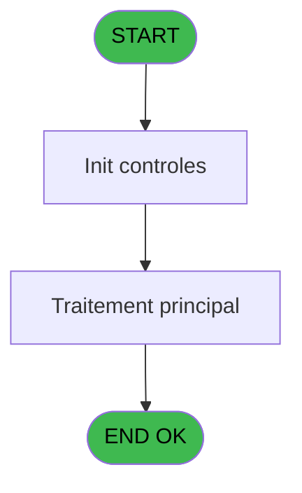
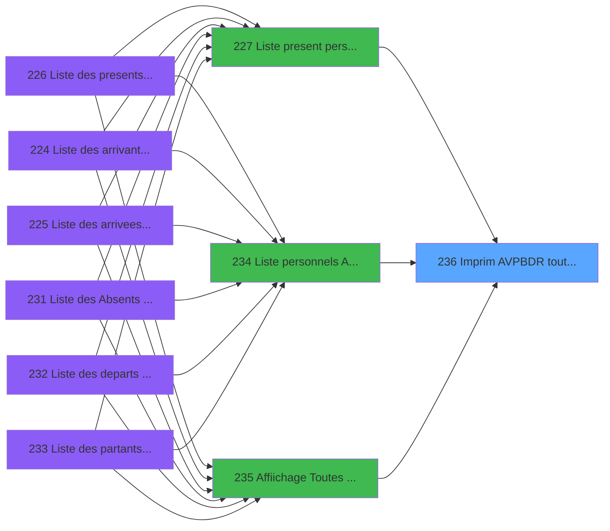

# PBP IDE 236 - Imprim AVPBDR toutes GO

> **Analyse**: Phases 1-4 2026-02-03 15:58 -> 15:58 (10s) | Assemblage 15:58
> **Pipeline**: V7.2 Enrichi
> **Structure**: 4 onglets (Resume | Ecrans | Donnees | Connexions)

<!-- TAB:Resume -->

## 1. FICHE D'IDENTITE

| Attribut | Valeur |
|----------|--------|
| Projet | PBP |
| IDE Position | 236 |
| Nom Programme | Imprim AVPBDR toutes GO |
| Fichier source | `Prg_236.xml` |
| Dossier IDE | Liste |
| Taches | 3 (0 ecrans visibles) |
| Tables modifiees | 0 |
| Programmes appeles | 0 |

## 2. DESCRIPTION FONCTIONNELLE

**Imprim AVPBDR toutes GO** assure la gestion complete de ce processus, accessible depuis [  Liste present personnel plan (IDE 227)](PBP-IDE-227.md), [  Liste personnels AVPBDR (IDE 234)](PBP-IDE-234.md), [  Affiichage Toutes AVPBDR GO (IDE 235)](PBP-IDE-235.md).

Le flux de traitement s'organise en **2 blocs fonctionnels** :

- **Traitement** (2 taches) : traitements metier divers
- **Calcul** (1 tache) : calculs de montants, stocks ou compteurs

**Logique metier** : 16 regles identifiees couvrant conditions metier.

Detail : phases du traitement

#### Phase 1 : Traitement (2 taches)

- **236** - Veuillez patienter ... **[[ECRAN]](#ecran-t1)**
- **236.2** - Ligne commentaire

#### Phase 2 : Calcul (1 tache)

- **236.1** - Calcul pied

## 3. BLOCS FONCTIONNELS

### 3.1 Traitement (2 taches)

Traitements internes.

---

#### 236 - Veuillez patienter ... [[ECRAN]](#ecran-t1)

**Role** : Traitement : Veuillez patienter ....
**Ecran** : 424 x 56 DLU (MDI) | [Voir mockup](#ecran-t1)

---

#### 236.2 - Ligne commentaire

**Role** : Traitement : Ligne commentaire.
**Variables liees** : P (v.LigneExcel)

### 3.2 Calcul (1 tache)

Calculs metier : montants, stocks, compteurs.

---

#### 236.1 - Calcul pied

**Role** : Calcul : Calcul pied.
**Variables liees** : A (>DateCalcul), Q (w0_NomPied01), R (w0_NbPied01), S (w0_NomPied02), T (w0_NbPied02)

## 5. REGLES METIER

16 regles identifiees:

### Autres (16 regles)

#### [RM-001] Si >CodeListe [C]='A' alors MlsTrans ('arrivants') sinon IF (>CodeListe [C]='V',MlsTrans ('arrivees'),IF (>CodeListe [C]='P',MlsTrans ('presents'),IF (>CodeListe [C]='D',MlsTrans ('departs'),IF (>CodeListe [C]='R',MlsTrans ('partants'),MlsTrans ('absents'))))))

| Element | Detail |
|---------|--------|
| **Condition** | `>CodeListe [C]='A'` |
| **Si vrai** | MlsTrans ('arrivants') |
| **Si faux** | IF (>CodeListe [C]='V',MlsTrans ('arrivees'),IF (>CodeListe [C]='P',MlsTrans ('presents'),IF (>CodeListe [C]='D',MlsTrans ('departs'),IF (>CodeListe [C]='R',MlsTrans ('partants'),MlsTrans ('absents')))))) |
| **Variables** | C (>CodeListe) |
| **Expression source** | Expression 15 : `IF (>CodeListe [C]='A',MlsTrans ('arrivants'),IF (>CodeListe` |
| **Exemple** | Si >CodeListe [C]='A' → MlsTrans ('arrivants') |

#### [RM-002] Si >TopListe [D]='PL' alors 'planning' sinon '')

| Element | Detail |
|---------|--------|
| **Condition** | `>TopListe [D]='PL'` |
| **Si vrai** | 'planning' |
| **Si faux** | '') |
| **Variables** | D (>TopListe) |
| **Expression source** | Expression 16 : `IF (>TopListe [D]='PL','planning','')` |
| **Exemple** | Si >TopListe [D]='PL' → 'planning'. Sinon → '') |

#### [RM-003] Si >TopListe [D]='GR' alors MlsTrans ('groupe') sinon '')

| Element | Detail |
|---------|--------|
| **Condition** | `>TopListe [D]='GR'` |
| **Si vrai** | MlsTrans ('groupe') |
| **Si faux** | '') |
| **Variables** | D (>TopListe) |
| **Expression source** | Expression 17 : `IF (>TopListe [D]='GR',MlsTrans ('groupe'),'')` |
| **Exemple** | Si >TopListe [D]='GR' → MlsTrans ('groupe'). Sinon → '') |

#### [RM-004] Si >TopListe [D]='CA' alors MlsTrans ('caisse') sinon '')

| Element | Detail |
|---------|--------|
| **Condition** | `>TopListe [D]='CA'` |
| **Si vrai** | MlsTrans ('caisse') |
| **Si faux** | '') |
| **Variables** | D (>TopListe) |
| **Expression source** | Expression 18 : `IF (>TopListe [D]='CA',MlsTrans ('caisse'),'')` |
| **Exemple** | Si >TopListe [D]='CA' → MlsTrans ('caisse'). Sinon → '') |

#### [RM-005] Si >TopListe [D]='MI' alors MlsTrans ('millesia') sinon '')

| Element | Detail |
|---------|--------|
| **Condition** | `>TopListe [D]='MI'` |
| **Si vrai** | MlsTrans ('millesia') |
| **Si faux** | '') |
| **Variables** | D (>TopListe) |
| **Expression source** | Expression 19 : `IF (>TopListe [D]='MI',MlsTrans ('millesia'),'')` |
| **Exemple** | Si >TopListe [D]='MI' → MlsTrans ('millesia'). Sinon → '') |

#### [RM-006] Si >TopListe [D]='BB' alors MlsTrans ('bebe') sinon '')

| Element | Detail |
|---------|--------|
| **Condition** | `>TopListe [D]='BB'` |
| **Si vrai** | MlsTrans ('bebe') |
| **Si faux** | '') |
| **Variables** | D (>TopListe) |
| **Expression source** | Expression 20 : `IF (>TopListe [D]='BB',MlsTrans ('bebe'),'')` |
| **Exemple** | Si >TopListe [D]='BB' → MlsTrans ('bebe'). Sinon → '') |

#### [RM-007] Si >TopListe [D]='EN' alors MlsTrans ('enfant') sinon '')

| Element | Detail |
|---------|--------|
| **Condition** | `>TopListe [D]='EN'` |
| **Si vrai** | MlsTrans ('enfant') |
| **Si faux** | '') |
| **Variables** | D (>TopListe) |
| **Expression source** | Expression 21 : `IF (>TopListe [D]='EN',MlsTrans ('enfant'),'')` |
| **Exemple** | Si >TopListe [D]='EN' → MlsTrans ('enfant'). Sinon → '') |

#### [RM-008] Si >TopListe [D]='SI' alors 'single' sinon '')

| Element | Detail |
|---------|--------|
| **Condition** | `>TopListe [D]='SI'` |
| **Si vrai** | 'single' |
| **Si faux** | '') |
| **Variables** | D (>TopListe) |
| **Expression source** | Expression 22 : `IF (>TopListe [D]='SI','single','')` |
| **Exemple** | Si >TopListe [D]='SI' → 'single'. Sinon → '') |

#### [RM-009] Si >TopListe [D]='NS' alors 'non single' sinon '')

| Element | Detail |
|---------|--------|
| **Condition** | `>TopListe [D]='NS'` |
| **Si vrai** | 'non single' |
| **Si faux** | '') |
| **Variables** | D (>TopListe) |
| **Expression source** | Expression 23 : `IF (>TopListe [D]='NS','non single','')` |
| **Exemple** | Si >TopListe [D]='NS' → 'non single'. Sinon → '') |

#### [RM-010] Si >TopListe [D]='PY' alors MlsTrans ('pays') sinon '')

| Element | Detail |
|---------|--------|
| **Condition** | `>TopListe [D]='PY'` |
| **Si vrai** | MlsTrans ('pays') |
| **Si faux** | '') |
| **Variables** | D (>TopListe) |
| **Expression source** | Expression 24 : `IF (>TopListe [D]='PY',MlsTrans ('pays'),'')` |
| **Exemple** | Si >TopListe [D]='PY' → MlsTrans ('pays'). Sinon → '') |

#### [RM-011] Si >TopListe [D]='HM' alors 'honey moon' sinon '')

| Element | Detail |
|---------|--------|
| **Condition** | `>TopListe [D]='HM'` |
| **Si vrai** | 'honey moon' |
| **Si faux** | '') |
| **Variables** | D (>TopListe) |
| **Expression source** | Expression 25 : `IF (>TopListe [D]='HM','honey moon','')` |
| **Exemple** | Si >TopListe [D]='HM' → 'honey moon'. Sinon → '') |

#### [RM-012] Si >TopListe [D]='VV' alors 'Vil/Vil' sinon '')

| Element | Detail |
|---------|--------|
| **Condition** | `>TopListe [D]='VV'` |
| **Si vrai** | 'Vil/Vil' |
| **Si faux** | '') |
| **Variables** | D (>TopListe) |
| **Expression source** | Expression 26 : `IF (>TopListe [D]='VV','Vil/Vil','')` |
| **Exemple** | Si >TopListe [D]='VV' → 'Vil/Vil'. Sinon → '') |

#### [RM-013] Si >TopListe [D]='NV' alors 'non Vil/Vil' sinon '')

| Element | Detail |
|---------|--------|
| **Condition** | `>TopListe [D]='NV'` |
| **Si vrai** | 'non Vil/Vil' |
| **Si faux** | '') |
| **Variables** | D (>TopListe) |
| **Expression source** | Expression 27 : `IF (>TopListe [D]='NV','non Vil/Vil','')` |
| **Exemple** | Si >TopListe [D]='NV' → 'non Vil/Vil'. Sinon → '') |

#### [RM-014] Si >TopListe [D]='AG' alors 'age' sinon '')

| Element | Detail |
|---------|--------|
| **Condition** | `>TopListe [D]='AG'` |
| **Si vrai** | 'age' |
| **Si faux** | '') |
| **Variables** | D (>TopListe) |
| **Expression source** | Expression 28 : `IF (>TopListe [D]='AG','age','')` |
| **Exemple** | Si >TopListe [D]='AG' → 'age'. Sinon → '') |

#### [RM-015] Si >TopListe [D]='CO' alors MlsTrans ('commentaire') sinon '')

| Element | Detail |
|---------|--------|
| **Condition** | `>TopListe [D]='CO'` |
| **Si vrai** | MlsTrans ('commentaire') |
| **Si faux** | '') |
| **Variables** | D (>TopListe) |
| **Expression source** | Expression 29 : `IF (>TopListe [D]='CO',MlsTrans ('commentaire'),'')` |
| **Exemple** | Si >TopListe [D]='CO' → MlsTrans ('commentaire'). Sinon → '') |

#### [RM-016] Traitement si VG88 AND [DE] est non nul

| Element | Detail |
|---------|--------|
| **Condition** | `VG88 AND [DE]<>0` |
| **Si vrai** | TStr([DE] |
| **Si faux** | 'HHhMMZ'),w0_NomPied05 [Y]) |
| **Variables** | Y (w0_NomPied05) |
| **Expression source** | Expression 39 : `IF(VG88 AND [DE]<>0,TStr([DE],'HHhMMZ'),w0_NomPied05 [Y])` |
| **Exemple** | Si VG88 AND [DE]<>0 → TStr([DE]. Sinon → 'HHhMMZ'),w0_NomPied05 [Y]) |

## 6. CONTEXTE

- **Appele par**: [  Liste present personnel plan (IDE 227)](PBP-IDE-227.md), [  Liste personnels AVPBDR (IDE 234)](PBP-IDE-234.md), [  Affiichage Toutes AVPBDR GO (IDE 235)](PBP-IDE-235.md)
- **Appelle**: 0 programmes | **Tables**: 4 (W:0 R:3 L:1) | **Taches**: 3 | **Expressions**: 41

<!-- TAB:Ecrans -->

## 8. ECRANS

*(Programme sans ecran visible)*

## 9. NAVIGATION

### 9.3 Structure hierarchique (3 taches)

| Position | Tache | Type | Dimensions | Bloc |
|----------|-------|------|------------|------|
| **236.1** | [**Veuillez patienter ...** (236)](#t1) [mockup](#ecran-t1) | MDI | 424x56 | Traitement |
| 236.1.1 | [Ligne commentaire (236.2)](#t3) | MDI | - | |
| **236.2** | [**Calcul pied** (236.1)](#t2) | MDI | - | Calcul |

### 9.4 Algorigramme

> **Legende**: Vert = START/END OK | Rouge = END KO | Bleu = Decisions
> *Algorigramme auto-genere. Utiliser `/algorigramme` pour une synthese metier detaillee.*

<!-- TAB:Donnees -->

## 10. TABLES

### Tables utilisees (4)

| ID | Nom | Description | Type | R | W | L | Usages |
|----|-----|-------------|------|---|---|---|--------|
| 118 | tables_imports |  | DB | R |   |   | 1 |
| 171 | commentaire______com |  | DB | R |   |   | 1 |
| 598 | tempo_ecr_previsions | Table temporaire ecran | TMP | R |   |   | 1 |
| 619 | tempo_userlist | Table temporaire ecran | TMP |   |   | L | 1 |

### Colonnes par table (2 / 3 tables avec colonnes identifiees)

Table 118 - tables_imports (R) - 1 usages

| Lettre | Variable | Acces | Type |
|--------|----------|-------|------|
| A | >DateCalcul | R | Date |
| B | >HeurePresence | R | Alpha |
| C | >CodeListe | R | Alpha |
| D | >TopListe | R | Alpha |
| E | >NomLogement | R | Alpha |
| F | >Total | R | Numeric |
| G | >NbSelect | R | Numeric |
| H | >Excel | R | Logical |
| I | >NomFichierCsv | R | Alpha |
| J | >Libellé Sélection du Solde* | R | Unicode |
| K | >Soldé,Non_soldé,Tous | R | Unicode |
| L | P.I Heure départ village | R | Logical |
| M | w0_LibelleEdition | R | Alpha |
| N | w0_f(CodeListe) | R | Alpha |
| O | w0_g(TopListe) | R | Alpha |
| P | v.LigneExcel | R | Alpha |
| Q | w0_NomPied01 | R | Alpha |
| R | w0_NbPied01 | R | Numeric |
| S | w0_NomPied02 | R | Alpha |
| T | w0_NbPied02 | R | Numeric |
| U | w0_NomPied03 | R | Alpha |
| V | w0_NbPied03 | R | Numeric |
| W | w0_NomPied04 | R | Alpha |
| X | w0_NbPied04 | R | Numeric |
| Y | w0_NomPied05 | R | Alpha |
| Z | w0_NbPied05 | R | Numeric |
| BA | w0_TotalSelect | R | Numeric |

Table 171 - commentaire______com (R) - 1 usages

*Table utilisee uniquement en Link ou aucune colonne Real identifiee dans le DataView.*

Table 598 - tempo_ecr_previsions (R) - 1 usages

| Lettre | Variable | Acces | Type |
|--------|----------|-------|------|
| A | w1_Rupture | R | Numeric |
| B | w1_TotalSelect | R | Numeric |

## 11. VARIABLES

### 11.1 Parametres entrants (1)

Variables recues du programme appelant ([  Liste present personnel plan (IDE 227)](PBP-IDE-227.md)).

| Lettre | Nom | Type | Usage dans |
|--------|-----|------|-----------|
| L | P.I Heure départ village | Logical | - |

### 11.2 Variables de session (1)

Variables persistantes pendant toute la session.

| Lettre | Nom | Type | Usage dans |
|--------|-----|------|-----------|
| P | v.LigneExcel | Alpha | 1x session |

### 11.3 Autres (25)

Variables diverses.

| Lettre | Nom | Type | Usage dans |
|--------|-----|------|-----------|
| A | >DateCalcul | Date | 1x refs |
| B | >HeurePresence | Alpha | 1x refs |
| C | >CodeListe | Alpha | 2x refs |
| D | >TopListe | Alpha | 15x refs |
| E | >NomLogement | Alpha | - |
| F | >Total | Numeric | - |
| G | >NbSelect | Numeric | - |
| H | >Excel | Logical | 2x refs |
| I | >NomFichierCsv | Alpha | 1x refs |
| J | >Libellé Sélection du Solde* | Unicode | - |
| K | >Soldé,Non_soldé,Tous | Unicode | - |
| M | w0_LibelleEdition | Alpha | - |
| N | w0_f(CodeListe) | Alpha | 1x refs |
| O | w0_g(TopListe) | Alpha | 1x refs |
| Q | w0_NomPied01 | Alpha | 1x refs |
| R | w0_NbPied01 | Numeric | - |
| S | w0_NomPied02 | Alpha | 1x refs |
| T | w0_NbPied02 | Numeric | 1x refs |
| U | w0_NomPied03 | Alpha | - |
| V | w0_NbPied03 | Numeric | 2x refs |
| W | w0_NomPied04 | Alpha | 2x refs |
| X | w0_NbPied04 | Numeric | 2x refs |
| Y | w0_NomPied05 | Alpha | 3x refs |
| Z | w0_NbPied05 | Numeric | 1x refs |
| BA | w0_TotalSelect | Numeric | - |

Toutes les 27 variables (liste complete)

| Cat | Lettre | Nom Variable | Type |
|-----|--------|--------------|------|
| P0 | **L** | P.I Heure départ village | Logical |
| V. | **P** | v.LigneExcel | Alpha |
| Autre | **A** | >DateCalcul | Date |
| Autre | **B** | >HeurePresence | Alpha |
| Autre | **C** | >CodeListe | Alpha |
| Autre | **D** | >TopListe | Alpha |
| Autre | **E** | >NomLogement | Alpha |
| Autre | **F** | >Total | Numeric |
| Autre | **G** | >NbSelect | Numeric |
| Autre | **H** | >Excel | Logical |
| Autre | **I** | >NomFichierCsv | Alpha |
| Autre | **J** | >Libellé Sélection du Solde* | Unicode |
| Autre | **K** | >Soldé,Non_soldé,Tous | Unicode |
| Autre | **M** | w0_LibelleEdition | Alpha |
| Autre | **N** | w0_f(CodeListe) | Alpha |
| Autre | **O** | w0_g(TopListe) | Alpha |
| Autre | **Q** | w0_NomPied01 | Alpha |
| Autre | **R** | w0_NbPied01 | Numeric |
| Autre | **S** | w0_NomPied02 | Alpha |
| Autre | **T** | w0_NbPied02 | Numeric |
| Autre | **U** | w0_NomPied03 | Alpha |
| Autre | **V** | w0_NbPied03 | Numeric |
| Autre | **W** | w0_NomPied04 | Alpha |
| Autre | **X** | w0_NbPied04 | Numeric |
| Autre | **Y** | w0_NomPied05 | Alpha |
| Autre | **Z** | w0_NbPied05 | Numeric |
| Autre | **BA** | w0_TotalSelect | Numeric |

## 12. EXPRESSIONS

**41 / 41 expressions decodees (100%)**

### 12.1 Repartition par type

| Type | Expressions | Regles |
|------|-------------|--------|
| CONCATENATION | 6 | 0 |
| CONDITION | 24 | 16 |
| FORMAT | 1 | 0 |
| OTHER | 8 | 0 |
| REFERENCE_VG | 1 | 0 |
| STRING | 1 | 0 |

### 12.2 Expressions cles par type

#### CONCATENATION (6 expressions)

| Type | IDE | Expression | Regle |
|------|-----|------------|-------|
| CONCATENATION | 34 | `MlsTrans ('Depart le')&' '&DStr (w0_NbPied03 [V],'DD/MM/YYYY')&' '&MlsTrans ('à')&' '&w0_NomPied04 [W]&'  '&MlsTrans ('Retour le')&'  '&DStr (w0_NbPied04 [X],'DD/MM/YYYY')&' '&MlsTrans ('à')&' '&w0_NomPied05 [Y]` | - |
| CONCATENATION | 7 | `'Nom'&VG36&'Prénom'&VG36&'Sex'&VG36&'Qualité'&VG36&'Logement'&VG36&'Pays'&VG36&'Fonction'&VG36&'Date Arrivée'&VG36&'Heure Arr'&VG36&'Date Départ'&VG36&'Heure Dept'&VG36&'B'&VG36&'F'` | - |
| CONCATENATION | 32 | `Trim (>Excel [H])&' '&IF (>CodeListe [C]='P',>HeurePresence [B]&IF (>HeurePresence [B]='','',' h'),'')` | - |
| CONCATENATION | 35 | `'- '&Str (Page (0,1),'3P0Z0')&' -'` | - |
| CONCATENATION | 31 | `MlsTrans ('Liste des')&' '&Trim (>NomFichierCsv [I])&' '&Trim (>Libellé Sélection du ... [J])&' '&MlsTrans ('le')&' '&DStr (>DateCalcul [A],'DD/MM/YYYY')` | - |
| ... | | *+1 autres* | |

#### CONDITION (24 expressions)

| Type | IDE | Expression | Regle |
|------|-----|------------|-------|
| CONDITION | 25 | `IF (>TopListe [D]='HM','honey moon','')` | [RM-011](#rm-RM-011) |
| CONDITION | 26 | `IF (>TopListe [D]='VV','Vil/Vil','')` | [RM-012](#rm-RM-012) |
| CONDITION | 23 | `IF (>TopListe [D]='NS','non single','')` | [RM-009](#rm-RM-009) |
| CONDITION | 24 | `IF (>TopListe [D]='PY',MlsTrans ('pays'),'')` | [RM-010](#rm-RM-010) |
| CONDITION | 29 | `IF (>TopListe [D]='CO',MlsTrans ('commentaire'),'')` | [RM-015](#rm-RM-015) |
| ... | | *+19 autres* | |

#### FORMAT (1 expressions)

| Type | IDE | Expression | Regle |
|------|-----|------------|-------|
| FORMAT | 8 | `w0_f(CodeListe) [N]&VG36&w0_g(TopListe) [O]&VG36&v.LigneExcel [P]&VG36&w0_NomPied01 [Q]&VG36&w0_NomPied02 [S]&VG36&w0_NbPied02 [T]&VG36&[AG]&VG36&DStr(w0_NbPied03 [V],'DD/MM/YYYY')&VG36&w0_NomPied04 [W]&VG36&
DStr(w0_NbPied04 [X],'DD/MM/YYYY')&VG36&
IF( VG88 AND [DF],TStr([DE],'HHhMMZ') ,w0_NomPied05 [Y])&VG36&w0_NbPied05 [Z]&VG36&[AB]` | - |

#### OTHER (8 expressions)

| Type | IDE | Expression | Regle |
|------|-----|------------|-------|
| OTHER | 11 | `Counter (0)` | - |
| OTHER | 9 | `IsFirstRecordCycle (0)` | - |
| OTHER | 40 | `'Heure de fin : '&IF(VG88 AND [DF], 'Libération chambre','Départ Village')` | - |
| OTHER | 37 | `[CU]` | - |
| OTHER | 2 | `'Village '&GetParam ('VILLAGE')` | - |
| ... | | *+3 autres* | |

#### REFERENCE_VG (1 expressions)

| Type | IDE | Expression | Regle |
|------|-----|------------|-------|
| REFERENCE_VG | 10 | `VG1` | - |

#### STRING (1 expressions)

| Type | IDE | Expression | Regle |
|------|-----|------------|-------|
| STRING | 3 | `Trim([DB])` | - |

### 12.3 Toutes les expressions (41)

Voir les 41 expressions

#### CONCATENATION (6)

| IDE | Expression Decodee |
|-----|-------------------|
| 35 | `'- '&Str (Page (0,1),'3P0Z0')&' -'` |
| 31 | `MlsTrans ('Liste des')&' '&Trim (>NomFichierCsv [I])&' '&Trim (>Libellé Sélection du ... [J])&' '&MlsTrans ('le')&' '&DStr (>DateCalcul [A],'DD/MM/YYYY')` |
| 33 | `MlsTrans ('Edition du')&' '&DStr (Date (),'DD/MM/YYYY')&' '&MlsTrans ('à')&' '&TStr (Time (),'HH:MM:SS')` |
| 34 | `MlsTrans ('Depart le')&' '&DStr (w0_NbPied03 [V],'DD/MM/YYYY')&' '&MlsTrans ('à')&' '&w0_NomPied04 [W]&'  '&MlsTrans ('Retour le')&'  '&DStr (w0_NbPied04 [X],'DD/MM/YYYY')&' '&MlsTrans ('à')&' '&w0_NomPied05 [Y]` |
| 7 | `'Nom'&VG36&'Prénom'&VG36&'Sex'&VG36&'Qualité'&VG36&'Logement'&VG36&'Pays'&VG36&'Fonction'&VG36&'Date Arrivée'&VG36&'Heure Arr'&VG36&'Date Départ'&VG36&'Heure Dept'&VG36&'B'&VG36&'F'` |
| 32 | `Trim (>Excel [H])&' '&IF (>CodeListe [C]='P',>HeurePresence [B]&IF (>HeurePresence [B]='','',' h'),'')` |

#### CONDITION (24)

| IDE | Expression Decodee |
|-----|-------------------|
| 15 | `IF (>CodeListe [C]='A',MlsTrans ('arrivants'),IF (>CodeListe [C]='V',MlsTrans ('arrivees'),IF (>CodeListe [C]='P',MlsTrans ('presents'),IF (>CodeListe [C]='D',MlsTrans ('departs'),IF (>CodeListe [C]='R',MlsTrans ('partants'),MlsTrans ('absents'))))))` |
| 16 | `IF (>TopListe [D]='PL','planning','')` |
| 17 | `IF (>TopListe [D]='GR',MlsTrans ('groupe'),'')` |
| 18 | `IF (>TopListe [D]='CA',MlsTrans ('caisse'),'')` |
| 19 | `IF (>TopListe [D]='MI',MlsTrans ('millesia'),'')` |
| 20 | `IF (>TopListe [D]='BB',MlsTrans ('bebe'),'')` |
| 21 | `IF (>TopListe [D]='EN',MlsTrans ('enfant'),'')` |
| 22 | `IF (>TopListe [D]='SI','single','')` |
| 23 | `IF (>TopListe [D]='NS','non single','')` |
| 24 | `IF (>TopListe [D]='PY',MlsTrans ('pays'),'')` |
| 25 | `IF (>TopListe [D]='HM','honey moon','')` |
| 26 | `IF (>TopListe [D]='VV','Vil/Vil','')` |
| 27 | `IF (>TopListe [D]='NV','non Vil/Vil','')` |
| 28 | `IF (>TopListe [D]='AG','age','')` |
| 29 | `IF (>TopListe [D]='CO',MlsTrans ('commentaire'),'')` |
| 39 | `IF(VG88 AND [DE]<>0,TStr([DE],'HHhMMZ'),w0_NomPied05 [Y])` |
| 12 | `[AI]=''` |
| 13 | `[AI]='' AND >TopListe [D]='CO'` |
| 14 | `[AI]='CIRCUIT'` |
| 30 | `>Libellé Sélection du ... [J]=''` |
| 36 | `INIGet ('[MAGIC_LOGICAL_NAMES]preview')='O'` |
| 38 | `VG44>1` |
| 41 | `[DG]='T'` |
| 6 | `Trim(>Excel [H])` |

#### FORMAT (1)

| IDE | Expression Decodee |
|-----|-------------------|
| 8 | `w0_f(CodeListe) [N]&VG36&w0_g(TopListe) [O]&VG36&v.LigneExcel [P]&VG36&w0_NomPied01 [Q]&VG36&w0_NomPied02 [S]&VG36&w0_NbPied02 [T]&VG36&[AG]&VG36&DStr(w0_NbPied03 [V],'DD/MM/YYYY')&VG36&w0_NomPied04 [W]&VG36&
DStr(w0_NbPied04 [X],'DD/MM/YYYY')&VG36&
IF( VG88 AND [DF],TStr([DE],'HHhMMZ') ,w0_NomPied05 [Y])&VG36&w0_NbPied05 [Z]&VG36&[AB]` |

#### OTHER (8)

| IDE | Expression Decodee |
|-----|-------------------|
| 1 | `GetParam ('SOCIETE')` |
| 2 | `'Village '&GetParam ('VILLAGE')` |
| 4 | `NOT([DA])` |
| 5 | `[DA]` |
| 9 | `IsFirstRecordCycle (0)` |
| 11 | `Counter (0)` |
| 37 | `[CU]` |
| 40 | `'Heure de fin : '&IF(VG88 AND [DF], 'Libération chambre','Départ Village')` |

#### REFERENCE_VG (1)

| IDE | Expression Decodee |
|-----|-------------------|
| 10 | `VG1` |

#### STRING (1)

| IDE | Expression Decodee |
|-----|-------------------|
| 3 | `Trim([DB])` |

<!-- TAB:Connexions -->

## 13. GRAPHE D'APPELS

### 13.1 Chaine depuis Main (Callers)

Main -> ... -> [  Liste present personnel plan (IDE 227)](PBP-IDE-227.md) -> **Imprim AVPBDR toutes GO (IDE 236)**

Main -> ... -> [  Liste personnels AVPBDR (IDE 234)](PBP-IDE-234.md) -> **Imprim AVPBDR toutes GO (IDE 236)**

Main -> ... -> [  Affiichage Toutes AVPBDR GO (IDE 235)](PBP-IDE-235.md) -> **Imprim AVPBDR toutes GO (IDE 236)**

### 13.2 Callers

| IDE | Nom Programme | Nb Appels |
|-----|---------------|-----------|
| [227](PBP-IDE-227.md) |   Liste present personnel plan | 2 |
| [234](PBP-IDE-234.md) |   Liste personnels AVPBDR | 2 |
| [235](PBP-IDE-235.md) |   Affiichage Toutes AVPBDR GO | 1 |

### 13.3 Callees (programmes appeles)

### 13.4 Detail Callees avec contexte

| IDE | Nom Programme | Appels | Contexte |
|-----|---------------|--------|----------|
| - | (aucun) | - | - |

## 14. RECOMMANDATIONS MIGRATION

### 14.1 Profil du programme

| Metrique | Valeur | Impact migration |
|----------|--------|-----------------|
| Lignes de logique | 162 | Programme compact |
| Expressions | 41 | Peu de logique |
| Tables WRITE | 0 | Impact faible |
| Sous-programmes | 0 | Peu de dependances |
| Ecrans visibles | 0 | Ecran unique ou traitement batch |
| Code desactive | 0.6% (1 / 162) | Code sain |
| Regles metier | 16 | Logique metier riche |

### 14.2 Plan de migration par bloc

#### Traitement (2 taches: 1 ecran, 1 traitement)

- **Strategie** : Orchestrateur avec 1 ecrans (Razor/React) et 1 traitements backend (services).
- Les ecrans deviennent des composants UI, les traitements invisibles deviennent des services injectables.
- Decomposer les taches en services unitaires testables.

#### Calcul (1 tache: 0 ecran, 1 traitement)

- **Strategie** : Services de calcul purs (Domain Services).
- Migrer la logique de calcul (stock, compteurs, montants)

### 14.3 Dependances critiques

| Dependance | Type | Appels | Impact |
|------------|------|--------|--------|

---
*Spec DETAILED generee par Pipeline V7.2 - 2026-02-03 15:58*
