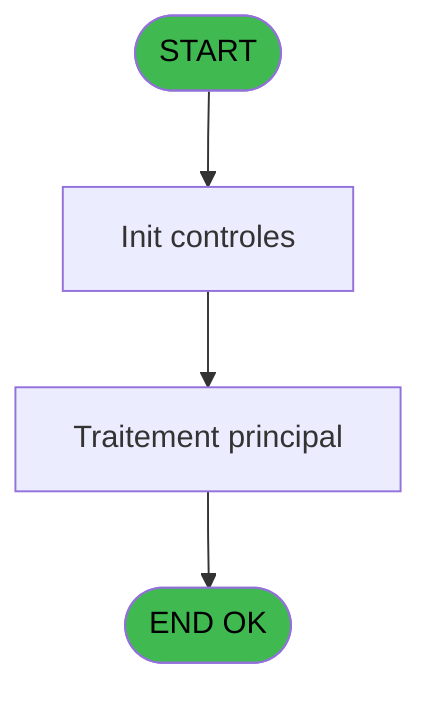
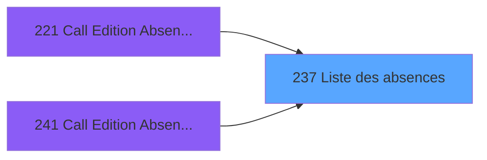
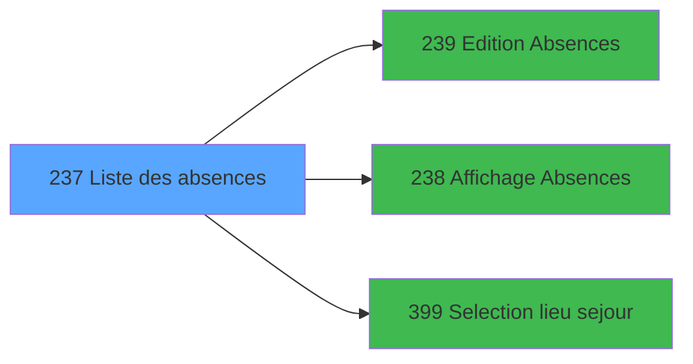

# PBP IDE 237 - Liste des absences

> **Analyse**: Phases 1-4 2026-02-03 15:58 -> 15:58 (10s) | Assemblage 15:58
> **Pipeline**: V7.2 Enrichi
> **Structure**: 4 onglets (Resume | Ecrans | Donnees | Connexions)

<!-- TAB:Resume -->

## 1. FICHE D'IDENTITE

| Attribut | Valeur |
|----------|--------|
| Projet | PBP |
| IDE Position | 237 |
| Nom Programme | Liste des absences |
| Fichier source | `Prg_237.xml` |
| Dossier IDE | Liste |
| Taches | 3 (1 ecrans visibles) |
| Tables modifiees | 0 |
| Programmes appeles | 3 |

## 2. DESCRIPTION FONCTIONNELLE

**Liste des absences** assure la gestion complete de ce processus, accessible depuis [Call Edition Absences GM (IDE 221)](PBP-IDE-221.md), [Call Edition Absences GO (IDE 241)](PBP-IDE-241.md).

Le flux de traitement s'organise en **1 blocs fonctionnels** :

- **Traitement** (3 taches) : traitements metier divers

## 3. BLOCS FONCTIONNELS

### 3.1 Traitement (3 taches)

Traitements internes.

---

#### 237 - Liste des absences [[ECRAN]](#ecran-t1)

**Role** : Traitement : Liste des absences.
**Ecran** : 594 x 0 DLU (MDI) | [Voir mockup](#ecran-t1)

---

#### 237.1 - Combo Raisons

**Role** : Traitement : Combo Raisons.
**Variables liees** : G (v.contenu combo raisons)

---

#### 237.2 - Check Absence

**Role** : Traitement : Check Absence.
**Variables liees** : F (v.raison absence), H (v.retour absence)

## 5. REGLES METIER

*(Aucune regle metier identifiee)*

## 6. CONTEXTE

- **Appele par**: [Call Edition Absences GM (IDE 221)](PBP-IDE-221.md), [Call Edition Absences GO (IDE 241)](PBP-IDE-241.md)
- **Appelle**: 3 programmes | **Tables**: 3 (W:0 R:3 L:1) | **Taches**: 3 | **Expressions**: 18

<!-- TAB:Ecrans -->

## 8. ECRANS

### 8.1 Forms visibles (1 / 3)

| # | Position | Tache | Nom | Type | Largeur | Hauteur | Bloc |
|---|----------|-------|-----|------|---------|---------|------|
| 1 | 237 | 237 | Liste des absences | MDI | 594 | 0 | Traitement |

### 8.2 Mockups Ecrans

---

#### 237 - Liste des absences
**Tache** : [237](#t1) | **Type** : MDI | **Dimensions** : 594 x 0 DLU
**Bloc** : Traitement | **Titre IDE** : Liste des absences

<!-- FORM-DATA:
{
    "width":  594,
    "vFactor":  8,
    "type":  "MDI",
    "hFactor":  8,
    "controls":  [
                     {
                         "x":  3,
                         "type":  "label",
                         "var":  "",
                         "y":  0,
                         "w":  585,
                         "fmt":  "",
                         "name":  "",
                         "h":  20,
                         "color":  "1",
                         "text":  "",
                         "parent":  null
                     },
                     {
                         "x":  6,
                         "type":  "label",
                         "var":  "",
                         "y":  23,
                         "w":  339,
                         "fmt":  "",
                         "name":  "",
                         "h":  146,
                         "color":  "195",
                         "text":  "Paramètres",
                         "parent":  null
                     },
                     {
                         "x":  405,
                         "type":  "label",
                         "var":  "",
                         "y":  23,
                         "w":  186,
                         "fmt":  "",
                         "name":  "",
                         "h":  146,
                         "color":  "",
                         "text":  "",
                         "parent":  null
                     },
                     {
                         "x":  18,
                         "type":  "label",
                         "var":  "",
                         "y":  57,
                         "w":  101,
                         "fmt":  "",
                         "name":  "",
                         "h":  9,
                         "color":  "",
                         "text":  "Date Début",
                         "parent":  5
                     },
                     {
                         "x":  18,
                         "type":  "label",
                         "var":  "",
                         "y":  83,
                         "w":  101,
                         "fmt":  "",
                         "name":  "",
                         "h":  9,
                         "color":  "",
                         "text":  "Date Fin",
                         "parent":  5
                     },
                     {
                         "x":  6,
                         "type":  "label",
                         "var":  "",
                         "y":  176,
                         "w":  585,
                         "fmt":  "",
                         "name":  "",
                         "h":  24,
                         "color":  "1",
                         "text":  "",
                         "parent":  null
                     },
                     {
                         "x":  18,
                         "type":  "label",
                         "var":  "",
                         "y":  125,
                         "w":  119,
                         "fmt":  "",
                         "name":  "",
                         "h":  9,
                         "color":  "",
                         "text":  "Lieu de séjour",
                         "parent":  5
                     },
                     {
                         "x":  151,
                         "type":  "edit",
                         "var":  "",
                         "y":  57,
                         "w":  126,
                         "fmt":  "",
                         "name":  "v.date debut",
                         "h":  10,
                         "color":  "110",
                         "text":  "",
                         "parent":  5
                     },
                     {
                         "x":  290,
                         "type":  "button",
                         "var":  "",
                         "y":  57,
                         "w":  25,
                         "fmt":  "",
                         "name":  "b.date debut",
                         "h":  10,
                         "color":  "",
                         "text":  "",
                         "parent":  5
                     },
                     {
                         "x":  151,
                         "type":  "edit",
                         "var":  "",
                         "y":  83,
                         "w":  126,
                         "fmt":  "",
                         "name":  "v.date fin",
                         "h":  10,
                         "color":  "110",
                         "text":  "",
                         "parent":  5
                     },
                     {
                         "x":  290,
                         "type":  "button",
                         "var":  "",
                         "y":  83,
                         "w":  25,
                         "fmt":  "",
                         "name":  "b.date fin",
                         "h":  10,
                         "color":  "",
                         "text":  "",
                         "parent":  5
                     },
                     {
                         "x":  17,
                         "type":  "combobox",
                         "var":  "",
                         "y":  106,
                         "w":  295,
                         "fmt":  "",
                         "name":  "v.raison absence",
                         "h":  12,
                         "color":  "110",
                         "text":  "a,b",
                         "parent":  5
                     },
                     {
                         "x":  419,
                         "type":  "button",
                         "var":  "",
                         "y":  83,
                         "w":  154,
                         "fmt":  "",
                         "name":  "b.raz",
                         "h":  18,
                         "color":  "",
                         "text":  "",
                         "parent":  6
                     },
                     {
                         "x":  419,
                         "type":  "button",
                         "var":  "",
                         "y":  104,
                         "w":  154,
                         "fmt":  "",
                         "name":  "b.ecran",
                         "h":  18,
                         "color":  "",
                         "text":  "",
                         "parent":  6
                     },
                     {
                         "x":  419,
                         "type":  "button",
                         "var":  "",
                         "y":  127,
                         "w":  154,
                         "fmt":  "",
                         "name":  "b.impression",
                         "h":  18,
                         "color":  "",
                         "text":  "",
                         "parent":  6
                     },
                     {
                         "x":  7,
                         "type":  "edit",
                         "var":  "",
                         "y":  2,
                         "w":  267,
                         "fmt":  "30",
                         "name":  "",
                         "h":  8,
                         "color":  "",
                         "text":  "",
                         "parent":  1
                     },
                     {
                         "x":  361,
                         "type":  "edit",
                         "var":  "",
                         "y":  6,
                         "w":  224,
                         "fmt":  "WWW DD MMM YYYYT",
                         "name":  "",
                         "h":  8,
                         "color":  "",
                         "text":  "",
                         "parent":  1
                     },
                     {
                         "x":  7,
                         "type":  "edit",
                         "var":  "",
                         "y":  11,
                         "w":  331,
                         "fmt":  "30",
                         "name":  "",
                         "h":  8,
                         "color":  "",
                         "text":  "",
                         "parent":  1
                     },
                     {
                         "x":  410,
                         "type":  "image",
                         "var":  "",
                         "y":  29,
                         "w":  170,
                         "fmt":  "",
                         "name":  "",
                         "h":  49,
                         "color":  "",
                         "text":  "",
                         "parent":  6
                     },
                     {
                         "x":  14,
                         "type":  "button",
                         "var":  "",
                         "y":  179,
                         "w":  154,
                         "fmt":  "\u0026Quitter",
                         "name":  "",
                         "h":  18,
                         "color":  "",
                         "text":  "",
                         "parent":  12
                     },
                     {
                         "x":  290,
                         "type":  "button",
                         "var":  "",
                         "y":  124,
                         "w":  25,
                         "fmt":  "...",
                         "name":  "b.lieu sejour",
                         "h":  10,
                         "color":  "",
                         "text":  "",
                         "parent":  5
                     },
                     {
                         "x":  218,
                         "type":  "edit",
                         "var":  "",
                         "y":  124,
                         "w":  51,
                         "fmt":  "",
                         "name":  "v.lieu de sejour",
                         "h":  10,
                         "color":  "110",
                         "text":  "",
                         "parent":  5
                     },
                     {
                         "x":  125,
                         "type":  "edit",
                         "var":  "",
                         "y":  137,
                         "w":  147,
                         "fmt":  "",
                         "name":  "nom_import",
                         "h":  10,
                         "color":  "",
                         "text":  "",
                         "parent":  5
                     },
                     {
                         "x":  419,
                         "type":  "button",
                         "var":  "",
                         "y":  148,
                         "w":  154,
                         "fmt":  "",
                         "name":  "b.Excel",
                         "h":  18,
                         "color":  "",
                         "text":  "",
                         "parent":  null
                     }
                 ],
    "taskId":  "237",
    "height":  0
}
-->

<strong>Champs : 8 champs</strong>

| Pos (x,y) | Nom | Variable | Type |
|-----------|-----|----------|------|
| 151,57 | v.date debut | - | edit |
| 151,83 | v.date fin | - | edit |
| 17,106 | v.raison absence | - | combobox |
| 7,2 | 30 | - | edit |
| 361,6 | WWW DD MMM YYYYT | - | edit |
| 7,11 | 30 | - | edit |
| 218,124 | v.lieu de sejour | - | edit |
| 125,137 | nom_import | - | edit |

<strong>Boutons : 8 boutons</strong>

| Bouton | Pos (x,y) | Action |
|--------|-----------|--------|
| b.date debut | 290,57 | Bouton fonctionnel |
| b.date fin | 290,83 | Bouton fonctionnel |
| b.raz | 419,83 | Bouton fonctionnel |
| b.ecran | 419,104 | Bouton fonctionnel |
| b.impression | 419,127 | Bouton fonctionnel |
| Quitter | 14,179 | Quitte le programme |
| ... | 290,124 | Bouton fonctionnel |
| b.Excel | 419,148 | Bouton fonctionnel |

## 9. NAVIGATION

Ecran unique: **Liste des absences**

### 9.3 Structure hierarchique (3 taches)

| Position | Tache | Type | Dimensions | Bloc |
|----------|-------|------|------------|------|
| **237.1** | [**Liste des absences** (237)](#t1) [mockup](#ecran-t1) | MDI | 594x0 | Traitement |
| 237.1.1 | [Combo Raisons (237.1)](#t2) | MDI | - | |
| 237.1.2 | [Check Absence (237.2)](#t3) | MDI | - | |

### 9.4 Algorigramme

> **Legende**: Vert = START/END OK | Rouge = END KO | Bleu = Decisions
> *Algorigramme auto-genere. Utiliser `/algorigramme` pour une synthese metier detaillee.*

<!-- TAB:Donnees -->

## 10. TABLES

### Tables utilisees (3)

| ID | Nom | Description | Type | R | W | L | Usages |
|----|-----|-------------|------|---|---|---|--------|
| 118 | tables_imports |  | DB | R |   |   | 1 |
| 366 | pms_print_param |  | DB | R |   |   | 1 |
| 732 | arc_pv_comptable |  | DB | R |   | L | 2 |

### Colonnes par table (1 / 3 tables avec colonnes identifiees)

Table 118 - tables_imports (R) - 1 usages

| Lettre | Variable | Acces | Type |
|--------|----------|-------|------|
| A | P.Qualite GM/GO | R | Unicode |
| B | v.date debut | R | Date |
| C | b.date debut | R | Alpha |
| D | v.date fin | R | Date |
| E | b.date fin | R | Alpha |
| F | v.raison absence | R | Alpha |
| G | v.contenu combo raisons | R | Alpha |
| H | v.retour absence | R | Logical |
| I | v.lieu de sejour | R | Alpha |
| J | b.raz | R | Alpha |
| K | b.ecran | R | Alpha |
| L | b.lieu sejour | R | Alpha |
| M | b.impression | R | Alpha |
| N | b.Excel | R | Alpha |
| O | b.NomFichierCsv | R | Alpha |
| P | v.retour lieu sejour | R | Logical |

Table 366 - pms_print_param (R) - 1 usages

*Table utilisee uniquement en Link ou aucune colonne Real identifiee dans le DataView.*

Table 732 - arc_pv_comptable (R/L) - 2 usages

*Table utilisee uniquement en Link ou aucune colonne Real identifiee dans le DataView.*

## 11. VARIABLES

### 11.1 Parametres entrants (1)

Variables recues du programme appelant ([Call Edition Absences GM (IDE 221)](PBP-IDE-221.md)).

| Lettre | Nom | Type | Usage dans |
|--------|-----|------|-----------|
| A | P.Qualite GM/GO | Unicode | 3x parametre entrant |

### 11.2 Variables de session (7)

Variables persistantes pendant toute la session.

| Lettre | Nom | Type | Usage dans |
|--------|-----|------|-----------|
| B | v.date debut | Date | 1x session |
| D | v.date fin | Date | - |
| F | v.raison absence | Alpha | [237](#t1), [237.2](#t3) |
| G | v.contenu combo raisons | Alpha | [237.1](#t2) |
| H | v.retour absence | Logical | - |
| I | v.lieu de sejour | Alpha | - |
| P | v.retour lieu sejour | Logical | - |

### 11.3 Autres (8)

Variables diverses.

| Lettre | Nom | Type | Usage dans |
|--------|-----|------|-----------|
| C | b.date debut | Alpha | 1x refs |
| E | b.date fin | Alpha | - |
| J | b.raz | Alpha | - |
| K | b.ecran | Alpha | - |
| L | b.lieu sejour | Alpha | - |
| M | b.impression | Alpha | - |
| N | b.Excel | Alpha | - |
| O | b.NomFichierCsv | Alpha | - |

Toutes les 16 variables (liste complete)

| Cat | Lettre | Nom Variable | Type |
|-----|--------|--------------|------|
| P0 | **A** | P.Qualite GM/GO | Unicode |
| V. | **B** | v.date debut | Date |
| V. | **D** | v.date fin | Date |
| V. | **F** | v.raison absence | Alpha |
| V. | **G** | v.contenu combo raisons | Alpha |
| V. | **H** | v.retour absence | Logical |
| V. | **I** | v.lieu de sejour | Alpha |
| V. | **P** | v.retour lieu sejour | Logical |
| Autre | **C** | b.date debut | Alpha |
| Autre | **E** | b.date fin | Alpha |
| Autre | **J** | b.raz | Alpha |
| Autre | **K** | b.ecran | Alpha |
| Autre | **L** | b.lieu sejour | Alpha |
| Autre | **M** | b.impression | Alpha |
| Autre | **N** | b.Excel | Alpha |
| Autre | **O** | b.NomFichierCsv | Alpha |

## 12. EXPRESSIONS

**18 / 18 expressions decodees (100%)**

### 12.1 Repartition par type

| Type | Expressions | Regles |
|------|-------------|--------|
| CALCULATION | 2 | 0 |
| CONSTANTE | 2 | 0 |
| FORMAT | 1 | 0 |
| DATE | 1 | 0 |
| CAST_LOGIQUE | 1 | 0 |
| CONDITION | 3 | 0 |
| REFERENCE_VG | 1 | 0 |
| OTHER | 5 | 0 |
| NEGATION | 1 | 0 |
| CONCATENATION | 1 | 0 |

### 12.2 Expressions cles par type

#### CALCULATION (2 expressions)

| Type | IDE | Expression | Regle |
|------|-----|------------|-------|
| CALCULATION | 18 | `Left ({1,6},Len (Trim ({1,6}))-1)` | - |
| CALCULATION | 2 | `P.Qualite GM/GO [A]+7` | - |

#### CONSTANTE (2 expressions)

| Type | IDE | Expression | Regle |
|------|-----|------------|-------|
| CONSTANTE | 13 | `'...'` | - |
| CONSTANTE | 9 | `''` | - |

#### FORMAT (1 expressions)

| Type | IDE | Expression | Regle |
|------|-----|------------|-------|
| FORMAT | 5 | `Translate ('%club_exportdata%')&'LISTE_ABSENCES_TEMPO_'&Trim([AI])&'_'&'_'&DStr(Date(),'YYYYMMDD')&'_'&TStr(Time(),'HHMMSS')&'.Csv'` | - |

#### DATE (1 expressions)

| Type | IDE | Expression | Regle |
|------|-----|------------|-------|
| DATE | 7 | `Date ()` | - |

#### CAST_LOGIQUE (1 expressions)

| Type | IDE | Expression | Regle |
|------|-----|------------|-------|
| CAST_LOGIQUE | 1 | `'TRUE'LOG` | - |

#### CONDITION (3 expressions)

| Type | IDE | Expression | Regle |
|------|-----|------------|-------|
| CONDITION | 14 | `NOT([AD]) AND Trim([U])<>''` | - |
| CONDITION | 15 | `VG44>1` | - |
| CONDITION | 3 | `b.date debut [C]<P.Qualite GM/GO [A]` | - |

#### REFERENCE_VG (1 expressions)

| Type | IDE | Expression | Regle |
|------|-----|------------|-------|
| REFERENCE_VG | 4 | `VG2` | - |

#### OTHER (5 expressions)

| Type | IDE | Expression | Regle |
|------|-----|------------|-------|
| OTHER | 12 | `[U]` | - |
| OTHER | 16 | `[AG]` | - |
| OTHER | 11 | `GetParam('SOCIETE')` | - |
| OTHER | 6 | `GetParam ('VILLAGE')` | - |
| OTHER | 8 | `v.raison absence [F]` | - |

#### NEGATION (1 expressions)

| Type | IDE | Expression | Regle |
|------|-----|------------|-------|
| NEGATION | 10 | `NOT (v.contenu combo raisons [G])` | - |

#### CONCATENATION (1 expressions)

| Type | IDE | Expression | Regle |
|------|-----|------------|-------|
| CONCATENATION | 17 | `Trim ({1,6})&P.Qualite GM/GO [A]&' '&Trim (v.date debut [B])&','` | - |

<!-- TAB:Connexions -->

## 13. GRAPHE D'APPELS

### 13.1 Chaine depuis Main (Callers)

Main -> ... -> [Call Edition Absences GM (IDE 221)](PBP-IDE-221.md) -> **Liste des absences (IDE 237)**

Main -> ... -> [Call Edition Absences GO (IDE 241)](PBP-IDE-241.md) -> **Liste des absences (IDE 237)**

### 13.2 Callers

| IDE | Nom Programme | Nb Appels |
|-----|---------------|-----------|
| [221](PBP-IDE-221.md) | Call Edition Absences GM | 1 |
| [241](PBP-IDE-241.md) | Call Edition Absences GO | 1 |

### 13.3 Callees (programmes appeles)

### 13.4 Detail Callees avec contexte

| IDE | Nom Programme | Appels | Contexte |
|-----|---------------|--------|----------|
| [239](PBP-IDE-239.md) | Edition Absences | 2 | Impression ticket/document |
| [238](PBP-IDE-238.md) | Affichage Absences | 1 | Affichage donnees |
| [399](PBP-IDE-399.md) | Selection lieu sejour | 1 | Selection/consultation |

## 14. RECOMMANDATIONS MIGRATION

### 14.1 Profil du programme

| Metrique | Valeur | Impact migration |
|----------|--------|-----------------|
| Lignes de logique | 91 | Programme compact |
| Expressions | 18 | Peu de logique |
| Tables WRITE | 0 | Impact faible |
| Sous-programmes | 3 | Peu de dependances |
| Ecrans visibles | 1 | Ecran unique ou traitement batch |
| Code desactive | 0% (0 / 91) | Code sain |
| Regles metier | 0 | Pas de regle identifiee |

### 14.2 Plan de migration par bloc

#### Traitement (3 taches: 1 ecran, 2 traitements)

- **Strategie** : Orchestrateur avec 1 ecrans (Razor/React) et 2 traitements backend (services).
- Les ecrans deviennent des composants UI, les traitements invisibles deviennent des services injectables.
- 3 sous-programme(s) a migrer ou a reutiliser depuis les services existants.
- Decomposer les taches en services unitaires testables.

### 14.3 Dependances critiques

| Dependance | Type | Appels | Impact |
|------------|------|--------|--------|
| [Edition Absences (IDE 239)](PBP-IDE-239.md) | Sous-programme | 2x | Haute - Impression ticket/document |
| [Selection lieu sejour (IDE 399)](PBP-IDE-399.md) | Sous-programme | 1x | Normale - Selection/consultation |
| [Affichage Absences (IDE 238)](PBP-IDE-238.md) | Sous-programme | 1x | Normale - Affichage donnees |

---
*Spec DETAILED generee par Pipeline V7.2 - 2026-02-03 15:58*
