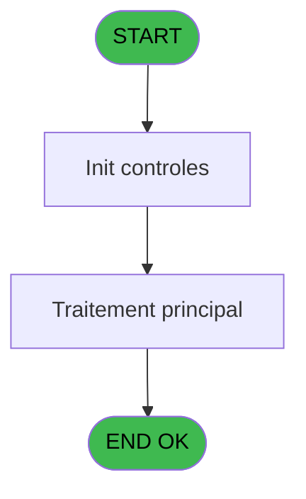
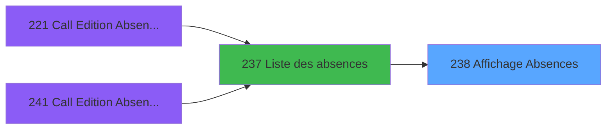
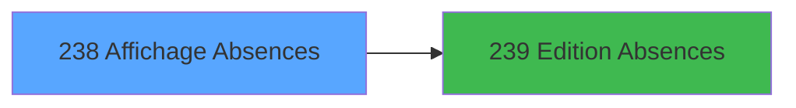

# PBP IDE 238 - Affichage Absences

> **Analyse**: Phases 1-4 2026-02-03 15:59 -> 15:59 (11s) | Assemblage 15:59
> **Pipeline**: V7.2 Enrichi
> **Structure**: 4 onglets (Resume | Ecrans | Donnees | Connexions)

<!-- TAB:Resume -->

## 1. FICHE D'IDENTITE

| Attribut | Valeur |
|----------|--------|
| Projet | PBP |
| IDE Position | 238 |
| Nom Programme | Affichage Absences |
| Fichier source | `Prg_238.xml` |
| Dossier IDE | Liste |
| Taches | 1 (1 ecrans visibles) |
| Tables modifiees | 0 |
| Programmes appeles | 1 |

## 2. DESCRIPTION FONCTIONNELLE

**Affichage Absences** assure la gestion complete de ce processus, accessible depuis [Liste des absences (IDE 237)](PBP-IDE-237.md).

Le flux de traitement s'organise en **1 blocs fonctionnels** :

- **Consultation** (1 tache) : ecrans de recherche, selection et consultation

**Logique metier** : 2 regles identifiees couvrant conditions metier, valeurs par defaut.

## 3. BLOCS FONCTIONNELS

### 3.1 Consultation (1 tache)

Ecrans de recherche et consultation.

---

#### 238 - Affichage Absences [[ECRAN]](#ecran-t1)

**Role** : Reinitialisation : Affichage Absences.
**Ecran** : 1085 x 246 DLU (MDI) | [Voir mockup](#ecran-t1)

## 5. REGLES METIER

2 regles identifiees:

### Autres (2 regles)

#### [RM-001] Valeur par defaut si Trim (p.raison [C]) est vide

| Element | Detail |
|---------|--------|
| **Condition** | `Trim (p.raison [C])=''` |
| **Si vrai** | '2'INDEX |
| **Si faux** | '3'INDEX) |
| **Variables** | C (p.raison) |
| **Expression source** | Expression 1 : `IF (Trim (p.raison [C])='','2'INDEX,'3'INDEX)` |
| **Exemple** | Si Trim (p.raison [C])='' → '2'INDEX. Sinon → '3'INDEX) |

#### [RM-002] Si [BX]='GO' alors 16.25 sinon 30.25)

| Element | Detail |
|---------|--------|
| **Condition** | `[BX]='GO'` |
| **Si vrai** | 16.25 |
| **Si faux** | 30.25) |
| **Expression source** | Expression 21 : `IF([BX]='GO',16.25,30.25)` |
| **Exemple** | Si [BX]='GO' → 16.25. Sinon → 30.25) |

## 6. CONTEXTE

- **Appele par**: [Liste des absences (IDE 237)](PBP-IDE-237.md)
- **Appelle**: 1 programmes | **Tables**: 6 (W:0 R:1 L:5) | **Taches**: 1 | **Expressions**: 22

<!-- TAB:Ecrans -->

## 8. ECRANS

### 8.1 Forms visibles (1 / 1)

| # | Position | Tache | Nom | Type | Largeur | Hauteur | Bloc |
|---|----------|-------|-----|------|---------|---------|------|
| 1 | 238 | 238 | Affichage Absences | MDI | 1085 | 246 | Consultation |

### 8.2 Mockups Ecrans

---

#### 238 - Affichage Absences
**Tache** : [238](#t1) | **Type** : MDI | **Dimensions** : 1085 x 246 DLU
**Bloc** : Consultation | **Titre IDE** : Affichage Absences

<!-- FORM-DATA:
{
    "width":  1085,
    "vFactor":  8,
    "type":  "MDI",
    "hFactor":  8,
    "controls":  [
                     {
                         "x":  2,
                         "type":  "label",
                         "var":  "",
                         "y":  0,
                         "w":  1079,
                         "fmt":  "",
                         "name":  "",
                         "h":  19,
                         "color":  "",
                         "text":  "",
                         "parent":  null
                     },
                     {
                         "x":  2,
                         "type":  "table",
                         "var":  "",
                         "name":  "",
                         "titleH":  12,
                         "color":  "110",
                         "w":  891,
                         "y":  47,
                         "fmt":  "",
                         "parent":  null,
                         "text":  "",
                         "rowH":  15,
                         "h":  114,
                         "cols":  [
                                      {
                                          "title":  "Nom",
                                          "layer":  1,
                                          "w":  188
                                      },
                                      {
                                          "title":  "Prénom",
                                          "layer":  2,
                                          "w":  130
                                      },
                                      {
                                          "title":  "Sexe",
                                          "layer":  3,
                                          "w":  55
                                      },
                                      {
                                          "title":  "Logement",
                                          "layer":  4,
                                          "w":  183
                                      },
                                      {
                                          "title":  "Pays",
                                          "layer":  5,
                                          "w":  69
                                      },
                                      {
                                          "title":  "Fonction",
                                          "layer":  6,
                                          "w":  227
                                      }
                                  ],
                         "rows":  6
                     },
                     {
                         "x":  895,
                         "type":  "label",
                         "var":  "",
                         "y":  45,
                         "w":  181,
                         "fmt":  "",
                         "name":  "",
                         "h":  167,
                         "color":  "",
                         "text":  "",
                         "parent":  null
                     },
                     {
                         "x":  15,
                         "type":  "label",
                         "var":  "",
                         "y":  159,
                         "w":  876,
                         "fmt":  "",
                         "name":  "",
                         "h":  53,
                         "color":  "",
                         "text":  "",
                         "parent":  null
                     },
                     {
                         "x":  28,
                         "type":  "label",
                         "var":  "",
                         "y":  165,
                         "w":  213,
                         "fmt":  "",
                         "name":  "",
                         "h":  42,
                         "color":  "195",
                         "text":  "Debut Absence",
                         "parent":  null
                     },
                     {
                         "x":  251,
                         "type":  "label",
                         "var":  "",
                         "y":  165,
                         "w":  216,
                         "fmt":  "",
                         "name":  "",
                         "h":  42,
                         "color":  "195",
                         "text":  "Fin Absence",
                         "parent":  null
                     },
                     {
                         "x":  479,
                         "type":  "label",
                         "var":  "",
                         "y":  165,
                         "w":  400,
                         "fmt":  "",
                         "name":  "",
                         "h":  42,
                         "color":  "195",
                         "text":  "Raison Absence",
                         "parent":  null
                     },
                     {
                         "x":  35,
                         "type":  "label",
                         "var":  "",
                         "y":  175,
                         "w":  45,
                         "fmt":  "",
                         "name":  "",
                         "h":  8,
                         "color":  "",
                         "text":  "Date",
                         "parent":  21
                     },
                     {
                         "x":  258,
                         "type":  "label",
                         "var":  "",
                         "y":  175,
                         "w":  45,
                         "fmt":  "",
                         "name":  "",
                         "h":  8,
                         "color":  "",
                         "text":  "Date",
                         "parent":  22
                     },
                     {
                         "x":  2,
                         "type":  "label",
                         "var":  "",
                         "y":  214,
                         "w":  1079,
                         "fmt":  "",
                         "name":  "",
                         "h":  24,
                         "color":  "",
                         "text":  "",
                         "parent":  null
                     },
                     {
                         "x":  2,
                         "type":  "label",
                         "var":  "",
                         "y":  22,
                         "w":  1079,
                         "fmt":  "",
                         "name":  "",
                         "h":  19,
                         "color":  "",
                         "text":  "",
                         "parent":  null
                     },
                     {
                         "x":  5,
                         "type":  "label",
                         "var":  "",
                         "y":  27,
                         "w":  131,
                         "fmt":  "",
                         "name":  "",
                         "h":  9,
                         "color":  "2",
                         "text":  "Lieu de séjour",
                         "parent":  null
                     },
                     {
                         "x":  32,
                         "type":  "edit",
                         "var":  "",
                         "y":  189,
                         "w":  123,
                         "fmt":  "",
                         "name":  "Date debut",
                         "h":  9,
                         "color":  "",
                         "text":  "",
                         "parent":  21
                     },
                     {
                         "x":  256,
                         "type":  "edit",
                         "var":  "",
                         "y":  189,
                         "w":  123,
                         "fmt":  "",
                         "name":  "Date Fin",
                         "h":  9,
                         "color":  "",
                         "text":  "",
                         "parent":  22
                     },
                     {
                         "x":  11,
                         "type":  "edit",
                         "var":  "",
                         "y":  63,
                         "w":  176,
                         "fmt":  "",
                         "name":  "gmc_nom_complet",
                         "h":  10,
                         "color":  "110",
                         "text":  "",
                         "parent":  5
                     },
                     {
                         "x":  197,
                         "type":  "edit",
                         "var":  "",
                         "y":  63,
                         "w":  120,
                         "fmt":  "",
                         "name":  "gmc_prenom_complet",
                         "h":  10,
                         "color":  "110",
                         "text":  "",
                         "parent":  5
                     },
                     {
                         "x":  328,
                         "type":  "edit",
                         "var":  "",
                         "y":  63,
                         "w":  37,
                         "fmt":  "1",
                         "name":  "",
                         "h":  10,
                         "color":  "110",
                         "text":  "",
                         "parent":  5
                     },
                     {
                         "x":  634,
                         "type":  "edit",
                         "var":  "",
                         "y":  63,
                         "w":  224,
                         "fmt":  "",
                         "name":  "",
                         "h":  10,
                         "color":  "110",
                         "text":  "",
                         "parent":  5
                     },
                     {
                         "x":  573,
                         "type":  "edit",
                         "var":  "",
                         "y":  63,
                         "w":  37,
                         "fmt":  "",
                         "name":  "gmc_code_nationalite",
                         "h":  10,
                         "color":  "110",
                         "text":  "",
                         "parent":  5
                     },
                     {
                         "x":  485,
                         "type":  "edit",
                         "var":  "",
                         "y":  188,
                         "w":  387,
                         "fmt":  "",
                         "name":  "",
                         "h":  9,
                         "color":  "",
                         "text":  "",
                         "parent":  23
                     },
                     {
                         "x":  910,
                         "type":  "button",
                         "var":  "",
                         "y":  185,
                         "w":  154,
                         "fmt":  "",
                         "name":  "b.imprime",
                         "h":  18,
                         "color":  "",
                         "text":  "",
                         "parent":  12
                     },
                     {
                         "x":  5,
                         "type":  "edit",
                         "var":  "",
                         "y":  2,
                         "w":  331,
                         "fmt":  "30",
                         "name":  "",
                         "h":  8,
                         "color":  "",
                         "text":  "",
                         "parent":  1
                     },
                     {
                         "x":  808,
                         "type":  "edit",
                         "var":  "",
                         "y":  6,
                         "w":  265,
                         "fmt":  "WWW DD MMM YYYYT",
                         "name":  "",
                         "h":  8,
                         "color":  "",
                         "text":  "",
                         "parent":  1
                     },
                     {
                         "x":  5,
                         "type":  "edit",
                         "var":  "",
                         "y":  10,
                         "w":  331,
                         "fmt":  "30",
                         "name":  "",
                         "h":  8,
                         "color":  "",
                         "text":  "",
                         "parent":  null
                     },
                     {
                         "x":  381,
                         "type":  "edit",
                         "var":  "",
                         "y":  63,
                         "w":  171,
                         "fmt":  "U6 U7",
                         "name":  "",
                         "h":  10,
                         "color":  "110",
                         "text":  "",
                         "parent":  5
                     },
                     {
                         "x":  902,
                         "type":  "image",
                         "var":  "",
                         "y":  66,
                         "w":  165,
                         "fmt":  "",
                         "name":  "",
                         "h":  50,
                         "color":  "",
                         "text":  "",
                         "parent":  12
                     },
                     {
                         "x":  12,
                         "type":  "button",
                         "var":  "",
                         "y":  217,
                         "w":  154,
                         "fmt":  "\u0026Quitter",
                         "name":  "",
                         "h":  18,
                         "color":  "",
                         "text":  "",
                         "parent":  29
                     },
                     {
                         "x":  197,
                         "type":  "edit",
                         "var":  "",
                         "y":  27,
                         "w":  224,
                         "fmt":  "",
                         "name":  "nom_import",
                         "h":  9,
                         "color":  "2",
                         "text":  "",
                         "parent":  null
                     }
                 ],
    "taskId":  "238",
    "height":  246
}
-->

<strong>Champs : 13 champs</strong>

| Pos (x,y) | Nom | Variable | Type |
|-----------|-----|----------|------|
| 32,189 | Date debut | - | edit |
| 256,189 | Date Fin | - | edit |
| 11,63 | gmc_nom_complet | - | edit |
| 197,63 | gmc_prenom_complet | - | edit |
| 328,63 | 1 | - | edit |
| 634,63 | (sans nom) | - | edit |
| 573,63 | gmc_code_nationalite | - | edit |
| 485,188 | (sans nom) | - | edit |
| 5,2 | 30 | - | edit |
| 808,6 | WWW DD MMM YYYYT | - | edit |
| 5,10 | 30 | - | edit |
| 381,63 | U6 U7 | - | edit |
| 197,27 | nom_import | - | edit |

<strong>Boutons : 2 boutons</strong>

| Bouton | Pos (x,y) | Action |
|--------|-----------|--------|
| b.imprime | 910,185 | Lance l'impression |
| Quitter | 12,217 | Quitte le programme |

## 9. NAVIGATION

Ecran unique: **Affichage Absences**

### 9.3 Structure hierarchique (1 tache)

| Position | Tache | Type | Dimensions | Bloc |
|----------|-------|------|------------|------|
| **238.1** | [**Affichage Absences** (238)](#t1) [mockup](#ecran-t1) | MDI | 1085x246 | Consultation |

### 9.4 Algorigramme

> **Legende**: Vert = START/END OK | Rouge = END KO | Bleu = Decisions
> *Algorigramme auto-genere. Utiliser `/algorigramme` pour une synthese metier detaillee.*

<!-- TAB:Donnees -->

## 10. TABLES

### Tables utilisees (6)

| ID | Nom | Description | Type | R | W | L | Usages |
|----|-----|-------------|------|---|---|---|--------|
| 31 | gm-complet_______gmc |  | DB | R |   |   | 1 |
| 34 | hebergement______heb | Hebergement (chambres) | DB |   |   | L | 1 |
| 35 | personnel_go______go |  | DB |   |   | L | 1 |
| 118 | tables_imports |  | DB |   |   | L | 1 |
| 366 | pms_print_param |  | DB |   |   | L | 1 |
| 732 | arc_pv_comptable |  | DB |   |   | L | 1 |

### Colonnes par table (1 / 1 tables avec colonnes identifiees)

Table 31 - gm-complet_______gmc (R) - 1 usages

| Lettre | Variable | Acces | Type |
|--------|----------|-------|------|
| A | p.date debut | R | Date |
| B | p.date fin | R | Date |
| C | p.raison | R | Alpha |
| D | P Lieu de sejour | R | Alpha |
| E | P.Qualite GM/GO | R | Unicode |
| F | b.imprime | R | Alpha |

## 11. VARIABLES

### 11.1 Parametres entrants (5)

Variables recues du programme appelant ([Liste des absences (IDE 237)](PBP-IDE-237.md)).

| Lettre | Nom | Type | Usage dans |
|--------|-----|------|-----------|
| A | p.date debut | Date | 1x parametre entrant |
| B | p.date fin | Date | 1x parametre entrant |
| C | p.raison | Alpha | 2x parametre entrant |
| D | P Lieu de sejour | Alpha | 1x parametre entrant |
| E | P.Qualite GM/GO | Unicode | 1x parametre entrant |

### 11.2 Autres (1)

Variables diverses.

| Lettre | Nom | Type | Usage dans |
|--------|-----|------|-----------|
| F | b.imprime | Alpha | 1x refs |

## 12. EXPRESSIONS

**22 / 22 expressions decodees (100%)**

### 12.1 Repartition par type

| Type | Expressions | Regles |
|------|-------------|--------|
| CONDITION | 9 | 2 |
| CONSTANTE | 1 | 0 |
| DATE | 1 | 0 |
| OTHER | 9 | 0 |
| REFERENCE_VG | 1 | 0 |
| CONCATENATION | 1 | 0 |

### 12.2 Expressions cles par type

#### CONDITION (9 expressions)

| Type | IDE | Expression | Regle |
|------|-----|------------|-------|
| CONDITION | 21 | `IF([BX]='GO',16.25,30.25)` | [RM-002](#rm-RM-002) |
| CONDITION | 1 | `IF (Trim (p.raison [C])='','2'INDEX,'3'INDEX)` | [RM-001](#rm-RM-001) |
| CONDITION | 17 | `VG44>1` | - |
| CONDITION | 20 | `[BX]='GO'` | - |
| CONDITION | 3 | `CndRange (Trim (p.raison [C])<>'',p.raison [C])` | - |
| ... | | *+4 autres* | |

#### CONSTANTE (1 expressions)

| Type | IDE | Expression | Regle |
|------|-----|------------|-------|
| CONSTANTE | 9 | `'H'` | - |

#### DATE (1 expressions)

| Type | IDE | Expression | Regle |
|------|-----|------------|-------|
| DATE | 13 | `Date ()` | - |

#### OTHER (9 expressions)

| Type | IDE | Expression | Regle |
|------|-----|------------|-------|
| OTHER | 12 | `GetParam ('VILLAGE')` | - |
| OTHER | 10 | `[I]` | - |
| OTHER | 18 | `[BX]` | - |
| OTHER | 16 | `[BI]` | - |
| OTHER | 8 | `[H]` | - |
| ... | | *+4 autres* | |

#### REFERENCE_VG (1 expressions)

| Type | IDE | Expression | Regle |
|------|-----|------------|-------|
| REFERENCE_VG | 11 | `VG2` | - |

#### CONCATENATION (1 expressions)

| Type | IDE | Expression | Regle |
|------|-----|------------|-------|
| CONCATENATION | 14 | `[Y]&[Z]&[AA]` | - |

### 12.3 Toutes les expressions (22)

Voir les 22 expressions

#### CONDITION (9)

| IDE | Expression Decodee |
|-----|-------------------|
| 1 | `IF (Trim (p.raison [C])='','2'INDEX,'3'INDEX)` |
| 19 | `CASE([CG],'Mr','H','Me','F','')` |
| 21 | `IF([BX]='GO',16.25,30.25)` |
| 22 | `IF([BX]='GO',23.5,37.5)` |
| 2 | `Range ([G],p.date debut [A],p.date fin [B]) OR Range ([H],p.date debut [A],p.date fin [B]) OR [G]<p.date debut [A] AND [H]>p.date fin [B]` |
| 15 | `CndRange([BI]<>'',[BI])` |
| 17 | `VG44>1` |
| 20 | `[BX]='GO'` |
| 3 | `CndRange (Trim (p.raison [C])<>'',p.raison [C])` |

#### CONSTANTE (1)

| IDE | Expression Decodee |
|-----|-------------------|
| 9 | `'H'` |

#### DATE (1)

| IDE | Expression Decodee |
|-----|-------------------|
| 13 | `Date ()` |

#### OTHER (9)

| IDE | Expression Decodee |
|-----|-------------------|
| 4 | `P Lieu de sejour [D]` |
| 5 | `P.Qualite GM/GO [E]` |
| 6 | `b.imprime [F]` |
| 7 | `[G]` |
| 8 | `[H]` |
| 10 | `[I]` |
| 12 | `GetParam ('VILLAGE')` |
| 16 | `[BI]` |
| 18 | `[BX]` |

#### REFERENCE_VG (1)

| IDE | Expression Decodee |
|-----|-------------------|
| 11 | `VG2` |

#### CONCATENATION (1)

| IDE | Expression Decodee |
|-----|-------------------|
| 14 | `[Y]&[Z]&[AA]` |

<!-- TAB:Connexions -->

## 13. GRAPHE D'APPELS

### 13.1 Chaine depuis Main (Callers)

Main -> ... -> [Liste des absences (IDE 237)](PBP-IDE-237.md) -> **Affichage Absences (IDE 238)**

### 13.2 Callers

| IDE | Nom Programme | Nb Appels |
|-----|---------------|-----------|
| [237](PBP-IDE-237.md) | Liste des absences | 1 |

### 13.3 Callees (programmes appeles)

### 13.4 Detail Callees avec contexte

| IDE | Nom Programme | Appels | Contexte |
|-----|---------------|--------|----------|
| [239](PBP-IDE-239.md) | Edition Absences | 1 | Impression ticket/document |

## 14. RECOMMANDATIONS MIGRATION

### 14.1 Profil du programme

| Metrique | Valeur | Impact migration |
|----------|--------|-----------------|
| Lignes de logique | 57 | Programme compact |
| Expressions | 22 | Peu de logique |
| Tables WRITE | 0 | Impact faible |
| Sous-programmes | 1 | Peu de dependances |
| Ecrans visibles | 1 | Ecran unique ou traitement batch |
| Code desactive | 0% (0 / 57) | Code sain |
| Regles metier | 2 | Quelques regles a preserver |

### 14.2 Plan de migration par bloc

#### Consultation (1 tache: 1 ecran, 0 traitement)

- **Strategie** : Composants de recherche/selection en modales.
- 1 ecran : Affichage Absences

### 14.3 Dependances critiques

| Dependance | Type | Appels | Impact |
|------------|------|--------|--------|
| [Edition Absences (IDE 239)](PBP-IDE-239.md) | Sous-programme | 1x | Normale - Impression ticket/document |

---
*Spec DETAILED generee par Pipeline V7.2 - 2026-02-03 15:59*
