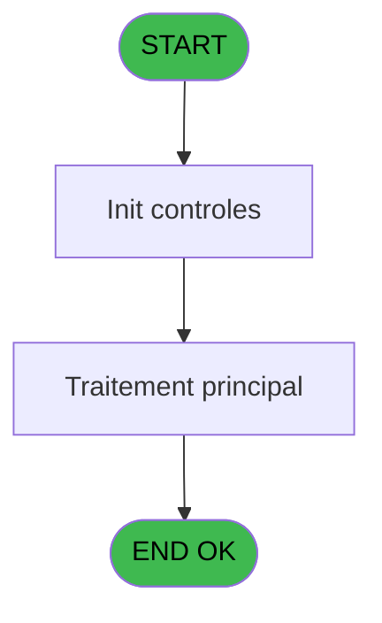
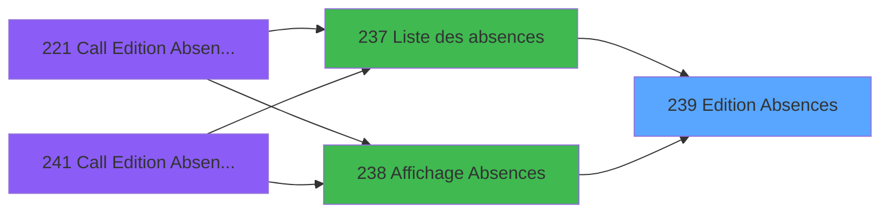

# PBP IDE 239 - Edition Absences

> **Analyse**: Phases 1-4 2026-02-03 15:59 -> 15:59 (11s) | Assemblage 15:59
> **Pipeline**: V7.2 Enrichi
> **Structure**: 4 onglets (Resume | Ecrans | Donnees | Connexions)

<!-- TAB:Resume -->

## 1. FICHE D'IDENTITE

| Attribut | Valeur |
|----------|--------|
| Projet | PBP |
| IDE Position | 239 |
| Nom Programme | Edition Absences |
| Fichier source | `Prg_239.xml` |
| Dossier IDE | Liste |
| Taches | 1 (0 ecrans visibles) |
| Tables modifiees | 0 |
| Programmes appeles | 0 |

## 2. DESCRIPTION FONCTIONNELLE

**Edition Absences** assure la gestion complete de ce processus, accessible depuis [Liste des absences (IDE 237)](PBP-IDE-237.md), [Affichage Absences (IDE 238)](PBP-IDE-238.md).

Le flux de traitement s'organise en **1 blocs fonctionnels** :

- **Impression** (1 tache) : generation de tickets et documents

**Logique metier** : 1 regles identifiees couvrant valeurs par defaut.

## 3. BLOCS FONCTIONNELS

### 3.1 Impression (1 tache)

Generation des documents et tickets.

---

#### 239 - Edition Absences [[ECRAN]](#ecran-t1)

**Role** : Generation du document : Edition Absences.
**Ecran** : 373 x 28 DLU (MDI) | [Voir mockup](#ecran-t1)

## 5. REGLES METIER

1 regles identifiees:

### Autres (1 regles)

#### [RM-001] Valeur par defaut si Trim (p.raison [C]) est vide

| Element | Detail |
|---------|--------|
| **Condition** | `Trim (p.raison [C])=''` |
| **Si vrai** | '2'INDEX |
| **Si faux** | '3'INDEX) |
| **Variables** | C (p.raison) |
| **Expression source** | Expression 1 : `IF (Trim (p.raison [C])='','2'INDEX,'3'INDEX)` |
| **Exemple** | Si Trim (p.raison [C])='' → '2'INDEX. Sinon → '3'INDEX) |

## 6. CONTEXTE

- **Appele par**: [Liste des absences (IDE 237)](PBP-IDE-237.md), [Affichage Absences (IDE 238)](PBP-IDE-238.md)
- **Appelle**: 0 programmes | **Tables**: 6 (W:0 R:1 L:5) | **Taches**: 1 | **Expressions**: 30

<!-- TAB:Ecrans -->

## 8. ECRANS

*(Programme sans ecran visible)*

## 9. NAVIGATION

### 9.3 Structure hierarchique (1 tache)

| Position | Tache | Type | Dimensions | Bloc |
|----------|-------|------|------------|------|
| **239.1** | [**Edition Absences** (239)](#t1) [mockup](#ecran-t1) | MDI | 373x28 | Impression |

### 9.4 Algorigramme

> **Legende**: Vert = START/END OK | Rouge = END KO | Bleu = Decisions
> *Algorigramme auto-genere. Utiliser `/algorigramme` pour une synthese metier detaillee.*

<!-- TAB:Donnees -->

## 10. TABLES

### Tables utilisees (6)

| ID | Nom | Description | Type | R | W | L | Usages |
|----|-----|-------------|------|---|---|---|--------|
| 31 | gm-complet_______gmc |  | DB | R |   |   | 1 |
| 34 | hebergement______heb | Hebergement (chambres) | DB |   |   | L | 1 |
| 35 | personnel_go______go |  | DB |   |   | L | 1 |
| 118 | tables_imports |  | DB |   |   | L | 1 |
| 366 | pms_print_param |  | DB |   |   | L | 1 |
| 732 | arc_pv_comptable |  | DB |   |   | L | 1 |

### Colonnes par table (1 / 1 tables avec colonnes identifiees)

Table 31 - gm-complet_______gmc (R) - 1 usages

| Lettre | Variable | Acces | Type |
|--------|----------|-------|------|
| A | p.date debut | R | Date |
| B | p.date fin | R | Date |
| C | p.raison | R | Alpha |
| D | p.lieu de sejour | R | Alpha |
| E | p.Excel | R | Logical |
| F | p.NomFichierCsv | R | Alpha |
| G | p.Qualite GM/GO | R | Unicode |
| H | v.LigneExcel | R | Alpha |

## 11. VARIABLES

### 11.1 Parametres entrants (7)

Variables recues du programme appelant ([Liste des absences (IDE 237)](PBP-IDE-237.md)).

| Lettre | Nom | Type | Usage dans |
|--------|-----|------|-----------|
| A | p.date debut | Date | 2x parametre entrant |
| B | p.date fin | Date | 2x parametre entrant |
| C | p.raison | Alpha | 2x parametre entrant |
| D | p.lieu de sejour | Alpha | 1x parametre entrant |
| E | p.Excel | Logical | 1x parametre entrant |
| F | p.NomFichierCsv | Alpha | 1x parametre entrant |
| G | p.Qualite GM/GO | Unicode | 3x parametre entrant |

### 11.2 Variables de session (1)

Variables persistantes pendant toute la session.

| Lettre | Nom | Type | Usage dans |
|--------|-----|------|-----------|
| H | v.LigneExcel | Alpha | 3x session |

## 12. EXPRESSIONS

**30 / 30 expressions decodees (100%)**

### 12.1 Repartition par type

| Type | Expressions | Regles |
|------|-------------|--------|
| CONCATENATION | 5 | 0 |
| CONDITION | 8 | 5 |
| CONSTANTE | 1 | 0 |
| FORMAT | 1 | 0 |
| OTHER | 13 | 0 |
| NEGATION | 1 | 0 |
| STRING | 1 | 0 |

### 12.2 Expressions cles par type

#### CONCATENATION (5 expressions)

| Type | IDE | Expression | Regle |
|------|-----|------------|-------|
| CONCATENATION | 8 | `'Nom'&VG36&'Prénom'&VG36&'Sex'&VG36&'Type Hebergement'&VG36&'Nom Logment'&VG36&'Nationalité'&IF([BR]='GO',VG36&'Fonction','')&VG36&'Date Début'&VG36&'date Fin'&VG36&'Raison'` | - |
| CONCATENATION | 17 | `[Y]&[Z]&[AA]` | - |
| CONCATENATION | 19 | `MlsTrans ('Liste des absences temporaires du')&' '&DStr (p.date debut [A],'DD/MM/YYYY')&' '&MlsTrans ('au')&' '&DStr (p.date fin [B],'DD/MM/YYYY')` | - |
| CONCATENATION | 24 | `'- '&Str (Page (0,1),'3P0')&' -'` | - |
| CONCATENATION | 18 | `MlsTrans ('Edition du')&' '&DStr (Date (),'DD/MM/YYYY')&' '&MlsTrans ('à')&' '&TStr (Time (),'HH:MM:SS')` | - |

#### CONDITION (8 expressions)

| Type | IDE | Expression | Regle |
|------|-----|------------|-------|
| CONDITION | 1 | `IF (Trim (p.raison [C])='','2'INDEX,'3'INDEX)` | [RM-001](#rm-RM-001) |
| CONDITION | 27 | `VG44>1 AND NOT [BN]` | - |
| CONDITION | 30 | `[BR]='GO'` | - |
| CONDITION | 3 | `CndRange (Trim (p.raison [C])<>'',p.raison [C])` | - |
| CONDITION | 26 | `VG44>1` | - |
| ... | | *+3 autres* | |

#### CONSTANTE (1 expressions)

| Type | IDE | Expression | Regle |
|------|-----|------------|-------|
| CONSTANTE | 15 | `'H'` | - |

#### FORMAT (1 expressions)

| Type | IDE | Expression | Regle |
|------|-----|------------|-------|
| FORMAT | 9 | `Trim([BW])&VG36&Trim([BX])&VG36&ExpCalc('29'EXP)&VG36&[W]&[X]&VG36&[Y]&[Z]&[AA]&VG36&Trim([BZ])&IF([BR]='GO',VG36&Trim([P]),'')&VG36&DStr(p.Qualite GM/GO [G],'DD/MM/YYYY')&VG36&DStr(v.LigneExcel [H],'DD/MM/YYYY')&VG36&Trim([AC])` | - |

#### OTHER (13 expressions)

| Type | IDE | Expression | Regle |
|------|-----|------------|-------|
| OTHER | 21 | `[W]&[X]` | - |
| OTHER | 20 | `[I]` | - |
| OTHER | 16 | `GetParam ('VILLAGE')` | - |
| OTHER | 28 | `[BR]` | - |
| OTHER | 25 | `[BG]` | - |
| ... | | *+8 autres* | |

#### NEGATION (1 expressions)

| Type | IDE | Expression | Regle |
|------|-----|------------|-------|
| NEGATION | 6 | `NOT [BN]` | - |

#### STRING (1 expressions)

| Type | IDE | Expression | Regle |
|------|-----|------------|-------|
| STRING | 5 | `Trim([BO])` | - |

### 12.3 Toutes les expressions (30)

Voir les 30 expressions

#### CONCATENATION (5)

| IDE | Expression Decodee |
|-----|-------------------|
| 24 | `'- '&Str (Page (0,1),'3P0')&' -'` |
| 18 | `MlsTrans ('Edition du')&' '&DStr (Date (),'DD/MM/YYYY')&' '&MlsTrans ('à')&' '&TStr (Time (),'HH:MM:SS')` |
| 19 | `MlsTrans ('Liste des absences temporaires du')&' '&DStr (p.date debut [A],'DD/MM/YYYY')&' '&MlsTrans ('au')&' '&DStr (p.date fin [B],'DD/MM/YYYY')` |
| 8 | `'Nom'&VG36&'Prénom'&VG36&'Sex'&VG36&'Type Hebergement'&VG36&'Nom Logment'&VG36&'Nationalité'&IF([BR]='GO',VG36&'Fonction','')&VG36&'Date Début'&VG36&'date Fin'&VG36&'Raison'` |
| 17 | `[Y]&[Z]&[AA]` |

#### CONDITION (8)

| IDE | Expression Decodee |
|-----|-------------------|
| 1 | `IF (Trim (p.raison [C])='','2'INDEX,'3'INDEX)` |
| 29 | `CASE([BY],'Mr','H','Me','F','')` |
| 2 | `Range (p.Qualite GM/GO [G],p.date debut [A],p.date fin [B]) OR Range (v.LigneExcel [H],p.date debut [A],p.date fin [B]) OR p.Qualite GM/GO [G]<p.date debut [A] AND v.LigneExcel [H]>p.date fin [B]` |
| 22 | `INIGet ('[MAGIC_LOGICAL_NAMES]preview')='O'` |
| 26 | `VG44>1` |
| 27 | `VG44>1 AND NOT [BN]` |
| 30 | `[BR]='GO'` |
| 3 | `CndRange (Trim (p.raison [C])<>'',p.raison [C])` |

#### CONSTANTE (1)

| IDE | Expression Decodee |
|-----|-------------------|
| 15 | `'H'` |

#### FORMAT (1)

| IDE | Expression Decodee |
|-----|-------------------|
| 9 | `Trim([BW])&VG36&Trim([BX])&VG36&ExpCalc('29'EXP)&VG36&[W]&[X]&VG36&[Y]&[Z]&[AA]&VG36&Trim([BZ])&IF([BR]='GO',VG36&Trim([P]),'')&VG36&DStr(p.Qualite GM/GO [G],'DD/MM/YYYY')&VG36&DStr(v.LigneExcel [H],'DD/MM/YYYY')&VG36&Trim([AC])` |

#### OTHER (13)

| IDE | Expression Decodee |
|-----|-------------------|
| 4 | `IsFirstRecordCycle (0)` |
| 7 | `[BN]` |
| 10 | `p.lieu de sejour [D]` |
| 11 | `p.Excel [E]` |
| 12 | `p.NomFichierCsv [F]` |
| 13 | `p.Qualite GM/GO [G]` |
| 14 | `v.LigneExcel [H]` |
| 16 | `GetParam ('VILLAGE')` |
| 20 | `[I]` |
| 21 | `[W]&[X]` |
| 23 | `Counter (0)` |
| 25 | `[BG]` |
| 28 | `[BR]` |

#### NEGATION (1)

| IDE | Expression Decodee |
|-----|-------------------|
| 6 | `NOT [BN]` |

#### STRING (1)

| IDE | Expression Decodee |
|-----|-------------------|
| 5 | `Trim([BO])` |

<!-- TAB:Connexions -->

## 13. GRAPHE D'APPELS

### 13.1 Chaine depuis Main (Callers)

Main -> ... -> [Liste des absences (IDE 237)](PBP-IDE-237.md) -> **Edition Absences (IDE 239)**

Main -> ... -> [Affichage Absences (IDE 238)](PBP-IDE-238.md) -> **Edition Absences (IDE 239)**

### 13.2 Callers

| IDE | Nom Programme | Nb Appels |
|-----|---------------|-----------|
| [237](PBP-IDE-237.md) | Liste des absences | 2 |
| [238](PBP-IDE-238.md) | Affichage Absences | 1 |

### 13.3 Callees (programmes appeles)

### 13.4 Detail Callees avec contexte

| IDE | Nom Programme | Appels | Contexte |
|-----|---------------|--------|----------|
| - | (aucun) | - | - |

## 14. RECOMMANDATIONS MIGRATION

### 14.1 Profil du programme

| Metrique | Valeur | Impact migration |
|----------|--------|-----------------|
| Lignes de logique | 68 | Programme compact |
| Expressions | 30 | Peu de logique |
| Tables WRITE | 0 | Impact faible |
| Sous-programmes | 0 | Peu de dependances |
| Ecrans visibles | 0 | Ecran unique ou traitement batch |
| Code desactive | 0% (0 / 68) | Code sain |
| Regles metier | 1 | Quelques regles a preserver |

### 14.2 Plan de migration par bloc

#### Impression (1 tache: 1 ecran, 0 traitement)

- **Strategie** : Templates HTML -> PDF via wkhtmltopdf ou Puppeteer.
- `PrintService` injectable avec choix imprimante

### 14.3 Dependances critiques

| Dependance | Type | Appels | Impact |
|------------|------|--------|--------|

---
*Spec DETAILED generee par Pipeline V7.2 - 2026-02-03 15:59*
