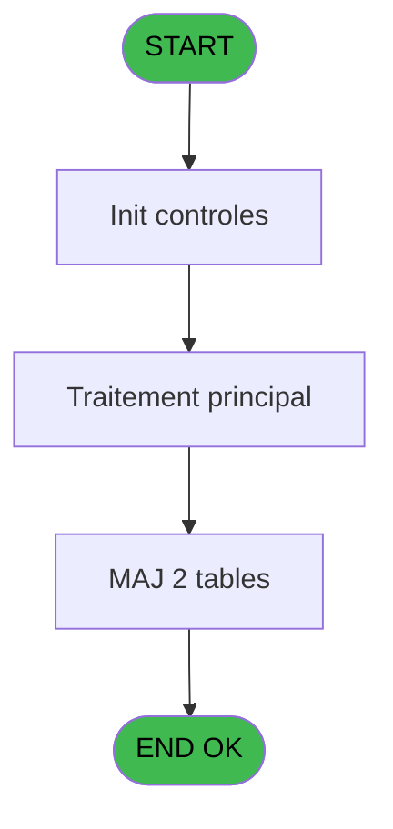

# PBP IDE 240 - Creat 589 634 tempo presta=V2

> **Analyse**: Phases 1-4 2026-02-03 15:59 -> 15:59 (12s) | Assemblage 15:59
> **Pipeline**: V7.2 Enrichi
> **Structure**: 4 onglets (Resume | Ecrans | Donnees | Connexions)

<!-- TAB:Resume -->

## 1. FICHE D'IDENTITE

| Attribut | Valeur |
|----------|--------|
| Projet | PBP |
| IDE Position | 240 |
| Nom Programme | Creat 589 634 tempo presta=V2 |
| Fichier source | `Prg_240.xml` |
| Dossier IDE | Liste |
| Taches | 3 (1 ecrans visibles) |
| Tables modifiees | 2 |
| Programmes appeles | 0 |
| :warning: Statut | **ORPHELIN_POTENTIEL** |

## 2. DESCRIPTION FONCTIONNELLE

**Creat 589 634 tempo presta=V2** assure la gestion complete de ce processus.

Le flux de traitement s'organise en **2 blocs fonctionnels** :

- **Traitement** (2 taches) : traitements metier divers
- **Creation** (1 tache) : insertion d'enregistrements en base (mouvements, prestations)

**Donnees modifiees** : 2 tables en ecriture (tempo_chambre_client, tempo_users).

**Logique metier** : 2 regles identifiees couvrant conditions metier.

Detail : phases du traitement

#### Phase 1 : Traitement (2 taches)

- **240** - Veuillez patienter ... **[[ECRAN]](#ecran-t1)**
- **240.1** - Honey moon

#### Phase 2 : Creation (1 tache)

- **240.2** - Creation tempo

#### Tables impactees

| Table | Operations | Role metier |
|-------|-----------|-------------|
| tempo_users | **W**/L (2 usages) | Table temporaire ecran |
| tempo_chambre_client | **W**/L (2 usages) | Table temporaire ecran |

## 3. BLOCS FONCTIONNELS

### 3.1 Traitement (2 taches)

Traitements internes.

---

#### 240 - Veuillez patienter ... [[ECRAN]](#ecran-t1)

**Role** : Traitement : Veuillez patienter ....
**Ecran** : 424 x 56 DLU (MDI) | [Voir mockup](#ecran-t1)

---

#### 240.1 - Honey moon

**Role** : Traitement : Honey moon.

### 3.2 Creation (1 tache)

Insertion de nouveaux enregistrements en base.

---

#### 240.2 - Creation tempo

**Role** : Creation d'enregistrement : Creation tempo.

## 5. REGLES METIER

2 regles identifiees:

### Autres (2 regles)

#### [RM-001] Traitement si VG48 est renseigne

| Element | Detail |
|---------|--------|
| **Condition** | `VG48<>''` |
| **Si vrai** | VG48 |
| **Si faux** | 'C') |
| **Expression source** | Expression 2 : `IF(VG48<>'',VG48,'C')` |
| **Exemple** | Si VG48<>'' → VG48. Sinon → 'C') |

#### [RM-002] Si [S]='H' alors 'M' sinon 'Me')

| Element | Detail |
|---------|--------|
| **Condition** | `[S]='H'` |
| **Si vrai** | 'M' |
| **Si faux** | 'Me') |
| **Expression source** | Expression 22 : `IF ([S]='H','M','Me')` |
| **Exemple** | Si [S]='H' → 'M'. Sinon → 'Me') |

## 6. CONTEXTE

- **Appele par**: (aucun)
- **Appelle**: 0 programmes | **Tables**: 8 (W:2 R:1 L:7) | **Taches**: 3 | **Expressions**: 32

<!-- TAB:Ecrans -->

## 8. ECRANS

### 8.1 Forms visibles (1 / 3)

| # | Position | Tache | Nom | Type | Largeur | Hauteur | Bloc |
|---|----------|-------|-----|------|---------|---------|------|
| 1 | 240 | 240 | Veuillez patienter ... | MDI | 424 | 56 | Traitement |

### 8.2 Mockups Ecrans

---

#### 240 - Veuillez patienter ...
**Tache** : [240](#t1) | **Type** : MDI | **Dimensions** : 424 x 56 DLU
**Bloc** : Traitement | **Titre IDE** : Veuillez patienter ...

<!-- FORM-DATA:
{
    "width":  424,
    "vFactor":  8,
    "type":  "MDI",
    "hFactor":  8,
    "controls":  [
                     {
                         "x":  0,
                         "type":  "label",
                         "var":  "",
                         "y":  0,
                         "w":  423,
                         "fmt":  "",
                         "name":  "",
                         "h":  29,
                         "color":  "",
                         "text":  "",
                         "parent":  null
                     },
                     {
                         "x":  120,
                         "type":  "label",
                         "var":  "",
                         "y":  10,
                         "w":  221,
                         "fmt":  "",
                         "name":  "",
                         "h":  8,
                         "color":  "7",
                         "text":  "Traitement en cours ...",
                         "parent":  null
                     },
                     {
                         "x":  0,
                         "type":  "label",
                         "var":  "",
                         "y":  29,
                         "w":  423,
                         "fmt":  "",
                         "name":  "",
                         "h":  27,
                         "color":  "",
                         "text":  "",
                         "parent":  null
                     },
                     {
                         "x":  107,
                         "type":  "label",
                         "var":  "",
                         "y":  34,
                         "w":  114,
                         "fmt":  "",
                         "name":  "",
                         "h":  8,
                         "color":  "",
                         "text":  "Analyses :",
                         "parent":  4
                     },
                     {
                         "x":  107,
                         "type":  "label",
                         "var":  "",
                         "y":  45,
                         "w":  139,
                         "fmt":  "",
                         "name":  "",
                         "h":  8,
                         "color":  "",
                         "text":  "Selectiones :",
                         "parent":  4
                     },
                     {
                         "x":  4,
                         "type":  "image",
                         "var":  "",
                         "y":  2,
                         "w":  72,
                         "fmt":  "",
                         "name":  "",
                         "h":  25,
                         "color":  "",
                         "text":  "",
                         "parent":  null
                     },
                     {
                         "x":  261,
                         "type":  "edit",
                         "var":  "",
                         "y":  33,
                         "w":  56,
                         "fmt":  "",
                         "name":  "",
                         "h":  9,
                         "color":  "",
                         "text":  "",
                         "parent":  4
                     },
                     {
                         "x":  261,
                         "type":  "edit",
                         "var":  "",
                         "y":  44,
                         "w":  56,
                         "fmt":  "",
                         "name":  "",
                         "h":  9,
                         "color":  "",
                         "text":  "",
                         "parent":  4
                     }
                 ],
    "taskId":  "240",
    "height":  56
}
-->

<strong>Champs : 2 champs</strong>

| Pos (x,y) | Nom | Variable | Type |
|-----------|-----|----------|------|
| 261,33 | (sans nom) | - | edit |
| 261,44 | (sans nom) | - | edit |

## 9. NAVIGATION

Ecran unique: **Veuillez patienter ...**

### 9.3 Structure hierarchique (3 taches)

| Position | Tache | Type | Dimensions | Bloc |
|----------|-------|------|------------|------|
| **240.1** | [**Veuillez patienter ...** (240)](#t1) [mockup](#ecran-t1) | MDI | 424x56 | Traitement |
| 240.1.1 | [Honey moon (240.1)](#t2) | MDI | - | |
| **240.2** | [**Creation tempo** (240.2)](#t3) | MDI | - | Creation |

### 9.4 Algorigramme

> **Legende**: Vert = START/END OK | Rouge = END KO | Bleu = Decisions
> *Algorigramme auto-genere. Utiliser `/algorigramme` pour une synthese metier detaillee.*

<!-- TAB:Donnees -->

## 10. TABLES

### Tables utilisees (8)

| ID | Nom | Description | Type | R | W | L | Usages |
|----|-----|-------------|------|---|---|---|--------|
| 30 | gm-recherche_____gmr | Index de recherche | DB | R |   |   | 1 |
| 31 | gm-complet_______gmc |  | DB |   |   | L | 1 |
| 33 | prestations______pre | Prestations/services vendus | DB |   |   | L | 1 |
| 34 | hebergement______heb | Hebergement (chambres) | DB |   |   | L | 1 |
| 36 | client_gm |  | DB |   |   | L | 1 |
| 119 | tables_pays_tel_ |  | DB |   |   | L | 1 |
| 589 | tempo_chambre_client | Table temporaire ecran | TMP |   | **W** | L | 2 |
| 634 | tempo_users | Table temporaire ecran | DB |   | **W** | L | 2 |

### Colonnes par table (1 / 3 tables avec colonnes identifiees)

Table 30 - gm-recherche_____gmr (R) - 1 usages

| Lettre | Variable | Acces | Type |
|--------|----------|-------|------|
| A | P_Where | R | Alpha |
| B | P_DateMin | R | Date |
| C | P_DateMax | R | Date |
| D | P_TypeTraitement A_P | R | Alpha |
| E | P_Total | R | Numeric |
| F | PSelect | R | Numeric |
| G | w0_Nom | R | Alpha |
| H | w0_Prenom | R | Alpha |
| I | w0_Titre | R | Alpha |
| J | w0_DateSejDeb | R | Date |
| K | w0_DateSejFin | R | Date |
| L | w0_Type | R | Alpha |

Table 589 - tempo_chambre_client (**W**/L) - 2 usages

*Table utilisee uniquement en Link ou aucune colonne Real identifiee dans le DataView.*

Table 634 - tempo_users (**W**/L) - 2 usages

*Table utilisee uniquement en Link ou aucune colonne Real identifiee dans le DataView.*

## 11. VARIABLES

### 11.1 Autres (12)

Variables diverses.

| Lettre | Nom | Type | Usage dans |
|--------|-----|------|-----------|
| A | P_Where | Alpha | - |
| B | P_DateMin | Date | 5x refs |
| C | P_DateMax | Date | 2x refs |
| D | P_TypeTraitement A_P | Alpha | 7x refs |
| E | P_Total | Numeric | 1x refs |
| F | PSelect | Numeric | 1x refs |
| G | w0_Nom | Alpha | 1x refs |
| H | w0_Prenom | Alpha | - |
| I | w0_Titre | Alpha | 2x refs |
| J | w0_DateSejDeb | Date | 1x refs |
| K | w0_DateSejFin | Date | 1x refs |
| L | w0_Type | Alpha | 2x refs |

## 12. EXPRESSIONS

**32 / 32 expressions decodees (100%)**

### 12.1 Repartition par type

| Type | Expressions | Regles |
|------|-------------|--------|
| CALCULATION | 2 | 0 |
| CONDITION | 11 | 2 |
| CONSTANTE | 2 | 0 |
| OTHER | 17 | 0 |

### 12.2 Expressions cles par type

#### CALCULATION (2 expressions)

| Type | IDE | Expression | Regle |
|------|-----|------------|-------|
| CALCULATION | 32 | `PSelect [F]+1` | - |
| CALCULATION | 25 | `P_Total [E]+1` | - |

#### CONDITION (11 expressions)

| Type | IDE | Expression | Regle |
|------|-----|------------|-------|
| CONDITION | 22 | `IF ([S]='H','M','Me')` | [RM-002](#rm-RM-002) |
| CONDITION | 2 | `IF(VG48<>'',VG48,'C')` | [RM-001](#rm-RM-001) |
| CONDITION | 26 | `P_TypeTraitement A_P [D]='S' AND (P_DateMin [B]<=w0_Titre [I] AND P_DateMax [C]>=w0_Titre [I] OR w0_Type [L]>=P_DateMin [B] AND w0_Type [L]<=P_DateMax [C] OR w0_Titre [I]<P_DateMin [B] AND w0_Type [L]>P_DateMax [C])` | - |
| CONDITION | 13 | `P_TypeTraitement A_P [D]='A'` | - |
| CONDITION | 30 | `[AN]=ASCIIChr (64)&ASCIIChr (64)` | - |
| ... | | *+6 autres* | |

#### CONSTANTE (2 expressions)

| Type | IDE | Expression | Regle |
|------|-----|------------|-------|
| CONSTANTE | 27 | `'A Total GM'` | - |
| CONSTANTE | 11 | `'H'` | - |

#### OTHER (17 expressions)

| Type | IDE | Expression | Regle |
|------|-----|------------|-------|
| OTHER | 20 | `[Q]` | - |
| OTHER | 21 | `[R]` | - |
| OTHER | 18 | `[AI]` | - |
| OTHER | 19 | `[AJ]` | - |
| OTHER | 29 | `MlsTrans ('P Non Renseigne')` | - |
| ... | | *+12 autres* | |

### 12.3 Toutes les expressions (32)

Voir les 32 expressions

#### CALCULATION (2)

| IDE | Expression Decodee |
|-----|-------------------|
| 25 | `P_Total [E]+1` |
| 32 | `PSelect [F]+1` |

#### CONDITION (11)

| IDE | Expression Decodee |
|-----|-------------------|
| 2 | `IF(VG48<>'',VG48,'C')` |
| 22 | `IF ([S]='H','M','Me')` |
| 14 | `P_TypeTraitement A_P [D]='P' AND P_DateMin [B]>=w0_Titre [I] AND P_DateMin [B]<=w0_Type [L] AND (P_DateMin [B]<Date () AND [P]='O' OR P_DateMin [B]>=Date ())` |
| 3 | `CndRange (P_TypeTraitement A_P [D]='A',P_DateMin [B])` |
| 4 | `CndRange (P_TypeTraitement A_P [D]='A',P_DateMax [C])` |
| 5 | `CndRange (P_TypeTraitement A_P [D]='P',P_DateMin [B])` |
| 12 | `P_TypeTraitement A_P [D]<>'S'` |
| 13 | `P_TypeTraitement A_P [D]='A'` |
| 26 | `P_TypeTraitement A_P [D]='S' AND (P_DateMin [B]<=w0_Titre [I] AND P_DateMax [C]>=w0_Titre [I] OR w0_Type [L]>=P_DateMin [B] AND w0_Type [L]<=P_DateMax [C] OR w0_Titre [I]<P_DateMin [B] AND w0_Type [L]>P_DateMax [C])` |
| 28 | `[AN]<>ASCIIChr (64)&ASCIIChr (64)` |
| 30 | `[AN]=ASCIIChr (64)&ASCIIChr (64)` |

#### CONSTANTE (2)

| IDE | Expression Decodee |
|-----|-------------------|
| 11 | `'H'` |
| 27 | `'A Total GM'` |

#### OTHER (17)

| IDE | Expression Decodee |
|-----|-------------------|
| 1 | `w0_Nom [G]` |
| 6 | `w0_DateSejDeb [J]` |
| 7 | `w0_DateSejFin [K]` |
| 8 | `GetParam ('LANGUE')` |
| 9 | `[AN]` |
| 10 | `P_DateMin [B]` |
| 15 | `[AF]` |
| 16 | `[AG]` |
| 17 | `[AH]` |
| 18 | `[AI]` |
| 19 | `[AJ]` |
| 20 | `[Q]` |
| 21 | `[R]` |
| 23 | `[T]` |
| 24 | `[U]` |
| 29 | `MlsTrans ('P Non Renseigne')` |
| 31 | `'P '&[AQ]` |

<!-- TAB:Connexions -->

## 13. GRAPHE D'APPELS

### 13.1 Chaine depuis Main (Callers)

**Chemin**: (pas de callers directs)

### 13.2 Callers

| IDE | Nom Programme | Nb Appels |
|-----|---------------|-----------|
| - | (aucun) | - |

### 13.3 Callees (programmes appeles)

### 13.4 Detail Callees avec contexte

| IDE | Nom Programme | Appels | Contexte |
|-----|---------------|--------|----------|
| - | (aucun) | - | - |

## 14. RECOMMANDATIONS MIGRATION

### 14.1 Profil du programme

| Metrique | Valeur | Impact migration |
|----------|--------|-----------------|
| Lignes de logique | 163 | Programme compact |
| Expressions | 32 | Peu de logique |
| Tables WRITE | 2 | Impact faible |
| Sous-programmes | 0 | Peu de dependances |
| Ecrans visibles | 1 | Ecran unique ou traitement batch |
| Code desactive | 0% (0 / 163) | Code sain |
| Regles metier | 2 | Quelques regles a preserver |

### 14.2 Plan de migration par bloc

#### Traitement (2 taches: 1 ecran, 1 traitement)

- **Strategie** : Orchestrateur avec 1 ecrans (Razor/React) et 1 traitements backend (services).
- Les ecrans deviennent des composants UI, les traitements invisibles deviennent des services injectables.
- Decomposer les taches en services unitaires testables.

#### Creation (1 tache: 0 ecran, 1 traitement)

- **Strategie** : Repository pattern avec Entity Framework Core.
- Insertion via `IRepository<T>.CreateAsync()`

### 14.3 Dependances critiques

| Dependance | Type | Appels | Impact |
|------------|------|--------|--------|
| tempo_chambre_client | Table WRITE (Temp) | 1x | Schema + repository |
| tempo_users | Table WRITE (Database) | 1x | Schema + repository |

---
*Spec DETAILED generee par Pipeline V7.2 - 2026-02-03 15:59*
