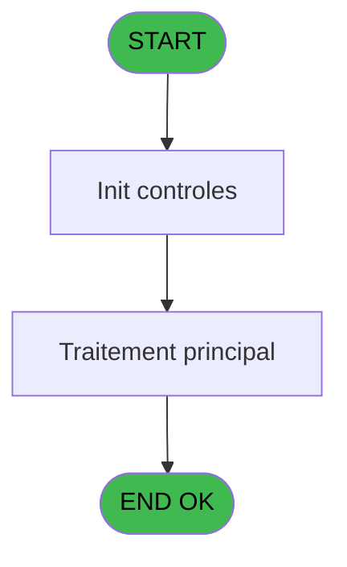
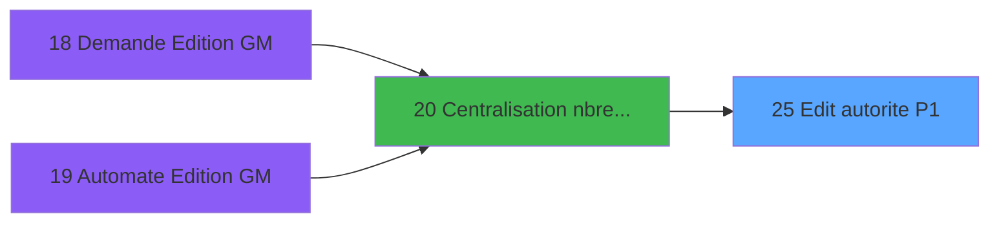
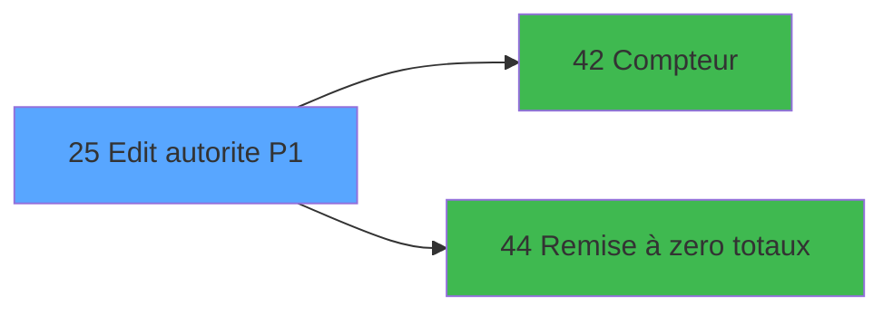

# PBP IDE 25 - Edit autorite P1

> **Analyse**: Phases 1-4 2026-02-03 01:12 -> 01:13 (39s) | Assemblage 01:13
> **Pipeline**: V7.2 Enrichi
> **Structure**: 4 onglets (Resume | Ecrans | Donnees | Connexions)

<!-- TAB:Resume -->

## 1. FICHE D'IDENTITE

| Attribut | Valeur |
|----------|--------|
| Projet | PBP |
| IDE Position | 25 |
| Nom Programme | Edit autorite P1 |
| Fichier source | `Prg_25.xml` |
| Domaine metier | General |
| Taches | 2 (1 ecrans visibles) |
| Tables modifiees | 0 |
| Programmes appeles | 2 |

## 2. DESCRIPTION FONCTIONNELLE

**Edit autorite P1** assure la gestion complete de ce processus, accessible depuis [Centralisation nbre edition (IDE 20)](PBP-IDE-20.md).

Le flux de traitement s'organise en **1 blocs fonctionnels** :

- **Traitement** (2 taches) : traitements metier divers

**Logique metier** : 2 regles identifiees couvrant conditions metier.

## 3. BLOCS FONCTIONNELS

### 3.1 Traitement (2 taches)

Traitements internes.

---

#### 25 - Veuillez patienter... [[ECRAN]](#ecran-t1)

**Role** : Traitement : Veuillez patienter....
**Ecran** : 427 x 58 DLU (MDI) | [Voir mockup](#ecran-t1)
**Delegue a** : [   Remise à zero totaux (IDE 44)](PBP-IDE-44.md)

---

#### 25.1 - Edit totaux par nationalite

**Role** : Calcul : Edit totaux par nationalite.
**Delegue a** : [   Remise à zero totaux (IDE 44)](PBP-IDE-44.md)

## 5. REGLES METIER

2 regles identifiees:

### Autres (2 regles)

#### [RM-001] Si > type [C]='D' alors 'DISEMBARKING PASSENGERS LIST' sinon IF (> type [C]='T','TRANSIT PASSENGERS LIST',IF (> type [C]='Z','PASSENGERS LIST',IF (> type [C]='A','EMBARKING PASSENGERS LIST',IF (> type [C]='P','EXPECTED EMBARKING PASSENGERS LIST','')))))

| Element | Detail |
|---------|--------|
| **Condition** | `> type [C]='D'` |
| **Si vrai** | 'DISEMBARKING PASSENGERS LIST' |
| **Si faux** | IF (> type [C]='T','TRANSIT PASSENGERS LIST',IF (> type [C]='Z','PASSENGERS LIST',IF (> type [C]='A','EMBARKING PASSENGERS LIST',IF (> type [C]='P','EXPECTED EMBARKING PASSENGERS LIST',''))))) |
| **Variables** | C (> type) |
| **Expression source** | Expression 39 : `IF (> type [C]='D','DISEMBARKING PASSENGERS LIST',IF (> type` |
| **Exemple** | Si > type [C]='D' → 'DISEMBARKING PASSENGERS LIST' |

#### [RM-002] Condition toujours vraie (flag actif)

| Element | Detail |
|---------|--------|
| **Condition** | `Counter (0)=0 OR [AF]=0` |
| **Si vrai** | 'FALSE'LOG |
| **Si faux** | 'TRUE'LOG) |
| **Expression source** | Expression 41 : `IF (Counter (0)=0 OR [AF]=0,'FALSE'LOG,'TRUE'LOG)` |
| **Exemple** | Si Counter (0)=0 OR [AF]=0 → 'FALSE'LOG. Sinon → 'TRUE'LOG) |

## 6. CONTEXTE

- **Appele par**: [Centralisation nbre edition (IDE 20)](PBP-IDE-20.md)
- **Appelle**: 2 programmes | **Tables**: 3 (W:0 R:2 L:2) | **Taches**: 2 | **Expressions**: 41

<!-- TAB:Ecrans -->

## 8. ECRANS

### 8.1 Forms visibles (1 / 2)

| # | Position | Tache | Nom | Type | Largeur | Hauteur | Bloc |
|---|----------|-------|-----|------|---------|---------|------|
| 1 | 25 | 25 | Veuillez patienter... | MDI | 427 | 58 | Traitement |

### 8.2 Mockups Ecrans

---

#### 25 - Veuillez patienter...
**Tache** : [25](#t1) | **Type** : MDI | **Dimensions** : 427 x 58 DLU
**Bloc** : Traitement | **Titre IDE** : Veuillez patienter...

<!-- FORM-DATA:
{
    "width":  427,
    "vFactor":  8,
    "type":  "MDI",
    "hFactor":  8,
    "controls":  [
                     {
                         "x":  0,
                         "type":  "label",
                         "var":  "",
                         "y":  0,
                         "w":  423,
                         "fmt":  "",
                         "name":  "",
                         "h":  29,
                         "color":  "",
                         "text":  "",
                         "parent":  null
                     },
                     {
                         "x":  120,
                         "type":  "label",
                         "var":  "",
                         "y":  10,
                         "w":  221,
                         "fmt":  "",
                         "name":  "",
                         "h":  8,
                         "color":  "7",
                         "text":  "Traitement en cours ...",
                         "parent":  null
                     },
                     {
                         "x":  0,
                         "type":  "label",
                         "var":  "",
                         "y":  29,
                         "w":  423,
                         "fmt":  "",
                         "name":  "",
                         "h":  27,
                         "color":  "",
                         "text":  "",
                         "parent":  null
                     },
                     {
                         "x":  47,
                         "type":  "label",
                         "var":  "",
                         "y":  38,
                         "w":  331,
                         "fmt":  "",
                         "name":  "",
                         "h":  8,
                         "color":  "",
                         "text":  "Edition Autorite Passager (P1)",
                         "parent":  null
                     },
                     {
                         "x":  4,
                         "type":  "image",
                         "var":  "",
                         "y":  2,
                         "w":  72,
                         "fmt":  "",
                         "name":  "",
                         "h":  25,
                         "color":  "",
                         "text":  "",
                         "parent":  null
                     }
                 ],
    "taskId":  "25",
    "height":  58
}
-->

## 9. NAVIGATION

Ecran unique: **Veuillez patienter...**

### 9.3 Structure hierarchique (2 taches)

| Position | Tache | Type | Dimensions | Bloc |
|----------|-------|------|------------|------|
| **25.1** | [**Veuillez patienter...** (25)](#t1) [mockup](#ecran-t1) | MDI | 427x58 | Traitement |
| 25.1.1 | [Edit totaux par nationalite (25.1)](#t2) | MDI | - | |

### 9.4 Algorigramme

> **Legende**: Vert = START/END OK | Rouge = END KO | Bleu = Decisions
> *Algorigramme auto-genere. Utiliser `/algorigramme` pour une synthese metier detaillee.*

<!-- TAB:Donnees -->

## 10. TABLES

### Tables utilisees (3)

| ID | Nom | Description | Type | R | W | L | Usages |
|----|-----|-------------|------|---|---|---|--------|
| 289 | escale |  | DB |   |   | L | 1 |
| 599 | tempo_hebergement | Hebergement (chambres) | DB | R |   | L | 2 |
| 632 | tempo_selection | Table temporaire ecran | DB | R |   |   | 1 |

### Colonnes par table (1 / 2 tables avec colonnes identifiees)

Table 599 - tempo_hebergement (R/L) - 2 usages

*Table utilisee uniquement en Link ou aucune colonne Real identifiee dans le DataView.*

Table 632 - tempo_selection (R) - 1 usages

| Lettre | Variable | Acces | Type |
|--------|----------|-------|------|
| A | > date traitement | R | Date |
| B | > commandant | R | Alpha |
| C | > type | R | Alpha |
| D | > choix impression | R | Alpha |
| E | v. nbre crew | R | Numeric |
| F | v. passage | R | Logical |
| G | V.Tab | R | Logical |

## 11. VARIABLES

### 11.1 Variables de session (3)

Variables persistantes pendant toute la session.

| Lettre | Nom | Type | Usage dans |
|--------|-----|------|-----------|
| E | v. nbre crew | Numeric | - |
| F | v. passage | Logical | - |
| G | V.Tab | Logical | - |

### 11.2 Autres (4)

Variables diverses.

| Lettre | Nom | Type | Usage dans |
|--------|-----|------|-----------|
| A | > date traitement | Date | 15x refs |
| B | > commandant | Alpha | 1x refs |
| C | > type | Alpha | 9x refs |
| D | > choix impression | Alpha | 12x refs |

## 12. EXPRESSIONS

**41 / 41 expressions decodees (100%)**

### 12.1 Repartition par type

| Type | Expressions | Regles |
|------|-------------|--------|
| CONCATENATION | 7 | 0 |
| CONDITION | 27 | 5 |
| CALCULATION | 1 | 0 |
| CAST_LOGIQUE | 1 | 5 |
| CONSTANTE | 2 | 0 |
| REFERENCE_VG | 1 | 0 |
| OTHER | 1 | 0 |
| STRING | 1 | 0 |

### 12.2 Expressions cles par type

#### CONCATENATION (7 expressions)

| Type | IDE | Expression | Regle |
|------|-----|------------|-------|
| CONCATENATION | 38 | `Trim (DStr ([P],'##/##/##'))&'  '&Trim ([Q])` | - |
| CONCATENATION | 36 | `'%club_word%P1 '&IF (> type [C]='D','DISEMBARKING PASSENGERS LIST',IF (> type [C]='T','TRANSIT PASSENGERS LIST',IF (> type [C]='Z','PASSENGERS LIST',IF (> type [C]='A','EMBARKING PASSENGERS LIST',IF (> type [C]='P','EXPECTED EMBARKING PASSENGERS LIST','')))))&'.doc'` | - |
| CONCATENATION | 11 | `INIGet ('[MAGIC_LOGICAL_NAMES]preview')='O' OR INIGet ('[PREVIEW]'&Trim (Str (VG85,'4'))&'pview')='O'` | - |
| CONCATENATION | 37 | `Trim (DStr ([M],'##/##/##'))&'  '&Trim ([N])` | - |
| CONCATENATION | 10 | `'- '&Str (Page (0,1),'3P0Z0')&' -'` | - |
| ... | | *+2 autres* | |

#### CONDITION (27 expressions)

| Type | IDE | Expression | Regle |
|------|-----|------------|-------|
| CONDITION | 39 | `IF (> type [C]='D','DISEMBARKING PASSENGERS LIST',IF (> type [C]='T','TRANSIT PASSENGERS LIST',IF (> type [C]='Z','PASSENGERS LIST',IF (> type [C]='A','EMBARKING PASSENGERS LIST',IF (> type [C]='P','EXPECTED EMBARKING PASSENGERS LIST','')))))` | [RM-001](#rm-RM-001) |
| CONDITION | 26 | `> date traitement [A]=[R] AND > choix impression [D]='Po'` | - |
| CONDITION | 28 | `> date traitement [A]=[R] AND > choix impression [D]='Wo'` | - |
| CONDITION | 27 | `> date traitement [A]=[R] AND > choix impression [D]='Pa'` | - |
| CONDITION | 23 | `[S]>> date traitement [A] AND [R]<> date traitement [A] AND > choix impression [D]='Po'` | - |
| ... | | *+22 autres* | |

#### CALCULATION (1 expressions)

| Type | IDE | Expression | Regle |
|------|-----|------------|-------|
| CALCULATION | 21 | `[AF]+1` | - |

#### CAST_LOGIQUE (1 expressions)

| Type | IDE | Expression | Regle |
|------|-----|------------|-------|
| CAST_LOGIQUE | 41 | `IF (Counter (0)=0 OR [AF]=0,'FALSE'LOG,'TRUE'LOG)` | [RM-002](#rm-RM-002) |

#### CONSTANTE (2 expressions)

| Type | IDE | Expression | Regle |
|------|-----|------------|-------|
| CONSTANTE | 40 | `'%env%P1.rtf'` | - |
| CONSTANTE | 7 | `'TOT'` | - |

#### REFERENCE_VG (1 expressions)

| Type | IDE | Expression | Regle |
|------|-----|------------|-------|
| REFERENCE_VG | 6 | `VG1` | - |

#### OTHER (1 expressions)

| Type | IDE | Expression | Regle |
|------|-----|------------|-------|
| OTHER | 8 | `'Village '&GetParam ('VILLAGE')` | - |

#### STRING (1 expressions)

| Type | IDE | Expression | Regle |
|------|-----|------------|-------|
| STRING | 20 | `'CRUISE '&Trim (Str ([AA],'4'))` | - |

### 12.3 Toutes les expressions (41)

Voir les 41 expressions

#### CONCATENATION (7)

| IDE | Expression Decodee |
|-----|-------------------|
| 10 | `'- '&Str (Page (0,1),'3P0Z0')&' -'` |
| 35 | `'- '&Str (Page (0,2),'3P0Z0')&' -'` |
| 9 | `MlsTrans ('Edition du')&' '&DStr (Date (),'DD/MM/YYYY')&' '&MlsTrans ('à')&' '&TStr (Time (),'HH:MM:SS')` |
| 37 | `Trim (DStr ([M],'##/##/##'))&'  '&Trim ([N])` |
| 38 | `Trim (DStr ([P],'##/##/##'))&'  '&Trim ([Q])` |
| 36 | `'%club_word%P1 '&IF (> type [C]='D','DISEMBARKING PASSENGERS LIST',IF (> type [C]='T','TRANSIT PASSENGERS LIST',IF (> type [C]='Z','PASSENGERS LIST',IF (> type [C]='A','EMBARKING PASSENGERS LIST',IF (> type [C]='P','EXPECTED EMBARKING PASSENGERS LIST','')))))&'.doc'` |
| 11 | `INIGet ('[MAGIC_LOGICAL_NAMES]preview')='O' OR INIGet ('[PREVIEW]'&Trim (Str (VG85,'4'))&'pview')='O'` |

#### CONDITION (27)

| IDE | Expression Decodee |
|-----|-------------------|
| 18 | `> date traitement [A]-1` |
| 19 | `> date traitement [A]+1` |
| 39 | `IF (> type [C]='D','DISEMBARKING PASSENGERS LIST',IF (> type [C]='T','TRANSIT PASSENGERS LIST',IF (> type [C]='Z','PASSENGERS LIST',IF (> type [C]='A','EMBARKING PASSENGERS LIST',IF (> type [C]='P','EXPECTED EMBARKING PASSENGERS LIST','')))))` |
| 1 | `> type [C]='T' OR > type [C]='Z'` |
| 2 | `> type [C]='T'` |
| 3 | `> type [C]='A'` |
| 4 | `> type [C]='A' OR > type [C]='Z' OR > type [C]='P'` |
| 5 | `> type [C]='D'` |
| 12 | `[S]>> date traitement [A] AND [R]<> date traitement [A]` |
| 13 | `> date traitement [A]=[R]` |
| 14 | `> date traitement [A]=[S]` |
| 15 | `> type [C]='Z'` |
| 17 | `> date traitement [A]` |
| 22 | `> type [C]='P'` |
| 23 | `[S]>> date traitement [A] AND [R]<> date traitement [A] AND > choix impression [D]='Po'` |
| 24 | `[S]>> date traitement [A] AND [R]<> date traitement [A] AND > choix impression [D]='Pa'` |
| 25 | `[S]>> date traitement [A] AND [R]<> date traitement [A] AND > choix impression [D]='Wo'` |
| 26 | `> date traitement [A]=[R] AND > choix impression [D]='Po'` |
| 27 | `> date traitement [A]=[R] AND > choix impression [D]='Pa'` |
| 28 | `> date traitement [A]=[R] AND > choix impression [D]='Wo'` |
| 29 | `> date traitement [A]=[S] AND > choix impression [D]='Po'` |
| 30 | `> date traitement [A]=[S] AND > choix impression [D]='Pa'` |
| 31 | `> date traitement [A]=[S] AND > choix impression [D]='Wo'` |
| 32 | `> choix impression [D]='Po'` |
| 33 | `> choix impression [D]='Pa'` |
| 34 | `> choix impression [D]='Wo'` |
| 16 | `'Captain''s name : '&Trim (> commandant [B])` |

#### CALCULATION (1)

| IDE | Expression Decodee |
|-----|-------------------|
| 21 | `[AF]+1` |

#### CAST_LOGIQUE (1)

| IDE | Expression Decodee |
|-----|-------------------|
| 41 | `IF (Counter (0)=0 OR [AF]=0,'FALSE'LOG,'TRUE'LOG)` |

#### CONSTANTE (2)

| IDE | Expression Decodee |
|-----|-------------------|
| 7 | `'TOT'` |
| 40 | `'%env%P1.rtf'` |

#### REFERENCE_VG (1)

| IDE | Expression Decodee |
|-----|-------------------|
| 6 | `VG1` |

#### OTHER (1)

| IDE | Expression Decodee |
|-----|-------------------|
| 8 | `'Village '&GetParam ('VILLAGE')` |

#### STRING (1)

| IDE | Expression Decodee |
|-----|-------------------|
| 20 | `'CRUISE '&Trim (Str ([AA],'4'))` |

<!-- TAB:Connexions -->

## 13. GRAPHE D'APPELS

### 13.1 Chaine depuis Main (Callers)

Main -> ... -> [Centralisation nbre edition (IDE 20)](PBP-IDE-20.md) -> **Edit autorite P1 (IDE 25)**

### 13.2 Callers

| IDE | Nom Programme | Nb Appels |
|-----|---------------|-----------|
| [20](PBP-IDE-20.md) | Centralisation nbre edition | 5 |

### 13.3 Callees (programmes appeles)

### 13.4 Detail Callees avec contexte

| IDE | Nom Programme | Appels | Contexte |
|-----|---------------|--------|----------|
| [42](PBP-IDE-42.md) |    Compteur | 1 | Sous-programme |
| [44](PBP-IDE-44.md) |    Remise à zero totaux | 1 | Programme fidelite |

## 14. RECOMMANDATIONS MIGRATION

### 14.1 Profil du programme

| Metrique | Valeur | Impact migration |
|----------|--------|-----------------|
| Lignes de logique | 98 | Programme compact |
| Expressions | 41 | Peu de logique |
| Tables WRITE | 0 | Impact faible |
| Sous-programmes | 2 | Peu de dependances |
| Ecrans visibles | 1 | Ecran unique ou traitement batch |
| Code desactive | 0% (0 / 98) | Code sain |
| Regles metier | 2 | Quelques regles a preserver |

### 14.2 Plan de migration par bloc

#### Traitement (2 taches: 1 ecran, 1 traitement)

- **Strategie** : Orchestrateur avec 1 ecrans (Razor/React) et 1 traitements backend (services).
- Les ecrans deviennent des composants UI, les traitements invisibles deviennent des services injectables.
- 2 sous-programme(s) a migrer ou a reutiliser depuis les services existants.
- Decomposer les taches en services unitaires testables.

### 14.3 Dependances critiques

| Dependance | Type | Appels | Impact |
|------------|------|--------|--------|
| [   Remise à zero totaux (IDE 44)](PBP-IDE-44.md) | Sous-programme | 1x | Normale - Programme fidelite |
| [   Compteur (IDE 42)](PBP-IDE-42.md) | Sous-programme | 1x | Normale - Sous-programme |

---
*Spec DETAILED generee par Pipeline V7.2 - 2026-02-03 01:13*
