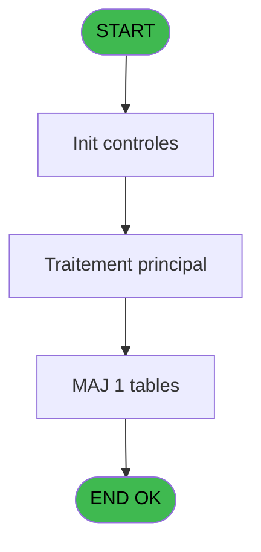
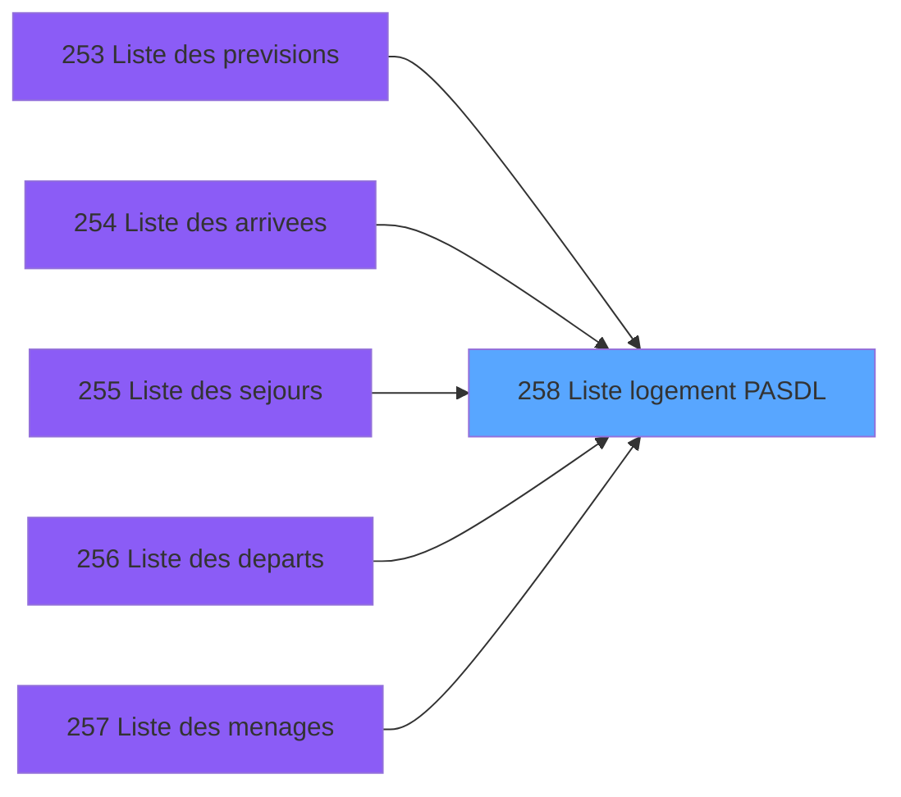
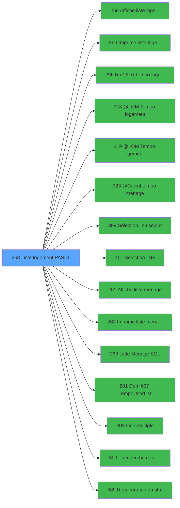

# PBP IDE 258 - Liste logement PASDL

> **Analyse**: Phases 1-4 2026-02-03 16:01 -> 16:01 (11s) | Assemblage 16:01
> **Pipeline**: V7.2 Enrichi
> **Structure**: 4 onglets (Resume | Ecrans | Donnees | Connexions)

<!-- TAB:Resume -->

## 1. FICHE D'IDENTITE

| Attribut | Valeur |
|----------|--------|
| Projet | PBP |
| IDE Position | 258 |
| Nom Programme | Liste logement PASDL |
| Fichier source | `Prg_258.xml` |
| Dossier IDE | Logement |
| Taches | 3 (1 ecrans visibles) |
| Tables modifiees | 1 |
| Programmes appeles | 15 |

## 2. DESCRIPTION FONCTIONNELLE

**Liste logement PASDL** assure la gestion complete de ce processus, accessible depuis [Liste des previsions (IDE 253)](PBP-IDE-253.md), [Liste des arrivees (IDE 254)](PBP-IDE-254.md), [Liste des sejours (IDE 255)](PBP-IDE-255.md), [Liste des departs (IDE 256)](PBP-IDE-256.md), [Liste des menages (IDE 257)](PBP-IDE-257.md), [Liste liberation (IDE 381)](PBP-IDE-381.md).

Le flux de traitement s'organise en **1 blocs fonctionnels** :

- **Traitement** (3 taches) : traitements metier divers

**Donnees modifiees** : 1 tables en ecriture (tempo_zone_secteur).

**Logique metier** : 2 regles identifiees couvrant conditions metier, valeurs par defaut.

## 3. BLOCS FONCTIONNELS

### 3.1 Traitement (3 taches)

Traitements internes.

---

#### 258 - Liste Logements [[ECRAN]](#ecran-t1)

**Role** : Traitement : Liste Logements.
**Ecran** : 1064 x 223 DLU (MDI) | [Voir mockup](#ecran-t1)
**Variables liees** : B (>CodeListe), K (w0_Liste), L (b_Liste)
**Delegue a** : [  Affiche liste logement (IDE 259)](PBP-IDE-259.md), [  Imprime liste logement AL (IDE 260)](PBP-IDE-260.md), [@LOM > Tempo logement (IDE 318)](PBP-IDE-318.md)

---

#### 258.1 - Tick/Untick All

**Role** : Traitement : Tick/Untick All.
**Variables liees** : Y (W0 Tick/Untick)
**Delegue a** : [@LOM > Tempo logement (IDE 318)](PBP-IDE-318.md), [@LOM > Tempo logement libe (IDE 319)](PBP-IDE-319.md), [  Liste Menage SQL (IDE 263)](PBP-IDE-263.md)

---

#### 258.2 - Calc Sector List

**Role** : Traitement : Calc Sector List.
**Variables liees** : BF (v.Zone/Secteur List), B (>CodeListe), K (w0_Liste), L (b_Liste)
**Delegue a** : [@LOM > Tempo logement (IDE 318)](PBP-IDE-318.md), [@LOM > Tempo logement libe (IDE 319)](PBP-IDE-319.md), [  Liste Menage SQL (IDE 263)](PBP-IDE-263.md)

## 5. REGLES METIER

2 regles identifiees:

### Autres (2 regles)

#### [RM-001] Si [AQ] alors 'þ' sinon 'o')

| Element | Detail |
|---------|--------|
| **Condition** | `[AQ]` |
| **Si vrai** | 'þ' |
| **Si faux** | 'o') |
| **Expression source** | Expression 47 : `IF ([AQ],'þ','o')` |
| **Exemple** | Si [AQ] → 'þ'. Sinon → 'o') |

#### [RM-002] Valeur par defaut si Trim(w0_LieuSejour [M])<>'' AND Trim(w0_LieuSejour [M])<>'G','lgm.loc_lieu_de_sejour est vide

| Element | Detail |
|---------|--------|
| **Condition** | `Trim(w0_LieuSejour [M])<>'' AND Trim(w0_LieuSejour [M])<>'G'` |
| **Si vrai** | 'lgm.loc_lieu_de_sejour='''&Trim(w0_LieuSejour [M])&''' AND ' |
| **Si faux** | '')&IF(Trim([CU])='','',IF(>Zone/Secteur [C]='Z','men.zone_de_menage IN ','men.secteur_de_menage IN')&Trim([CU])) |
| **Variables** | C (>Zone/Secteur), M (w0_LieuSejour) |
| **Expression source** | Expression 52 : `IF(Trim(w0_LieuSejour [M])<>'' AND Trim(w0_LieuSejour [M])<>` |
| **Exemple** | Si Trim(w0_LieuSejour [M])<>'' AND Trim(w0_LieuSejour [M])<>'G' → 'lgm.loc_lieu_de_sejour='''&Trim(w0_LieuSejour [M])&''' AND ' |

## 6. CONTEXTE

- **Appele par**: [Liste des previsions (IDE 253)](PBP-IDE-253.md), [Liste des arrivees (IDE 254)](PBP-IDE-254.md), [Liste des sejours (IDE 255)](PBP-IDE-255.md), [Liste des departs (IDE 256)](PBP-IDE-256.md), [Liste des menages (IDE 257)](PBP-IDE-257.md), [Liste liberation (IDE 381)](PBP-IDE-381.md)
- **Appelle**: 15 programmes | **Tables**: 4 (W:1 R:2 L:3) | **Taches**: 3 | **Expressions**: 63

<!-- TAB:Ecrans -->

## 8. ECRANS

### 8.1 Forms visibles (1 / 3)

| # | Position | Tache | Nom | Type | Largeur | Hauteur | Bloc |
|---|----------|-------|-----|------|---------|---------|------|
| 1 | 258 | 258 | Liste Logements | MDI | 1064 | 223 | Traitement |

### 8.2 Mockups Ecrans

---

#### 258 - Liste Logements
**Tache** : [258](#t1) | **Type** : MDI | **Dimensions** : 1064 x 223 DLU
**Bloc** : Traitement | **Titre IDE** : Liste Logements

<!-- FORM-DATA:
{
    "width":  1064,
    "vFactor":  8,
    "type":  "MDI",
    "hFactor":  8,
    "controls":  [
                     {
                         "x":  1,
                         "type":  "label",
                         "var":  "",
                         "y":  2,
                         "w":  1058,
                         "fmt":  "",
                         "name":  "",
                         "h":  21,
                         "color":  "1",
                         "text":  "",
                         "parent":  null
                     },
                     {
                         "x":  462,
                         "type":  "label",
                         "var":  "",
                         "y":  26,
                         "w":  403,
                         "fmt":  "",
                         "name":  "",
                         "h":  170,
                         "color":  "195",
                         "text":  "Paramètres",
                         "parent":  null
                     },
                     {
                         "x":  868,
                         "type":  "label",
                         "var":  "",
                         "y":  29,
                         "w":  191,
                         "fmt":  "",
                         "name":  "",
                         "h":  167,
                         "color":  "",
                         "text":  "",
                         "parent":  null
                     },
                     {
                         "x":  556,
                         "type":  "label",
                         "var":  "",
                         "y":  37,
                         "w":  224,
                         "fmt":  "",
                         "name":  "",
                         "h":  45,
                         "color":  "",
                         "text":  "",
                         "parent":  5
                     },
                     {
                         "x":  6,
                         "type":  "table",
                         "var":  "",
                         "name":  "",
                         "titleH":  12,
                         "color":  "110",
                         "w":  454,
                         "y":  38,
                         "fmt":  "",
                         "parent":  null,
                         "text":  "",
                         "rowH":  14,
                         "h":  158,
                         "cols":  [
                                      {
                                          "title":  "",
                                          "layer":  1,
                                          "w":  174
                                      },
                                      {
                                          "title":  "",
                                          "layer":  2,
                                          "w":  246
                                      }
                                  ],
                         "rows":  2
                     },
                     {
                         "x":  598,
                         "type":  "label",
                         "var":  "",
                         "y":  44,
                         "w":  46,
                         "fmt":  "",
                         "name":  "",
                         "h":  9,
                         "color":  "",
                         "text":  "Total",
                         "parent":  7
                     },
                     {
                         "x":  598,
                         "type":  "label",
                         "var":  "",
                         "y":  65,
                         "w":  78,
                         "fmt":  "",
                         "name":  "",
                         "h":  9,
                         "color":  "",
                         "text":  "Sélection",
                         "parent":  7
                     },
                     {
                         "x":  474,
                         "type":  "label",
                         "var":  "",
                         "y":  88,
                         "w":  53,
                         "fmt":  "",
                         "name":  "",
                         "h":  10,
                         "color":  "",
                         "text":  "Date",
                         "parent":  5
                     },
                     {
                         "x":  474,
                         "type":  "label",
                         "var":  "",
                         "y":  102,
                         "w":  62,
                         "fmt":  "",
                         "name":  "",
                         "h":  10,
                         "color":  "",
                         "text":  "Heure",
                         "parent":  5
                     },
                     {
                         "x":  474,
                         "type":  "label",
                         "var":  "",
                         "y":  117,
                         "w":  98,
                         "fmt":  "",
                         "name":  "",
                         "h":  10,
                         "color":  "",
                         "text":  "Lieu séjour",
                         "parent":  5
                     },
                     {
                         "x":  474,
                         "type":  "label",
                         "var":  "",
                         "y":  131,
                         "w":  51,
                         "fmt":  "",
                         "name":  "",
                         "h":  10,
                         "color":  "",
                         "text":  "Liste",
                         "parent":  5
                     },
                     {
                         "x":  874,
                         "type":  "line",
                         "var":  "",
                         "y":  144,
                         "w":  178,
                         "fmt":  "",
                         "name":  "",
                         "h":  0,
                         "color":  "",
                         "text":  "",
                         "parent":  null
                     },
                     {
                         "x":  474,
                         "type":  "label",
                         "var":  "",
                         "y":  146,
                         "w":  101,
                         "fmt":  "",
                         "name":  "",
                         "h":  12,
                         "color":  "",
                         "text":  "Séminaire",
                         "parent":  5
                     },
                     {
                         "x":  0,
                         "type":  "label",
                         "var":  "",
                         "y":  198,
                         "w":  1058,
                         "fmt":  "",
                         "name":  "",
                         "h":  24,
                         "color":  "1",
                         "text":  "",
                         "parent":  null
                     },
                     {
                         "x":  474,
                         "type":  "label",
                         "var":  "",
                         "y":  163,
                         "w":  101,
                         "fmt":  "",
                         "name":  "",
                         "h":  12,
                         "color":  "",
                         "text":  "Heure départ",
                         "parent":  5
                     },
                     {
                         "x":  576,
                         "type":  "edit",
                         "var":  "",
                         "y":  88,
                         "w":  126,
                         "fmt":  "",
                         "name":  "w0_Date",
                         "h":  10,
                         "color":  "110",
                         "text":  "",
                         "parent":  5
                     },
                     {
                         "x":  705,
                         "type":  "button",
                         "var":  "",
                         "y":  88,
                         "w":  25,
                         "fmt":  "...",
                         "name":  "b_Date",
                         "h":  10,
                         "color":  "",
                         "text":  "",
                         "parent":  5
                     },
                     {
                         "x":  576,
                         "type":  "edit",
                         "var":  "",
                         "y":  102,
                         "w":  37,
                         "fmt":  "",
                         "name":  "w0_Heure",
                         "h":  10,
                         "color":  "110",
                         "text":  "",
                         "parent":  5
                     },
                     {
                         "x":  576,
                         "type":  "edit",
                         "var":  "",
                         "y":  131,
                         "w":  182,
                         "fmt":  "",
                         "name":  "w0_Liste",
                         "h":  10,
                         "color":  "110",
                         "text":  "",
                         "parent":  5
                     },
                     {
                         "x":  763,
                         "type":  "button",
                         "var":  "",
                         "y":  131,
                         "w":  25,
                         "fmt":  "...",
                         "name":  "b_Liste",
                         "h":  10,
                         "color":  "",
                         "text":  "",
                         "parent":  5
                     },
                     {
                         "x":  576,
                         "type":  "edit",
                         "var":  "",
                         "y":  117,
                         "w":  26,
                         "fmt":  "",
                         "name":  "w0_LieuSejour",
                         "h":  10,
                         "color":  "110",
                         "text":  "",
                         "parent":  5
                     },
                     {
                         "x":  635,
                         "type":  "edit",
                         "var":  "",
                         "y":  118,
                         "w":  221,
                         "fmt":  "19",
                         "name":  "",
                         "h":  8,
                         "color":  "142",
                         "text":  "",
                         "parent":  5
                     },
                     {
                         "x":  606,
                         "type":  "button",
                         "var":  "",
                         "y":  117,
                         "w":  25,
                         "fmt":  "...",
                         "name":  "b_LieuSejour",
                         "h":  10,
                         "color":  "",
                         "text":  "",
                         "parent":  5
                     },
                     {
                         "x":  12,
                         "type":  "checkbox",
                         "var":  "",
                         "y":  41,
                         "w":  30,
                         "fmt":  "",
                         "name":  "TUL MARQUEUR",
                         "h":  9,
                         "color":  "110",
                         "text":  "",
                         "parent":  8
                     },
                     {
                         "x":  42,
                         "type":  "edit",
                         "var":  "",
                         "y":  42,
                         "w":  138,
                         "fmt":  "",
                         "name":  "",
                         "h":  8,
                         "color":  "110",
                         "text":  "",
                         "parent":  8
                     },
                     {
                         "x":  189,
                         "type":  "edit",
                         "var":  "",
                         "y":  42,
                         "w":  232,
                         "fmt":  "",
                         "name":  "",
                         "h":  8,
                         "color":  "110",
                         "text":  "",
                         "parent":  8
                     },
                     {
                         "x":  682,
                         "type":  "edit",
                         "var":  "",
                         "y":  44,
                         "w":  56,
                         "fmt":  "",
                         "name":  "",
                         "h":  9,
                         "color":  "",
                         "text":  "",
                         "parent":  7
                     },
                     {
                         "x":  682,
                         "type":  "edit",
                         "var":  "",
                         "y":  65,
                         "w":  56,
                         "fmt":  "",
                         "name":  "",
                         "h":  9,
                         "color":  "",
                         "text":  "",
                         "parent":  7
                     },
                     {
                         "x":  474,
                         "type":  "checkbox",
                         "var":  "",
                         "y":  182,
                         "w":  347,
                         "fmt":  "",
                         "name":  "W0_Edt Code Fid",
                         "h":  12,
                         "color":  "",
                         "text":  "Editer la légende des codes fidélisation ?",
                         "parent":  5
                     },
                     {
                         "x":  890,
                         "type":  "button",
                         "var":  "",
                         "y":  100,
                         "w":  154,
                         "fmt":  "\u0026Ecran",
                         "name":  "b_Ecran",
                         "h":  18,
                         "color":  "",
                         "text":  "",
                         "parent":  6
                     },
                     {
                         "x":  890,
                         "type":  "button",
                         "var":  "",
                         "y":  122,
                         "w":  154,
                         "fmt":  "\u0026Impression",
                         "name":  "b_Edition",
                         "h":  18,
                         "color":  "",
                         "text":  "",
                         "parent":  6
                     },
                     {
                         "x":  890,
                         "type":  "button",
                         "var":  "",
                         "y":  166,
                         "w":  154,
                         "fmt":  "\u0026R\\AZ",
                         "name":  "b_RAZ",
                         "h":  18,
                         "color":  "",
                         "text":  "",
                         "parent":  null
                     },
                     {
                         "x":  6,
                         "type":  "edit",
                         "var":  "",
                         "y":  4,
                         "w":  267,
                         "fmt":  "20",
                         "name":  "",
                         "h":  8,
                         "color":  "",
                         "text":  "",
                         "parent":  1
                     },
                     {
                         "x":  844,
                         "type":  "edit",
                         "var":  "",
                         "y":  7,
                         "w":  203,
                         "fmt":  "WWW DD MMM YYYYT",
                         "name":  "",
                         "h":  8,
                         "color":  "",
                         "text":  "",
                         "parent":  1
                     },
                     {
                         "x":  6,
                         "type":  "edit",
                         "var":  "",
                         "y":  13,
                         "w":  288,
                         "fmt":  "25",
                         "name":  "",
                         "h":  6,
                         "color":  "",
                         "text":  "",
                         "parent":  1
                     },
                     {
                         "x":  11,
                         "type":  "button",
                         "var":  "",
                         "y":  26,
                         "w":  29,
                         "fmt":  "þ",
                         "name":  "",
                         "h":  13,
                         "color":  "",
                         "text":  "",
                         "parent":  null
                     },
                     {
                         "x":  880,
                         "type":  "image",
                         "var":  "",
                         "y":  41,
                         "w":  170,
                         "fmt":  "",
                         "name":  "",
                         "h":  59,
                         "color":  "",
                         "text":  "",
                         "parent":  6
                     },
                     {
                         "x":  8,
                         "type":  "button",
                         "var":  "",
                         "y":  201,
                         "w":  154,
                         "fmt":  "\u0026Quitter",
                         "name":  "",
                         "h":  18,
                         "color":  "",
                         "text":  "",
                         "parent":  28
                     },
                     {
                         "x":  576,
                         "type":  "combobox",
                         "var":  "",
                         "y":  163,
                         "w":  234,
                         "fmt":  "",
                         "name":  "Heure Fin",
                         "h":  12,
                         "color":  "",
                         "text":  "L,F",
                         "parent":  5
                     },
                     {
                         "x":  890,
                         "type":  "button",
                         "var":  "",
                         "y":  144,
                         "w":  154,
                         "fmt":  "E\u0026xtraction",
                         "name":  "b_Extraction",
                         "h":  18,
                         "color":  "",
                         "text":  "",
                         "parent":  null
                     },
                     {
                         "x":  576,
                         "type":  "combobox",
                         "var":  "",
                         "y":  146,
                         "w":  238,
                         "fmt":  "",
                         "name":  "w0_seminaire",
                         "h":  11,
                         "color":  "",
                         "text":  "",
                         "parent":  5
                     }
                 ],
    "taskId":  "258",
    "height":  223
}
-->

<strong>Champs : 16 champs</strong>

| Pos (x,y) | Nom | Variable | Type |
|-----------|-----|----------|------|
| 576,88 | w0_Date | - | edit |
| 576,102 | w0_Heure | - | edit |
| 576,131 | w0_Liste | - | edit |
| 576,117 | w0_LieuSejour | - | edit |
| 635,118 | 19 | - | edit |
| 12,41 | TUL MARQUEUR | - | checkbox |
| 42,42 | (sans nom) | - | edit |
| 189,42 | (sans nom) | - | edit |
| 682,44 | (sans nom) | - | edit |
| 682,65 | (sans nom) | - | edit |
| 474,182 | W0_Edt Code Fid | - | checkbox |
| 6,4 | 20 | - | edit |
| 844,7 | WWW DD MMM YYYYT | - | edit |
| 6,13 | 25 | - | edit |
| 576,163 | Heure Fin | - | combobox |
| 576,146 | w0_seminaire | - | combobox |

<strong>Boutons : 9 boutons</strong>

| Bouton | Pos (x,y) | Action |
|--------|-----------|--------|
| ... | 705,88 | Appel [...recherche date minimum (IDE 309)](PBP-IDE-309.md) |
| ... | 763,131 | Appel [...recherche date minimum (IDE 309)](PBP-IDE-309.md) |
| ... | 606,117 | Appel [...recherche date minimum (IDE 309)](PBP-IDE-309.md) |
| Ecran | 890,100 | Bouton fonctionnel |
| Impression | 890,122 | Bouton fonctionnel |
| R\AZ | 890,166 | Bouton fonctionnel |
| þ | 11,26 | Bouton fonctionnel |
| Quitter | 8,201 | Quitte le programme |
| Extraction | 890,144 | Bouton fonctionnel |

## 9. NAVIGATION

Ecran unique: **Liste Logements**

### 9.3 Structure hierarchique (3 taches)

| Position | Tache | Type | Dimensions | Bloc |
|----------|-------|------|------------|------|
| **258.1** | [**Liste Logements** (258)](#t1) [mockup](#ecran-t1) | MDI | 1064x223 | Traitement |
| 258.1.1 | [Tick/Untick All (258.1)](#t2) | MDI | - | |
| 258.1.2 | [Calc Sector List (258.2)](#t3) | - | - | |

### 9.4 Algorigramme

> **Legende**: Vert = START/END OK | Rouge = END KO | Bleu = Decisions
> *Algorigramme auto-genere. Utiliser `/algorigramme` pour une synthese metier detaillee.*

<!-- TAB:Donnees -->

## 10. TABLES

### Tables utilisees (4)

| ID | Nom | Description | Type | R | W | L | Usages |
|----|-----|-------------|------|---|---|---|--------|
| 81 | societe__________soc |  | DB | R |   |   | 1 |
| 107 | logement_zone_menage |  | DB | R |   | L | 2 |
| 118 | tables_imports |  | DB |   |   | L | 1 |
| 637 | tempo_zone_secteur | Table temporaire ecran | DB |   | **W** | L | 3 |

### Colonnes par table (3 / 3 tables avec colonnes identifiees)

Table 81 - societe__________soc (R) - 1 usages

| Lettre | Variable | Acces | Type |
|--------|----------|-------|------|
| A | >CodeTitre | R | Numeric |
| B | >CodeListe | R | Alpha |
| C | >Zone/Secteur | R | Alpha |
| D | >Categorie | R | Alpha |
| E | >NomTable | R | Alpha |
| F | >TitreEdit | R | Alpha |
| G | w0_ConfirmeLiberation | R | Numeric |
| H | w0_Date | R | Date |
| I | b_Date | R | Alpha |
| J | w0_Heure | R | Alpha |
| K | w0_Liste | R | Alpha |
| L | b_Liste | R | Alpha |
| M | w0_LieuSejour | R | Alpha |
| N | b_LieuSejour | R | Alpha |
| O | w0_seminaire | R | Alpha |
| P | b_Sejour | R | Alpha |
| Q | w0_Total | R | Numeric |
| R | w0_Selection | R | Numeric |
| S | w0_Titre | R | Alpha |
| T | W0 nom societe | R | Alpha |
| U | W0 date minimum | R | Date |
| V | w0_SejourMulti | R | Logical |
| W | W0_Edt Code Fid | R | Logical |
| X | v.Choix heure Fin / Libération | R | Alpha |
| Y | W0 Tick/Untick | R | Logical |
| Z | b_Liberer | R | Alpha |
| BA | b_Ecran | R | Alpha |
| BB | b_Edition | R | Alpha |
| BC | b_Extraction | R | Alpha |
| BD | b_Raz | R | Alpha |
| BE | v.Clause Where | R | Unicode |
| BF | v.Zone/Secteur List | R | Unicode |

Table 107 - logement_zone_menage (R/L) - 2 usages

| Lettre | Variable | Acces | Type |
|--------|----------|-------|------|
| BF | v.Zone/Secteur List | R | Unicode |
| C | >Zone/Secteur | R | Alpha |

Table 637 - tempo_zone_secteur (**W**/L) - 3 usages

| Lettre | Variable | Acces | Type |
|--------|----------|-------|------|
| BF | v.Zone/Secteur List | W | Unicode |
| C | >Zone/Secteur | W | Alpha |

## 11. VARIABLES

### 11.1 Variables de session (3)

Variables persistantes pendant toute la session.

| Lettre | Nom | Type | Usage dans |
|--------|-----|------|-----------|
| X | v.Choix heure Fin / Libération | Alpha | - |
| BE | v.Clause Where | Unicode | - |
| BF | v.Zone/Secteur List | Unicode | - |

### 11.2 Variables de travail (3)

Variables internes au programme.

| Lettre | Nom | Type | Usage dans |
|--------|-----|------|-----------|
| T | W0 nom societe | Alpha | - |
| U | W0 date minimum | Date | - |
| Y | W0 Tick/Untick | Logical | - |

### 11.3 Autres (26)

Variables diverses.

| Lettre | Nom | Type | Usage dans |
|--------|-----|------|-----------|
| A | >CodeTitre | Numeric | - |
| B | >CodeListe | Alpha | 13x refs |
| C | >Zone/Secteur | Alpha | 1x refs |
| D | >Categorie | Alpha | 1x refs |
| E | >NomTable | Alpha | 1x refs |
| F | >TitreEdit | Alpha | 2x refs |
| G | w0_ConfirmeLiberation | Numeric | 1x refs |
| H | w0_Date | Date | 10x refs |
| I | b_Date | Alpha | - |
| J | w0_Heure | Alpha | 4x refs |
| K | w0_Liste | Alpha | 1x refs |
| L | b_Liste | Alpha | - |
| M | w0_LieuSejour | Alpha | 3x refs |
| N | b_LieuSejour | Alpha | - |
| O | w0_seminaire | Alpha | - |
| P | b_Sejour | Alpha | - |
| Q | w0_Total | Numeric | - |
| R | w0_Selection | Numeric | 1x refs |
| S | w0_Titre | Alpha | - |
| V | w0_SejourMulti | Logical | 1x refs |
| W | W0_Edt Code Fid | Logical | 1x refs |
| Z | b_Liberer | Alpha | - |
| BA | b_Ecran | Alpha | - |
| BB | b_Edition | Alpha | - |
| BC | b_Extraction | Alpha | - |
| BD | b_Raz | Alpha | - |

Toutes les 32 variables (liste complete)

| Cat | Lettre | Nom Variable | Type |
|-----|--------|--------------|------|
| W0 | **T** | W0 nom societe | Alpha |
| W0 | **U** | W0 date minimum | Date |
| W0 | **Y** | W0 Tick/Untick | Logical |
| V. | **X** | v.Choix heure Fin / Libération | Alpha |
| V. | **BE** | v.Clause Where | Unicode |
| V. | **BF** | v.Zone/Secteur List | Unicode |
| Autre | **A** | >CodeTitre | Numeric |
| Autre | **B** | >CodeListe | Alpha |
| Autre | **C** | >Zone/Secteur | Alpha |
| Autre | **D** | >Categorie | Alpha |
| Autre | **E** | >NomTable | Alpha |
| Autre | **F** | >TitreEdit | Alpha |
| Autre | **G** | w0_ConfirmeLiberation | Numeric |
| Autre | **H** | w0_Date | Date |
| Autre | **I** | b_Date | Alpha |
| Autre | **J** | w0_Heure | Alpha |
| Autre | **K** | w0_Liste | Alpha |
| Autre | **L** | b_Liste | Alpha |
| Autre | **M** | w0_LieuSejour | Alpha |
| Autre | **N** | b_LieuSejour | Alpha |
| Autre | **O** | w0_seminaire | Alpha |
| Autre | **P** | b_Sejour | Alpha |
| Autre | **Q** | w0_Total | Numeric |
| Autre | **R** | w0_Selection | Numeric |
| Autre | **S** | w0_Titre | Alpha |
| Autre | **V** | w0_SejourMulti | Logical |
| Autre | **W** | W0_Edt Code Fid | Logical |
| Autre | **Z** | b_Liberer | Alpha |
| Autre | **BA** | b_Ecran | Alpha |
| Autre | **BB** | b_Edition | Alpha |
| Autre | **BC** | b_Extraction | Alpha |
| Autre | **BD** | b_Raz | Alpha |

## 12. EXPRESSIONS

**63 / 63 expressions decodees (100%)**

### 12.1 Repartition par type

| Type | Expressions | Regles |
|------|-------------|--------|
| CONDITION | 24 | 2 |
| CONSTANTE | 12 | 0 |
| DATE | 1 | 0 |
| CONCATENATION | 2 | 0 |
| FORMAT | 1 | 0 |
| OTHER | 16 | 0 |
| REFERENCE_VG | 3 | 0 |
| CAST_LOGIQUE | 2 | 0 |
| STRING | 2 | 0 |

### 12.2 Expressions cles par type

#### CONDITION (24 expressions)

| Type | IDE | Expression | Regle |
|------|-----|------------|-------|
| CONDITION | 52 | `IF(Trim(w0_LieuSejour [M])<>'' AND Trim(w0_LieuSejour [M])<>'G','lgm.loc_lieu_de_sejour='''&Trim(w0_LieuSejour [M])&''' AND ','')&IF(Trim([CU])='','',IF(>Zone/Secteur [C]='Z','men.zone_de_menage IN ','men.secteur_de_menage IN')&Trim([CU]))` | [RM-002](#rm-RM-002) |
| CONDITION | 47 | `IF ([AQ],'þ','o')` | [RM-001](#rm-RM-001) |
| CONDITION | 45 | `>CodeListe [B]='L' AND w0_Heure [J]=''` | - |
| CONDITION | 49 | `>CodeListe [B]='M'` | - |
| CONDITION | 44 | `>CodeListe [B]='L' AND w0_Date [H]=0` | - |
| ... | | *+19 autres* | |

#### CONSTANTE (12 expressions)

| Type | IDE | Expression | Regle |
|------|-----|------------|-------|
| CONSTANTE | 30 | `'&Imprimer'` | - |
| CONSTANTE | 29 | `'&Ecran'` | - |
| CONSTANTE | 28 | `'Li&berer'` | - |
| CONSTANTE | 50 | `'L'` | - |
| CONSTANTE | 39 | `'12'` | - |
| ... | | *+7 autres* | |

#### DATE (1 expressions)

| Type | IDE | Expression | Regle |
|------|-----|------------|-------|
| DATE | 22 | `Date ()` | - |

#### CONCATENATION (2 expressions)

| Type | IDE | Expression | Regle |
|------|-----|------------|-------|
| CONCATENATION | 25 | `Trim (>TitreEdit [F])&' '&'du '&DStr (w0_Date [H],'DD/MM/YYYY')&' ... '&w0_Heure [J]&'h'` | - |
| CONCATENATION | 24 | `Trim (>TitreEdit [F])&' '&'du '&DStr (w0_Date [H],'DD/MM/YYYY')` | - |

#### FORMAT (1 expressions)

| Type | IDE | Expression | Regle |
|------|-----|------------|-------|
| FORMAT | 53 | `Translate('%club_exportdata%')&'list_men_'&DStr(w0_Date [H],'YYYYMMDD')&'.csv'` | - |

#### OTHER (16 expressions)

| Type | IDE | Expression | Regle |
|------|-----|------------|-------|
| OTHER | 32 | `[AO]` | - |
| OTHER | 46 | `w0_Selection [R]` | - |
| OTHER | 26 | `SetCrsr (2)` | - |
| OTHER | 27 | `SetCrsr (1)` | - |
| OTHER | 56 | `[CT]` | - |
| ... | | *+11 autres* | |

#### REFERENCE_VG (3 expressions)

| Type | IDE | Expression | Regle |
|------|-----|------------|-------|
| REFERENCE_VG | 58 | `VG36` | - |
| REFERENCE_VG | 21 | `VG2` | - |
| REFERENCE_VG | 4 | `VG1` | - |

#### CAST_LOGIQUE (2 expressions)

| Type | IDE | Expression | Regle |
|------|-----|------------|-------|
| CAST_LOGIQUE | 48 | `'TRUE'LOG` | - |
| CAST_LOGIQUE | 40 | `'FALSE'LOG` | - |

#### STRING (2 expressions)

| Type | IDE | Expression | Regle |
|------|-----|------------|-------|
| STRING | 43 | `Str (Hour (Time ()),'2P0Z0')` | - |
| STRING | 20 | `Trim ([AJ])` | - |

### 12.3 Toutes les expressions (63)

Voir les 63 expressions

#### CONDITION (24)

| IDE | Expression Decodee |
|-----|-------------------|
| 33 | `w0_Date [H]='01/01/1901'DATE` |
| 47 | `IF ([AQ],'þ','o')` |
| 52 | `IF(Trim(w0_LieuSejour [M])<>'' AND Trim(w0_LieuSejour [M])<>'G','lgm.loc_lieu_de_sejour='''&Trim(w0_LieuSejour [M])&''' AND ','')&IF(Trim([CU])='','',IF(>Zone/Secteur [C]='Z','men.zone_de_menage IN ','men.secteur_de_menage IN')&Trim([CU]))` |
| 42 | `>CodeListe [B]='L' AND Date ()*100+Hour (Time ())<w0_Date [H]*100+Val (w0_Heure [J],'2')` |
| 5 | `>Categorie [D]` |
| 6 | `>NomTable [E]` |
| 14 | `>CodeListe [B]<>'M' AND >CodeListe [B]<>'L'` |
| 15 | `>CodeListe [B]='M'` |
| 16 | `>CodeListe [B]='L'` |
| 34 | `w0_Liste [K]=''` |
| 35 | `w0_LieuSejour [M]=''` |
| 36 | `w0_Heure [J]='' AND >CodeListe [B]<>'L'` |
| 37 | `[AI]=0` |
| 38 | `[AI]>0` |
| 41 | `w0_ConfirmeLiberation [G]=6` |
| 44 | `>CodeListe [B]='L' AND w0_Date [H]=0` |
| 45 | `>CodeListe [B]='L' AND w0_Heure [J]=''` |
| 49 | `>CodeListe [B]='M'` |
| 51 | `[CQ]='L'` |
| 57 | `>CodeListe [B]='M'` |
| 60 | `CndRange(>CodeListe [B]='P' OR >CodeListe [B]='A',w0_Date [H])` |
| 61 | `CndRange(>CodeListe [B]<>'D',w0_Date [H])` |
| 62 | `CndRange(>CodeListe [B]='S' OR >CodeListe [B]='D',w0_Date [H])` |
| 63 | `CndRange(>CodeListe [B]='D',w0_Date [H])` |

#### CONSTANTE (12)

| IDE | Expression Decodee |
|-----|-------------------|
| 10 | `'PL'` |
| 12 | `'LOO'` |
| 13 | `0` |
| 17 | `'Se&jour'` |
| 19 | `'...'` |
| 23 | `'Planning'` |
| 28 | `'Li&berer'` |
| 29 | `'&Ecran'` |
| 30 | `'&Imprimer'` |
| 31 | `'E&xtraction'` |
| 39 | `'12'` |
| 50 | `'L'` |

#### DATE (1)

| IDE | Expression Decodee |
|-----|-------------------|
| 22 | `Date ()` |

#### CONCATENATION (2)

| IDE | Expression Decodee |
|-----|-------------------|
| 24 | `Trim (>TitreEdit [F])&' '&'du '&DStr (w0_Date [H],'DD/MM/YYYY')` |
| 25 | `Trim (>TitreEdit [F])&' '&'du '&DStr (w0_Date [H],'DD/MM/YYYY')&' ... '&w0_Heure [J]&'h'` |

#### FORMAT (1)

| IDE | Expression Decodee |
|-----|-------------------|
| 53 | `Translate('%club_exportdata%')&'list_men_'&DStr(w0_Date [H],'YYYYMMDD')&'.csv'` |

#### OTHER (16)

| IDE | Expression Decodee |
|-----|-------------------|
| 1 | `GetParam ('SOCIETE')` |
| 2 | `GetParam ('VILLAGE')` |
| 3 | `GetParam ('LANGUE')` |
| 7 | `w0_SejourMulti [V]` |
| 8 | `W0_Edt Code Fid [W]` |
| 9 | `GetParam ('LIEU_SEJOUR')` |
| 11 | `[AM]` |
| 18 | `w0_LieuSejour [M]` |
| 26 | `SetCrsr (2)` |
| 27 | `SetCrsr (1)` |
| 32 | `[AO]` |
| 46 | `w0_Selection [R]` |
| 54 | `SetCrsr(2)` |
| 55 | `SetCrsr(1)` |
| 56 | `[CT]` |
| 59 | `ASCIIChr(33)` |

#### REFERENCE_VG (3)

| IDE | Expression Decodee |
|-----|-------------------|
| 4 | `VG1` |
| 21 | `VG2` |
| 58 | `VG36` |

#### CAST_LOGIQUE (2)

| IDE | Expression Decodee |
|-----|-------------------|
| 40 | `'FALSE'LOG` |
| 48 | `'TRUE'LOG` |

#### STRING (2)

| IDE | Expression Decodee |
|-----|-------------------|
| 20 | `Trim ([AJ])` |
| 43 | `Str (Hour (Time ()),'2P0Z0')` |

<!-- TAB:Connexions -->

## 13. GRAPHE D'APPELS

### 13.1 Chaine depuis Main (Callers)

Main -> ... -> [Liste des previsions (IDE 253)](PBP-IDE-253.md) -> **Liste logement PASDL (IDE 258)**

Main -> ... -> [Liste des arrivees (IDE 254)](PBP-IDE-254.md) -> **Liste logement PASDL (IDE 258)**

Main -> ... -> [Liste des sejours (IDE 255)](PBP-IDE-255.md) -> **Liste logement PASDL (IDE 258)**

Main -> ... -> [Liste des departs (IDE 256)](PBP-IDE-256.md) -> **Liste logement PASDL (IDE 258)**

Main -> ... -> [Liste des menages (IDE 257)](PBP-IDE-257.md) -> **Liste logement PASDL (IDE 258)**

Main -> ... -> [Liste liberation (IDE 381)](PBP-IDE-381.md) -> **Liste logement PASDL (IDE 258)**

### 13.2 Callers

| IDE | Nom Programme | Nb Appels |
|-----|---------------|-----------|
| [253](PBP-IDE-253.md) | Liste des previsions | 1 |
| [254](PBP-IDE-254.md) | Liste des arrivees | 1 |
| [255](PBP-IDE-255.md) | Liste des sejours | 1 |
| [256](PBP-IDE-256.md) | Liste des departs | 1 |
| [257](PBP-IDE-257.md) | Liste des menages | 1 |
| [381](PBP-IDE-381.md) | Liste liberation | 1 |

### 13.3 Callees (programmes appeles)

### 13.4 Detail Callees avec contexte

| IDE | Nom Programme | Appels | Contexte |
|-----|---------------|--------|----------|
| [259](PBP-IDE-259.md) |   Affiche liste logement | 2 | Configuration impression |
| [260](PBP-IDE-260.md) |   Imprime liste logement AL | 2 | Impression ticket/document |
| [296](PBP-IDE-296.md) | RaZ 616 Tempo logement | 2 | Reinitialisation |
| [318](PBP-IDE-318.md) | @LOM > Tempo logement | 2 | Sous-programme |
| [319](PBP-IDE-319.md) | @LOM > Tempo logement libe | 2 | Sous-programme |
| [323](PBP-IDE-323.md) | @Calcul tempo menage | 2 | Calcul de donnees |
| [399](PBP-IDE-399.md) | Selection lieu sejour | 2 | Selection/consultation |
| [401](PBP-IDE-401.md) | Selection liste | 2 | Selection/consultation |
| [261](PBP-IDE-261.md) |   Affiche liste menage | 1 | Configuration impression |
| [262](PBP-IDE-262.md) |   Imprime liste menage AL | 1 | Impression ticket/document |
| [263](PBP-IDE-263.md) |   Liste Menage SQL | 1 | Configuration impression |
| [281](PBP-IDE-281.md) | Dem 637 TempoUserList | 1 | Configuration impression |
| [303](PBP-IDE-303.md) | Lieu multiple | 1 | Sous-programme |
| [309](PBP-IDE-309.md) | ...recherche date minimum | 1 | Sous-programme |
| [389](PBP-IDE-389.md) | Recuperation du titre | 1 | Recuperation donnees |

## 14. RECOMMANDATIONS MIGRATION

### 14.1 Profil du programme

| Metrique | Valeur | Impact migration |
|----------|--------|-----------------|
| Lignes de logique | 218 | Taille moyenne |
| Expressions | 63 | Logique moderee |
| Tables WRITE | 1 | Impact faible |
| Sous-programmes | 15 | Forte dependance |
| Ecrans visibles | 1 | Ecran unique ou traitement batch |
| Code desactive | 0.9% (2 / 218) | Code sain |
| Regles metier | 2 | Quelques regles a preserver |

### 14.2 Plan de migration par bloc

#### Traitement (3 taches: 1 ecran, 2 traitements)

- **Strategie** : Orchestrateur avec 1 ecrans (Razor/React) et 2 traitements backend (services).
- Les ecrans deviennent des composants UI, les traitements invisibles deviennent des services injectables.
- 15 sous-programme(s) a migrer ou a reutiliser depuis les services existants.
- Decomposer les taches en services unitaires testables.

### 14.3 Dependances critiques

| Dependance | Type | Appels | Impact |
|------------|------|--------|--------|
| tempo_zone_secteur | Table WRITE (Database) | 1x | Schema + repository |
| [@Calcul tempo menage (IDE 323)](PBP-IDE-323.md) | Sous-programme | 2x | Haute - Calcul de donnees |
| [@LOM > Tempo logement libe (IDE 319)](PBP-IDE-319.md) | Sous-programme | 2x | Haute - Sous-programme |
| [Selection liste (IDE 401)](PBP-IDE-401.md) | Sous-programme | 2x | Haute - Selection/consultation |
| [Selection lieu sejour (IDE 399)](PBP-IDE-399.md) | Sous-programme | 2x | Haute - Selection/consultation |
| [  Imprime liste logement AL (IDE 260)](PBP-IDE-260.md) | Sous-programme | 2x | Haute - Impression ticket/document |
| [  Affiche liste logement (IDE 259)](PBP-IDE-259.md) | Sous-programme | 2x | Haute - Configuration impression |
| [@LOM > Tempo logement (IDE 318)](PBP-IDE-318.md) | Sous-programme | 2x | Haute - Sous-programme |
| [RaZ 616 Tempo logement (IDE 296)](PBP-IDE-296.md) | Sous-programme | 2x | Haute - Reinitialisation |
| [Lieu multiple (IDE 303)](PBP-IDE-303.md) | Sous-programme | 1x | Normale - Sous-programme |
| [...recherche date minimum (IDE 309)](PBP-IDE-309.md) | Sous-programme | 1x | Normale - Sous-programme |

---
*Spec DETAILED generee par Pipeline V7.2 - 2026-02-03 16:01*
