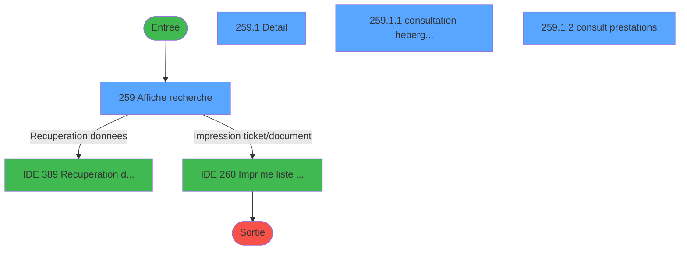
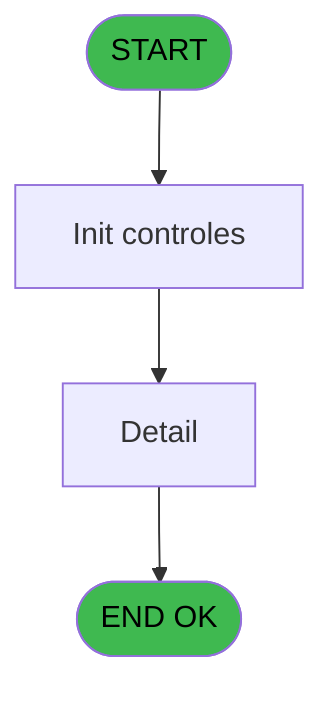
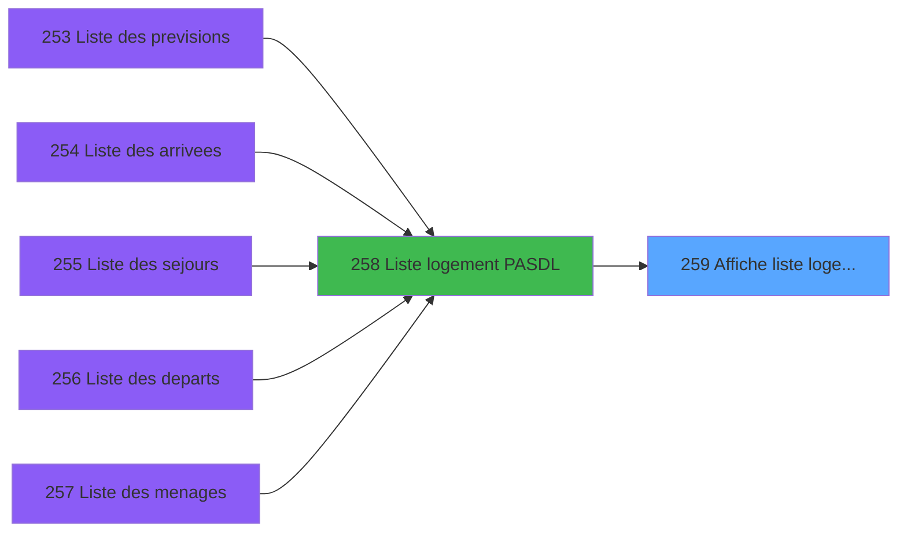
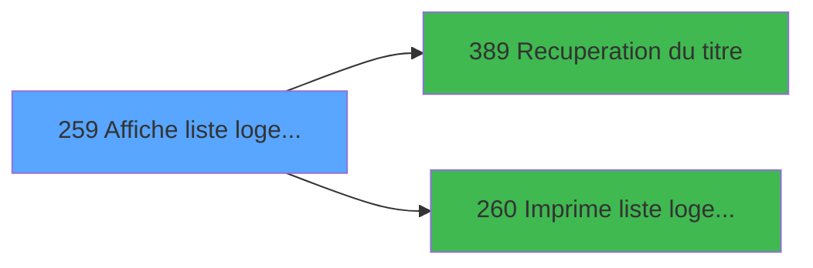

# PBP IDE 259 - Affiche liste logement

> **Analyse**: Phases 1-4 2026-02-03 16:01 -> 16:02 (12s) | Assemblage 16:02
> **Pipeline**: V7.2 Enrichi
> **Structure**: 4 onglets (Resume | Ecrans | Donnees | Connexions)

<!-- TAB:Resume -->

## 1. FICHE D'IDENTITE

| Attribut | Valeur |
|----------|--------|
| Projet | PBP |
| IDE Position | 259 |
| Nom Programme | Affiche liste logement |
| Fichier source | `Prg_259.xml` |
| Dossier IDE | Logement |
| Taches | 4 (4 ecrans visibles) |
| Tables modifiees | 0 |
| Programmes appeles | 2 |

## 2. DESCRIPTION FONCTIONNELLE

**Affiche liste logement** assure la gestion complete de ce processus, accessible depuis [  Liste logement PASDL (IDE 258)](PBP-IDE-258.md).

Le flux de traitement s'organise en **2 blocs fonctionnels** :

- **Traitement** (3 taches) : traitements metier divers
- **Consultation** (1 tache) : ecrans de recherche, selection et consultation

**Logique metier** : 2 regles identifiees couvrant conditions metier.

Detail : phases du traitement

#### Phase 1 : Consultation (1 tache)

- **259** - Affiche recherche **[[ECRAN]](#ecran-t1)**

Delegue a : [Recuperation du titre (IDE 389)](PBP-IDE-389.md)

#### Phase 2 : Traitement (3 taches)

- **259.1** - Detail **[[ECRAN]](#ecran-t2)**
- **259.1.1** - consultation hebergement **[[ECRAN]](#ecran-t3)**
- **259.1.2** - consult prestations **[[ECRAN]](#ecran-t4)**

Delegue a : [Recuperation du titre (IDE 389)](PBP-IDE-389.md)

## 3. BLOCS FONCTIONNELS

### 3.1 Consultation (1 tache)

Ecrans de recherche et consultation.

---

#### 259 - Affiche recherche [[ECRAN]](#ecran-t1)

**Role** : Reinitialisation : Affiche recherche.
**Ecran** : 1234 x 217 DLU (MDI) | [Voir mockup](#ecran-t1)

### 3.2 Traitement (3 taches)

Traitements internes.

---

#### 259.1 - Detail [[ECRAN]](#ecran-t2)

**Role** : Traitement : Detail.
**Ecran** : 770 x 271 DLU (MDI) | [Voir mockup](#ecran-t2)
**Delegue a** : [Recuperation du titre (IDE 389)](PBP-IDE-389.md)

---

#### 259.1.1 - consultation hebergement [[ECRAN]](#ecran-t3)

**Role** : Consultation/chargement : consultation hebergement.
**Ecran** : 763 x 78 DLU (Modal) | [Voir mockup](#ecran-t3)
**Delegue a** : [Recuperation du titre (IDE 389)](PBP-IDE-389.md)

---

#### 259.1.2 - consult prestations [[ECRAN]](#ecran-t4)

**Role** : Traitement : consult prestations.
**Ecran** : 759 x 48 DLU (Modal) | [Voir mockup](#ecran-t4)
**Delegue a** : [Recuperation du titre (IDE 389)](PBP-IDE-389.md)

## 5. REGLES METIER

2 regles identifiees:

### Autres (2 regles)

#### [RM-001] Traitement si VG42,IF ([CC] est renseigne

| Element | Detail |
|---------|--------|
| **Condition** | `VG42` |
| **Si vrai** | IF ([CC]<>'' |
| **Si faux** | [CC],[AC]),IF ([AK]<>'',[AK],[AC])) |
| **Expression source** | Expression 21 : `IF(VG42,IF ([CC]<>'',[CC],[AC]),IF ([AK]<>'',[AK],[AC]))` |
| **Exemple** | Si VG42 → IF ([CC]<>''. Sinon → [CC],[AC]),IF ([AK]<>'',[AK],[AC])) |

#### [RM-002] Si VG88 AND [CG] alors TStr([CF] sinon 'HHhMMZ'),[AB]&'h00')

| Element | Detail |
|---------|--------|
| **Condition** | `VG88 AND [CG]` |
| **Si vrai** | TStr([CF] |
| **Si faux** | 'HHhMMZ'),[AB]&'h00') |
| **Expression source** | Expression 23 : `IF(VG88 AND [CG],TStr([CF],'HHhMMZ'),[AB]&'h00')` |
| **Exemple** | Si VG88 AND [CG] → TStr([CF]. Sinon → 'HHhMMZ'),[AB]&'h00') |

## 6. CONTEXTE

- **Appele par**: [  Liste logement PASDL (IDE 258)](PBP-IDE-258.md)
- **Appelle**: 2 programmes | **Tables**: 6 (W:0 R:4 L:2) | **Taches**: 4 | **Expressions**: 24

<!-- TAB:Ecrans -->

## 8. ECRANS

### 8.1 Forms visibles (4 / 4)

| # | Position | Tache | Nom | Type | Largeur | Hauteur | Bloc |
|---|----------|-------|-----|------|---------|---------|------|
| 1 | 259 | 259 | Affiche recherche | MDI | 1234 | 217 | Consultation |
| 2 | 259.1 | 259.1 | Detail | MDI | 770 | 271 | Traitement |
| 3 | 259.1.1 | 259.1.1 | consultation hebergement | Modal | 763 | 78 | Traitement |
| 4 | 259.1.2 | 259.1.2 | consult prestations | Modal | 759 | 48 | Traitement |

### 8.2 Mockups Ecrans

---

#### 259 - Affiche recherche
**Tache** : [259](#t1) | **Type** : MDI | **Dimensions** : 1234 x 217 DLU
**Bloc** : Consultation | **Titre IDE** : Affiche recherche

<!-- FORM-DATA:
{
    "width":  1234,
    "vFactor":  8,
    "type":  "MDI",
    "hFactor":  8,
    "controls":  [
                     {
                         "x":  0,
                         "type":  "label",
                         "var":  "",
                         "y":  1,
                         "w":  1226,
                         "fmt":  "",
                         "name":  "",
                         "h":  23,
                         "color":  "",
                         "text":  "",
                         "parent":  null
                     },
                     {
                         "x":  0,
                         "type":  "table",
                         "var":  "",
                         "name":  "",
                         "titleH":  12,
                         "color":  "110",
                         "w":  1050,
                         "y":  29,
                         "fmt":  "",
                         "parent":  null,
                         "text":  "",
                         "rowH":  14,
                         "h":  126,
                         "cols":  [
                                      {
                                          "title":  "Log.",
                                          "layer":  1,
                                          "w":  97
                                      },
                                      {
                                          "title":  "Ens",
                                          "layer":  2,
                                          "w":  62
                                      },
                                      {
                                          "title":  "Type",
                                          "layer":  3,
                                          "w":  99
                                      },
                                      {
                                          "title":  "Et",
                                          "layer":  4,
                                          "w":  51
                                      },
                                      {
                                          "title":  "Vue",
                                          "layer":  5,
                                          "w":  54
                                      },
                                      {
                                          "title":  "Hand",
                                          "layer":  6,
                                          "w":  69
                                      },
                                      {
                                          "title":  "Comm",
                                          "layer":  7,
                                          "w":  69
                                      },
                                      {
                                          "title":  "",
                                          "layer":  8,
                                          "w":  124
                                      },
                                      {
                                          "title":  "Sx",
                                          "layer":  9,
                                          "w":  52
                                      },
                                      {
                                          "title":  "Nom",
                                          "layer":  10,
                                          "w":  194
                                      },
                                      {
                                          "title":  "Prénom",
                                          "layer":  11,
                                          "w":  145
                                      }
                                  ],
                         "rows":  11
                     },
                     {
                         "x":  1054,
                         "type":  "label",
                         "var":  "",
                         "y":  27,
                         "w":  168,
                         "fmt":  "",
                         "name":  "",
                         "h":  126,
                         "color":  "",
                         "text":  "",
                         "parent":  null
                     },
                     {
                         "x":  1,
                         "type":  "label",
                         "var":  "",
                         "y":  156,
                         "w":  1223,
                         "fmt":  "",
                         "name":  "",
                         "h":  32,
                         "color":  "",
                         "text":  "",
                         "parent":  null
                     },
                     {
                         "x":  99,
                         "type":  "label",
                         "var":  "",
                         "y":  161,
                         "w":  104,
                         "fmt":  "",
                         "name":  "",
                         "h":  8,
                         "color":  "",
                         "text":  "Qualité",
                         "parent":  31
                     },
                     {
                         "x":  209,
                         "type":  "label",
                         "var":  "",
                         "y":  161,
                         "w":  61,
                         "fmt":  "",
                         "name":  "",
                         "h":  8,
                         "color":  "",
                         "text":  "Pays",
                         "parent":  31
                     },
                     {
                         "x":  287,
                         "type":  "label",
                         "var":  "",
                         "y":  161,
                         "w":  38,
                         "fmt":  "",
                         "name":  "",
                         "h":  8,
                         "color":  "",
                         "text":  "Age",
                         "parent":  31
                     },
                     {
                         "x":  440,
                         "type":  "label",
                         "var":  "",
                         "y":  161,
                         "w":  67,
                         "fmt":  "",
                         "name":  "",
                         "h":  8,
                         "color":  "",
                         "text":  "Séjour",
                         "parent":  31
                     },
                     {
                         "x":  845,
                         "type":  "label",
                         "var":  "",
                         "y":  161,
                         "w":  62,
                         "fmt":  "",
                         "name":  "",
                         "h":  8,
                         "color":  "",
                         "text":  "Fidel.",
                         "parent":  31
                     },
                     {
                         "x":  921,
                         "type":  "label",
                         "var":  "",
                         "y":  161,
                         "w":  48,
                         "fmt":  "",
                         "name":  "",
                         "h":  8,
                         "color":  "",
                         "text":  "Bébé",
                         "parent":  31
                     },
                     {
                         "x":  988,
                         "type":  "label",
                         "var":  "",
                         "y":  161,
                         "w":  59,
                         "fmt":  "",
                         "name":  "",
                         "h":  8,
                         "color":  "",
                         "text":  "V.I.P.",
                         "parent":  31
                     },
                     {
                         "x":  405,
                         "type":  "label",
                         "var":  "",
                         "y":  173,
                         "w":  27,
                         "fmt":  "",
                         "name":  "",
                         "h":  8,
                         "color":  "",
                         "text":  "du",
                         "parent":  31
                     },
                     {
                         "x":  592,
                         "type":  "label",
                         "var":  "",
                         "y":  173,
                         "w":  27,
                         "fmt":  "",
                         "name":  "",
                         "h":  8,
                         "color":  "",
                         "text":  "au",
                         "parent":  31
                     },
                     {
                         "x":  0,
                         "type":  "label",
                         "var":  "",
                         "y":  192,
                         "w":  1224,
                         "fmt":  "",
                         "name":  "",
                         "h":  24,
                         "color":  "",
                         "text":  "",
                         "parent":  null
                     },
                     {
                         "x":  618,
                         "type":  "label",
                         "var":  "",
                         "y":  162,
                         "w":  203,
                         "fmt":  "",
                         "name":  "",
                         "h":  8,
                         "color":  "",
                         "text":  "Heure",
                         "parent":  31
                     },
                     {
                         "x":  6,
                         "type":  "edit",
                         "var":  "",
                         "y":  44,
                         "w":  75,
                         "fmt":  "",
                         "name":  "TMP Logement",
                         "h":  8,
                         "color":  "110",
                         "text":  "",
                         "parent":  7
                     },
                     {
                         "x":  102,
                         "type":  "edit",
                         "var":  "",
                         "y":  44,
                         "w":  42,
                         "fmt":  "",
                         "name":  "",
                         "h":  8,
                         "color":  "110",
                         "text":  "",
                         "parent":  7
                     },
                     {
                         "x":  165,
                         "type":  "edit",
                         "var":  "",
                         "y":  44,
                         "w":  88,
                         "fmt":  "",
                         "name":  "",
                         "h":  8,
                         "color":  "110",
                         "text":  "",
                         "parent":  7
                     },
                     {
                         "x":  266,
                         "type":  "edit",
                         "var":  "",
                         "y":  44,
                         "w":  30,
                         "fmt":  "",
                         "name":  "",
                         "h":  8,
                         "color":  "110",
                         "text":  "",
                         "parent":  7
                     },
                     {
                         "x":  318,
                         "type":  "edit",
                         "var":  "",
                         "y":  44,
                         "w":  30,
                         "fmt":  "",
                         "name":  "",
                         "h":  8,
                         "color":  "110",
                         "text":  "",
                         "parent":  7
                     },
                     {
                         "x":  373,
                         "type":  "edit",
                         "var":  "",
                         "y":  44,
                         "w":  42,
                         "fmt":  "",
                         "name":  "",
                         "h":  8,
                         "color":  "110",
                         "text":  "",
                         "parent":  7
                     },
                     {
                         "x":  438,
                         "type":  "edit",
                         "var":  "",
                         "y":  44,
                         "w":  42,
                         "fmt":  "",
                         "name":  "",
                         "h":  8,
                         "color":  "110",
                         "text":  "",
                         "parent":  7
                     },
                     {
                         "x":  507,
                         "type":  "edit",
                         "var":  "",
                         "y":  44,
                         "w":  119,
                         "fmt":  "",
                         "name":  "",
                         "h":  8,
                         "color":  "110",
                         "text":  "",
                         "parent":  7
                     },
                     {
                         "x":  641,
                         "type":  "edit",
                         "var":  "",
                         "y":  44,
                         "w":  30,
                         "fmt":  "",
                         "name":  "",
                         "h":  8,
                         "color":  "110",
                         "text":  "",
                         "parent":  7
                     },
                     {
                         "x":  683,
                         "type":  "edit",
                         "var":  "",
                         "y":  44,
                         "w":  184,
                         "fmt":  "",
                         "name":  "TMP Nom",
                         "h":  8,
                         "color":  "110",
                         "text":  "",
                         "parent":  7
                     },
                     {
                         "x":  877,
                         "type":  "edit",
                         "var":  "",
                         "y":  44,
                         "w":  138,
                         "fmt":  "",
                         "name":  "TMP Prenom",
                         "h":  8,
                         "color":  "110",
                         "text":  "",
                         "parent":  7
                     },
                     {
                         "x":  99,
                         "type":  "edit",
                         "var":  "",
                         "y":  173,
                         "w":  104,
                         "fmt":  "",
                         "name":  "",
                         "h":  10,
                         "color":  "",
                         "text":  "",
                         "parent":  31
                     },
                     {
                         "x":  222,
                         "type":  "edit",
                         "var":  "",
                         "y":  173,
                         "w":  48,
                         "fmt":  "",
                         "name":  "",
                         "h":  10,
                         "color":  "",
                         "text":  "",
                         "parent":  31
                     },
                     {
                         "x":  287,
                         "type":  "edit",
                         "var":  "",
                         "y":  173,
                         "w":  33,
                         "fmt":  "",
                         "name":  "",
                         "h":  10,
                         "color":  "",
                         "text":  "",
                         "parent":  31
                     },
                     {
                         "x":  430,
                         "type":  "edit",
                         "var":  "",
                         "y":  173,
                         "w":  101,
                         "fmt":  "",
                         "name":  "",
                         "h":  8,
                         "color":  "",
                         "text":  "",
                         "parent":  31
                     },
                     {
                         "x":  628,
                         "type":  "edit",
                         "var":  "",
                         "y":  173,
                         "w":  101,
                         "fmt":  "",
                         "name":  "",
                         "h":  8,
                         "color":  "",
                         "text":  "",
                         "parent":  31
                     },
                     {
                         "x":  929,
                         "type":  "edit",
                         "var":  "",
                         "y":  173,
                         "w":  26,
                         "fmt":  "",
                         "name":  "",
                         "h":  10,
                         "color":  "",
                         "text":  "",
                         "parent":  31
                     },
                     {
                         "x":  988,
                         "type":  "edit",
                         "var":  "",
                         "y":  173,
                         "w":  59,
                         "fmt":  "",
                         "name":  "",
                         "h":  10,
                         "color":  "",
                         "text":  "",
                         "parent":  31
                     },
                     {
                         "x":  1063,
                         "type":  "button",
                         "var":  "",
                         "y":  100,
                         "w":  154,
                         "fmt":  "\u0026Voir",
                         "name":  "b_Ecran",
                         "h":  18,
                         "color":  "",
                         "text":  "",
                         "parent":  8
                     },
                     {
                         "x":  1063,
                         "type":  "button",
                         "var":  "",
                         "y":  124,
                         "w":  154,
                         "fmt":  "\u0026Imprimer",
                         "name":  "b_Imprimer",
                         "h":  18,
                         "color":  "",
                         "text":  "",
                         "parent":  8
                     },
                     {
                         "x":  10,
                         "type":  "button",
                         "var":  "",
                         "y":  195,
                         "w":  154,
                         "fmt":  "\u0026Quitter",
                         "name":  "b_Quitter",
                         "h":  18,
                         "color":  "",
                         "text":  "",
                         "parent":  51
                     },
                     {
                         "x":  6,
                         "type":  "edit",
                         "var":  "",
                         "y":  4,
                         "w":  267,
                         "fmt":  "25",
                         "name":  "",
                         "h":  8,
                         "color":  "",
                         "text":  "",
                         "parent":  1
                     },
                     {
                         "x":  406,
                         "type":  "edit",
                         "var":  "",
                         "y":  4,
                         "w":  344,
                         "fmt":  "30",
                         "name":  "",
                         "h":  8,
                         "color":  "",
                         "text":  "",
                         "parent":  null
                     },
                     {
                         "x":  976,
                         "type":  "edit",
                         "var":  "",
                         "y":  4,
                         "w":  238,
                         "fmt":  "WWW DD MMM YYYYT",
                         "name":  "",
                         "h":  8,
                         "color":  "",
                         "text":  "",
                         "parent":  1
                     },
                     {
                         "x":  6,
                         "type":  "edit",
                         "var":  "",
                         "y":  13,
                         "w":  154,
                         "fmt":  "25",
                         "name":  "",
                         "h":  8,
                         "color":  "",
                         "text":  "",
                         "parent":  1
                     },
                     {
                         "x":  406,
                         "type":  "edit",
                         "var":  "",
                         "y":  15,
                         "w":  344,
                         "fmt":  "30",
                         "name":  "",
                         "h":  8,
                         "color":  "",
                         "text":  "",
                         "parent":  null
                     },
                     {
                         "x":  1074,
                         "type":  "image",
                         "var":  "",
                         "y":  36,
                         "w":  133,
                         "fmt":  "",
                         "name":  "",
                         "h":  59,
                         "color":  "",
                         "text":  "",
                         "parent":  8
                     },
                     {
                         "x":  540,
                         "type":  "edit",
                         "var":  "",
                         "y":  173,
                         "w":  37,
                         "fmt":  "3",
                         "name":  "",
                         "h":  8,
                         "color":  "",
                         "text":  "",
                         "parent":  31
                     },
                     {
                         "x":  739,
                         "type":  "edit",
                         "var":  "",
                         "y":  173,
                         "w":  56,
                         "fmt":  "5",
                         "name":  "",
                         "h":  8,
                         "color":  "",
                         "text":  "",
                         "parent":  31
                     },
                     {
                         "x":  861,
                         "type":  "edit",
                         "var":  "",
                         "y":  173,
                         "w":  26,
                         "fmt":  "U",
                         "name":  "",
                         "h":  10,
                         "color":  "",
                         "text":  "",
                         "parent":  31
                     }
                 ],
    "taskId":  "259",
    "height":  217
}
-->

<strong>Champs : 26 champs</strong>

| Pos (x,y) | Nom | Variable | Type |
|-----------|-----|----------|------|
| 6,44 | TMP Logement | - | edit |
| 102,44 | (sans nom) | - | edit |
| 165,44 | (sans nom) | - | edit |
| 266,44 | (sans nom) | - | edit |
| 318,44 | (sans nom) | - | edit |
| 373,44 | (sans nom) | - | edit |
| 438,44 | (sans nom) | - | edit |
| 507,44 | (sans nom) | - | edit |
| 641,44 | (sans nom) | - | edit |
| 683,44 | TMP Nom | - | edit |
| 877,44 | TMP Prenom | - | edit |
| 99,173 | (sans nom) | - | edit |
| 222,173 | (sans nom) | - | edit |
| 287,173 | (sans nom) | - | edit |
| 430,173 | (sans nom) | - | edit |
| 628,173 | (sans nom) | - | edit |
| 929,173 | (sans nom) | - | edit |
| 988,173 | (sans nom) | - | edit |
| 6,4 | 25 | - | edit |
| 406,4 | 30 | - | edit |
| 976,4 | WWW DD MMM YYYYT | - | edit |
| 6,13 | 25 | - | edit |
| 406,15 | 30 | - | edit |
| 540,173 | 3 | - | edit |
| 739,173 | 5 | - | edit |
| 861,173 | U | - | edit |

<strong>Boutons : 3 boutons</strong>

| Bouton | Pos (x,y) | Action |
|--------|-----------|--------|
| Voir | 1063,100 | Bouton fonctionnel |
| Imprimer | 1063,124 | Appel [  Imprime liste logement AL (IDE 260)](PBP-IDE-260.md) |
| Quitter | 10,195 | Quitte le programme |

---

#### 259.1 - Detail
**Tache** : [259.1](#t2) | **Type** : MDI | **Dimensions** : 770 x 271 DLU
**Bloc** : Traitement | **Titre IDE** : Detail

<!-- FORM-DATA:
{
    "width":  770,
    "vFactor":  8,
    "type":  "MDI",
    "hFactor":  8,
    "controls":  [
                     {
                         "x":  5,
                         "type":  "label",
                         "var":  "",
                         "y":  17,
                         "w":  757,
                         "fmt":  "",
                         "name":  "",
                         "h":  92,
                         "color":  "",
                         "text":  "",
                         "parent":  null
                     },
                     {
                         "x":  22,
                         "type":  "label",
                         "var":  "",
                         "y":  23,
                         "w":  94,
                         "fmt":  "",
                         "name":  "",
                         "h":  8,
                         "color":  "",
                         "text":  "N° adhérent",
                         "parent":  3
                     },
                     {
                         "x":  8,
                         "type":  "line",
                         "var":  "",
                         "y":  34,
                         "w":  752,
                         "fmt":  "",
                         "name":  "",
                         "h":  0,
                         "color":  "",
                         "text":  "",
                         "parent":  null
                     },
                     {
                         "x":  22,
                         "type":  "label",
                         "var":  "",
                         "y":  39,
                         "w":  88,
                         "fmt":  "",
                         "name":  "",
                         "h":  8,
                         "color":  "",
                         "text":  "Naissance",
                         "parent":  3
                     },
                     {
                         "x":  8,
                         "type":  "line",
                         "var":  "",
                         "y":  51,
                         "w":  752,
                         "fmt":  "",
                         "name":  "",
                         "h":  0,
                         "color":  "",
                         "text":  "",
                         "parent":  null
                     },
                     {
                         "x":  22,
                         "type":  "label",
                         "var":  "",
                         "y":  57,
                         "w":  64,
                         "fmt":  "",
                         "name":  "",
                         "h":  8,
                         "color":  "",
                         "text":  "Identité",
                         "parent":  3
                     },
                     {
                         "x":  8,
                         "type":  "line",
                         "var":  "",
                         "y":  69,
                         "w":  752,
                         "fmt":  "",
                         "name":  "",
                         "h":  0,
                         "color":  "",
                         "text":  "",
                         "parent":  null
                     },
                     {
                         "x":  22,
                         "type":  "label",
                         "var":  "",
                         "y":  75,
                         "w":  69,
                         "fmt":  "",
                         "name":  "",
                         "h":  9,
                         "color":  "",
                         "text":  "Adresse",
                         "parent":  3
                     },
                     {
                         "x":  2,
                         "type":  "label",
                         "var":  "",
                         "y":  244,
                         "w":  763,
                         "fmt":  "",
                         "name":  "",
                         "h":  24,
                         "color":  "",
                         "text":  "",
                         "parent":  null
                     },
                     {
                         "x":  66,
                         "type":  "edit",
                         "var":  "",
                         "y":  2,
                         "w":  37,
                         "fmt":  "",
                         "name":  "GMC Titre",
                         "h":  10,
                         "color":  "",
                         "text":  "",
                         "parent":  null
                     },
                     {
                         "x":  134,
                         "type":  "edit",
                         "var":  "",
                         "y":  22,
                         "w":  26,
                         "fmt":  "",
                         "name":  "",
                         "h":  10,
                         "color":  "",
                         "text":  "",
                         "parent":  3
                     },
                     {
                         "x":  170,
                         "type":  "edit",
                         "var":  "",
                         "y":  23,
                         "w":  123,
                         "fmt":  "",
                         "name":  "",
                         "h":  9,
                         "color":  "",
                         "text":  "",
                         "parent":  3
                     },
                     {
                         "x":  301,
                         "type":  "edit",
                         "var":  "",
                         "y":  22,
                         "w":  26,
                         "fmt":  "",
                         "name":  "",
                         "h":  10,
                         "color":  "",
                         "text":  "",
                         "parent":  3
                     },
                     {
                         "x":  336,
                         "type":  "edit",
                         "var":  "",
                         "y":  22,
                         "w":  48,
                         "fmt":  "",
                         "name":  "",
                         "h":  10,
                         "color":  "",
                         "text":  "",
                         "parent":  3
                     },
                     {
                         "x":  120,
                         "type":  "edit",
                         "var":  "",
                         "y":  39,
                         "w":  132,
                         "fmt":  "DD/MM/YYYYZ",
                         "name":  "",
                         "h":  9,
                         "color":  "",
                         "text":  "",
                         "parent":  3
                     },
                     {
                         "x":  259,
                         "type":  "edit",
                         "var":  "",
                         "y":  39,
                         "w":  440,
                         "fmt":  "",
                         "name":  "",
                         "h":  9,
                         "color":  "",
                         "text":  "",
                         "parent":  3
                     },
                     {
                         "x":  706,
                         "type":  "edit",
                         "var":  "",
                         "y":  39,
                         "w":  45,
                         "fmt":  "",
                         "name":  "",
                         "h":  9,
                         "color":  "",
                         "text":  "",
                         "parent":  3
                     },
                     {
                         "x":  120,
                         "type":  "edit",
                         "var":  "",
                         "y":  57,
                         "w":  22,
                         "fmt":  "",
                         "name":  "",
                         "h":  9,
                         "color":  "",
                         "text":  "",
                         "parent":  3
                     },
                     {
                         "x":  147,
                         "type":  "edit",
                         "var":  "",
                         "y":  57,
                         "w":  347,
                         "fmt":  "",
                         "name":  "",
                         "h":  9,
                         "color":  "",
                         "text":  "",
                         "parent":  3
                     },
                     {
                         "x":  499,
                         "type":  "edit",
                         "var":  "",
                         "y":  57,
                         "w":  120,
                         "fmt":  "DD/MM/YYYYZ",
                         "name":  "",
                         "h":  8,
                         "color":  "",
                         "text":  "",
                         "parent":  3
                     },
                     {
                         "x":  629,
                         "type":  "edit",
                         "var":  "",
                         "y":  57,
                         "w":  123,
                         "fmt":  "DD/MM/YYYYZ",
                         "name":  "",
                         "h":  9,
                         "color":  "",
                         "text":  "",
                         "parent":  3
                     },
                     {
                         "x":  120,
                         "type":  "edit",
                         "var":  "",
                         "y":  86,
                         "w":  403,
                         "fmt":  "",
                         "name":  "",
                         "h":  9,
                         "color":  "",
                         "text":  "",
                         "parent":  3
                     },
                     {
                         "x":  120,
                         "type":  "edit",
                         "var":  "",
                         "y":  97,
                         "w":  123,
                         "fmt":  "",
                         "name":  "",
                         "h":  9,
                         "color":  "",
                         "text":  "",
                         "parent":  3
                     },
                     {
                         "x":  253,
                         "type":  "edit",
                         "var":  "",
                         "y":  97,
                         "w":  347,
                         "fmt":  "",
                         "name":  "",
                         "h":  9,
                         "color":  "",
                         "text":  "",
                         "parent":  3
                     },
                     {
                         "x":  120,
                         "type":  "edit",
                         "var":  "",
                         "y":  75,
                         "w":  123,
                         "fmt":  "",
                         "name":  "",
                         "h":  9,
                         "color":  "",
                         "text":  "",
                         "parent":  3
                     },
                     {
                         "x":  253,
                         "type":  "edit",
                         "var":  "",
                         "y":  75,
                         "w":  347,
                         "fmt":  "",
                         "name":  "",
                         "h":  9,
                         "color":  "",
                         "text":  "",
                         "parent":  3
                     },
                     {
                         "x":  103,
                         "type":  "edit",
                         "var":  "",
                         "y":  2,
                         "w":  597,
                         "fmt":  "55",
                         "name":  "",
                         "h":  10,
                         "color":  "7",
                         "text":  "",
                         "parent":  null
                     },
                     {
                         "x":  10,
                         "type":  "button",
                         "var":  "",
                         "y":  247,
                         "w":  154,
                         "fmt":  "\u0026Quitter",
                         "name":  "",
                         "h":  18,
                         "color":  "",
                         "text":  "",
                         "parent":  27
                     },
                     {
                         "x":  0,
                         "type":  "subform",
                         "var":  "",
                         "y":  111,
                         "w":  769,
                         "fmt":  "",
                         "name":  "consultation hebergement",
                         "h":  79,
                         "color":  "",
                         "text":  "",
                         "parent":  null
                     },
                     {
                         "x":  0,
                         "type":  "subform",
                         "var":  "",
                         "y":  191,
                         "w":  769,
                         "fmt":  "",
                         "name":  "consult prestations",
                         "h":  52,
                         "color":  "",
                         "text":  "",
                         "parent":  null
                     }
                 ],
    "taskId":  "259.1",
    "height":  271
}
-->

<strong>Champs : 18 champs</strong>

| Pos (x,y) | Nom | Variable | Type |
|-----------|-----|----------|------|
| 66,2 | GMC Titre | - | edit |
| 134,22 | (sans nom) | - | edit |
| 170,23 | (sans nom) | - | edit |
| 301,22 | (sans nom) | - | edit |
| 336,22 | (sans nom) | - | edit |
| 120,39 | DD/MM/YYYYZ | - | edit |
| 259,39 | (sans nom) | - | edit |
| 706,39 | (sans nom) | - | edit |
| 120,57 | (sans nom) | - | edit |
| 147,57 | (sans nom) | - | edit |
| 499,57 | DD/MM/YYYYZ | - | edit |
| 629,57 | DD/MM/YYYYZ | - | edit |
| 120,86 | (sans nom) | - | edit |
| 120,97 | (sans nom) | - | edit |
| 253,97 | (sans nom) | - | edit |
| 120,75 | (sans nom) | - | edit |
| 253,75 | (sans nom) | - | edit |
| 103,2 | 55 | - | edit |

<strong>Boutons : 1 boutons</strong>

| Bouton | Pos (x,y) | Action |
|--------|-----------|--------|
| Quitter | 10,247 | Quitte le programme |

---

#### 259.1.1 - consultation hebergement
**Tache** : [259.1.1](#t3) | **Type** : Modal | **Dimensions** : 763 x 78 DLU
**Bloc** : Traitement | **Titre IDE** : consultation hebergement

<!-- FORM-DATA:
{
    "width":  763,
    "vFactor":  8,
    "type":  "Modal",
    "hFactor":  8,
    "controls":  [
                     {
                         "x":  1,
                         "type":  "table",
                         "var":  "",
                         "name":  "",
                         "titleH":  12,
                         "color":  "110",
                         "w":  762,
                         "y":  0,
                         "fmt":  "",
                         "parent":  null,
                         "text":  "",
                         "rowH":  12,
                         "h":  74,
                         "cols":  [
                                      {
                                          "title":  "Type",
                                          "layer":  1,
                                          "w":  158
                                      },
                                      {
                                          "title":  "Début",
                                          "layer":  2,
                                          "w":  165
                                      },
                                      {
                                          "title":  "Fin",
                                          "layer":  3,
                                          "w":  176
                                      },
                                      {
                                          "title":  "Détail",
                                          "layer":  4,
                                          "w":  230
                                      }
                                  ],
                         "rows":  4
                     },
                     {
                         "x":  165,
                         "type":  "edit",
                         "var":  "",
                         "y":  15,
                         "w":  120,
                         "fmt":  "DD/MM/YYZ",
                         "name":  "",
                         "h":  8,
                         "color":  "110",
                         "text":  "",
                         "parent":  1
                     },
                     {
                         "x":  293,
                         "type":  "edit",
                         "var":  "",
                         "y":  15,
                         "w":  30,
                         "fmt":  "",
                         "name":  "",
                         "h":  8,
                         "color":  "110",
                         "text":  "",
                         "parent":  1
                     },
                     {
                         "x":  330,
                         "type":  "edit",
                         "var":  "",
                         "y":  15,
                         "w":  96,
                         "fmt":  "DD/MM/YYZ",
                         "name":  "",
                         "h":  8,
                         "color":  "110",
                         "text":  "",
                         "parent":  1
                     },
                     {
                         "x":  433,
                         "type":  "edit",
                         "var":  "",
                         "y":  15,
                         "w":  56,
                         "fmt":  "5",
                         "name":  "",
                         "h":  8,
                         "color":  "110",
                         "text":  "",
                         "parent":  1
                     },
                     {
                         "x":  508,
                         "type":  "edit",
                         "var":  "",
                         "y":  15,
                         "w":  222,
                         "fmt":  "20",
                         "name":  "",
                         "h":  8,
                         "color":  "110",
                         "text":  "",
                         "parent":  1
                     },
                     {
                         "x":  6,
                         "type":  "edit",
                         "var":  "",
                         "y":  15,
                         "w":  142,
                         "fmt":  "12",
                         "name":  "",
                         "h":  8,
                         "color":  "110",
                         "text":  "",
                         "parent":  1
                     }
                 ],
    "taskId":  "259.1.1",
    "height":  78
}
-->

<strong>Champs : 6 champs</strong>

| Pos (x,y) | Nom | Variable | Type |
|-----------|-----|----------|------|
| 165,15 | DD/MM/YYZ | - | edit |
| 293,15 | (sans nom) | - | edit |
| 330,15 | DD/MM/YYZ | - | edit |
| 433,15 | 5 | - | edit |
| 508,15 | 20 | - | edit |
| 6,15 | 12 | - | edit |

---

#### 259.1.2 - consult prestations
**Tache** : [259.1.2](#t4) | **Type** : Modal | **Dimensions** : 759 x 48 DLU
**Bloc** : Traitement | **Titre IDE** : consult prestations

<!-- FORM-DATA:
{
    "width":  759,
    "vFactor":  8,
    "type":  "Modal",
    "hFactor":  8,
    "controls":  [
                     {
                         "x":  192,
                         "type":  "table",
                         "var":  "",
                         "name":  "",
                         "titleH":  12,
                         "color":  "110",
                         "w":  389,
                         "y":  1,
                         "fmt":  "",
                         "parent":  null,
                         "text":  "",
                         "rowH":  10,
                         "h":  42,
                         "cols":  [
                                      {
                                          "title":  "Code circuit",
                                          "layer":  1,
                                          "w":  108
                                      },
                                      {
                                          "title":  "Libellé",
                                          "layer":  2,
                                          "w":  248
                                      }
                                  ],
                         "rows":  2
                     },
                     {
                         "x":  198,
                         "type":  "edit",
                         "var":  "",
                         "y":  15,
                         "w":  75,
                         "fmt":  "",
                         "name":  "",
                         "h":  8,
                         "color":  "110",
                         "text":  "",
                         "parent":  1
                     },
                     {
                         "x":  306,
                         "type":  "edit",
                         "var":  "",
                         "y":  15,
                         "w":  232,
                         "fmt":  "",
                         "name":  "",
                         "h":  8,
                         "color":  "110",
                         "text":  "",
                         "parent":  1
                     }
                 ],
    "taskId":  "259.1.2",
    "height":  48
}
-->

<strong>Champs : 2 champs</strong>

| Pos (x,y) | Nom | Variable | Type |
|-----------|-----|----------|------|
| 198,15 | (sans nom) | - | edit |
| 306,15 | (sans nom) | - | edit |

## 9. NAVIGATION

### 9.1 Enchainement des ecrans

**Detail par enchainement :**

| Depuis | Action | Vers | Retour |
|--------|--------|------|--------|
| Affiche recherche | Recuperation donnees | [Recuperation du titre (IDE 389)](PBP-IDE-389.md) | Retour ecran |
| Affiche recherche | Impression ticket/document | [  Imprime liste logement AL (IDE 260)](PBP-IDE-260.md) | Retour ecran |

### 9.3 Structure hierarchique (4 taches)

| Position | Tache | Type | Dimensions | Bloc |
|----------|-------|------|------------|------|
| **259.1** | [**Affiche recherche** (259)](#t1) [mockup](#ecran-t1) | MDI | 1234x217 | Consultation |
| **259.2** | [**Detail** (259.1)](#t2) [mockup](#ecran-t2) | MDI | 770x271 | Traitement |
| 259.2.1 | [consultation hebergement (259.1.1)](#t3) [mockup](#ecran-t3) | Modal | 763x78 | |
| 259.2.2 | [consult prestations (259.1.2)](#t4) [mockup](#ecran-t4) | Modal | 759x48 | |

### 9.4 Algorigramme

> **Legende**: Vert = START/END OK | Rouge = END KO | Bleu = Decisions
> *Algorigramme auto-genere. Utiliser `/algorigramme` pour une synthese metier detaillee.*

<!-- TAB:Donnees -->

## 10. TABLES

### Tables utilisees (6)

| ID | Nom | Description | Type | R | W | L | Usages |
|----|-----|-------------|------|---|---|---|--------|
| 31 | gm-complet_______gmc |  | DB | R |   |   | 1 |
| 33 | prestations______pre | Prestations/services vendus | DB | R |   |   | 1 |
| 34 | hebergement______heb | Hebergement (chambres) | DB | R |   |   | 1 |
| 135 | libelle_prestation | Prestations/services vendus | DB |   |   | L | 1 |
| 358 | import_mod |  | DB |   |   | L | 1 |
| 616 | tempo_synthese | Table temporaire ecran | TMP | R |   |   | 1 |

### Colonnes par table (3 / 4 tables avec colonnes identifiees)

Table 31 - gm-complet_______gmc (R) - 1 usages

*Table utilisee uniquement en Link ou aucune colonne Real identifiee dans le DataView.*

Table 33 - prestations______pre (R) - 1 usages

| Lettre | Variable | Acces | Type |
|--------|----------|-------|------|
| A | P.Num compte | R | Numeric |
| B | P.Filiation | R | Numeric |

Table 34 - hebergement______heb (R) - 1 usages

| Lettre | Variable | Acces | Type |
|--------|----------|-------|------|
| A | P.Num compte | R | Numeric |
| B | P.Filiation | R | Numeric |

Table 616 - tempo_synthese (R) - 1 usages

| Lettre | Variable | Acces | Type |
|--------|----------|-------|------|
| A | >DateDebut | R | Date |
| B | >TitreEdit | R | Alpha |
| C | > Code Trt (A/D/P) | R | Unicode |
| D | >Total | R | Numeric |
| E | >NbSelect | R | Numeric |
| F | > seminaire | R | Alpha |
| G | P.I Heure départ village | R | Logical |
| H | w0_TitreEcran | R | Alpha |
| I | b_Ecran | R | Alpha |
| J | b_Imprimer | R | Alpha |
| K | b_Quitter | R | Alpha |

## 11. VARIABLES

### 11.1 Parametres entrants (1)

Variables recues du programme appelant ([  Liste logement PASDL (IDE 258)](PBP-IDE-258.md)).

| Lettre | Nom | Type | Usage dans |
|--------|-----|------|-----------|
| G | P.I Heure départ village | Logical | 1x parametre entrant |

### 11.2 Autres (10)

Variables diverses.

| Lettre | Nom | Type | Usage dans |
|--------|-----|------|-----------|
| A | >DateDebut | Date | - |
| B | >TitreEdit | Alpha | - |
| C | > Code Trt (A/D/P) | Unicode | 1x refs |
| D | >Total | Numeric | 1x refs |
| E | >NbSelect | Numeric | 3x refs |
| F | > seminaire | Alpha | 1x refs |
| H | w0_TitreEcran | Alpha | - |
| I | b_Ecran | Alpha | - |
| J | b_Imprimer | Alpha | - |
| K | b_Quitter | Alpha | - |

## 12. EXPRESSIONS

**24 / 24 expressions decodees (100%)**

### 12.1 Repartition par type

| Type | Expressions | Regles |
|------|-------------|--------|
| CONDITION | 6 | 2 |
| CONSTANTE | 5 | 0 |
| DATE | 1 | 0 |
| OTHER | 8 | 0 |
| REFERENCE_VG | 2 | 0 |
| CONCATENATION | 2 | 0 |

### 12.2 Expressions cles par type

#### CONDITION (6 expressions)

| Type | IDE | Expression | Regle |
|------|-----|------------|-------|
| CONDITION | 23 | `IF(VG88 AND [CG],TStr([CF],'HHhMMZ'),[AB]&'h00')` | [RM-002](#rm-RM-002) |
| CONDITION | 21 | `IF(VG42,IF ([CC]<>'',[CC],[AC]),IF ([AK]<>'',[AK],[AC]))` | [RM-001](#rm-RM-001) |
| CONDITION | 17 | `>NbSelect [E]<>''` | - |
| CONDITION | 5 | `Trim (> seminaire [F])` | - |
| CONDITION | 24 | `IF(VG88 AND [CG] ,'Libération logement','Départ Village')` | - |
| ... | | *+1 autres* | |

#### CONSTANTE (5 expressions)

| Type | IDE | Expression | Regle |
|------|-----|------------|-------|
| CONSTANTE | 12 | `'&Quitter'` | - |
| CONSTANTE | 14 | `0` | - |
| CONSTANTE | 11 | `'&Imprimer'` | - |
| CONSTANTE | 4 | `50` | - |
| CONSTANTE | 10 | `'&Ecran'` | - |

#### DATE (1 expressions)

| Type | IDE | Expression | Regle |
|------|-----|------------|-------|
| DATE | 7 | `Date ()` | - |

#### OTHER (8 expressions)

| Type | IDE | Expression | Regle |
|------|-----|------------|-------|
| OTHER | 19 | `[AF]` | - |
| OTHER | 18 | `P.I Heure départ village [G]` | - |
| OTHER | 22 | `[Z]&'h'` | - |
| OTHER | 20 | `[AG]` | - |
| OTHER | 2 | `GetParam ('SOCIETE')` | - |
| ... | | *+3 autres* | |

#### REFERENCE_VG (2 expressions)

| Type | IDE | Expression | Regle |
|------|-----|------------|-------|
| REFERENCE_VG | 6 | `VG2` | - |
| REFERENCE_VG | 3 | `VG1` | - |

#### CONCATENATION (2 expressions)

| Type | IDE | Expression | Regle |
|------|-----|------------|-------|
| CONCATENATION | 16 | `MlsTrans ('Seminaire')&' '&Trim (>NbSelect [E])` | - |
| CONCATENATION | 13 | `MlsTrans ('Selection')&' '&Trim (Str (>Total [D],'4'))&' '&MlsTrans ('sur')&' '&Trim (Str (> Code Trt (A/D/P) [C],'4'))` | - |

### 12.3 Toutes les expressions (24)

Voir les 24 expressions

#### CONDITION (6)

| IDE | Expression Decodee |
|-----|-------------------|
| 21 | `IF(VG42,IF ([CC]<>'',[CC],[AC]),IF ([AK]<>'',[AK],[AC]))` |
| 23 | `IF(VG88 AND [CG],TStr([CF],'HHhMMZ'),[AB]&'h00')` |
| 24 | `IF(VG88 AND [CG] ,'Libération logement','Départ Village')` |
| 15 | `>NbSelect [E]` |
| 17 | `>NbSelect [E]<>''` |
| 5 | `Trim (> seminaire [F])` |

#### CONSTANTE (5)

| IDE | Expression Decodee |
|-----|-------------------|
| 4 | `50` |
| 10 | `'&Ecran'` |
| 11 | `'&Imprimer'` |
| 12 | `'&Quitter'` |
| 14 | `0` |

#### DATE (1)

| IDE | Expression Decodee |
|-----|-------------------|
| 7 | `Date ()` |

#### OTHER (8)

| IDE | Expression Decodee |
|-----|-------------------|
| 1 | `GetParam ('VILLAGE')` |
| 2 | `GetParam ('SOCIETE')` |
| 8 | `SetCrsr (2)` |
| 9 | `SetCrsr (1)` |
| 18 | `P.I Heure départ village [G]` |
| 19 | `[AF]` |
| 20 | `[AG]` |
| 22 | `[Z]&'h'` |

#### REFERENCE_VG (2)

| IDE | Expression Decodee |
|-----|-------------------|
| 3 | `VG1` |
| 6 | `VG2` |

#### CONCATENATION (2)

| IDE | Expression Decodee |
|-----|-------------------|
| 13 | `MlsTrans ('Selection')&' '&Trim (Str (>Total [D],'4'))&' '&MlsTrans ('sur')&' '&Trim (Str (> Code Trt (A/D/P) [C],'4'))` |
| 16 | `MlsTrans ('Seminaire')&' '&Trim (>NbSelect [E])` |

<!-- TAB:Connexions -->

## 13. GRAPHE D'APPELS

### 13.1 Chaine depuis Main (Callers)

Main -> ... -> [  Liste logement PASDL (IDE 258)](PBP-IDE-258.md) -> **Affiche liste logement (IDE 259)**

### 13.2 Callers

| IDE | Nom Programme | Nb Appels |
|-----|---------------|-----------|
| [258](PBP-IDE-258.md) |   Liste logement PASDL | 2 |

### 13.3 Callees (programmes appeles)

### 13.4 Detail Callees avec contexte

| IDE | Nom Programme | Appels | Contexte |
|-----|---------------|--------|----------|
| [389](PBP-IDE-389.md) | Recuperation du titre | 2 | Recuperation donnees |
| [260](PBP-IDE-260.md) |   Imprime liste logement AL | 1 | Impression ticket/document |

## 14. RECOMMANDATIONS MIGRATION

### 14.1 Profil du programme

| Metrique | Valeur | Impact migration |
|----------|--------|-----------------|
| Lignes de logique | 142 | Programme compact |
| Expressions | 24 | Peu de logique |
| Tables WRITE | 0 | Impact faible |
| Sous-programmes | 2 | Peu de dependances |
| Ecrans visibles | 4 | Quelques ecrans |
| Code desactive | 0% (0 / 142) | Code sain |
| Regles metier | 2 | Quelques regles a preserver |

### 14.2 Plan de migration par bloc

#### Consultation (1 tache: 1 ecran, 0 traitement)

- **Strategie** : Composants de recherche/selection en modales.
- 1 ecran : Affiche recherche

#### Traitement (3 taches: 3 ecrans, 0 traitement)

- **Strategie** : 3 composant(s) UI (Razor/React) avec formulaires et validation.
- 2 sous-programme(s) a migrer ou a reutiliser depuis les services existants.
- Decomposer les taches en services unitaires testables.

### 14.3 Dependances critiques

| Dependance | Type | Appels | Impact |
|------------|------|--------|--------|
| [Recuperation du titre (IDE 389)](PBP-IDE-389.md) | Sous-programme | 2x | Haute - Recuperation donnees |
| [  Imprime liste logement AL (IDE 260)](PBP-IDE-260.md) | Sous-programme | 1x | Normale - Impression ticket/document |

---
*Spec DETAILED generee par Pipeline V7.2 - 2026-02-03 16:02*
