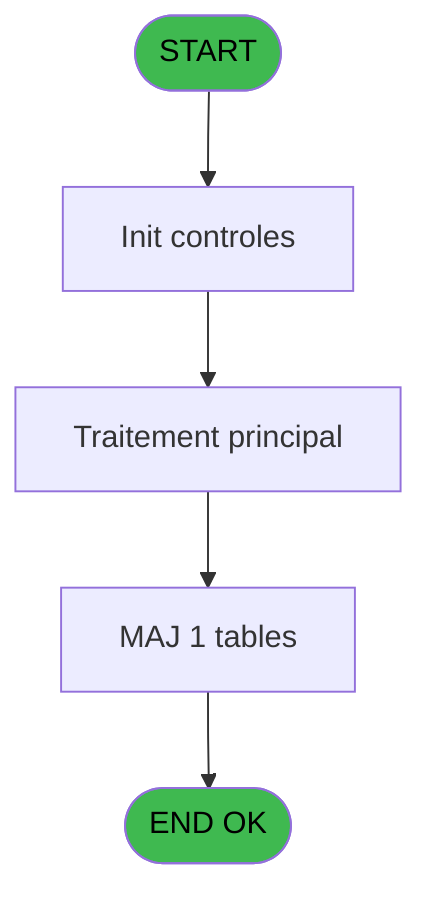
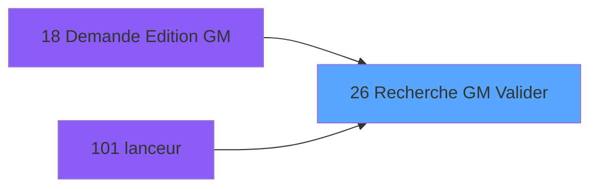

# PBP IDE 26 - Recherche GM Valider

> **Analyse**: Phases 1-4 2026-02-03 01:13 -> 01:14 (39s) | Assemblage 01:14
> **Pipeline**: V7.2 Enrichi
> **Structure**: 4 onglets (Resume | Ecrans | Donnees | Connexions)

<!-- TAB:Resume -->

## 1. FICHE D'IDENTITE

| Attribut | Valeur |
|----------|--------|
| Projet | PBP |
| IDE Position | 26 |
| Nom Programme | Recherche GM Valider |
| Fichier source | `Prg_26.xml` |
| Domaine metier | Consultation |
| Taches | 4 (0 ecrans visibles) |
| Tables modifiees | 1 |
| Programmes appeles | 0 |

## 2. DESCRIPTION FONCTIONNELLE

**Recherche GM Valider** assure la gestion complete de ce processus, accessible depuis [Demande Edition GM (IDE 18)](PBP-IDE-18.md), [lanceur (IDE 101)](PBP-IDE-101.md).

Le flux de traitement s'organise en **3 blocs fonctionnels** :

- **Consultation** (2 taches) : ecrans de recherche, selection et consultation
- **Validation** (1 tache) : controles et verifications de coherence
- **Traitement** (1 tache) : traitements metier divers

**Donnees modifiees** : 1 tables en ecriture (tempo_selection).

Detail : phases du traitement

#### Phase 1 : Validation (1 tache)

- **26** - Rechercge GM Valider

#### Phase 2 : Traitement (1 tache)

- **26.1** - Complete

#### Phase 3 : Consultation (2 taches)

- **26.2** - Recherche cabine
- **26.3** - Recherche muster

#### Tables impactees

| Table | Operations | Role metier |
|-------|-----------|-------------|
| tempo_selection | **W** (1 usages) | Table temporaire ecran |

## 3. BLOCS FONCTIONNELS

### 3.1 Validation (1 tache)

Controles de coherence : 1 tache verifie les donnees et conditions.

---

#### 26 - Rechercge GM Valider

**Role** : Verification : Rechercge GM Valider.

### 3.2 Traitement (1 tache)

Traitements internes.

---

#### 26.1 - Complete

**Role** : Traitement : Complete.

### 3.3 Consultation (2 taches)

Ecrans de recherche et consultation.

---

#### 26.2 - Recherche cabine

**Role** : Traitement : Recherche cabine.
**Variables liees** : B (v. cabine)

---

#### 26.3 - Recherche muster

**Role** : Traitement : Recherche muster.
**Variables liees** : C (v. muster)

## 5. REGLES METIER

*(Aucune regle metier identifiee)*

## 6. CONTEXTE

- **Appele par**: [Demande Edition GM (IDE 18)](PBP-IDE-18.md), [lanceur (IDE 101)](PBP-IDE-101.md)
- **Appelle**: 0 programmes | **Tables**: 8 (W:1 R:3 L:4) | **Taches**: 4 | **Expressions**: 9

<!-- TAB:Ecrans -->

## 8. ECRANS

*(Programme sans ecran visible)*

## 9. NAVIGATION

### 9.3 Structure hierarchique (4 taches)

| Position | Tache | Type | Dimensions | Bloc |
|----------|-------|------|------------|------|
| **26.1** | [**Rechercge GM Valider** (26)](#t1) | MDI | - | Validation |
| **26.2** | [**Complete** (26.1)](#t2) | MDI | - | Traitement |
| **26.3** | [**Recherche cabine** (26.2)](#t3) | MDI | - | Consultation |
| 26.3.1 | [Recherche muster (26.3)](#t4) | MDI | - | |

### 9.4 Algorigramme

> **Legende**: Vert = START/END OK | Rouge = END KO | Bleu = Decisions
> *Algorigramme auto-genere. Utiliser `/algorigramme` pour une synthese metier detaillee.*

<!-- TAB:Donnees -->

## 10. TABLES

### Tables utilisees (8)

| ID | Nom | Description | Type | R | W | L | Usages |
|----|-----|-------------|------|---|---|---|--------|
| 31 | gm-complet_______gmc |  | DB | R |   |   | 1 |
| 34 | hebergement______heb | Hebergement (chambres) | DB | R |   |   | 1 |
| 36 | client_gm |  | DB |   |   | L | 1 |
| 119 | tables_pays_tel_ |  | DB |   |   | L | 1 |
| 131 | fichier_validation |  | DB |   |   | L | 1 |
| 364 | pms_footer_comment |  | DB |   |   | L | 1 |
| 632 | tempo_selection | Table temporaire ecran | DB |   | **W** |   | 1 |
| 689 | sous_imputation_par_service | Services / filieres | DB | R |   |   | 1 |

### Colonnes par table (1 / 4 tables avec colonnes identifiees)

Table 31 - gm-complet_______gmc (R) - 1 usages

| Lettre | Variable | Acces | Type |
|--------|----------|-------|------|
| A | > Date | R | Date |
| B | v. cabine | R | Alpha |
| C | v. muster | R | Numeric |
| D | v. deck | R | Alpha |
| E | v. zone | R | Numeric |

Table 34 - hebergement______heb (R) - 1 usages

*Table utilisee uniquement en Link ou aucune colonne Real identifiee dans le DataView.*

Table 632 - tempo_selection (**W**) - 1 usages

*Table utilisee uniquement en Link ou aucune colonne Real identifiee dans le DataView.*

Table 689 - sous_imputation_par_service (R) - 1 usages

*Table utilisee uniquement en Link ou aucune colonne Real identifiee dans le DataView.*

## 11. VARIABLES

### 11.1 Variables de session (4)

Variables persistantes pendant toute la session.

| Lettre | Nom | Type | Usage dans |
|--------|-----|------|-----------|
| B | v. cabine | Alpha | [26.2](#t3) |
| C | v. muster | Numeric | [26.3](#t4) |
| D | v. deck | Alpha | 1x session |
| E | v. zone | Numeric | 1x session |

### 11.2 Autres (1)

Variables diverses.

| Lettre | Nom | Type | Usage dans |
|--------|-----|------|-----------|
| A | > Date | Date | 1x refs |

## 12. EXPRESSIONS

**9 / 9 expressions decodees (100%)**

### 12.1 Repartition par type

| Type | Expressions | Regles |
|------|-------------|--------|
| OTHER | 8 | 0 |
| CONDITION | 1 | 0 |

### 12.2 Expressions cles par type

#### OTHER (8 expressions)

| Type | IDE | Expression | Regle |
|------|-----|------------|-------|
| OTHER | 7 | `[K]` | - |
| OTHER | 6 | `GetParam ('LANGUE')` | - |
| OTHER | 9 | `[R]` | - |
| OTHER | 8 | `[V]` | - |
| OTHER | 2 | `v. zone [E]` | - |
| ... | | *+3 autres* | |

#### CONDITION (1 expressions)

| Type | IDE | Expression | Regle |
|------|-----|------------|-------|
| CONDITION | 4 | `Range (> Date [A],v. cabine [B],v. muster [C]) AND [AF]='O'` | - |

<!-- TAB:Connexions -->

## 13. GRAPHE D'APPELS

### 13.1 Chaine depuis Main (Callers)

Main -> ... -> [Demande Edition GM (IDE 18)](PBP-IDE-18.md) -> **Recherche GM Valider (IDE 26)**

Main -> ... -> [lanceur (IDE 101)](PBP-IDE-101.md) -> **Recherche GM Valider (IDE 26)**

### 13.2 Callers

| IDE | Nom Programme | Nb Appels |
|-----|---------------|-----------|
| [18](PBP-IDE-18.md) | Demande Edition GM | 2 |
| [101](PBP-IDE-101.md) | lanceur | 1 |

### 13.3 Callees (programmes appeles)

### 13.4 Detail Callees avec contexte

| IDE | Nom Programme | Appels | Contexte |
|-----|---------------|--------|----------|
| - | (aucun) | - | - |

## 14. RECOMMANDATIONS MIGRATION

### 14.1 Profil du programme

| Metrique | Valeur | Impact migration |
|----------|--------|-----------------|
| Lignes de logique | 136 | Programme compact |
| Expressions | 9 | Peu de logique |
| Tables WRITE | 1 | Impact faible |
| Sous-programmes | 0 | Peu de dependances |
| Ecrans visibles | 0 | Ecran unique ou traitement batch |
| Code desactive | 0% (0 / 136) | Code sain |
| Regles metier | 0 | Pas de regle identifiee |

### 14.2 Plan de migration par bloc

#### Validation (1 tache: 0 ecran, 1 traitement)

- **Strategie** : FluentValidation avec validators specifiques.
- Chaque tache de validation -> un validator injectable

#### Traitement (1 tache: 0 ecran, 1 traitement)

- **Strategie** : 1 service(s) backend injectable(s) (Domain Services).
- Decomposer les taches en services unitaires testables.

#### Consultation (2 taches: 0 ecran, 2 traitements)

- **Strategie** : Composants de recherche/selection en modales.

### 14.3 Dependances critiques

| Dependance | Type | Appels | Impact |
|------------|------|--------|--------|
| tempo_selection | Table WRITE (Database) | 1x | Schema + repository |

---
*Spec DETAILED generee par Pipeline V7.2 - 2026-02-03 01:14*
