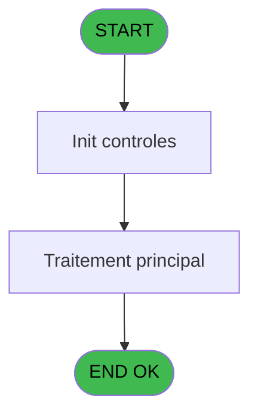
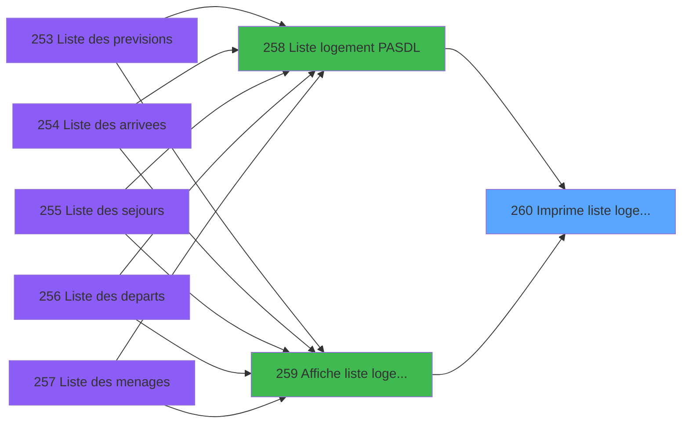

# PBP IDE 260 - Imprime liste logement AL

> **Analyse**: Phases 1-4 2026-02-03 16:02 -> 16:02 (10s) | Assemblage 16:02
> **Pipeline**: V7.2 Enrichi
> **Structure**: 4 onglets (Resume | Ecrans | Donnees | Connexions)

<!-- TAB:Resume -->

## 1. FICHE D'IDENTITE

| Attribut | Valeur |
|----------|--------|
| Projet | PBP |
| IDE Position | 260 |
| Nom Programme | Imprime liste logement AL |
| Fichier source | `Prg_260.xml` |
| Dossier IDE | Logement |
| Taches | 2 (1 ecrans visibles) |
| Tables modifiees | 0 |
| Programmes appeles | 0 |

## 2. DESCRIPTION FONCTIONNELLE

**Imprime liste logement AL** assure la gestion complete de ce processus, accessible depuis [  Liste logement PASDL (IDE 258)](PBP-IDE-258.md), [  Affiche liste logement (IDE 259)](PBP-IDE-259.md).

Le flux de traitement s'organise en **1 blocs fonctionnels** :

- **Traitement** (2 taches) : traitements metier divers

**Logique metier** : 3 regles identifiees couvrant conditions metier.

## 3. BLOCS FONCTIONNELS

### 3.1 Traitement (2 taches)

Traitements internes.

---

#### 260 - Veuillez patienter... [[ECRAN]](#ecran-t1)

**Role** : Traitement : Veuillez patienter....
**Ecran** : 424 x 56 DLU (MDI) | [Voir mockup](#ecran-t1)

---

#### 260.1 - Vérification si lit Zippable

**Role** : Traitement : Vérification si lit Zippable.
**Variables liees** : G (V.Zippable (Lit matrimonial))

## 5. REGLES METIER

3 regles identifiees:

### Autres (3 regles)

#### [RM-001] Traitement si VG42,IF ([CG] est renseigne

| Element | Detail |
|---------|--------|
| **Condition** | `VG42` |
| **Si vrai** | IF ([CG]<>'' |
| **Si faux** | [CG],[AB]),IF ([AN]<>'',[AN],[AB])) |
| **Expression source** | Expression 15 : `IF(VG42,IF ([CG]<>'',[CG],[AB]),IF ([AN]<>'',[AN],[AB]))` |
| **Exemple** | Si VG42 → IF ([CG]<>''. Sinon → [CG],[AB]),IF ([AN]<>'',[AN],[AB])) |

#### [RM-002] Si VG88 alors TStr([CH] sinon 'HHhMMZ'),Trim ([AA])&'h00')

| Element | Detail |
|---------|--------|
| **Condition** | `VG88` |
| **Si vrai** | TStr([CH] |
| **Si faux** | 'HHhMMZ'),Trim ([AA])&'h00') |
| **Expression source** | Expression 17 : `IF(VG88,TStr([CH],'HHhMMZ'),Trim ([AA])&'h00')` |
| **Exemple** | Si VG88 → TStr([CH]. Sinon → 'HHhMMZ'),Trim ([AA])&'h00') |

#### [RM-003] Si [AD]='Oui' alors 'V' sinon [AD])

| Element | Detail |
|---------|--------|
| **Condition** | `[AD]='Oui'` |
| **Si vrai** | 'V' |
| **Si faux** | [AD]) |
| **Expression source** | Expression 20 : `IF([AD]='Oui','V',[AD])` |
| **Exemple** | Si [AD]='Oui' → 'V'. Sinon → [AD]) |

## 6. CONTEXTE

- **Appele par**: [  Liste logement PASDL (IDE 258)](PBP-IDE-258.md), [  Affiche liste logement (IDE 259)](PBP-IDE-259.md)
- **Appelle**: 0 programmes | **Tables**: 3 (W:0 R:1 L:2) | **Taches**: 2 | **Expressions**: 20

<!-- TAB:Ecrans -->

## 8. ECRANS

### 8.1 Forms visibles (1 / 2)

| # | Position | Tache | Nom | Type | Largeur | Hauteur | Bloc |
|---|----------|-------|-----|------|---------|---------|------|
| 1 | 260 | 260 | Veuillez patienter... | MDI | 424 | 56 | Traitement |

### 8.2 Mockups Ecrans

---

#### 260 - Veuillez patienter...
**Tache** : [260](#t1) | **Type** : MDI | **Dimensions** : 424 x 56 DLU
**Bloc** : Traitement | **Titre IDE** : Veuillez patienter...

<!-- FORM-DATA:
{
    "width":  424,
    "vFactor":  8,
    "type":  "MDI",
    "hFactor":  8,
    "controls":  [
                     {
                         "x":  0,
                         "type":  "label",
                         "var":  "",
                         "y":  0,
                         "w":  423,
                         "fmt":  "",
                         "name":  "",
                         "h":  29,
                         "color":  "",
                         "text":  "",
                         "parent":  null
                     },
                     {
                         "x":  120,
                         "type":  "label",
                         "var":  "",
                         "y":  10,
                         "w":  221,
                         "fmt":  "",
                         "name":  "",
                         "h":  8,
                         "color":  "7",
                         "text":  "Traitement en cours ...",
                         "parent":  null
                     },
                     {
                         "x":  0,
                         "type":  "label",
                         "var":  "",
                         "y":  29,
                         "w":  423,
                         "fmt":  "",
                         "name":  "",
                         "h":  27,
                         "color":  "",
                         "text":  "",
                         "parent":  null
                     },
                     {
                         "x":  72,
                         "type":  "label",
                         "var":  "",
                         "y":  38,
                         "w":  267,
                         "fmt":  "",
                         "name":  "",
                         "h":  8,
                         "color":  "",
                         "text":  "Edition de la liste",
                         "parent":  null
                     },
                     {
                         "x":  4,
                         "type":  "image",
                         "var":  "",
                         "y":  2,
                         "w":  72,
                         "fmt":  "",
                         "name":  "",
                         "h":  25,
                         "color":  "",
                         "text":  "",
                         "parent":  null
                     }
                 ],
    "taskId":  "260",
    "height":  56
}
-->

## 9. NAVIGATION

Ecran unique: **Veuillez patienter...**

### 9.3 Structure hierarchique (2 taches)

| Position | Tache | Type | Dimensions | Bloc |
|----------|-------|------|------------|------|
| **260.1** | [**Veuillez patienter...** (260)](#t1) [mockup](#ecran-t1) | MDI | 424x56 | Traitement |
| 260.1.1 | [Vérification si lit Zippable (260.1)](#t16) | - | - | |

### 9.4 Algorigramme

> **Legende**: Vert = START/END OK | Rouge = END KO | Bleu = Decisions
> *Algorigramme auto-genere. Utiliser `/algorigramme` pour une synthese metier detaillee.*

<!-- TAB:Donnees -->

## 10. TABLES

### Tables utilisees (3)

| ID | Nom | Description | Type | R | W | L | Usages |
|----|-----|-------------|------|---|---|---|--------|
| 358 | import_mod |  | DB |   |   | L | 1 |
| 479 | gestion_devise_session | Sessions de caisse | TMP |   |   | L | 1 |
| 616 | tempo_synthese | Table temporaire ecran | TMP | R |   |   | 1 |

### Colonnes par table (1 / 1 tables avec colonnes identifiees)

Table 616 - tempo_synthese (R) - 1 usages

| Lettre | Variable | Acces | Type |
|--------|----------|-------|------|
| A | >DateSel | R | Date |
| B | >TitreEdit | R | Alpha |
| C | > Code Trt (A/D/P) | R | Unicode |
| D | >Total | R | Numeric |
| E | >NbSelect | R | Numeric |
| F | > seminaire | R | Alpha |
| G | V.Zippable (Lit matrimonial) | R | Unicode |
| H | w0_NbLogement | R | Numeric |
| I | w0_NbPersonnes | R | Numeric |

## 11. VARIABLES

### 11.1 Variables de session (1)

Variables persistantes pendant toute la session.

| Lettre | Nom | Type | Usage dans |
|--------|-----|------|-----------|
| G | V.Zippable (Lit matrimonial) | Unicode | - |

### 11.2 Autres (8)

Variables diverses.

| Lettre | Nom | Type | Usage dans |
|--------|-----|------|-----------|
| A | >DateSel | Date | - |
| B | >TitreEdit | Alpha | - |
| C | > Code Trt (A/D/P) | Unicode | - |
| D | >Total | Numeric | - |
| E | >NbSelect | Numeric | 2x refs |
| F | > seminaire | Alpha | - |
| H | w0_NbLogement | Numeric | - |
| I | w0_NbPersonnes | Numeric | 2x refs |

## 12. EXPRESSIONS

**20 / 20 expressions decodees (100%)**

### 12.1 Repartition par type

| Type | Expressions | Regles |
|------|-------------|--------|
| CALCULATION | 2 | 0 |
| CONCATENATION | 3 | 0 |
| CONDITION | 8 | 3 |
| CONSTANTE | 1 | 0 |
| OTHER | 4 | 0 |
| REFERENCE_VG | 1 | 0 |
| STRING | 1 | 0 |

### 12.2 Expressions cles par type

#### CALCULATION (2 expressions)

| Type | IDE | Expression | Regle |
|------|-----|------------|-------|
| CALCULATION | 7 | `[AP]+1` | - |
| CALCULATION | 5 | `[AO]+1` | - |

#### CONCATENATION (3 expressions)

| Type | IDE | Expression | Regle |
|------|-----|------------|-------|
| CONCATENATION | 11 | `MlsTrans ('Seminaire')&' '&Trim (>NbSelect [E])` | - |
| CONCATENATION | 8 | `MlsTrans ('Edition du')&' '&DStr (Date (),'DD/MM/YYYY')&' '&MlsTrans ('à')&' '&TStr (Time (),'HH:MM:SS')` | - |
| CONCATENATION | 9 | `'- '&Str (Page (0,1),'3P0Z0')&' -'` | - |

#### CONDITION (8 expressions)

| Type | IDE | Expression | Regle |
|------|-----|------------|-------|
| CONDITION | 20 | `IF([AD]='Oui','V',[AD])` | [RM-003](#rm-RM-003) |
| CONDITION | 17 | `IF(VG88,TStr([CH],'HHhMMZ'),Trim ([AA])&'h00')` | [RM-002](#rm-RM-002) |
| CONDITION | 15 | `IF(VG42,IF ([CG]<>'',[CG],[AB]),IF ([AN]<>'',[AN],[AB]))` | [RM-001](#rm-RM-001) |
| CONDITION | 18 | `[CL]='S' OR [CL]='P'` | - |
| CONDITION | 19 | `([CL]='S' OR [CL]='P') AND Trim(w0_NbPersonnes [I])<>''` | - |
| ... | | *+3 autres* | |

#### CONSTANTE (1 expressions)

| Type | IDE | Expression | Regle |
|------|-----|------------|-------|
| CONSTANTE | 4 | `0` | - |

#### OTHER (4 expressions)

| Type | IDE | Expression | Regle |
|------|-----|------------|-------|
| OTHER | 13 | `[AE]` | - |
| OTHER | 14 | `[AF]` | - |
| OTHER | 1 | `'Village '&GetParam ('VILLAGE')` | - |
| OTHER | 2 | `GetParam ('SOCIETE')` | - |

#### REFERENCE_VG (1 expressions)

| Type | IDE | Expression | Regle |
|------|-----|------------|-------|
| REFERENCE_VG | 3 | `VG1` | - |

#### STRING (1 expressions)

| Type | IDE | Expression | Regle |
|------|-----|------------|-------|
| STRING | 16 | `Trim ([Y])&'h'` | - |

<!-- TAB:Connexions -->

## 13. GRAPHE D'APPELS

### 13.1 Chaine depuis Main (Callers)

Main -> ... -> [  Liste logement PASDL (IDE 258)](PBP-IDE-258.md) -> **Imprime liste logement AL (IDE 260)**

Main -> ... -> [  Affiche liste logement (IDE 259)](PBP-IDE-259.md) -> **Imprime liste logement AL (IDE 260)**

### 13.2 Callers

| IDE | Nom Programme | Nb Appels |
|-----|---------------|-----------|
| [258](PBP-IDE-258.md) |   Liste logement PASDL | 2 |
| [259](PBP-IDE-259.md) |   Affiche liste logement | 1 |

### 13.3 Callees (programmes appeles)

### 13.4 Detail Callees avec contexte

| IDE | Nom Programme | Appels | Contexte |
|-----|---------------|--------|----------|
| - | (aucun) | - | - |

## 14. RECOMMANDATIONS MIGRATION

### 14.1 Profil du programme

| Metrique | Valeur | Impact migration |
|----------|--------|-----------------|
| Lignes de logique | 73 | Programme compact |
| Expressions | 20 | Peu de logique |
| Tables WRITE | 0 | Impact faible |
| Sous-programmes | 0 | Peu de dependances |
| Ecrans visibles | 1 | Ecran unique ou traitement batch |
| Code desactive | 2.7% (2 / 73) | Code sain |
| Regles metier | 3 | Quelques regles a preserver |

### 14.2 Plan de migration par bloc

#### Traitement (2 taches: 1 ecran, 1 traitement)

- **Strategie** : Orchestrateur avec 1 ecrans (Razor/React) et 1 traitements backend (services).
- Les ecrans deviennent des composants UI, les traitements invisibles deviennent des services injectables.
- Decomposer les taches en services unitaires testables.

### 14.3 Dependances critiques

| Dependance | Type | Appels | Impact |
|------------|------|--------|--------|

---
*Spec DETAILED generee par Pipeline V7.2 - 2026-02-03 16:02*
