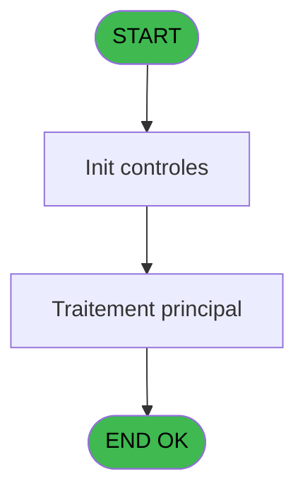
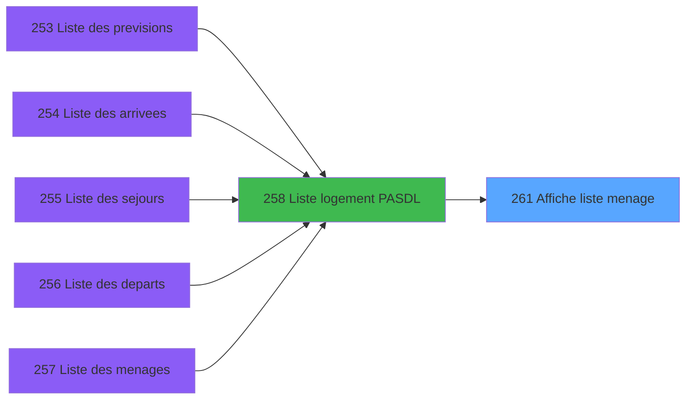
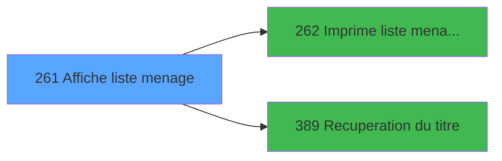

# PBP IDE 261 - Affiche liste menage

> **Analyse**: Phases 1-4 2026-02-03 16:02 -> 16:02 (11s) | Assemblage 16:02
> **Pipeline**: V7.2 Enrichi
> **Structure**: 4 onglets (Resume | Ecrans | Donnees | Connexions)

<!-- TAB:Resume -->

## 1. FICHE D'IDENTITE

| Attribut | Valeur |
|----------|--------|
| Projet | PBP |
| IDE Position | 261 |
| Nom Programme | Affiche liste menage |
| Fichier source | `Prg_261.xml` |
| Dossier IDE | Logement |
| Taches | 1 (1 ecrans visibles) |
| Tables modifiees | 0 |
| Programmes appeles | 2 |

## 2. DESCRIPTION FONCTIONNELLE

**Affiche liste menage** assure la gestion complete de ce processus, accessible depuis [  Liste logement PASDL (IDE 258)](PBP-IDE-258.md).

Le flux de traitement s'organise en **1 blocs fonctionnels** :

- **Consultation** (1 tache) : ecrans de recherche, selection et consultation

**Logique metier** : 4 regles identifiees couvrant conditions metier.

## 3. BLOCS FONCTIONNELS

### 3.1 Consultation (1 tache)

Ecrans de recherche et consultation.

---

#### 261 - Affiche recherche [[ECRAN]](#ecran-t1)

**Role** : Reinitialisation : Affiche recherche.
**Ecran** : 1208 x 231 DLU (MDI) | [Voir mockup](#ecran-t1)

## 5. REGLES METIER

4 regles identifiees:

### Autres (4 regles)

#### [RM-001] Si Left ([K] alors 1)='S' sinon 'Secteur','Zone')

| Element | Detail |
|---------|--------|
| **Condition** | `Left ([K]` |
| **Si vrai** | 1)='S' |
| **Si faux** | 'Secteur','Zone') |
| **Expression source** | Expression 8 : `IF (Left ([K],1)='S','Secteur','Zone')` |
| **Exemple** | Si Left ([K] → 1)='S'. Sinon → 'Secteur','Zone') |

#### [RM-002] Si VG88 AND [BQ] alors TStr([BR] sinon 'HHhMMZ'),[M])&IF(Left([FC],2)='VV',' VV','')

| Element | Detail |
|---------|--------|
| **Condition** | `VG88 AND [BQ]` |
| **Si vrai** | TStr([BR] |
| **Si faux** | 'HHhMMZ'),[M])&IF(Left([FC],2)='VV',' VV','') |
| **Expression source** | Expression 14 : `IF(VG88 AND [BQ],TStr([BR],'HHhMMZ'),[M])&IF(Left([FC],2)='V` |
| **Exemple** | Si VG88 AND [BQ] → TStr([BR]. Sinon → 'HHhMMZ'),[M])&IF(Left([FC],2)='VV',' VV','') |

#### [RM-003] Si Trim([BS]&'-'&[BT])='-' alors '' sinon [BS]&'-'&[BT])

| Element | Detail |
|---------|--------|
| **Condition** | `Trim([BS]&'-'&[BT])='-'` |
| **Si vrai** | '' |
| **Si faux** | [BS]&'-'&[BT]) |
| **Expression source** | Expression 15 : `IF(Trim([BS]&'-'&[BT])='-','',[BS]&'-'&[BT])` |
| **Exemple** | Si Trim([BS]&'-'&[BT])='-' → ''. Sinon → [BS]&'-'&[BT]) |

#### [RM-004] Si Trim([L])='-' alors '' sinon [L])

| Element | Detail |
|---------|--------|
| **Condition** | `Trim([L])='-'` |
| **Si vrai** | '' |
| **Si faux** | [L]) |
| **Expression source** | Expression 16 : `IF(Trim([L])='-','',[L])` |
| **Exemple** | Si Trim([L])='-' → ''. Sinon → [L]) |

## 6. CONTEXTE

- **Appele par**: [  Liste logement PASDL (IDE 258)](PBP-IDE-258.md)
- **Appelle**: 2 programmes | **Tables**: 2 (W:0 R:1 L:1) | **Taches**: 1 | **Expressions**: 29

<!-- TAB:Ecrans -->

## 8. ECRANS

### 8.1 Forms visibles (1 / 1)

| # | Position | Tache | Nom | Type | Largeur | Hauteur | Bloc |
|---|----------|-------|-----|------|---------|---------|------|
| 1 | 261 | 261 | Affiche recherche | MDI | 1208 | 231 | Consultation |

### 8.2 Mockups Ecrans

---

#### 261 - Affiche recherche
**Tache** : [261](#t1) | **Type** : MDI | **Dimensions** : 1208 x 231 DLU
**Bloc** : Consultation | **Titre IDE** : Affiche recherche

<!-- FORM-DATA:
{
    "width":  1208,
    "vFactor":  8,
    "type":  "MDI",
    "hFactor":  8,
    "controls":  [
                     {
                         "x":  0,
                         "type":  "label",
                         "var":  "",
                         "y":  1,
                         "w":  1205,
                         "fmt":  "",
                         "name":  "",
                         "h":  23,
                         "color":  "",
                         "text":  "",
                         "parent":  null
                     },
                     {
                         "x":  0,
                         "type":  "table",
                         "var":  "",
                         "name":  "",
                         "titleH":  12,
                         "color":  "110",
                         "w":  1022,
                         "y":  27,
                         "fmt":  "",
                         "parent":  null,
                         "text":  "",
                         "rowH":  14,
                         "h":  127,
                         "cols":  [
                                      {
                                          "title":  "Logement",
                                          "layer":  1,
                                          "w":  97
                                      },
                                      {
                                          "title":  "Secteur",
                                          "layer":  2,
                                          "w":  102
                                      },
                                      {
                                          "title":  "Qualité",
                                          "layer":  3,
                                          "w":  103
                                      },
                                      {
                                          "title":  "",
                                          "layer":  4,
                                          "w":  135
                                      },
                                      {
                                          "title":  "Départ",
                                          "layer":  5,
                                          "w":  197
                                      },
                                      {
                                          "title":  "Arrivée",
                                          "layer":  6,
                                          "w":  194
                                      },
                                      {
                                          "title":  "Séjour",
                                          "layer":  7,
                                          "w":  160
                                      }
                                  ],
                         "rows":  7
                     },
                     {
                         "x":  1026,
                         "type":  "label",
                         "var":  "",
                         "y":  26,
                         "w":  178,
                         "fmt":  "",
                         "name":  "",
                         "h":  126,
                         "color":  "",
                         "text":  "",
                         "parent":  null
                     },
                     {
                         "x":  1,
                         "type":  "label",
                         "var":  "",
                         "y":  153,
                         "w":  1204,
                         "fmt":  "",
                         "name":  "",
                         "h":  48,
                         "color":  "",
                         "text":  "",
                         "parent":  null
                     },
                     {
                         "x":  213,
                         "type":  "label",
                         "var":  "",
                         "y":  158,
                         "w":  227,
                         "fmt":  "",
                         "name":  "",
                         "h":  39,
                         "color":  "195",
                         "text":  "Départ",
                         "parent":  23
                     },
                     {
                         "x":  458,
                         "type":  "label",
                         "var":  "",
                         "y":  158,
                         "w":  227,
                         "fmt":  "",
                         "name":  "",
                         "h":  39,
                         "color":  "195",
                         "text":  "Arrivéee",
                         "parent":  23
                     },
                     {
                         "x":  701,
                         "type":  "label",
                         "var":  "",
                         "y":  158,
                         "w":  227,
                         "fmt":  "",
                         "name":  "",
                         "h":  39,
                         "color":  "195",
                         "text":  "Séjour",
                         "parent":  23
                     },
                     {
                         "x":  221,
                         "type":  "label",
                         "var":  "",
                         "y":  168,
                         "w":  66,
                         "fmt":  "",
                         "name":  "",
                         "h":  8,
                         "color":  "",
                         "text":  "Adultes",
                         "parent":  24
                     },
                     {
                         "x":  293,
                         "type":  "label",
                         "var":  "",
                         "y":  168,
                         "w":  66,
                         "fmt":  "",
                         "name":  "",
                         "h":  8,
                         "color":  "",
                         "text":  "Enfants",
                         "parent":  24
                     },
                     {
                         "x":  365,
                         "type":  "label",
                         "var":  "",
                         "y":  168,
                         "w":  66,
                         "fmt":  "",
                         "name":  "",
                         "h":  8,
                         "color":  "",
                         "text":  "Bébé",
                         "parent":  24
                     },
                     {
                         "x":  464,
                         "type":  "label",
                         "var":  "",
                         "y":  168,
                         "w":  66,
                         "fmt":  "",
                         "name":  "",
                         "h":  8,
                         "color":  "",
                         "text":  "Adultes",
                         "parent":  25
                     },
                     {
                         "x":  536,
                         "type":  "label",
                         "var":  "",
                         "y":  168,
                         "w":  66,
                         "fmt":  "",
                         "name":  "",
                         "h":  8,
                         "color":  "",
                         "text":  "Enfants",
                         "parent":  25
                     },
                     {
                         "x":  610,
                         "type":  "label",
                         "var":  "",
                         "y":  168,
                         "w":  66,
                         "fmt":  "",
                         "name":  "",
                         "h":  8,
                         "color":  "",
                         "text":  "Bébé",
                         "parent":  25
                     },
                     {
                         "x":  707,
                         "type":  "label",
                         "var":  "",
                         "y":  168,
                         "w":  66,
                         "fmt":  "",
                         "name":  "",
                         "h":  8,
                         "color":  "",
                         "text":  "Adultes",
                         "parent":  26
                     },
                     {
                         "x":  781,
                         "type":  "label",
                         "var":  "",
                         "y":  168,
                         "w":  66,
                         "fmt":  "",
                         "name":  "",
                         "h":  8,
                         "color":  "",
                         "text":  "Enfants",
                         "parent":  26
                     },
                     {
                         "x":  854,
                         "type":  "label",
                         "var":  "",
                         "y":  168,
                         "w":  66,
                         "fmt":  "",
                         "name":  "",
                         "h":  8,
                         "color":  "",
                         "text":  "Bébé",
                         "parent":  26
                     },
                     {
                         "x":  10,
                         "type":  "label",
                         "var":  "",
                         "y":  169,
                         "w":  75,
                         "fmt":  "",
                         "name":  "",
                         "h":  8,
                         "color":  "",
                         "text":  "Début",
                         "parent":  23
                     },
                     {
                         "x":  10,
                         "type":  "label",
                         "var":  "",
                         "y":  183,
                         "w":  30,
                         "fmt":  "",
                         "name":  "",
                         "h":  8,
                         "color":  "",
                         "text":  "Fin",
                         "parent":  23
                     },
                     {
                         "x":  0,
                         "type":  "label",
                         "var":  "",
                         "y":  205,
                         "w":  1207,
                         "fmt":  "",
                         "name":  "",
                         "h":  23,
                         "color":  "",
                         "text":  "",
                         "parent":  null
                     },
                     {
                         "x":  978,
                         "type":  "label",
                         "var":  "",
                         "y":  168,
                         "w":  136,
                         "fmt":  "",
                         "name":  "",
                         "h":  8,
                         "color":  "",
                         "text":  "Type chambre",
                         "parent":  23
                     },
                     {
                         "x":  11,
                         "type":  "edit",
                         "var":  "",
                         "y":  43,
                         "w":  75,
                         "fmt":  "U6",
                         "name":  "TMP Logement",
                         "h":  8,
                         "color":  "110",
                         "text":  "",
                         "parent":  6
                     },
                     {
                         "x":  109,
                         "type":  "edit",
                         "var":  "",
                         "y":  43,
                         "w":  42,
                         "fmt":  "",
                         "name":  "TMP Zone Menage",
                         "h":  8,
                         "color":  "110",
                         "text":  "",
                         "parent":  6
                     },
                     {
                         "x":  312,
                         "type":  "edit",
                         "var":  "",
                         "y":  43,
                         "w":  120,
                         "fmt":  "30",
                         "name":  "",
                         "h":  8,
                         "color":  "110",
                         "text":  "",
                         "parent":  6
                     },
                     {
                         "x":  449,
                         "type":  "edit",
                         "var":  "",
                         "y":  43,
                         "w":  98,
                         "fmt":  "30",
                         "name":  "",
                         "h":  8,
                         "color":  "110",
                         "text":  "",
                         "parent":  6
                     },
                     {
                         "x":  565,
                         "type":  "edit",
                         "var":  "",
                         "y":  43,
                         "w":  53,
                         "fmt":  "",
                         "name":  "",
                         "h":  8,
                         "color":  "110",
                         "text":  "",
                         "parent":  6
                     },
                     {
                         "x":  645,
                         "type":  "edit",
                         "var":  "",
                         "y":  43,
                         "w":  98,
                         "fmt":  "30",
                         "name":  "",
                         "h":  8,
                         "color":  "110",
                         "text":  "",
                         "parent":  6
                     },
                     {
                         "x":  760,
                         "type":  "edit",
                         "var":  "",
                         "y":  43,
                         "w":  53,
                         "fmt":  "",
                         "name":  "",
                         "h":  8,
                         "color":  "110",
                         "text":  "",
                         "parent":  6
                     },
                     {
                         "x":  833,
                         "type":  "edit",
                         "var":  "",
                         "y":  43,
                         "w":  64,
                         "fmt":  "",
                         "name":  "",
                         "h":  8,
                         "color":  "110",
                         "text":  "",
                         "parent":  6
                     },
                     {
                         "x":  921,
                         "type":  "edit",
                         "var":  "",
                         "y":  43,
                         "w":  53,
                         "fmt":  "",
                         "name":  "",
                         "h":  8,
                         "color":  "110",
                         "text":  "",
                         "parent":  6
                     },
                     {
                         "x":  101,
                         "type":  "edit",
                         "var":  "",
                         "y":  169,
                         "w":  101,
                         "fmt":  "",
                         "name":  "",
                         "h":  9,
                         "color":  "",
                         "text":  "",
                         "parent":  23
                     },
                     {
                         "x":  101,
                         "type":  "edit",
                         "var":  "",
                         "y":  183,
                         "w":  101,
                         "fmt":  "",
                         "name":  "",
                         "h":  9,
                         "color":  "",
                         "text":  "",
                         "parent":  23
                     },
                     {
                         "x":  221,
                         "type":  "edit",
                         "var":  "",
                         "y":  182,
                         "w":  64,
                         "fmt":  "",
                         "name":  "",
                         "h":  10,
                         "color":  "",
                         "text":  "",
                         "parent":  24
                     },
                     {
                         "x":  293,
                         "type":  "edit",
                         "var":  "",
                         "y":  182,
                         "w":  66,
                         "fmt":  "",
                         "name":  "",
                         "h":  10,
                         "color":  "",
                         "text":  "",
                         "parent":  24
                     },
                     {
                         "x":  365,
                         "type":  "edit",
                         "var":  "",
                         "y":  182,
                         "w":  66,
                         "fmt":  "",
                         "name":  "",
                         "h":  10,
                         "color":  "",
                         "text":  "",
                         "parent":  24
                     },
                     {
                         "x":  464,
                         "type":  "edit",
                         "var":  "",
                         "y":  182,
                         "w":  64,
                         "fmt":  "",
                         "name":  "",
                         "h":  10,
                         "color":  "",
                         "text":  "",
                         "parent":  25
                     },
                     {
                         "x":  536,
                         "type":  "edit",
                         "var":  "",
                         "y":  182,
                         "w":  66,
                         "fmt":  "",
                         "name":  "",
                         "h":  10,
                         "color":  "",
                         "text":  "",
                         "parent":  25
                     },
                     {
                         "x":  610,
                         "type":  "edit",
                         "var":  "",
                         "y":  182,
                         "w":  66,
                         "fmt":  "",
                         "name":  "",
                         "h":  10,
                         "color":  "",
                         "text":  "",
                         "parent":  25
                     },
                     {
                         "x":  707,
                         "type":  "edit",
                         "var":  "",
                         "y":  182,
                         "w":  64,
                         "fmt":  "",
                         "name":  "",
                         "h":  10,
                         "color":  "",
                         "text":  "",
                         "parent":  26
                     },
                     {
                         "x":  781,
                         "type":  "edit",
                         "var":  "",
                         "y":  182,
                         "w":  66,
                         "fmt":  "",
                         "name":  "",
                         "h":  10,
                         "color":  "",
                         "text":  "",
                         "parent":  26
                     },
                     {
                         "x":  854,
                         "type":  "edit",
                         "var":  "",
                         "y":  182,
                         "w":  66,
                         "fmt":  "",
                         "name":  "",
                         "h":  10,
                         "color":  "",
                         "text":  "",
                         "parent":  26
                     },
                     {
                         "x":  1033,
                         "type":  "button",
                         "var":  "",
                         "y":  125,
                         "w":  154,
                         "fmt":  "\u0026Impression",
                         "name":  "b_Imprimer",
                         "h":  18,
                         "color":  "",
                         "text":  "",
                         "parent":  null
                     },
                     {
                         "x":  7,
                         "type":  "button",
                         "var":  "",
                         "y":  208,
                         "w":  154,
                         "fmt":  "\u0026Quitter",
                         "name":  "b_Quitter",
                         "h":  18,
                         "color":  "",
                         "text":  "",
                         "parent":  49
                     },
                     {
                         "x":  8,
                         "type":  "edit",
                         "var":  "",
                         "y":  4,
                         "w":  395,
                         "fmt":  "30",
                         "name":  "",
                         "h":  8,
                         "color":  "",
                         "text":  "",
                         "parent":  1
                     },
                     {
                         "x":  377,
                         "type":  "edit",
                         "var":  "",
                         "y":  4,
                         "w":  344,
                         "fmt":  "30",
                         "name":  "",
                         "h":  8,
                         "color":  "",
                         "text":  "",
                         "parent":  null
                     },
                     {
                         "x":  976,
                         "type":  "edit",
                         "var":  "",
                         "y":  4,
                         "w":  203,
                         "fmt":  "WWW DD MMM YYYYT",
                         "name":  "",
                         "h":  8,
                         "color":  "",
                         "text":  "",
                         "parent":  1
                     },
                     {
                         "x":  8,
                         "type":  "edit",
                         "var":  "",
                         "y":  13,
                         "w":  331,
                         "fmt":  "25",
                         "name":  "",
                         "h":  8,
                         "color":  "",
                         "text":  "",
                         "parent":  1
                     },
                     {
                         "x":  1037,
                         "type":  "image",
                         "var":  "",
                         "y":  43,
                         "w":  152,
                         "fmt":  "",
                         "name":  "",
                         "h":  78,
                         "color":  "",
                         "text":  "",
                         "parent":  7
                     },
                     {
                         "x":  205,
                         "type":  "edit",
                         "var":  "",
                         "y":  43,
                         "w":  96,
                         "fmt":  "30",
                         "name":  "",
                         "h":  8,
                         "color":  "110",
                         "text":  "",
                         "parent":  6
                     },
                     {
                         "x":  978,
                         "type":  "edit",
                         "var":  "",
                         "y":  183,
                         "w":  133,
                         "fmt":  "30",
                         "name":  "",
                         "h":  9,
                         "color":  "",
                         "text":  "",
                         "parent":  23
                     }
                 ],
    "taskId":  "261",
    "height":  231
}
-->

<strong>Champs : 26 champs</strong>

| Pos (x,y) | Nom | Variable | Type |
|-----------|-----|----------|------|
| 11,43 | TMP Logement | - | edit |
| 109,43 | TMP Zone Menage | - | edit |
| 312,43 | 30 | - | edit |
| 449,43 | 30 | - | edit |
| 565,43 | (sans nom) | - | edit |
| 645,43 | 30 | - | edit |
| 760,43 | (sans nom) | - | edit |
| 833,43 | (sans nom) | - | edit |
| 921,43 | (sans nom) | - | edit |
| 101,169 | (sans nom) | - | edit |
| 101,183 | (sans nom) | - | edit |
| 221,182 | (sans nom) | - | edit |
| 293,182 | (sans nom) | - | edit |
| 365,182 | (sans nom) | - | edit |
| 464,182 | (sans nom) | - | edit |
| 536,182 | (sans nom) | - | edit |
| 610,182 | (sans nom) | - | edit |
| 707,182 | (sans nom) | - | edit |
| 781,182 | (sans nom) | - | edit |
| 854,182 | (sans nom) | - | edit |
| 8,4 | 30 | - | edit |
| 377,4 | 30 | - | edit |
| 976,4 | WWW DD MMM YYYYT | - | edit |
| 8,13 | 25 | - | edit |
| 205,43 | 30 | - | edit |
| 978,183 | 30 | - | edit |

<strong>Boutons : 2 boutons</strong>

| Bouton | Pos (x,y) | Action |
|--------|-----------|--------|
| Impression | 1033,125 | Bouton fonctionnel |
| Quitter | 7,208 | Quitte le programme |

## 9. NAVIGATION

Ecran unique: **Affiche recherche**

### 9.3 Structure hierarchique (1 tache)

| Position | Tache | Type | Dimensions | Bloc |
|----------|-------|------|------------|------|
| **261.1** | [**Affiche recherche** (261)](#t1) [mockup](#ecran-t1) | MDI | 1208x231 | Consultation |

### 9.4 Algorigramme

> **Legende**: Vert = START/END OK | Rouge = END KO | Bleu = Decisions
> *Algorigramme auto-genere. Utiliser `/algorigramme` pour une synthese metier detaillee.*

<!-- TAB:Donnees -->

## 10. TABLES

### Tables utilisees (2)

| ID | Nom | Description | Type | R | W | L | Usages |
|----|-----|-------------|------|---|---|---|--------|
| 34 | hebergement______heb | Hebergement (chambres) | DB | R |   |   | 1 |
| 613 | tempo_reception | Table temporaire ecran | TMP |   |   | L | 1 |

### Colonnes par table (1 / 1 tables avec colonnes identifiees)

Table 34 - hebergement______heb (R) - 1 usages

| Lettre | Variable | Acces | Type |
|--------|----------|-------|------|
| A | >DateDebut | R | Date |
| B | >TitreEdit | R | Alpha |
| C | >Total | R | Numeric |
| D | >NbSelect | R | Numeric |
| E | >Edt Code Fid ? | R | Logical |
| F | >Départ Libération | R | Logical |
| G | w0_TitreEcran | R | Alpha |
| H | b_Imprimer | R | Alpha |
| I | b_Quitter | R | Alpha |

## 11. VARIABLES

### 11.1 Autres (9)

Variables diverses.

| Lettre | Nom | Type | Usage dans |
|--------|-----|------|-----------|
| A | >DateDebut | Date | 1x refs |
| B | >TitreEdit | Alpha | - |
| C | >Total | Numeric | 1x refs |
| D | >NbSelect | Numeric | 1x refs |
| E | >Edt Code Fid ? | Logical | - |
| F | >Départ Libération | Logical | 1x refs |
| G | w0_TitreEcran | Alpha | - |
| H | b_Imprimer | Alpha | - |
| I | b_Quitter | Alpha | - |

## 12. EXPRESSIONS

**29 / 29 expressions decodees (100%)**

### 12.1 Repartition par type

| Type | Expressions | Regles |
|------|-------------|--------|
| CONCATENATION | 2 | 0 |
| CONDITION | 7 | 4 |
| CONSTANTE | 7 | 0 |
| DATE | 1 | 0 |
| OTHER | 10 | 0 |
| REFERENCE_VG | 2 | 0 |

### 12.2 Expressions cles par type

#### CONCATENATION (2 expressions)

| Type | IDE | Expression | Regle |
|------|-----|------------|-------|
| CONCATENATION | 13 | `MlsTrans ('Selection')&' '&Trim (Str (>NbSelect [D],'4'))&' '&MlsTrans ('sur')&' '&Trim (Str (>Total [C],'4'))` | - |
| CONCATENATION | 17 | `Trim([BU])&' - '&Trim([BV])` | - |

#### CONDITION (7 expressions)

| Type | IDE | Expression | Regle |
|------|-----|------------|-------|
| CONDITION | 15 | `IF(Trim([BS]&'-'&[BT])='-','',[BS]&'-'&[BT])` | [RM-003](#rm-RM-003) |
| CONDITION | 16 | `IF(Trim([L])='-','',[L])` | [RM-004](#rm-RM-004) |
| CONDITION | 8 | `IF (Left ([K],1)='S','Secteur','Zone')` | [RM-001](#rm-RM-001) |
| CONDITION | 14 | `IF(VG88 AND [BQ],TStr([BR],'HHhMMZ'),[M])&IF(Left([FC],2)='VV',' VV','')` | [RM-002](#rm-RM-002) |
| CONDITION | 5 | `Trim (>Départ Libération [F])` | - |
| ... | | *+2 autres* | |

#### CONSTANTE (7 expressions)

| Type | IDE | Expression | Regle |
|------|-----|------------|-------|
| CONSTANTE | 20 | `'A'` | - |
| CONSTANTE | 21 | `'Z'` | - |
| CONSTANTE | 25 | `'H'` | - |
| CONSTANTE | 18 | `'C'` | - |
| CONSTANTE | 4 | `56` | - |
| ... | | *+2 autres* | |

#### DATE (1 expressions)

| Type | IDE | Expression | Regle |
|------|-----|------------|-------|
| DATE | 7 | `Date ()` | - |

#### OTHER (10 expressions)

| Type | IDE | Expression | Regle |
|------|-----|------------|-------|
| OTHER | 26 | `[EF]` | - |
| OTHER | 23 | `MID([O],5,2)` | - |
| OTHER | 27 | `[EE]` | - |
| OTHER | 29 | `[EO]` | - |
| OTHER | 28 | `[EP]` | - |
| ... | | *+5 autres* | |

#### REFERENCE_VG (2 expressions)

| Type | IDE | Expression | Regle |
|------|-----|------------|-------|
| REFERENCE_VG | 6 | `VG2` | - |
| REFERENCE_VG | 3 | `VG1` | - |

### 12.3 Toutes les expressions (29)

Voir les 29 expressions

#### CONCATENATION (2)

| IDE | Expression Decodee |
|-----|-------------------|
| 17 | `Trim([BU])&' - '&Trim([BV])` |
| 13 | `MlsTrans ('Selection')&' '&Trim (Str (>NbSelect [D],'4'))&' '&MlsTrans ('sur')&' '&Trim (Str (>Total [C],'4'))` |

#### CONDITION (7)

| IDE | Expression Decodee |
|-----|-------------------|
| 8 | `IF (Left ([K],1)='S','Secteur','Zone')` |
| 14 | `IF(VG88 AND [BQ],TStr([BR],'HHhMMZ'),[M])&IF(Left([FC],2)='VV',' VV','')` |
| 15 | `IF(Trim([BS]&'-'&[BT])='-','',[BS]&'-'&[BT])` |
| 16 | `IF(Trim([L])='-','',[L])` |
| 19 | `>DateDebut [A]` |
| 24 | `[O]&IF(Left([FB],2)='VV',' VV','')` |
| 5 | `Trim (>Départ Libération [F])` |

#### CONSTANTE (7)

| IDE | Expression Decodee |
|-----|-------------------|
| 4 | `56` |
| 11 | `'&Imprimer'` |
| 12 | `'&Quitter'` |
| 18 | `'C'` |
| 20 | `'A'` |
| 21 | `'Z'` |
| 25 | `'H'` |

#### DATE (1)

| IDE | Expression Decodee |
|-----|-------------------|
| 7 | `Date ()` |

#### OTHER (10)

| IDE | Expression Decodee |
|-----|-------------------|
| 1 | `GetParam ('VILLAGE')` |
| 2 | `GetParam ('SOCIETE')` |
| 9 | `SetCrsr (2)` |
| 10 | `SetCrsr (1)` |
| 22 | `MID([M],5,2)` |
| 23 | `MID([O],5,2)` |
| 26 | `[EF]` |
| 27 | `[EE]` |
| 28 | `[EP]` |
| 29 | `[EO]` |

#### REFERENCE_VG (2)

| IDE | Expression Decodee |
|-----|-------------------|
| 3 | `VG1` |
| 6 | `VG2` |

<!-- TAB:Connexions -->

## 13. GRAPHE D'APPELS

### 13.1 Chaine depuis Main (Callers)

Main -> ... -> [  Liste logement PASDL (IDE 258)](PBP-IDE-258.md) -> **Affiche liste menage (IDE 261)**

### 13.2 Callers

| IDE | Nom Programme | Nb Appels |
|-----|---------------|-----------|
| [258](PBP-IDE-258.md) |   Liste logement PASDL | 1 |

### 13.3 Callees (programmes appeles)

### 13.4 Detail Callees avec contexte

| IDE | Nom Programme | Appels | Contexte |
|-----|---------------|--------|----------|
| [262](PBP-IDE-262.md) |   Imprime liste menage AL | 1 | Impression ticket/document |
| [389](PBP-IDE-389.md) | Recuperation du titre | 1 | Recuperation donnees |

## 14. RECOMMANDATIONS MIGRATION

### 14.1 Profil du programme

| Metrique | Valeur | Impact migration |
|----------|--------|-----------------|
| Lignes de logique | 82 | Programme compact |
| Expressions | 29 | Peu de logique |
| Tables WRITE | 0 | Impact faible |
| Sous-programmes | 2 | Peu de dependances |
| Ecrans visibles | 1 | Ecran unique ou traitement batch |
| Code desactive | 0% (0 / 82) | Code sain |
| Regles metier | 4 | Quelques regles a preserver |

### 14.2 Plan de migration par bloc

#### Consultation (1 tache: 1 ecran, 0 traitement)

- **Strategie** : Composants de recherche/selection en modales.
- 1 ecran : Affiche recherche

### 14.3 Dependances critiques

| Dependance | Type | Appels | Impact |
|------------|------|--------|--------|
| [Recuperation du titre (IDE 389)](PBP-IDE-389.md) | Sous-programme | 1x | Normale - Recuperation donnees |
| [  Imprime liste menage AL (IDE 262)](PBP-IDE-262.md) | Sous-programme | 1x | Normale - Impression ticket/document |

---
*Spec DETAILED generee par Pipeline V7.2 - 2026-02-03 16:02*
