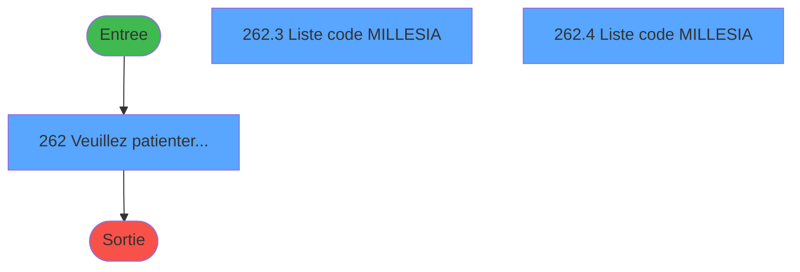
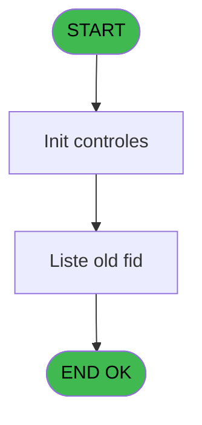
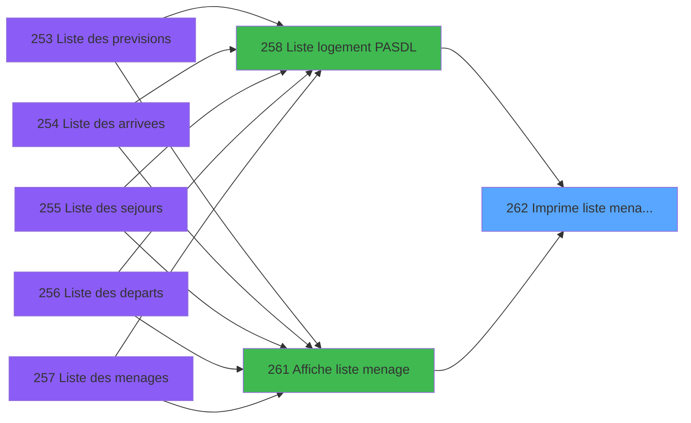

# PBP IDE 262 - Imprime liste menage AL

> **Analyse**: Phases 1-4 2026-02-03 16:02 -> 16:02 (11s) | Assemblage 16:02
> **Pipeline**: V7.2 Enrichi
> **Structure**: 4 onglets (Resume | Ecrans | Donnees | Connexions)

<!-- TAB:Resume -->

## 1. FICHE D'IDENTITE

| Attribut | Valeur |
|----------|--------|
| Projet | PBP |
| IDE Position | 262 |
| Nom Programme | Imprime liste menage AL |
| Fichier source | `Prg_262.xml` |
| Dossier IDE | Logement |
| Taches | 5 (3 ecrans visibles) |
| Tables modifiees | 0 |
| Programmes appeles | 0 |

## 2. DESCRIPTION FONCTIONNELLE

**Imprime liste menage AL** assure la gestion complete de ce processus, accessible depuis [  Liste logement PASDL (IDE 258)](PBP-IDE-258.md), [  Affiche liste menage (IDE 261)](PBP-IDE-261.md).

Le flux de traitement s'organise en **2 blocs fonctionnels** :

- **Traitement** (3 taches) : traitements metier divers
- **Consultation** (2 taches) : ecrans de recherche, selection et consultation

**Logique metier** : 5 regles identifiees couvrant conditions metier, valeurs par defaut.

Detail : phases du traitement

#### Phase 1 : Traitement (3 taches)

- **262** - Veuillez patienter... **[[ECRAN]](#ecran-t1)**
- **262.3** - Liste code MILLESIA **[[ECRAN]](#ecran-t4)**
- **262.4** - Liste code MILLESIA **[[ECRAN]](#ecran-t7)**

#### Phase 2 : Consultation (2 taches)

- **262.1** - Recherche Depart
- **262.2** - Recherche Arrivee

## 3. BLOCS FONCTIONNELS

### 3.1 Traitement (3 taches)

Traitements internes.

---

#### 262 - Veuillez patienter... [[ECRAN]](#ecran-t1)

**Role** : Traitement : Veuillez patienter....
**Ecran** : 424 x 56 DLU (MDI) | [Voir mockup](#ecran-t1)

---

#### 262.3 - Liste code MILLESIA [[ECRAN]](#ecran-t4)

**Role** : Traitement : Liste code MILLESIA.
**Ecran** : 1058 x 860 DLU (MDI) | [Voir mockup](#ecran-t4)
**Variables liees** : E (>Edt Code Fid ?)

---

#### 262.4 - Liste code MILLESIA [[ECRAN]](#ecran-t7)

**Role** : Traitement : Liste code MILLESIA.
**Ecran** : 1058 x 860 DLU (MDI) | [Voir mockup](#ecran-t7)
**Variables liees** : E (>Edt Code Fid ?)

### 3.2 Consultation (2 taches)

Ecrans de recherche et consultation.

---

#### 262.1 - Recherche Depart

**Role** : Traitement : Recherche Depart.
**Variables liees** : T (Existe VV Depart)

---

#### 262.2 - Recherche Arrivee

**Role** : Traitement : Recherche Arrivee.
**Variables liees** : S (Existe VV Arrivee)

## 5. REGLES METIER

5 regles identifiees:

### Autres (5 regles)

#### [RM-001] Valeur par defaut si wO_TotalSejE [N] est vide

| Element | Detail |
|---------|--------|
| **Condition** | `wO_TotalSejE [N]=''` |
| **Si vrai** | '' |
| **Si faux** | IF ([AS],'VV','')) |
| **Variables** | N (wO_TotalSejE) |
| **Expression source** | Expression 23 : `IF (wO_TotalSejE [N]='','',IF ([AS],'VV',''))` |
| **Exemple** | Si wO_TotalSejE [N]='' → ''. Sinon → IF ([AS],'VV','')) |

#### [RM-002] Valeur par defaut si w0_TotalArrB [L] est vide

| Element | Detail |
|---------|--------|
| **Condition** | `w0_TotalArrB [L]=''` |
| **Si vrai** | '' |
| **Si faux** | IF ([AT],'VV','')) |
| **Variables** | L (w0_TotalArrB) |
| **Expression source** | Expression 24 : `IF (w0_TotalArrB [L]='','',IF ([AT],'VV',''))` |
| **Exemple** | Si w0_TotalArrB [L]='' → ''. Sinon → IF ([AT],'VV','')) |

#### [RM-003] Si [DG] AND VG88 alors TStr([DH] sinon 'HHhMMZ'),w0_TotalArrB [L])

| Element | Detail |
|---------|--------|
| **Condition** | `[DG] AND VG88` |
| **Si vrai** | TStr([DH] |
| **Si faux** | 'HHhMMZ'),w0_TotalArrB [L]) |
| **Variables** | L (w0_TotalArrB) |
| **Expression source** | Expression 29 : `IF([DG] AND VG88,TStr([DH],'HHhMMZ'),w0_TotalArrB [L])` |
| **Exemple** | Si [DG] AND VG88 → TStr([DH]. Sinon → 'HHhMMZ'),w0_TotalArrB [L]) |

#### [RM-004] Si Trim([DI]&'-'&[DJ])='-' alors '' sinon [DI]&'-'&[DJ])

| Element | Detail |
|---------|--------|
| **Condition** | `Trim([DI]&'-'&[DJ])='-'` |
| **Si vrai** | '' |
| **Si faux** | [DI]&'-'&[DJ]) |
| **Expression source** | Expression 30 : `IF(Trim([DI]&'-'&[DJ])='-','',[DI]&'-'&[DJ])` |
| **Exemple** | Si Trim([DI]&'-'&[DJ])='-' → ''. Sinon → [DI]&'-'&[DJ]) |

#### [RM-005] Si Trim(wO_TotalArrE [K])='-' alors '' sinon wO_TotalArrE [K])

| Element | Detail |
|---------|--------|
| **Condition** | `Trim(wO_TotalArrE [K])='-'` |
| **Si vrai** | '' |
| **Si faux** | wO_TotalArrE [K]) |
| **Variables** | K (wO_TotalArrE), Q (wO_TotalArr) |
| **Expression source** | Expression 31 : `IF(Trim(wO_TotalArrE [K])='-','',wO_TotalArrE [K])` |
| **Exemple** | Si Trim(wO_TotalArrE [K])='-' → ''. Sinon → wO_TotalArrE [K]) |

## 6. CONTEXTE

- **Appele par**: [  Liste logement PASDL (IDE 258)](PBP-IDE-258.md), [  Affiche liste menage (IDE 261)](PBP-IDE-261.md)
- **Appelle**: 0 programmes | **Tables**: 6 (W:0 R:4 L:2) | **Taches**: 5 | **Expressions**: 31

<!-- TAB:Ecrans -->

## 8. ECRANS

### 8.1 Forms visibles (3 / 5)

| # | Position | Tache | Nom | Type | Largeur | Hauteur | Bloc |
|---|----------|-------|-----|------|---------|---------|------|
| 1 | 262 | 262 | Veuillez patienter... | MDI | 424 | 56 | Traitement |
| 2 | 262.3 | 262.3 | Liste code MILLESIA | MDI | 1058 | 860 | Traitement |
| 3 | 262.4 | 262.4 | Liste code MILLESIA | MDI | 1058 | 860 | Traitement |

### 8.2 Mockups Ecrans

---

#### 262 - Veuillez patienter...
**Tache** : [262](#t1) | **Type** : MDI | **Dimensions** : 424 x 56 DLU
**Bloc** : Traitement | **Titre IDE** : Veuillez patienter...

<!-- FORM-DATA:
{
    "width":  424,
    "vFactor":  8,
    "type":  "MDI",
    "hFactor":  8,
    "controls":  [
                     {
                         "x":  0,
                         "type":  "label",
                         "var":  "",
                         "y":  0,
                         "w":  423,
                         "fmt":  "",
                         "name":  "",
                         "h":  29,
                         "color":  "",
                         "text":  "",
                         "parent":  null
                     },
                     {
                         "x":  120,
                         "type":  "label",
                         "var":  "",
                         "y":  10,
                         "w":  221,
                         "fmt":  "",
                         "name":  "",
                         "h":  8,
                         "color":  "7",
                         "text":  "Traitement en cours ...",
                         "parent":  null
                     },
                     {
                         "x":  0,
                         "type":  "label",
                         "var":  "",
                         "y":  29,
                         "w":  423,
                         "fmt":  "",
                         "name":  "",
                         "h":  27,
                         "color":  "",
                         "text":  "",
                         "parent":  null
                     },
                     {
                         "x":  72,
                         "type":  "label",
                         "var":  "",
                         "y":  38,
                         "w":  267,
                         "fmt":  "",
                         "name":  "",
                         "h":  8,
                         "color":  "",
                         "text":  "Edition de la liste",
                         "parent":  null
                     },
                     {
                         "x":  4,
                         "type":  "image",
                         "var":  "",
                         "y":  2,
                         "w":  72,
                         "fmt":  "",
                         "name":  "",
                         "h":  25,
                         "color":  "",
                         "text":  "",
                         "parent":  null
                     }
                 ],
    "taskId":  "262",
    "height":  56
}
-->

## 9. NAVIGATION

### 9.1 Enchainement des ecrans

**Detail par enchainement :**

| Depuis | Action | Vers | Retour |
|--------|--------|------|--------|

### 9.3 Structure hierarchique (5 taches)

| Position | Tache | Type | Dimensions | Bloc |
|----------|-------|------|------------|------|
| **262.1** | [**Veuillez patienter...** (262)](#t1) [mockup](#ecran-t1) | MDI | 424x56 | Traitement |
| 262.1.1 | [Liste code MILLESIA (262.3)](#t4) [mockup](#ecran-t4) | MDI | 1058x860 | |
| 262.1.2 | [Liste code MILLESIA (262.4)](#t7) [mockup](#ecran-t7) | MDI | 1058x860 | |
| **262.2** | [**Recherche Depart** (262.1)](#t2) | MDI | - | Consultation |
| 262.2.1 | [Recherche Arrivee (262.2)](#t3) | MDI | - | |

### 9.4 Algorigramme

> **Legende**: Vert = START/END OK | Rouge = END KO | Bleu = Decisions
> *Algorigramme auto-genere. Utiliser `/algorigramme` pour une synthese metier detaillee.*

<!-- TAB:Donnees -->

## 10. TABLES

### Tables utilisees (6)

| ID | Nom | Description | Type | R | W | L | Usages |
|----|-----|-------------|------|---|---|---|--------|
| 34 | hebergement______heb | Hebergement (chambres) | DB | R |   |   | 2 |
| 107 | logement_zone_menage |  | DB | R |   |   | 1 |
| 613 | tempo_reception | Table temporaire ecran | TMP |   |   | L | 1 |
| 638 | tempo_nombres | Table temporaire ecran | DB |   |   | L | 1 |
| 738 | pv_selling_unit |  | DB | R |   |   | 1 |
| 845 | stat_vendeur_date |  | TMP | R |   |   | 1 |

### Colonnes par table (2 / 4 tables avec colonnes identifiees)

Table 34 - hebergement______heb (R) - 2 usages

*Table utilisee uniquement en Link ou aucune colonne Real identifiee dans le DataView.*

Table 107 - logement_zone_menage (R) - 1 usages

| Lettre | Variable | Acces | Type |
|--------|----------|-------|------|
| A | >DateSel | R | Date |
| B | >TitreEdit | R | Alpha |
| C | >Total | R | Numeric |
| D | >NbSelect | R | Numeric |
| E | >Edt Code Fid ? | R | Logical |
| F | >Heure Libération /Fin séjour | R | Logical |
| G | w0_TotalDepA | R | Numeric |
| H | wO_TotalDepE | R | Numeric |
| I | w0_TotalDepB | R | Numeric |
| J | w0_TotalArrA | R | Numeric |
| K | wO_TotalArrE | R | Numeric |
| L | w0_TotalArrB | R | Numeric |
| M | w0_TotalSejA | R | Numeric |
| N | wO_TotalSejE | R | Numeric |
| O | w0_TotalSejB | R | Numeric |
| P | w0_TotalDep | R | Numeric |
| Q | wO_TotalArr | R | Numeric |
| R | w0_TotalSej | R | Numeric |
| S | Existe VV Arrivee | R | Logical |
| T | Existe VV Depart | R | Logical |

Table 738 - pv_selling_unit (R) - 1 usages

*Table utilisee uniquement en Link ou aucune colonne Real identifiee dans le DataView.*

Table 845 - stat_vendeur_date (R) - 1 usages

| Lettre | Variable | Acces | Type |
|--------|----------|-------|------|
| A | >DateSel | R | Date |

## 11. VARIABLES

### 11.1 Autres (20)

Variables diverses.

| Lettre | Nom | Type | Usage dans |
|--------|-----|------|-----------|
| A | >DateSel | Date | - |
| B | >TitreEdit | Alpha | - |
| C | >Total | Numeric | - |
| D | >NbSelect | Numeric | - |
| E | >Edt Code Fid ? | Logical | [262.3](#t4), [262.4](#t7) |
| F | >Heure Libération /Fin séjour | Logical | - |
| G | w0_TotalDepA | Numeric | - |
| H | wO_TotalDepE | Numeric | - |
| I | w0_TotalDepB | Numeric | 1x refs |
| J | w0_TotalArrA | Numeric | 3x refs |
| K | wO_TotalArrE | Numeric | 1x refs |
| L | w0_TotalArrB | Numeric | 2x refs |
| M | w0_TotalSejA | Numeric | - |
| N | wO_TotalSejE | Numeric | 1x refs |
| O | w0_TotalSejB | Numeric | - |
| P | w0_TotalDep | Numeric | 1x refs |
| Q | wO_TotalArr | Numeric | 1x refs |
| R | w0_TotalSej | Numeric | - |
| S | Existe VV Arrivee | Logical | - |
| T | Existe VV Depart | Logical | [262.1](#t2) |

Toutes les 20 variables (liste complete)

| Cat | Lettre | Nom Variable | Type |
|-----|--------|--------------|------|
| Autre | **A** | >DateSel | Date |
| Autre | **B** | >TitreEdit | Alpha |
| Autre | **C** | >Total | Numeric |
| Autre | **D** | >NbSelect | Numeric |
| Autre | **E** | >Edt Code Fid ? | Logical |
| Autre | **F** | >Heure Libération /Fin séjour | Logical |
| Autre | **G** | w0_TotalDepA | Numeric |
| Autre | **H** | wO_TotalDepE | Numeric |
| Autre | **I** | w0_TotalDepB | Numeric |
| Autre | **J** | w0_TotalArrA | Numeric |
| Autre | **K** | wO_TotalArrE | Numeric |
| Autre | **L** | w0_TotalArrB | Numeric |
| Autre | **M** | w0_TotalSejA | Numeric |
| Autre | **N** | wO_TotalSejE | Numeric |
| Autre | **O** | w0_TotalSejB | Numeric |
| Autre | **P** | w0_TotalDep | Numeric |
| Autre | **Q** | wO_TotalArr | Numeric |
| Autre | **R** | w0_TotalSej | Numeric |
| Autre | **S** | Existe VV Arrivee | Logical |
| Autre | **T** | Existe VV Depart | Logical |

## 12. EXPRESSIONS

**31 / 31 expressions decodees (100%)**

### 12.1 Repartition par type

| Type | Expressions | Regles |
|------|-------------|--------|
| CALCULATION | 12 | 0 |
| CONCATENATION | 3 | 0 |
| CONDITION | 8 | 5 |
| CONSTANTE | 1 | 0 |
| OTHER | 6 | 0 |
| REFERENCE_VG | 1 | 0 |

### 12.2 Expressions cles par type

#### CALCULATION (12 expressions)

| Type | IDE | Expression | Regle |
|------|-----|------------|-------|
| CALCULATION | 13 | `[AO]+[AB]` | - |
| CALCULATION | 12 | `[AN]+[AA]` | - |
| CALCULATION | 11 | `[AM]+[Z]` | - |
| CALCULATION | 16 | `[AR]+[AE]` | - |
| CALCULATION | 15 | `[AQ]+[AD]` | - |
| ... | | *+7 autres* | |

#### CONCATENATION (3 expressions)

| Type | IDE | Expression | Regle |
|------|-----|------------|-------|
| CONCATENATION | 26 | `w0_TotalArrA [J]&' '&Trim ([AY])&' '&Trim ([AZ])` | - |
| CONCATENATION | 18 | `MlsTrans ('Edition du')&' '&DStr (Date (),'DD/MM/YYYY')&' '&MlsTrans ('à')&' '&TStr (Time (),'HH:MM:SS')` | - |
| CONCATENATION | 19 | `'- '&Str (Page (0,1),'3P0Z0')&' -'` | - |

#### CONDITION (8 expressions)

| Type | IDE | Expression | Regle |
|------|-----|------------|-------|
| CONDITION | 30 | `IF(Trim([DI]&'-'&[DJ])='-','',[DI]&'-'&[DJ])` | [RM-004](#rm-RM-004) |
| CONDITION | 31 | `IF(Trim(wO_TotalArrE [K])='-','',wO_TotalArrE [K])` | [RM-005](#rm-RM-005) |
| CONDITION | 29 | `IF([DG] AND VG88,TStr([DH],'HHhMMZ'),w0_TotalArrB [L])` | [RM-003](#rm-RM-003) |
| CONDITION | 23 | `IF (wO_TotalSejE [N]='','',IF ([AS],'VV',''))` | [RM-001](#rm-RM-001) |
| CONDITION | 24 | `IF (w0_TotalArrB [L]='','',IF ([AT],'VV',''))` | [RM-002](#rm-RM-002) |
| ... | | *+3 autres* | |

#### CONSTANTE (1 expressions)

| Type | IDE | Expression | Regle |
|------|-----|------------|-------|
| CONSTANTE | 17 | `0` | - |

#### OTHER (6 expressions)

| Type | IDE | Expression | Regle |
|------|-----|------------|-------|
| OTHER | 21 | `Left (w0_TotalArrA [J],1)` | - |
| OTHER | 22 | `Right (w0_TotalArrA [J],2)` | - |
| OTHER | 25 | `w0_TotalDepB [I]` | - |
| OTHER | 1 | `GetParam ('SOCIETE')` | - |
| OTHER | 2 | `GetParam ('LANGUE')` | - |
| ... | | *+1 autres* | |

#### REFERENCE_VG (1 expressions)

| Type | IDE | Expression | Regle |
|------|-----|------------|-------|
| REFERENCE_VG | 4 | `VG1` | - |

### 12.3 Toutes les expressions (31)

Voir les 31 expressions

#### CALCULATION (12)

| IDE | Expression Decodee |
|-----|-------------------|
| 5 | `[AG]+Existe VV Depart [T]` |
| 6 | `[AH]+[U]` |
| 7 | `[AI]+[V]` |
| 8 | `[AJ]+[W]` |
| 9 | `[AK]+[X]` |
| 10 | `[AL]+[Y]` |
| 11 | `[AM]+[Z]` |
| 12 | `[AN]+[AA]` |
| 13 | `[AO]+[AB]` |
| 14 | `[AP]+[AC]` |
| 15 | `[AQ]+[AD]` |
| 16 | `[AR]+[AE]` |

#### CONCATENATION (3)

| IDE | Expression Decodee |
|-----|-------------------|
| 19 | `'- '&Str (Page (0,1),'3P0Z0')&' -'` |
| 18 | `MlsTrans ('Edition du')&' '&DStr (Date (),'DD/MM/YYYY')&' '&MlsTrans ('à')&' '&TStr (Time (),'HH:MM:SS')` |
| 26 | `w0_TotalArrA [J]&' '&Trim ([AY])&' '&Trim ([AZ])` |

#### CONDITION (8)

| IDE | Expression Decodee |
|-----|-------------------|
| 23 | `IF (wO_TotalSejE [N]='','',IF ([AS],'VV',''))` |
| 24 | `IF (w0_TotalArrB [L]='','',IF ([AT],'VV',''))` |
| 29 | `IF([DG] AND VG88,TStr([DH],'HHhMMZ'),w0_TotalArrB [L])` |
| 30 | `IF(Trim([DI]&'-'&[DJ])='-','',[DI]&'-'&[DJ])` |
| 31 | `IF(Trim(wO_TotalArrE [K])='-','',wO_TotalArrE [K])` |
| 20 | `INIGet ('[MAGIC_LOGICAL_NAMES]preview')='O'` |
| 27 | `>Edt Code Fid ? [E] AND NOT(VG42)` |
| 28 | `>Edt Code Fid ? [E] AND VG42` |

#### CONSTANTE (1)

| IDE | Expression Decodee |
|-----|-------------------|
| 17 | `0` |

#### OTHER (6)

| IDE | Expression Decodee |
|-----|-------------------|
| 1 | `GetParam ('SOCIETE')` |
| 2 | `GetParam ('LANGUE')` |
| 3 | `'Village '&GetParam ('VILLAGE')` |
| 21 | `Left (w0_TotalArrA [J],1)` |
| 22 | `Right (w0_TotalArrA [J],2)` |
| 25 | `w0_TotalDepB [I]` |

#### REFERENCE_VG (1)

| IDE | Expression Decodee |
|-----|-------------------|
| 4 | `VG1` |

<!-- TAB:Connexions -->

## 13. GRAPHE D'APPELS

### 13.1 Chaine depuis Main (Callers)

Main -> ... -> [  Liste logement PASDL (IDE 258)](PBP-IDE-258.md) -> **Imprime liste menage AL (IDE 262)**

Main -> ... -> [  Affiche liste menage (IDE 261)](PBP-IDE-261.md) -> **Imprime liste menage AL (IDE 262)**

### 13.2 Callers

| IDE | Nom Programme | Nb Appels |
|-----|---------------|-----------|
| [258](PBP-IDE-258.md) |   Liste logement PASDL | 1 |
| [261](PBP-IDE-261.md) |   Affiche liste menage | 1 |

### 13.3 Callees (programmes appeles)

### 13.4 Detail Callees avec contexte

| IDE | Nom Programme | Appels | Contexte |
|-----|---------------|--------|----------|
| - | (aucun) | - | - |

## 14. RECOMMANDATIONS MIGRATION

### 14.1 Profil du programme

| Metrique | Valeur | Impact migration |
|----------|--------|-----------------|
| Lignes de logique | 159 | Programme compact |
| Expressions | 31 | Peu de logique |
| Tables WRITE | 0 | Impact faible |
| Sous-programmes | 0 | Peu de dependances |
| Ecrans visibles | 3 | Quelques ecrans |
| Code desactive | 0% (0 / 159) | Code sain |
| Regles metier | 5 | Quelques regles a preserver |

### 14.2 Plan de migration par bloc

#### Traitement (3 taches: 3 ecrans, 0 traitement)

- **Strategie** : 3 composant(s) UI (Razor/React) avec formulaires et validation.
- Decomposer les taches en services unitaires testables.

#### Consultation (2 taches: 0 ecran, 2 traitements)

- **Strategie** : Composants de recherche/selection en modales.

### 14.3 Dependances critiques

| Dependance | Type | Appels | Impact |
|------------|------|--------|--------|

---
*Spec DETAILED generee par Pipeline V7.2 - 2026-02-03 16:02*
