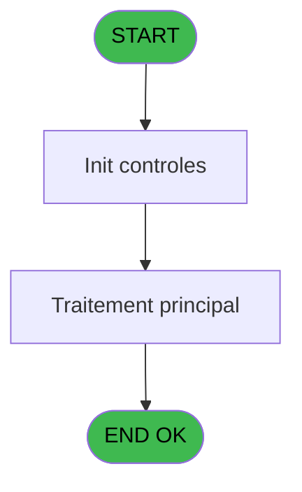
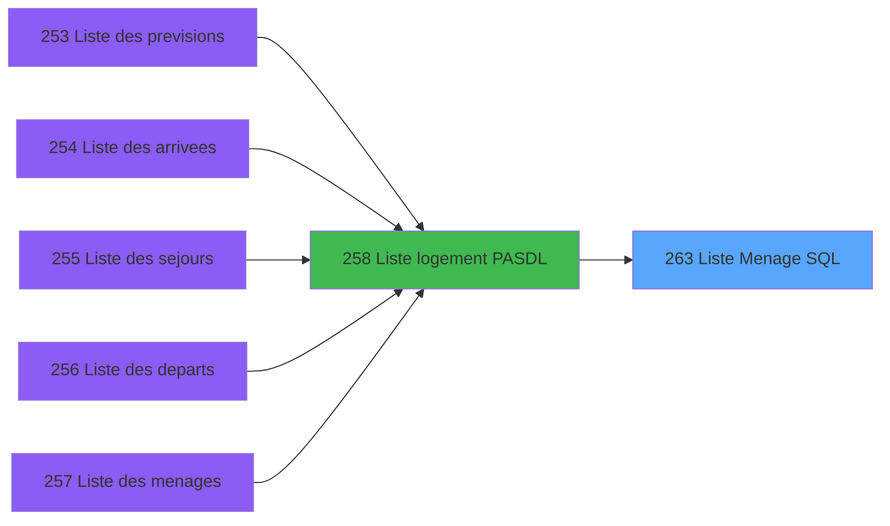

# PBP IDE 263 - Liste Menage SQL

> **Analyse**: Phases 1-4 2026-02-03 16:02 -> 16:03 (12s) | Assemblage 16:03
> **Pipeline**: V7.2 Enrichi
> **Structure**: 4 onglets (Resume | Ecrans | Donnees | Connexions)

<!-- TAB:Resume -->

## 1. FICHE D'IDENTITE

| Attribut | Valeur |
|----------|--------|
| Projet | PBP |
| IDE Position | 263 |
| Nom Programme | Liste Menage SQL |
| Fichier source | `Prg_263.xml` |
| Dossier IDE | Logement |
| Taches | 3 (0 ecrans visibles) |
| Tables modifiees | 0 |
| Programmes appeles | 0 |

## 2. DESCRIPTION FONCTIONNELLE

**Liste Menage SQL** assure la gestion complete de ce processus, accessible depuis [  Liste logement PASDL (IDE 258)](PBP-IDE-258.md).

Le flux de traitement s'organise en **1 blocs fonctionnels** :

- **Traitement** (3 taches) : traitements metier divers

**Logique metier** : 2 regles identifiees couvrant conditions metier.

## 3. BLOCS FONCTIONNELS

### 3.1 Traitement (3 taches)

Traitements internes.

---

#### 263 - Liste Menage SQL [[ECRAN]](#ecran-t1)

**Role** : Traitement : Liste Menage SQL.
**Ecran** : 789 x 543 DLU | [Voir mockup](#ecran-t1)

---

#### 263.1 - Get Baby Age

**Role** : Consultation/chargement : Get Baby Age.
**Variables liees** : CN (v.age max baby)

---

#### 263.2 - Get Room Change

**Role** : Consultation/chargement : Get Room Change.
**Variables liees** : BT (v.Room Change)

## 5. REGLES METIER

2 regles identifiees:

### Autres (2 regles)

#### [RM-001] Traitement conditionnel si VG114 AND Trim(v.Occupancy Arr [BZ])<>'',IF(Val(Trim(StrToken(v.Occupancy Arr [BZ],1,'-')),'2') est a zero

| Element | Detail |
|---------|--------|
| **Condition** | `VG114 AND Trim(v.Occupancy Arr [BZ])<>''` |
| **Si vrai** | IF(Val(Trim(StrToken(v.Occupancy Arr [BZ] |
| **Si faux** | 1,'-')),'2')=0,'14',Trim(StrToken(v.Occupancy Arr [BZ],1,'-'))),TypeOccupant [G]) |
| **Variables** | BZ (v.Occupancy Arr), G (TypeOccupant), I (Occupancy) |
| **Expression source** | Expression 15 : `IF(VG114 AND Trim(v.Occupancy Arr [BZ])<>'',IF(Val(Trim(StrT` |
| **Exemple** | Si VG114 AND Trim(v.Occupancy Arr [BZ])<>'' → IF(Val(Trim(StrToken(v.Occupancy Arr [BZ] |

#### [RM-002] Traitement si Trim(v.Age Act [BO]) est renseigne

| Element | Detail |
|---------|--------|
| **Condition** | `Trim(v.Age Act [BO])<>''` |
| **Si vrai** | ' WHERE '&Trim(v.Age Act [BO]) |
| **Si faux** | '') |
| **Variables** | BO (v.Age Act), R (Age) |
| **Expression source** | Expression 38 : `IF(Trim(v.Age Act [BO])<>'',' WHERE '&Trim(v.Age Act [BO]),'` |
| **Exemple** | Si Trim(v.Age Act [BO])<>'' → ' WHERE '&Trim(v.Age Act [BO]). Sinon → '') |

## 6. CONTEXTE

- **Appele par**: [  Liste logement PASDL (IDE 258)](PBP-IDE-258.md)
- **Appelle**: 0 programmes | **Tables**: 3 (W:0 R:2 L:1) | **Taches**: 3 | **Expressions**: 48

<!-- TAB:Ecrans -->

## 8. ECRANS

*(Programme sans ecran visible)*

## 9. NAVIGATION

### 9.3 Structure hierarchique (3 taches)

| Position | Tache | Type | Dimensions | Bloc |
|----------|-------|------|------------|------|
| **263.1** | [**Liste Menage SQL** (263)](#t1) [mockup](#ecran-t1) | - | 789x543 | Traitement |
| 263.1.1 | [Get Baby Age (263.1)](#t2) | - | - | |
| 263.1.2 | [Get Room Change (263.2)](#t3) | - | - | |

### 9.4 Algorigramme

> **Legende**: Vert = START/END OK | Rouge = END KO | Bleu = Decisions
> *Algorigramme auto-genere. Utiliser `/algorigramme` pour une synthese metier detaillee.*

<!-- TAB:Donnees -->

## 10. TABLES

### Tables utilisees (3)

| ID | Nom | Description | Type | R | W | L | Usages |
|----|-----|-------------|------|---|---|---|--------|
| 34 | hebergement______heb | Hebergement (chambres) | DB | R |   |   | 1 |
| 81 | societe__________soc |  | DB | R |   |   | 1 |
| 113 | tables_village |  | DB |   |   | L | 1 |

### Colonnes par table (2 / 2 tables avec colonnes identifiees)

Table 34 - hebergement______heb (R) - 1 usages

| Lettre | Variable | Acces | Type |
|--------|----------|-------|------|
| F | TypeHebergement | R | Unicode |

Table 81 - societe__________soc (R) - 1 usages

| Lettre | Variable | Acces | Type |
|--------|----------|-------|------|
| B | P.i.Societe | R | Unicode |

## 11. VARIABLES

### 11.1 Parametres entrants (4)

Variables recues du programme appelant ([  Liste logement PASDL (IDE 258)](PBP-IDE-258.md)).

| Lettre | Nom | Type | Usage dans |
|--------|-----|------|-----------|
| A | P.i.Date | Date | 1x parametre entrant |
| B | P.i.Societe | Unicode | 1x parametre entrant |
| C | P.i.Clause Where | Unicode | 1x parametre entrant |
| D | P.i.Zone/Secteur | Alpha | 1x parametre entrant |

### 11.2 Variables de session (45)

Variables persistantes pendant toute la session.

| Lettre | Nom | Type | Usage dans |
|--------|-----|------|-----------|
| BA | v.nb pax Act | Numeric | - |
| BB | v.nb enfant Act | Numeric | 3x session |
| BC | v.nb bb Act | Numeric | 1x session |
| BD | v.TypeOcc Actuel | Unicode | 1x session |
| BE | v.ComplTypeOcc Act | Unicode | - |
| BF | v.Occupancy Act | Unicode | - |
| BG | v.DateDebut Act | Alpha | 2x session |
| BH | v.HeureDébut Act | Unicode | - |
| BI | v.DateFin Act | Alpha | - |
| BJ | v.HeureFin Act | Unicode | - |
| BK | v.CodeFid Act | Unicode | 3x session |
| BL | v.LibFid Act | Unicode | 2x session |
| BM | v.NumCompte Act | Numeric | 2x session |
| BN | v.Filiation Act | Numeric | 1x session |
| BO | v.Age Act | Numeric | 1x session |
| BP | v.DebutSejour Act | Alpha | 1x session |
| BQ | v.FinSejour Act | Alpha | 1x session |
| BR | v.FidPriorite Act | Numeric | 2x session |
| BS | v.VIP Act | Unicode | 2x session |
| BT | v.Room Change | Unicode | [263.2](#t3) |
| BU | v.nb pax Arr | Numeric | 2x session |
| BV | v.nb enfant Arr | Numeric | 1x session |
| BW | v.nb bb Arr | Numeric | 2x session |
| BX | v.TypeOcc Arr | Unicode | - |
| BY | v.ComplTypeOcc Arr | Unicode | - |
| BZ | v.Occupancy Arr | Unicode | 1x session |
| CA | v.DateDebut Arr | Alpha | - |
| CB | v.HeureDébut Arr | Unicode | - |
| CC | v.DateFin Arr | Alpha | - |
| CD | v.HeureFin Arr | Unicode | - |
| CE | v.CodeFid Arr | Unicode | - |
| CF | v.LibFid Arr | Unicode | - |
| CG | v.NumCompte Arr | Numeric | - |
| CH | v.Filiation Arr | Numeric | - |
| CI | v.Age Arr | Numeric | - |
| CJ | v.DebutSejour Arr | Alpha | - |
| CK | v.FinSejour Arr | Alpha | - |
| CL | v.FidPriorite Arr | Numeric | - |
| CM | v.VIP Arr | Unicode | - |
| CN | v.age max baby | Numeric | - |
| CO | v.age max enfant | Numeric | - |
| CP | v.work type | Unicode | - |
| CQ | v.ligne export | Unicode | - |
| CR | v.test act | Logical | - |
| CS | v.test arr | Logical | - |

### 11.3 Autres (22)

Variables diverses.

| Lettre | Nom | Type | Usage dans |
|--------|-----|------|-----------|
| E | NumChambre | Unicode | 1x refs |
| F | TypeHebergement | Unicode | 4x refs |
| G | TypeOccupant | Unicode | 1x refs |
| H | ComplTypeOcc | Unicode | 3x refs |
| I | Occupancy | Unicode | 2x refs |
| J | DateDebut | Alpha | 5x refs |
| K | HeureDébut | Unicode | 1x refs |
| L | DateFin | Alpha | 4x refs |
| M | HeureFin | Unicode | 1x refs |
| N | CodeFid | Unicode | 7x refs |
| O | LibFid | Unicode | 9x refs |
| P | NumCompte | Numeric | 2x refs |
| Q | Filiation | Numeric | 2x refs |
| R | Age | Numeric | 3x refs |
| S | DebutSejour | Alpha | 1x refs |
| T | FinSejour | Alpha | 1x refs |
| U | FidPriorite | Numeric | 4x refs |
| V | VIP | Unicode | 4x refs |
| W | NomZone | Unicode | 1x refs |
| X | NomSecteur | Unicode | 1x refs |
| Y | Equipment | Unicode | 6x refs |
| Z | FacYourArrival | Unicode | 4x refs |

Toutes les 71 variables (liste complete)

| Cat | Lettre | Nom Variable | Type |
|-----|--------|--------------|------|
| P0 | **A** | P.i.Date | Date |
| P0 | **B** | P.i.Societe | Unicode |
| P0 | **C** | P.i.Clause Where | Unicode |
| P0 | **D** | P.i.Zone/Secteur | Alpha |
| V. | **BA** | v.nb pax Act | Numeric |
| V. | **BB** | v.nb enfant Act | Numeric |
| V. | **BC** | v.nb bb Act | Numeric |
| V. | **BD** | v.TypeOcc Actuel | Unicode |
| V. | **BE** | v.ComplTypeOcc Act | Unicode |
| V. | **BF** | v.Occupancy Act | Unicode |
| V. | **BG** | v.DateDebut Act | Alpha |
| V. | **BH** | v.HeureDébut Act | Unicode |
| V. | **BI** | v.DateFin Act | Alpha |
| V. | **BJ** | v.HeureFin Act | Unicode |
| V. | **BK** | v.CodeFid Act | Unicode |
| V. | **BL** | v.LibFid Act | Unicode |
| V. | **BM** | v.NumCompte Act | Numeric |
| V. | **BN** | v.Filiation Act | Numeric |
| V. | **BO** | v.Age Act | Numeric |
| V. | **BP** | v.DebutSejour Act | Alpha |
| V. | **BQ** | v.FinSejour Act | Alpha |
| V. | **BR** | v.FidPriorite Act | Numeric |
| V. | **BS** | v.VIP Act | Unicode |
| V. | **BT** | v.Room Change | Unicode |
| V. | **BU** | v.nb pax Arr | Numeric |
| V. | **BV** | v.nb enfant Arr | Numeric |
| V. | **BW** | v.nb bb Arr | Numeric |
| V. | **BX** | v.TypeOcc Arr | Unicode |
| V. | **BY** | v.ComplTypeOcc Arr | Unicode |
| V. | **BZ** | v.Occupancy Arr | Unicode |
| V. | **CA** | v.DateDebut Arr | Alpha |
| V. | **CB** | v.HeureDébut Arr | Unicode |
| V. | **CC** | v.DateFin Arr | Alpha |
| V. | **CD** | v.HeureFin Arr | Unicode |
| V. | **CE** | v.CodeFid Arr | Unicode |
| V. | **CF** | v.LibFid Arr | Unicode |
| V. | **CG** | v.NumCompte Arr | Numeric |
| V. | **CH** | v.Filiation Arr | Numeric |
| V. | **CI** | v.Age Arr | Numeric |
| V. | **CJ** | v.DebutSejour Arr | Alpha |
| V. | **CK** | v.FinSejour Arr | Alpha |
| V. | **CL** | v.FidPriorite Arr | Numeric |
| V. | **CM** | v.VIP Arr | Unicode |
| V. | **CN** | v.age max baby | Numeric |
| V. | **CO** | v.age max enfant | Numeric |
| V. | **CP** | v.work type | Unicode |
| V. | **CQ** | v.ligne export | Unicode |
| V. | **CR** | v.test act | Logical |
| V. | **CS** | v.test arr | Logical |
| Autre | **E** | NumChambre | Unicode |
| Autre | **F** | TypeHebergement | Unicode |
| Autre | **G** | TypeOccupant | Unicode |
| Autre | **H** | ComplTypeOcc | Unicode |
| Autre | **I** | Occupancy | Unicode |
| Autre | **J** | DateDebut | Alpha |
| Autre | **K** | HeureDébut | Unicode |
| Autre | **L** | DateFin | Alpha |
| Autre | **M** | HeureFin | Unicode |
| Autre | **N** | CodeFid | Unicode |
| Autre | **O** | LibFid | Unicode |
| Autre | **P** | NumCompte | Numeric |
| Autre | **Q** | Filiation | Numeric |
| Autre | **R** | Age | Numeric |
| Autre | **S** | DebutSejour | Alpha |
| Autre | **T** | FinSejour | Alpha |
| Autre | **U** | FidPriorite | Numeric |
| Autre | **V** | VIP | Unicode |
| Autre | **W** | NomZone | Unicode |
| Autre | **X** | NomSecteur | Unicode |
| Autre | **Y** | Equipment | Unicode |
| Autre | **Z** | FacYourArrival | Unicode |

## 12. EXPRESSIONS

**48 / 48 expressions decodees (100%)**

### 12.1 Repartition par type

| Type | Expressions | Regles |
|------|-------------|--------|
| CALCULATION | 6 | 0 |
| CONDITION | 10 | 2 |
| CONSTANTE | 8 | 0 |
| FORMAT | 7 | 0 |
| OTHER | 14 | 0 |
| CONCATENATION | 1 | 0 |
| CAST_LOGIQUE | 2 | 0 |

### 12.2 Expressions cles par type

#### CALCULATION (6 expressions)

| Type | IDE | Expression | Regle |
|------|-----|------------|-------|
| CALCULATION | 28 | `[AL]+1` | - |
| CALCULATION | 29 | `v.nb pax Arr [BU]+1` | - |
| CALCULATION | 30 | `[AM]+1` | - |
| CALCULATION | 5 | `Filiation [Q]+1` | - |
| CALCULATION | 7 | `v.Room Change [BT]+1` | - |
| ... | | *+1 autres* | |

#### CONDITION (10 expressions)

| Type | IDE | Expression | Regle |
|------|-----|------------|-------|
| CONDITION | 38 | `IF(Trim(v.Age Act [BO])<>'',' WHERE '&Trim(v.Age Act [BO]),'')` | [RM-002](#rm-RM-002) |
| CONDITION | 15 | `IF(VG114 AND Trim(v.Occupancy Arr [BZ])<>'',IF(Val(Trim(StrToken(v.Occupancy Arr [BZ],1,'-')),'2')=0,'14',Trim(StrToken(v.Occupancy Arr [BZ],1,'-'))),TypeOccupant [G])` | [RM-001](#rm-RM-001) |
| CONDITION | 10 | `DateFin [L]<>0 AND CodeFid [N]<=v.DateDebut Act [BG]` | - |
| CONDITION | 33 | `[AB]<[AJ]` | - |
| CONDITION | 39 | `Trim(Equipment [Y])='' OR TypeHebergement [F]<>[AB]` | - |
| ... | | *+5 autres* | |

#### CONSTANTE (8 expressions)

| Type | IDE | Expression | Regle |
|------|-----|------------|-------|
| CONSTANTE | 43 | `'Departure'` | - |
| CONSTANTE | 41 | `'Arrival'` | - |
| CONSTANTE | 47 | `'In Stay'` | - |
| CONSTANTE | 45 | `'Departure & Arrival'` | - |
| CONSTANTE | 3 | `''` | - |
| ... | | *+3 autres* | |

#### FORMAT (7 expressions)

| Type | IDE | Expression | Regle |
|------|-----|------------|-------|
| FORMAT | 44 | `DStr(LibFid [O],'YYYYMMDD')=[AB] AND [AF]<>0 AND [AW]=0` | - |
| FORMAT | 46 | `DStr(LibFid [O],'YYYYMMDD')=[AB] AND [AF]<>0 AND [AW]<>0` | - |
| FORMAT | 48 | `Range(DStr(LibFid [O],'YYYYMMDD'),FacYourArrival [Z],[AB]) AND [AF]<>0 AND [AW]=0AND Trim(v.nb bb Arr [BW])=''` | - |
| FORMAT | 42 | `DStr(LibFid [O],'YYYYMMDD')=FacYourArrival [Z] AND [AF]<>0 AND [AW]=0` | - |
| FORMAT | 1 | `Translate('%club_exportdata%')&'list_men_'&DStr(LibFid [O],'YYYYMMDD')&'.csv'` | - |
| ... | | *+2 autres* | |

#### OTHER (14 expressions)

| Type | IDE | Expression | Regle |
|------|-----|------------|-------|
| OTHER | 22 | `CodeFid [N]` | - |
| OTHER | 21 | `HeureFin [M]` | - |
| OTHER | 20 | `DateFin [L]` | - |
| OTHER | 23 | `FidPriorite [U]` | - |
| OTHER | 26 | `v.CodeFid Act [BK]` | - |
| ... | | *+9 autres* | |

#### CONCATENATION (1 expressions)

| Type | IDE | Expression | Regle |
|------|-----|------------|-------|
| CONCATENATION | 31 | `'Room Number'&VG36&'Room Type'&VG36&IF(v.FidPriorite Act [BR]='Z','Zone','Secteur')&VG36&'Equipment'&VG36&'Work Type'&VG36&'Cust. Type'&VG36&'Compl. Type'&VG36&'Label'&VG36&'Entry Date'&VG36&'Entry Time'&VG36&'Exit Date'&VG36&'Exit Time'&VG36&'Adults'&VG36&'Children'&VG36&'Babies'&VG36&'Loyalty'&VG36&'Room Change'&VG36&'New Entry Date'&VG36&'New Entry Time'&VG36&'New Exit Date'&VG36&'New Exit Time'&VG36&'Adults'&VG36&'Children'&VG36&'Babies'&VG36&'Loyalty'&VG36&'Cust. Type'&VG36&'Compl. Type'&VG36&'Label'` | - |

#### CAST_LOGIQUE (2 expressions)

| Type | IDE | Expression | Regle |
|------|-----|------------|-------|
| CAST_LOGIQUE | 27 | `Trim(Equipment [Y])<>'' AND Trim(Equipment [Y])<>'Vacant' AND TypeHebergement [F]=[AB] AND (IF(Trim([AP])<>'',ComplTypeOcc [H]>[AS],'TRUE'LOG) OR (Trim(DateDebut [J])<>'' AND Trim([AU])='') OR (Trim(DateDebut [J])<>'' AND v.nb enfant Act [BB]<v.TypeOcc Actuel [BD]) OR (Trim(v.CodeFid Act [BK])<>'N' AND Trim(v.NumCompte Act [BM])='N'))` | - |
| CAST_LOGIQUE | 4 | `(Trim(Equipment [Y])='' OR ComplTypeOcc [H]>[AB] OR (Trim(DateDebut [J])<>'' AND Trim([AD])='') OR (Trim(DateDebut [J])<>'' AND v.nb enfant Act [BB]<v.nb bb Act [BC]) OR (Trim(v.CodeFid Act [BK])<>'N' AND Trim(v.LibFid Act [BL])='N')) AND IF(Trim(Equipment [Y])='','TRUE'LOG,[AB]<>FidPriorite [U])` | - |

### 12.3 Toutes les expressions (48)

Voir les 48 expressions

#### CALCULATION (6)

| IDE | Expression Decodee |
|-----|-------------------|
| 5 | `Filiation [Q]+1` |
| 7 | `v.Room Change [BT]+1` |
| 9 | `Age [R]+1` |
| 28 | `[AL]+1` |
| 29 | `v.nb pax Arr [BU]+1` |
| 30 | `[AM]+1` |

#### CONDITION (10)

| IDE | Expression Decodee |
|-----|-------------------|
| 8 | `DateFin [L]<>0 AND Range(CodeFid [N],v.DateDebut Act [BG]+1,v.VIP Act [BS])` |
| 12 | `CASE(P.i.Zone/Secteur [D],'1','RDS (Responsable de Service)','2','GO/GE','3','RSP (Responsable de Pôle)','4','Commandant','5','Officiers supérieurs','6','Officiers','7','Cadets','8','Officiers subalternes',P.i.Zone/Secteur [D])` |
| 15 | `IF(VG114 AND Trim(v.Occupancy Arr [BZ])<>'',IF(Val(Trim(StrToken(v.Occupancy Arr [BZ],1,'-')),'2')=0,'14',Trim(StrToken(v.Occupancy Arr [BZ],1,'-'))),TypeOccupant [G])` |
| 38 | `IF(Trim(v.Age Act [BO])<>'',' WHERE '&Trim(v.Age Act [BO]),'')` |
| 35 | `DVal(FacYourArrival [Z],'YYYYMMDD')=LibFid [O] AND FacYourArrival [Z]>[AI]` |
| 6 | `DateFin [L]<>0 AND CodeFid [N]>v.VIP Act [BS]` |
| 10 | `DateFin [L]<>0 AND CodeFid [N]<=v.DateDebut Act [BG]` |
| 33 | `[AB]<[AJ]` |
| 39 | `Trim(Equipment [Y])='' OR TypeHebergement [F]<>[AB]` |
| 40 | `Trim(Equipment [Y])<>'' AND TypeHebergement [F]=[AB]` |

#### CONSTANTE (8)

| IDE | Expression Decodee |
|-----|-------------------|
| 2 | `0` |
| 3 | `''` |
| 32 | `'A'` |
| 34 | `'P'` |
| 41 | `'Arrival'` |
| 43 | `'Departure'` |
| 45 | `'Departure & Arrival'` |
| 47 | `'In Stay'` |

#### FORMAT (7)

| IDE | Expression Decodee |
|-----|-------------------|
| 1 | `Translate('%club_exportdata%')&'list_men_'&DStr(LibFid [O],'YYYYMMDD')&'.csv'` |
| 36 | `Trim(P.i.Date [A])&VG36&Trim(P.i.Societe [B])&VG36&IF(v.FidPriorite Act [BR]='Z',Trim(v.DebutSejour Act [BP]),Trim(v.FinSejour Act [BQ]))&VG36&Trim(v.nb enfant Arr [BV])&VG36&Trim(v.nb bb Arr [BW])&VG36&Trim(NomZone [W])&VG36&Trim(NomSecteur [X])&VG36&Trim(Equipment [Y])&IF(Trim(Equipment [Y])<>'Vacant',VG36&DStr(DVal(FacYourArrival [Z],'YYYYMMDD'),'DD/MM/YYYY')&VG36&TStr(TVal([AA],'HHMMSS'),'HH:MM:SS')&VG36&DStr(DVal([AB],'YYYYMMDD'),'DD/MM/YYYY')&VG36&TStr(TVal([AC],'HHMMSS'),'HH:MM:SS')&VG36&Trim(Str(Filiation [Q],'4'))&VG36&Trim(Str(v.Room Change [BT],'4'))&VG36&Trim(Str(Age [R],'4'))&VG36&IF(Left(NomZone [W],2)='GM' AND Trim([AE])='GO','',Trim([AE]))&IF(Trim(v.LibFid Act [BL])<>'N','-VIP','')&VG36&Trim(v.Filiation Act [BN]),'')&IF(Trim([AP])<>'',VG36&DStr(DVal([AQ],'YYYYMMDD'),'DD/MM/YYYY')&VG36&TStr(TVal([AR],'HHMMSS'),'HH:MM:SS')&VG36&DStr(DVal([AS],'YYYYMMDD'),'DD/MM/YYYY')&VG36&TStr(TVal([AT],'HHMMSS'),'HH:MM:SS')&VG36&Trim(Str([AL],'4'))&VG36&Trim(Str(v.nb pax Arr [BU],'4'))&VG36&Trim(Str([AM],'4'))&VG36&IF(Left([AN],2)='GM' AND Trim([AV])='GO','',Trim([AV]))&IF(Trim(v.NumCompte Act [BM])<>'N','-VIP','')&VG36&Trim([AN])&VG36&Trim([AO])&VG36&Trim([AP]),'')` |
| 37 | `DStr(LibFid [O],'YYYYMMDD')` |
| 42 | `DStr(LibFid [O],'YYYYMMDD')=FacYourArrival [Z] AND [AF]<>0 AND [AW]=0` |
| 44 | `DStr(LibFid [O],'YYYYMMDD')=[AB] AND [AF]<>0 AND [AW]=0` |
| 46 | `DStr(LibFid [O],'YYYYMMDD')=[AB] AND [AF]<>0 AND [AW]<>0` |
| 48 | `Range(DStr(LibFid [O],'YYYYMMDD'),FacYourArrival [Z],[AB]) AND [AF]<>0 AND [AW]=0AND Trim(v.nb bb Arr [BW])=''` |

#### OTHER (14)

| IDE | Expression Decodee |
|-----|-------------------|
| 11 | `P.i.Clause Where [C]` |
| 13 | `NumChambre [E]` |
| 14 | `TypeHebergement [F]` |
| 16 | `ComplTypeOcc [H]` |
| 17 | `Occupancy [I]` |
| 18 | `DateDebut [J]` |
| 19 | `HeureDébut [K]` |
| 20 | `DateFin [L]` |
| 21 | `HeureFin [M]` |
| 22 | `CodeFid [N]` |
| 23 | `FidPriorite [U]` |
| 24 | `VIP [V]` |
| 25 | `v.nb enfant Act [BB]` |
| 26 | `v.CodeFid Act [BK]` |

#### CONCATENATION (1)

| IDE | Expression Decodee |
|-----|-------------------|
| 31 | `'Room Number'&VG36&'Room Type'&VG36&IF(v.FidPriorite Act [BR]='Z','Zone','Secteur')&VG36&'Equipment'&VG36&'Work Type'&VG36&'Cust. Type'&VG36&'Compl. Type'&VG36&'Label'&VG36&'Entry Date'&VG36&'Entry Time'&VG36&'Exit Date'&VG36&'Exit Time'&VG36&'Adults'&VG36&'Children'&VG36&'Babies'&VG36&'Loyalty'&VG36&'Room Change'&VG36&'New Entry Date'&VG36&'New Entry Time'&VG36&'New Exit Date'&VG36&'New Exit Time'&VG36&'Adults'&VG36&'Children'&VG36&'Babies'&VG36&'Loyalty'&VG36&'Cust. Type'&VG36&'Compl. Type'&VG36&'Label'` |

#### CAST_LOGIQUE (2)

| IDE | Expression Decodee |
|-----|-------------------|
| 4 | `(Trim(Equipment [Y])='' OR ComplTypeOcc [H]>[AB] OR (Trim(DateDebut [J])<>'' AND Trim([AD])='') OR (Trim(DateDebut [J])<>'' AND v.nb enfant Act [BB]<v.nb bb Act [BC]) OR (Trim(v.CodeFid Act [BK])<>'N' AND Trim(v.LibFid Act [BL])='N')) AND IF(Trim(Equipment [Y])='','TRUE'LOG,[AB]<>FidPriorite [U])` |
| 27 | `Trim(Equipment [Y])<>'' AND Trim(Equipment [Y])<>'Vacant' AND TypeHebergement [F]=[AB] AND (IF(Trim([AP])<>'',ComplTypeOcc [H]>[AS],'TRUE'LOG) OR (Trim(DateDebut [J])<>'' AND Trim([AU])='') OR (Trim(DateDebut [J])<>'' AND v.nb enfant Act [BB]<v.TypeOcc Actuel [BD]) OR (Trim(v.CodeFid Act [BK])<>'N' AND Trim(v.NumCompte Act [BM])='N'))` |

<!-- TAB:Connexions -->

## 13. GRAPHE D'APPELS

### 13.1 Chaine depuis Main (Callers)

Main -> ... -> [  Liste logement PASDL (IDE 258)](PBP-IDE-258.md) -> **Liste Menage SQL (IDE 263)**

### 13.2 Callers

| IDE | Nom Programme | Nb Appels |
|-----|---------------|-----------|
| [258](PBP-IDE-258.md) |   Liste logement PASDL | 1 |

### 13.3 Callees (programmes appeles)

### 13.4 Detail Callees avec contexte

| IDE | Nom Programme | Appels | Contexte |
|-----|---------------|--------|----------|
| - | (aucun) | - | - |

## 14. RECOMMANDATIONS MIGRATION

### 14.1 Profil du programme

| Metrique | Valeur | Impact migration |
|----------|--------|-----------------|
| Lignes de logique | 224 | Taille moyenne |
| Expressions | 48 | Peu de logique |
| Tables WRITE | 0 | Impact faible |
| Sous-programmes | 0 | Peu de dependances |
| Ecrans visibles | 0 | Ecran unique ou traitement batch |
| Code desactive | 0% (0 / 224) | Code sain |
| Regles metier | 2 | Quelques regles a preserver |

### 14.2 Plan de migration par bloc

#### Traitement (3 taches: 1 ecran, 2 traitements)

- **Strategie** : Orchestrateur avec 1 ecrans (Razor/React) et 2 traitements backend (services).
- Les ecrans deviennent des composants UI, les traitements invisibles deviennent des services injectables.
- Decomposer les taches en services unitaires testables.

### 14.3 Dependances critiques

| Dependance | Type | Appels | Impact |
|------------|------|--------|--------|

---
*Spec DETAILED generee par Pipeline V7.2 - 2026-02-03 16:03*
