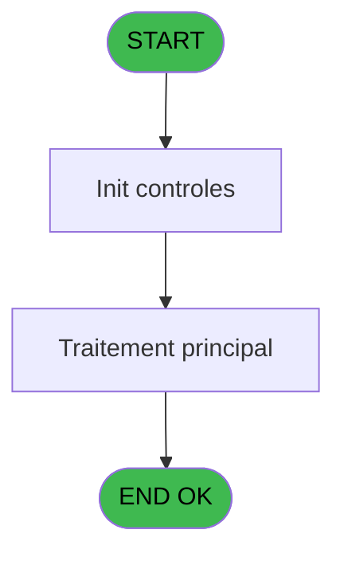
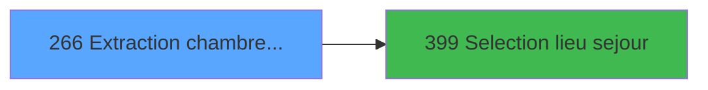

# PBP IDE 266 - Extraction chambres dispos

> **Analyse**: Phases 1-4 2026-02-03 16:03 -> 16:03 (14s) | Assemblage 16:03
> **Pipeline**: V7.2 Enrichi
> **Structure**: 4 onglets (Resume | Ecrans | Donnees | Connexions)

<!-- TAB:Resume -->

## 1. FICHE D'IDENTITE

| Attribut | Valeur |
|----------|--------|
| Projet | PBP |
| IDE Position | 266 |
| Nom Programme | Extraction chambres dispos |
| Fichier source | `Prg_266.xml` |
| Dossier IDE | Logement |
| Taches | 6 (1 ecrans visibles) |
| Tables modifiees | 0 |
| Programmes appeles | 1 |
| :warning: Statut | **ORPHELIN_POTENTIEL** |

## 2. DESCRIPTION FONCTIONNELLE

**Extraction chambres dispos** assure la gestion complete de ce processus.

Le flux de traitement s'organise en **2 blocs fonctionnels** :

- **Consultation** (4 taches) : ecrans de recherche, selection et consultation
- **Traitement** (2 taches) : traitements metier divers

Detail : phases du traitement

#### Phase 1 : Traitement (2 taches)

- **266** - Extraction des chambres dispos **[[ECRAN]](#ecran-t1)**
- **266.2.2** - Recup Disponibilite SQL

#### Phase 2 : Consultation (4 taches)

- **266.1** - Selection ligne Chambres **[[ECRAN]](#ecran-t2)**
- **266.1.1** - Selection ligne GM non loges **[[ECRAN]](#ecran-t3)**
- **266.2** - Selection ligne Chambres **[[ECRAN]](#ecran-t7)**
- **266.2.1** - Selection ligne GM non loges **[[ECRAN]](#ecran-t8)**

Delegue a : [Selection lieu sejour (IDE 399)](PBP-IDE-399.md)

## 3. BLOCS FONCTIONNELS

### 3.1 Traitement (2 taches)

Traitements internes.

---

#### 266 - Extraction des chambres dispos [[ECRAN]](#ecran-t1)

**Role** : Traitement : Extraction des chambres dispos.
**Ecran** : 317 x 226 DLU (MDI) | [Voir mockup](#ecran-t1)
**Variables liees** : V (v.nb chambres par code_loge), X (v.Ligne extraction), O (Nombre de chambres lues), P (Nombre de chambres trouvées)

---

#### 266.2.2 - Recup Disponibilite SQL

**Role** : Consultation/chargement : Recup Disponibilite SQL.

### 3.2 Consultation (4 taches)

Ecrans de recherche et consultation.

---

#### 266.1 - Selection ligne Chambres [[ECRAN]](#ecran-t2)

**Role** : Selection par l'operateur : Selection ligne Chambres.
**Ecran** : 842 x 160 DLU | [Voir mockup](#ecran-t2)
**Variables liees** : V (v.nb chambres par code_loge), X (v.Ligne extraction), O (Nombre de chambres lues), P (Nombre de chambres trouvées)
**Delegue a** : [Selection lieu sejour (IDE 399)](PBP-IDE-399.md)

---

#### 266.1.1 - Selection ligne GM non loges [[ECRAN]](#ecran-t3)

**Role** : Selection par l'operateur : Selection ligne GM non loges.
**Ecran** : 586 x 454 DLU | [Voir mockup](#ecran-t3)
**Variables liees** : X (v.Ligne extraction)
**Delegue a** : [Selection lieu sejour (IDE 399)](PBP-IDE-399.md)

---

#### 266.2 - Selection ligne Chambres [[ECRAN]](#ecran-t7)

**Role** : Selection par l'operateur : Selection ligne Chambres.
**Ecran** : 842 x 160 DLU | [Voir mockup](#ecran-t7)
**Variables liees** : V (v.nb chambres par code_loge), X (v.Ligne extraction), O (Nombre de chambres lues), P (Nombre de chambres trouvées)
**Delegue a** : [Selection lieu sejour (IDE 399)](PBP-IDE-399.md)

---

#### 266.2.1 - Selection ligne GM non loges [[ECRAN]](#ecran-t8)

**Role** : Selection par l'operateur : Selection ligne GM non loges.
**Ecran** : 586 x 454 DLU | [Voir mockup](#ecran-t8)
**Variables liees** : X (v.Ligne extraction)
**Delegue a** : [Selection lieu sejour (IDE 399)](PBP-IDE-399.md)

## 5. REGLES METIER

*(Aucune regle metier identifiee)*

## 6. CONTEXTE

- **Appele par**: (aucun)
- **Appelle**: 1 programmes | **Tables**: 6 (W:0 R:2 L:4) | **Taches**: 6 | **Expressions**: 24

<!-- TAB:Ecrans -->

## 8. ECRANS

### 8.1 Forms visibles (1 / 6)

| # | Position | Tache | Nom | Type | Largeur | Hauteur | Bloc |
|---|----------|-------|-----|------|---------|---------|------|
| 1 | 266 | 266 | Extraction des chambres dispos | MDI | 317 | 226 | Traitement |

### 8.2 Mockups Ecrans

---

#### 266 - Extraction des chambres dispos
**Tache** : [266](#t1) | **Type** : MDI | **Dimensions** : 317 x 226 DLU
**Bloc** : Traitement | **Titre IDE** : Extraction des chambres dispos

<!-- FORM-DATA:
{
    "width":  317,
    "vFactor":  8,
    "type":  "MDI",
    "hFactor":  4,
    "controls":  [
                     {
                         "x":  1,
                         "type":  "label",
                         "var":  "",
                         "y":  0,
                         "w":  316,
                         "fmt":  "",
                         "name":  "",
                         "h":  20,
                         "color":  "1",
                         "text":  "",
                         "parent":  null
                     },
                     {
                         "x":  1,
                         "type":  "label",
                         "var":  "",
                         "y":  200,
                         "w":  316,
                         "fmt":  "",
                         "name":  "",
                         "h":  24,
                         "color":  "1",
                         "text":  "",
                         "parent":  null
                     },
                     {
                         "x":  1,
                         "type":  "label",
                         "var":  "",
                         "y":  24,
                         "w":  208,
                         "fmt":  "",
                         "name":  "",
                         "h":  164,
                         "color":  "195",
                         "text":  "Paramètres",
                         "parent":  null
                     },
                     {
                         "x":  11,
                         "type":  "label",
                         "var":  "",
                         "y":  42,
                         "w":  63,
                         "fmt":  "",
                         "name":  "",
                         "h":  10,
                         "color":  "",
                         "text":  "Date Debut",
                         "parent":  6
                     },
                     {
                         "x":  11,
                         "type":  "label",
                         "var":  "",
                         "y":  64,
                         "w":  63,
                         "fmt":  "",
                         "name":  "",
                         "h":  10,
                         "color":  "",
                         "text":  "Date Fin",
                         "parent":  6
                     },
                     {
                         "x":  11,
                         "type":  "label",
                         "var":  "",
                         "y":  86,
                         "w":  63,
                         "fmt":  "",
                         "name":  "",
                         "h":  10,
                         "color":  "",
                         "text":  "Lieu de séjour",
                         "parent":  6
                     },
                     {
                         "x":  11,
                         "type":  "label",
                         "var":  "",
                         "y":  116,
                         "w":  63,
                         "fmt":  "",
                         "name":  "",
                         "h":  10,
                         "color":  "",
                         "text":  "Extraction",
                         "parent":  6
                     },
                     {
                         "x":  10,
                         "type":  "label",
                         "var":  "",
                         "y":  154,
                         "w":  106,
                         "fmt":  "",
                         "name":  "",
                         "h":  10,
                         "color":  "",
                         "text":  "Nb de chambres lues",
                         "parent":  6
                     },
                     {
                         "x":  11,
                         "type":  "label",
                         "var":  "",
                         "y":  170,
                         "w":  106,
                         "fmt":  "",
                         "name":  "",
                         "h":  10,
                         "color":  "",
                         "text":  "Nb de chambres trouvées",
                         "parent":  6
                     },
                     {
                         "x":  219,
                         "type":  "label",
                         "var":  "",
                         "y":  24,
                         "w":  96,
                         "fmt":  "",
                         "name":  "",
                         "h":  164,
                         "color":  "",
                         "text":  "",
                         "parent":  null
                     },
                     {
                         "x":  81,
                         "type":  "edit",
                         "var":  "",
                         "y":  64,
                         "w":  63,
                         "fmt":  "DD/MM/YYYYZ",
                         "name":  "w0_DateCalcul",
                         "h":  10,
                         "color":  "110",
                         "text":  "",
                         "parent":  6
                     },
                     {
                         "x":  148,
                         "type":  "button",
                         "var":  "",
                         "y":  64,
                         "w":  13,
                         "fmt":  "...",
                         "name":  "b_DateFin",
                         "h":  10,
                         "color":  "",
                         "text":  "",
                         "parent":  6
                     },
                     {
                         "x":  164,
                         "type":  "edit",
                         "var":  "",
                         "y":  64,
                         "w":  17,
                         "fmt":  "",
                         "name":  "w0_HeureFin",
                         "h":  10,
                         "color":  "110",
                         "text":  "",
                         "parent":  6
                     },
                     {
                         "x":  81,
                         "type":  "edit",
                         "var":  "",
                         "y":  86,
                         "w":  26,
                         "fmt":  "",
                         "name":  "w0_Lieu de séjour",
                         "h":  10,
                         "color":  "6",
                         "text":  "",
                         "parent":  6
                     },
                     {
                         "x":  229,
                         "type":  "button",
                         "var":  "",
                         "y":  162,
                         "w":  77,
                         "fmt":  "\u0026Extraction",
                         "name":  "b_extraire",
                         "h":  18,
                         "color":  "",
                         "text":  "",
                         "parent":  null
                     },
                     {
                         "x":  7,
                         "type":  "button",
                         "var":  "",
                         "y":  204,
                         "w":  77,
                         "fmt":  "\u0026Quitter",
                         "name":  "b_Quitter",
                         "h":  18,
                         "color":  "",
                         "text":  "",
                         "parent":  5
                     },
                     {
                         "x":  7,
                         "type":  "edit",
                         "var":  "",
                         "y":  2,
                         "w":  134,
                         "fmt":  "20",
                         "name":  "",
                         "h":  8,
                         "color":  "",
                         "text":  "",
                         "parent":  1
                     },
                     {
                         "x":  184,
                         "type":  "edit",
                         "var":  "",
                         "y":  6,
                         "w":  127,
                         "fmt":  "WWW DD MMM YYYYT",
                         "name":  "",
                         "h":  8,
                         "color":  "",
                         "text":  "",
                         "parent":  1
                     },
                     {
                         "x":  7,
                         "type":  "edit",
                         "var":  "",
                         "y":  10,
                         "w":  166,
                         "fmt":  "25",
                         "name":  "VG.NOM VILLAGE",
                         "h":  8,
                         "color":  "",
                         "text":  "",
                         "parent":  1
                     },
                     {
                         "x":  164,
                         "type":  "edit",
                         "var":  "",
                         "y":  42,
                         "w":  17,
                         "fmt":  "",
                         "name":  "w0_HeureDebut",
                         "h":  10,
                         "color":  "110",
                         "text":  "",
                         "parent":  6
                     },
                     {
                         "x":  224,
                         "type":  "image",
                         "var":  "",
                         "y":  32,
                         "w":  85,
                         "fmt":  "",
                         "name":  "",
                         "h":  104,
                         "color":  "",
                         "text":  "",
                         "parent":  23
                     },
                     {
                         "x":  81,
                         "type":  "edit",
                         "var":  "",
                         "y":  100,
                         "w":  115,
                         "fmt":  "",
                         "name":  "nom_import",
                         "h":  10,
                         "color":  "42",
                         "text":  "",
                         "parent":  6
                     },
                     {
                         "x":  145,
                         "type":  "button",
                         "var":  "",
                         "y":  86,
                         "w":  13,
                         "fmt":  "...",
                         "name":  "b.Lieu de sejour",
                         "h":  10,
                         "color":  "",
                         "text":  "",
                         "parent":  6
                     },
                     {
                         "x":  81,
                         "type":  "edit",
                         "var":  "",
                         "y":  42,
                         "w":  63,
                         "fmt":  "DD/MM/YYYYZ",
                         "name":  "w0_Datedebut",
                         "h":  10,
                         "color":  "110",
                         "text":  "",
                         "parent":  6
                     },
                     {
                         "x":  148,
                         "type":  "button",
                         "var":  "",
                         "y":  42,
                         "w":  13,
                         "fmt":  "...",
                         "name":  "b_DateDebut_0001",
                         "h":  10,
                         "color":  "",
                         "text":  "",
                         "parent":  6
                     },
                     {
                         "x":  81,
                         "type":  "radio",
                         "var":  "",
                         "y":  108,
                         "w":  70,
                         "fmt":  "",
                         "name":  "v.choix Globale / Detaille",
                         "h":  36,
                         "color":  "",
                         "text":  "G,D",
                         "parent":  6
                     },
                     {
                         "x":  126,
                         "type":  "edit",
                         "var":  "",
                         "y":  170,
                         "w":  32,
                         "fmt":  "",
                         "name":  "Nombre de chambres trouvées",
                         "h":  10,
                         "color":  "",
                         "text":  "",
                         "parent":  6
                     },
                     {
                         "x":  126,
                         "type":  "edit",
                         "var":  "",
                         "y":  154,
                         "w":  32,
                         "fmt":  "",
                         "name":  "Nombre de chambres lues_0001",
                         "h":  10,
                         "color":  "",
                         "text":  "",
                         "parent":  6
                     },
                     {
                         "x":  229,
                         "type":  "button",
                         "var":  "",
                         "y":  138,
                         "w":  77,
                         "fmt":  "E\u0026dition",
                         "name":  "b_edition",
                         "h":  18,
                         "color":  "",
                         "text":  "",
                         "parent":  23
                     }
                 ],
    "taskId":  "266",
    "height":  226
}
-->

<strong>Champs : 11 champs</strong>

| Pos (x,y) | Nom | Variable | Type |
|-----------|-----|----------|------|
| 81,64 | w0_DateCalcul | - | edit |
| 164,64 | w0_HeureFin | - | edit |
| 81,86 | w0_Lieu de séjour | - | edit |
| 7,2 | 20 | - | edit |
| 184,6 | WWW DD MMM YYYYT | - | edit |
| 7,10 | VG.NOM VILLAGE | - | edit |
| 164,42 | w0_HeureDebut | - | edit |
| 81,100 | nom_import | - | edit |
| 81,42 | w0_Datedebut | - | edit |
| 126,170 | Nombre de chambres trouvées | - | edit |
| 126,154 | Nombre de chambres lues_0001 | - | edit |

<strong>Boutons : 6 boutons</strong>

| Bouton | Pos (x,y) | Action |
|--------|-----------|--------|
| ... | 148,64 | Bouton fonctionnel |
| Extraction | 229,162 | Bouton fonctionnel |
| Quitter | 7,204 | Quitte le programme |
| ... | 145,86 | Bouton fonctionnel |
| ... | 148,42 | Bouton fonctionnel |
| Edition | 229,138 | Lance l'impression Modifie l'element |

## 9. NAVIGATION

Ecran unique: **Extraction des chambres dispos**

### 9.3 Structure hierarchique (6 taches)

| Position | Tache | Type | Dimensions | Bloc |
|----------|-------|------|------------|------|
| **266.1** | [**Extraction des chambres dispos** (266)](#t1) [mockup](#ecran-t1) | MDI | 317x226 | Traitement |
| 266.1.1 | [Recup Disponibilite SQL (266.2.2)](#t9) | - | - | |
| **266.2** | [**Selection ligne Chambres** (266.1)](#t2) [mockup](#ecran-t2) | - | 842x160 | Consultation |
| 266.2.1 | [Selection ligne GM non loges (266.1.1)](#t3) [mockup](#ecran-t3) | - | 586x454 | |
| 266.2.2 | [Selection ligne Chambres (266.2)](#t7) [mockup](#ecran-t7) | - | 842x160 | |
| 266.2.3 | [Selection ligne GM non loges (266.2.1)](#t8) [mockup](#ecran-t8) | - | 586x454 | |

### 9.4 Algorigramme

> **Legende**: Vert = START/END OK | Rouge = END KO | Bleu = Decisions
> *Algorigramme auto-genere. Utiliser `/algorigramme` pour une synthese metier detaillee.*

<!-- TAB:Donnees -->

## 10. TABLES

### Tables utilisees (6)

| ID | Nom | Description | Type | R | W | L | Usages |
|----|-----|-------------|------|---|---|---|--------|
| 30 | gm-recherche_____gmr | Index de recherche | DB |   |   | L | 2 |
| 34 | hebergement______heb | Hebergement (chambres) | DB | R |   |   | 3 |
| 103 | logement_client__loc |  | DB |   |   | L | 1 |
| 108 | code_logement____clo |  | DB |   |   | L | 1 |
| 113 | tables_village |  | DB |   |   | L | 1 |
| 118 | tables_imports |  | DB | R |   |   | 1 |

### Colonnes par table (4 / 2 tables avec colonnes identifiees)

Table 34 - hebergement______heb (R) - 3 usages

| Lettre | Variable | Acces | Type |
|--------|----------|-------|------|
| A | P.Edition_Extraction | R | Alpha |
| B | v.chambre occupéee? | R | Logical |
| C | v.occupation lendemain | R | Logical |
| D | v.nb chambres par code_loge | R | Numeric |
| E | v.nb chambre par occup/codelog | R | Numeric |
| F | v.Ligne extraction | R | Alpha |
| G | v.titre écrit | R | Logical |
| H | v.date debut dispo | R | Date |
| I | v. heure debut dispo | R | Alpha |
| J | v.date fin dispo | R | Date |
| K | v. heure_fin_dispo | R | Alpha |

Table 118 - tables_imports (R) - 1 usages

| Lettre | Variable | Acces | Type |
|--------|----------|-------|------|
| A | w0_Titre | R | Alpha |
| B | w0_Datedebut | R | Date |
| C | w0_HeureDebut | R | Alpha |
| D | w0_Datefin | R | Date |
| E | w0_HeureFin | R | Alpha |
| F | b_DateDebut | R | Alpha |
| G | b_DateFin | R | Alpha |
| H | v.choix Globale / Detaille | R | Alpha |
| I | b_extraire | R | Alpha |
| J | b_edition | R | Alpha |
| K | b_Quitter | R | Alpha |
| L | b.Lieu de séjour | R | Alpha |
| M | w0_Lieu  de séjour | R | Alpha |
| N | w0_Retour lieu de séjour | R | Logical |
| O | Nombre de chambres lues | R | Numeric |
| P | Nombre de chambres trouvées | R | Numeric |

## 11. VARIABLES

### 11.1 Variables de session (10)

Variables persistantes pendant toute la session.

| Lettre | Nom | Type | Usage dans |
|--------|-----|------|-----------|
| H | v.choix Globale / Detaille | Alpha | - |
| Q | v. libelle_type_logement | Unicode | 1x session |
| R | v.date debut dispo | Alpha | - |
| S | v. heure debut dispo | Alpha | - |
| T | v.date fin dispo | Alpha | - |
| U | v. heure_fin_dispo | Alpha | - |
| V | v.nb chambres par code_loge | Numeric | - |
| W | v.nb chambre par occup/codelog | Numeric | - |
| X | v.Ligne extraction | Alpha | - |
| Y | v.titre écrit | Logical | - |

### 11.2 Autres (15)

Variables diverses.

| Lettre | Nom | Type | Usage dans |
|--------|-----|------|-----------|
| A | w0_Titre | Alpha | - |
| B | w0_Datedebut | Date | 3x refs |
| C | w0_HeureDebut | Alpha | 3x refs |
| D | w0_Datefin | Date | - |
| E | w0_HeureFin | Alpha | - |
| F | b_DateDebut | Alpha | 3x refs |
| G | b_DateFin | Alpha | - |
| I | b_extraire | Alpha | - |
| J | b_edition | Alpha | - |
| K | b_Quitter | Alpha | 2x refs |
| L | b.Lieu de séjour | Alpha | 1x refs |
| M | w0_Lieu  de séjour | Alpha | - |
| N | w0_Retour lieu de séjour | Logical | 1x refs |
| O | Nombre de chambres lues | Numeric | - |
| P | Nombre de chambres trouvées | Numeric | - |

Toutes les 25 variables (liste complete)

| Cat | Lettre | Nom Variable | Type |
|-----|--------|--------------|------|
| V. | **H** | v.choix Globale / Detaille | Alpha |
| V. | **Q** | v. libelle_type_logement | Unicode |
| V. | **R** | v.date debut dispo | Alpha |
| V. | **S** | v. heure debut dispo | Alpha |
| V. | **T** | v.date fin dispo | Alpha |
| V. | **U** | v. heure_fin_dispo | Alpha |
| V. | **V** | v.nb chambres par code_loge | Numeric |
| V. | **W** | v.nb chambre par occup/codelog | Numeric |
| V. | **X** | v.Ligne extraction | Alpha |
| V. | **Y** | v.titre écrit | Logical |
| Autre | **A** | w0_Titre | Alpha |
| Autre | **B** | w0_Datedebut | Date |
| Autre | **C** | w0_HeureDebut | Alpha |
| Autre | **D** | w0_Datefin | Date |
| Autre | **E** | w0_HeureFin | Alpha |
| Autre | **F** | b_DateDebut | Alpha |
| Autre | **G** | b_DateFin | Alpha |
| Autre | **I** | b_extraire | Alpha |
| Autre | **J** | b_edition | Alpha |
| Autre | **K** | b_Quitter | Alpha |
| Autre | **L** | b.Lieu de séjour | Alpha |
| Autre | **M** | w0_Lieu  de séjour | Alpha |
| Autre | **N** | w0_Retour lieu de séjour | Logical |
| Autre | **O** | Nombre de chambres lues | Numeric |
| Autre | **P** | Nombre de chambres trouvées | Numeric |

## 12. EXPRESSIONS

**24 / 24 expressions decodees (100%)**

### 12.1 Repartition par type

| Type | Expressions | Regles |
|------|-------------|--------|
| CONSTANTE | 10 | 0 |
| DATE | 2 | 0 |
| CONCATENATION | 3 | 0 |
| REFERENCE_VG | 1 | 0 |
| OTHER | 4 | 0 |
| CONDITION | 3 | 0 |
| CAST_LOGIQUE | 1 | 0 |

### 12.2 Expressions cles par type

#### CONSTANTE (10 expressions)

| Type | IDE | Expression | Regle |
|------|-----|------------|-------|
| CONSTANTE | 9 | `'...'` | - |
| CONSTANTE | 8 | `'&Quitter'` | - |
| CONSTANTE | 15 | `'Lieu de séjour inconnu'` | - |
| CONSTANTE | 22 | `0` | - |
| CONSTANTE | 16 | `'G'` | - |
| ... | | *+5 autres* | |

#### DATE (2 expressions)

| Type | IDE | Expression | Regle |
|------|-----|------------|-------|
| DATE | 10 | `Date()+1` | - |
| DATE | 4 | `Date ()` | - |

#### CONCATENATION (3 expressions)

| Type | IDE | Expression | Regle |
|------|-----|------------|-------|
| CONCATENATION | 23 | `MlsTrans ('Liste des chambres disponibles')&'  '&IF(Trim (b_DateDebut [F])='G', 'Edition globale','Edition détaillée')&' '&Trim (w0_Retour lieu de séjour [N])&' '&MlsTrans ('du')&' '&DStr (w0_Datedebut [B],'DD/MM/YYYY')&' '&MlsTrans ('au')&' '&DStr (w0_HeureDebut [C],'DD/MM/YYYY')` | - |
| CONCATENATION | 20 | `Translate('%club_exportdata%')&Trim (VG33)&'_chambres_dispos_'&Trim(b_DateDebut [F])&'_'&DStr (w0_Datedebut [B],'YYYYMMDD')&'_'&DStr (w0_HeureDebut [C],'YYYYMMDD')&'.pdf'
` | - |
| CONCATENATION | 19 | `Translate('%club_exportdata%')&Trim (VG33)&'_chambres_dispos_'&Trim(b_DateDebut [F])&'_'&DStr (w0_Datedebut [B],'YYYYMMDD')&'_'&DStr (w0_HeureDebut [C],'YYYYMMDD')&'.csv'` | - |

#### REFERENCE_VG (1 expressions)

| Type | IDE | Expression | Regle |
|------|-----|------------|-------|
| REFERENCE_VG | 5 | `VG2` | - |

#### OTHER (4 expressions)

| Type | IDE | Expression | Regle |
|------|-----|------------|-------|
| OTHER | 17 | `SetCrsr(2)` | - |
| OTHER | 18 | `SetCrsr(1)` | - |
| OTHER | 11 | `GetParam('SOCIETE')` | - |
| OTHER | 12 | `b_Quitter [K]` | - |

#### CONDITION (3 expressions)

| Type | IDE | Expression | Regle |
|------|-----|------------|-------|
| CONDITION | 21 | `v. libelle_type_logement [Q]>0` | - |
| CONDITION | 14 | `b_Quitter [K]<>'' AND NOT(b.Lieu de séjour [L])` | - |
| CONDITION | 13 | `VG44>1` | - |

#### CAST_LOGIQUE (1 expressions)

| Type | IDE | Expression | Regle |
|------|-----|------------|-------|
| CAST_LOGIQUE | 24 | `'FALSE'LOG` | - |

### 12.3 Toutes les expressions (24)

Voir les 24 expressions

#### CONSTANTE (10)

| IDE | Expression Decodee |
|-----|-------------------|
| 1 | `'CSV'` |
| 2 | `'PDF'` |
| 3 | `'Extraction des chambre disponibles'` |
| 6 | `'&Extraction'` |
| 7 | `'E&dition'` |
| 8 | `'&Quitter'` |
| 9 | `'...'` |
| 15 | `'Lieu de séjour inconnu'` |
| 16 | `'G'` |
| 22 | `0` |

#### DATE (2)

| IDE | Expression Decodee |
|-----|-------------------|
| 4 | `Date ()` |
| 10 | `Date()+1` |

#### CONCATENATION (3)

| IDE | Expression Decodee |
|-----|-------------------|
| 19 | `Translate('%club_exportdata%')&Trim (VG33)&'_chambres_dispos_'&Trim(b_DateDebut [F])&'_'&DStr (w0_Datedebut [B],'YYYYMMDD')&'_'&DStr (w0_HeureDebut [C],'YYYYMMDD')&'.csv'` |
| 20 | `Translate('%club_exportdata%')&Trim (VG33)&'_chambres_dispos_'&Trim(b_DateDebut [F])&'_'&DStr (w0_Datedebut [B],'YYYYMMDD')&'_'&DStr (w0_HeureDebut [C],'YYYYMMDD')&'.pdf'
` |
| 23 | `MlsTrans ('Liste des chambres disponibles')&'  '&IF(Trim (b_DateDebut [F])='G', 'Edition globale','Edition détaillée')&' '&Trim (w0_Retour lieu de séjour [N])&' '&MlsTrans ('du')&' '&DStr (w0_Datedebut [B],'DD/MM/YYYY')&' '&MlsTrans ('au')&' '&DStr (w0_HeureDebut [C],'DD/MM/YYYY')` |

#### REFERENCE_VG (1)

| IDE | Expression Decodee |
|-----|-------------------|
| 5 | `VG2` |

#### OTHER (4)

| IDE | Expression Decodee |
|-----|-------------------|
| 11 | `GetParam('SOCIETE')` |
| 12 | `b_Quitter [K]` |
| 17 | `SetCrsr(2)` |
| 18 | `SetCrsr(1)` |

#### CONDITION (3)

| IDE | Expression Decodee |
|-----|-------------------|
| 13 | `VG44>1` |
| 14 | `b_Quitter [K]<>'' AND NOT(b.Lieu de séjour [L])` |
| 21 | `v. libelle_type_logement [Q]>0` |

#### CAST_LOGIQUE (1)

| IDE | Expression Decodee |
|-----|-------------------|
| 24 | `'FALSE'LOG` |

<!-- TAB:Connexions -->

## 13. GRAPHE D'APPELS

### 13.1 Chaine depuis Main (Callers)

**Chemin**: (pas de callers directs)

### 13.2 Callers

| IDE | Nom Programme | Nb Appels |
|-----|---------------|-----------|
| - | (aucun) | - |

### 13.3 Callees (programmes appeles)

### 13.4 Detail Callees avec contexte

| IDE | Nom Programme | Appels | Contexte |
|-----|---------------|--------|----------|
| [399](PBP-IDE-399.md) | Selection lieu sejour | 2 | Selection/consultation |

## 14. RECOMMANDATIONS MIGRATION

### 14.1 Profil du programme

| Metrique | Valeur | Impact migration |
|----------|--------|-----------------|
| Lignes de logique | 389 | Taille moyenne |
| Expressions | 24 | Peu de logique |
| Tables WRITE | 0 | Impact faible |
| Sous-programmes | 1 | Peu de dependances |
| Ecrans visibles | 1 | Ecran unique ou traitement batch |
| Code desactive | 1% (4 / 389) | Code sain |
| Regles metier | 0 | Pas de regle identifiee |

### 14.2 Plan de migration par bloc

#### Traitement (2 taches: 1 ecran, 1 traitement)

- **Strategie** : Orchestrateur avec 1 ecrans (Razor/React) et 1 traitements backend (services).
- Les ecrans deviennent des composants UI, les traitements invisibles deviennent des services injectables.
- 1 sous-programme(s) a migrer ou a reutiliser depuis les services existants.
- Decomposer les taches en services unitaires testables.

#### Consultation (4 taches: 4 ecrans, 0 traitement)

- **Strategie** : Composants de recherche/selection en modales.
- 4 ecrans : Selection ligne Chambres, Selection ligne GM non loges, Selection ligne Chambres, Selection ligne GM non loges

### 14.3 Dependances critiques

| Dependance | Type | Appels | Impact |
|------------|------|--------|--------|
| [Selection lieu sejour (IDE 399)](PBP-IDE-399.md) | Sous-programme | 2x | Haute - Selection/consultation |

---
*Spec DETAILED generee par Pipeline V7.2 - 2026-02-03 16:04*
