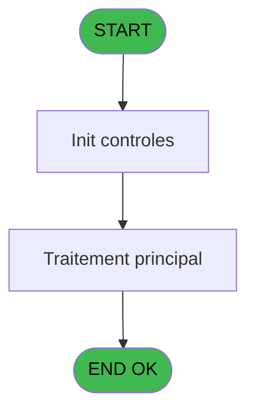

# PBP IDE 267 - Liste chambre SQL

> **Analyse**: Phases 1-4 2026-02-03 16:04 -> 16:04 (17s) | Assemblage 16:04
> **Pipeline**: V7.2 Enrichi
> **Structure**: 4 onglets (Resume | Ecrans | Donnees | Connexions)

<!-- TAB:Resume -->

## 1. FICHE D'IDENTITE

| Attribut | Valeur |
|----------|--------|
| Projet | PBP |
| IDE Position | 267 |
| Nom Programme | Liste chambre SQL |
| Fichier source | `Prg_267.xml` |
| Dossier IDE | Mecano |
| Taches | 2 (1 ecrans visibles) |
| Tables modifiees | 0 |
| Programmes appeles | 0 |
| :warning: Statut | **ORPHELIN_POTENTIEL** |

## 2. DESCRIPTION FONCTIONNELLE

**Liste chambre SQL** assure la gestion complete de ce processus.

Le flux de traitement s'organise en **1 blocs fonctionnels** :

- **Traitement** (2 taches) : traitements metier divers

## 3. BLOCS FONCTIONNELS

### 3.1 Traitement (2 taches)

Traitements internes.

---

#### 267 - Extraction [[ECRAN]](#ecran-t1)

**Role** : Traitement : Extraction.
**Ecran** : 326 x 94 DLU | [Voir mockup](#ecran-t1)

---

#### 267.1 - Liste Room SQL [[ECRAN]](#ecran-t12)

**Role** : Traitement : Liste Room SQL.
**Ecran** : 789 x 543 DLU | [Voir mockup](#ecran-t12)

## 5. REGLES METIER

*(Aucune regle metier identifiee)*

## 6. CONTEXTE

- **Appele par**: (aucun)
- **Appelle**: 0 programmes | **Tables**: 0 (W:0 R:0 L:0) | **Taches**: 2 | **Expressions**: 6

<!-- TAB:Ecrans -->

## 8. ECRANS

### 8.1 Forms visibles (1 / 2)

| # | Position | Tache | Nom | Type | Largeur | Hauteur | Bloc |
|---|----------|-------|-----|------|---------|---------|------|
| 1 | 267 | 267 | Extraction | Type0 | 326 | 94 | Traitement |

### 8.2 Mockups Ecrans

---

#### 267 - Extraction
**Tache** : [267](#t1) | **Type** : Type0 | **Dimensions** : 326 x 94 DLU
**Bloc** : Traitement | **Titre IDE** : Extraction

<!-- FORM-DATA:
{
    "width":  326,
    "vFactor":  8,
    "type":  "Type0",
    "hFactor":  4,
    "controls":  [
                     {
                         "x":  0,
                         "type":  "label",
                         "var":  "",
                         "y":  0,
                         "w":  320,
                         "fmt":  "",
                         "name":  "",
                         "h":  21,
                         "color":  "1",
                         "text":  "",
                         "parent":  null
                     },
                     {
                         "x":  0,
                         "type":  "label",
                         "var":  "",
                         "y":  68,
                         "w":  320,
                         "fmt":  "",
                         "name":  "",
                         "h":  24,
                         "color":  "1",
                         "text":  "",
                         "parent":  null
                     },
                     {
                         "x":  0,
                         "type":  "label",
                         "var":  "",
                         "y":  24,
                         "w":  320,
                         "fmt":  "",
                         "name":  "",
                         "h":  41,
                         "color":  "195",
                         "text":  "",
                         "parent":  null
                     },
                     {
                         "x":  5,
                         "type":  "edit",
                         "var":  "",
                         "y":  2,
                         "w":  160,
                         "fmt":  "20",
                         "name":  "",
                         "h":  8,
                         "color":  "",
                         "text":  "",
                         "parent":  63
                     },
                     {
                         "x":  198,
                         "type":  "edit",
                         "var":  "",
                         "y":  5,
                         "w":  120,
                         "fmt":  "WWW DD MMM YYYYT",
                         "name":  "",
                         "h":  8,
                         "color":  "",
                         "text":  "",
                         "parent":  63
                     },
                     {
                         "x":  5,
                         "type":  "edit",
                         "var":  "",
                         "y":  11,
                         "w":  160,
                         "fmt":  "25",
                         "name":  "",
                         "h":  6,
                         "color":  "",
                         "text":  "",
                         "parent":  63
                     },
                     {
                         "x":  4,
                         "type":  "button",
                         "var":  "",
                         "y":  71,
                         "w":  100,
                         "fmt":  "\u0026Extraction",
                         "name":  "b_Extraction",
                         "h":  18,
                         "color":  "",
                         "text":  "",
                         "parent":  67
                     },
                     {
                         "x":  216,
                         "type":  "button",
                         "var":  "",
                         "y":  71,
                         "w":  100,
                         "fmt":  "\u0026Quitter",
                         "name":  "",
                         "h":  18,
                         "color":  "",
                         "text":  "",
                         "parent":  67
                     }
                 ],
    "taskId":  "267",
    "height":  94
}
-->

<strong>Champs : 3 champs</strong>

| Pos (x,y) | Nom | Variable | Type |
|-----------|-----|----------|------|
| 5,2 | 20 | - | edit |
| 198,5 | WWW DD MMM YYYYT | - | edit |
| 5,11 | 25 | - | edit |

<strong>Boutons : 2 boutons</strong>

| Bouton | Pos (x,y) | Action |
|--------|-----------|--------|
| Extraction | 4,71 | Bouton fonctionnel |
| Quitter | 216,71 | Quitte le programme |

## 9. NAVIGATION

Ecran unique: **Extraction**

### 9.3 Structure hierarchique (2 taches)

| Position | Tache | Type | Dimensions | Bloc |
|----------|-------|------|------------|------|
| **267.1** | [**Extraction** (267)](#t1) [mockup](#ecran-t1) | - | 326x94 | Traitement |
| 267.1.1 | [Liste Room SQL (267.1)](#t12) [mockup](#ecran-t12) | - | 789x543 | |

### 9.4 Algorigramme

> **Legende**: Vert = START/END OK | Rouge = END KO | Bleu = Decisions
> *Algorigramme auto-genere. Utiliser `/algorigramme` pour une synthese metier detaillee.*

<!-- TAB:Donnees -->

## 10. TABLES

### Tables utilisees (0)

| ID | Nom | Description | Type | R | W | L | Usages |
|----|-----|-------------|------|---|---|---|--------|

### Colonnes par table (0 / 0 tables avec colonnes identifiees)

## 11. VARIABLES

### 11.1 Variables de session (61)

Variables persistantes pendant toute la session.

| Lettre | Nom | Type | Usage dans |
|--------|-----|------|-----------|
| A | v.  nom csv | Unicode | - |
| B | v.2 | Unicode | - |
| C | v.3 | Unicode | - |
| D | v.4 | Unicode | - |
| E | v.5 | Unicode | - |
| F | v.6 | Unicode | - |
| G | v.7 | Unicode | - |
| H | v.8 | Unicode | - |
| I | v.9 | Unicode | - |
| J | v.10 | Unicode | - |
| K | v.1 | Unicode | - |
| L | v.2 | Unicode | - |
| M | v.3 | Unicode | - |
| N | v.4 | Unicode | - |
| O | v.5n | Numeric | - |
| P | v.6 | Unicode | - |
| Q | v.7 | Unicode | - |
| R | v.8n | Numeric | - |
| S | v.9 | Unicode | - |
| T | v.10 | Unicode | - |
| U | v.1 | Unicode | - |
| V | v.2 | Unicode | - |
| W | v.3 | Unicode | - |
| X | v.4 | Unicode | - |
| Y | v.5 | Unicode | - |
| Z | v.6 | Unicode | - |
| BA | v.7 | Unicode | - |
| BB | v.8 | Unicode | - |
| BC | v.9 | Unicode | - |
| BD | v.10 | Unicode | - |
| BE | v.1 | Unicode | - |
| BF | v.2 | Unicode | - |
| BG | v.3 | Unicode | - |
| BH | v.4 | Unicode | - |
| BI | v.5 | Unicode | - |
| BJ | v.6n | Numeric | - |
| BK | v.7 | Unicode | - |
| BL | v.8 | Unicode | - |
| BM | v.9 | Unicode | - |
| BN | v.10 | Unicode | - |
| BO | v.1 | Unicode | - |
| BP | v.2 | Unicode | - |
| BQ | v.3 | Unicode | - |
| BR | v.4 | Unicode | - |
| BS | v.5 | Unicode | - |
| BT | v.6 | Unicode | - |
| BU | v.7 | Unicode | - |
| BV | v.8 | Unicode | - |
| BW | v.9 | Unicode | - |
| BX | v.10 | Unicode | - |
| BY | v.1 | Unicode | - |
| BZ | v.2 | Unicode | - |
| CA | v.3 | Unicode | - |
| CB | v.4 | Unicode | - |
| CC | v.5 | Unicode | - |
| CD | v.6 | Unicode | - |
| CE | v.7 | Unicode | - |
| CF | v.8 | Unicode | - |
| CG | v.9 | Unicode | - |
| CH | v.10 | Unicode | - |
| CI | v.export | Unicode | - |

Toutes les 61 variables (liste complete)

| Cat | Lettre | Nom Variable | Type |
|-----|--------|--------------|------|
| V. | **A** | v.  nom csv | Unicode |
| V. | **B** | v.2 | Unicode |
| V. | **C** | v.3 | Unicode |
| V. | **D** | v.4 | Unicode |
| V. | **E** | v.5 | Unicode |
| V. | **F** | v.6 | Unicode |
| V. | **G** | v.7 | Unicode |
| V. | **H** | v.8 | Unicode |
| V. | **I** | v.9 | Unicode |
| V. | **J** | v.10 | Unicode |
| V. | **K** | v.1 | Unicode |
| V. | **L** | v.2 | Unicode |
| V. | **M** | v.3 | Unicode |
| V. | **N** | v.4 | Unicode |
| V. | **O** | v.5n | Numeric |
| V. | **P** | v.6 | Unicode |
| V. | **Q** | v.7 | Unicode |
| V. | **R** | v.8n | Numeric |
| V. | **S** | v.9 | Unicode |
| V. | **T** | v.10 | Unicode |
| V. | **U** | v.1 | Unicode |
| V. | **V** | v.2 | Unicode |
| V. | **W** | v.3 | Unicode |
| V. | **X** | v.4 | Unicode |
| V. | **Y** | v.5 | Unicode |
| V. | **Z** | v.6 | Unicode |
| V. | **BA** | v.7 | Unicode |
| V. | **BB** | v.8 | Unicode |
| V. | **BC** | v.9 | Unicode |
| V. | **BD** | v.10 | Unicode |
| V. | **BE** | v.1 | Unicode |
| V. | **BF** | v.2 | Unicode |
| V. | **BG** | v.3 | Unicode |
| V. | **BH** | v.4 | Unicode |
| V. | **BI** | v.5 | Unicode |
| V. | **BJ** | v.6n | Numeric |
| V. | **BK** | v.7 | Unicode |
| V. | **BL** | v.8 | Unicode |
| V. | **BM** | v.9 | Unicode |
| V. | **BN** | v.10 | Unicode |
| V. | **BO** | v.1 | Unicode |
| V. | **BP** | v.2 | Unicode |
| V. | **BQ** | v.3 | Unicode |
| V. | **BR** | v.4 | Unicode |
| V. | **BS** | v.5 | Unicode |
| V. | **BT** | v.6 | Unicode |
| V. | **BU** | v.7 | Unicode |
| V. | **BV** | v.8 | Unicode |
| V. | **BW** | v.9 | Unicode |
| V. | **BX** | v.10 | Unicode |
| V. | **BY** | v.1 | Unicode |
| V. | **BZ** | v.2 | Unicode |
| V. | **CA** | v.3 | Unicode |
| V. | **CB** | v.4 | Unicode |
| V. | **CC** | v.5 | Unicode |
| V. | **CD** | v.6 | Unicode |
| V. | **CE** | v.7 | Unicode |
| V. | **CF** | v.8 | Unicode |
| V. | **CG** | v.9 | Unicode |
| V. | **CH** | v.10 | Unicode |
| V. | **CI** | v.export | Unicode |

## 12. EXPRESSIONS

**6 / 6 expressions decodees (100%)**

### 12.1 Repartition par type

| Type | Expressions | Regles |
|------|-------------|--------|
| FORMAT | 1 | 0 |
| DATE | 1 | 0 |
| REFERENCE_VG | 2 | 0 |
| OTHER | 1 | 0 |
| STRING | 1 | 0 |

### 12.2 Expressions cles par type

#### FORMAT (1 expressions)

| Type | IDE | Expression | Regle |
|------|-----|------------|-------|
| FORMAT | 1 | `Translate('%club_exportdata%')&'Extr_Room_'&DStr(Date(),'YYYYMMDD')&'.csv'` | - |

#### DATE (1 expressions)

| Type | IDE | Expression | Regle |
|------|-----|------------|-------|
| DATE | 2 | `Date()` | - |

#### REFERENCE_VG (2 expressions)

| Type | IDE | Expression | Regle |
|------|-----|------------|-------|
| REFERENCE_VG | 6 | `VG36` | - |
| REFERENCE_VG | 3 | `VG2` | - |

#### OTHER (1 expressions)

| Type | IDE | Expression | Regle |
|------|-----|------------|-------|
| OTHER | 4 | `GetParam ('VILLAGE')` | - |

#### STRING (1 expressions)

| Type | IDE | Expression | Regle |
|------|-----|------------|-------|
| STRING | 5 | `Trim([EJ])` | - |

<!-- TAB:Connexions -->

## 13. GRAPHE D'APPELS

### 13.1 Chaine depuis Main (Callers)

**Chemin**: (pas de callers directs)

### 13.2 Callers

| IDE | Nom Programme | Nb Appels |
|-----|---------------|-----------|
| - | (aucun) | - |

### 13.3 Callees (programmes appeles)

### 13.4 Detail Callees avec contexte

| IDE | Nom Programme | Appels | Contexte |
|-----|---------------|--------|----------|
| - | (aucun) | - | - |

## 14. RECOMMANDATIONS MIGRATION

### 14.1 Profil du programme

| Metrique | Valeur | Impact migration |
|----------|--------|-----------------|
| Lignes de logique | 70 | Programme compact |
| Expressions | 6 | Peu de logique |
| Tables WRITE | 0 | Impact faible |
| Sous-programmes | 0 | Peu de dependances |
| Ecrans visibles | 1 | Ecran unique ou traitement batch |
| Code desactive | 0% (0 / 70) | Code sain |
| Regles metier | 0 | Pas de regle identifiee |

### 14.2 Plan de migration par bloc

#### Traitement (2 taches: 2 ecrans, 0 traitement)

- **Strategie** : 2 composant(s) UI (Razor/React) avec formulaires et validation.
- Decomposer les taches en services unitaires testables.

### 14.3 Dependances critiques

| Dependance | Type | Appels | Impact |
|------------|------|--------|--------|

---
*Spec DETAILED generee par Pipeline V7.2 - 2026-02-03 16:04*
