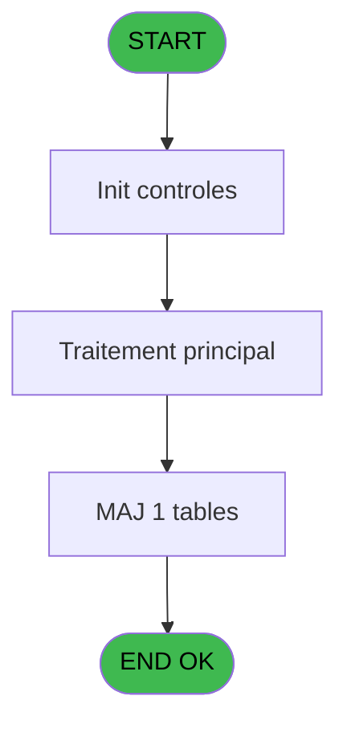
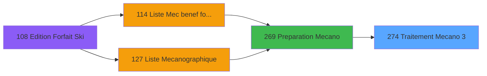

# PBP IDE 274 - Traitement Mecano 3

> **Analyse**: Phases 1-4 2026-02-03 16:06 -> 16:07 (13s) | Assemblage 16:07
> **Pipeline**: V7.2 Enrichi
> **Structure**: 4 onglets (Resume | Ecrans | Donnees | Connexions)

<!-- TAB:Resume -->

## 1. FICHE D'IDENTITE

| Attribut | Valeur |
|----------|--------|
| Projet | PBP |
| IDE Position | 274 |
| Nom Programme | Traitement Mecano 3 |
| Fichier source | `Prg_274.xml` |
| Dossier IDE | Mecano |
| Taches | 6 (1 ecrans visibles) |
| Tables modifiees | 1 |
| Programmes appeles | 0 |

## 2. DESCRIPTION FONCTIONNELLE

**Traitement Mecano 3** assure la gestion complete de ce processus, accessible depuis [Preparation Mecano (IDE 269)](PBP-IDE-269.md).

Le flux de traitement s'organise en **2 blocs fonctionnels** :

- **Traitement** (5 taches) : traitements metier divers
- **Calcul** (1 tache) : calculs de montants, stocks ou compteurs

**Donnees modifiees** : 1 tables en ecriture (tempo_facturation).

Detail : phases du traitement

#### Phase 1 : Traitement (5 taches)

- **274** - Veuillez patienter ... **[[ECRAN]](#ecran-t1)**
- **274.1** - Traitement Mecano
- **274.1.1** - Traitement Accompagne
- **274.1.1.1** - Modification Accompagne
- **274.1.1.2** - Effacage Accompagnant

#### Phase 2 : Calcul (1 tache)

- **274.2** - Comptage Mecano

#### Tables impactees

| Table | Operations | Role metier |
|-------|-----------|-------------|
| tempo_facturation | R/**W** (5 usages) | Table temporaire ecran |

## 3. BLOCS FONCTIONNELS

### 3.1 Traitement (5 taches)

Traitements internes.

---

#### 274 - Veuillez patienter ... [[ECRAN]](#ecran-t1)

**Role** : Traitement : Veuillez patienter ....
**Ecran** : 427 x 58 DLU (MDI) | [Voir mockup](#ecran-t1)

4 sous-taches directes

| Tache | Nom | Bloc |
|-------|-----|------|
| [274.1](#t2) | Traitement Mecano | Traitement |
| [274.1.1](#t3) | Traitement Accompagne | Traitement |
| [274.1.1.1](#t4) | Modification Accompagne | Traitement |
| [274.1.1.2](#t5) | Effacage Accompagnant | Traitement |

---

#### 274.1 - Traitement Mecano

**Role** : Traitement : Traitement Mecano.
**Variables liees** : B (P0-Traitement 3)

---

#### 274.1.1 - Traitement Accompagne

**Role** : Traitement : Traitement Accompagne.
**Variables liees** : B (P0-Traitement 3)

---

#### 274.1.1.1 - Modification Accompagne

**Role** : Traitement : Modification Accompagne.

---

#### 274.1.1.2 - Effacage Accompagnant

**Role** : Traitement : Effacage Accompagnant.

### 3.2 Calcul (1 tache)

Calculs metier : montants, stocks, compteurs.

---

#### 274.2 - Comptage Mecano

**Role** : Traitement : Comptage Mecano.

## 5. REGLES METIER

*(Aucune regle metier identifiee)*

## 6. CONTEXTE

- **Appele par**: [Preparation Mecano (IDE 269)](PBP-IDE-269.md)
- **Appelle**: 0 programmes | **Tables**: 1 (W:1 R:1 L:0) | **Taches**: 6 | **Expressions**: 3

<!-- TAB:Ecrans -->

## 8. ECRANS

### 8.1 Forms visibles (1 / 6)

| # | Position | Tache | Nom | Type | Largeur | Hauteur | Bloc |
|---|----------|-------|-----|------|---------|---------|------|
| 1 | 274 | 274 | Veuillez patienter ... | MDI | 427 | 58 | Traitement |

### 8.2 Mockups Ecrans

---

#### 274 - Veuillez patienter ...
**Tache** : [274](#t1) | **Type** : MDI | **Dimensions** : 427 x 58 DLU
**Bloc** : Traitement | **Titre IDE** : Veuillez patienter ...

<!-- FORM-DATA:
{
    "width":  427,
    "vFactor":  8,
    "type":  "MDI",
    "hFactor":  8,
    "controls":  [
                     {
                         "x":  0,
                         "type":  "label",
                         "var":  "",
                         "y":  0,
                         "w":  423,
                         "fmt":  "",
                         "name":  "",
                         "h":  29,
                         "color":  "",
                         "text":  "",
                         "parent":  null
                     },
                     {
                         "x":  120,
                         "type":  "label",
                         "var":  "",
                         "y":  10,
                         "w":  221,
                         "fmt":  "",
                         "name":  "",
                         "h":  8,
                         "color":  "7",
                         "text":  "Traitement en cours ...",
                         "parent":  null
                     },
                     {
                         "x":  0,
                         "type":  "label",
                         "var":  "",
                         "y":  29,
                         "w":  423,
                         "fmt":  "",
                         "name":  "",
                         "h":  27,
                         "color":  "",
                         "text":  "",
                         "parent":  null
                     },
                     {
                         "x":  72,
                         "type":  "label",
                         "var":  "",
                         "y":  38,
                         "w":  280,
                         "fmt":  "",
                         "name":  "",
                         "h":  8,
                         "color":  "",
                         "text":  "Liste mecanographique 3",
                         "parent":  null
                     },
                     {
                         "x":  4,
                         "type":  "image",
                         "var":  "",
                         "y":  2,
                         "w":  72,
                         "fmt":  "",
                         "name":  "",
                         "h":  25,
                         "color":  "",
                         "text":  "",
                         "parent":  null
                     }
                 ],
    "taskId":  "274",
    "height":  58
}
-->

## 9. NAVIGATION

Ecran unique: **Veuillez patienter ...**

### 9.3 Structure hierarchique (6 taches)

| Position | Tache | Type | Dimensions | Bloc |
|----------|-------|------|------------|------|
| **274.1** | [**Veuillez patienter ...** (274)](#t1) [mockup](#ecran-t1) | MDI | 427x58 | Traitement |
| 274.1.1 | [Traitement Mecano (274.1)](#t2) | MDI | - | |
| 274.1.2 | [Traitement Accompagne (274.1.1)](#t3) | MDI | - | |
| 274.1.3 | [Modification Accompagne (274.1.1.1)](#t4) | MDI | - | |
| 274.1.4 | [Effacage Accompagnant (274.1.1.2)](#t5) | MDI | - | |
| **274.2** | [**Comptage Mecano** (274.2)](#t6) | MDI | - | Calcul |

### 9.4 Algorigramme

> **Legende**: Vert = START/END OK | Rouge = END KO | Bleu = Decisions
> *Algorigramme auto-genere. Utiliser `/algorigramme` pour une synthese metier detaillee.*

<!-- TAB:Donnees -->

## 10. TABLES

### Tables utilisees (1)

| ID | Nom | Description | Type | R | W | L | Usages |
|----|-----|-------------|------|---|---|---|--------|
| 623 | tempo_facturation | Table temporaire ecran | TMP | R | **W** |   | 5 |

### Colonnes par table (1 / 1 tables avec colonnes identifiees)

Table 623 - tempo_facturation (R/**W**) - 5 usages

| Lettre | Variable | Acces | Type |
|--------|----------|-------|------|
| A | W2-Fin de Tache | W | Alpha |
| B | W2-Code Retour | W | Numeric |

## 11. VARIABLES

### 11.1 Autres (5)

Variables diverses.

| Lettre | Nom | Type | Usage dans |
|--------|-----|------|-----------|
| A | P0-Passe | Numeric | - |
| B | P0-Traitement 3 | Numeric | - |
| C | W0-Fin de Tache | Alpha | - |
| D | W0-Controle Avant | Numeric | 1x refs |
| E | W0-Controle Apres | Numeric | 2x refs |

## 12. EXPRESSIONS

**3 / 3 expressions decodees (100%)**

### 12.1 Repartition par type

| Type | Expressions | Regles |
|------|-------------|--------|
| CONSTANTE | 1 | 0 |
| CONDITION | 1 | 0 |
| OTHER | 1 | 0 |

### 12.2 Expressions cles par type

#### CONSTANTE (1 expressions)

| Type | IDE | Expression | Regle |
|------|-----|------------|-------|
| CONSTANTE | 1 | `'F'` | - |

#### CONDITION (1 expressions)

| Type | IDE | Expression | Regle |
|------|-----|------------|-------|
| CONDITION | 2 | `W0-Controle Avant [D]=W0-Controle Apres [E]` | - |

#### OTHER (1 expressions)

| Type | IDE | Expression | Regle |
|------|-----|------------|-------|
| OTHER | 3 | `W0-Controle Apres [E]` | - |

<!-- TAB:Connexions -->

## 13. GRAPHE D'APPELS

### 13.1 Chaine depuis Main (Callers)

Main -> ... -> [Preparation Mecano (IDE 269)](PBP-IDE-269.md) -> **Traitement Mecano 3 (IDE 274)**

### 13.2 Callers

| IDE | Nom Programme | Nb Appels |
|-----|---------------|-----------|
| [269](PBP-IDE-269.md) | Preparation Mecano | 1 |

### 13.3 Callees (programmes appeles)

### 13.4 Detail Callees avec contexte

| IDE | Nom Programme | Appels | Contexte |
|-----|---------------|--------|----------|
| - | (aucun) | - | - |

## 14. RECOMMANDATIONS MIGRATION

### 14.1 Profil du programme

| Metrique | Valeur | Impact migration |
|----------|--------|-----------------|
| Lignes de logique | 79 | Programme compact |
| Expressions | 3 | Peu de logique |
| Tables WRITE | 1 | Impact faible |
| Sous-programmes | 0 | Peu de dependances |
| Ecrans visibles | 1 | Ecran unique ou traitement batch |
| Code desactive | 0% (0 / 79) | Code sain |
| Regles metier | 0 | Pas de regle identifiee |

### 14.2 Plan de migration par bloc

#### Traitement (5 taches: 1 ecran, 4 traitements)

- **Strategie** : Orchestrateur avec 1 ecrans (Razor/React) et 4 traitements backend (services).
- Les ecrans deviennent des composants UI, les traitements invisibles deviennent des services injectables.
- Decomposer les taches en services unitaires testables.

#### Calcul (1 tache: 0 ecran, 1 traitement)

- **Strategie** : Services de calcul purs (Domain Services).
- Migrer la logique de calcul (stock, compteurs, montants)

### 14.3 Dependances critiques

| Dependance | Type | Appels | Impact |
|------------|------|--------|--------|
| tempo_facturation | Table WRITE (Temp) | 4x | Schema + repository |

---
*Spec DETAILED generee par Pipeline V7.2 - 2026-02-03 16:07*
