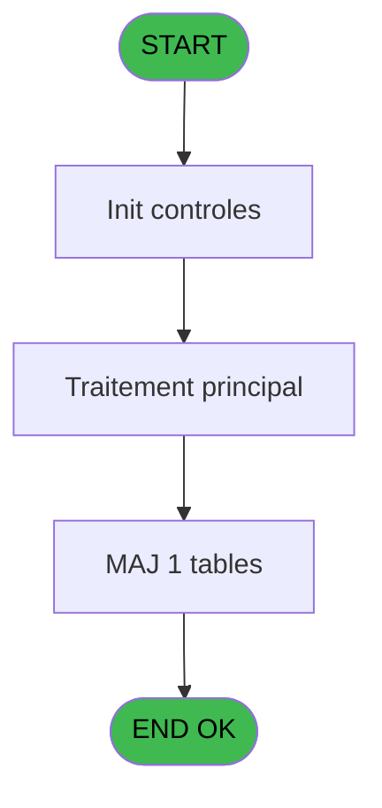
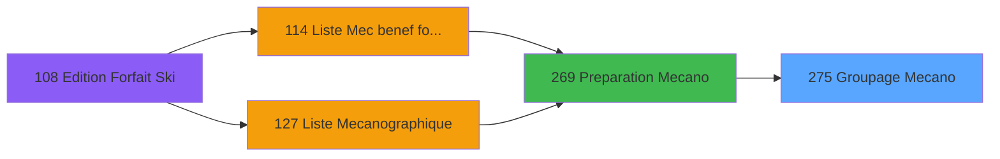
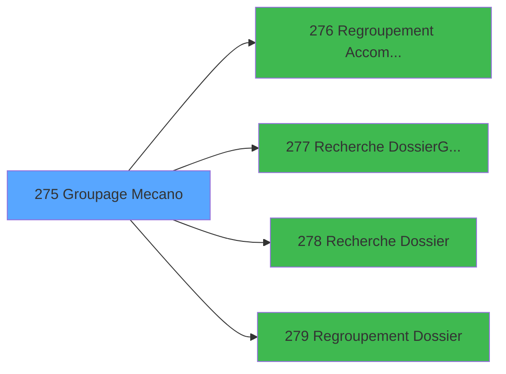

# PBP IDE 275 - Groupage Mecano

> **Analyse**: Phases 1-4 2026-02-03 16:07 -> 16:07 (11s) | Assemblage 16:07
> **Pipeline**: V7.2 Enrichi
> **Structure**: 4 onglets (Resume | Ecrans | Donnees | Connexions)

<!-- TAB:Resume -->

## 1. FICHE D'IDENTITE

| Attribut | Valeur |
|----------|--------|
| Projet | PBP |
| IDE Position | 275 |
| Nom Programme | Groupage Mecano |
| Fichier source | `Prg_275.xml` |
| Dossier IDE | Mecano |
| Taches | 9 (1 ecrans visibles) |
| Tables modifiees | 1 |
| Programmes appeles | 4 |

## 2. DESCRIPTION FONCTIONNELLE

**Groupage Mecano** assure la gestion complete de ce processus, accessible depuis [Preparation Mecano (IDE 269)](PBP-IDE-269.md).

Le flux de traitement s'organise en **4 blocs fonctionnels** :

- **Traitement** (5 taches) : traitements metier divers
- **Creation** (2 taches) : insertion d'enregistrements en base (mouvements, prestations)
- **Consultation** (1 tache) : ecrans de recherche, selection et consultation
- **Transfert** (1 tache) : transferts de donnees entre modules ou deversements

**Donnees modifiees** : 1 tables en ecriture (tempo_livre_de_porte_bresil).

Detail : phases du traitement

#### Phase 1 : Traitement (5 taches)

- **275** - Veuillez patienter ... **[[ECRAN]](#ecran-t1)**
- **275.2** - Groupage Adherent
- **275.2.1.1** - Si pas meme Num
- **275.3** - Marquage Adherent
- **275.3.1** - Marquage Groupe

Delegue a : [   Regroupement Accompagnant (IDE 276)](PBP-IDE-276.md), [   Regroupement Dossier (IDE 279)](PBP-IDE-279.md)

#### Phase 2 : Transfert (1 tache)

- **275.1** - Transfert Mecano

#### Phase 3 : Creation (2 taches)

- **275.2.1** - Creation Groupage
- **275.2.2.1** - Creation Sous-Groupage

#### Phase 4 : Consultation (1 tache)

- **275.2.2** - Recherche accompagnant

Delegue a : [   Recherche Dossier/Groupe (IDE 277)](PBP-IDE-277.md), [   Recherche Dossier (IDE 278)](PBP-IDE-278.md)

#### Tables impactees

| Table | Operations | Role metier |
|-------|-----------|-------------|
| tempo_livre_de_porte_bresil | **W**/L (6 usages) | Table temporaire ecran |

## 3. BLOCS FONCTIONNELS

### 3.1 Traitement (5 taches)

Traitements internes.

---

#### 275 - Veuillez patienter ... [[ECRAN]](#ecran-t1)

**Role** : Traitement : Veuillez patienter ....
**Ecran** : 427 x 57 DLU (MDI) | [Voir mockup](#ecran-t1)

4 sous-taches directes

| Tache | Nom | Bloc |
|-------|-----|------|
| [275.2](#t3) | Groupage Adherent | Traitement |
| [275.2.1.1](#t5) | Si pas meme Num | Traitement |
| [275.3](#t8) | Marquage Adherent | Traitement |
| [275.3.1](#t9) | Marquage Groupe | Traitement |

**Delegue a** : [   Regroupement Accompagnant (IDE 276)](PBP-IDE-276.md), [   Regroupement Dossier (IDE 279)](PBP-IDE-279.md)

---

#### 275.2 - Groupage Adherent

**Role** : Traitement : Groupage Adherent.
**Delegue a** : [   Regroupement Accompagnant (IDE 276)](PBP-IDE-276.md), [   Regroupement Dossier (IDE 279)](PBP-IDE-279.md)

---

#### 275.2.1.1 - Si pas meme Num

**Role** : Traitement : Si pas meme Num.
**Delegue a** : [   Regroupement Accompagnant (IDE 276)](PBP-IDE-276.md), [   Regroupement Dossier (IDE 279)](PBP-IDE-279.md)

---

#### 275.3 - Marquage Adherent

**Role** : Traitement : Marquage Adherent.
**Delegue a** : [   Regroupement Accompagnant (IDE 276)](PBP-IDE-276.md), [   Regroupement Dossier (IDE 279)](PBP-IDE-279.md)

---

#### 275.3.1 - Marquage Groupe

**Role** : Traitement : Marquage Groupe.
**Variables liees** : B (W1-Sous-Groupe)
**Delegue a** : [   Regroupement Accompagnant (IDE 276)](PBP-IDE-276.md), [   Regroupement Dossier (IDE 279)](PBP-IDE-279.md)

### 3.2 Transfert (1 tache)

Transfert de donnees entre modules.

---

#### 275.1 - Transfert Mecano

**Role** : Transfert de donnees : Transfert Mecano.

### 3.3 Creation (2 taches)

Insertion de nouveaux enregistrements en base.

---

#### 275.2.1 - Creation Groupage

**Role** : Creation d'enregistrement : Creation Groupage.

---

#### 275.2.2.1 - Creation Sous-Groupage

**Role** : Creation d'enregistrement : Creation Sous-Groupage.

### 3.4 Consultation (1 tache)

Ecrans de recherche et consultation.

---

#### 275.2.2 - Recherche accompagnant

**Role** : Traitement : Recherche accompagnant.
**Delegue a** : [   Recherche Dossier/Groupe (IDE 277)](PBP-IDE-277.md), [   Recherche Dossier (IDE 278)](PBP-IDE-278.md)

## 5. REGLES METIER

*(Aucune regle metier identifiee)*

## 6. CONTEXTE

- **Appele par**: [Preparation Mecano (IDE 269)](PBP-IDE-269.md)
- **Appelle**: 4 programmes | **Tables**: 3 (W:1 R:1 L:3) | **Taches**: 9 | **Expressions**: 1

<!-- TAB:Ecrans -->

## 8. ECRANS

### 8.1 Forms visibles (1 / 9)

| # | Position | Tache | Nom | Type | Largeur | Hauteur | Bloc |
|---|----------|-------|-----|------|---------|---------|------|
| 1 | 275 | 275 | Veuillez patienter ... | MDI | 427 | 57 | Traitement |

### 8.2 Mockups Ecrans

---

#### 275 - Veuillez patienter ...
**Tache** : [275](#t1) | **Type** : MDI | **Dimensions** : 427 x 57 DLU
**Bloc** : Traitement | **Titre IDE** : Veuillez patienter ...

<!-- FORM-DATA:
{
    "width":  427,
    "vFactor":  8,
    "type":  "MDI",
    "hFactor":  8,
    "controls":  [
                     {
                         "x":  0,
                         "type":  "label",
                         "var":  "",
                         "y":  0,
                         "w":  423,
                         "fmt":  "",
                         "name":  "",
                         "h":  29,
                         "color":  "",
                         "text":  "",
                         "parent":  null
                     },
                     {
                         "x":  120,
                         "type":  "label",
                         "var":  "",
                         "y":  10,
                         "w":  221,
                         "fmt":  "",
                         "name":  "",
                         "h":  8,
                         "color":  "7",
                         "text":  "Traitement en cours ...",
                         "parent":  null
                     },
                     {
                         "x":  0,
                         "type":  "label",
                         "var":  "",
                         "y":  29,
                         "w":  423,
                         "fmt":  "",
                         "name":  "",
                         "h":  27,
                         "color":  "",
                         "text":  "",
                         "parent":  null
                     },
                     {
                         "x":  69,
                         "type":  "label",
                         "var":  "",
                         "y":  38,
                         "w":  286,
                         "fmt":  "",
                         "name":  "",
                         "h":  8,
                         "color":  "",
                         "text":  "Groupement mecanographique",
                         "parent":  null
                     },
                     {
                         "x":  4,
                         "type":  "image",
                         "var":  "",
                         "y":  2,
                         "w":  72,
                         "fmt":  "",
                         "name":  "",
                         "h":  25,
                         "color":  "",
                         "text":  "",
                         "parent":  null
                     }
                 ],
    "taskId":  "275",
    "height":  57
}
-->

## 9. NAVIGATION

Ecran unique: **Veuillez patienter ...**

### 9.3 Structure hierarchique (9 taches)

| Position | Tache | Type | Dimensions | Bloc |
|----------|-------|------|------------|------|
| **275.1** | [**Veuillez patienter ...** (275)](#t1) [mockup](#ecran-t1) | MDI | 427x57 | Traitement |
| 275.1.1 | [Groupage Adherent (275.2)](#t3) | MDI | - | |
| 275.1.2 | [Si pas meme Num (275.2.1.1)](#t5) | MDI | - | |
| 275.1.3 | [Marquage Adherent (275.3)](#t8) | MDI | - | |
| 275.1.4 | [Marquage Groupe (275.3.1)](#t9) | MDI | - | |
| **275.2** | [**Transfert Mecano** (275.1)](#t2) | MDI | - | Transfert |
| **275.3** | [**Creation Groupage** (275.2.1)](#t4) | MDI | - | Creation |
| 275.3.1 | [Creation Sous-Groupage (275.2.2.1)](#t7) | MDI | - | |
| **275.4** | [**Recherche accompagnant** (275.2.2)](#t6) | MDI | - | Consultation |

### 9.4 Algorigramme

> **Legende**: Vert = START/END OK | Rouge = END KO | Bleu = Decisions
> *Algorigramme auto-genere. Utiliser `/algorigramme` pour une synthese metier detaillee.*

<!-- TAB:Donnees -->

## 10. TABLES

### Tables utilisees (3)

| ID | Nom | Description | Type | R | W | L | Usages |
|----|-----|-------------|------|---|---|---|--------|
| 622 | tempo_zone_secteur | Table temporaire ecran | TMP | R |   | L | 4 |
| 623 | tempo_facturation | Table temporaire ecran | TMP |   |   | L | 1 |
| 624 | tempo_livre_de_porte_bresil | Table temporaire ecran | TMP |   | **W** | L | 6 |

### Colonnes par table (1 / 2 tables avec colonnes identifiees)

Table 622 - tempo_zone_secteur (R/L) - 4 usages

| Lettre | Variable | Acces | Type |
|--------|----------|-------|------|
| A | bidon | R | Alpha |
| B | W1-Sous-Groupe | R | Numeric |
| C | W1-Old Numero | R | Numeric |

Table 624 - tempo_livre_de_porte_bresil (**W**/L) - 6 usages

*Table utilisee uniquement en Link ou aucune colonne Real identifiee dans le DataView.*

## 11. VARIABLES

### 11.1 Autres (3)

Variables diverses.

| Lettre | Nom | Type | Usage dans |
|--------|-----|------|-----------|
| A | W0-Fin de Tache | Alpha | - |
| B | W1-Sous-Groupe | Numeric | - |
| C | W1-Old Numero | Numeric | - |

## 12. EXPRESSIONS

**1 / 1 expressions decodees (100%)**

### 12.1 Repartition par type

| Type | Expressions | Regles |
|------|-------------|--------|
| CONSTANTE | 1 | 0 |

### 12.2 Expressions cles par type

#### CONSTANTE (1 expressions)

| Type | IDE | Expression | Regle |
|------|-----|------------|-------|
| CONSTANTE | 1 | `'F'` | - |

<!-- TAB:Connexions -->

## 13. GRAPHE D'APPELS

### 13.1 Chaine depuis Main (Callers)

Main -> ... -> [Preparation Mecano (IDE 269)](PBP-IDE-269.md) -> **Groupage Mecano (IDE 275)**

### 13.2 Callers

| IDE | Nom Programme | Nb Appels |
|-----|---------------|-----------|
| [269](PBP-IDE-269.md) | Preparation Mecano | 1 |

### 13.3 Callees (programmes appeles)

### 13.4 Detail Callees avec contexte

| IDE | Nom Programme | Appels | Contexte |
|-----|---------------|--------|----------|
| [276](PBP-IDE-276.md) |    Regroupement Accompagnant | 1 | Sous-programme |
| [277](PBP-IDE-277.md) |    Recherche Dossier/Groupe | 1 | Sous-programme |
| [278](PBP-IDE-278.md) |    Recherche Dossier | 1 | Sous-programme |
| [279](PBP-IDE-279.md) |    Regroupement Dossier | 1 | Sous-programme |

## 14. RECOMMANDATIONS MIGRATION

### 14.1 Profil du programme

| Metrique | Valeur | Impact migration |
|----------|--------|-----------------|
| Lignes de logique | 162 | Programme compact |
| Expressions | 1 | Peu de logique |
| Tables WRITE | 1 | Impact faible |
| Sous-programmes | 4 | Peu de dependances |
| Ecrans visibles | 1 | Ecran unique ou traitement batch |
| Code desactive | 0% (0 / 162) | Code sain |
| Regles metier | 0 | Pas de regle identifiee |

### 14.2 Plan de migration par bloc

#### Traitement (5 taches: 1 ecran, 4 traitements)

- **Strategie** : Orchestrateur avec 1 ecrans (Razor/React) et 4 traitements backend (services).
- Les ecrans deviennent des composants UI, les traitements invisibles deviennent des services injectables.
- 4 sous-programme(s) a migrer ou a reutiliser depuis les services existants.
- Decomposer les taches en services unitaires testables.

#### Transfert (1 tache: 0 ecran, 1 traitement)

- **Strategie** : Service `ITransfertService` avec logique de deversement.

#### Creation (2 taches: 0 ecran, 2 traitements)

- **Strategie** : Repository pattern avec Entity Framework Core.
- Insertion via `IRepository<T>.CreateAsync()`

#### Consultation (1 tache: 0 ecran, 1 traitement)

- **Strategie** : Composants de recherche/selection en modales.

### 14.3 Dependances critiques

| Dependance | Type | Appels | Impact |
|------------|------|--------|--------|
| tempo_livre_de_porte_bresil | Table WRITE (Temp) | 4x | Schema + repository |
| [   Recherche Dossier (IDE 278)](PBP-IDE-278.md) | Sous-programme | 1x | Normale - Sous-programme |
| [   Regroupement Dossier (IDE 279)](PBP-IDE-279.md) | Sous-programme | 1x | Normale - Sous-programme |
| [   Regroupement Accompagnant (IDE 276)](PBP-IDE-276.md) | Sous-programme | 1x | Normale - Sous-programme |
| [   Recherche Dossier/Groupe (IDE 277)](PBP-IDE-277.md) | Sous-programme | 1x | Normale - Sous-programme |

---
*Spec DETAILED generee par Pipeline V7.2 - 2026-02-03 16:07*
